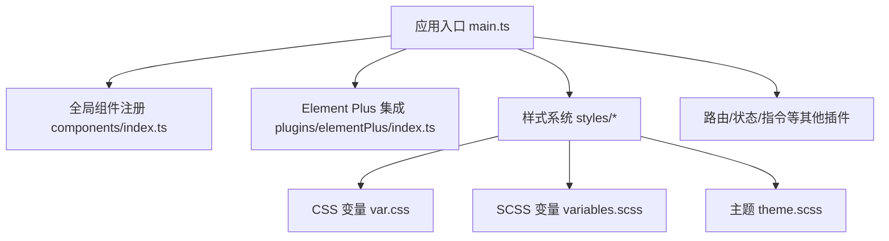
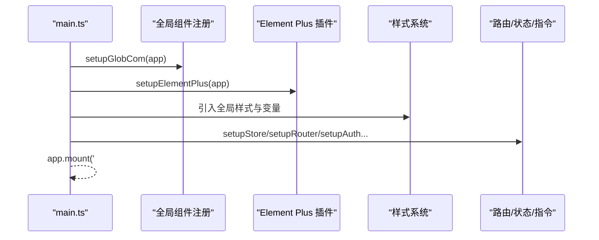
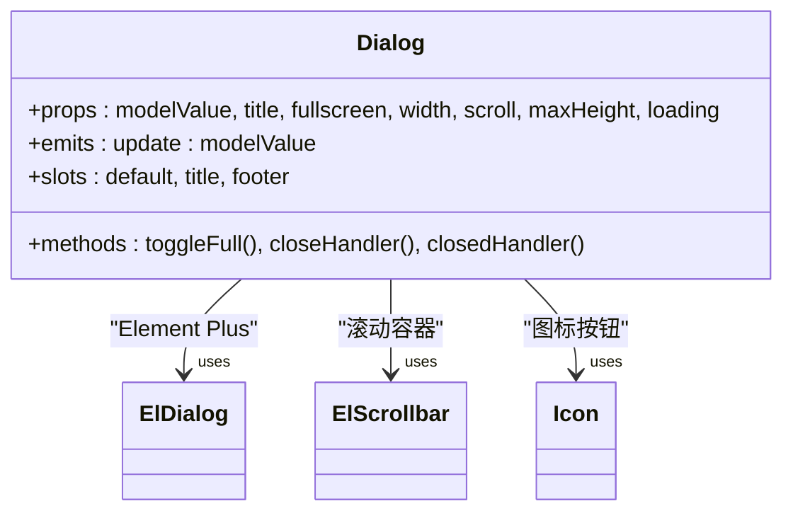
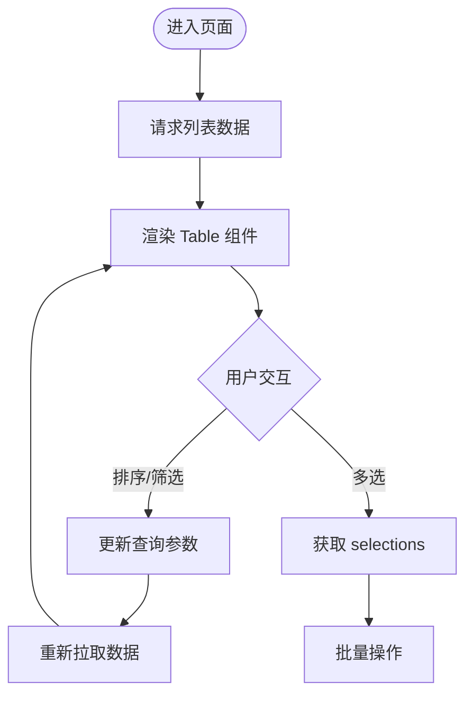
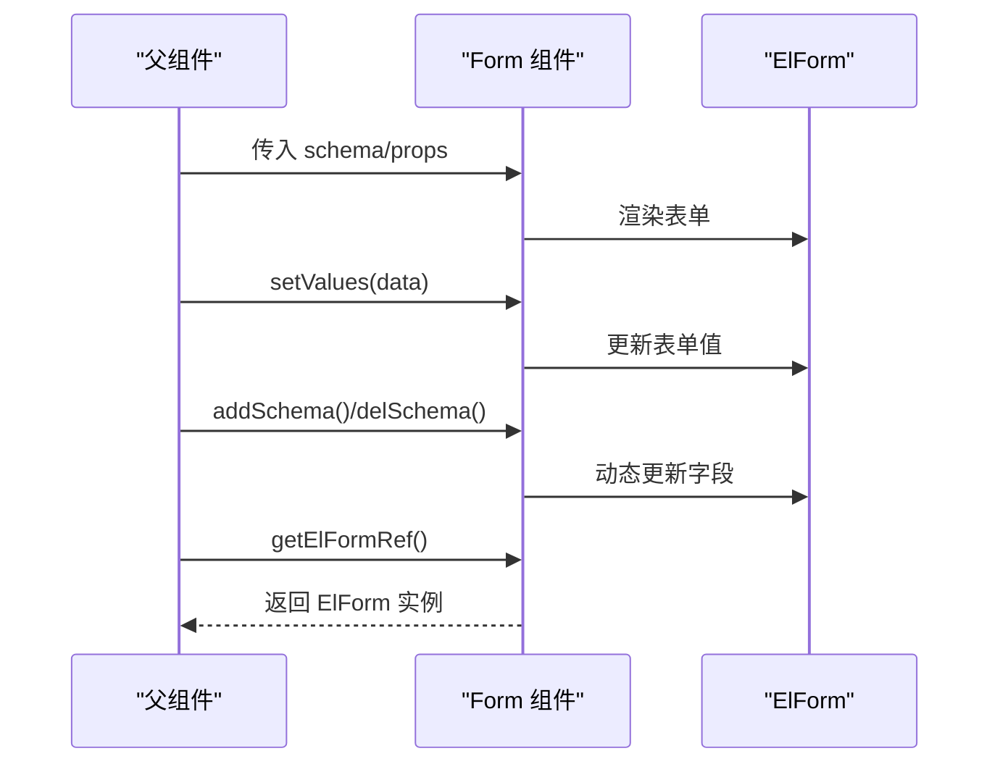
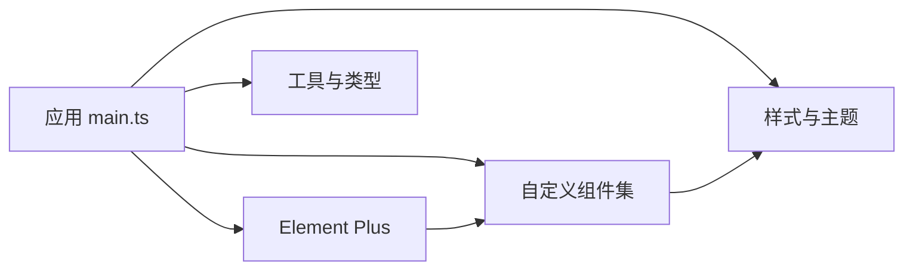

# UI组件库

<cite>
**本文引用的文件**
- [package.json](file://yudao-ui-admin-vue3/package.json)
- [main.ts](file://yudao-ui-admin-vue3/src/main.ts)
- [index.ts（全局组件注册）](file://yudao-ui-admin-vue3/src/components/index.ts)
- [elementPlus 插件入口](file://yudao-ui-admin-vue3/src/plugins/elementPlus/index.ts)
- [CSS 变量定义](file://yudao-ui-admin-vue3/src/styles/var.css)
- [主题样式占位](file://yudao-ui-admin-vue3/src/styles/theme.scss)
- [SCSS 命名空间变量](file://yudao-ui-admin-vue3/src/styles/variables.scss)
- [全局模块导出变量](file://yudao-ui-admin-vue3/src/styles/global.module.scss)
- [Element Plus 类型声明](file://yudao-ui-admin-vue3/src/types/elementPlus.d.ts)
- [Dialog 组件实现](file://yudao-ui-admin-vue3/src/components/Dialog/src/Dialog.vue)
- [Dialog 组件导出](file://yudao-ui-admin-vue3/src/components/Dialog/index.ts)
- [Table 组件导出与暴露接口](file://yudao-ui-admin-vue3/src/components/Table/index.ts)
- [Form 组件导出与暴露接口](file://yudao-ui-admin-vue3/src/components/Form/index.ts)
</cite>

## 目录
1. [简介](#简介)
2. [项目结构](#项目结构)
3. [核心组件](#核心组件)
4. [架构总览](#架构总览)
5. [详细组件分析](#详细组件分析)
6. [依赖关系分析](#依赖关系分析)
7. [性能考虑](#性能考虑)
8. [故障排查指南](#故障排查指南)
9. [结论](#结论)
10. [附录](#附录)

## 简介
本仓库为基于 Vue 3 + Vite + Element Plus 的管理后台前端工程，内置了丰富的业务与通用 UI 组件，并提供了统一的组件注册、主题变量管理、国际化、路由与状态管理等基础设施。本文聚焦于“UI 组件库”的文档：阐述自定义组件的设计理念与实现模式、Element Plus 集成方式与主题定制方案、常用业务组件的功能特性与最佳实践、样式系统与 CSS 变量管理、响应式支持、测试策略、性能优化技巧与可访问性考量，以及新组件开发规范与扩展指南。

## 项目结构
- 前端工程位于 yudao-ui-admin-vue3，采用模块化目录组织：
  - src/components：按功能划分的组件目录，每个组件通常包含 src 下的具体实现与 index.ts 导出
  - src/plugins：第三方库与基础能力集成（如 Element Plus、表单设计器、图标等）
  - src/styles：全局样式、主题变量、命名空间配置
  - src/types：类型定义，统一组件 API 的类型约束
  - src/main.ts：应用初始化流程，统一装配各子系统

图表来源
- [main.ts:1-92](file://yudao-ui-admin-vue3/src/main.ts#L1-L92)
- [index.ts（全局组件注册）:1-7](file://yudao-ui-admin-vue3/src/components/index.ts#L1-L7)
- [elementPlus 插件入口:1-18](file://yudao-ui-admin-vue3/src/plugins/elementPlus/index.ts#L1-L18)
- [CSS 变量定义:1-75](file://yudao-ui-admin-vue3/src/styles/var.css#L1-L75)
- [SCSS 命名空间变量:1-5](file://yudao-ui-admin-vue3/src/styles/variables.scss#L1-L5)
- [主题样式占位:1-7](file://yudao-ui-admin-vue3/src/styles/theme.scss#L1-L7)

章节来源
- [package.json:1-159](file://yudao-ui-admin-vue3/package.json#L1-L159)
- [main.ts:1-92](file://yudao-ui-admin-vue3/src/main.ts#L1-L92)

## 核心组件
- Dialog：封装 ElDialog，提供全屏切换、滚动区域控制、加载态、统一头部与底部插槽、遮罩居中布局等增强能力
- Table：对 ElTable 进行二次封装，暴露 setProps/setColumn/selections/elTableRef 等方法，便于表格动态配置与操作
- Form：对 ElForm 进行二次封装，暴露 setValues/setProps/addSchema/delSchema/setSchema/formModel/getElFormRef 等方法，支持动态表单构建与校验

这些组件遵循以下设计原则：
- 明确 Props/Emits/Slots 的契约，使用 TypeScript 类型约束
- 通过 ref 暴露方法，供父组件调用
- 以组合式 API 编写，逻辑清晰、易于复用
- 与 Element Plus 保持良好兼容，必要时覆盖默认样式

章节来源
- [Dialog 组件实现:1-163](file://yudao-ui-admin-vue3/src/components/Dialog/src/Dialog.vue#L1-L163)
- [Dialog 组件导出:1-4](file://yudao-ui-admin-vue3/src/components/Dialog/index.ts#L1-L4)
- [Table 组件导出与暴露接口:1-14](file://yudao-ui-admin-vue3/src/components/Table/index.ts#L1-L14)
- [Form 组件导出与暴露接口:1-16](file://yudao-ui-admin-vue3/src/components/Form/index.ts#L1-L16)

## 架构总览
应用启动时，main.ts 依次完成多语言、状态管理、全局组件、Element Plus、表单设计器、路由、指令等的初始化，最后挂载根组件。Element Plus 通过按需引入部分组件与插件，减少打包体积；同时通过 SCSS 变量与 CSS 变量统一管理主题与品牌色。

图表来源
- [main.ts:1-92](file://yudao-ui-admin-vue3/src/main.ts#L1-L92)
- [elementPlus 插件入口:1-18](file://yudao-ui-admin-vue3/src/plugins/elementPlus/index.ts#L1-L18)
- [index.ts（全局组件注册）:1-7](file://yudao-ui-admin-vue3/src/components/index.ts#L1-L7)

## 详细组件分析

### Dialog 组件
- 设计理念：在 ElDialog 基础上增强全屏模式、滚动区域高度自适应、加载态占位、统一头部按钮与关闭行为，提升一致性与易用性
- 属性与事件：
  - modelValue：双向绑定显示状态
  - title：标题
  - fullscreen：是否允许全屏
  - width：宽度
  - scroll/maxHeight：内容区滚动与最大高度
  - loading：加载态
  - emits：update:modelValue
- 关键实现要点：
  - 过滤不需要透传给 ElDialog 的属性，避免冲突
  - 根据全屏状态动态计算内容区高度
  - 使用 ElScrollbar 包裹内容区，保证滚动体验
  - 通过插槽自定义标题与底部

图表来源
- [Dialog 组件实现:1-163](file://yudao-ui-admin-vue3/src/components/Dialog/src/Dialog.vue#L1-L163)

章节来源
- [Dialog 组件实现:1-163](file://yudao-ui-admin-vue3/src/components/Dialog/src/Dialog.vue#L1-L163)
- [Dialog 组件导出:1-4](file://yudao-ui-admin-vue3/src/components/Dialog/index.ts#L1-L4)

### Table 组件
- 设计理念：对 ElTable 进行统一封装，提供动态列配置、批量选择、实例方法暴露，简化复杂表格场景
- 暴露接口：
  - setProps：动态更新表格属性
  - setColumn：动态更新列配置
  - selections：当前选中行数据
  - elTableRef：底层 ElTable 实例引用

图表来源
- [Table 组件导出与暴露接口:1-14](file://yudao-ui-admin-vue3/src/components/Table/index.ts#L1-L14)

章节来源
- [Table 组件导出与暴露接口:1-14](file://yudao-ui-admin-vue3/src/components/Table/index.ts#L1-L14)

### Form 组件
- 设计理念：对 ElForm 进行统一封装，支持动态 schema 构建、字段增删改、表单模型集中管理
- 暴露接口：
  - setValues：设置表单值
  - setProps：动态更新表单属性
  - addSchema/delSchema/setSchema：动态调整表单结构
  - formModel：表单数据模型
  - getElFormRef：获取底层 ElForm 实例

图表来源
- [Form 组件导出与暴露接口:1-16](file://yudao-ui-admin-vue3/src/components/Form/index.ts#L1-L16)

章节来源
- [Form 组件导出与暴露接口:1-16](file://yudao-ui-admin-vue3/src/components/Form/index.ts#L1-L16)

### 常用业务组件概览
- 编辑器类：Editor、JsonEditor、DiyEditor、MagicCubeEditor
- 可视化类：Echart、Map、SimpleProcessDesignerV2、Tinyflow
- 展示类：Descriptions、Card、SummaryCard、OperateLogV2
- 输入类：InputPassword、ColorInput、UploadFile、Qrcode、Crontab
- 工具类：Search、Pagination、Tooltip、Sticky、Backtop、IFrame、MarkdownView

说明：以上组件均遵循一致的目录结构与导出约定，便于统一管理与按需引入。

## 依赖关系分析
- 运行时依赖：Vue 3、Element Plus、Axios、Pinia、Vue Router、i18n、ECharts、富文本、视频播放器等
- 构建与开发依赖：Vite、TypeScript、ESLint、Stylelint、Prettier、UnoCSS、自动导入与按需引入插件

图表来源
- [package.json:31-96](file://yudao-ui-admin-vue3/package.json#L31-L96)
- [main.ts:1-92](file://yudao-ui-admin-vue3/src/main.ts#L1-L92)

章节来源
- [package.json:1-159](file://yudao-ui-admin-vue3/package.json#L1-L159)

## 性能考虑
- 按需引入：通过 unplugin-element-plus 与 unplugin-vue-components 实现组件与样式的按需加载，减少包体
- 资源压缩：启用 vite-plugin-compression 进行 gzip/brotli 压缩
- 预构建与缓存：合理使用 Vite 缓存与增量编译，缩短冷启动时间
- 图片与图标：使用 SVG 图标与雪碧图，减少 HTTP 请求
- 列表与表格：分页加载、虚拟滚动（如需）、懒加载图片与组件
- 网络请求：合理缓存、防抖节流、错误重试与超时控制
- 首屏优化：路由懒加载、骨架屏、关键 CSS 内联

[本节为通用指导，不直接分析具体文件]

## 故障排查指南
- 样式覆盖问题：检查 SCSS 命名空间与 CSS 变量是否正确引入，确认主题变量优先级
- 组件未生效：确认是否在 main.ts 中正确注册或按需引入，检查组件导出路径
- 弹窗滚动异常：检查 Dialog 的 scroll 与 maxHeight 配置，确保 ElScrollbar 正确使用
- 表单校验失败：检查 schema 定义与规则，确认 setValues 后触发校验
- 构建报错：检查依赖版本与 Node/pnpm 版本要求，清理缓存后重试

章节来源
- [SCSS 命名空间变量:1-5](file://yudao-ui-admin-vue3/src/styles/variables.scss#L1-L5)
- [CSS 变量定义:1-75](file://yudao-ui-admin-vue3/src/styles/var.css#L1-L75)
- [Dialog 组件实现:1-163](file://yudao-ui-admin-vue3/src/components/Dialog/src/Dialog.vue#L1-L163)
- [Form 组件导出与暴露接口:1-16](file://yudao-ui-admin-vue3/src/components/Form/index.ts#L1-L16)

## 结论
本项目以 Vue 3 + Element Plus 为基础，构建了统一、可扩展的 UI 组件体系。通过清晰的组件契约、完善的样式变量与主题机制、合理的依赖与构建配置，实现了良好的可维护性与扩展性。建议在新组件开发中严格遵循现有规范，持续完善类型定义、测试与文档，保障组件质量与一致性。

[本节为总结，不直接分析具体文件]

## 附录

### Element Plus 集成与主题定制
- 集成方式：在 main.ts 中调用 setupElementPlus，按需引入必要组件与插件（如 ElLoading、ElButton、ElScrollbar），并通过 unplugin-element-plus 实现按需加载
- 主题定制：
  - 使用 SCSS 变量与 CSS 变量统一管理品牌色与布局尺寸
  - 通过覆盖 Element Plus 的 CSS 变量或样式类名实现主题切换
  - 利用 dark 类切换深色模式背景等

章节来源
- [elementPlus 插件入口:1-18](file://yudao-ui-admin-vue3/src/plugins/elementPlus/index.ts#L1-L18)
- [CSS 变量定义:1-75](file://yudao-ui-admin-vue3/src/styles/var.css#L1-L75)
- [主题样式占位:1-7](file://yudao-ui-admin-vue3/src/styles/theme.scss#L1-L7)
- [SCSS 命名空间变量:1-5](file://yudao-ui-admin-vue3/src/styles/variables.scss#L1-L5)

### 组件接口定义、属性配置与事件处理
- 统一使用 TypeScript 定义 Props、Emits、Slots 与暴露方法
- 对外暴露最小必要接口，内部细节隐藏，降低耦合
- 事件命名遵循 Vue 约定，如 update:modelValue、@close 等

章节来源
- [Dialog 组件实现:1-163](file://yudao-ui-admin-vue3/src/components/Dialog/src/Dialog.vue#L1-L163)
- [Table 组件导出与暴露接口:1-14](file://yudao-ui-admin-vue3/src/components/Table/index.ts#L1-L14)
- [Form 组件导出与暴露接口:1-16](file://yudao-ui-admin-vue3/src/components/Form/index.ts#L1-L16)

### 样式系统与 CSS 变量管理
- 全局变量：在 var.css 中定义布局、颜色、尺寸等 CSS 变量
- 命名空间：通过 variables.scss 定义 $namespace 与 $elNamespace，统一样式前缀
- 主题：theme.scss 作为主题占位，可按需扩展
- 模块导出：global.module.scss 导出命名空间变量供其他模块使用

章节来源
- [CSS 变量定义:1-75](file://yudao-ui-admin-vue3/src/styles/var.css#L1-L75)
- [SCSS 命名空间变量:1-5](file://yudao-ui-admin-vue3/src/styles/variables.scss#L1-L5)
- [主题样式占位:1-7](file://yudao-ui-admin-vue3/src/styles/theme.scss#L1-L7)
- [全局模块导出变量:1-7](file://yudao-ui-admin-vue3/src/styles/global.module.scss#L1-L7)

### 响应式设计支持
- 使用 UnoCSS 原子化样式与断点工具类，快速实现响应式布局
- 结合 CSS 变量与媒体查询，适配不同屏幕尺寸
- 组件内部通过相对单位与弹性布局，提升自适应能力

[本节为通用指导，不直接分析具体文件]

### 组件测试策略
- 单元测试：针对组件方法与逻辑分支，使用 Vitest/Jest 进行测试
- 组件测试：使用 Vue Test Utils 模拟 DOM 与事件，验证交互行为
- 端到端测试：使用 Cypress/Playwright 覆盖关键业务流程
- 回归测试：对常用组件建立用例集，确保升级兼容性

[本节为通用指导，不直接分析具体文件]

### 可访问性考虑
- 语义化标签与 ARIA 属性：为交互元素添加必要的 aria-* 属性
- 键盘导航：确保 Tab/Enter/Escape 等键可用
- 焦点管理：弹窗打开/关闭时正确设置焦点
- 对比度与可读性：遵循 WCAG 标准，保证文字与背景对比度

[本节为通用指导，不直接分析具体文件]

### 新组件开发规范与扩展指南
- 目录结构：每个组件独立目录，src 下放置实现，index.ts 统一导出
- 命名规范：组件名 PascalCase，文件名与目录名保持一致
- 类型定义：在 types 目录下补充类型，或在组件内定义
- 样式规范：优先使用 CSS 变量与原子化样式，避免硬编码
- 文档与示例：为组件提供使用说明、API 表与示例代码
- 发布与版本：遵循语义化版本，记录变更日志

[本节为通用指导，不直接分析具体文件]