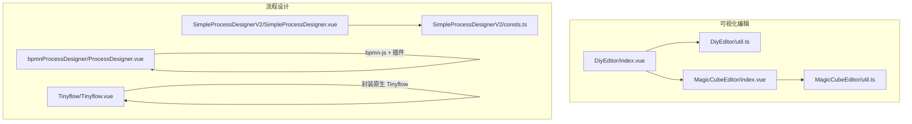
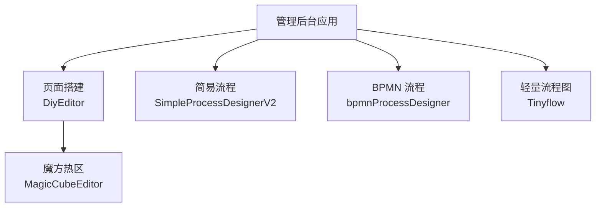
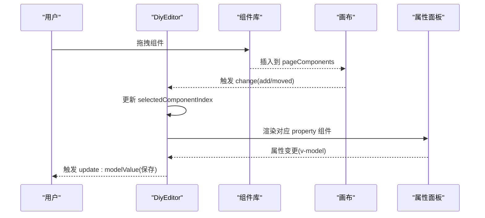
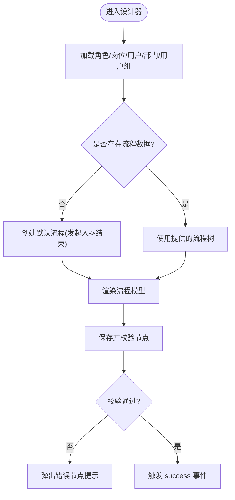
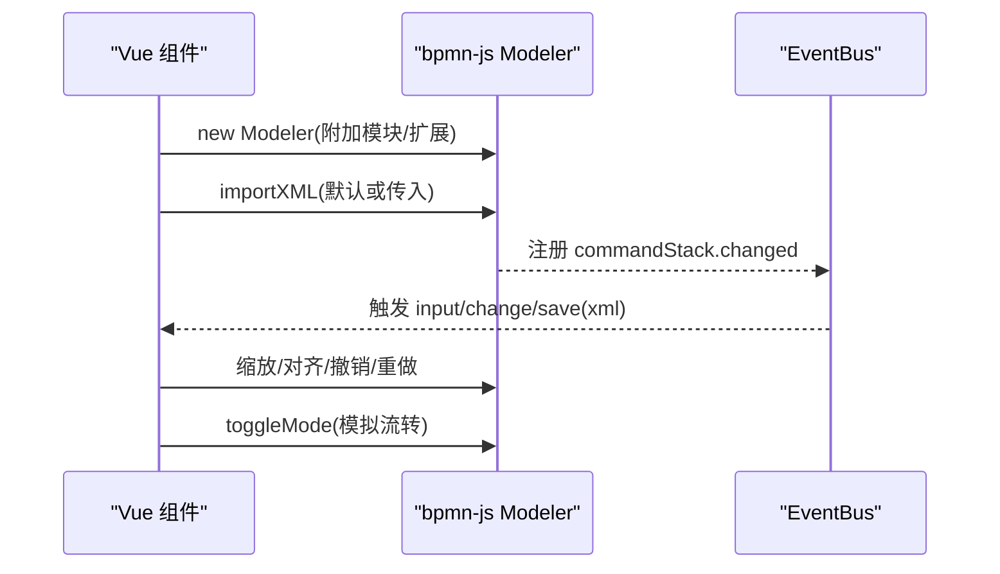
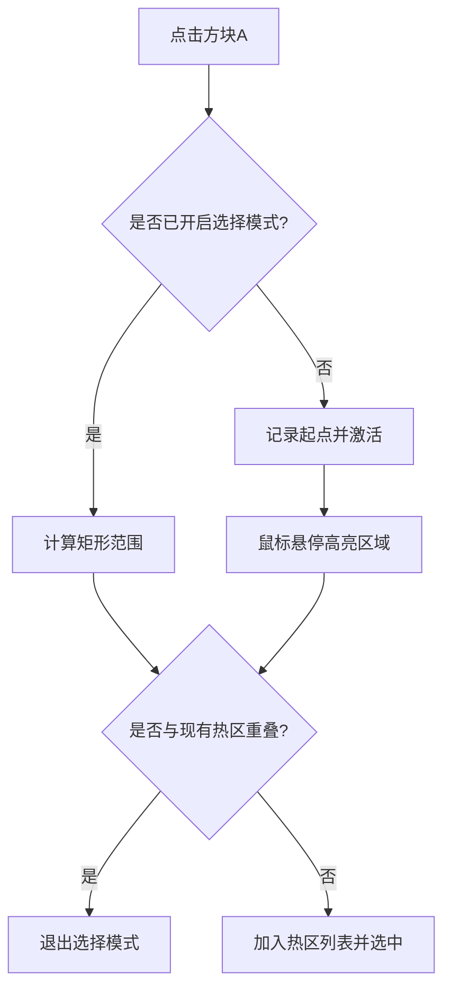
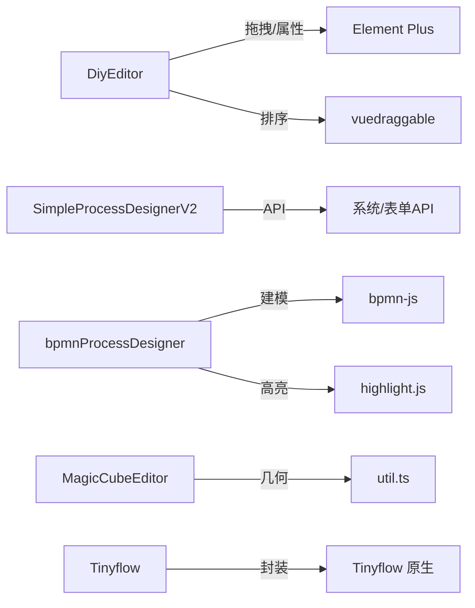

# 业务组件

<cite>
**本文引用的文件**
- [DiyEditor/index.vue](file://yudao-ui-admin-vue3/src/components/DiyEditor/index.vue)
- [DiyEditor/util.ts](file://yudao-ui-admin-vue3/src/components/DiyEditor/util.ts)
- [SimpleProcessDesignerV2/SimpleProcessDesigner.vue](file://yudao-ui-admin-vue3/src/components/SimpleProcessDesignerV2/src/SimpleProcessDesigner.vue)
- [SimpleProcessDesignerV2/consts.ts](file://yudao-ui-admin-vue3/src/components/SimpleProcessDesignerV2/src/consts.ts)
- [bpmnProcessDesigner/ProcessDesigner.vue](file://yudao-ui-admin-vue3/src/components/bpmnProcessDesigner/package/designer/ProcessDesigner.vue)
- [MagicCubeEditor/index.vue](file://yudao-ui-admin-vue3/src/components/MagicCubeEditor/index.vue)
- [MagicCubeEditor/util.ts](file://yudao-ui-admin-vue3/src/components/MagicCubeEditor/util.ts)
- [Tinyflow/Tinyflow.vue](file://yudao-ui-admin-vue3/src/components/Tinyflow/Tinyflow.vue)
</cite>

## 目录
1. [简介](#简介)
2. [项目结构](#项目结构)
3. [核心组件](#核心组件)
4. [架构总览](#架构总览)
5. [详细组件分析](#详细组件分析)
6. [依赖关系分析](#依赖关系分析)
7. [性能考虑](#性能考虑)
8. [故障排查指南](#故障排查指南)
9. [结论](#结论)
10. [附录：扩展与自定义开发指南](#附录：扩展与自定义开发指南)

## 简介
本文件面向业务专用可视化编辑与流程设计组件，系统性说明以下能力：
- 页面搭建编辑器（DiyEditor）：拖拽式页面构建、组件属性配置、实时预览。
- 简易流程设计器（SimpleProcessDesignerV2）：节点化流程编排、条件分支、事件监听与超时/拒绝等处理策略。
- BPMN 业务流程设计器（bpmnProcessDesigner）：基于 bpmn-js 的标准建模、多引擎扩展（Camunda/Flowable/Activiti）、模拟流转、XML/SVG/BPMN 导出。
- 魔方编辑器（MagicCubeEditor）：网格热区绘制与冲突检测，用于复杂交互区域定义。
- 流程图编辑器（Tinyflow）：轻量级流程图容器封装，支持数据与 Provider 注入。

目标读者包括前端开发者、产品与运营人员，帮助快速理解各组件职责、集成方式与扩展规范。

## 项目结构
本项目将可视化编辑与流程设计能力以独立 Vue 组件形式组织在 yudao-ui-admin-vue3 的 components 目录下，便于在多页面复用与按需引入。

图表来源
- [DiyEditor/index.vue:1-178](file://yudao-ui-admin-vue3/src/components/DiyEditor/index.vue#L1-L178)
- [DiyEditor/util.ts:1-126](file://yudao-ui-admin-vue3/src/components/DiyEditor/util.ts#L1-L126)
- [MagicCubeEditor/index.vue:1-48](file://yudao-ui-admin-vue3/src/components/MagicCubeEditor/index.vue#L1-L48)
- [MagicCubeEditor/util.ts:1-73](file://yudao-ui-admin-vue3/src/components/MagicCubeEditor/util.ts#L1-L73)
- [SimpleProcessDesignerV2/SimpleProcessDesigner.vue:1-234](file://yudao-ui-admin-vue3/src/components/SimpleProcessDesignerV2/src/SimpleProcessDesigner.vue#L1-L234)
- [SimpleProcessDesignerV2/consts.ts:1-800](file://yudao-ui-admin-vue3/src/components/SimpleProcessDesignerV2/src/consts.ts#L1-L800)
- [bpmnProcessDesigner/ProcessDesigner.vue:1-658](file://yudao-ui-admin-vue3/src/components/bpmnProcessDesigner/package/designer/ProcessDesigner.vue#L1-L658)
- [Tinyflow/Tinyflow.vue:1-64](file://yudao-ui-admin-vue3/src/components/Tinyflow/Tinyflow.vue#L1-L64)

章节来源
- [DiyEditor/index.vue:1-178](file://yudao-ui-admin-vue3/src/components/DiyEditor/index.vue#L1-L178)
- [DiyEditor/util.ts:1-126](file://yudao-ui-admin-vue3/src/components/DiyEditor/util.ts#L1-L126)
- [SimpleProcessDesignerV2/SimpleProcessDesigner.vue:1-234](file://yudao-ui-admin-vue3/src/components/SimpleProcessDesignerV2/src/SimpleProcessDesigner.vue#L1-L234)
- [bpmnProcessDesigner/ProcessDesigner.vue:1-658](file://yudao-ui-admin-vue3/src/components/bpmnProcessDesigner/package/designer/ProcessDesigner.vue#L1-L658)
- [MagicCubeEditor/index.vue:1-272](file://yudao-ui-admin-vue3/src/components/MagicCubeEditor/index.vue#L1-L272)
- [Tinyflow/Tinyflow.vue:1-64](file://yudao-ui-admin-vue3/src/components/Tinyflow/Tinyflow.vue#L1-L64)

## 核心组件
- DiyEditor 页面搭建编辑器：提供顶部工具栏、左侧组件库、中间画布、右侧属性面板；支持拖拽排序、复制删除、固定定位组件、页面/导航栏/底部菜单配置与预览。
- SimpleProcessDesignerV2 简易流程设计器：以树形模型驱动流程节点，内置多种节点类型与校验逻辑，支持表单字段、角色/岗位/用户/部门/用户组等候选人与审批策略配置。
- bpmnProcessDesigner 业务流程设计器：基于 bpmn-js 的完整建模能力，支持导入/导出 XML/SVG/BPMN、视图缩放对齐、撤销重做、模拟流转、翻译与多引擎 Moddle 扩展。
- MagicCubeEditor 魔方编辑器：网格矩阵上通过两次点击创建矩形热区，自动检测重叠并高亮选中区域，输出热区坐标集合。
- Tinyflow 流程图编辑器：对第三方 Tinyflow 进行 Vue 封装，提供 data 与 provider 注入，暴露 getData 方法获取当前图数据。

章节来源
- [DiyEditor/index.vue:187-460](file://yudao-ui-admin-vue3/src/components/DiyEditor/index.vue#L187-L460)
- [SimpleProcessDesignerV2/SimpleProcessDesigner.vue:121-234](file://yudao-ui-admin-vue3/src/components/SimpleProcessDesignerV2/src/SimpleProcessDesigner.vue#L121-L234)
- [bpmnProcessDesigner/ProcessDesigner.vue:205-658](file://yudao-ui-admin-vue3/src/components/bpmnProcessDesigner/package/designer/ProcessDesigner.vue#L205-L658)
- [MagicCubeEditor/index.vue:49-224](file://yudao-ui-admin-vue3/src/components/MagicCubeEditor/index.vue#L49-L224)
- [Tinyflow/Tinyflow.vue:5-64](file://yudao-ui-admin-vue3/src/components/Tinyflow/Tinyflow.vue#L5-L64)

## 架构总览
下图展示各组件在应用中的协作关系：页面搭建与魔方编辑器为页面层服务；流程设计器负责业务流编排；BPMN 设计器提供标准建模能力；Tinyflow 作为轻量流程图容器嵌入到特定场景。

图表来源
- [DiyEditor/index.vue:1-178](file://yudao-ui-admin-vue3/src/components/DiyEditor/index.vue#L1-L178)
- [MagicCubeEditor/index.vue:1-48](file://yudao-ui-admin-vue3/src/components/MagicCubeEditor/index.vue#L1-L48)
- [SimpleProcessDesignerV2/SimpleProcessDesigner.vue:1-234](file://yudao-ui-admin-vue3/src/components/SimpleProcessDesignerV2/src/SimpleProcessDesigner.vue#L1-L234)
- [bpmnProcessDesigner/ProcessDesigner.vue:1-658](file://yudao-ui-admin-vue3/src/components/bpmnProcessDesigner/package/designer/ProcessDesigner.vue#L1-L658)
- [Tinyflow/Tinyflow.vue:1-64](file://yudao-ui-admin-vue3/src/components/Tinyflow/Tinyflow.vue#L1-L64)

## 详细组件分析

### DiyEditor 页面搭建编辑器
- 功能要点
  - 三栏布局：左侧组件库、中间手机画布、右侧属性面板。
  - 拖拽交互：使用 vuedraggable 实现从组件库拖入与画布内排序，新增或移动后保持选中状态。
  - 组件位置：支持 top/bottom/center/fixed 四类位置，fixed 类组件（如弹窗、浮动按钮）绝对定位渲染。
  - 页面配置：支持页面背景、导航栏显示策略、底部 TabBar 开关与属性编辑。
  - 实时预览：提供预览弹框与二维码扫码预览（需外部 previewUrl）。
  - 保存与重置：触发 save/reset 事件，modelValue 双向绑定更新。
- 数据结构
  - DiyComponent/PageConfig 等类型定义统一了组件元信息与页面配置结构，便于序列化存储。
- 关键交互流程
  - 选择组件 -> 右侧动态渲染对应 Property 组件 -> 属性变更回写 pageComponents -> 触发 update:modelValue。
  - 拖拽新增/排序 -> handleComponentChange -> 维护 selectedComponentIndex -> 保持选中。

图表来源
- [DiyEditor/index.vue:63-161](file://yudao-ui-admin-vue3/src/components/DiyEditor/index.vue#L63-L161)
- [DiyEditor/index.vue:365-423](file://yudao-ui-admin-vue3/src/components/DiyEditor/index.vue#L365-L423)
- [DiyEditor/index.vue:300-333](file://yudao-ui-admin-vue3/src/components/DiyEditor/index.vue#L300-L333)

章节来源
- [DiyEditor/index.vue:1-178](file://yudao-ui-admin-vue3/src/components/DiyEditor/index.vue#L1-L178)
- [DiyEditor/index.vue:187-460](file://yudao-ui-admin-vue3/src/components/DiyEditor/index.vue#L187-L460)
- [DiyEditor/util.ts:1-126](file://yudao-ui-admin-vue3/src/components/DiyEditor/util.ts#L1-L126)

### SimpleProcessDesignerV2 简易流程设计器
- 功能要点
  - 节点类型丰富：发起人、审批人、抄送、延迟器、触发器、子流程、条件/并行/包容/路由分支等。
  - 数据驱动：以 SimpleFlowNode 树形结构表示流程，支持 childNode 与 conditionNodes 嵌套。
  - 校验机制：保存前递归校验必填项（如 showText），不满足则提示错误节点列表。
  - 外部数据注入：通过 provide/inject 注入表单字段、角色/岗位/用户/部门/用户组等选项，供节点配置使用。
  - 默认流程：无初始数据时自动生成“发起人->结束”的最小流程并触发一次保存。
- 关键流程
  - 初始化 -> 加载字典数据 -> 生成/载入流程树 -> 渲染 SimpleProcessModel -> 保存时校验并回调 success。

图表来源
- [SimpleProcessDesignerV2/SimpleProcessDesigner.vue:121-234](file://yudao-ui-admin-vue3/src/components/SimpleProcessDesignerV2/src/SimpleProcessDesigner.vue#L121-L234)
- [SimpleProcessDesignerV2/consts.ts:1-800](file://yudao-ui-admin-vue3/src/components/SimpleProcessDesignerV2/src/consts.ts#L1-L800)

章节来源
- [SimpleProcessDesignerV2/SimpleProcessDesigner.vue:1-234](file://yudao-ui-admin-vue3/src/components/SimpleProcessDesignerV2/src/SimpleProcessDesigner.vue#L1-L234)
- [SimpleProcessDesignerV2/consts.ts:1-800](file://yudao-ui-admin-vue3/src/components/SimpleProcessDesignerV2/src/consts.ts#L1-L800)

### bpmnProcessDesigner 业务流程设计器
- 功能要点
  - 基于 bpmn-js 的 Modeler，支持打开本地文件、下载 XML/SVG/BPMN、预览 XML/JSON。
  - 视图控制：缩放、居中、对齐、撤销/重做、重新绘制。
  - 模拟流转：可选启用 token simulation，切换严格模式。
  - 扩展机制：additionalModules 与 moddleExtensions 支持 Camunda/Flowable/Activiti 等多引擎扩展。
  - 事件总线：监听 commandStack.changed、canvas.viewbox.changed 等事件，同步 XML 与缩放比例。
- 关键流程
  - 挂载 -> 初始化 Modeler -> 导入默认或传入 XML -> 监听命令栈变化 -> 实时 emit input/change/save。

图表来源
- [bpmnProcessDesigner/ProcessDesigner.vue:205-658](file://yudao-ui-admin-vue3/src/components/bpmnProcessDesigner/package/designer/ProcessDesigner.vue#L205-L658)

章节来源
- [bpmnProcessDesigner/ProcessDesigner.vue:1-658](file://yudao-ui-admin-vue3/src/components/bpmnProcessDesigner/package/designer/ProcessDesigner.vue#L1-L658)

### MagicCubeEditor 魔方编辑器
- 功能要点
  - 网格矩阵：rows x cols 的方块矩阵，点击进入热区选择模式，再次点击结束并创建矩形热区。
  - 冲突检测：创建过程中实时检测与已有热区是否重叠，若重叠则退出选择模式。
  - 高亮反馈：选择区域内方块激活样式，便于视觉确认。
  - 数据输出：update:modelValue 返回热区数组，包含 left/top/right/bottom/width/height。
- 算法流程

图表来源
- [MagicCubeEditor/index.vue:113-184](file://yudao-ui-admin-vue3/src/components/MagicCubeEditor/index.vue#L113-L184)
- [MagicCubeEditor/util.ts:23-73](file://yudao-ui-admin-vue3/src/components/MagicCubeEditor/util.ts#L23-L73)

章节来源
- [MagicCubeEditor/index.vue:1-272](file://yudao-ui-admin-vue3/src/components/MagicCubeEditor/index.vue#L1-L272)
- [MagicCubeEditor/util.ts:1-73](file://yudao-ui-admin-vue3/src/components/MagicCubeEditor/util.ts#L1-L73)

### Tinyflow 流程图编辑器
- 功能要点
  - 容器封装：在 mounted 时实例化原生 Tinyflow，并在 unmounted 时销毁。
  - Provider 注入：合并默认 provider 与传入 provider，支持 llm/knowledge/internal 三类数据源。
  - 数据获取：暴露 getData 方法，供父组件读取当前流程图数据。
- 使用建议
  - 通过 props.data 传入初始图数据，通过 ref.getData() 获取最新数据。
  - 根据业务需求实现 provider 方法，动态返回节点列表。

章节来源
- [Tinyflow/Tinyflow.vue:1-64](file://yudao-ui-admin-vue3/src/components/Tinyflow/Tinyflow.vue#L1-L64)

## 依赖关系分析
- 运行时依赖
  - DiyEditor：vuedraggable、Element Plus、lodash-es、vue-types。
  - SimpleProcessDesignerV2：系统 API（角色/岗位/用户/部门/用户组）、BPM 表单 API、工具函数。
  - bpmnProcessDesigner：bpmn-js、highlight.js、steady-xml、bpmn-js-token-simulation。
  - MagicCubeEditor：纯前端几何计算，无外部重型依赖。
  - Tinyflow：第三方 Tinyflow 库。
- 耦合与解耦
  - 各组件通过 props/emits/provide-inject 与父组件通信，降低内部耦合。
  - 流程设计器与页面编辑器职责清晰分离，可独立集成到不同业务页。

图表来源
- [DiyEditor/index.vue:187-203](file://yudao-ui-admin-vue3/src/components/DiyEditor/index.vue#L187-L203)
- [SimpleProcessDesignerV2/SimpleProcessDesigner.vue:26-36](file://yudao-ui-admin-vue3/src/components/SimpleProcessDesignerV2/src/SimpleProcessDesigner.vue#L26-L36)
- [bpmnProcessDesigner/ProcessDesigner.vue:205-237](file://yudao-ui-admin-vue3/src/components/bpmnProcessDesigner/package/designer/ProcessDesigner.vue#L205-L237)
- [MagicCubeEditor/index.vue:49-53](file://yudao-ui-admin-vue3/src/components/MagicCubeEditor/index.vue#L49-L53)
- [Tinyflow/Tinyflow.vue:5-8](file://yudao-ui-admin-vue3/src/components/Tinyflow/Tinyflow.vue#L5-L8)

章节来源
- [DiyEditor/index.vue:187-203](file://yudao-ui-admin-vue3/src/components/DiyEditor/index.vue#L187-L203)
- [SimpleProcessDesignerV2/SimpleProcessDesigner.vue:26-36](file://yudao-ui-admin-vue3/src/components/SimpleProcessDesignerV2/src/SimpleProcessDesigner.vue#L26-L36)
- [bpmnProcessDesigner/ProcessDesigner.vue:205-237](file://yudao-ui-admin-vue3/src/components/bpmnProcessDesigner/package/designer/ProcessDesigner.vue#L205-L237)
- [MagicCubeEditor/index.vue:49-53](file://yudao-ui-admin-vue3/src/components/MagicCubeEditor/index.vue#L49-L53)
- [Tinyflow/Tinyflow.vue:5-8](file://yudao-ui-admin-vue3/src/components/Tinyflow/Tinyflow.vue#L5-L8)

## 性能考虑
- 拖拽与渲染
  - 合理使用 draggable 的 animation 与 ghost-class，避免频繁重排。
  - 固定定位组件集中渲染，减少主流程 DOM 层级。
- 流程设计器
  - 大流程节点树建议分页或懒加载子节点，减少首屏渲染压力。
  - 校验逻辑仅在保存时执行，避免每次输入都触发深度遍历。
- BPMN 设计器
  - 仅启用必要的 additionalModules/moddleExtensions，避免不必要的解析开销。
  - 预览 XML/JSON 时使用轻量高亮，必要时缓存结果。
- 魔方编辑器
  - 热区数量较多时，注意 isOverlap 检查次数，可考虑空间索引优化。
- 通用
  - 图片与背景资源按需加载，避免阻塞首屏。
  - 长列表滚动区域使用虚拟滚动（如需要）。

[本节为通用指导，不直接分析具体文件]

## 故障排查指南
- DiyEditor
  - 问题：属性面板未更新
    - 检查 selectedComponentIndex 是否正确设置，确保 deep watch 生效。
  - 问题：固定组件无法删除
    - 检查 position 是否为 fixed，并确保操作按钮区能正确触发删除。
- SimpleProcessDesignerV2
  - 问题：保存失败提示节点不完整
    - 查看 errorNodes 列表，按提示补齐 showText、候选人、条件等必填项。
- bpmnProcessDesigner
  - 问题：导入 XML 报错
    - 检查 XML 是否符合所选引擎（Camunda/Flowable/Activiti）的扩展要求。
  - 问题：模拟流转不可用
    - 确认 simulation 为 true，且已启用 toggleMode。
- MagicCubeEditor
  - 问题：热区重叠被阻止
    - 这是预期行为，调整起止点避开已有热区。
- Tinyflow
  - 问题：getData 返回 null
    - 确认组件已挂载且实例存在，必要时延迟调用。

章节来源
- [SimpleProcessDesignerV2/SimpleProcessDesigner.vue:144-194](file://yudao-ui-admin-vue3/src/components/SimpleProcessDesignerV2/src/SimpleProcessDesigner.vue#L144-L194)
- [bpmnProcessDesigner/ProcessDesigner.vue:486-503](file://yudao-ui-admin-vue3/src/components/bpmnProcessDesigner/package/designer/ProcessDesigner.vue#L486-L503)
- [MagicCubeEditor/index.vue:148-172](file://yudao-ui-admin-vue3/src/components/MagicCubeEditor/index.vue#L148-L172)
- [Tinyflow/Tinyflow.vue:52-62](file://yudao-ui-admin-vue3/src/components/Tinyflow/Tinyflow.vue#L52-L62)

## 结论
本仓库提供了覆盖页面搭建、流程编排与标准建模的完整可视化能力。通过清晰的组件边界与可扩展的接口，既能满足常规业务快速落地，也能支撑复杂场景的深度定制。建议在集成时遵循最小依赖原则、合理拆分流程与页面关注点，并结合性能与可维护性进行持续优化。

[本节为总结，不直接分析具体文件]

## 附录：扩展与自定义开发指南

### 编辑器扩展开发指南
- DiyEditor 扩展
  - 新增组件：在 components/mobile 下新建组件目录，包含 index.vue、config.ts、property.vue，并在 mobile/index.ts 中注册。
  - 组件元信息：在 config.ts 中声明 id/name/icon/position/property 默认值，便于库展示与渲染。
  - 属性面板：property.vue 通过 v-model 绑定 property，实现双向数据更新。
  - 组件库分组：在 util.ts 的 PAGE_LIBS 中增加分组与组件 ID 列表。
- 参考路径
  - [DiyEditor/index.vue:180-203](file://yudao-ui-admin-vue3/src/components/DiyEditor/index.vue#L180-L203)
  - [DiyEditor/util.ts:81-126](file://yudao-ui-admin-vue3/src/components/DiyEditor/util.ts#L81-L126)

### 自定义节点开发规范（SimpleProcessDesignerV2）
- 节点类型：在 consts.ts 的 NodeType 中新增枚举，并在 NODE_DEFAULT_TEXT/NODE_DEFAULT_NAME 中补充默认文案。
- 节点结构：在 SimpleFlowNode 中扩展必要字段（如 conditionSetting/routerGroups/triggerSetting 等）。
- 节点渲染与配置：新增 nodes/*.vue 与 nodes-config/*.vue，分别负责图形渲染与属性配置。
- 校验规则：在 SimpleProcessDesigner.vue 的 validateNode 中补充新节点的必填校验逻辑。
- 参考路径
  - [SimpleProcessDesignerV2/consts.ts:1-800](file://yudao-ui-admin-vue3/src/components/SimpleProcessDesignerV2/src/consts.ts#L1-L800)
  - [SimpleProcessDesignerV2/SimpleProcessDesigner.vue:157-194](file://yudao-ui-admin-vue3/src/components/SimpleProcessDesignerV2/src/SimpleProcessDesigner.vue#L157-L194)

### BPMN 扩展与集成
- 引擎扩展：通过 prefix 参数选择 Camunda/Flowable/Activiti，对应的 descriptor 与 extension 已在 package/designer/plugins 中提供。
- 自定义模块：通过 additionalModel 注入自定义模块，通过 moddleExtension 注入自定义标签解析。
- 事件与导出：监听 commandStack-changed 获取最新 XML，使用 downloadProcessAsXml/Svg/Bpmn 导出。
- 参考路径
  - [bpmnProcessDesigner/ProcessDesigner.vue:254-403](file://yudao-ui-admin-vue3/src/components/bpmnProcessDesigner/package/designer/ProcessDesigner.vue#L254-L403)
  - [bpmnProcessDesigner/ProcessDesigner.vue:505-574](file://yudao-ui-admin-vue3/src/components/bpmnProcessDesigner/package/designer/ProcessDesigner.vue#L505-L574)

### 魔方热区与交互规范
- 热区数据结构：Rect 包含 left/top/right/bottom/width/height，便于后续映射到实际像素坐标。
- 冲突检测：使用 isOverlap 保证热区不重叠，提升用户体验。
- 参考路径
  - [MagicCubeEditor/util.ts:1-73](file://yudao-ui-admin-vue3/src/components/MagicCubeEditor/util.ts#L1-L73)
  - [MagicCubeEditor/index.vue:113-184](file://yudao-ui-admin-vue3/src/components/MagicCubeEditor/index.vue#L113-L184)

### Tinyflow 集成建议
- Provider 实现：根据业务实现 llm/knowledge/internal 的数据源，返回 Item[]。
- 数据生命周期：在 onMounted 初始化，onUnmounted 销毁实例，避免内存泄漏。
- 参考路径
  - [Tinyflow/Tinyflow.vue:21-64](file://yudao-ui-admin-vue3/src/components/Tinyflow/Tinyflow.vue#L21-L64)