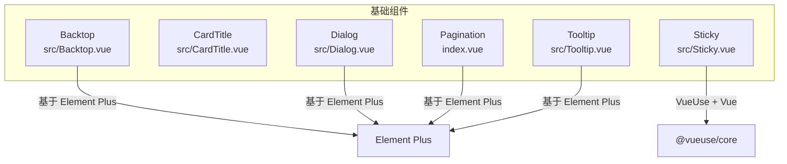
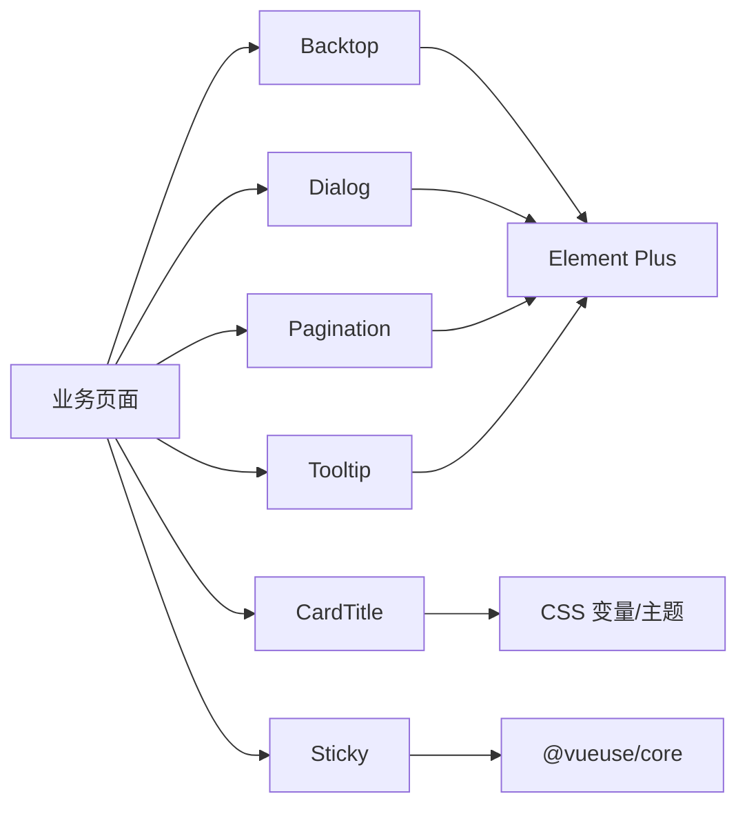
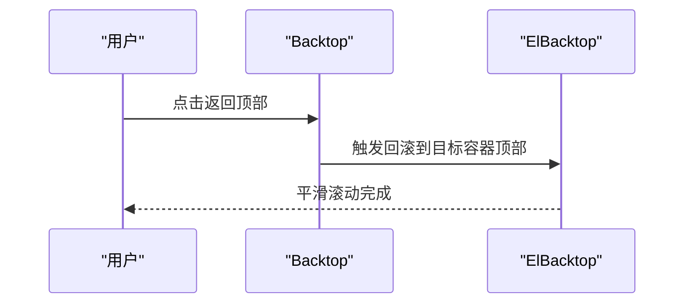
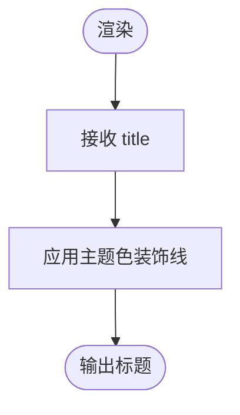
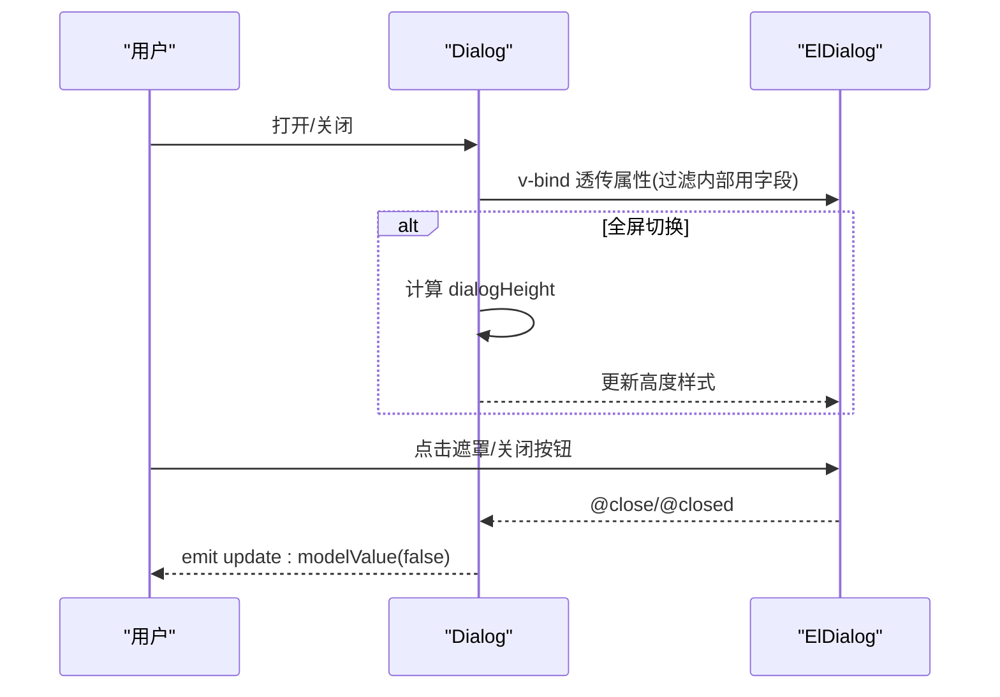
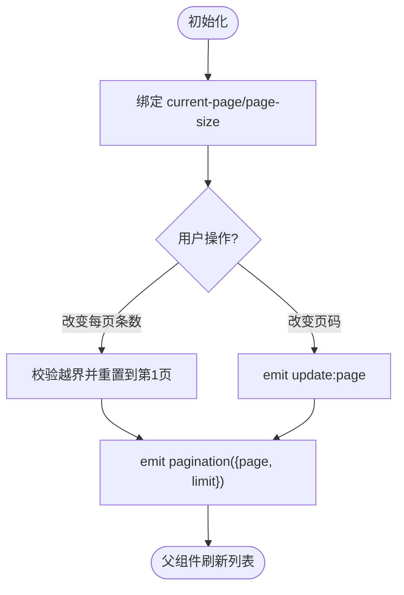
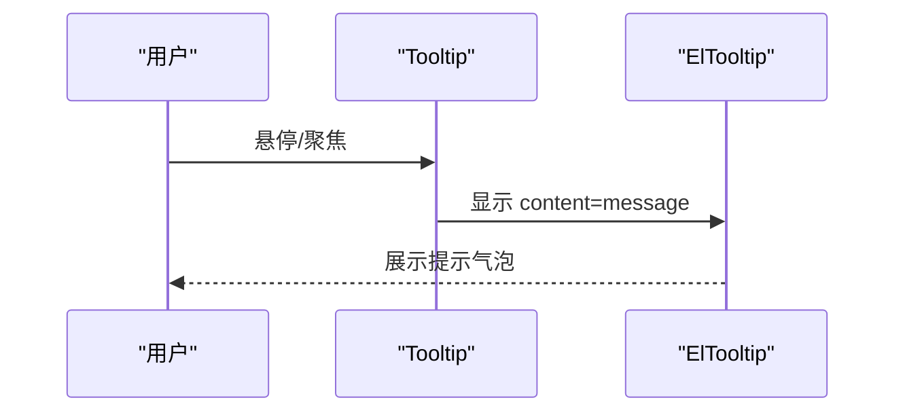
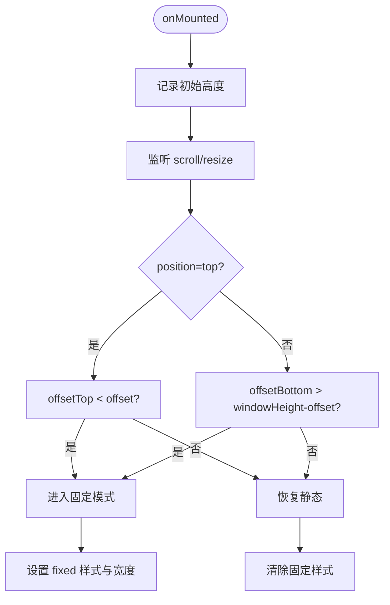
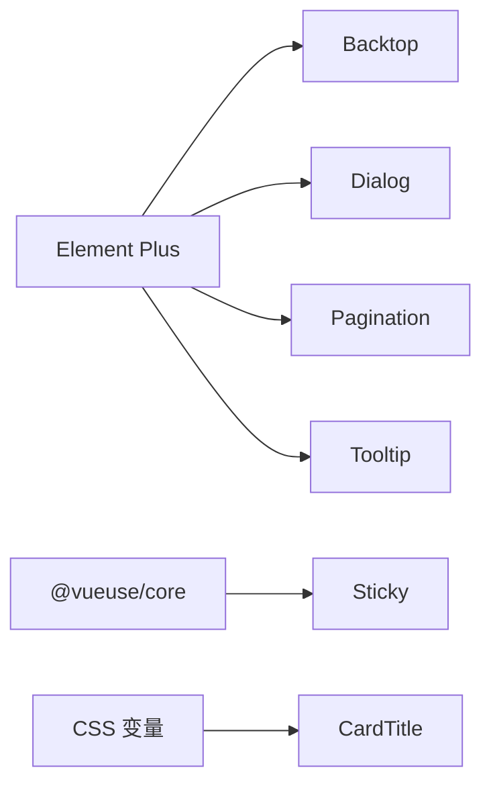

# 基础组件

<cite>
**本文引用的文件**
- [Backtop.vue](file://yudao-ui-admin-vue3/src/components/Backtop/src/Backtop.vue)
- [CardTitle.vue](file://yudao-ui-admin-vue3/src/components/Card/src/CardTitle.vue)
- [Dialog.vue](file://yudao-ui-admin-vue3/src/components/Dialog/src/Dialog.vue)
- [index.vue（Pagination）](file://yudao-ui-admin-vue3/src/components/Pagination/index.vue)
- [Tooltip.vue](file://yudao-ui-admin-vue3/src/components/Tooltip/src/Tooltip.vue)
- [Sticky.vue](file://yudao-ui-admin-vue3/src/components/Sticky/src/Sticky.vue)
</cite>

## 目录
1. [简介](#简介)
2. [项目结构](#项目结构)
3. [核心组件](#核心组件)
4. [架构总览](#架构总览)
5. [详细组件分析](#详细组件分析)
6. [依赖关系分析](#依赖关系分析)
7. [性能考量](#性能考量)
8. [故障排查指南](#故障排查指南)
9. [结论](#结论)
10. [附录](#附录)

## 简介
本章节面向基础UI组件的使用与定制，覆盖返回顶部、卡片标题、对话框、分页、提示框、粘性定位等常用能力。文档从设计理念、Props配置、事件机制、插槽使用、样式与主题、响应式实现、可访问性与最佳实践等方面展开，帮助开发者快速掌握并高效集成。

## 项目结构
本项目的基础组件位于 yudao-ui-admin-vue3/src/components 下，采用“按功能分目录”的组织方式：每个组件一个独立目录，包含 src 下的具体实现与 index.ts 导出入口。部分组件直接以 index.vue 暴露（如 Pagination）。

图表来源
- [Backtop.vue:1-18](file://yudao-ui-admin-vue3/src/components/Backtop/src/Backtop.vue#L1-L18)
- [CardTitle.vue:1-38](file://yudao-ui-admin-vue3/src/components/Card/src/CardTitle.vue#L1-L38)
- [Dialog.vue:1-163](file://yudao-ui-admin-vue3/src/components/Dialog/src/Dialog.vue#L1-L163)
- [index.vue（Pagination）:1-88](file://yudao-ui-admin-vue3/src/components/Pagination/index.vue#L1-L88)
- [Tooltip.vue:1-18](file://yudao-ui-admin-vue3/src/components/Tooltip/src/Tooltip.vue#L1-L18)
- [Sticky.vue:1-144](file://yudao-ui-admin-vue3/src/components/Sticky/src/Sticky.vue#L1-L144)

章节来源
- [Backtop.vue:1-18](file://yudao-ui-admin-vue3/src/components/Backtop/src/Backtop.vue#L1-L18)
- [CardTitle.vue:1-38](file://yudao-ui-admin-vue3/src/components/Card/src/CardTitle.vue#L1-L38)
- [Dialog.vue:1-163](file://yudao-ui-admin-vue3/src/components/Dialog/src/Dialog.vue#L1-L163)
- [index.vue（Pagination）:1-88](file://yudao-ui-admin-vue3/src/components/Pagination/index.vue#L1-L88)
- [Tooltip.vue:1-18](file://yudao-ui-admin-vue3/src/components/Tooltip/src/Tooltip.vue#L1-L18)
- [Sticky.vue:1-144](file://yudao-ui-admin-vue3/src/components/Sticky/src/Sticky.vue#L1-L144)

## 核心组件
- Backtop 返回顶部：封装 Element Plus 的 BackTop，自动绑定到布局内容滚动容器，提供一致的命名空间类名。
- CardTitle 卡片标题：用于卡片或区块标题展示，支持通过 CSS 变量继承主题色。
- Dialog 对话框：在 ElDialog 基础上增强全屏切换、滚动区域、加载态、关闭动画与样式统一。
- Pagination 分页：简化属性，双向绑定页码与每页条数，自动处理页码折叠与移动端适配。
- Tooltip 提示框：轻量提示，结合图标与消息内容，默认顶部显示。
- Sticky 粘性定位：根据滚动位置在 top/bottom 之间切换固定定位，支持偏移、层级与自定义类名。

章节来源
- [Backtop.vue:1-18](file://yudao-ui-admin-vue3/src/components/Backtop/src/Backtop.vue#L1-L18)
- [CardTitle.vue:1-38](file://yudao-ui-admin-vue3/src/components/Card/src/CardTitle.vue#L1-L38)
- [Dialog.vue:1-163](file://yudao-ui-admin-vue3/src/components/Dialog/src/Dialog.vue#L1-L163)
- [index.vue（Pagination）:1-88](file://yudao-ui-admin-vue3/src/components/Pagination/index.vue#L1-L88)
- [Tooltip.vue:1-18](file://yudao-ui-admin-vue3/src/components/Tooltip/src/Tooltip.vue#L1-L18)
- [Sticky.vue:1-144](file://yudao-ui-admin-vue3/src/components/Sticky/src/Sticky.vue#L1-L144)

## 架构总览
这些基础组件遵循统一的构建与集成模式：
- 基于 Element Plus 的原子组件进行二次封装，保持风格一致。
- 通过 props/emits/slots 暴露最小必要接口，便于组合与扩展。
- 样式采用 scoped SCSS 与 CSS 变量，配合主题系统实现全局换肤。
- 对交互逻辑进行收敛（如 Dialog 的全屏切换、Sticky 的滚动监听），降低上层使用成本。

图表来源
- [Backtop.vue:1-18](file://yudao-ui-admin-vue3/src/components/Backtop/src/Backtop.vue#L1-L18)
- [CardTitle.vue:1-38](file://yudao-ui-admin-vue3/src/components/Card/src/CardTitle.vue#L1-L38)
- [Dialog.vue:1-163](file://yudao-ui-admin-vue3/src/components/Dialog/src/Dialog.vue#L1-L163)
- [index.vue（Pagination）:1-88](file://yudao-ui-admin-vue3/src/components/Pagination/index.vue#L1-L88)
- [Tooltip.vue:1-18](file://yudao-ui-admin-vue3/src/components/Tooltip/src/Tooltip.vue#L1-L18)
- [Sticky.vue:1-144](file://yudao-ui-admin-vue3/src/components/Sticky/src/Sticky.vue#L1-L144)

## 详细组件分析

### Backtop 返回顶部
- 设计目标：为布局内容区提供一键回到顶部的便捷操作，避免重复计算选择器。
- Props：无额外暴露；内部通过 useDesign 获取命名空间前缀与目标滚动容器选择器。
- 事件：无；由底层 ElBacktop 处理点击行为。
- 插槽：无；仅作为触发按钮存在。
- 样式与主题：通过命名空间类名与 Element Plus 主题保持一致。
- 响应式：目标容器选择器指向布局内容滚动区域，适配不同布局结构。
- 可访问性：作为导航辅助控件，建议为外层容器提供语义化标签与键盘可达性。

图表来源
- [Backtop.vue:1-18](file://yudao-ui-admin-vue3/src/components/Backtop/src/Backtop.vue#L1-L18)

章节来源
- [Backtop.vue:1-18](file://yudao-ui-admin-vue3/src/components/Backtop/src/Backtop.vue#L1-L18)

### CardTitle 卡片标题
- 设计目标：为卡片或信息区块提供带主题色的标题标识，提升视觉层次。
- Props：title（必填，字符串）。
- 事件：无。
- 插槽：无。
- 样式与主题：使用 CSS 变量 --el-color-primary 作为装饰线颜色，跟随主题变化。
- 响应式：字体大小与装饰线尺寸固定，适合常规桌面端展示。
- 可访问性：作为标题文本，建议与语义化标签（如 h2/h3）配合使用以提升可读性。

图表来源
- [CardTitle.vue:1-38](file://yudao-ui-admin-vue3/src/components/Card/src/CardTitle.vue#L1-L38)

章节来源
- [CardTitle.vue:1-38](file://yudao-ui-admin-vue3/src/components/Card/src/CardTitle.vue#L1-L38)

### Dialog 对话框
- 设计目标：在 ElDialog 之上提供全屏切换、滚动区域、加载态、统一头部与底部样式，减少重复代码。
- Props：
  - modelValue：布尔，控制显隐（v-model）
  - title：字符串，默认“Dialog”
  - fullscreen：布尔，是否显示全屏切换按钮
  - width：字符串或数字，默认“40%”
  - scroll：布尔，是否启用内容滚动条
  - maxHeight：字符串或数字，默认“400px”
  - loading：布尔，内容加载状态
- 事件：
  - update:modelValue：显隐状态更新
  - 内部触发 ElDialog 的 close/closed 生命周期
- 插槽：
  - 默认插槽：内容区域
  - #title：自定义标题
  - #footer：自定义底部按钮区
- 样式与主题：覆盖 ElDialog 头部、主体、底部边框与间距，使用 CSS 变量保证主题一致性。
- 响应式：全屏模式下动态计算高度，考虑 footer 存在与否。
- 可访问性：锁定滚动、销毁时清理状态；建议为可聚焦元素设置合理 tabindex。

图表来源
- [Dialog.vue:1-163](file://yudao-ui-admin-vue3/src/components/Dialog/src/Dialog.vue#L1-L163)

章节来源
- [Dialog.vue:1-163](file://yudao-ui-admin-vue3/src/components/Dialog/src/Dialog.vue#L1-L163)

### Pagination 分页
- 设计目标：简化 Element Plus 分页的属性与事件，提供统一的双向绑定与移动端友好体验。
- Props：
  - total：必填，总数
  - page：当前页，默认 1
  - limit：每页条数，默认 20
  - pagerCount：页码按钮数量，移动端默认 5，桌面端默认 7
- 事件：
  - update:page：页码变更
  - update:limit：每页条数变更
  - pagination：统一回调 { page, limit }，用于刷新列表
- 插槽：无。
- 样式与主题：使用 Element Plus 分页样式，背景与布局固定。
- 响应式：根据屏幕宽度调整 pagerCount；当全局 size 为 small 时自动缩小分页组件尺寸。
- 可访问性：分页控件具备键盘导航能力，建议为列表数据提供 aria 描述。

图表来源
- [index.vue（Pagination）:1-88](file://yudao-ui-admin-vue3/src/components/Pagination/index.vue#L1-L88)

章节来源
- [index.vue（Pagination）:1-88](file://yudao-ui-admin-vue3/src/components/Pagination/index.vue#L1-L88)

### Tooltip 提示框
- 设计目标：为图标或文字提供轻量提示信息，默认顶部显示。
- Props：
  - title：字符串，显示在主文本中
  - message：字符串，提示内容
  - icon：字符串，图标名称，默认问号图标
- 事件：无。
- 插槽：无。
- 样式与主题：图标与提示框样式来自 Element Plus，跟随主题。
- 响应式：placement 固定为 top，在小屏上仍保持可读性。
- 可访问性：提示框由 ElTooltip 管理焦点与屏幕阅读器支持，建议确保触发元素可聚焦。

图表来源
- [Tooltip.vue:1-18](file://yudao-ui-admin-vue3/src/components/Tooltip/src/Tooltip.vue#L1-L18)

章节来源
- [Tooltip.vue:1-18](file://yudao-ui-admin-vue3/src/components/Tooltip/src/Tooltip.vue#L1-L18)

### Sticky 粘性定位
- 设计目标：根据滚动位置将元素固定在顶部或底部，常用于工具栏或筛选条件。
- Props：
  - offset：距离顶部或底部的像素偏移，默认 0
  - zIndex：堆叠顺序，默认 999
  - className：附加类名
  - position：'top' | 'bottom'，默认 'top'
- 事件：无。
- 插槽：默认插槽，承载被固定的内容。
- 样式与主题：通过 style 动态设置 position、top/bottom、width、height、zIndex。
- 响应式：监听窗口 resize 与滚动容器 scroll，动态计算宽高与固定状态。
- 可访问性：固定定位不改变文档流，注意不要遮挡重要内容；可为可交互子元素提供键盘可达性。

图表来源
- [Sticky.vue:1-144](file://yudao-ui-admin-vue3/src/components/Sticky/src/Sticky.vue#L1-L144)

章节来源
- [Sticky.vue:1-144](file://yudao-ui-admin-vue3/src/components/Sticky/src/Sticky.vue#L1-L144)

## 依赖关系分析
- Element Plus：Backtop、Dialog、Pagination、Tooltip 均基于其组件，获得一致的交互与主题能力。
- VueUse：Sticky 使用 useWindowSize、useEventListener 等工具函数，简化 DOM 与事件处理。
- 主题系统：CardTitle 使用 CSS 变量 --el-color-primary，确保与全局主题同步。

图表来源
- [Backtop.vue:1-18](file://yudao-ui-admin-vue3/src/components/Backtop/src/Backtop.vue#L1-L18)
- [Dialog.vue:1-163](file://yudao-ui-admin-vue3/src/components/Dialog/src/Dialog.vue#L1-L163)
- [index.vue（Pagination）:1-88](file://yudao-ui-admin-vue3/src/components/Pagination/index.vue#L1-L88)
- [Tooltip.vue:1-18](file://yudao-ui-admin-vue3/src/components/Tooltip/src/Tooltip.vue#L1-L18)
- [Sticky.vue:1-144](file://yudao-ui-admin-vue3/src/components/Sticky/src/Sticky.vue#L1-L144)
- [CardTitle.vue:1-38](file://yudao-ui-admin-vue3/src/components/Card/src/CardTitle.vue#L1-L38)

章节来源
- [Backtop.vue:1-18](file://yudao-ui-admin-vue3/src/components/Backtop/src/Backtop.vue#L1-L18)
- [Dialog.vue:1-163](file://yudao-ui-admin-vue3/src/components/Dialog/src/Dialog.vue#L1-L163)
- [index.vue（Pagination）:1-88](file://yudao-ui-admin-vue3/src/components/Pagination/index.vue#L1-L88)
- [Tooltip.vue:1-18](file://yudao-ui-admin-vue3/src/components/Tooltip/src/Tooltip.vue#L1-L18)
- [Sticky.vue:1-144](file://yudao-ui-admin-vue3/src/components/Sticky/src/Sticky.vue#L1-L144)
- [CardTitle.vue:1-38](file://yudao-ui-admin-vue3/src/components/Card/src/CardTitle.vue#L1-L38)

## 性能考量
- 避免不必要的重排：Sticky 在滚动事件中仅更新必要样式，且仅在进入/退出固定模式时切换 class/style。
- 合理使用 destroy-on-close：Dialog 在关闭时销毁内容，减少内存占用。
- 分页优化：Pagination 在 pageSize 变更后若超出最大页码会强制回到第一页，避免无效请求。
- 主题变量复用：CardTitle 通过 CSS 变量减少样式计算开销。

[本节为通用指导，不直接分析具体文件]

## 故障排查指南
- Dialog 全屏后高度异常：检查是否有 footer 插槽以及窗口高度变化时机，必要时在 nextTick 后重新计算高度。
- Sticky 未生效：确认滚动容器是否正确识别（getScrollContainer），并确保父级未设置 overflow:hidden 导致无法滚动。
- Pagination 页码不更新：确保父组件正确监听 update:page/update:limit 或 pagination 事件并刷新数据。
- Tooltip 提示不显示：确认触发元素可聚焦且未被其他元素遮挡。

章节来源
- [Dialog.vue:1-163](file://yudao-ui-admin-vue3/src/components/Dialog/src/Dialog.vue#L1-L163)
- [Sticky.vue:1-144](file://yudao-ui-admin-vue3/src/components/Sticky/src/Sticky.vue#L1-L144)
- [index.vue（Pagination）:1-88](file://yudao-ui-admin-vue3/src/components/Pagination/index.vue#L1-L88)
- [Tooltip.vue:1-18](file://yudao-ui-admin-vue3/src/components/Tooltip/src/Tooltip.vue#L1-L18)

## 结论
上述基础组件围绕易用性、一致性与可维护性进行设计，借助 Element Plus 与 VueUse 的能力，提供了开箱即用的交互体验。通过清晰的 Props/Events/Slots 约定与主题化样式，能够在多场景下稳定复用。建议在业务中优先采用这些封装组件，以获得更好的开发效率与用户体验。

[本节为总结性内容，不直接分析具体文件]

## 附录
- 使用示例路径（不含代码内容）：
  - Backtop：参考 [Backtop.vue:1-18](file://yudao-ui-admin-vue3/src/components/Backtop/src/Backtop.vue#L1-L18)
  - CardTitle：参考 [CardTitle.vue:1-38](file://yudao-ui-admin-vue3/src/components/Card/src/CardTitle.vue#L1-L38)
  - Dialog：参考 [Dialog.vue:1-163](file://yudao-ui-admin-vue3/src/components/Dialog/src/Dialog.vue#L1-L163)
  - Pagination：参考 [index.vue（Pagination）:1-88](file://yudao-ui-admin-vue3/src/components/Pagination/index.vue#L1-L88)
  - Tooltip：参考 [Tooltip.vue:1-18](file://yudao-ui-admin-vue3/src/components/Tooltip/src/Tooltip.vue#L1-L18)
  - Sticky：参考 [Sticky.vue:1-144](file://yudao-ui-admin-vue3/src/components/Sticky/src/Sticky.vue#L1-L144)

[本节为索引信息，不直接分析具体文件]