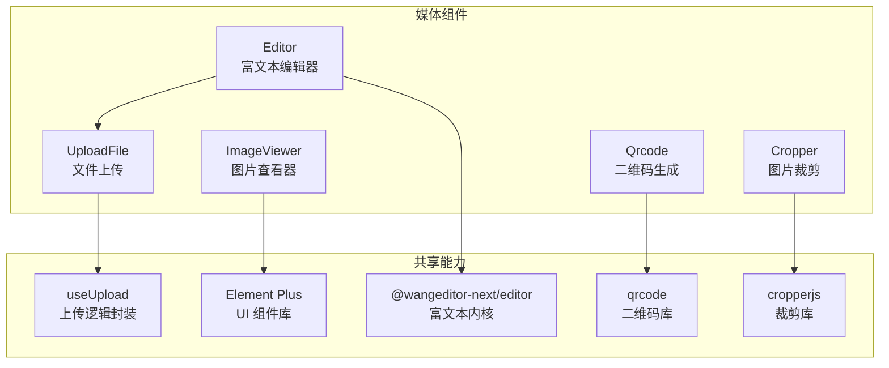
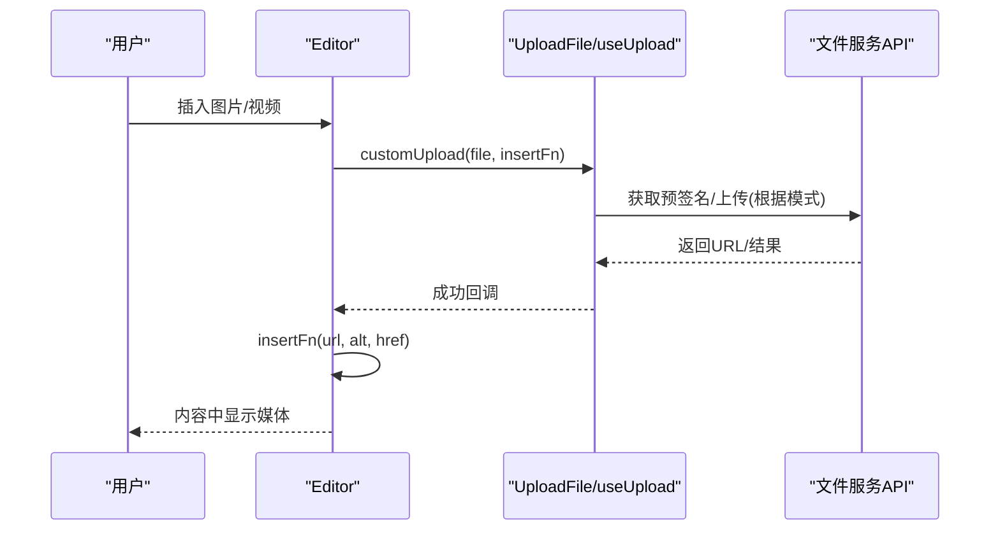
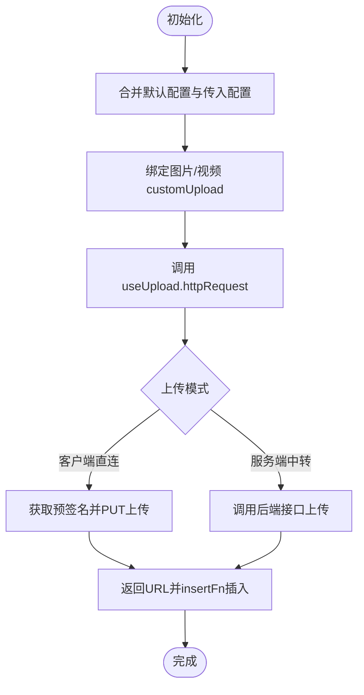
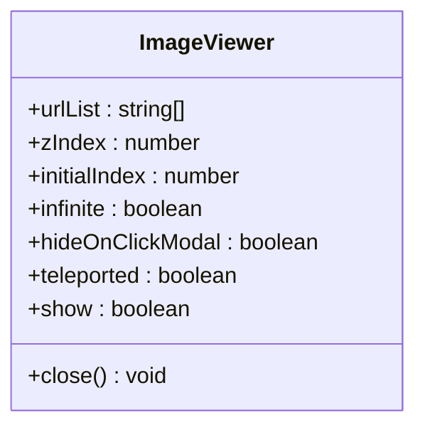
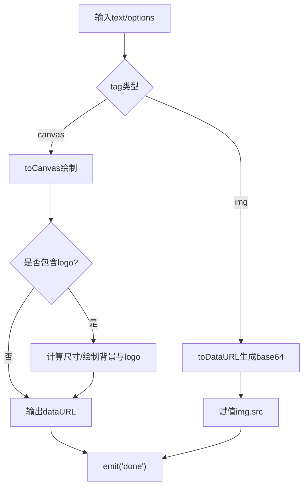
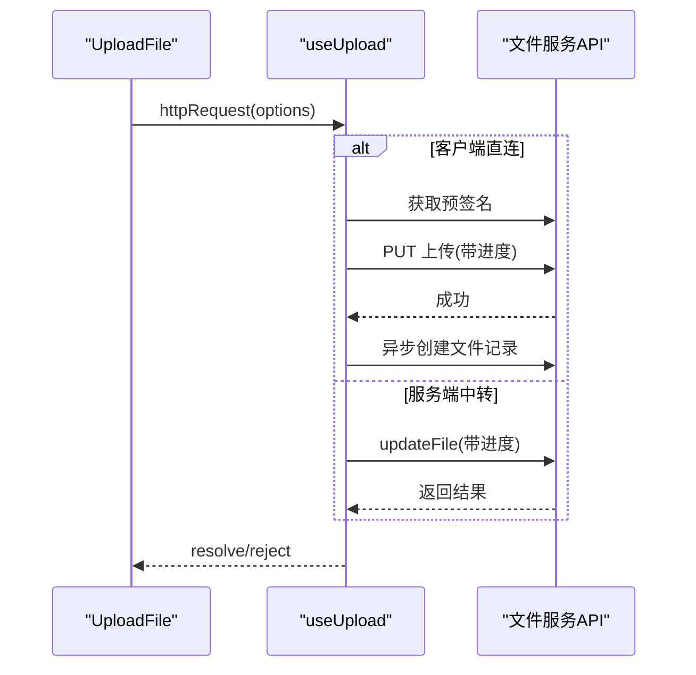
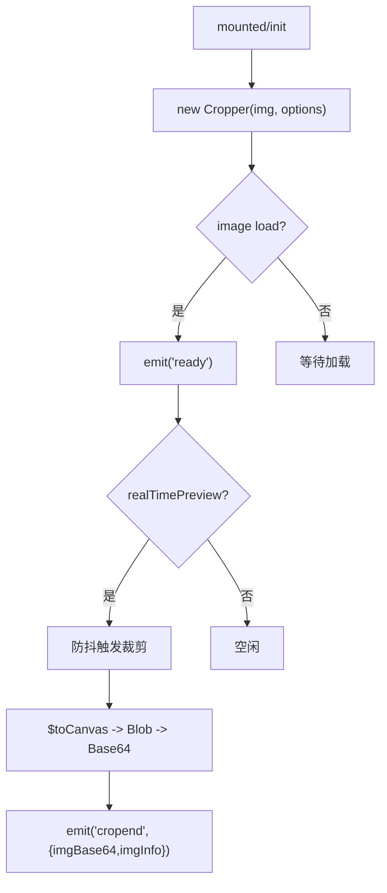
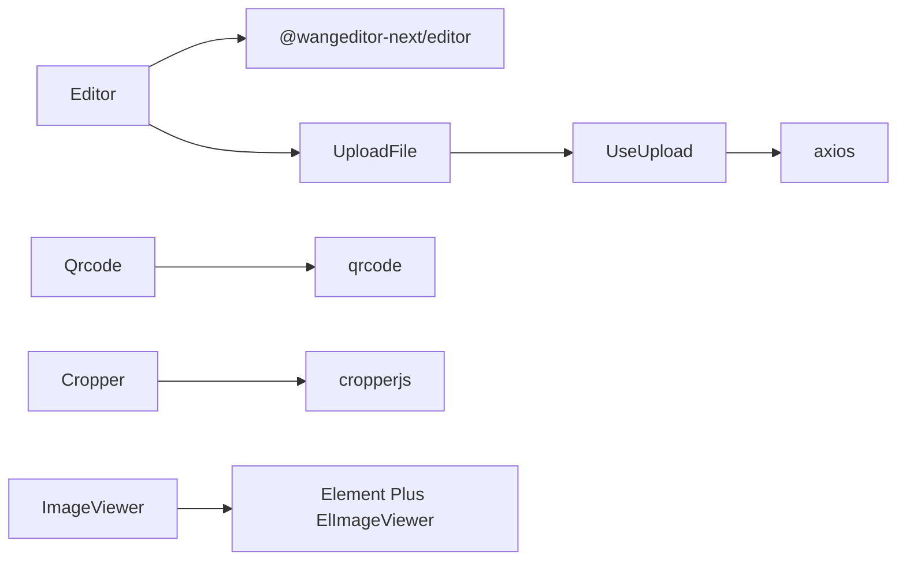

# 媒体组件

<cite>
**本文引用的文件**
- [Editor.vue](file://yudao-ui-admin-vue3/src/components/Editor/src/Editor.vue)
- [ImageViewer.vue](file://yudao-ui-admin-vue3/src/components/ImageViewer/src/ImageViewer.vue)
- [Qrcode.vue](file://yudao-ui-admin-vue3/src/components/Qrcode/src/Qrcode.vue)
- [UploadFile.vue](file://yudao-ui-admin-vue3/src/components/UploadFile/src/UploadFile.vue)
- [useUpload.ts](file://yudao-ui-admin-vue3/src/components/UploadFile/src/useUpload.ts)
- [Cropper.vue](file://yudao-ui-admin-vue3/src/components/Cropper/src/Cropper.vue)
- [types.ts（裁剪）](file://yudao-ui-admin-vue3/src/components/Cropper/src/types.ts)
- [types.ts（图片查看器）](file://yudao-ui-admin-vue3/src/components/ImageViewer/src/types.ts)
</cite>

## 目录
1. [简介](#简介)
2. [项目结构](#项目结构)
3. [核心组件](#核心组件)
4. [架构总览](#架构总览)
5. [详细组件分析](#详细组件分析)
6. [依赖关系分析](#依赖关系分析)
7. [性能与内存优化](#性能与内存优化)
8. [故障排查指南](#故障排查指南)
9. [结论](#结论)
10. [附录](#附录)

## 简介
本文件面向媒体处理相关的前端组件，系统性说明以下能力：
- Editor 富文本编辑器：插件扩展、内容格式化、协作编辑接入点、图片/视频上传集成。
- ImageViewer 图片查看器：预览、缩放、旋转、全屏等交互。
- Qrcode 二维码生成：Canvas/Img 渲染、Logo 叠加、容错率自适应。
- UploadFile 文件上传：前端直连/后端中转两种模式、进度监控、批量处理。
- Cropper 图片裁剪：实时预览、圆形裁剪、移动端适配。

## 项目结构
媒体组件位于 yudao-ui-admin-vue3 的 src/components 目录下，按功能划分独立子目录，每个组件提供入口 index.ts 与实现文件。关键路径如下：
- 富文本编辑器：src/components/Editor/src/Editor.vue
- 图片查看器：src/components/ImageViewer/src/ImageViewer.vue
- 二维码：src/components/Qrcode/src/Qrcode.vue
- 文件上传：src/components/UploadFile/src/UploadFile.vue、useUpload.ts
- 图片裁剪：src/components/Cropper/src/Cropper.vue、types.ts

图表来源
- [Editor.vue:1-228](file://yudao-ui-admin-vue3/src/components/Editor/src/Editor.vue#L1-L228)
- [UploadFile.vue:1-238](file://yudao-ui-admin-vue3/src/components/UploadFile/src/UploadFile.vue#L1-L238)
- [useUpload.ts:1-103](file://yudao-ui-admin-vue3/src/components/UploadFile/src/useUpload.ts#L1-L103)
- [ImageViewer.vue:1-36](file://yudao-ui-admin-vue3/src/components/ImageViewer/src/ImageViewer.vue#L1-L36)
- [Qrcode.vue:1-254](file://yudao-ui-admin-vue3/src/components/Qrcode/src/Qrcode.vue#L1-L254)
- [Cropper.vue:1-159](file://yudao-ui-admin-vue3/src/components/Cropper/src/Cropper.vue#L1-L159)

章节来源
- [Editor.vue:1-228](file://yudao-ui-admin-vue3/src/components/Editor/src/Editor.vue#L1-L228)
- [UploadFile.vue:1-238](file://yudao-ui-admin-vue3/src/components/UploadFile/src/UploadFile.vue#L1-L238)
- [useUpload.ts:1-103](file://yudao-ui-admin-vue3/src/components/UploadFile/src/useUpload.ts#L1-L103)
- [ImageViewer.vue:1-36](file://yudao-ui-admin-vue3/src/components/ImageViewer/src/ImageViewer.vue#L1-L36)
- [Qrcode.vue:1-254](file://yudao-ui-admin-vue3/src/components/Qrcode/src/Qrcode.vue#L1-L254)
- [Cropper.vue:1-159](file://yudao-ui-admin-vue3/src/components/Cropper/src/Cropper.vue#L1-L159)

## 核心组件
- Editor：基于 @wangeditor-next/editor-for-vue 的富文本封装，支持自定义菜单、图片/视频上传、国际化、只读模式、高度配置、事件回调。
- ImageViewer：基于 Element Plus 的图片查看器封装，支持列表、初始索引、无限轮播、点击遮罩关闭、层级控制、挂载位置控制。
- Qrcode：基于 qrcode 库，支持 Canvas/Img 两种渲染方式、Logo 叠加、自动容错率、尺寸自适应、禁用态提示。
- UploadFile：基于 Element Plus Upload 封装，支持拖拽、限制类型/大小/数量、自动上传、禁用态展示、下载与删除；通过 useUpload 统一上传流程。
- Cropper：基于 cropperjs 的裁剪封装，支持实时预览、圆形裁剪、宽高比设置、事件回调、销毁清理。

章节来源
- [Editor.vue:1-228](file://yudao-ui-admin-vue3/src/components/Editor/src/Editor.vue#L1-L228)
- [ImageViewer.vue:1-36](file://yudao-ui-admin-vue3/src/components/ImageViewer/src/ImageViewer.vue#L1-L36)
- [Qrcode.vue:1-254](file://yudao-ui-admin-vue3/src/components/Qrcode/src/Qrcode.vue#L1-L254)
- [UploadFile.vue:1-238](file://yudao-ui-admin-vue3/src/components/UploadFile/src/UploadFile.vue#L1-L238)
- [useUpload.ts:1-103](file://yudao-ui-admin-vue3/src/components/UploadFile/src/useUpload.ts#L1-L103)
- [Cropper.vue:1-159](file://yudao-ui-admin-vue3/src/components/Cropper/src/Cropper.vue#L1-L159)

## 架构总览
媒体组件整体采用“轻量封装 + 第三方库”的模式：
- UI 层：使用 Element Plus 提供基础控件与样式一致性。
- 业务层：各组件聚焦自身领域能力（编辑、查看、生成、上传、裁剪）。
- 能力复用：UploadFile 将上传逻辑抽离为 useUpload，供 Editor 等复用。
- 数据流：用户操作触发组件内部状态变化或事件回调，必要时调用外部 API 完成持久化。

图表来源
- [Editor.vue:118-175](file://yudao-ui-admin-vue3/src/components/Editor/src/Editor.vue#L118-L175)
- [useUpload.ts:22-67](file://yudao-ui-admin-vue3/src/components/UploadFile/src/useUpload.ts#L22-L67)

章节来源
- [Editor.vue:1-228](file://yudao-ui-admin-vue3/src/components/Editor/src/Editor.vue#L1-L228)
- [useUpload.ts:1-103](file://yudao-ui-admin-vue3/src/components/UploadFile/src/useUpload.ts#L1-L103)

## 详细组件分析

### Editor 富文本编辑器
- 插件扩展
  - 通过 MENU_CONF 注入自定义上传行为，分别对图片与视频启用 customUpload，复用 useUpload 的 httpRequest，兼容前端直连与后端中转两种模式。
  - 支持 EXTEND_CONF 扩展项（如 mentionConfig），便于接入@提及等协作能力。
- 内容格式化
  - 默认启用滚动、占位符、自定义消息提示；可通过 editorConfig 合并覆盖更多配置。
  - 支持 uploadImgShowBase64 以兼容部分场景。
- 协作编辑
  - 通过 EXTEND_CONF 预留 mentionConfig 插槽，可对接协同编辑的弹窗/隐藏逻辑；结合后端 WebSocket/CRDT 方案可实现多人协作。
- 生命周期与资源管理
  - 组件卸载时调用 destroy 释放编辑器实例，避免内存泄漏。
  - readonly 切换时动态 enable/disable。

图表来源
- [Editor.vue:86-175](file://yudao-ui-admin-vue3/src/components/Editor/src/Editor.vue#L86-L175)
- [useUpload.ts:22-67](file://yudao-ui-admin-vue3/src/components/UploadFile/src/useUpload.ts#L22-L67)

章节来源
- [Editor.vue:1-228](file://yudao-ui-admin-vue3/src/components/Editor/src/Editor.vue#L1-L228)

### ImageViewer 图片查看器
- 功能特性
  - 基于 Element Plus 的 ElImageViewer，支持 urlList、initialIndex、infinite、hideOnClickModal、teleported、zIndex 等属性。
  - 内部维护 show 状态，关闭时重置显示。
- 使用建议
  - 在父组件中通过 v-model 或 props.show 控制显隐。
  - 大图片建议在父级进行懒加载或按需加载，减少首屏压力。

图表来源
- [ImageViewer.vue:1-36](file://yudao-ui-admin-vue3/src/components/ImageViewer/src/ImageViewer.vue#L1-L36)
- [types.ts（图片查看器）:1-10](file://yudao-ui-admin-vue3/src/components/ImageViewer/src/types.ts#L1-L10)

章节来源
- [ImageViewer.vue:1-36](file://yudao-ui-admin-vue3/src/components/ImageViewer/src/ImageViewer.vue#L1-L36)
- [types.ts（图片查看器）:1-10](file://yudao-ui-admin-vue3/src/components/ImageViewer/src/types.ts#L1-L10)

### Qrcode 二维码生成
- 渲染策略
  - tag=canvas：使用 toCanvas 绘制，支持 Logo 叠加、圆角背景、自适应缩放。
  - tag=img：使用 toDataURL 生成 base64 直接赋值给 img.src。
- 容错率自适应
  - 根据内容长度选择 M/Q/H 级别，提升扫描成功率。
- 交互与状态
  - loading 状态控制；disabled 时显示遮罩与提示文案；支持 click 与 disabled-click 事件。

图表来源
- [Qrcode.vue:59-91](file://yudao-ui-admin-vue3/src/components/Qrcode/src/Qrcode.vue#L59-L91)
- [Qrcode.vue:105-177](file://yudao-ui-admin-vue3/src/components/Qrcode/src/Qrcode.vue#L105-L177)
- [Qrcode.vue:180-195](file://yudao-ui-admin-vue3/src/components/Qrcode/src/Qrcode.vue#L180-L195)

章节来源
- [Qrcode.vue:1-254](file://yudao-ui-admin-vue3/src/components/Qrcode/src/Qrcode.vue#L1-L254)

### UploadFile 文件上传
- 上传模式
  - 客户端直连：获取预签名后直接使用 axios PUT 上传至对象存储，异步记录文件信息到后端。
  - 服务端中转：通过后端接口上传，统一返回格式。
- 进度监控
  - 通过 onUploadProgress 将 Axios 进度转换为 Element Plus 的 UploadProgressEvent，驱动 UI 进度条。
- 批量处理
  - 支持多文件选择与限制数量；beforeUpload 校验类型与大小；onSuccess 聚合成功后更新 modelValue。
- 断点续传
  - 当前实现未包含分片与断点续传逻辑；如需支持，可在 useUpload 中引入分片上传与断点恢复策略。

图表来源
- [UploadFile.vue:101-147](file://yudao-ui-admin-vue3/src/components/UploadFile/src/UploadFile.vue#L101-L147)
- [useUpload.ts:22-67](file://yudao-ui-admin-vue3/src/components/UploadFile/src/useUpload.ts#L22-L67)

章节来源
- [UploadFile.vue:1-238](file://yudao-ui-admin-vue3/src/components/UploadFile/src/UploadFile.vue#L1-L238)
- [useUpload.ts:1-103](file://yudao-ui-admin-vue3/src/components/UploadFile/src/useUpload.ts#L1-L103)

### Cropper 图片裁剪
- 核心能力
  - 基于 cropperjs 初始化裁剪实例，支持实时预览、圆形裁剪、宽高比与可移动/可缩放设置。
  - 通过 selection.$toCanvas 生成裁剪画布，再转 Blob/Base64 回传给父组件。
- 事件与错误处理
  - ready 事件通知实例就绪；cropend 返回 Base64 与裁剪区域信息；cropendError 处理读取失败。
- 移动端适配
  - 容器高度由 props.height 控制；cropperjs 动态插入元素通过 deep 样式穿透设置高度，保证移动端布局稳定。

图表来源
- [Cropper.vue:52-87](file://yudao-ui-admin-vue3/src/components/Cropper/src/Cropper.vue#L52-L87)
- [Cropper.vue:90-130](file://yudao-ui-admin-vue3/src/components/Cropper/src/Cropper.vue#L90-L130)
- [types.ts（裁剪）:1-9](file://yudao-ui-admin-vue3/src/components/Cropper/src/types.ts#L1-L9)

章节来源
- [Cropper.vue:1-159](file://yudao-ui-admin-vue3/src/components/Cropper/src/Cropper.vue#L1-L159)
- [types.ts（裁剪）:1-9](file://yudao-ui-admin-vue3/src/components/Cropper/src/types.ts#L1-L9)

## 依赖关系分析
- Editor 依赖 @wangeditor-next/editor 与 UploadFile/useUpload，形成“编辑+上传”闭环。
- UploadFile 依赖 Element Plus Upload 与 useUpload，后者封装了两种上传模式与进度上报。
- Qrcode 依赖 qrcode 库，负责渲染与 Logo 合成。
- Cropper 依赖 cropperjs，负责裁剪与画布处理。
- ImageViewer 依赖 Element Plus 的 ElImageViewer，提供开箱即用的图片浏览体验。

图表来源
- [Editor.vue:1-228](file://yudao-ui-admin-vue3/src/components/Editor/src/Editor.vue#L1-L228)
- [UploadFile.vue:1-238](file://yudao-ui-admin-vue3/src/components/UploadFile/src/UploadFile.vue#L1-L238)
- [useUpload.ts:1-103](file://yudao-ui-admin-vue3/src/components/UploadFile/src/useUpload.ts#L1-L103)
- [Qrcode.vue:1-254](file://yudao-ui-admin-vue3/src/components/Qrcode/src/Qrcode.vue#L1-L254)
- [Cropper.vue:1-159](file://yudao-ui-admin-vue3/src/components/Cropper/src/Cropper.vue#L1-L159)
- [ImageViewer.vue:1-36](file://yudao-ui-admin-vue3/src/components/ImageViewer/src/ImageViewer.vue#L1-L36)

章节来源
- [Editor.vue:1-228](file://yudao-ui-admin-vue3/src/components/Editor/src/Editor.vue#L1-L228)
- [UploadFile.vue:1-238](file://yudao-ui-admin-vue3/src/components/UploadFile/src/UploadFile.vue#L1-L238)
- [useUpload.ts:1-103](file://yudao-ui-admin-vue3/src/components/UploadFile/src/useUpload.ts#L1-L103)
- [Qrcode.vue:1-254](file://yudao-ui-admin-vue3/src/components/Qrcode/src/Qrcode.vue#L1-L254)
- [Cropper.vue:1-159](file://yudao-ui-admin-vue3/src/components/Cropper/src/Cropper.vue#L1-L159)
- [ImageViewer.vue:1-36](file://yudao-ui-admin-vue3/src/components/ImageViewer/src/ImageViewer.vue#L1-L36)

## 性能与内存优化
- 富文本编辑器
  - 使用 shallowRef 保存编辑器实例，降低响应式开销。
  - 组件卸载时调用 destroy，及时释放 DOM 与事件监听。
  - 图片/视频上传前限制文件大小与数量，避免大文件阻塞。
- 图片查看器
  - 大图建议在父组件懒加载；合理设置 zIndex 与 teleported 避免重排。
- 二维码
  - 短内容提高容错率，长内容降低容错率，平衡清晰度与体积。
  - 使用 Canvas 时注意 scale 计算，避免过高分辨率导致卡顿。
- 文件上传
  - 使用 onUploadProgress 驱动 UI，避免全量渲染。
  - 客户端直连模式减少后端带宽占用；服务端中转模式便于统一鉴权与审计。
  - 当前未实现断点续传；可按需引入分片与断点恢复。
- 图片裁剪
  - 实时预览使用防抖，降低高频事件带来的性能损耗。
  - 圆形裁剪仅在需要时执行，避免不必要的二次画布操作。
  - 移动端通过 deep 样式确保容器高度正确，避免布局抖动。

[本节为通用指导，不直接分析具体文件]

## 故障排查指南
- 编辑器无法上传图片/视频
  - 检查 menu 配置中的 maxFileSize、allowedFileTypes 是否符合预期。
  - 确认 useUpload 的上传模式与环境变量配置是否正确。
  - 查看浏览器控制台错误信息与网络请求响应。
- 上传无进度或卡住
  - 确认 onUploadProgress 是否正确传递；检查跨域与 Content-Type。
  - 服务端中转模式下，确认接口返回码与错误分支处理。
- 二维码模糊或不可扫
  - 调整 errorCorrectionLevel 与 width/scale；避免过小尺寸。
  - 若含 logo，确保 crossOrigin 与圆角半径设置合理。
- 裁剪结果异常
  - 确认 selection 已就绪后再调用 $toCanvas。
  - 移动端注意容器高度与 cropper-canvas 深度样式穿透。
  - 捕获 cropendError 并给出友好提示。

章节来源
- [Editor.vue:118-175](file://yudao-ui-admin-vue3/src/components/Editor/src/Editor.vue#L118-L175)
- [useUpload.ts:22-67](file://yudao-ui-admin-vue3/src/components/UploadFile/src/useUpload.ts#L22-L67)
- [Qrcode.vue:59-91](file://yudao-ui-admin-vue3/src/components/Qrcode/src/Qrcode.vue#L59-L91)
- [Cropper.vue:90-130](file://yudao-ui-admin-vue3/src/components/Cropper/src/Cropper.vue#L90-L130)

## 结论
本套媒体组件围绕“编辑—查看—生成—上传—裁剪”的完整链路，提供了高内聚、低耦合的前端解决方案。通过统一的上传抽象与合理的资源管理策略，兼顾了易用性与性能。后续可在此基础上扩展断点续传、协同编辑、更丰富的图片滤镜与压缩策略，以满足更复杂的业务场景。

[本节为总结性内容，不直接分析具体文件]

## 附录
- 常用配置参考
  - Editor：editorConfig 合并默认与自定义配置；MENU_CONF 扩展上传与插件。
  - UploadFile：fileType、fileSize、limit、autoUpload、drag、directory。
  - Qrcode：tag、options、width、logo、disabled、disabledText。
  - Cropper：src、alt、circled、realTimePreview、height、crossorigin、imageStyle、options。
  - ImageViewer：urlList、zIndex、initialIndex、infinite、hideOnClickModal、teleported、show。

[本节为补充说明，不直接分析具体文件]