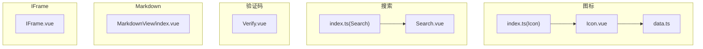
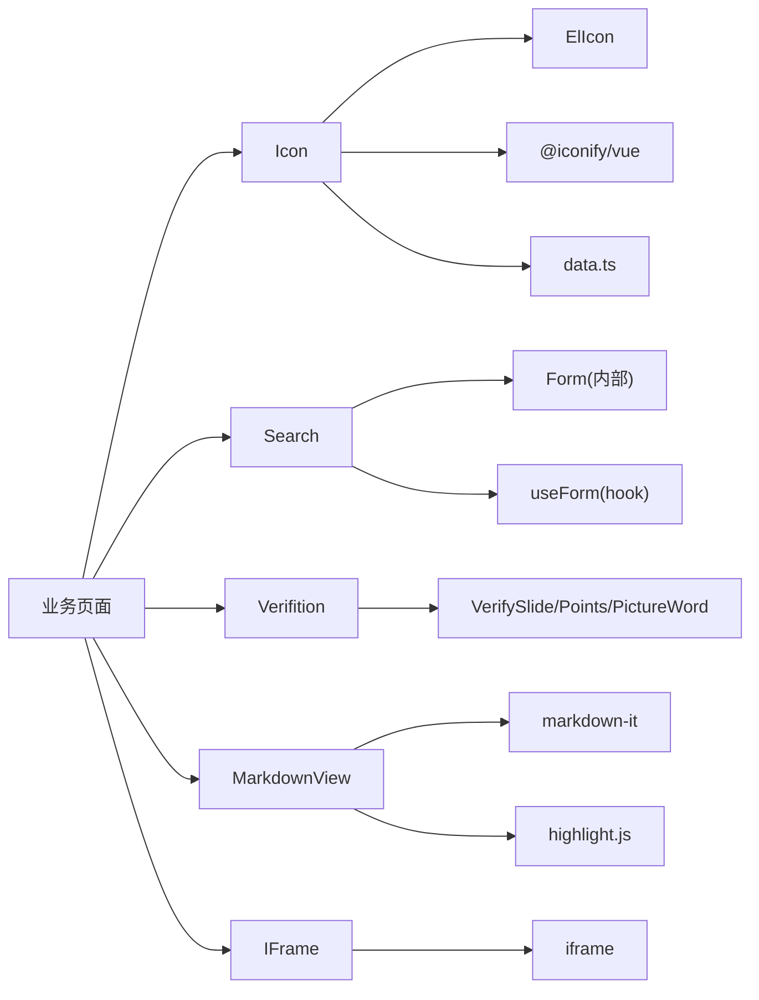
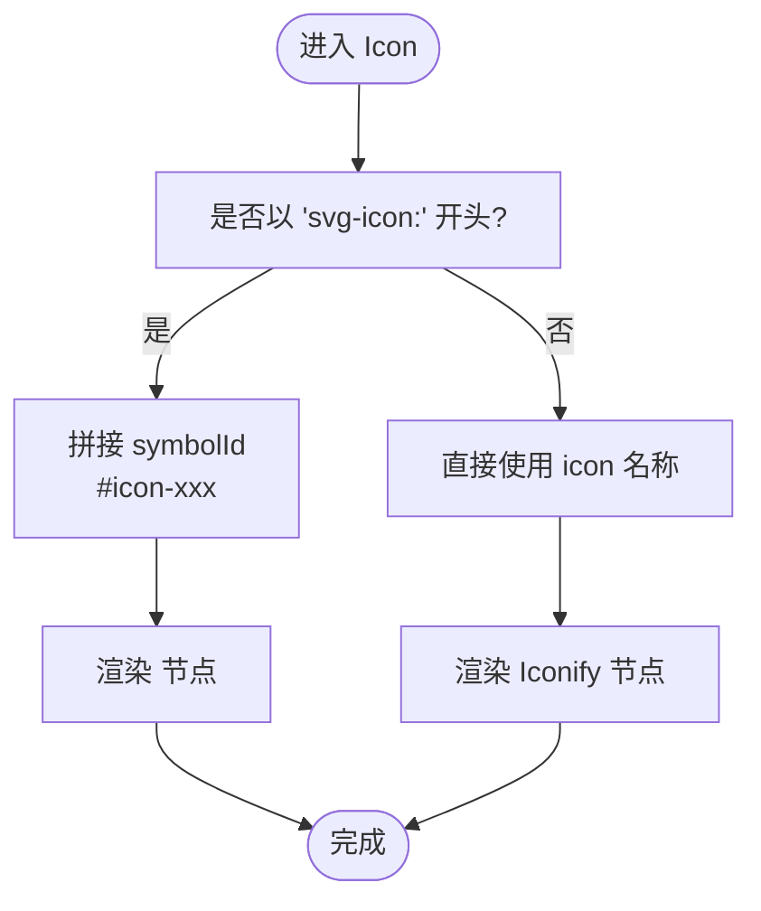
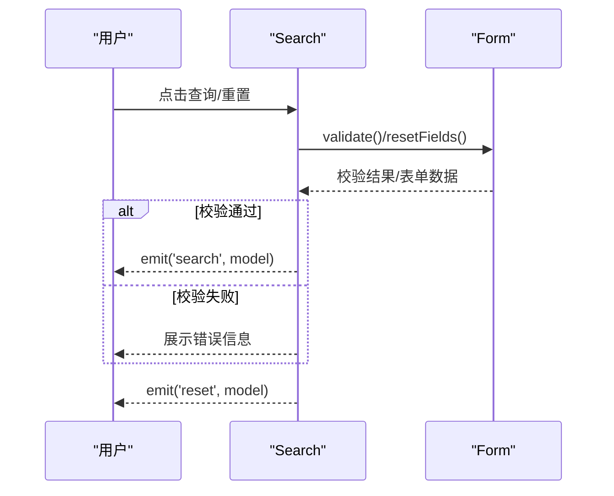
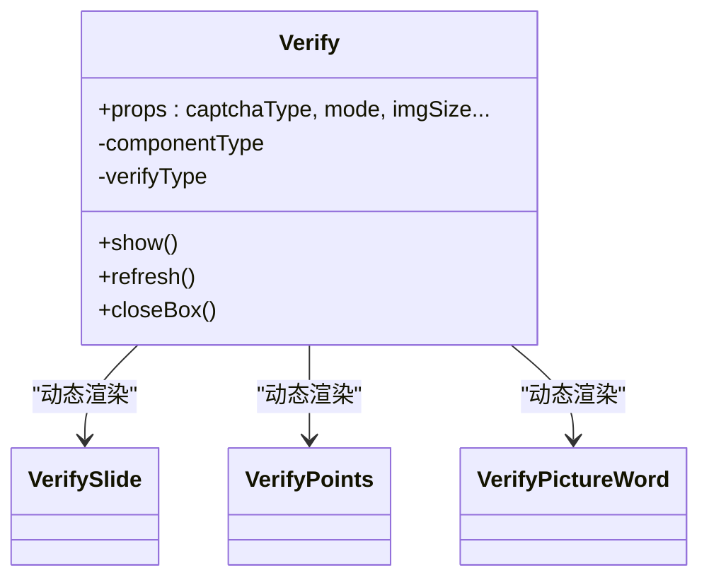
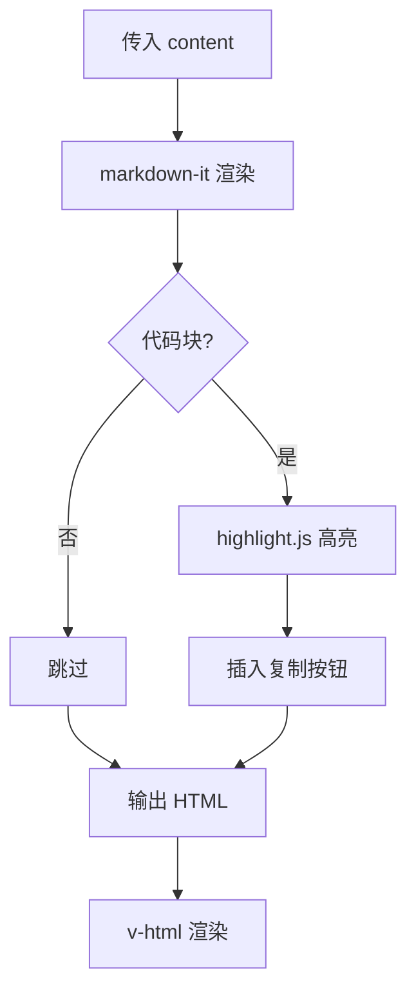
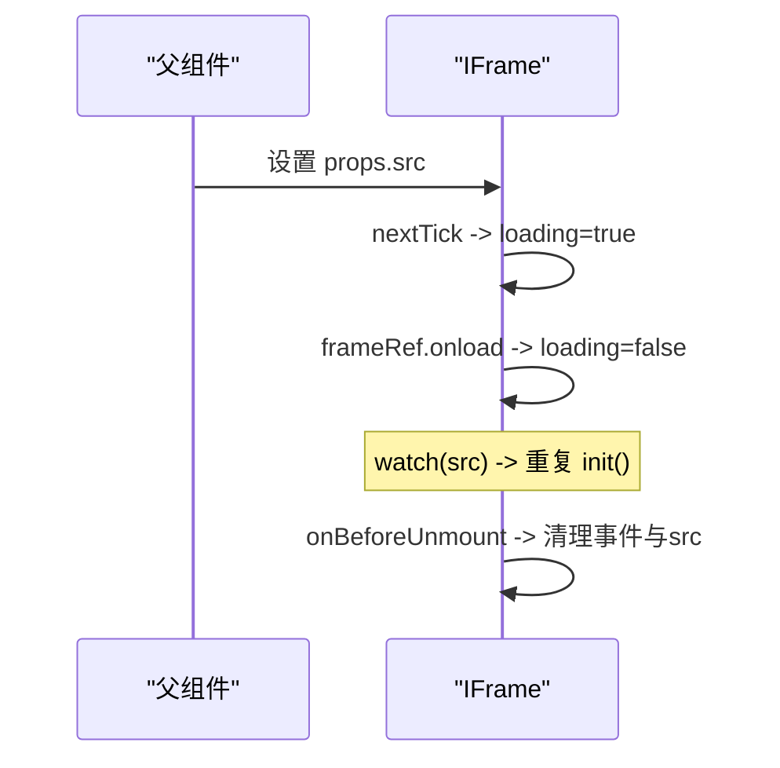
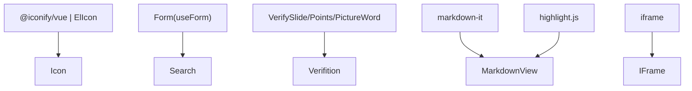

# 工具组件

<cite>
**本文引用的文件**
- [Icon.vue](file://yudao-ui-admin-vue3/src/components/Icon/src/Icon.vue)
- [data.ts](file://yudao-ui-admin-vue3/src/components/Icon/src/data.ts)
- [index.ts（Icon）](file://yudao-ui-admin-vue3/src/components/Icon/index.ts)
- [Search.vue](file://yudao-ui-admin-vue3/src/components/Search/src/Search.vue)
- [index.ts（Search）](file://yudao-ui-admin-vue3/src/components/Search/index.ts)
- [Verify.vue](file://yudao-ui-admin-vue3/src/components/Verifition/src/Verify.vue)
- [MarkdownView/index.vue](file://yudao-ui-admin-vue3/src/components/MarkdownView/index.vue)
- [IFrame.vue](file://yudao-ui-admin-vue3/src/components/IFrame/src/IFrame.vue)
</cite>

## 目录
1. [简介](#简介)
2. [项目结构](#项目结构)
3. [核心组件](#核心组件)
4. [架构总览](#架构总览)
5. [详细组件分析](#详细组件分析)
6. [依赖关系分析](#依赖关系分析)
7. [性能考量](#性能考量)
8. [故障排查指南](#故障排查指南)
9. [结论](#结论)
10. [附录](#附录)

## 简介
本章节面向前端工具类组件，聚焦以下五个常用能力：
- Icon 图标组件：统一图标渲染、本地 SVG 与第三方图标集混用、主题色与尺寸控制。
- Search 搜索组件：基于表单的查询面板，支持伸缩、布局切换、校验与事件回调。
- Verifition 验证码组件：多形态验证码（滑动、点选、图形），弹窗/内嵌模式，尺寸与交互可配。
- MarkdownView Markdown 渲染器：基于 markdown-it + highlight.js 的代码高亮与一键复制体验。
- IFrame 内联框架：安全的页面嵌入容器，加载状态管理与生命周期清理。

## 项目结构
这些组件均位于 yudao-ui-admin-vue3 的前端工程下，采用“按功能分目录”的组织方式，每个组件包含 src 实现与 index 导出入口，便于按需引入与全局注册。

图表来源
- [Icon.vue:1-49](file://yudao-ui-admin-vue3/src/components/Icon/src/Icon.vue#L1-L49)
- [data.ts:1-800](file://yudao-ui-admin-vue3/src/components/Icon/src/data.ts#L1-L800)
- [index.ts（Icon）:1-5](file://yudao-ui-admin-vue3/src/components/Icon/index.ts#L1-L5)
- [Search.vue:1-154](file://yudao-ui-admin-vue3/src/components/Search/src/Search.vue#L1-L154)
- [index.ts（Search）:1-4](file://yudao-ui-admin-vue3/src/components/Search/index.ts#L1-L4)
- [Verify.vue:1-447](file://yudao-ui-admin-vue3/src/components/Verifition/src/Verify.vue#L1-L447)
- [MarkdownView/index.vue:1-206](file://yudao-ui-admin-vue3/src/components/MarkdownView/index.vue#L1-L206)
- [IFrame.vue:1-53](file://yudao-ui-admin-vue3/src/components/IFrame/src/IFrame.vue#L1-L53)

章节来源
- [Icon.vue:1-49](file://yudao-ui-admin-vue3/src/components/Icon/src/Icon.vue#L1-L49)
- [Search.vue:1-154](file://yudao-ui-admin-vue3/src/components/Search/src/Search.vue#L1-L154)
- [Verify.vue:1-447](file://yudao-ui-admin-vue3/src/components/Verifition/src/Verify.vue#L1-L447)
- [MarkdownView/index.vue:1-206](file://yudao-ui-admin-vue3/src/components/MarkdownView/index.vue#L1-L206)
- [IFrame.vue:1-53](file://yudao-ui-admin-vue3/src/components/IFrame/src/IFrame.vue#L1-L53)

## 核心组件
- Icon：封装 ElIcon，兼容本地 SVG symbol 与 Iconify 图标集；支持颜色、尺寸、自定义 class；通过 data.ts 维护图标清单。
- Search：基于 Form 构建查询面板，支持 inline/bottom 布局、展开/收起、校验后触发 search/reset 事件。
- Verifition：聚合三种验证码子组件，支持 pop 弹窗或内嵌模式，提供刷新、关闭等能力。
- MarkdownView：使用 markdown-it 渲染，highlight.js 代码高亮，并内置“复制代码”按钮。
- IFrame：封装 iframe 标签，处理 loading、src 变更监听、卸载时资源释放。

章节来源
- [Icon.vue:1-49](file://yudao-ui-admin-vue3/src/components/Icon/src/Icon.vue#L1-L49)
- [data.ts:1-800](file://yudao-ui-admin-vue3/src/components/Icon/src/data.ts#L1-L800)
- [Search.vue:1-154](file://yudao-ui-admin-vue3/src/components/Search/src/Search.vue#L1-L154)
- [Verify.vue:1-447](file://yudao-ui-admin-vue3/src/components/Verifition/src/Verify.vue#L1-L447)
- [MarkdownView/index.vue:1-206](file://yudao-ui-admin-vue3/src/components/MarkdownView/index.vue#L1-L206)
- [IFrame.vue:1-53](file://yudao-ui-admin-vue3/src/components/IFrame/src/IFrame.vue#L1-L53)

## 架构总览
各组件职责清晰、耦合度低，主要依赖 UI 基础库与通用工具：
- Icon 依赖 Element Plus 的 ElIcon 与 @iconify/vue，数据源来自 data.ts。
- Search 依赖内部 Form 组件与 hooks/useForm，对外暴露 search/reset 事件。
- Verifition 聚合三个子组件，根据 captchaType 动态渲染。
- MarkdownView 依赖 markdown-it 与 highlight.js。
- IFrame 仅依赖 Vue 响应式与原生 iframe。

图表来源
- [Icon.vue:1-49](file://yudao-ui-admin-vue3/src/components/Icon/src/Icon.vue#L1-L49)
- [data.ts:1-800](file://yudao-ui-admin-vue3/src/components/Icon/src/data.ts#L1-L800)
- [Search.vue:1-154](file://yudao-ui-admin-vue3/src/components/Search/src/Search.vue#L1-L154)
- [Verify.vue:1-447](file://yudao-ui-admin-vue3/src/components/Verifition/src/Verify.vue#L1-L447)
- [MarkdownView/index.vue:1-206](file://yudao-ui-admin-vue3/src/components/MarkdownView/index.vue#L1-L206)
- [IFrame.vue:1-53](file://yudao-ui-admin-vue3/src/components/IFrame/src/IFrame.vue#L1-L53)

## 详细组件分析

### Icon 图标组件
- 功能特性
  - 支持本地 SVG symbol（以 svg-icon: 前缀标识）与 Iconify 图标集混用。
  - 支持 color、size、svgClass 等属性，适配不同主题与尺寸需求。
  - 通过 data.ts 集中管理图标名称列表，便于检索与扩展。
- 关键流程
  - 判断是否为本地 SVG，决定渲染 use 节点或 Iconify 节点。
  - 计算最终 class 与 symbolId，注入到 ElIcon 中。
- 主题与动态加载
  - 通过 color 属性直接控制图标颜色，配合主题变量可实现主题切换。
  - 本地 SVG 需确保对应 symbol 已注册；Iconify 按需加载指定图标集。

图表来源
- [Icon.vue:23-47](file://yudao-ui-admin-vue3/src/components/Icon/src/Icon.vue#L23-L47)

章节来源
- [Icon.vue:1-49](file://yudao-ui-admin-vue3/src/components/Icon/src/Icon.vue#L1-L49)
- [data.ts:1-800](file://yudao-ui-admin-vue3/src/components/Icon/src/data.ts#L1-L800)
- [index.ts（Icon）:1-5](file://yudao-ui-admin-vue3/src/components/Icon/index.ts#L1-L5)

### Search 搜索组件
- 功能特性
  - 基于 schema 生成表单字段，支持栅格布局、label 宽度、inline/bottom 两种操作区布局。
  - 支持 expand/expandField 实现高级搜索的展开/收起。
  - 表单校验通过后触发 search 事件，重置触发 reset 事件。
- 高级搜索与历史/智能提示
  - 高级搜索：通过 expand 与 expandField 控制显示范围。
  - 历史记录与智能提示：当前组件未内置，可在上层页面结合表单字段自行实现（如输入框联想、历史下拉）。
- 事件与插槽
  - 暴露 search/reset 事件，支持 actionMore 插槽扩展更多操作按钮。

图表来源
- [Search.vue:69-88](file://yudao-ui-admin-vue3/src/components/Search/src/Search.vue#L69-L88)
- [Search.vue:114-151](file://yudao-ui-admin-vue3/src/components/Search/src/Search.vue#L114-L151)

章节来源
- [Search.vue:1-154](file://yudao-ui-admin-vue3/src/components/Search/src/Search.vue#L1-L154)
- [index.ts（Search）:1-4](file://yudao-ui-admin-vue3/src/components/Search/index.ts#L1-L4)

### Verifition 验证码组件
- 功能特性
  - 支持三种类型：pictureWord（图形）、blockPuzzle（滑块）、clickWord（点选）。
  - 支持 pop（弹窗）与内嵌两种模式，可配置图片尺寸、滑块/块大小、间距等。
  - 提供 refresh/close/show 等方法，便于外部调用。
- 安全验证与防刷机制
  - 组件负责前端交互与校验结果收集，服务端应结合令牌、频率限制、设备指纹等进行二次校验与防刷。
- 多端适配
  - 通过 imgSize、barSize、blockSize 等尺寸参数适配不同屏幕；弹窗模式在移动端体验更佳。

图表来源
- [Verify.vue:34-148](file://yudao-ui-admin-vue3/src/components/Verifition/src/Verify.vue#L34-L148)

章节来源
- [Verify.vue:1-447](file://yudao-ui-admin-vue3/src/components/Verifition/src/Verify.vue#L1-L447)

### MarkdownView Markdown 渲染器
- 功能特性
  - 基于 markdown-it 渲染 Markdown 内容。
  - 集成 highlight.js 进行代码高亮，并为代码块添加“复制”按钮，点击复制到剪贴板。
- 语法支持与样式
  - 支持标准 Markdown 语法；代码块支持多种语言高亮（由 highlight.js 提供）。
  - 提供统一的排版样式，标题、列表、代码块均有良好可读性。
- 安全过滤策略
  - 当前实现直接渲染 HTML，建议在上层对输入内容进行白名单过滤或使用 DOMPurify 等方案进行净化，避免 XSS 风险。

图表来源
- [MarkdownView/index.vue:23-49](file://yudao-ui-admin-vue3/src/components/MarkdownView/index.vue#L23-L49)

章节来源
- [MarkdownView/index.vue:1-206](file://yudao-ui-admin-vue3/src/components/MarkdownView/index.vue#L1-L206)

### IFrame 内联框架
- 功能特性
  - 封装 iframe，自动处理加载状态 loading。
  - 监听 src 变化重新初始化加载逻辑。
  - 组件卸载时清理 onload 事件并将 src 置空，防止内存泄漏。
- 使用建议
  - 仅嵌入可信域名；必要时通过 CSP 与 sandbox 进一步约束权限。
  - 高度自适应容器，保证在不同布局下正常显示。

图表来源
- [IFrame.vue:11-33](file://yudao-ui-admin-vue3/src/components/IFrame/src/IFrame.vue#L11-L33)
- [IFrame.vue:20-27](file://yudao-ui-admin-vue3/src/components/IFrame/src/IFrame.vue#L20-L27)

章节来源
- [IFrame.vue:1-53](file://yudao-ui-admin-vue3/src/components/IFrame/src/IFrame.vue#L1-L53)

## 依赖关系分析
- 组件间无强耦合，主要通过 props/events 与上层页面交互。
- 外部依赖
  - Icon：@iconify/vue、Element Plus 的 ElIcon。
  - Search：内部 Form、hooks/useForm。
  - Verifition：三个子组件（滑动、点选、图形）。
  - MarkdownView：markdown-it、highlight.js。
  - IFrame：原生 iframe。

图表来源
- [Icon.vue:1-49](file://yudao-ui-admin-vue3/src/components/Icon/src/Icon.vue#L1-L49)
- [Search.vue:1-154](file://yudao-ui-admin-vue3/src/components/Search/src/Search.vue#L1-L154)
- [Verify.vue:1-447](file://yudao-ui-admin-vue3/src/components/Verifition/src/Verify.vue#L1-L447)
- [MarkdownView/index.vue:1-206](file://yudao-ui-admin-vue3/src/components/MarkdownView/index.vue#L1-L206)
- [IFrame.vue:1-53](file://yudao-ui-admin-vue3/src/components/IFrame/src/IFrame.vue#L1-L53)

## 性能考量
- Icon
  - 本地 SVG 与 Iconify 按需渲染，避免一次性加载全部图标。
  - 合理设置 size 与 color，减少不必要的重绘。
- Search
  - 使用表单校验与懒展开减少无效请求；将复杂筛选条件放入高级搜索。
- Verifition
  - 弹窗模式可减少主界面复杂度；按需刷新降低资源消耗。
- MarkdownView
  - 大文档渲染可能影响性能，建议分页或虚拟滚动；代码块过多时可考虑懒高亮。
- IFrame
  - 频繁切换 src 会触发重加载，建议缓存与去抖；卸载时及时释放资源。

## 故障排查指南
- Icon 不显示
  - 检查是否以 svg-icon: 前缀引用本地 SVG，并确保 symbol 已注册。
  - 确认 Iconify 图标名正确且图标集可用。
- Search 无法提交
  - 检查表单校验规则；确认 schema 字段与 model 绑定正确。
  - 查看 search/reset 事件是否被上层正确监听。
- Verifition 无法刷新/关闭
  - 确认外部通过 ref 获取实例并调用 refresh/close。
  - 检查弹窗模式下遮罩与 z-index 是否被覆盖。
- MarkdownView 渲染异常
  - 检查传入 content 是否为字符串；确认 highlight.js 语言包是否加载。
  - 若出现脚本执行问题，考虑增加内容净化策略。
- IFrame 加载卡住
  - 检查 src 是否有效；确认网络与跨域策略。
  - 观察卸载钩子是否正确清理事件与 src。

章节来源
- [Icon.vue:23-47](file://yudao-ui-admin-vue3/src/components/Icon/src/Icon.vue#L23-L47)
- [Search.vue:69-88](file://yudao-ui-admin-vue3/src/components/Search/src/Search.vue#L69-L88)
- [Verify.vue:106-119](file://yudao-ui-admin-vue3/src/components/Verifition/src/Verify.vue#L106-L119)
- [MarkdownView/index.vue:23-49](file://yudao-ui-admin-vue3/src/components/MarkdownView/index.vue#L23-L49)
- [IFrame.vue:20-33](file://yudao-ui-admin-vue3/src/components/IFrame/src/IFrame.vue#L20-L33)

## 结论
上述工具组件覆盖了前端常见的展示与交互场景：
- Icon 提供统一、可扩展的图标解决方案。
- Search 简化了查询面板的构建与交互。
- Verifition 提供了灵活的多形态验证码能力。
- MarkdownView 让文档与说明的呈现更加友好。
- IFrame 为嵌入第三方页面提供了稳定容器。
在实际项目中，可根据业务需要组合使用，并在安全与性能方面做好加固与优化。

## 附录
- 扩展建议
  - Search：可增加历史记录与智能提示（输入联想）模块，提升查找效率。
  - Verifition：在服务端增加频率限制、设备指纹与风控策略，增强防刷能力。
  - MarkdownView：接入内容净化库，保障渲染安全。
  - IFrame：结合 CSP/sandbox 限制权限，提高安全性。