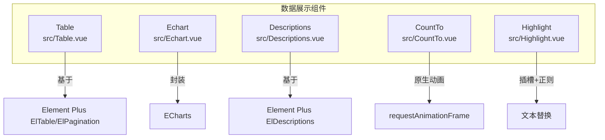
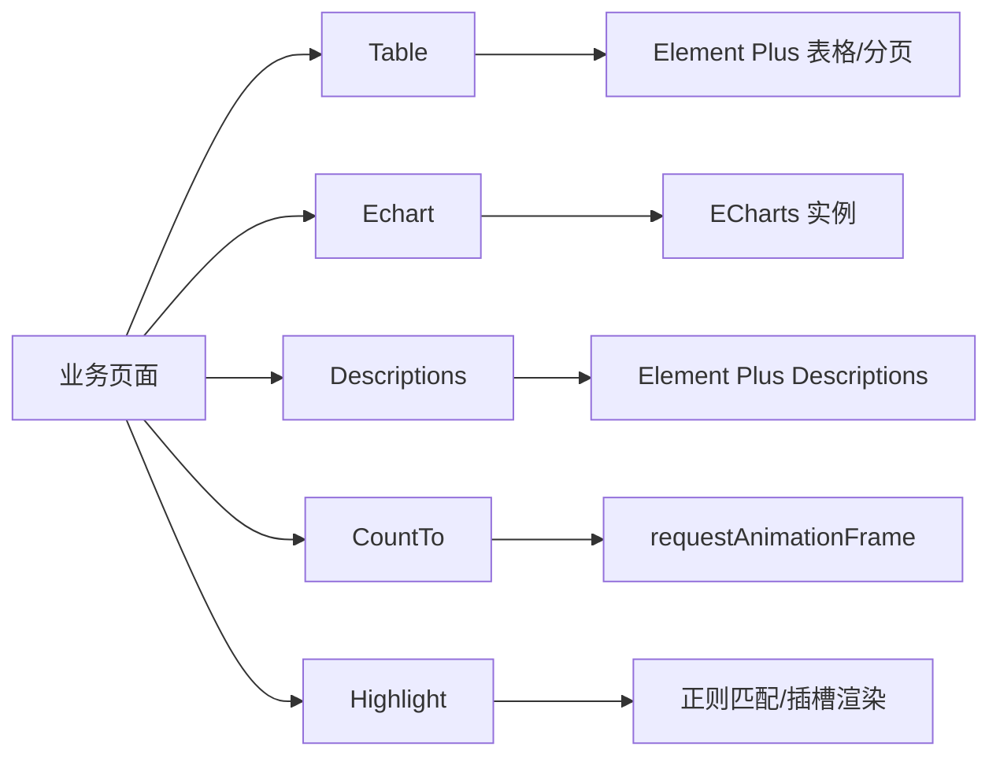
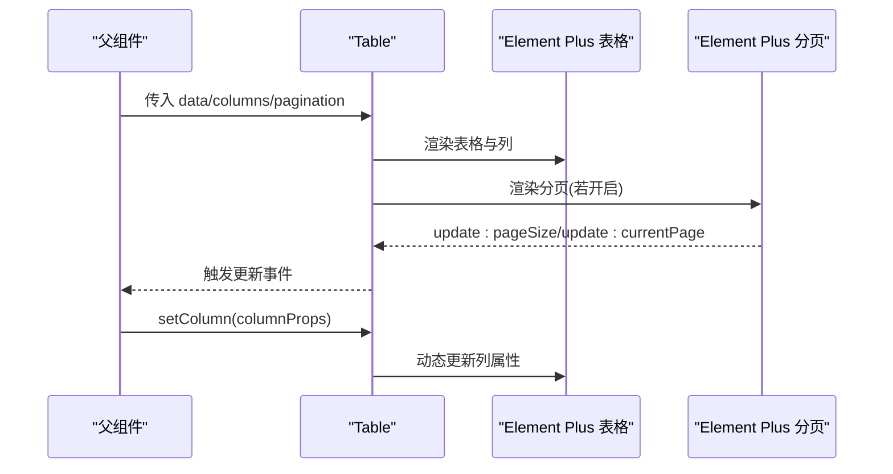
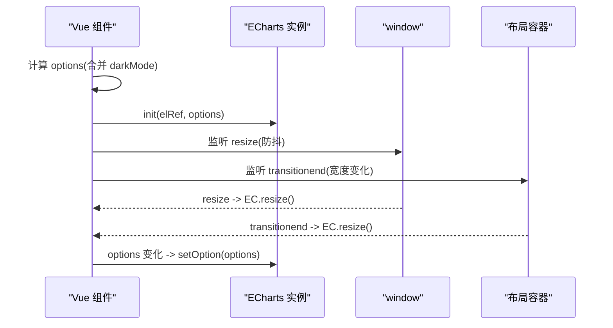
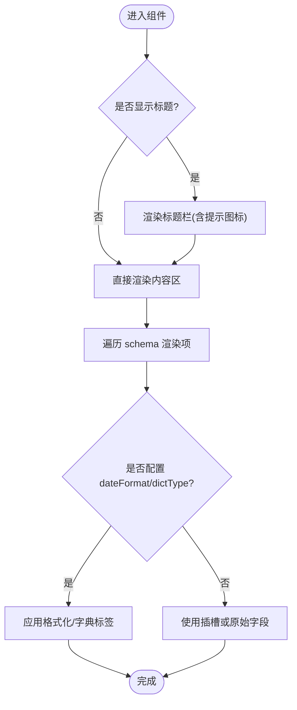
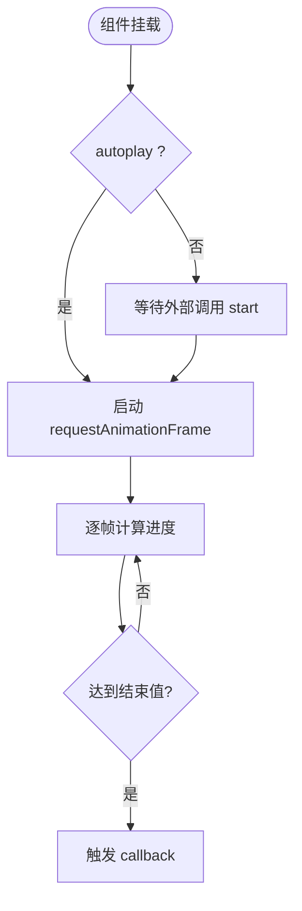
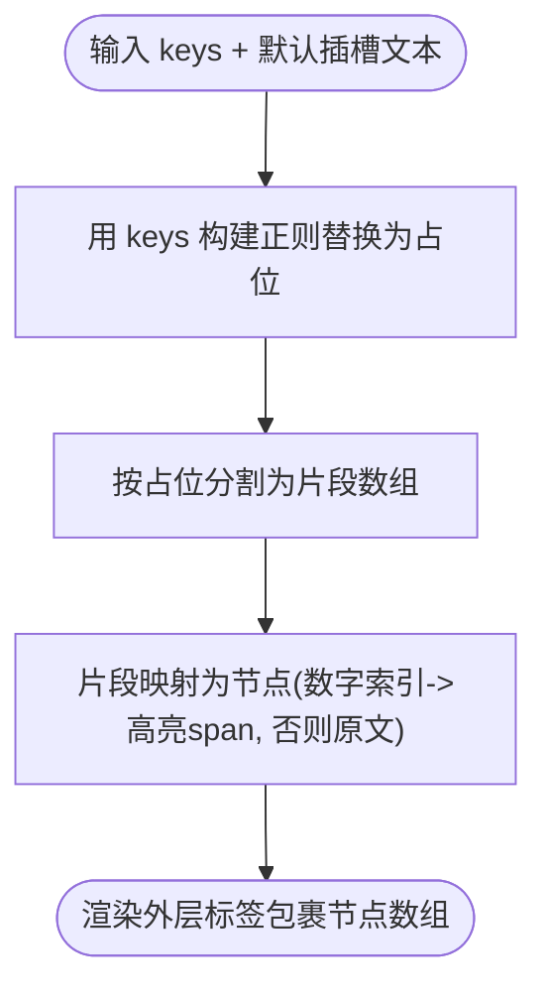
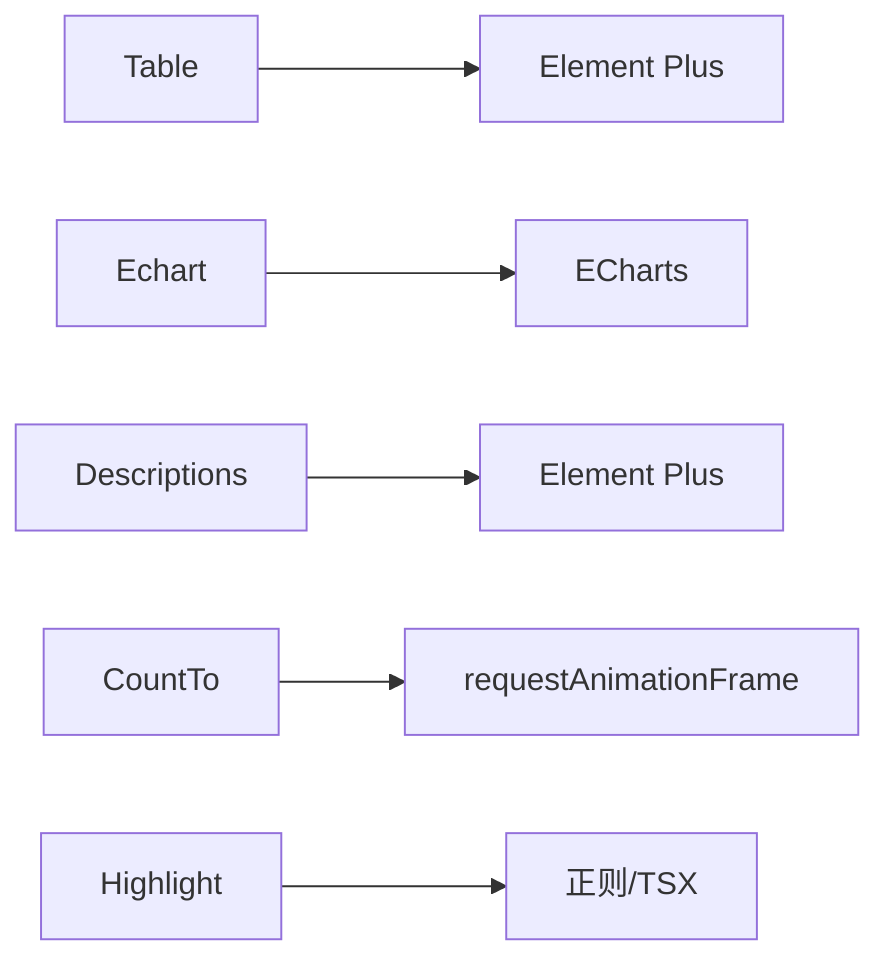

# 数据展示组件

<cite>
**本文引用的文件**
- [Table/index.ts](file://yudao-ui-admin-vue3/src/components/Table/index.ts)
- [Table/src/Table.vue](file://yudao-ui-admin-vue3/src/components/Table/src/Table.vue)
- [Echart/index.ts](file://yudao-ui-admin-vue3/src/components/Echart/index.ts)
- [Echart/src/Echart.vue](file://yudao-ui-admin-vue3/src/components/Echart/src/Echart.vue)
- [Descriptions/index.ts](file://yudao-ui-admin-vue3/src/components/Descriptions/index.ts)
- [Descriptions/src/Descriptions.vue](file://yudao-ui-admin-vue3/src/components/Descriptions/src/Descriptions.vue)
- [CountTo/index.ts](file://yudao-ui-admin-vue3/src/components/CountTo/index.ts)
- [CountTo/src/CountTo.vue](file://yudao-ui-admin-vue3/src/components/CountTo/src/CountTo.vue)
- [Highlight/index.ts](file://yudao-ui-admin-vue3/src/components/Highlight/index.ts)
- [Highlight/src/Highlight.vue](file://yudao-ui-admin-vue3/src/components/Highlight/src/Highlight.vue)
</cite>

## 目录
1. [简介](#简介)
2. [项目结构](#项目结构)
3. [核心组件](#核心组件)
4. [架构总览](#架构总览)
5. [详细组件分析](#详细组件分析)
6. [依赖关系分析](#依赖关系分析)
7. [性能考虑](#性能考虑)
8. [故障排查指南](#故障排查指南)
9. [结论](#结论)
10. [附录](#附录)

## 简介
本文件面向数据展示类组件，系统梳理 Table 表格、Echart 图表、Descriptions 描述列表、CountTo 数字动画、Highlight 高亮显示等组件的功能特性与使用方法。重点覆盖：
- 表格的虚拟化渲染、排序筛选、分页处理与自定义列配置
- 图表的数据绑定、主题定制与交互事件处理
- 复杂数据展示场景的实现方案：大数据量优化、实时数据更新、响应式布局适配
- 图表可访问性与 SEO 优化建议

## 项目结构
数据展示相关组件位于前端工程 yudao-ui-admin-vue3 的 src/components 目录下，采用“按功能分目录”的组织方式，每个组件包含 index.ts 导出入口与 src 下的具体实现。

**图示来源**
- [Table/src/Table.vue:1-311](file://yudao-ui-admin-vue3/src/components/Table/src/Table.vue#L1-L311)
- [Echart/src/Echart.vue:1-121](file://yudao-ui-admin-vue3/src/components/Echart/src/Echart.vue#L1-L121)
- [Descriptions/src/Descriptions.vue:1-167](file://yudao-ui-admin-vue3/src/components/Descriptions/src/Descriptions.vue#L1-L167)
- [CountTo/src/CountTo.vue:1-183](file://yudao-ui-admin-vue3/src/components/CountTo/src/CountTo.vue#L1-L183)
- [Highlight/src/Highlight.vue:1-66](file://yudao-ui-admin-vue3/src/components/Highlight/src/Highlight.vue#L1-L66)

**章节来源**
- [Table/index.ts:1-14](file://yudao-ui-admin-vue3/src/components/Table/index.ts#L1-L14)
- [Echart/index.ts:1-4](file://yudao-ui-admin-vue3/src/components/Echart/index.ts#L1-L4)
- [Descriptions/index.ts:1-5](file://yudao-ui-admin-vue3/src/components/Descriptions/index.ts#L1-L5)
- [CountTo/index.ts:1-4](file://yudao-ui-admin-vue3/src/components/CountTo/index.ts#L1-L4)
- [Highlight/index.ts:1-4](file://yudao-ui-admin-vue3/src/components/Highlight/index.ts#L1-L4)

## 核心组件
- Table：对 Element Plus 表格进行二次封装，提供统一的列渲染、分页、选择、展开行、索引计算、动态列属性设置等能力。
- Echart：对 ECharts 进行轻量封装，自动处理主题（明暗模式）、尺寸、窗口 resize 与生命周期管理。
- Descriptions：基于 Element Plus Descriptions 的增强组件，支持标题、折叠、移动端方向切换、字典与日期格式化、插槽扩展。
- CountTo：数字滚动动画组件，支持起止值、时长、小数位、千分位分隔符、前缀后缀、缓动函数、暂停/恢复/重置。
- Highlight：文本高亮组件，通过关键字数组匹配并渲染为可点击的高亮节点，支持自定义标签与颜色。

**章节来源**
- [Table/src/Table.vue:1-311](file://yudao-ui-admin-vue3/src/components/Table/src/Table.vue#L1-L311)
- [Echart/src/Echart.vue:1-121](file://yudao-ui-admin-vue3/src/components/Echart/src/Echart.vue#L1-L121)
- [Descriptions/src/Descriptions.vue:1-167](file://yudao-ui-admin-vue3/src/components/Descriptions/src/Descriptions.vue#L1-L167)
- [CountTo/src/CountTo.vue:1-183](file://yudao-ui-admin-vue3/src/components/CountTo/src/CountTo.vue#L1-L183)
- [Highlight/src/Highlight.vue:1-66](file://yudao-ui-admin-vue3/src/components/Highlight/src/Highlight.vue#L1-L66)

## 架构总览
下图展示了各组件与其外部依赖及内部关键流程的关系。

**图示来源**
- [Table/src/Table.vue:1-311](file://yudao-ui-admin-vue3/src/components/Table/src/Table.vue#L1-L311)
- [Echart/src/Echart.vue:1-121](file://yudao-ui-admin-vue3/src/components/Echart/src/Echart.vue#L1-L121)
- [Descriptions/src/Descriptions.vue:1-167](file://yudao-ui-admin-vue3/src/components/Descriptions/src/Descriptions.vue#L1-L167)
- [CountTo/src/CountTo.vue:1-183](file://yudao-ui-admin-vue3/src/components/CountTo/src/CountTo.vue#L1-L183)
- [Highlight/src/Highlight.vue:1-66](file://yudao-ui-admin-vue3/src/components/Highlight/src/Highlight.vue#L1-L66)

## 详细组件分析

### Table 表格组件
- 功能要点
  - 列渲染：支持 type=index、selection、expand、自定义 formatter、插槽字段与表头插槽；支持多级列嵌套。
  - 分页：内置默认分页配置，支持 pageSize/currentPage 双向绑定，页码大小自适应屏幕宽度。
  - 选择与展开：可选多选列与展开行，支持 reserveSelection 保留选中状态。
  - 动态列：暴露 setColumn 方法，可按 field 定位列并修改任意属性路径。
  - 索引：支持 reserveIndex 与分页叠加的序号计算。
  - 加载态：v-loading 包裹表格区域。
  - 对外暴露：setProps、setColumn、selections、elTableRef。
- 使用建议
  - 大数据量：结合后端分页或虚拟滚动（如 vue-virtual-scroller）以减轻 DOM 压力。
  - 排序筛选：在 columns 中启用 sortable/filterable，并通过服务端接口完成实际排序与过滤。
  - 自定义列：优先使用 formatter 或插槽，避免在模板中写复杂逻辑。
  - 性能：减少不必要的深度监听，合理使用 reserveSelection/reserveIndex。

**图示来源**
- [Table/src/Table.vue:51-149](file://yudao-ui-admin-vue3/src/components/Table/src/Table.vue#L51-L149)
- [Table/src/Table.vue:151-295](file://yudao-ui-admin-vue3/src/components/Table/src/Table.vue#L151-L295)

**章节来源**
- [Table/src/Table.vue:1-311](file://yudao-ui-admin-vue3/src/components/Table/src/Table.vue#L1-L311)
- [Table/index.ts:1-14](file://yudao-ui-admin-vue3/src/components/Table/index.ts#L1-L14)

### Echart 图表组件
- 功能要点
  - 数据绑定：接收 options 对象，自动合并 darkMode 主题开关。
  - 主题定制：根据应用全局明暗模式自动切换主题。
  - 尺寸与响应式：支持 width/height 字符串或数值；监听 window resize 与内容区 transitionend 事件，防抖调用 resize。
  - 生命周期：onMounted 初始化，onBeforeUnmount 清理监听，onActivated 再次 resize。
- 使用建议
  - 大数据量：按需引入系列与组件，避免全量引入；使用 dataZoom、采样聚合、增量更新。
  - 交互事件：通过 options 中的 event 注册回调，或使用实例方法 on 绑定。
  - 可访问性：为图表添加 aria 描述、键盘导航提示；必要时提供数据表格降级视图。
  - SEO：图表内容对爬虫不可见，建议在服务端生成静态图片或结构化数据补充。

**图示来源**
- [Echart/src/Echart.vue:24-81](file://yudao-ui-admin-vue3/src/components/Echart/src/Echart.vue#L24-L81)
- [Echart/src/Echart.vue:83-115](file://yudao-ui-admin-vue3/src/components/Echart/src/Echart.vue#L83-L115)

**章节来源**
- [Echart/src/Echart.vue:1-121](file://yudao-ui-admin-vue3/src/components/Echart/src/Echart.vue#L1-L121)
- [Echart/index.ts:1-4](file://yudao-ui-admin-vue3/src/components/Echart/index.ts#L1-L4)

### Descriptions 描述列表组件
- 功能要点
  - 基础能力：标题、提示信息、折叠面板、列数控制、移动端垂直布局。
  - 数据映射：支持 mappedField 映射字段、dateFormat 日期格式化、dictType 字典渲染。
  - 插槽扩展：支持 extra、field-label、field 插槽自定义渲染。
  - 透传：将非内部 props 透传给底层 Descriptions。
- 使用建议
  - 长表单信息：合理设置 columns，移动端自动切换垂直布局提升可读性。
  - 敏感信息：配合 Tooltip 展示说明，避免误操作。
  - 性能：schema 尽量扁平，避免过深嵌套。

**图示来源**
- [Descriptions/src/Descriptions.vue:19-67](file://yudao-ui-admin-vue3/src/components/Descriptions/src/Descriptions.vue#L19-L67)
- [Descriptions/src/Descriptions.vue:70-141](file://yudao-ui-admin-vue3/src/components/Descriptions/src/Descriptions.vue#L70-L141)

**章节来源**
- [Descriptions/src/Descriptions.vue:1-167](file://yudao-ui-admin-vue3/src/components/Descriptions/src/Descriptions.vue#L1-L167)
- [Descriptions/index.ts:1-5](file://yudao-ui-admin-vue3/src/components/Descriptions/index.ts#L1-L5)

### CountTo 数字动画组件
- 功能要点
  - 动画控制：startVal/endVal/duration/autoplay；支持 useEasing/easingFn 自定义缓动。
  - 格式化：decimals/decimal/separator/prefix/suffix。
  - 生命周期：mounted 时根据 autoplay 启动；watch 起止值变化自动重启。
  - 暴露方法：pauseResume/reset/start/pause。
- 使用建议
  - 频繁更新：避免每帧都创建新实例，复用组件实例并仅更新 props。
  - 大数值：合理设置 decimals 与 separator，避免过多重绘。
  - 可访问性：为数字增加 aria-live 或 role="status" 以便读屏器播报变化。

**图示来源**
- [CountTo/src/CountTo.vue:74-98](file://yudao-ui-admin-vue3/src/components/CountTo/src/CountTo.vue#L74-L98)
- [CountTo/src/CountTo.vue:127-168](file://yudao-ui-admin-vue3/src/components/CountTo/src/CountTo.vue#L127-L168)

**章节来源**
- [CountTo/src/CountTo.vue:1-183](file://yudao-ui-admin-vue3/src/components/CountTo/src/CountTo.vue#L1-L183)
- [CountTo/index.ts:1-4](file://yudao-ui-admin-vue3/src/components/CountTo/index.ts#L1-L4)

### Highlight 高亮显示组件
- 功能要点
  - 关键字匹配：keys 数组用于构建正则，将文本中匹配部分替换为占位标记，再映射为可点击的高亮节点。
  - 渲染：支持 tag 自定义外层标签；color 控制高亮颜色；click 事件返回被点击的关键字。
  - 插槽：默认插槽传入原始文本，组件负责解析与重组。
- 使用建议
  - 性能：keys 数量不宜过大，避免复杂正则；必要时做去重与缓存。
  - 可访问性：为高亮节点添加 role="button" 与 tabindex，便于键盘操作。

**图示来源**
- [Highlight/src/Highlight.vue:16-62](file://yudao-ui-admin-vue3/src/components/Highlight/src/Highlight.vue#L16-L62)

**章节来源**
- [Highlight/src/Highlight.vue:1-66](file://yudao-ui-admin-vue3/src/components/Highlight/src/Highlight.vue#L1-L66)
- [Highlight/index.ts:1-4](file://yudao-ui-admin-vue3/src/components/Highlight/index.ts#L1-L4)

## 依赖关系分析
- 组件间耦合度低，均通过 props/events 与父组件通信，符合单一职责原则。
- 外部依赖
  - Table：Element Plus 表格与分页；lodash-es 辅助。
  - Echart：ECharts 及其插件；应用 store 获取主题；lodash-es 防抖。
  - Descriptions：Element Plus Descriptions；dayjs 日期格式化；字典标签。
  - CountTo：原生 requestAnimationFrame；类型与工具函数。
  - Highlight：tsx 与正则表达式。

**图示来源**
- [Table/src/Table.vue:1-311](file://yudao-ui-admin-vue3/src/components/Table/src/Table.vue#L1-L311)
- [Echart/src/Echart.vue:1-121](file://yudao-ui-admin-vue3/src/components/Echart/src/Echart.vue#L1-L121)
- [Descriptions/src/Descriptions.vue:1-167](file://yudao-ui-admin-vue3/src/components/Descriptions/src/Descriptions.vue#L1-L167)
- [CountTo/src/CountTo.vue:1-183](file://yudao-ui-admin-vue3/src/components/CountTo/src/CountTo.vue#L1-L183)
- [Highlight/src/Highlight.vue:1-66](file://yudao-ui-admin-vue3/src/components/Highlight/src/Highlight.vue#L1-L66)

**章节来源**
- [Table/src/Table.vue:1-311](file://yudao-ui-admin-vue3/src/components/Table/src/Table.vue#L1-L311)
- [Echart/src/Echart.vue:1-121](file://yudao-ui-admin-vue3/src/components/Echart/src/Echart.vue#L1-L121)
- [Descriptions/src/Descriptions.vue:1-167](file://yudao-ui-admin-vue3/src/components/Descriptions/src/Descriptions.vue#L1-L167)
- [CountTo/src/CountTo.vue:1-183](file://yudao-ui-admin-vue3/src/components/CountTo/src/CountTo.vue#L1-L183)
- [Highlight/src/Highlight.vue:1-66](file://yudao-ui-admin-vue3/src/components/Highlight/src/Highlight.vue#L1-L66)

## 性能考虑
- 表格
  - 大数据量：优先后端分页；如需前端分页，限制单页条数并结合虚拟滚动。
  - 列渲染：避免在列中使用重型计算，尽量使用 formatter 或预计算字段。
  - 选择与索引：reserveSelection/reserveIndex 仅在需要时开启。
- 图表
  - 数据规模：使用 dataZoom、采样、增量更新；按需引入系列与组件。
  - 响应式：防抖 resize，避免频繁重建实例。
  - 主题切换：合并 darkMode，减少重复 setOption。
- 描述列表
  - 字段映射：提前准备映射字段，减少运行时转换。
  - 插槽：仅在必要时使用插槽，避免过度抽象导致维护成本上升。
- 数字动画
  - 频率：避免高频 props 变更导致频繁重启动画。
  - 精度：合理设置 decimals，降低重绘开销。
- 高亮
  - 正则：keys 去重与缓存；避免贪婪匹配造成性能问题。

[本节为通用指导，不直接分析具体文件]

## 故障排查指南
- 表格
  - 现象：分页无效或页码不同步
    - 检查是否正确使用 v-model:pageSize/v-model:currentPage，并确保父组件同步更新。
    - 参考：[Table/src/Table.vue:123-149](file://yudao-ui-admin-vue3/src/components/Table/src/Table.vue#L123-L149)
  - 现象：列属性未生效
    - 确认 setColumn 的 field 与 path 正确；children 层级需递归匹配。
    - 参考：[Table/src/Table.vue:81-92](file://yudao-ui-admin-vue3/src/components/Table/src/Table.vue#L81-L92)
- 图表
  - 现象：窗口缩放后图表尺寸异常
    - 检查是否监听 window resize 与内容区 transitionend，并调用 resize。
    - 参考：[Echart/src/Echart.vue:83-115](file://yudao-ui-admin-vue3/src/components/Echart/src/Echart.vue#L83-L115)
  - 现象：主题未切换
    - 确认 appStore 明暗模式与 options.darkMode 合并逻辑。
    - 参考：[Echart/src/Echart.vue:33-45](file://yudao-ui-admin-vue3/src/components/Echart/src/Echart.vue#L33-L45)
- 描述列表
  - 现象：字段未显示或显示为空
    - 检查 schema.field 与 data 对应关系，必要时使用 mappedField。
    - 参考：[Descriptions/src/Descriptions.vue:124-135](file://yudao-ui-admin-vue3/src/components/Descriptions/src/Descriptions.vue#L124-L135)
- 数字动画
  - 现象：动画不播放或中途停止
    - 检查 autoplay 与 startVal/endVal 变化监听；必要时调用 expose 方法控制。
    - 参考：[CountTo/src/CountTo.vue:74-98](file://yudao-ui-admin-vue3/src/components/CountTo/src/CountTo.vue#L74-L98)
- 高亮
  - 现象：关键字未高亮
    - 检查 keys 是否为空、正则是否被转义；确保默认插槽传入纯文本。
    - 参考：[Highlight/src/Highlight.vue:35-59](file://yudao-ui-admin-vue3/src/components/Highlight/src/Highlight.vue#L35-L59)

**章节来源**
- [Table/src/Table.vue:81-149](file://yudao-ui-admin-vue3/src/components/Table/src/Table.vue#L81-L149)
- [Echart/src/Echart.vue:33-115](file://yudao-ui-admin-vue3/src/components/Echart/src/Echart.vue#L33-L115)
- [Descriptions/src/Descriptions.vue:124-135](file://yudao-ui-admin-vue3/src/components/Descriptions/src/Descriptions.vue#L124-L135)
- [CountTo/src/CountTo.vue:74-98](file://yudao-ui-admin-vue3/src/components/CountTo/src/CountTo.vue#L74-L98)
- [Highlight/src/Highlight.vue:35-59](file://yudao-ui-admin-vue3/src/components/Highlight/src/Highlight.vue#L35-L59)

## 结论
本仓库的数据展示组件围绕易用性、可扩展性与性能进行了系统化设计。Table 提供了丰富的列与分页能力；Echart 简化了主题与响应式处理；Descriptions 提升了信息呈现效率；CountTo 与 Highlight 增强了数据展示的可视化与交互性。在实际项目中，建议结合后端分页、按需引入与合理的渲染策略，以获得更优的用户体验与性能表现。

[本节为总结性内容，不直接分析具体文件]

## 附录
- 复杂数据展示场景建议
  - 大数据量表格：后端分页 + 前端虚拟滚动；禁用不必要的选择与索引；延迟加载详情。
  - 实时数据更新：图表使用增量 setOption；表格使用局部数据更新而非全量替换；避免频繁重建组件。
  - 响应式布局：图表监听容器宽度变化；描述列表在移动端切换垂直布局；表格列宽自适应。
- 可访问性与 SEO
  - 可访问性：为交互元素提供语义化标签与键盘支持；图表提供替代文本或数据表格；数字变化使用 aria-live。
  - SEO：图表内容对爬虫不可见，建议服务端渲染静态图或结构化数据；表格内容保持语义化 HTML。

[本节为通用指导，不直接分析具体文件]