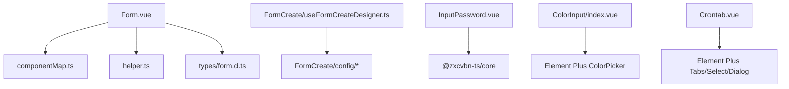
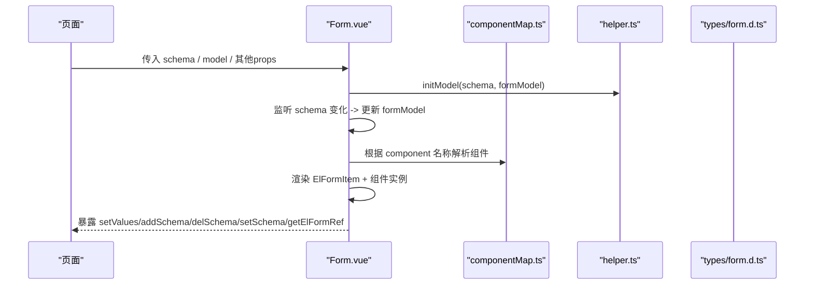
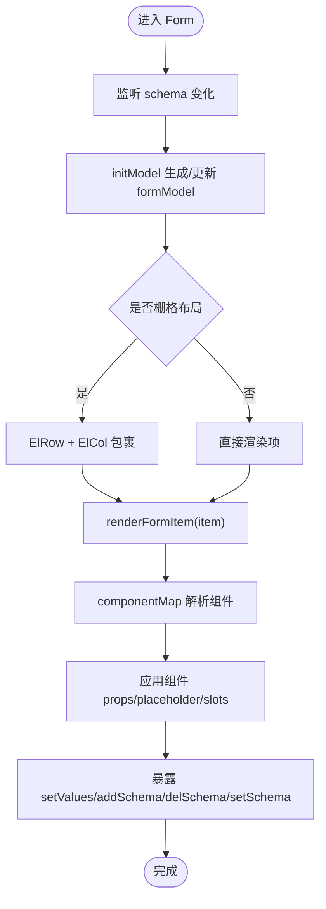
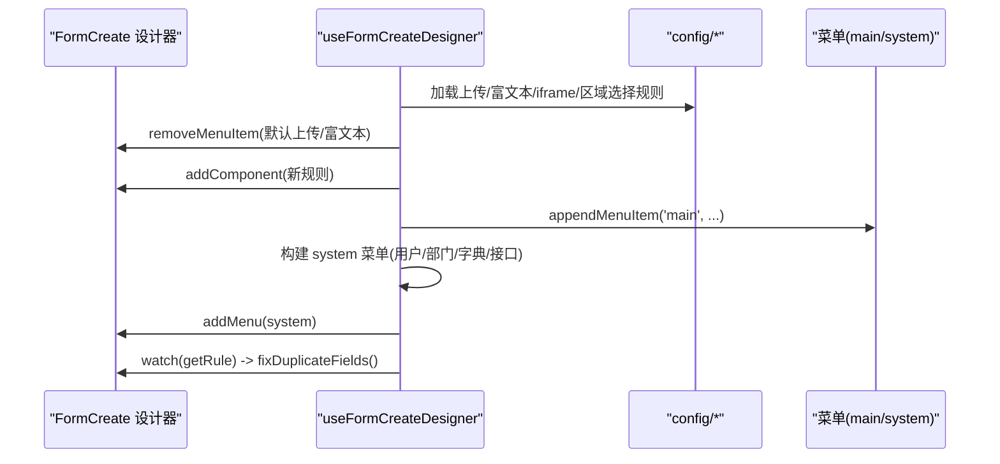
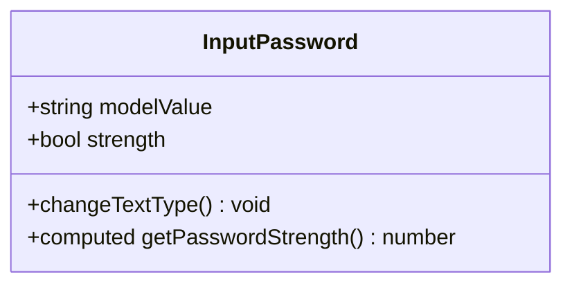
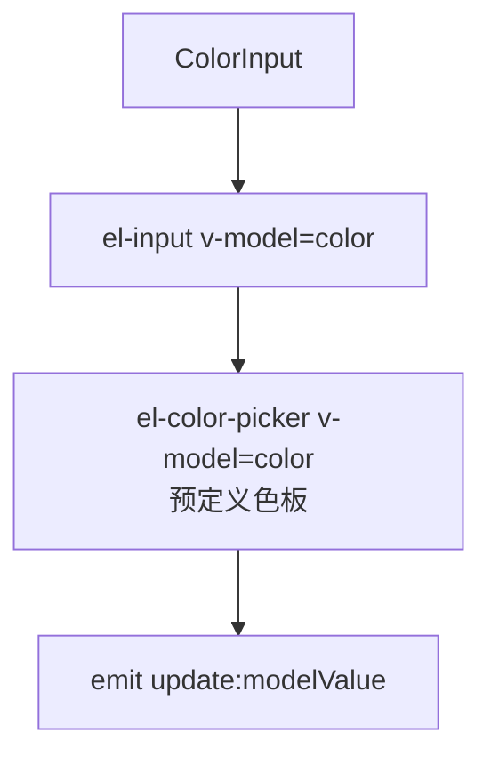
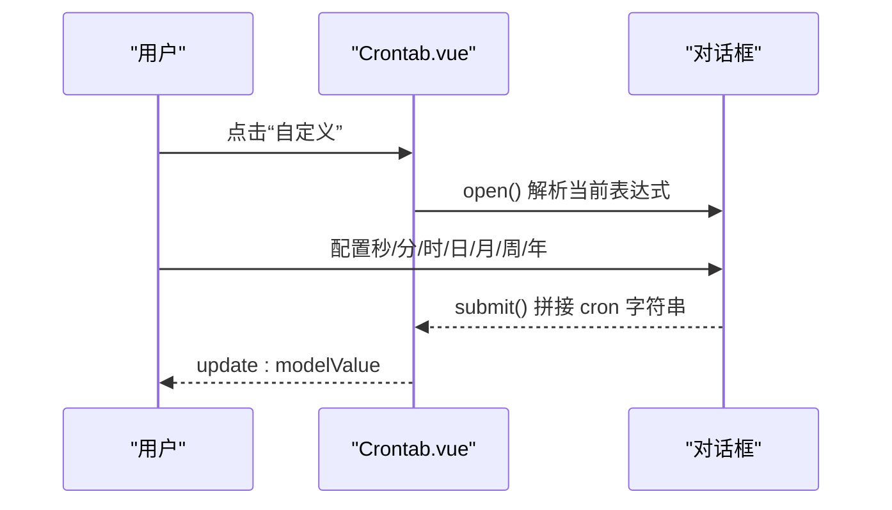
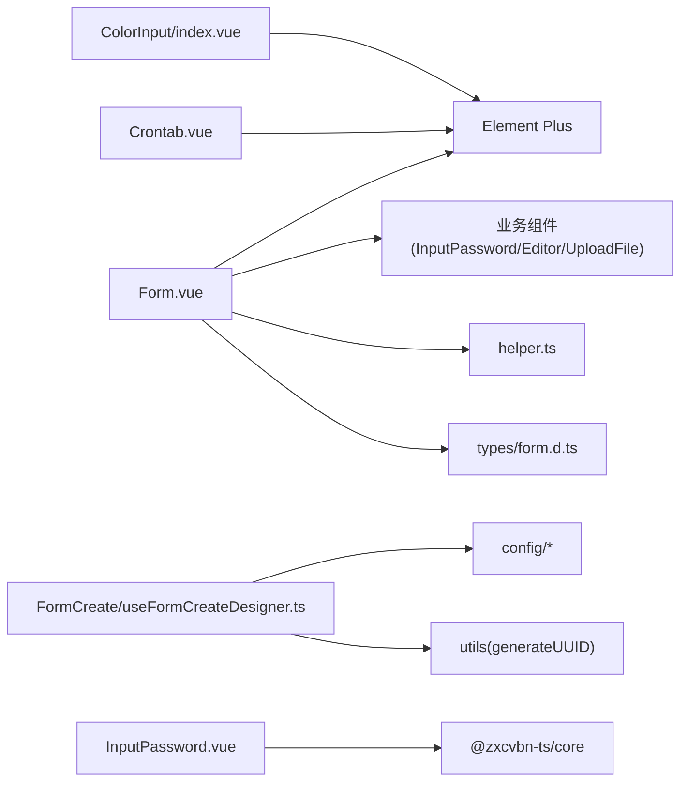

# 表单组件

<cite>
**本文引用的文件**
- [Form/index.ts](file://yudao-ui-admin-vue3/src/components/Form/index.ts)
- [Form.vue](file://yudao-ui-admin-vue3/src/components/Form/src/Form.vue)
- [componentMap.ts](file://yudao-ui-admin-vue3/src/components/Form/src/componentMap.ts)
- [helper.ts](file://yudao-ui-admin-vue3/src/components/Form/src/helper.ts)
- [form.d.ts](file://yudao-ui-admin-vue3/src/types/form.d.ts)
- [FormCreate/index.ts](file://yudao-ui-admin-vue3/src/components/FormCreate/index.ts)
- [useFormCreateDesigner.ts](file://yudao-ui-admin-vue3/src/components/FormCreate/src/useFormCreateDesigner.ts)
- [InputPassword/index.ts](file://yudao-ui-admin-vue3/src/components/InputPassword/index.ts)
- [InputPassword.vue](file://yudao-ui-admin-vue3/src/components/InputPassword/src/InputPassword.vue)
- [ColorInput/index.vue](file://yudao-ui-admin-vue3/src/components/ColorInput/index.vue)
- [Crontab/index.ts](file://yudao-ui-admin-vue3/src/components/Crontab/index.ts)
- [Crontab.vue](file://yudao-ui-admin-vue3/src/components/Crontab/src/Crontab.vue)
</cite>

## 目录
1. [简介](#简介)
2. [项目结构](#项目结构)
3. [核心组件](#核心组件)
4. [架构总览](#架构总览)
5. [详细组件分析](#详细组件分析)
6. [依赖关系分析](#依赖关系分析)
7. [性能考虑](#性能考虑)
8. [故障排查指南](#故障排查指南)
9. [结论](#结论)
10. [附录：使用示例与最佳实践](#附录使用示例与最佳实践)

## 简介
本章节面向表单相关组件的使用与扩展，覆盖以下能力：
- Form 动态表单：基于 schema 驱动渲染、数据绑定、验证规则、动态增删字段、栅格布局与自定义插槽。
- FormCreate 表单设计器：可视化编辑、组件库管理、配置生成与系统字段集成（用户/部门/字典/接口选择器等）。
- InputPassword 密码输入：支持明文/密文切换与可选的密码强度指示。
- ColorInput 颜色选择器：输入框与颜色选择器组合，内置常用预设色板。
- Crontab 定时表达式：可视化生成 cron 表达式，支持秒/分/时/日/月/周/年等维度配置与快捷选项。

## 项目结构
本项目在 yudao-ui-admin-vue3 中提供统一的表单生态：
- 基础表单容器：Form 组件通过 schema 数组驱动渲染，内部维护 formModel，暴露 setValues/addSchema/delSchema/setSchema 等方法。
- 组件映射：componentMap 将字符串组件名映射到具体 UI 组件（Element Plus 或业务组件）。
- 辅助工具：helper 提供占位符自动设置、栅格属性合并、组件默认 props、schema 到 model 初始化等。
- 类型定义：types/form.d.ts 定义了 FormSchema、FormItemProps、FormSetPropsType 等关键类型。
- 设计器增强：FormCreate/useFormCreateDesigner 注入上传、富文本、iframe、区域选择、用户/部门/字典/接口选择器等规则，并修复重复字段 ID。
- 专用组件：InputPassword、ColorInput、Crontab 作为可复用表单控件，可直接在 schema 中使用或通过设计器拖拽。

**图表来源**
- [Form.vue:1-307](file://yudao-ui-admin-vue3/src/components/Form/src/Form.vue#L1-L307)
- [componentMap.ts:1-56](file://yudao-ui-admin-vue3/src/components/Form/src/componentMap.ts#L1-L56)
- [helper.ts:1-149](file://yudao-ui-admin-vue3/src/components/Form/src/helper.ts#L1-L149)
- [form.d.ts:1-45](file://yudao-ui-admin-vue3/src/types/form.d.ts#L1-L45)
- [useFormCreateDesigner.ts:1-191](file://yudao-ui-admin-vue3/src/components/FormCreate/src/useFormCreateDesigner.ts#L1-L191)
- [InputPassword.vue:1-153](file://yudao-ui-admin-vue3/src/components/InputPassword/src/InputPassword.vue#L1-L153)
- [ColorInput/index.vue:1-35](file://yudao-ui-admin-vue3/src/components/ColorInput/index.vue#L1-L35)
- [Crontab.vue:1-800](file://yudao-ui-admin-vue3/src/components/Crontab/src/Crontab.vue#L1-L800)

**章节来源**
- [Form.vue:1-307](file://yudao-ui-admin-vue3/src/components/Form/src/Form.vue#L1-L307)
- [componentMap.ts:1-56](file://yudao-ui-admin-vue3/src/components/Form/src/componentMap.ts#L1-L56)
- [helper.ts:1-149](file://yudao-ui-admin-vue3/src/components/Form/src/helper.ts#L1-L149)
- [form.d.ts:1-45](file://yudao-ui-admin-vue3/src/types/form.d.ts#L1-L45)
- [useFormCreateDesigner.ts:1-191](file://yudao-ui-admin-vue3/src/components/FormCreate/src/useFormCreateDesigner.ts#L1-L191)

## 核心组件
- Form 动态表单
  - 以 schema 驱动渲染，支持栅格布局、labelMessage 提示、自动 placeholder、隐藏字段过滤、Divider 特殊处理。
  - 暴露方法：setValues、setProps、addSchema、delSchema、setSchema、getElFormRef；内部维护 formModel。
  - 监听 schema 变化，调用 initModel 同步 formModel。
- FormCreate 表单设计器
  - 注入上传、富文本、iframe、区域选择、用户/部门/字典/接口选择器等规则，并注册到“main”和“system”菜单。
  - 自动修复复制导致的重复字段 ID，避免冲突。
- InputPassword 密码输入
  - 支持明文/密文切换，可选显示密码强度条（基于 zxcvbn 评分）。
- ColorInput 颜色选择器
  - 输入框 + 颜色选择器组合，内置预设色板，双向绑定 color。
- Crontab 定时表达式
  - 可视化编辑秒/分/时/日/月/周/年，支持范围、间隔、指定、特殊值（如 L、?），并提供快捷选项。

**章节来源**
- [Form/index.ts:1-16](file://yudao-ui-admin-vue3/src/components/Form/index.ts#L1-L16)
- [Form.vue:1-307](file://yudao-ui-admin-vue3/src/components/Form/src/Form.vue#L1-L307)
- [useFormCreateDesigner.ts:1-191](file://yudao-ui-admin-vue3/src/components/FormCreate/src/useFormCreateDesigner.ts#L1-L191)
- [InputPassword.vue:1-153](file://yudao-ui-admin-vue3/src/components/InputPassword/src/InputPassword.vue#L1-L153)
- [ColorInput/index.vue:1-35](file://yudao-ui-admin-vue3/src/components/ColorInput/index.vue#L1-L35)
- [Crontab.vue:1-800](file://yudao-ui-admin-vue3/src/components/Crontab/src/Crontab.vue#L1-L800)

## 架构总览
下图展示 Form 动态表单与组件映射、辅助函数、类型之间的关系，以及 FormCreate 对设计器的增强流程。

**图表来源**
- [Form.vue:1-307](file://yudao-ui-admin-vue3/src/components/Form/src/Form.vue#L1-L307)
- [componentMap.ts:1-56](file://yudao-ui-admin-vue3/src/components/Form/src/componentMap.ts#L1-L56)
- [helper.ts:1-149](file://yudao-ui-admin-vue3/src/components/Form/src/helper.ts#L1-L149)
- [form.d.ts:1-45](file://yudao-ui-admin-vue3/src/types/form.d.ts#L1-L45)

## 详细组件分析

### Form 动态表单
- 数据绑定
  - 内部维护 formModel，监听 schema 变化并通过 initModel 同步字段初始值；支持 isCustom 模式直接绑定外部 model。
  - 通过 v-model 将每个字段与 formModel[field] 绑定。
- 验证规则
  - 通过 formItemProps.rules 传入 Element Plus 校验规则；可通过 field-error 插槽自定义错误信息。
- 动态渲染
  - 支持 hidden 过滤、Divider 独占一行、栅格布局（isCol）、labelMessage 提示、自动 placeholder。
  - 支持 options 渲染策略（Select/Radio/Checkbox）及 SelectV2/Cascader/Transfer 的特殊处理。
- 事件处理
  - 暴露 getElFormRef 获取底层 ElForm 引用，便于手动触发 validate/submit 等。
  - 支持 addSchema/delSchema/setSchema 动态调整结构与属性。

**图表来源**
- [Form.vue:1-307](file://yudao-ui-admin-vue3/src/components/Form/src/Form.vue#L1-L307)
- [helper.ts:1-149](file://yudao-ui-admin-vue3/src/components/Form/src/helper.ts#L1-L149)
- [componentMap.ts:1-56](file://yudao-ui-admin-vue3/src/components/Form/src/componentMap.ts#L1-L56)

**章节来源**
- [Form.vue:1-307](file://yudao-ui-admin-vue3/src/components/Form/src/Form.vue#L1-L307)
- [helper.ts:1-149](file://yudao-ui-admin-vue3/src/components/Form/src/helper.ts#L1-L149)
- [form.d.ts:1-45](file://yudao-ui-admin-vue3/src/types/form.d.ts#L1-L45)

### FormCreate 表单设计器
- 可视化编辑能力
  - 通过 useFormCreateDesigner 注入上传、富文本、iframe、区域选择等规则，并挂载到“main”分类。
  - 新增“system”分类，包含用户选择器、部门选择器、字典选择器、接口选择器。
- 组件库管理与配置生成
  - 移除默认上传/富文本规则，替换为业务定制规则；统一注册组件与菜单项。
  - 自动修复复制产生的重复字段 ID，保障表单稳定性。
- 与 Form 的关系
  - 设计器生成的规则可用于 Form 的 schema，实现“所见即所得”的动态表单构建。

**图表来源**
- [useFormCreateDesigner.ts:1-191](file://yudao-ui-admin-vue3/src/components/FormCreate/src/useFormCreateDesigner.ts#L1-L191)

**章节来源**
- [FormCreate/index.ts:1-5](file://yudao-ui-admin-vue3/src/components/FormCreate/index.ts#L1-L5)
- [useFormCreateDesigner.ts:1-191](file://yudao-ui-admin-vue3/src/components/FormCreate/src/useFormCreateDesigner.ts#L1-L191)

### InputPassword 密码输入
- 功能要点
  - 支持明文/密文切换；可选显示密码强度条（基于 zxcvbn 评分）。
  - 双向绑定 modelValue，支持 size 主题适配。
- 使用建议
  - 在 schema 中通过 component: 'InputPassword' 引入；结合 rules 进行长度/复杂度校验。
  - 开启 strength 可在交互上直观反馈密码强度。

**图表来源**
- [InputPassword.vue:1-153](file://yudao-ui-admin-vue3/src/components/InputPassword/src/InputPassword.vue#L1-L153)

**章节来源**
- [InputPassword/index.ts:1-4](file://yudao-ui-admin-vue3/src/components/InputPassword/index.ts#L1-L4)
- [InputPassword.vue:1-153](file://yudao-ui-admin-vue3/src/components/InputPassword/src/InputPassword.vue#L1-L153)

### ColorInput 颜色选择器
- 功能要点
  - 输入框与颜色选择器组合，双向绑定 color；内置预设色板。
- 使用建议
  - 在 schema 中通过 component: 'ColorInput' 引入；适合主题配置、样式定制场景。

**图表来源**
- [ColorInput/index.vue:1-35](file://yudao-ui-admin-vue3/src/components/ColorInput/index.vue#L1-L35)

**章节来源**
- [ColorInput/index.vue:1-35](file://yudao-ui-admin-vue3/src/components/ColorInput/index.vue#L1-L35)

### Crontab 定时表达式
- 功能要点
  - 可视化编辑秒/分/时/日/月/周/年，支持任意值、范围、间隔、指定、特殊值（L/?）。
  - 提供快捷选项（每分钟/每小时/每天零点等），支持自定义快捷项。
  - 打开对话框解析现有表达式，提交时拼接完整 cron 字符串并回写。
- 使用建议
  - 在 schema 中通过 component: 'Crontab' 引入；配合后端任务调度使用。

**图表来源**
- [Crontab.vue:1-800](file://yudao-ui-admin-vue3/src/components/Crontab/src/Crontab.vue#L1-L800)

**章节来源**
- [Crontab/index.ts:1-3](file://yudao-ui-admin-vue3/src/components/Crontab/index.ts#L1-L3)
- [Crontab.vue:1-800](file://yudao-ui-admin-vue3/src/components/Crontab/src/Crontab.vue#L1-L800)

## 依赖关系分析
- Form 依赖
  - Element Plus 组件（ElForm/ElFormItem/ElCol/ElRow 等）。
  - 业务组件映射（InputPassword、Editor、UploadFile 等）。
  - 辅助函数（setTextPlaceholder、setGridProp、setComponentProps、initModel 等）。
  - 类型定义（FormSchema、FormItemProps、FormSetPropsType）。
- FormCreate 依赖
  - 设计器 API（addComponent/removeMenuItem/addMenu/appendMenuItem/getRule/setRule）。
  - 配置模块（useEditorRule、useUpload*Rule、useAreaSelectRule、useDictSelectRule、useIframeRule、useSelectRule）。
  - 工具函数（generateUUID）。
- 专用组件依赖
  - InputPassword：@zxcvbn-ts/core 用于密码强度评估。
  - ColorInput：Element Plus ColorPicker。
  - Crontab：Element Plus Tabs/Select/Dialog/InputNumber 等。

**图表来源**
- [Form.vue:1-307](file://yudao-ui-admin-vue3/src/components/Form/src/Form.vue#L1-L307)
- [componentMap.ts:1-56](file://yudao-ui-admin-vue3/src/components/Form/src/componentMap.ts#L1-L56)
- [helper.ts:1-149](file://yudao-ui-admin-vue3/src/components/Form/src/helper.ts#L1-L149)
- [form.d.ts:1-45](file://yudao-ui-admin-vue3/src/types/form.d.ts#L1-L45)
- [useFormCreateDesigner.ts:1-191](file://yudao-ui-admin-vue3/src/components/FormCreate/src/useFormCreateDesigner.ts#L1-L191)
- [InputPassword.vue:1-153](file://yudao-ui-admin-vue3/src/components/InputPassword/src/InputPassword.vue#L1-L153)
- [ColorInput/index.vue:1-35](file://yudao-ui-admin-vue3/src/components/ColorInput/index.vue#L1-L35)
- [Crontab.vue:1-800](file://yudao-ui-admin-vue3/src/components/Crontab/src/Crontab.vue#L1-L800)

**章节来源**
- [Form.vue:1-307](file://yudao-ui-admin-vue3/src/components/Form/src/Form.vue#L1-L307)
- [useFormCreateDesigner.ts:1-191](file://yudao-ui-admin-vue3/src/components/FormCreate/src/useFormCreateDesigner.ts#L1-L191)

## 性能考虑
- 大表单渲染优化
  - 合理使用 hidden 字段减少 DOM 节点数量。
  - 对于大量下拉选项，优先使用 SelectV2 以提升滚动与搜索性能。
  - 按需加载远程选项（api 字段）并结合防抖/分页策略。
- 计算与监听
  - 避免在 schema 中放置重型计算逻辑，尽量在父组件预处理后传入。
  - 谨慎使用 deep watch，必要时拆分 schema 或使用局部更新。
- 组件复用
  - 将复杂字段封装为子组件并通过 componentMap 注册，提升复用性与可维护性。
- 设计器
  - 使用 useFormCreateDesigner 提供的规则集中管理，减少重复配置带来的渲染开销。

[本节为通用指导，不直接分析具体文件]

## 故障排查指南
- 表单字段未渲染
  - 检查 schema 中 component 是否在 componentMap 中存在映射。
  - 确认 field 唯一且未被 hidden 过滤。
- 表单数据不同步
  - 确认是否处于 isCustom 模式；若为 true，需确保外部 model 正确绑定。
  - 使用 setValues 批量赋值后，必要时调用 setSchema 更新字段属性。
- 验证不生效
  - 检查 formItemProps.rules 是否正确传入；如需自定义错误文案，使用 field-error 插槽。
- 设计器重复字段 ID
  - 使用 useFormCreateDesigner 的自动修复机制；若仍出现冲突，检查复制操作后的字段命名。
- Crontab 表达式无效
  - 打开对话框查看各维度配置；注意 day/week 互斥（? 与具体值不能同时存在）。
  - 使用快捷选项快速生成合法表达式后再微调。

**章节来源**
- [Form.vue:1-307](file://yudao-ui-admin-vue3/src/components/Form/src/Form.vue#L1-L307)
- [helper.ts:1-149](file://yudao-ui-admin-vue3/src/components/Form/src/helper.ts#L1-L149)
- [useFormCreateDesigner.ts:1-191](file://yudao-ui-admin-vue3/src/components/FormCreate/src/useFormCreateDesigner.ts#L1-L191)
- [Crontab.vue:1-800](file://yudao-ui-admin-vue3/src/components/Crontab/src/Crontab.vue#L1-L800)

## 结论
- Form 提供了强大的 schema 驱动能力，结合 helper 与 componentMap 可实现高度可配置的动态表单。
- FormCreate 增强了可视化编辑体验，内置丰富的系统字段与上传/编辑器能力，并具备重复字段 ID 修复机制。
- InputPassword、ColorInput、Crontab 作为专用组件，覆盖了常见业务场景，易于集成与扩展。
- 建议在复杂场景中采用组件化拆分、远程选项按需加载与设计器统一管理，以获得更好的可维护性与性能表现。

[本节为总结性内容，不直接分析具体文件]

## 附录：使用示例与最佳实践
- 复杂表单场景
  - 使用 schema 分组（Divider）与栅格布局组织字段；对长列表使用 SelectV2 与虚拟滚动。
  - 通过 labelMessage 提供字段说明；结合 rules 与 field-error 插槽实现友好校验。
- 自定义表单组件集成
  - 在 componentMap 中注册自定义组件，并在 schema 中通过 component 字段引用。
  - 通过 componentProps.slots 传递插槽，保持与 Element Plus 一致的扩展方式。
- 表单性能优化方案
  - 将重型计算前置到父组件；对频繁变化的 schema 进行局部更新。
  - 合理使用 hidden 与懒加载，减少首屏渲染压力。
- 无障碍访问与国际化
  - 利用 Element Plus 的无障碍特性（如 aria-* 属性由组件自带）。
  - 通过 helper 中的 setTextPlaceholder 与 i18n 实现占位符国际化；labelMessage 也可结合多语言资源。

[本节为概念性指导，不直接分析具体文件]