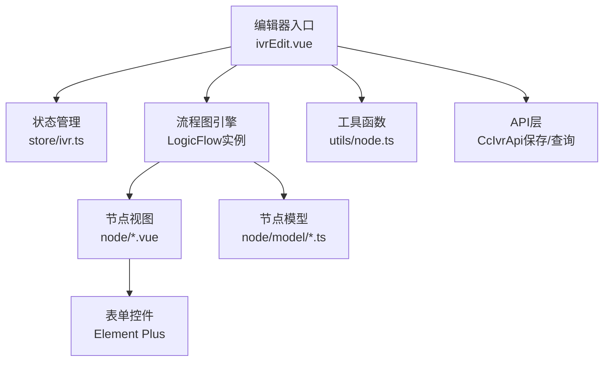
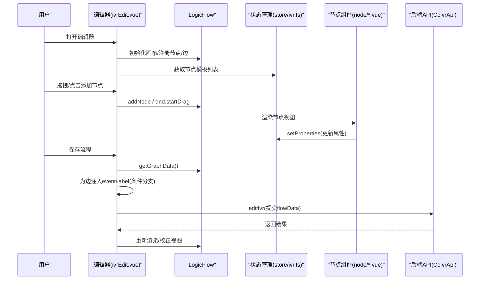
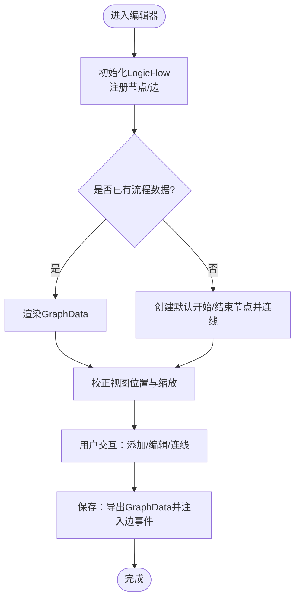
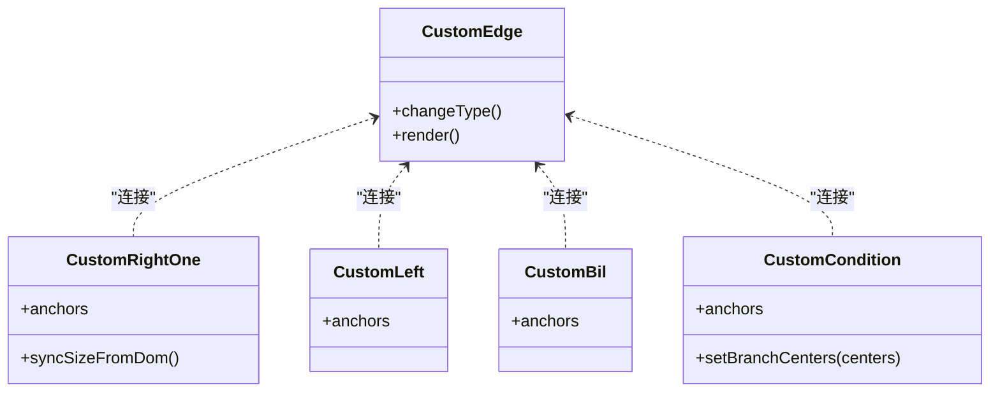
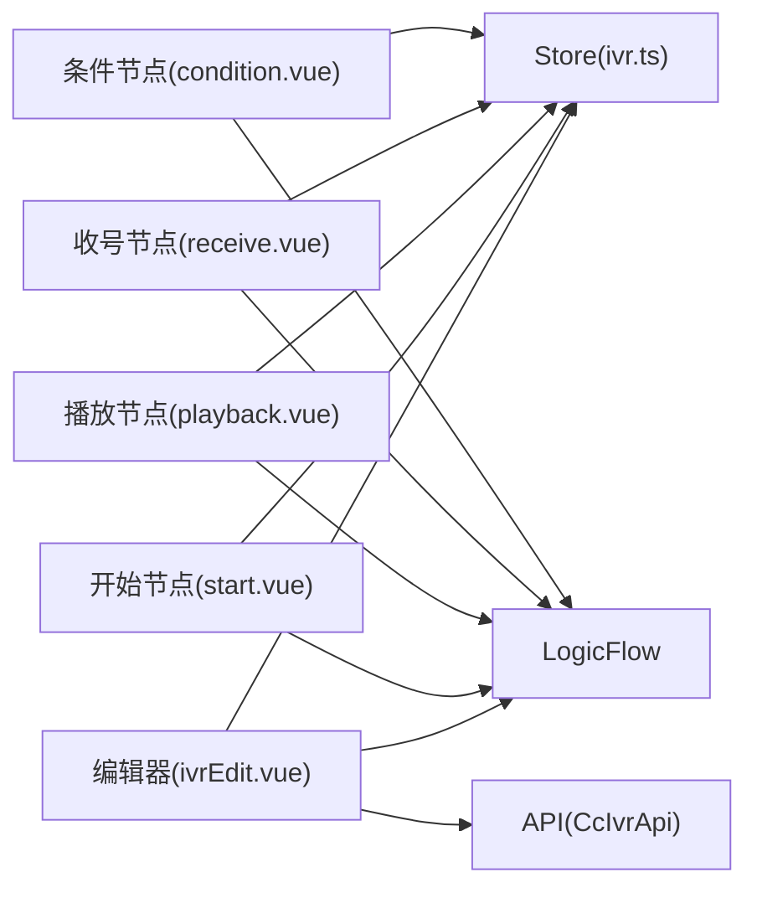

# IVR流程编辑器

<cite>
**本文引用的文件**
- [yudao-ui-admin-vue3/src/views/cc/ivr/ivrEdit.vue](file://yudao-ui-admin-vue3/src/views/cc/ivr/ivrEdit.vue)
- [yudao-ui-admin-vue3/src/views/cc/ivr/store/ivr.ts](file://yudao-ui-admin-vue3/src/views/cc/ivr/store/ivr.ts)
- [yudao-ui-admin-vue3/src/views/cc/ivr/utils/node.ts](file://yudao-ui-admin-vue3/src/views/cc/ivr/utils/node.ts)
- [yudao-ui-admin-vue3/src/views/cc/ivr/node/start.vue](file://yudao-ui-admin-vue3/src/views/cc/ivr/node/start.vue)
- [yudao-ui-admin-vue3/src/views/cc/ivr/node/playback.vue](file://yudao-ui-admin-vue3/src/views/cc/ivr/node/playback.vue)
- [yudao-ui-admin-vue3/src/views/cc/ivr/node/receive.vue](file://yudao-ui-admin-vue3/src/views/cc/ivr/node/receive.vue)
- [yudao-ui-admin-vue3/src/views/cc/ivr/node/condition.vue](file://yudao-ui-admin-vue3/src/views/cc/ivr/node/condition.vue)
</cite>

## 目录
1. [简介](#简介)
2. [项目结构](#项目结构)
3. [核心组件](#核心组件)
4. [架构总览](#架构总览)
5. [详细组件分析](#详细组件分析)
6. [依赖关系分析](#依赖关系分析)
7. [性能考量](#性能考量)
8. [故障排查指南](#故障排查指南)
9. [结论](#结论)
10. [附录](#附录)

## 简介
本文件面向IVR（交互式语音应答）流程编辑器的实现与使用，聚焦可视化流程设计器的原理与实践：拖拽式节点编辑、流程图渲染、节点属性配置；覆盖播放节点、按键接收节点、条件判断节点、转人工节点等常见IVR节点类型；并文档化核心组件架构（节点模型定义、边连接逻辑、流程验证机制）、发布与执行机制（版本管理与运行时状态同步建议），以及扩展开发指南（自定义节点与第三方服务集成）。同时提供性能优化与用户体验改进建议。

## 项目结构
IVR流程编辑器位于前端管理后台的cc模块中，采用Vue3 + LogicFlow构建可视化流程图，Pinia进行状态管理，Element Plus提供表单控件。关键目录与职责如下：
- ivrEdit.vue：编辑器主容器，负责LogicFlow初始化、节点注册、事件绑定、数据回显与保存。
- store/ivr.ts：集中维护节点元数据、默认配置、画布引用与操作API。
- node/*：各节点类型的Vue组件（开始、结束、放音、收号、判断器、方法调用等）。
- node/model/*：LogicFlow自定义节点模型与边模型（锚点布局、动态锚点、连线样式等）。
- utils/node.ts：工具函数（如生成随机ID）。

**图表来源**
- [yudao-ui-admin-vue3/src/views/cc/ivr/ivrEdit.vue:176-303](file://yudao-ui-admin-vue3/src/views/cc/ivr/ivrEdit.vue#L176-L303)
- [yudao-ui-admin-vue3/src/views/cc/ivr/store/ivr.ts:283-352](file://yudao-ui-admin-vue3/src/views/cc/ivr/store/ivr.ts#L283-L352)

**章节来源**
- [yudao-ui-admin-vue3/src/views/cc/ivr/ivrEdit.vue:176-303](file://yudao-ui-admin-vue3/src/views/cc/ivr/ivrEdit.vue#L176-L303)
- [yudao-ui-admin-vue3/src/views/cc/ivr/store/ivr.ts:13-50](file://yudao-ui-admin-vue3/src/views/cc/ivr/store/ivr.ts#L13-L50)

## 核心组件
- 编辑器主容器（ivrEdit.vue）
  - 初始化LogicFlow画布，注册所有节点类型与自定义边。
  - 处理拖拽添加、点击添加、连线文本自动填充、悬停显示删除按钮等交互。
  - 监听缩放/平移事件，防抖后强制同步节点尺寸，避免锚点与连线错位。
  - 数据回显：从后端获取JSON流程数据，渲染到画布并校正视图位置。
  - 保存流程：导出GraphData，补充边事件标识（特别是条件分支的IF/ELSE_IF/ELSE），提交至后端。
- 状态管理（store/ivr.ts）
  - 统一维护节点元数据与默认配置（名称、图标、业务类型、默认属性）。
  - 暴露getNodeList/getNodes/getLf等Getter，供编辑器与节点组件共享。
  - 提供setLfRef/setNodes等Action用于设置画布引用与更新节点模板。
- 节点组件（start/playback/receive/condition等）
  - 每个节点为独立Vue组件，包含标题栏、操作菜单（复制/删除）、属性表单。
  - 通过inject获取当前节点与图实例，调用setProperties更新属性。
  - 在DOM变化后触发尺寸同步，确保foreignObject容器与LogicFlow模型一致。
- 自定义模型与边（node/model/*）
  - 定义不同节点的锚点布局（单左/单右/双边/动态锚点）。
  - 自定义边类型以支持悬停高亮与删除按钮展示。
- 工具函数（utils/node.ts）
  - 生成随机数字串，用于临时节点ID或克隆节点重命名。

**章节来源**
- [yudao-ui-admin-vue3/src/views/cc/ivr/ivrEdit.vue:176-303](file://yudao-ui-admin-vue3/src/views/cc/ivr/ivrEdit.vue#L176-L303)
- [yudao-ui-admin-vue3/src/views/cc/ivr/store/ivr.ts:75-264](file://yudao-ui-admin-vue3/src/views/cc/ivr/store/ivr.ts#L75-L264)
- [yudao-ui-admin-vue3/src/views/cc/ivr/utils/node.ts:6-30](file://yudao-ui-admin-vue3/src/views/cc/ivr/utils/node.ts#L6-L30)

## 架构总览
下图展示了编辑器主流程：用户拖拽/点击添加节点，LogicFlow渲染节点与边，节点组件通过Store访问画布实例并更新属性；保存时导出GraphData并注入边事件信息。

**图表来源**
- [yudao-ui-admin-vue3/src/views/cc/ivr/ivrEdit.vue:176-303](file://yudao-ui-admin-vue3/src/views/cc/ivr/ivrEdit.vue#L176-L303)
- [yudao-ui-admin-vue3/src/views/cc/ivr/ivrEdit.vue:416-573](file://yudao-ui-admin-vue3/src/views/cc/ivr/ivrEdit.vue#L416-L573)
- [yudao-ui-admin-vue3/src/views/cc/ivr/store/ivr.ts:283-352](file://yudao-ui-admin-vue3/src/views/cc/ivr/store/ivr.ts#L283-L352)

## 详细组件分析

### 可视化流程设计器（拖拽、渲染、属性配置）
- 拖拽式节点编辑
  - 顶部“添加组件”弹窗列出可用节点，支持点击添加到默认位置，或拖拽到指定坐标。
  - 通过pointerdown/pointermove/pointerup区分点击与拖拽，移动阈值超过5px即启动LogicFlow DnD。
  - 开始/结束节点全局唯一校验，防止重复添加。
- 流程图渲染
  - 使用LogicFlow作为底层图形引擎，注册自定义Vue节点与模型。
  - 监听graph:rendered/graph:transform/node:add等事件，确保节点尺寸与锚点位置正确。
  - 首次加载数据后，重置缩放至100%，并将起始节点定位到视口合适位置，避免内容被压缩或偏移。
- 节点属性配置
  - 每个节点组件内嵌表单控件，变更时调用setProperties更新节点属性。
  - 对可能改变DOM高度的属性（如播放内容切换），在nextTick后同步foreignObject尺寸，避免裁剪。
  - 条件节点支持动态分支（IF/ELSE_IF/ELSE），新增/删除分支时同步锚点索引与连线。

**图表来源**
- [yudao-ui-admin-vue3/src/views/cc/ivr/ivrEdit.vue:176-303](file://yudao-ui-admin-vue3/src/views/cc/ivr/ivrEdit.vue#L176-L303)
- [yudao-ui-admin-vue3/src/views/cc/ivr/ivrEdit.vue:416-573](file://yudao-ui-admin-vue3/src/views/cc/ivr/ivrEdit.vue#L416-L573)

**章节来源**
- [yudao-ui-admin-vue3/src/views/cc/ivr/ivrEdit.vue:176-303](file://yudao-ui-admin-vue3/src/views/cc/ivr/ivrEdit.vue#L176-L303)
- [yudao-ui-admin-vue3/src/views/cc/ivr/ivrEdit.vue:416-573](file://yudao-ui-admin-vue3/src/views/cc/ivr/ivrEdit.vue#L416-L573)

### 节点类型与功能特性
- 播放节点（放音）
  - 功能：播放音频文件或TTS文本，常用于开场欢迎语与过渡提示。
  - 属性：播放类型、文件ID、文本内容、循环次数等。
  - 行为：切换播放类型会改变DOM高度，需在nextTick后同步节点尺寸，避免foreignObject裁剪。
- 按键接收节点（收号并放音）
  - 功能：播放内容并接收用户按键输入，支持可打断、首位超时、位间超时、防抖间隔、结束键等。
  - 输出：result变量供后续节点使用。
- 条件判断节点（判断器）
  - 功能：根据上游节点输出的变量与操作符进行条件匹配，支持ALL/ANY匹配模式。
  - 分支：IF/ELSE_IF/ELSE，支持动态增删分支，自动维护锚点索引与连线。
  - 变量选择：基于上游可达节点（反向BFS）计算可选变量树，提升易用性。
- 转人工节点（转接）
  - 功能：转接坐席、坐席组、外呼或SIP通道，支持转接前/未接通/接通三阶段播放策略。
  - 属性：路由类型、路由值/号码、各阶段播放内容与循环次数。
- 其他节点
  - 开始/结束节点：流程入口与出口，开始节点可配置ASR/TTS引擎，结束节点默认挂机。
  - 方法调用节点：调用内置方法并可播放等待内容。

**章节来源**
- [yudao-ui-admin-vue3/src/views/cc/ivr/node/playback.vue:1-151](file://yudao-ui-admin-vue3/src/views/cc/ivr/node/playback.vue#L1-L151)
- [yudao-ui-admin-vue3/src/views/cc/ivr/node/receive.vue:1-190](file://yudao-ui-admin-vue3/src/views/cc/ivr/node/receive.vue#L1-L190)
- [yudao-ui-admin-vue3/src/views/cc/ivr/node/condition.vue:1-534](file://yudao-ui-admin-vue3/src/views/cc/ivr/node/condition.vue#L1-L534)
- [yudao-ui-admin-vue3/src/views/cc/ivr/node/start.vue:1-166](file://yudao-ui-admin-vue3/src/views/cc/ivr/node/start.vue#L1-L166)
- [yudao-ui-admin-vue3/src/views/cc/ivr/store/ivr.ts:122-179](file://yudao-ui-admin-vue3/src/views/cc/ivr/store/ivr.ts#L122-L179)

### 核心组件架构（节点模型、边连接、流程验证）
- 节点模型定义
  - 通过node/model/*中的CustomLeft/CustomRightOne/CustomBil/CustomCondition等类，定义节点锚点数量与位置。
  - 条件节点使用动态锚点模型，根据分支数量动态计算右侧锚点中心位置。
- 边连接逻辑
  - 默认贝塞尔曲线边，悬停时切换为自定义边以显示删除按钮。
  - 锚点拖拽完成后，若源节点为菜单型节点，自动将菜单按钮值写入边文本。
  - 保存时根据sourceAnchorId解析条件分支标签（IF/ELSE_IF/ELSE），并注入event字段（如next_IF）。
- 流程验证机制
  - 开始/结束节点唯一性校验，防止重复添加。
  - 条件分支增删时，同步更新边的sourceAnchorId，避免连线错连。
  - 节点尺寸同步：graph:transform/node:add/graph:rendered等多时机强制同步，保证锚点与连线端点准确。

**图表来源**
- [yudao-ui-admin-vue3/src/views/cc/ivr/ivrEdit.vue:236-299](file://yudao-ui-admin-vue3/src/views/cc/ivr/ivrEdit.vue#L236-L299)
- [yudao-ui-admin-vue3/src/views/cc/ivr/ivrEdit.vue:306-340](file://yudao-ui-admin-vue3/src/views/cc/ivr/ivrEdit.vue#L306-L340)
- [yudao-ui-admin-vue3/src/views/cc/ivr/node/condition.vue:325-355](file://yudao-ui-admin-vue3/src/views/cc/ivr/node/condition.vue#L325-L355)

**章节来源**
- [yudao-ui-admin-vue3/src/views/cc/ivr/ivrEdit.vue:306-340](file://yudao-ui-admin-vue3/src/views/cc/ivr/ivrEdit.vue#L306-L340)
- [yudao-ui-admin-vue3/src/views/cc/ivr/node/condition.vue:395-470](file://yudao-ui-admin-vue3/src/views/cc/ivr/node/condition.vue#L395-L470)

### 流程发布与执行机制（版本管理与运行时状态同步）
- 发布流程
  - 编辑器保存时将GraphData序列化，并为每条边注入event标识（如next_IF、next_ELSE_IF_N、next_ELSE），便于运行时按事件跳转。
  - 建议在后端增加流程版本管理：每次保存生成新版本，保留历史版本以便回滚与审计。
- 运行时状态同步
  - 建议在运行时记录当前节点ID、已收集变量、通话上下文等状态，并通过WebSocket或长轮询推送给前端，实现调试面板与实时跟踪。
  - 对于条件分支，运行时需根据上游输出计算匹配结果，选择对应event继续执行。
- 执行与回放
  - 播放节点与收号节点在执行时需与语音引擎（ASR/TTS）协同，支持打断、超时、防抖等策略。
  - 转人工节点需对接呼叫中心或SIP网关，实现坐席/组/外呼/SIP路由。

[本节为概念性说明，不直接分析具体文件]

### 扩展开发指南（自定义节点与第三方服务集成）
- 自定义节点开发步骤
  - 新建Vue组件（参考playback.vue/receive.vue/condition.vue），实现标题、操作菜单与属性表单。
  - 在store/ivr.ts中添加节点元数据与默认配置，并在ivrEdit.vue中注册节点类型与模型。
  - 如需特殊锚点布局，新增model类（参考custom*系列），并在注册时指定view与model。
- 第三方服务集成
  - 语音引擎：在开始节点中下拉选择ASR/TTS引擎，调用系统语音引擎管理接口获取选项。
  - 媒体资源：播放节点支持文件ID与TTS文本，需对接媒体库或TTS服务。
  - 呼叫中心：转人工节点对接CC能力，实现坐席/组/外呼/SIP路由。
- 最佳实践
  - 属性变更时进行深度比较后再调用setProperties，避免不必要的节点重建。
  - 对可能改变DOM高度的属性，在nextTick后同步节点尺寸，确保foreignObject正确显示。
  - 条件节点变量选择基于上游可达节点计算，减少无效选项。

**章节来源**
- [yudao-ui-admin-vue3/src/views/cc/ivr/node/start.vue:135-148](file://yudao-ui-admin-vue3/src/views/cc/ivr/node/start.vue#L135-L148)
- [yudao-ui-admin-vue3/src/views/cc/ivr/node/playback.vue:120-133](file://yudao-ui-admin-vue3/src/views/cc/ivr/node/playback.vue#L120-L133)
- [yudao-ui-admin-vue3/src/views/cc/ivr/node/receive.vue:159-172](file://yudao-ui-admin-vue3/src/views/cc/ivr/node/receive.vue#L159-L172)
- [yudao-ui-admin-vue3/src/views/cc/ivr/node/condition.vue:188-243](file://yudao-ui-admin-vue3/src/views/cc/ivr/node/condition.vue#L188-L243)

## 依赖关系分析
- 编辑器依赖LogicFlow核心库与Vue节点注册插件，注册所有节点类型与自定义边。
- 节点组件依赖Pinia Store获取画布实例与节点模板，依赖Element Plus表单控件。
- 条件节点依赖字典接口获取操作符选项，依赖上游节点输出定义（NODE_OUTPUTS）生成变量树。
- 编辑器保存时依赖CcIvrApi进行数据持久化。

**图表来源**
- [yudao-ui-admin-vue3/src/views/cc/ivr/ivrEdit.vue:236-299](file://yudao-ui-admin-vue3/src/views/cc/ivr/ivrEdit.vue#L236-L299)
- [yudao-ui-admin-vue3/src/views/cc/ivr/store/ivr.ts:283-352](file://yudao-ui-admin-vue3/src/views/cc/ivr/store/ivr.ts#L283-L352)

**章节来源**
- [yudao-ui-admin-vue3/src/views/cc/ivr/ivrEdit.vue:236-299](file://yudao-ui-admin-vue3/src/views/cc/ivr/ivrEdit.vue#L236-L299)
- [yudao-ui-admin-vue3/src/views/cc/ivr/store/ivr.ts:283-352](file://yudao-ui-admin-vue3/src/views/cc/ivr/store/ivr.ts#L283-L352)

## 性能考量
- 缩放与平移防抖：graph:transform事件高频触发，使用防抖函数延迟同步节点尺寸，避免抖动与重绘开销。
- 尺寸同步策略：在node:add/graph:rendered/graph:transform等多时机强制同步，确保锚点与连线端点准确，避免累积误差。
- 属性更新去重：对setProperties进行深度比较，避免相同属性重复更新导致节点重建。
- foreignObject渲染：在DOM变化后使用nextTick与$forceUpdate确保v-if分支正确渲染，减少重排重绘。
- 视图校正：首次加载数据后重置缩放至100%并定位起始节点，避免fitView导致的过度压缩。

**章节来源**
- [yudao-ui-admin-vue3/src/views/cc/ivr/ivrEdit.vue:80-136](file://yudao-ui-admin-vue3/src/views/cc/ivr/ivrEdit.vue#L80-L136)
- [yudao-ui-admin-vue3/src/views/cc/ivr/ivrEdit.vue:342-400](file://yudao-ui-admin-vue3/src/views/cc/ivr/ivrEdit.vue#L342-L400)
- [yudao-ui-admin-vue3/src/views/cc/ivr/ivrEdit.vue:435-476](file://yudao-ui-admin-vue3/src/views/cc/ivr/ivrEdit.vue#L435-L476)
- [yudao-ui-admin-vue3/src/views/cc/ivr/node/playback.vue:98-101](file://yudao-ui-admin-vue3/src/views/cc/ivr/node/playback.vue#L98-L101)

## 故障排查指南
- 节点尺寸错位
  - 现象：缩放后锚点与连线端点偏移，节点被裁剪。
  - 排查：检查graph:transform/node:add/graph:rendered是否触发尺寸同步；确认foreignObject内DOM已渲染再同步。
  - 解决：使用防抖后的syncAllNodesSize，必要时在nextTick后再次同步。
- 表单控件无法激活
  - 现象：下拉框/输入框需双击才能打开或聚焦。
  - 排查：检查全局表单交互守护者是否正确安装，pointerdown是否阻断冒泡。
  - 解决：确保installIvrFormGuard在LF初始化前安装，且在表单交互期间拦截window capture阶段的move事件。
- 条件分支连线错乱
  - 现象：新增/删除ELSE_IF后，原ELSE连线错误连接到新分支。
  - 排查：检查sourceAnchorId重映射逻辑，确认锚点索引更新。
  - 解决：在addBranch/removeBranch中同步更新edges的sourceAnchorId，并刷新视图。
- 保存后流程异常
  - 现象：保存成功但运行时跳转错误。
  - 排查：检查边event字段是否正确注入（next_IF/next_ELSE_IF_N/next_ELSE）。
  - 解决：在submit中根据sourceAnchorId解析分支标签并设置event。

**章节来源**
- [yudao-ui-admin-vue3/src/views/cc/ivr/ivrEdit.vue:342-400](file://yudao-ui-admin-vue3/src/views/cc/ivr/ivrEdit.vue#L342-L400)
- [yudao-ui-admin-vue3/src/views/cc/ivr/ivrEdit.vue:516-573](file://yudao-ui-admin-vue3/src/views/cc/ivr/ivrEdit.vue#L516-L573)
- [yudao-ui-admin-vue3/src/views/cc/ivr/node/condition.vue:395-470](file://yudao-ui-admin-vue3/src/views/cc/ivr/node/condition.vue#L395-L470)

## 结论
本IVR流程编辑器基于LogicFlow实现了可视化流程设计，涵盖拖拽式节点编辑、流程图渲染与节点属性配置；定义了多种IVR节点类型（播放、收号、条件、转人工等），并通过自定义模型与边实现灵活的连接逻辑；在保存时注入边事件标识，为运行时执行提供依据。建议在后端完善流程版本管理与运行时状态同步，以提升可维护性与可观测性。扩展方面，遵循现有模式即可快速接入自定义节点与第三方服务。

## 附录
- 常用节点属性速查
  - 播放节点：playbackType、fileId、content、num
  - 收号节点：interruptible、firstDigitTimeout、interDigitTimeout、debounceInterval、endKey、result
  - 条件节点：branches[].branchType、matchType、conditions[].variable/operator/value
  - 转人工节点：routeType、routeValue、routeNumber、pre/fail/conn播放配置
- 事件与边标识
  - next_IF、next_ELSE_IF_N、next_ELSE、next（默认）

[本节为概念性说明，不直接分析具体文件]