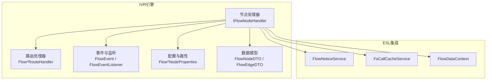
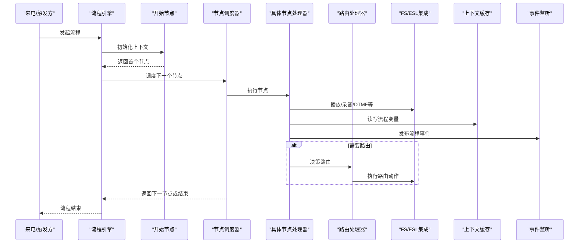
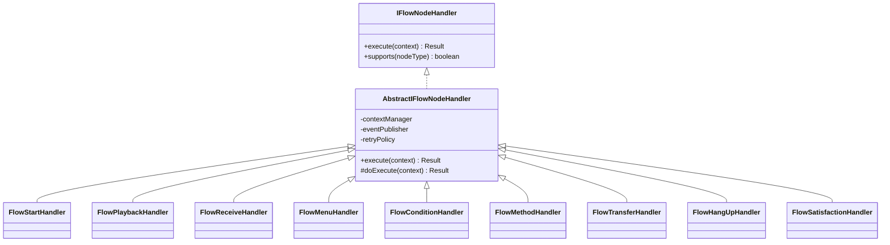
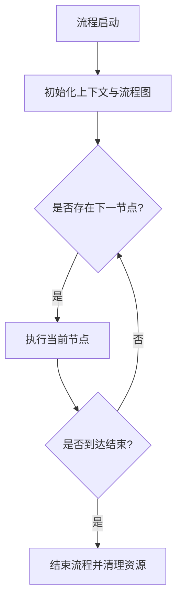
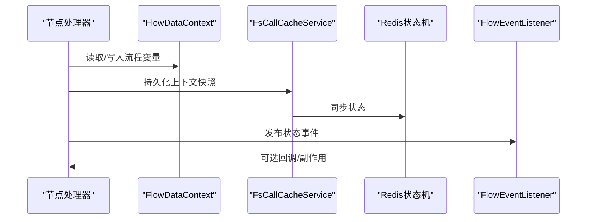
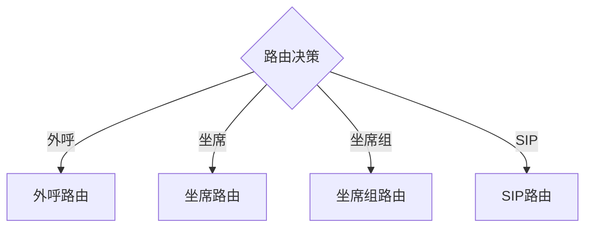
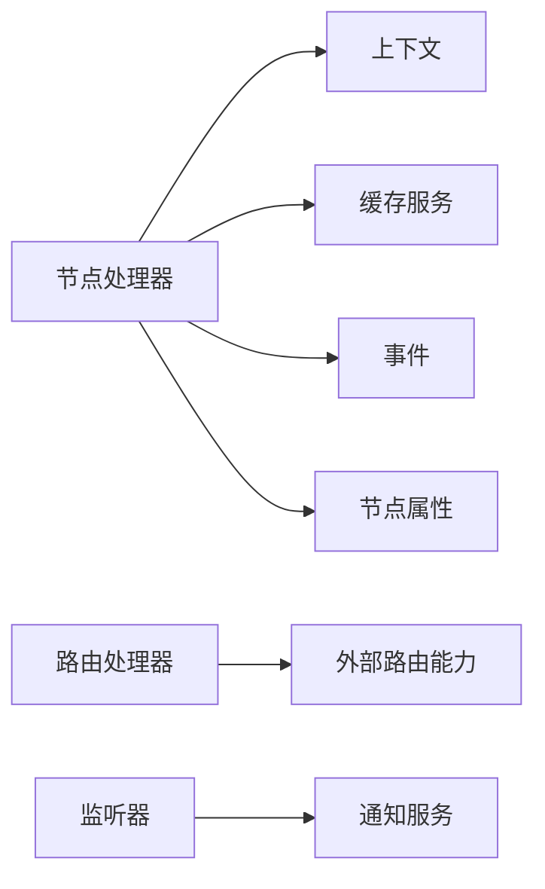

# 流程执行引擎

<cite>
**本文引用的文件**
- [FlowStartHandler.java](file://yudao-cloud/yudao-module-cc/yudao-module-cc-server/src/main/java/cn/iocoder/yudao/module/cc/ivr/handler/node/FlowStartHandler.java)
- [FlowEndHandler.java](file://yudao-cloud/yudao-module-cc/yudao-module-cc-server/src/main/java/cn/iocoder/yudao/module/cc/ivr/handler/node/FlowEndHandler.java)
- [FlowPlaybackHandler.java](file://yudao-cloud/yudao-module-cc/yudao-module-cc-server/src/main/java/cn/iocoder/yudao/module/cc/ivr/handler/node/FlowPlaybackHandler.java)
- [FlowReceiveHandler.java](file://yudao-cloud/yudao-module-cc/yudao-module-cc-server/src/main/java/cn/iocoder/yudao/module/cc/ivr/handler/node/FlowReceiveHandler.java)
- [FlowMenuHandler.java](file://yudao-cloud/yudao-module-cc/yudao-module-cc-server/src/main/java/cn/iocoder/yudao/module/cc/ivr/handler/node/FlowMenuHandler.java)
- [FlowConditionHandler.java](file://yudao-cloud/yudao-module-cc/yudao-module-cc-server/src/main/java/cn/iocoder/yudao/module/cc/ivr/handler/node/FlowConditionHandler.java)
- [FlowMethodHandler.java](file://yudao-cloud/yudao-module-cc/yudao-module-cc-server/src/main/java/cn/iocoder/yudao/module/cc/ivr/handler/node/FlowMethodHandler.java)
- [FlowTransferHandler.java](file://yudao-cloud/yudao-module-cc/yudao-module-cc-server/src/main/java/cn/iocoder/yudao/module/cc/ivr/handler/node/FlowTransferHandler.java)
- [FlowHangUpHandler.java](file://yudao-cloud/yudao-module-cc/yudao-module-cc-server/src/main/java/cn/iocoder/yudao/module/cc/ivr/handler/node/FlowHangUpHandler.java)
- [FlowSatisfactionHandler.java](file://yudao-cloud/yudao-module-cc/yudao-module-cc-server/src/main/java/cn/iocoder/yudao/module/cc/ivr/handler/node/FlowSatisfactionHandler.java)
- [AbstractIFlowNodeHandler.java](file://yudao-cloud/yudao-module-cc/yudao-module-cc-server/src/main/java/cn/iocoder/yudao/module/cc/ivr/handler/node/AbstractIFlowNodeHandler.java)
- [IFlowNodeHandler.java](file://yudao-cloud/yudao-module-cc/yudao-module-cc-server/src/main/java/cn/iocoder/yudao/module/cc/ivr/handler/node/IFlowNodeHandler.java)
- [FlowEvent.java](file://yudao-cloud/yudao-module-cc/yudao-module-cc-server/src/main/java/cn/iocoder/yudao/module/cc/ivr/event/FlowEvent.java)
- [FlowEventListener.java](file://yuddao-cloud/yudao-module-cc/yudao-module-cc-server/src/main/java/cn/iocoder/yudao/module/cc/ivr/listener/FlowEventListener.java)
- [FlowStateMachineListener.java](file://yudao-cloud/yudao-module-cc/yudao-module-cc-server/src/main/java/cn/iocoder/yudao/module/cc/ivr/listener/FlowStateMachineListener.java)
- [RedisStateMachineConfig.java](file://yudao-cloud/yudao-module-cc/yudao-module-cc-server/src/main/java/cn/iocoder/yudao/module/cc/ivr/config/RedisStateMachineConfig.java)
- [FlowNodeHanderConstant.java](file://yudao-cloud/yudao-module-cc/yudao-module-cc-server/src/main/java/cn/iocoder/yudao/module/cc/ivr/constant/FlowNodeHanderConstant.java)
- [FlowNodeTypeEnum.java](file://yudao-cloud/yudao-module-cc/yudao-module-cc-server/src/main/java/cn/iocoder/yudao/module/cc/ivr/enums/FlowNodeTypeEnum.java)
- [FlowEdgeDTO.java](file://yudao-cloud/yudao-module-cc/yudao-module-cc-server/src/main/java/cn/iocoder/yudao/module/cc/ivr/dto/FlowEdgeDTO.java)
- [FlowNodeDTO.java](file://yudao-cloud/yudao-module-cc/yudao-module-cc-server/src/main/java/cn/iocoder/yudao/module/cc/ivr/dto/FlowNodeDTO.java)
- [FlowCallOutRouteHandler.java](file://yudao-cloud/yudao-module-cc/yudao-module-cc-server/src/main/java/cn/iocoder/yudao/module/cc/ivr/handler/route/FlowCallOutRouteHandler.java)
- [FlowAgentRouteHandler.java](file://yudao-cloud/yudao-module-cc/yudao-module-cc-server/src/main/java/cn/iocoder/yudao/module/cc/ivr/handler/route/FlowAgentRouteHandler.java)
- [FlowAgentGroupRouteHandler.java](file://yudao-cloud/yudao-module-cc/yudao-module-cc-server/src/main/java/cn/iocoder/yudao/module/cc/ivr/handler/route/FlowAgentGroupRouteHandler.java)
- [FlowSipRouteHandler.java](file://yudao-cloud/yudao-module-cc/yudao-module-cc-server/src/main/java/cn/iocoder/yudao/module/cc/ivr/handler/route/FlowSipRouteHandler.java)
- [FlowNoticeService.java](file://yudao-cloud/yudao-module-cc/yudao-module-cc-server/src/main/java/cn/iocoder/yudao/module/cc/esl/service/FlowNoticeService.java)
- [FlowNoticeServiceImpl.java](file://yudao-cloud/yudao-module-cc/yudao-module-cc-server/src/main/java/cn/iocoder/yudao/module/cc/esl/service/FlowNoticeServiceImpl.java)
- [FsCallCacheService.java](file://yudao-cloud/yudao-module-cc/yudao-module-cc-server/src/main/java/cn/iocoder/yudao/module/cc/esl/service/FsCallCacheService.java)
- [FsCallCacheServiceImpl.java](file://yudao-cloud/yudao-module-cc/yudao-module-cc-server/src/main/java/cn/iocoder/yudao/module/cc/esl/service/FsCallCacheServiceImpl.java)
- [FlowDataContext.java](file://yudao-cloud/yudao-module-cc/yudao-module-cc-server/src/main/java/cn/iocoder/yudao/module/cc/esl/dto/FlowDataContext.java)
- [FlowHttpNodeProperties.java](file://yudao-cloud/yudao-module-cc/yudao-module-cc-server/src/main/java/cn/iocoder/yudao/module/cc/ivr/properties/FlowHttpNodeProperties.java)
- [FlowMenuNodeProperties.java](file://yudao-cloud/yudao-module-cc/yudao-module-cc-server/src/main/java/cn/iocoder/yudao/module/cc/ivr/properties/FlowMenuNodeProperties.java)
- [FlowPlaybackNodeProperties.java](file://yudao-cloud/yudao-module-cc/yudao-module-cc-server/src/main/java/cn/iocoder/yudao/module/cc/ivr/properties/FlowPlaybackNodeProperties.java)
- [FlowReceiveNodeProperties.java](file://yudao-cloud/yudao-module-cc/yudao-module-cc-server/src/main/java/cn/iocoder/yudao/module/cc/ivr/properties/FlowReceiveNodeProperties.java)
- [FlowMethodNodeProperties.java](file://yudao-cloud/yudao-module-cc/yudao-module-cc-server/src/main/java/cn/iocoder/yudao/module/cc/ivr/properties/FlowMethodNodeProperties.java)
- [FlowTransferNodeProperties.java](file://yudao-cloud/yudao-module-cc/yudao-module-cc-server/src/main/java/cn/iocoder/yudao/module/cc/ivr/properties/FlowTransferNodeProperties.java)
- [FlowConditionNodeProperties.java](file://yudao-cloud/yudao-module-cc/yudao-module-cc-server/src/main/java/cn/iocoder/yudao/module/cc/ivr/properties/FlowConditionNodeProperties.java)
</cite>

## 目录
1. [简介](#简介)
2. [项目结构](#项目结构)
3. [核心组件](#核心组件)
4. [架构总览](#架构总览)
5. [详细组件分析](#详细组件分析)
6. [依赖关系分析](#依赖关系分析)
7. [性能考虑](#性能考虑)
8. [故障排查指南](#故障排查指南)
9. [结论](#结论)
10. [附录](#附录)

## 简介
本文件面向IVR（交互式语音应答）流程执行引擎，聚焦运行时环境、节点调度器、上下文管理与状态同步机制；详述流程生命周期（启动、节点执行、结束）；说明节点执行器的实现模式（同步与异步策略）；解释流程变量与作用域管理（局部与全局）；提供调试与监控工具使用指南（执行日志查看与性能分析）；并给出异常处理与重试机制的最佳实践。

## 项目结构
IVR流程执行引擎位于CC模块的ivr子包中，围绕“节点处理器 + 路由处理器 + 事件监听 + 配置/常量/枚举/DTO”组织：
- 节点处理器：定义各类IVR节点（开始、播放、接收按键、菜单、条件、方法调用、转接、挂断、满意度等）的执行逻辑
- 路由处理器：负责将流程决策落地到具体路由（外呼、坐席、坐席组、SIP等）
- 事件与监听：通过统一事件模型与监听器完成流程状态变更通知与扩展点
- 配置与属性：节点类型、分支条件、节点参数等结构化配置
- DTO：边与节点的图结构描述，用于流程编排与解析

图表来源
- [IFlowNodeHandler.java](file://yudao-cloud/yudao-module-cc/yudao-module-cc-server/src/main/java/cn/iocoder/yudao/module/cc/ivr/handler/node/IFlowNodeHandler.java)
- [FlowCallOutRouteHandler.java](file://yudao-cloud/yudao-module-cc/yudao-module-cc-server/src/main/java/cn/iocoder/yudao/module/cc/ivr/handler/route/FlowCallOutRouteHandler.java)
- [FlowEvent.java](file://yudao-cloud/yudao-module-cc/yudao-module-cc-server/src/main/java/cn/iocoder/yudao/module/cc/ivr/event/FlowEvent.java)
- [FlowNodeDTO.java](file://yudao-cloud/yudao-module-cc/yudao-module-cc-server/src/main/java/cn/iocoder/yudao/module/cc/ivr/dto/FlowNodeDTO.java)
- [FlowEdgeDTO.java](file://yudao-cloud/yudao-module-cc/yudao-module-cc-server/src/main/java/cn/iocoder/yudao/module/cc/ivr/dto/FlowEdgeDTO.java)
- [FlowNoticeService.java](file://yudao-cloud/yudao-module-cc/yudao-module-cc-server/src/main/java/cn/iocoder/yudao/module/cc/esl/service/FlowNoticeService.java)
- [FsCallCacheService.java](file://yudao-cloud/yudao-module-cc/yudao-module-cc-server/src/main/java/cn/iocoder/yudao/module/cc/esl/service/FsCallCacheService.java)
- [FlowDataContext.java](file://yudao-cloud/yudao-module-cc/yudao-module-cc-server/src/main/java/cn/iocoder/yudao/module/cc/esl/dto/FlowDataContext.java)

章节来源
- [FlowNodeTypeEnum.java:1-200](file://yudao-cloud/yudao-module-cc/yudao-module-cc-server/src/main/java/cn/iocoder/yudao/module/cc/ivr/enums/FlowNodeTypeEnum.java)
- [FlowNodeHanderConstant.java:1-200](file://yudao-cloud/yudao-module-cc/yudao-module-cc-server/src/main/java/cn/iocoder/yudao/module/cc/ivr/constant/FlowNodeHanderConstant.java)

## 核心组件
- 节点处理器接口与抽象基类：统一节点执行契约与通用能力（上下文读写、事件发布、错误封装）
- 具体节点处理器：覆盖IVR常见节点类型（开始、播放、接收、菜单、条件、方法、转接、挂断、满意度）
- 路由处理器：将流程决策映射到实际路由动作（外呼、坐席、坐席组、SIP）
- 事件与监听：以事件驱动方式解耦流程状态变化与外部系统（通知、审计、指标）
- 配置与属性：按节点类型拆分配置项，便于可视化编排与校验
- 数据模型：以节点与边的图结构表达流程拓扑

章节来源
- [IFlowNodeHandler.java:1-200](file://yudao-cloud/yudao-module-cc/yudao-module-cc-server/src/main/java/cn/iocoder/yudao/module/cc/ivr/handler/node/IFlowNodeHandler.java)
- [AbstractIFlowNodeHandler.java:1-200](file://yudao-cloud/yudao-module-cc/yudao-module-cc-server/src/main/java/cn/iocoder/yudao/module/cc/ivr/handler/node/AbstractIFlowNodeHandler.java)
- [FlowStartHandler.java:1-200](file://yudao-cloud/yudao-module-cc/yudao-module-cc-server/src/main/java/cn/iocoder/yudao/module/cc/ivr/handler/node/FlowStartHandler.java)
- [FlowEndHandler.java:1-200](file://yudao-cloud/yudao-module-cc/yudao-module-cc-server/src/main/java/cn/iocoder/yudao/module/cc/ivr/handler/node/FlowEndHandler.java)
- [FlowPlaybackHandler.java:1-200](file://yudao-cloud/yudao-module-cc/yudao-module-cc-server/src/main/java/cn/iocoder/yudao/module/cc/ivr/handler/node/FlowPlaybackHandler.java)
- [FlowReceiveHandler.java:1-200](file://yudao-cloud/yudao-module-cc/yudao-module-cc-server/src/main/java/cn/iocoder/yudao/module/cc/ivr/handler/node/FlowReceiveHandler.java)
- [FlowMenuHandler.java:1-200](file://yudao-cloud/yudao-module-cc/yudao-module-cc-server/src/main/java/cn/iocoder/yudao/module/cc/ivr/handler/node/FlowMenuHandler.java)
- [FlowConditionHandler.java:1-200](file://yudao-cloud/yudao-module-cc/yudao-module-cc-server/src/main/java/cn/iocoder/yudao/module/cc/ivr/handler/node/FlowConditionHandler.java)
- [FlowMethodHandler.java:1-200](file://yudao-cloud/yudao-module-cc/yudao-module-cc-server/src/main/java/cn/iocoder/yudao/module/cc/ivr/handler/node/FlowMethodHandler.java)
- [FlowTransferHandler.java:1-200](file://yudao-cloud/yudao-module-cc/yudao-module-cc-server/src/main/java/cn/iocoder/yudao/module/cc/ivr/handler/node/FlowTransferHandler.java)
- [FlowHangUpHandler.java:1-200](file://yudao-cloud/yudao-module-cc/yudao-module-cc-server/src/main/java/cn/iocoder/yudao/module/cc/ivr/handler/node/FlowHangUpHandler.java)
- [FlowSatisfactionHandler.java:1-200](file://yudao-cloud/yudao-module-cc/yudao-module-cc-server/src/main/java/cn/iocoder/yudao/module/cc/ivr/handler/node/FlowSatisfactionHandler.java)
- [FlowCallOutRouteHandler.java:1-200](file://yudao-cloud/yudao-module-cc/yudao-module-cc-server/src/main/java/cn/iocoder/yudao/module/cc/ivr/handler/route/FlowCallOutRouteHandler.java)
- [FlowAgentRouteHandler.java:1-200](file://yudao-cloud/yudao-module-cc/yudao-module-cc-server/src/main/java/cn/iocoder/yudao/module/cc/ivr/handler/route/FlowAgentRouteHandler.java)
- [FlowAgentGroupRouteHandler.java:1-200](file://yudao-cloud/yudao-module-cc/yudao-module-cc-server/src/main/java/cn/iocoder/yudao/module/cc/ivr/handler/route/FlowAgentGroupRouteHandler.java)
- [FlowSipRouteHandler.java:1-200](file://yudao-cloud/yudao-module-cc/yudao-module-cc-server/src/main/java/cn/iocoder/yudao/module/cc/ivr/handler/route/FlowSipRouteHandler.java)

## 架构总览
IVR流程执行引擎采用“事件驱动 + 节点处理器 + 路由处理器”的分层架构：
- 入口：流程启动节点初始化上下文、加载流程图（节点与边）
- 调度：根据当前节点类型选择对应处理器执行
- 执行：节点内部可调用外部服务、与FS交互、写入上下文、发布事件
- 路由：条件或业务决策后，交由路由处理器完成实际路由动作
- 状态：通过监听器与缓存服务持久化/同步流程状态，支持恢复与追踪

图表来源
- [FlowStartHandler.java:1-200](file://yudao-cloud/yudao-module-cc/yudao-module-cc-server/src/main/java/cn/iocoder/yudao/module/cc/ivr/handler/node/FlowStartHandler.java)
- [FlowEndHandler.java:1-200](file://yudao-cloud/yudao-module-cc/yudao-module-cc-server/src/main/java/cn/iocoder/yudao/module/cc/ivr/handler/node/FlowEndHandler.java)
- [FlowPlaybackHandler.java:1-200](file://yudao-cloud/yudao-module-cc/yudao-module-cc-server/src/main/java/cn/iocoder/yudao/module/cc/ivr/handler/node/FlowPlaybackHandler.java)
- [FlowReceiveHandler.java:1-200](file://yudao-cloud/yudao-module-cc/yudao-module-cc-server/src/main/java/cn/iocoder/yudao/module/cc/ivr/handler/node/FlowReceiveHandler.java)
- [FlowConditionHandler.java:1-200](file://yudao-cloud/yudao-module-cc/yudao-module-cc-server/src/main/java/cn/iocoder/yudao/module/cc/ivr/handler/node/FlowConditionHandler.java)
- [FlowCallOutRouteHandler.java:1-200](file://yudao-cloud/yudao-module-cc/yudao-module-cc-server/src/main/java/cn/iocoder/yudao/module/cc/ivr/handler/route/FlowCallOutRouteHandler.java)
- [FlowNoticeService.java:1-200](file://yudao-cloud/yudao-module-cc/yudao-module-cc-server/src/main/java/cn/iocoder/yudao/module/cc/esl/service/FlowNoticeService.java)
- [FsCallCacheService.java:1-200](file://yudao-cloud/yudao-module-cc/yudao-module-cc-server/src/main/java/cn/iocoder/yudao/module/cc/esl/service/FsCallCacheService.java)

## 详细组件分析

### 节点执行器与调度
- 统一接口：所有节点实现统一执行契约，保证调度器可插拔替换
- 抽象基类：提供上下文访问、事件发布、错误处理、重试钩子等通用能力
- 调度策略：基于节点类型枚举与常量映射，选择具体处理器执行
- 同步/异步：基础执行同步推进；对耗时操作（HTTP、外部API）可通过异步策略包装，避免阻塞主线程

图表来源
- [IFlowNodeHandler.java:1-200](file://yudao-cloud/yudao-module-cc/yudao-module-cc-server/src/main/java/cn/iocoder/yudao/module/cc/ivr/handler/node/IFlowNodeHandler.java)
- [AbstractIFlowNodeHandler.java:1-200](file://yudao-cloud/yudao-module-cc/yudao-module-cc-server/src/main/java/cn/iocoder/yudao/module/cc/ivr/handler/node/AbstractIFlowNodeHandler.java)
- [FlowStartHandler.java:1-200](file://yudao-cloud/yudao-module-cc/yudao-module-cc-server/src/main/java/cn/iocoder/yudao/module/cc/ivr/handler/node/FlowStartHandler.java)
- [FlowPlaybackHandler.java:1-200](file://yudao-cloud/yudao-module-cc/yudao-module-cc-server/src/main/java/cn/iocoder/yudao/module/cc/ivr/handler/node/FlowPlaybackHandler.java)
- [FlowReceiveHandler.java:1-200](file://yudao-cloud/yudao-module-cc/yudao-module-cc-server/src/main/java/cn/iocoder/yudao/module/cc/ivr/handler/node/FlowReceiveHandler.java)
- [FlowMenuHandler.java:1-200](file://yudao-cloud/yudao-module-cc/yudao-module-cc-server/src/main/java/cn/iocoder/yudao/module/cc/ivr/handler/node/FlowMenuHandler.java)
- [FlowConditionHandler.java:1-200](file://yudao-cloud/yudao-module-cc/yudao-module-cc-server/src/main/java/cn/iocoder/yudao/module/cc/ivr/handler/node/FlowConditionHandler.java)
- [FlowMethodHandler.java:1-200](file://yudao-cloud/yudao-module-cc/yudao-module-cc-server/src/main/java/cn/iocoder/yudao/module/cc/ivr/handler/node/FlowMethodHandler.java)
- [FlowTransferHandler.java:1-200](file://yudao-cloud/yudao-module-cc/yudao-module-cc-server/src/main/java/cn/iocoder/yudao/module/cc/ivr/handler/node/FlowTransferHandler.java)
- [FlowHangUpHandler.java:1-200](file://yudao-cloud/yudao-module-cc/yudao-module-cc-server/src/main/java/cn/iocoder/yudao/module/cc/ivr/handler/node/FlowHangUpHandler.java)
- [FlowSatisfactionHandler.java:1-200](file://yudao-cloud/yudao-module-cc/yudao-module-cc-server/src/main/java/cn/iocoder/yudao/module/cc/ivr/handler/node/FlowSatisfactionHandler.java)

章节来源
- [FlowNodeTypeEnum.java:1-200](file://yudao-cloud/yudao-module-cc/yudao-module-cc-server/src/main/java/cn/iocoder/yudao/module/cc/ivr/enums/FlowNodeTypeEnum.java)
- [FlowNodeHanderConstant.java:1-200](file://yudao-cloud/yudao-module-cc/yudao-module-cc-server/src/main/java/cn/iocoder/yudao/module/cc/ivr/constant/FlowNodeHanderConstant.java)

### 流程生命周期
- 启动：开始节点初始化上下文、设置会话标识、加载流程图、准备首节点
- 执行：调度器按图遍历节点，依次执行；每个节点可读写上下文、发布事件、调用外部服务
- 结束：结束节点清理资源、释放连接、记录结果、发布结束事件

图表来源
- [FlowStartHandler.java:1-200](file://yudao-cloud/yudao-module-cc/yudao-module-cc-server/src/main/java/cn/iocoder/yudao/module/cc/ivr/handler/node/FlowStartHandler.java)
- [FlowEndHandler.java:1-200](file://yudao-cloud/yudao-module-cc/yudao-module-cc-server/src/main/java/cn/iocoder/yudao/module/cc/ivr/handler/node/FlowEndHandler.java)

章节来源
- [FlowStartHandler.java:1-200](file://yudao-cloud/yudao-module-cc/yudao-module-cc-server/src/main/java/cn/iocoder/yudao/module/cc/ivr/handler/node/FlowStartHandler.java)
- [FlowEndHandler.java:1-200](file://yudao-cloud/yudao-module-cc/yudao-module-cc-server/src/main/java/cn/iocoder/yudao/module/cc/ivr/handler/node/FlowEndHandler.java)

### 上下文管理与状态同步
- 上下文对象：承载流程变量、会话信息、临时数据，供各节点共享
- 缓存服务：提供跨节点的状态存取，支持高并发与持久化
- 状态机配置：基于Redis的状态机配置，确保分布式环境下状态一致性
- 事件监听：状态变更时发布事件，供审计、监控、告警等子系统消费

图表来源
- [FlowDataContext.java:1-200](file://yudao-cloud/yudao-module-cc/yudao-module-cc-server/src/main/java/cn/iocoder/yudao/module/cc/esl/dto/FlowDataContext.java)
- [FsCallCacheService.java:1-200](file://yudao-cloud/yudao-module-cc/yudao-module-cc-server/src/main/java/cn/iocoder/yudao/module/cc/esl/service/FsCallCacheService.java)
- [FlowNoticeService.java:1-200](file://yudao-cloud/yudao-module-cc/yudao-module-cc-server/src/main/java/cn/iocoder/yudao/module/cc/esl/service/FlowNoticeService.java)
- [FlowStateMachineListener.java:1-200](file://yudao-cloud/yudao-module-cc/yudao-module-cc-server/src/main/java/cn/iocoder/yudao/module/cc/ivr/listener/FlowStateMachineListener.java)
- [RedisStateMachineConfig.java:1-200](file://yudao-cloud/yudao-module-cc/yudao-module-cc-server/src/main/java/cn/iocoder/yudao/module/cc/ivr/config/RedisStateMachineConfig.java)

章节来源
- [FlowDataContext.java:1-200](file://yudao-cloud/yudao-module-cc/yudao-module-cc-server/src/main/java/cn/iocoder/yudao/module/cc/esl/dto/FlowDataContext.java)
- [FsCallCacheService.java:1-200](file://yudao-cloud/yudao-module-cc/yudao-module-cc-server/src/main/java/cn/iocoder/yudao/module/cc/esl/service/FsCallCacheService.java)
- [FlowNoticeService.java:1-200](file://yudao-cloud/yudao-module-cc/yudao-module-cc-server/src/main/java/cn/iocoder/yudao/module/cc/esl/service/FlowNoticeService.java)
- [FlowStateMachineListener.java:1-200](file://yudao-cloud/yudao-module-cc/yudao-module-cc-server/src/main/java/cn/iocoder/yudao/module/cc/ivr/listener/FlowStateMachineListener.java)
- [RedisStateMachineConfig.java:1-200](file://yudao-cloud/yudao-module-cc/yudao-module-cc-server/src/main/java/cn/iocoder/yudao/module/cc/ivr/config/RedisStateMachineConfig.java)

### 流程变量与作用域管理
- 作用域划分：建议区分“会话级（全局）”与“节点级（局部）”变量，避免污染
- 变量读写：通过上下文对象进行读写，关键变量在缓存中持久化
- 命名规范：使用前缀区分作用域，如 global.xxx、node.xxx
- 安全与可见性：敏感变量加密存储，限制跨节点可见范围

章节来源
- [FlowDataContext.java:1-200](file://yudao-cloud/yudao-module-cc/yudao-module-cc-server/src/main/java/cn/iocoder/yudao/module/cc/esl/dto/FlowDataContext.java)
- [FsCallCacheService.java:1-200](file://yudao-cloud/yudao-module-cc/yudao-module-cc-server/src/main/java/cn/iocoder/yudao/module/cc/esl/service/FsCallCacheService.java)

### 节点执行器实现模式（同步与异步）
- 同步执行：适用于快速响应节点（播放、接收按键、简单条件判断）
- 异步执行：适用于耗时操作（HTTP调用、复杂计算、第三方服务），避免阻塞主线程
- 策略选择：在节点内部根据配置或运行时条件选择同步/异步路径
- 结果回传：异步完成后通过事件或回调更新上下文与状态

章节来源
- [FlowMethodHandler.java:1-200](file://yudao-cloud/yudao-module-cc/yudao-module-cc-server/src/main/java/cn/iocoder/yudao/module/cc/ivr/handler/node/FlowMethodHandler.java)
- [FlowPlaybackHandler.java:1-200](file://yudao-cloud/yudao-module-cc/yudao-module-cc-server/src/main/java/cn/iocoder/yudao/module/cc/ivr/handler/node/FlowPlaybackHandler.java)
- [FlowReceiveHandler.java:1-200](file://yudao-cloud/yudao-module-cc/yudao-module-cc-server/src/main/java/cn/iocoder/yudao/module/cc/ivr/handler/node/FlowReceiveHandler.java)
- [FlowConditionHandler.java:1-200](file://yudao-cloud/yudao-module-cc/yudao-module-cc-server/src/main/java/cn/iocoder/yudao/module/cc/ivr/handler/node/FlowConditionHandler.java)

### 路由处理器
- 外呼路由：触发外呼任务，绑定被叫号码与策略
- 坐席路由：匹配坐席规则，分配至合适坐席
- 坐席组路由：按组策略进行负载均衡或优先级选择
- SIP路由：基于SIP协议进行路由转发或桥接

图表来源
- [FlowCallOutRouteHandler.java:1-200](file://yudao-cloud/yudao-module-cc/yudao-module-cc-server/src/main/java/cn/iocoder/yudao/module/cc/ivr/handler/route/FlowCallOutRouteHandler.java)
- [FlowAgentRouteHandler.java:1-200](file://yudao-cloud/yudao-module-cc/yudao-module-cc-server/src/main/java/cn/iocoder/yudao/module/cc/ivr/handler/route/FlowAgentRouteHandler.java)
- [FlowAgentGroupRouteHandler.java:1-200](file://yudao-cloud/yudao-module-cc/yudao-module-cc-server/src/main/java/cn/iocoder/yudao/module/cc/ivr/handler/route/FlowAgentGroupRouteHandler.java)
- [FlowSipRouteHandler.java:1-200](file://yudao-cloud/yudao-module-cc/yudao-module-cc-server/src/main/java/cn/iocoder/yudao/module/cc/ivr/handler/route/FlowSipRouteHandler.java)

章节来源
- [FlowCallOutRouteHandler.java:1-200](file://yudao-cloud/yudao-module-cc/yudao-module-cc-server/src/main/java/cn/iocoder/yudao/module/cc/ivr/handler/route/FlowCallOutRouteHandler.java)
- [FlowAgentRouteHandler.java:1-200](file://yudao-cloud/yudao-module-cc/yudao-module-cc-server/src/main/java/cn/iocoder/yudao/module/cc/ivr/handler/route/FlowAgentRouteHandler.java)
- [FlowAgentGroupRouteHandler.java:1-200](file://yudao-cloud/yudao-module-cc/yudao-module-cc-server/src/main/java/cn/iocoder/yudao/module/cc/ivr/handler/route/FlowAgentGroupRouteHandler.java)
- [FlowSipRouteHandler.java:1-200](file://yudao-cloud/yudao-module-cc/yudao-module-cc-server/src/main/java/cn/iocoder/yudao/module/cc/ivr/handler/route/FlowSipRouteHandler.java)

### 事件与监听
- 事件模型：统一的事件载体，包含流程ID、节点、状态、时间戳等
- 监听器：订阅事件，执行审计、指标上报、通知等副作用
- 解耦：节点不直接耦合外部系统，通过事件降低耦合度

章节来源
- [FlowEvent.java:1-200](file://yudao-cloud/yudao-module-cc/yudao-module-cc-server/src/main/java/cn/iocoder/yudao/module/cc/ivr/event/FlowEvent.java)
- [FlowEventListener.java:1-200](file://yudao-cloud/yudao-module-cc/yudao-module-cc-server/src/main/java/cn/iocoder/yudao/module/cc/ivr/listener/FlowEventListener.java)

## 依赖关系分析
- 节点处理器依赖：上下文、缓存、事件、配置属性
- 路由处理器依赖：外部路由能力（FS/ESL、网关、坐席系统）
- 监听器依赖：通知服务、指标采集、审计存储
- 配置依赖：节点类型、分支条件、节点参数

图表来源
- [FlowNodeDTO.java:1-200](file://yudao-cloud/yudao-module-cc/yudao-module-cc-server/src/main/java/cn/iocoder/yudao/module/cc/ivr/dto/FlowNodeDTO.java)
- [FlowEdgeDTO.java:1-200](file://yudao-cloud/yudao-module-cc/yudao-module-cc-server/src/main/java/cn/iocoder/yudao/module/cc/ivr/dto/FlowEdgeDTO.java)
- [FlowNoticeService.java:1-200](file://yudao-cloud/yudao-module-cc/yudao-module-cc-server/src/main/java/cn/iocoder/yudao/module/cc/esl/service/FlowNoticeService.java)

章节来源
- [FlowNodeDTO.java:1-200](file://yudao-cloud/yudao-module-cc/yudao-module-cc-server/src/main/java/cn/iocoder/yudao/module/cc/ivr/dto/FlowNodeDTO.java)
- [FlowEdgeDTO.java:1-200](file://yudao-cloud/yudao-module-cc/yudao-module-cc-server/src/main/java/cn/iocoder/yudao/module/cc/ivr/dto/FlowEdgeDTO.java)
- [FlowNoticeService.java:1-200](file://yudao-cloud/yudao-module-cc/yudao-module-cc-server/src/main/java/cn/iocoder/yudao/module/cc/esl/service/FlowNoticeService.java)

## 性能考虑
- 节点执行优化：对I/O密集型操作采用异步执行，减少阻塞
- 上下文缓存：热点变量缓存于内存或Redis，降低重复查询
- 事件批处理：批量发送事件，降低网络开销
- 超时与限流：为外部调用设置超时与熔断，防止雪崩
- 资源回收：流程结束时及时释放连接与句柄

[本节为通用指导，不直接分析具体文件]

## 故障排查指南
- 执行日志：通过事件监听与通知服务收集节点执行日志，定位问题节点
- 上下文快照：在关键节点前后保存上下文快照，便于回溯变量变化
- 状态一致性：检查Redis状态机配置与缓存服务，确保分布式一致
- 重试机制：对瞬时失败的外部调用实施指数退避重试，避免抖动
- 降级策略：当依赖不可用时，启用降级路径（如默认菜单或转人工）

章节来源
- [FlowNoticeService.java:1-200](file://yudao-cloud/yudao-module-cc/yudao-module-cc-server/src/main/java/cn/iocoder/yudao/module/cc/esl/service/FlowNoticeService.java)
- [FsCallCacheService.java:1-200](file://yudao-cloud/yudao-module-cc/yudao-module-cc-server/src/main/java/cn/iocoder/yudao/module/cc/esl/service/FsCallCacheService.java)
- [FlowStateMachineListener.java:1-200](file://yudao-cloud/yudao-module-cc/yudao-module-cc-server/src/main/java/cn/iocoder/yudao/module/cc/ivr/listener/FlowStateMachineListener.java)

## 结论
IVR流程执行引擎通过统一的节点处理器、路由处理器与事件驱动架构，实现了灵活、可扩展的流程编排与执行。借助上下文与缓存服务，保证了状态的一致性与可追溯性。结合异步执行、重试与降级策略，提升了系统的稳定性与性能。建议在开发中遵循作用域与命名规范，完善日志与监控，持续优化关键路径的性能。

[本节为总结，不直接分析具体文件]

## 附录
- 节点类型与属性参考：见各Flow*NodeProperties文件
- 流程图数据模型：FlowNodeDTO与FlowEdgeDTO
- 事件与监听：FlowEvent与FlowEventListener
- 状态机配置：RedisStateMachineConfig

章节来源
- [FlowHttpNodeProperties.java:1-200](file://yudao-cloud/yudao-module-cc/yudao-module-cc-server/src/main/java/cn/iocoder/yudao/module/cc/ivr/properties/FlowHttpNodeProperties.java)
- [FlowMenuNodeProperties.java:1-200](file://yudao-cloud/yudao-module-cc/yudao-module-cc-server/src/main/java/cn/iocoder/yudao/module/cc/ivr/properties/FlowMenuNodeProperties.java)
- [FlowPlaybackNodeProperties.java:1-200](file://yudao-cloud/yudao-module-cc/yudao-module-cc-server/src/main/java/cn/iocoder/yudao/module/cc/ivr/properties/FlowPlaybackNodeProperties.java)
- [FlowReceiveNodeProperties.java:1-200](file://yudao-cloud/yudao-module-cc/yudao-module-cc-server/src/main/java/cn/iocoder/yudao/module/cc/ivr/properties/FlowReceiveNodeProperties.java)
- [FlowMethodNodeProperties.java:1-200](file://yudao-cloud/yudao-module-cc/yudao-module-cc-server/src/main/java/cn/iocoder/yudao/module/cc/ivr/properties/FlowMethodNodeProperties.java)
- [FlowTransferNodeProperties.java:1-200](file://yudao-cloud/yudao-module-cc/yudao-module-cc-server/src/main/java/cn/iocoder/yudao/module/cc/ivr/properties/FlowTransferNodeProperties.java)
- [FlowConditionNodeProperties.java:1-200](file://yudao-cloud/yudao-module-cc/yudao-module-cc-server/src/main/java/cn/iocoder/yudao/module/cc/ivr/properties/FlowConditionNodeProperties.java)