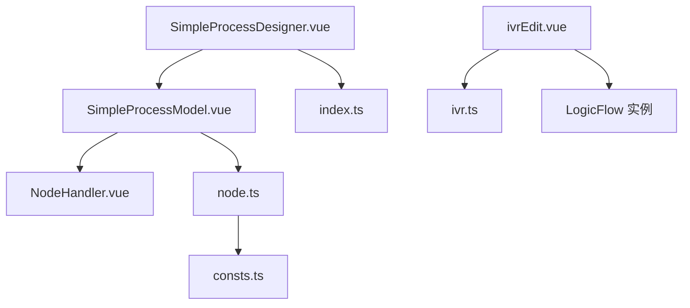
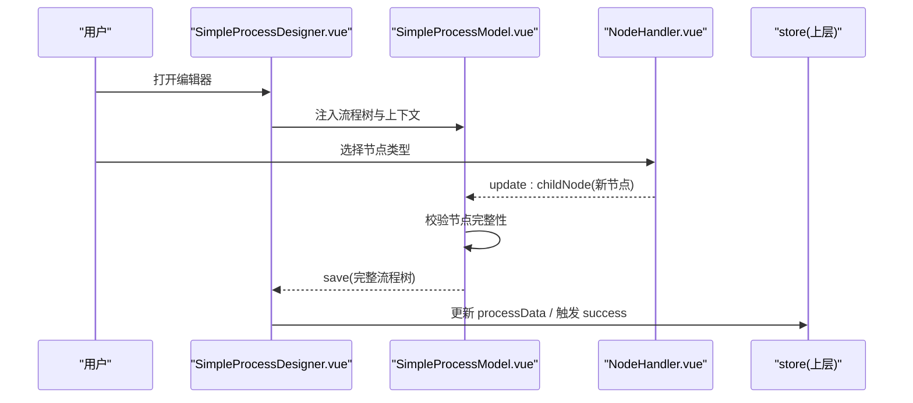
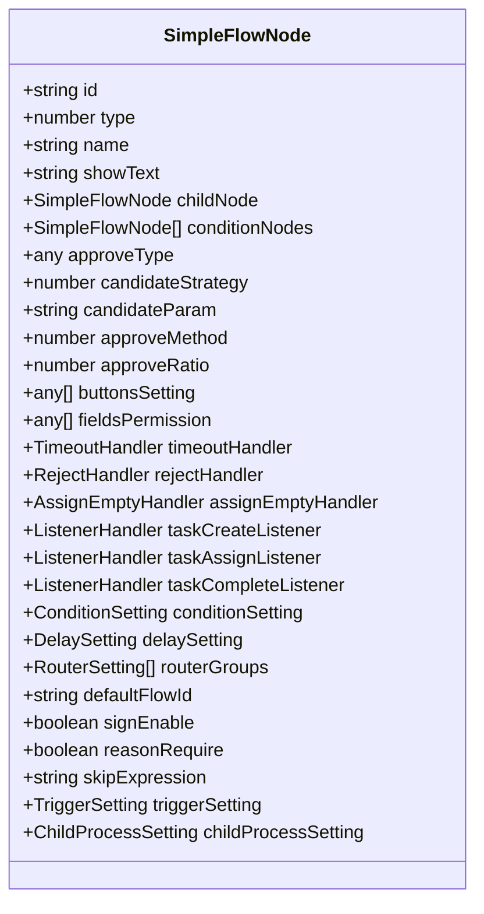
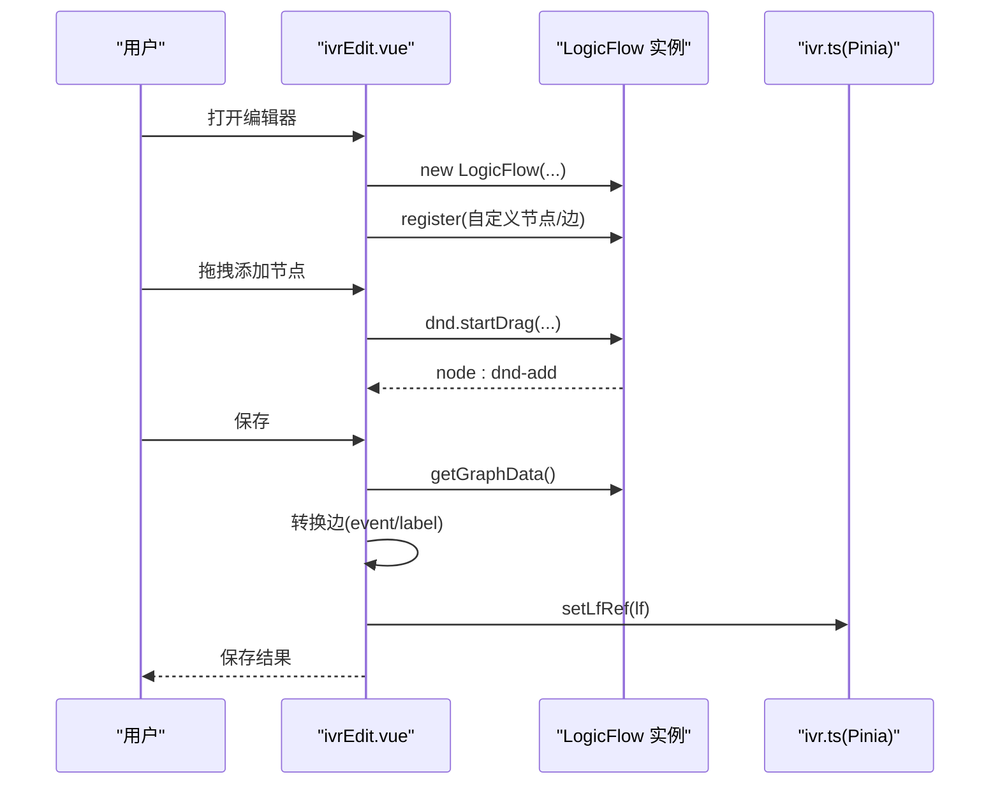
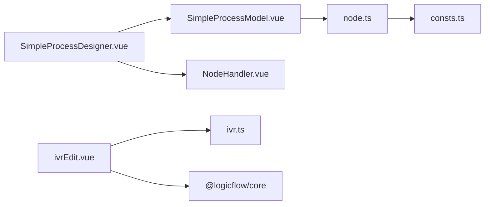

# 流程编辑器核心

<cite>
**本文引用的文件**
- [SimpleProcessDesigner.vue](file://yudao-ui-admin-vue3/src/components/SimpleProcessDesignerV2/src/SimpleProcessDesigner.vue)
- [SimpleProcessModel.vue](file://yudao-ui-admin-vue3/src/components/SimpleProcessDesignerV2/src/SimpleProcessModel.vue)
- [NodeHandler.vue](file://yudao-ui-admin-vue3/src/components/SimpleProcessDesignerV2/src/NodeHandler.vue)
- [node.ts](file://yudao-ui-admin-vue3/src/components/SimpleProcessDesignerV2/src/node.ts)
- [consts.ts](file://yudao-ui-admin-vue3/src/components/SimpleProcessDesignerV2/src/consts.ts)
- [index.ts](file://yudao-ui-admin-vue3/src/components/SimpleProcessDesignerV2/src/index.ts)
- [ivrEdit.vue](file://yudao-ui-admin-vue3/src/views/cc/ivr/ivrEdit.vue)
- [ivr.ts](file://yudao-ui-admin-vue3/src/views/cc/ivr/store/ivr.ts)
</cite>

## 目录
1. [简介](#简介)
2. [项目结构](#项目结构)
3. [核心组件](#核心组件)
4. [架构总览](#架构总览)
5. [详细组件分析](#详细组件分析)
6. [依赖关系分析](#依赖关系分析)
7. [性能考虑](#性能考虑)
8. [故障排查指南](#故障排查指南)
9. [结论](#结论)
10. [附录](#附录)

## 简介
本文件面向 IVR 流程编辑器的核心能力，聚焦可视化流程设计器的整体架构与实现细节，涵盖画布渲染、节点拖拽机制、流程图数据结构、编辑器核心组件（特别是 SimpleProcessDesignerV2）、状态管理、数据同步策略、流程验证机制、扩展开发指南以及性能优化与用户体验改进建议。文档同时覆盖基于 LogicFlow 的 IVR 专用编辑器实现，便于理解不同技术路线下的共性与差异。

## 项目结构
- 通用流程编辑器（SimpleProcessDesignerV2）
  - 入口导出：[index.ts](file://yudao-ui-admin-vue3/src/components/SimpleProcessDesignerV2/src/index.ts)
  - 顶层容器：[SimpleProcessDesigner.vue](file://yudao-ui-admin-vue3/src/components/SimpleProcessDesignerV2/src/SimpleProcessDesigner.vue)
  - 画布容器与缩放平移：[SimpleProcessModel.vue](file://yudao-ui-admin-vue3/src/components/SimpleProcessDesignerV2/src/SimpleProcessModel.vue)
  - 节点添加器：[NodeHandler.vue](file://yudao-ui-admin-vue3/src/components/SimpleProcessDesignerV2/src/NodeHandler.vue)
  - 节点模型与工具：[node.ts](file://yudao-ui-admin-vue3/src/components/SimpleProcessDesignerV2/src/node.ts)
  - 常量与类型定义：[consts.ts](file://yudao-ui-admin-vue3/src/components/SimpleProcessDesignerV2/src/consts.ts)

- IVR 专用编辑器（LogicFlow 方案）
  - 页面主容器与初始化：[ivrEdit.vue](file://yudao-ui-admin-vue3/src/views/cc/ivr/ivrEdit.vue)
  - 状态与节点元数据：[ivr.ts](file://yudao-ui-admin-vue3/src/views/cc/ivr/store/ivr.ts)

图表来源
- [SimpleProcessDesigner.vue:1-234](file://yudao-ui-admin-vue3/src/components/SimpleProcessDesignerV2/src/SimpleProcessDesigner.vue#L1-L234)
- [SimpleProcessModel.vue:1-280](file://yudao-ui-admin-vue3/src/components/SimpleProcessDesignerV2/src/SimpleProcessModel.vue#L1-L280)
- [NodeHandler.vue:1-309](file://yudao-ui-admin-vue3/src/components/SimpleProcessDesignerV2/src/NodeHandler.vue#L1-L309)
- [node.ts:1-618](file://yudao-ui-admin-vue3/src/components/SimpleProcessDesignerV2/src/node.ts#L1-L618)
- [consts.ts:1-911](file://yudao-ui-admin-vue3/src/components/SimpleProcessDesignerV2/src/consts.ts#L1-L911)
- [index.ts:1-6](file://yudao-ui-admin-vue3/src/components/SimpleProcessDesignerV2/src/index.ts#L1-L6)
- [ivrEdit.vue:1-793](file://yudao-ui-admin-vue3/src/views/cc/ivr/ivrEdit.vue#L1-L793)
- [ivr.ts:1-362](file://yudao-ui-admin-vue3/src/views/cc/ivr/store/ivr.ts#L1-L362)

章节来源
- [SimpleProcessDesigner.vue:1-234](file://yudao-ui-admin-vue3/src/components/SimpleProcessDesignerV2/src/SimpleProcessDesigner.vue#L1-L234)
- [SimpleProcessModel.vue:1-280](file://yudao-ui-admin-vue3/src/components/SimpleProcessDesignerV2/src/SimpleProcessModel.vue#L1-L280)
- [NodeHandler.vue:1-309](file://yudao-ui-admin-vue3/src/components/SimpleProcessDesignerV2/src/NodeHandler.vue#L1-L309)
- [node.ts:1-618](file://yudao-ui-admin-vue3/src/components/SimpleProcessDesignerV2/src/node.ts#L1-L618)
- [consts.ts:1-911](file://yudao-ui-admin-vue3/src/components/SimpleProcessDesignerV2/src/consts.ts#L1-L911)
- [index.ts:1-6](file://yudao-ui-admin-vue3/src/components/SimpleProcessDesignerV2/src/index.ts#L1-L6)
- [ivrEdit.vue:1-793](file://yudao-ui-admin-vue3/src/views/cc/ivr/ivrEdit.vue#L1-L793)
- [ivr.ts:1-362](file://yudao-ui-admin-vue3/src/views/cc/ivr/store/ivr.ts#L1-L362)

## 核心组件
- SimpleProcessDesignerV2 组件族
  - 顶层容器负责注入全局上下文（表单字段、角色/部门/用户等选项、流程树根），并维护加载态与保存回调。
  - 画布容器提供缩放、平移、导入/导出 JSON、校验与错误提示。
  - 节点添加器统一封装新增节点逻辑，按节点类型生成默认配置并插入到当前节点的子链中。
  - node.ts 提供节点表单数据、候选人策略解析、显示文案生成、条件展示等通用能力。
  - consts.ts 集中定义节点类型、枚举、默认名称/提示文本、条件/超时/拒绝处理等数据结构。

- IVR 编辑器（LogicFlow）
  - ivrEdit.vue 负责初始化 LogicFlow、注册自定义节点与边、处理拖拽添加、锚点连线、尺寸同步、视图定位、保存前数据转换与持久化。
  - ivr.ts 集中管理节点元数据、默认配置、Pinia store 状态与访问方法。

章节来源
- [SimpleProcessDesigner.vue:1-234](file://yudao-ui-admin-vue3/src/components/SimpleProcessDesignerV2/src/SimpleProcessDesigner.vue#L1-L234)
- [SimpleProcessModel.vue:1-280](file://yudao-ui-admin-vue3/src/components/SimpleProcessDesignerV2/src/SimpleProcessModel.vue#L1-L280)
- [NodeHandler.vue:1-309](file://yudao-ui-admin-vue3/src/components/SimpleProcessDesignerV2/src/NodeHandler.vue#L1-L309)
- [node.ts:1-618](file://yudao-ui-admin-vue3/src/components/SimpleProcessDesignerV2/src/node.ts#L1-L618)
- [consts.ts:1-911](file://yudao-ui-admin-vue3/src/components/SimpleProcessDesignerV2/src/consts.ts#L1-L911)
- [ivrEdit.vue:1-793](file://yudao-ui-admin-vue3/src/views/cc/ivr/ivrEdit.vue#L1-L793)
- [ivr.ts:1-362](file://yudao-ui-admin-vue3/src/views/cc/ivr/store/ivr.ts#L1-L362)

## 架构总览
- 数据流
  - 顶层容器接收外部传入的流程数据或初始化默认结构，通过 provide/inject 向子组件共享上下文。
  - 画布容器维护流程树引用，支持导入/导出 JSON，并在保存前执行校验。
  - 节点添加器根据用户操作动态构建新的节点对象，并通过事件将更新回传到父级。
  - IVR 编辑器通过 LogicFlow 实例管理图模型，使用 Pinia store 集中存储节点元数据与画布引用，并在保存时进行业务字段转换。

- 交互流
  - 拖拽/点击添加节点 → 生成默认配置 → 插入到当前节点子链或画布默认位置 → 触发重渲染。
  - 缩放/平移画布 → 防抖后同步节点尺寸 → 避免锚点与连线错位。
  - 保存 → 校验节点完整性 → 导出 JSON 或调用 API 持久化。

图表来源
- [SimpleProcessDesigner.vue:1-234](file://yudao-ui-admin-vue3/src/components/SimpleProcessDesignerV2/src/SimpleProcessDesigner.vue#L1-L234)
- [SimpleProcessModel.vue:1-280](file://yudao-ui-admin-vue3/src/components/SimpleProcessDesignerV2/src/SimpleProcessModel.vue#L1-L280)
- [NodeHandler.vue:1-309](file://yudao-ui-admin-vue3/src/components/SimpleProcessDesignerV2/src/NodeHandler.vue#L1-L309)

章节来源
- [SimpleProcessDesigner.vue:1-234](file://yudao-ui-admin-vue3/src/components/SimpleProcessDesignerV2/src/SimpleProcessDesigner.vue#L1-L234)
- [SimpleProcessModel.vue:1-280](file://yudao-ui-admin-vue3/src/components/SimpleProcessDesignerV2/src/SimpleProcessModel.vue#L1-L280)
- [NodeHandler.vue:1-309](file://yudao-ui-admin-vue3/src/components/SimpleProcessDesignerV2/src/NodeHandler.vue#L1-L309)

## 详细组件分析

### SimpleProcessDesignerV2 组件族
- 顶层容器（SimpleProcessDesigner.vue）
  - 职责：加载基础字典数据（角色/岗位/用户/部门/用户组），提供 formFields/formType 等上下文；初始化流程树（若无则创建“发起人→结束”默认结构）；保存时输出完整流程树并触发成功事件。
  - 关键点：provide/inject 传递上下文；watch modelFormId 动态获取表单字段；validateNode 递归校验节点完整性。

- 画布容器（SimpleProcessModel.vue）
  - 职责：实现画布缩放、平移、导入/导出 JSON；在保存前执行 validateNode；暴露 getCurrentFlowData 供外部调用。
  - 关键点：使用 requestAnimationFrame 优化拖拽性能；importKey 强制重新挂载 ProcessNodeTree 以解决复用场景下 watch 失效导致的刷新问题。

- 节点添加器（NodeHandler.vue）
  - 职责：为不同节点类型生成默认配置（如审批/抄送/分支/延迟器/触发器/子流程），并将新节点插入到当前节点的 childNode 链中。
  - 关键点：对分支节点预置条件节点与默认分支；为任务类节点预设超时/拒绝/监听器等默认值。

- 节点模型与工具（node.ts）
  - 职责：封装 useNodeForm/useDrawer/useNodeName/useTaskStatusClass/getConditionShowText 等通用逻辑；解析候选人策略参数与显示文案；合并表单字段权限。
  - 关键点：handleCandidateParam/parseCandidateParam 双向转换候选人参数；getConditionShowText 将规则表达式转换为可读文本。

- 常量与类型（consts.ts）
  - 职责：集中定义 NodeType、NodeId、SimpleFlowNode、候选策略、多人审批方式、条件/超时/拒绝处理、按钮权限、比较运算符等。
  - 关键点：NODE_DEFAULT_TEXT/NODE_DEFAULT_NAME 提供默认提示与名称；DEFAULT_CONDITION_GROUP_VALUE 提供条件组默认结构。

图表来源
- [consts.ts:81-140](file://yudao-ui-admin-vue3/src/components/SimpleProcessDesignerV2/src/consts.ts#L81-L140)

章节来源
- [SimpleProcessDesigner.vue:1-234](file://yudao-ui-admin-vue3/src/components/SimpleProcessDesignerV2/src/SimpleProcessDesigner.vue#L1-L234)
- [SimpleProcessModel.vue:1-280](file://yudao-ui-admin-vue3/src/components/SimpleProcessDesignerV2/src/SimpleProcessModel.vue#L1-L280)
- [NodeHandler.vue:1-309](file://yudao-ui-admin-vue3/src/components/SimpleProcessDesignerV2/src/NodeHandler.vue#L1-L309)
- [node.ts:1-618](file://yudao-ui-admin-vue3/src/components/SimpleProcessDesignerV2/src/node.ts#L1-L618)
- [consts.ts:1-911](file://yudao-ui-admin-vue3/src/components/SimpleProcessDesignerV2/src/consts.ts#L1-L911)

### IVR 编辑器（LogicFlow 方案）
- 页面主容器（ivrEdit.vue）
  - 职责：初始化 LogicFlow 实例，注册自定义节点与边；处理拖拽添加、锚点连线、尺寸同步、视图定位；保存前对边进行业务字段转换（如判断器分支标签与事件名）。
  - 关键点：graph:transform 防抖后同步节点尺寸；node:add 后 rAF 同步尺寸；首次渲染后固定缩放至 100% 并定位首个节点；保存时对条件分支边设置 event 标识。

- 状态与节点元数据（ivr.ts）
  - 职责：集中定义所有 IVR 节点的元数据与默认配置；通过 Pinia store 暴露 getNodeList/getNodes/setLfRef 等方法。
  - 关键点：allNodeDefinitions 统一管理节点 meta/config；nodes 以 type 为键组织配置；nodeList 仅暴露 meta 用于侧边栏展示。

图表来源
- [ivrEdit.vue:176-410](file://yudao-ui-admin-vue3/src/views/cc/ivr/ivrEdit.vue#L176-L410)
- [ivrEdit.vue:516-573](file://yudao-ui-admin-vue3/src/views/cc/ivr/ivrEdit.vue#L516-L573)
- [ivr.ts:283-353](file://yudao-ui-admin-vue3/src/views/cc/ivr/store/ivr.ts#L283-L353)

章节来源
- [ivrEdit.vue:1-793](file://yudao-ui-admin-vue3/src/views/cc/ivr/ivrEdit.vue#L1-L793)
- [ivr.ts:1-362](file://yudao-ui-admin-vue3/src/views/cc/ivr/store/ivr.ts#L1-L362)

## 依赖关系分析
- 模块耦合
  - SimpleProcessDesigner.vue 依赖 SimpleProcessModel.vue 与 NodeHandler.vue，并通过 provide/inject 共享上下文；node.ts 与 consts.ts 被多处复用。
  - ivrEdit.vue 强依赖 LogicFlow 库与 ivr.ts 的状态管理；自定义节点与边通过 register 注入。

- 外部依赖
  - SimpleProcessDesignerV2：Element Plus、@logicflow/vue-node-registry（可选）、lodash-es（深拷贝）。
  - IVR 编辑器：@logicflow/core、@logicflow/vue-node-registry、Element Plus、Pinia。

图表来源
- [SimpleProcessDesigner.vue:1-234](file://yudao-ui-admin-vue3/src/components/SimpleProcessDesignerV2/src/SimpleProcessDesigner.vue#L1-L234)
- [SimpleProcessModel.vue:1-280](file://yudao-ui-admin-vue3/src/components/SimpleProcessDesignerV2/src/SimpleProcessModel.vue#L1-L280)
- [NodeHandler.vue:1-309](file://yudao-ui-admin-vue3/src/components/SimpleProcessDesignerV2/src/NodeHandler.vue#L1-L309)
- [node.ts:1-618](file://yudao-ui-admin-vue3/src/components/SimpleProcessDesignerV2/src/node.ts#L1-L618)
- [consts.ts:1-911](file://yudao-ui-admin-vue3/src/components/SimpleProcessDesignerV2/src/consts.ts#L1-L911)
- [ivrEdit.vue:1-793](file://yudao-ui-admin-vue3/src/views/cc/ivr/ivrEdit.vue#L1-L793)
- [ivr.ts:1-362](file://yudao-ui-admin-vue3/src/views/cc/ivr/store/ivr.ts#L1-L362)

章节来源
- [SimpleProcessDesigner.vue:1-234](file://yudao-ui-admin-vue3/src/components/SimpleProcessDesignerV2/src/SimpleProcessDesigner.vue#L1-L234)
- [SimpleProcessModel.vue:1-280](file://yudao-ui-admin-vue3/src/components/SimpleProcessDesignerV2/src/SimpleProcessModel.vue#L1-L280)
- [NodeHandler.vue:1-309](file://yudao-ui-admin-vue3/src/components/SimpleProcessDesignerV2/src/NodeHandler.vue#L1-L309)
- [node.ts:1-618](file://yudao-ui-admin-vue3/src/components/SimpleProcessDesignerV2/src/node.ts#L1-L618)
- [consts.ts:1-911](file://yudao-ui-admin-vue3/src/components/SimpleProcessDesignerV2/src/consts.ts#L1-L911)
- [ivrEdit.vue:1-793](file://yudao-ui-admin-vue3/src/views/cc/ivr/ivrEdit.vue#L1-L793)
- [ivr.ts:1-362](file://yudao-ui-admin-vue3/src/views/cc/ivr/store/ivr.ts#L1-L362)

## 性能考虑
- 画布交互优化
  - 使用 requestAnimationFrame 包裹拖拽更新，减少频繁重排重绘。
  - 对 graph:transform 高频事件采用防抖（80ms）后再同步节点尺寸，避免抖动与性能开销。
  - 首次渲染与节点添加后通过 rAF 多次兜底同步尺寸，确保锚点与连线端点对齐。

- 数据与渲染
  - 导入 JSON 时通过 key 强制重新挂载 ProcessNodeTree，规避 watch 在复用场景失效导致的刷新问题。
  - 固定缩放至 100% 并定位首个节点，避免 fitView 自动缩放导致内容过小。

- 建议
  - 对大型流程图采用虚拟滚动或分片渲染。
  - 缓存节点计算结果（如候选人显示文案、条件展示文本）。
  - 使用 Web Worker 处理复杂条件表达式解析。

章节来源
- [SimpleProcessModel.vue:93-158](file://yudao-ui-admin-vue3/src/components/SimpleProcessDesignerV2/src/SimpleProcessModel.vue#L93-L158)
- [SimpleProcessModel.vue:222-252](file://yudao-ui-admin-vue3/src/components/SimpleProcessDesignerV2/src/SimpleProcessModel.vue#L222-L252)
- [ivrEdit.vue:80-136](file://yudao-ui-admin-vue3/src/views/cc/ivr/ivrEdit.vue#L80-L136)
- [ivrEdit.vue:342-400](file://yudao-ui-admin-vue3/src/views/cc/ivr/ivrEdit.vue#L342-L400)
- [ivrEdit.vue:435-476](file://yudao-ui-admin-vue3/src/views/cc/ivr/ivrEdit.vue#L435-L476)

## 故障排查指南
- 保存失败提示不完整节点
  - 现象：保存时弹出“以下节点内容不完善”，列出缺失配置的节点。
  - 原因：validateNode 检查 showText 是否为空或条件规则是否完善。
  - 处理：根据提示补全节点配置（如审批人、抄送人、条件规则）。

- 画布缩放后节点尺寸错位
  - 现象：多次缩放后锚点、连线端点与节点边界不一致。
  - 原因：HtmlNodeModel 缓存 width/height 与实际 DOM 尺寸存在浮点累积偏差。
  - 处理：graph:transform 防抖后调用 syncAllNodesSize；node:add 后 rAF 同步；首次渲染后二次 rAF 兜底。

- 表单下拉框需双击才能激活
  - 现象：在 LogicFlow 画布内编辑表单时，下拉框需双击。
  - 原因：pointerdown 与 LogicFlow 拖拽冲突。
  - 处理：安装全局表单守护者，拦截 pointermove/mousemove 仅在表单交互期间生效，避免启动拖拽偏移。

- 保存后视图异常
  - 现象：保存后再次打开，节点位于视口外或样式错乱。
  - 原因：fitView 时机过早或上次残留缩放状态。
  - 处理：重置缩放至 100%，定位首个节点到合适位置，再触发 setView(getView()) 同步 SVG 与 HTML 层 transform。

章节来源
- [SimpleProcessDesigner.vue:157-194](file://yudao-ui-admin-vue3/src/components/SimpleProcessDesignerV2/src/SimpleProcessDesigner.vue#L157-L194)
- [SimpleProcessModel.vue:160-216](file://yudao-ui-admin-vue3/src/components/SimpleProcessDesignerV2/src/SimpleProcessModel.vue#L160-L216)
- [ivrEdit.vue:162-180](file://yudao-ui-admin-vue3/src/views/cc/ivr/ivrEdit.vue#L162-L180)
- [ivrEdit.vue:342-400](file://yudao-ui-admin-vue3/src/views/cc/ivr/ivrEdit.vue#L342-L400)
- [ivrEdit.vue:435-476](file://yudao-ui-admin-vue3/src/views/cc/ivr/ivrEdit.vue#L435-L476)

## 结论
- SimpleProcessDesignerV2 提供了通用的可视化流程设计能力，通过清晰的组件分层、统一的节点模型与常量定义，实现了可扩展的节点体系与稳健的校验机制。
- IVR 编辑器基于 LogicFlow，针对语音交互场景定制了节点类型、连线语义与保存数据格式，并通过 Pinia store 集中管理状态与节点元数据。
- 性能方面，通过防抖、rAF 与尺寸同步策略有效解决了缩放与渲染一致性问题；体验方面，提供导入/导出、错误提示、视图定位等实用功能。
- 扩展建议：新增节点类型应遵循现有模式（元数据+默认配置+视图/模型注册），并在保存阶段完成业务字段转换；条件与候选人策略可进一步抽象为可配置规则引擎以提升灵活性。

## 附录
- 扩展开发指南
  - 自定义节点开发（SimpleProcessDesignerV2）
    - 在 NodeHandler.vue 中添加新增节点逻辑，生成默认配置并插入到 childNode 链。
    - 在 consts.ts 中补充 NodeType、默认名称/提示文本、相关枚举与默认结构。
    - 在 node.ts 中实现显示文案生成与参数解析逻辑。
  - 第三方服务集成
    - 在 node.ts 的监听器结构中配置 HTTP 请求头与请求体参数（固定值/表单字段）。
    - 在保存前对监听器参数进行校验与序列化，确保后端可消费。
  - IVR 节点扩展（LogicFlow）
    - 在 ivr.ts 的 allNodeDefinitions 中新增节点元数据与默认配置。
    - 在 ivrEdit.vue 中 register 自定义节点与边，处理锚点与连线语义。
    - 在保存阶段对边进行业务字段转换（如 event/label），保证执行期可用。

- 最佳实践
  - 保持节点模型扁平且自描述，避免深层嵌套导致校验与序列化复杂。
  - 对高频交互（缩放/拖拽）使用防抖与 rAF，降低重排重绘成本。
  - 对用户可见的错误信息提供明确指引，缩短修复路径。