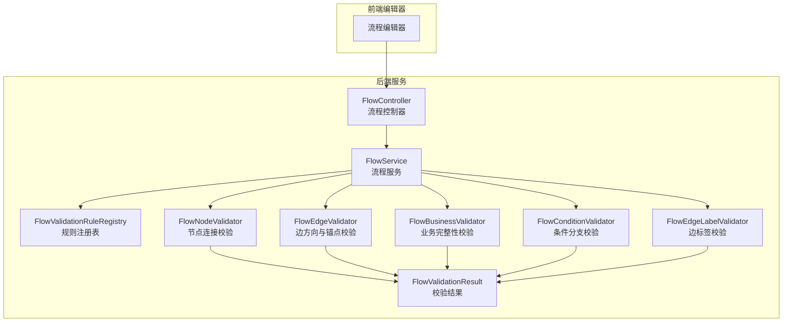
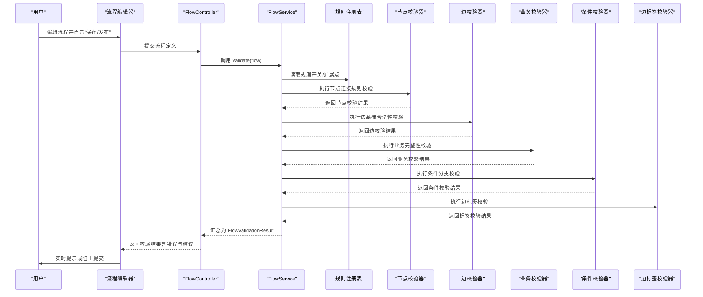
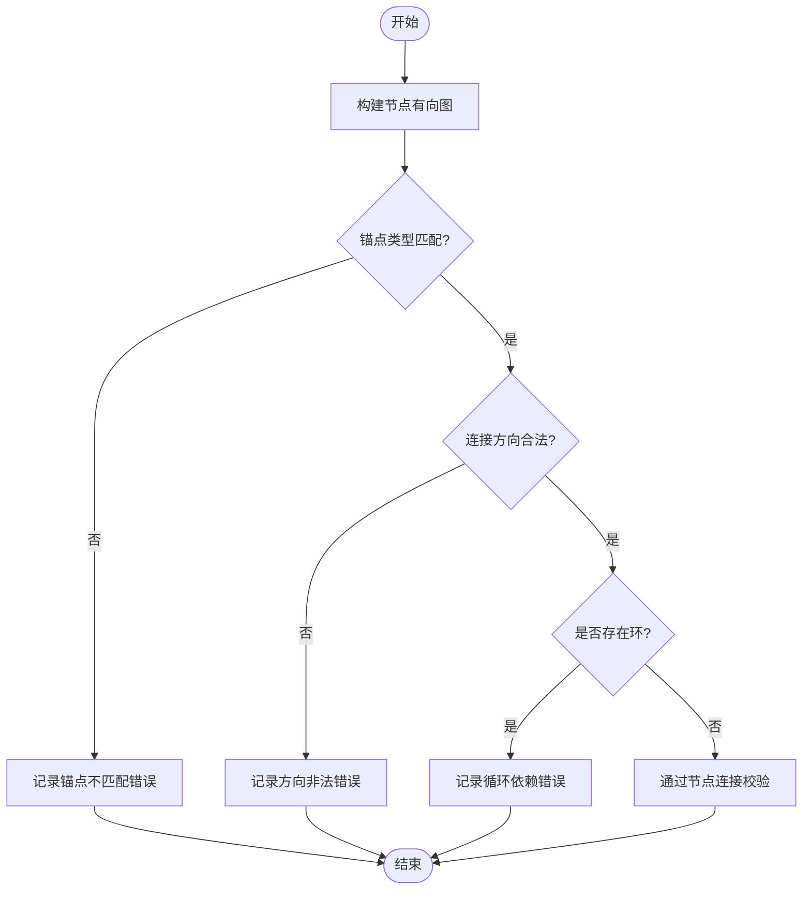
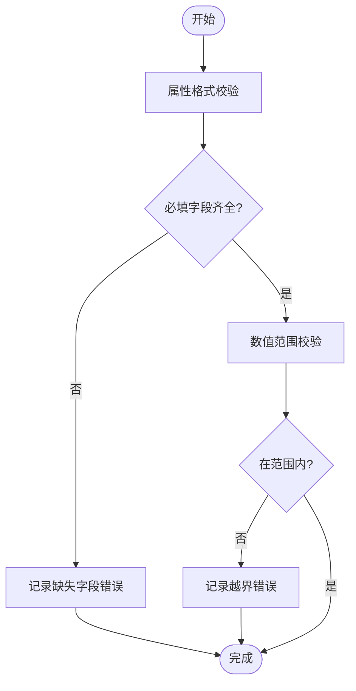
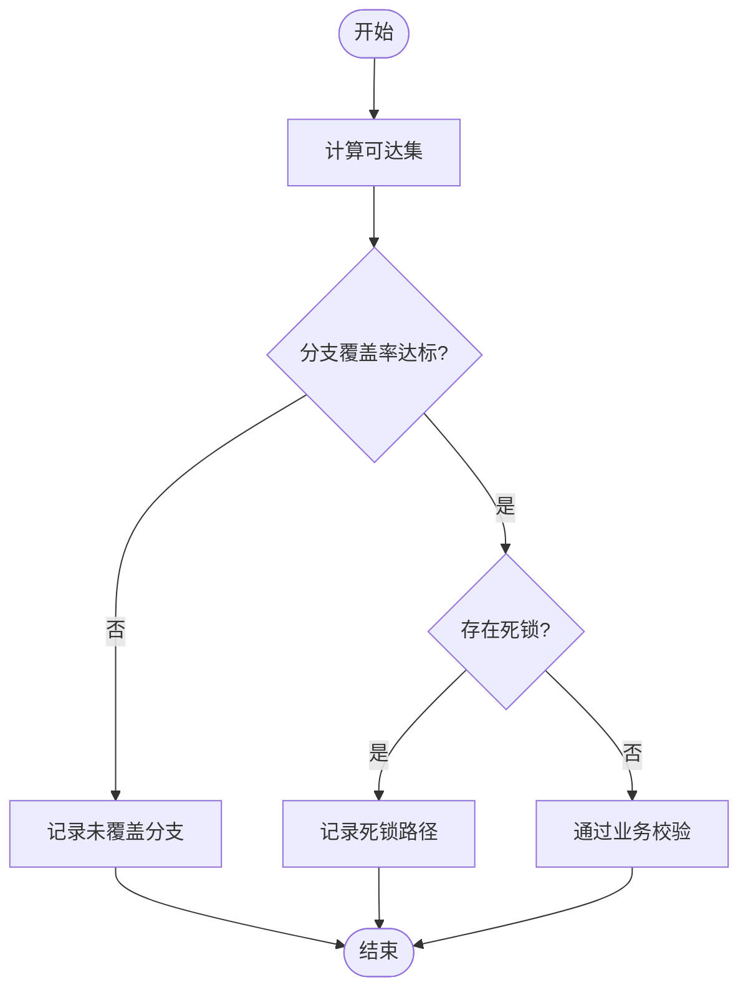
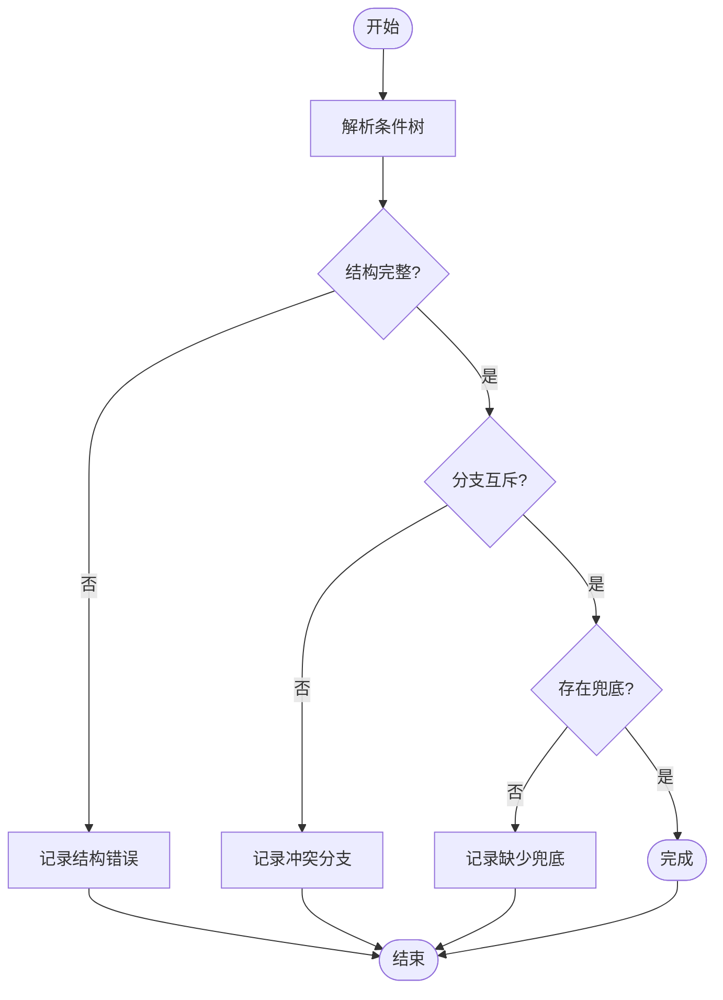
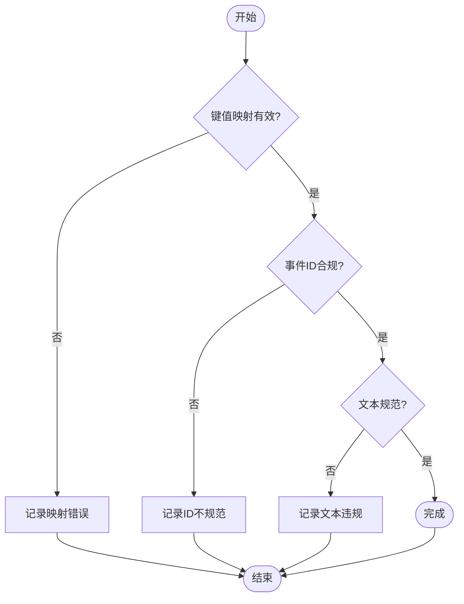
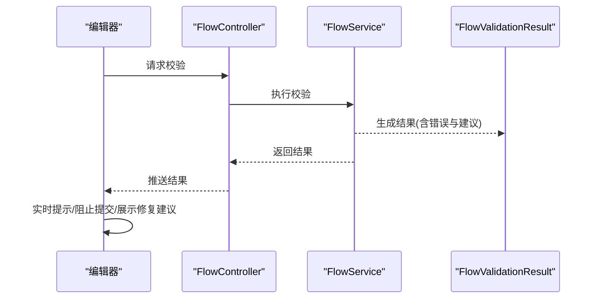
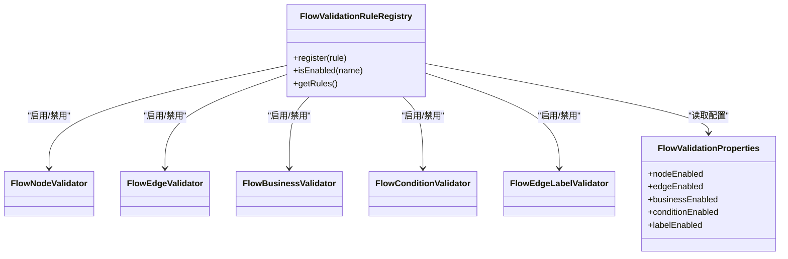
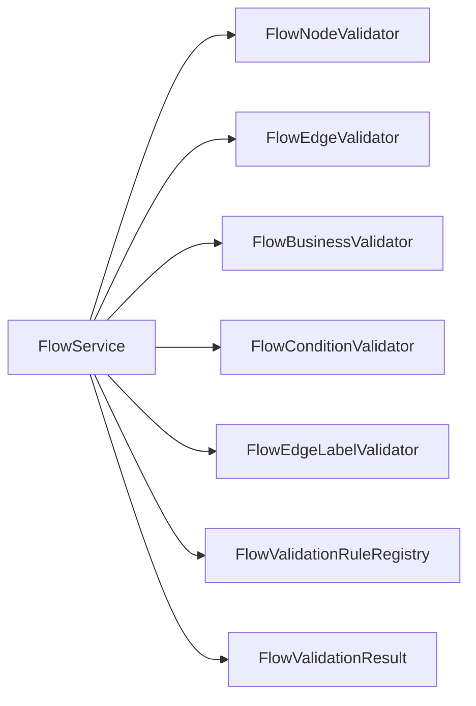

# 流程验证系统

<cite>
**本文引用的文件**
- [README.md](file://README.md)
- [yudao-module-cc-server/pom.xml](file://yudao-cloud/yudao-module-cc/yudao-module-cc-server/pom.xml)
- [FlowController.java](file://yudao-cloud/yudao-module-cc/yudao-module-cc-server/src/main/java/cn/iocoder/yudao/module/cc/controller/admin/flow/FlowController.java)
- [FlowService.java](file://yudao-cloud/yudao-module-cc/yudao-module-cc-server/src/main/java/cn/iocoder/yudao/module/cc/service/flow/FlowService.java)
- [FlowServiceImpl.java](file://yudao-cloud/yudao-module-cc/yudao-module-cc-server/src/main/java/cn/iocoder/yudao/module/cc/service/flow/FlowServiceImpl.java)
- [FlowNodeValidator.java](file://yudao-cloud/yudao-module-cc/yudao-module-cc-server/src/main/java/cn/iocoder/yudao/module/cc/ivr/handler/node/FlowNodeValidator.java)
- [FlowEdgeValidator.java](file://yudao-cloud/yudao-module-cc/yudao-module-cc-server/src/main/java/cn/iocoder/yudao/module/cc/ivr/handler/edge/FlowEdgeValidator.java)
- [FlowBusinessValidator.java](file://yudao-cloud/yudao-module-cc/yudao-module-cc-server/src/main/java/cn/iocoder/yudao/module/cc/ivr/handler/business/FlowBusinessValidator.java)
- [FlowConditionValidator.java](file://yudao-cloud/yudao-module-cc/yudao-module-cc-server/src/main/java/cn/iocoder/yudao/module/cc/ivr/handler/condition/FlowConditionValidator.java)
- [FlowEdgeLabelValidator.java](file://yudao-cloud/yudao-module-cc/yudao-module-cc-server/src/main/java/cn/iocoder/yudao/module/cc/ivr/handler/label/FlowEdgeLabelValidator.java)
- [FlowValidationResult.java](file://yudao-cloud/yudao-module-cc/yudao-module-cc-server/src/main/java/cn/iocoder/yudao/module/cc/ivr/dto/FlowValidationResult.java)
- [FlowValidationRuleRegistry.java](file://yudao-cloud/yudao-module-cc/yudao-module-cc-server/src/main/java/cn/iocoder/yudao/module/cc/ivr/config/FlowValidationRuleRegistry.java)
- [FlowValidationProperties.java](file://yudao-cloud/yudao-module-cc/yudao-module-cc-server/src/main/java/cn/iocoder/yudao/module/cc/ivr/properties/FlowValidationProperties.java)
</cite>

## 目录
1. [简介](#简介)
2. [项目结构](#项目结构)
3. [核心组件](#核心组件)
4. [架构总览](#架构总览)
5. [详细组件分析](#详细组件分析)
6. [依赖关系分析](#依赖关系分析)
7. [性能考虑](#性能考虑)
8. [故障排查指南](#故障排查指南)
9. [结论](#结论)
10. [附录](#附录)

## 简介
本文件为 IVR 流程编辑器的“流程验证系统”提供完整技术文档。围绕节点连接规则、数据类型校验、业务流程完整性、条件分支正确性、边标签规范以及错误处理与扩展机制，给出可落地的实现要点、流程图与调用时序，帮助开发者快速理解并扩展该验证子系统。

## 项目结构
IVR 流程验证系统位于呼叫中心模块的 ivr 子域中，采用“按职责分层 + 按验证维度拆分”的组织方式：
- 控制器层：对外暴露流程保存/发布前的校验入口
- 服务层：编排校验流程、聚合结果
- 验证器层：按维度拆分的独立校验器（节点、边、业务、条件、边标签）
- DTO/枚举/配置：统一的结果模型、规则开关与可扩展注册表

图表来源
- [FlowController.java](file://yudao-cloud/yudao-module-cc/yudao-module-cc-server/src/main/java/cn/iocoder/yudao/module/cc/controller/admin/flow/FlowController.java)
- [FlowService.java](file://yudao-cloud/yudao-module-cc/yudao-module-cc-server/src/main/java/cn/iocoder/yudao/module/cc/service/flow/FlowService.java)
- [FlowValidationRuleRegistry.java](file://yudao-cloud/yudao-module-cc/yudao-module-cc-server/src/main/java/cn/iocoder/yudao/module/cc/ivr/config/FlowValidationRuleRegistry.java)
- [FlowNodeValidator.java](file://yudao-cloud/yudao-module-cc/yudao-module-cc-server/src/main/java/cn/iocoder/yudao/module/cc/ivr/handler/node/FlowNodeValidator.java)
- [FlowEdgeValidator.java](file://yudao-cloud/yudao-module-cc/yudao-module-cc-server/src/main/java/cn/iocoder/yudao/module/cc/ivr/handler/edge/FlowEdgeValidator.java)
- [FlowBusinessValidator.java](file://yudao-cloud/yudao-module-cc/yudao-module-cc-server/src/main/java/cn/iocoder/yudao/module/cc/ivr/handler/business/FlowBusinessValidator.java)
- [FlowConditionValidator.java](file://yudao-cloud/yudao-module-cc/yudao-module-cc-server/src/main/java/cn/iocoder/yudao/module/cc/ivr/handler/condition/FlowConditionValidator.java)
- [FlowEdgeLabelValidator.java](file://yudao-cloud/yudao-module-cc/yudao-module-cc-server/src/main/java/cn/iocoder/yudao/module/cc/ivr/handler/label/FlowEdgeLabelValidator.java)
- [FlowValidationResult.java](file://yudao-cloud/yudao-module-cc/yudao-module-cc-server/src/main/java/cn/iocoder/yudao/module/cc/ivr/dto/FlowValidationResult.java)

章节来源
- [README.md:1-29](file://README.md#L1-L29)
- [yudao-module-cc-server/pom.xml:1-200](file://yudao-cloud/yudao-module-cc/yudao-module-cc-server/pom.xml#L1-L200)

## 核心组件
- FlowController：接收编辑器提交，触发流程校验，返回统一校验结果
- FlowService：编排校验顺序，汇总各维度校验结果，支持实时提示与阻止提交
- FlowValidationRuleRegistry：集中管理校验规则开关与扩展点
- 五大验证器：
  - FlowNodeValidator：节点连接规则（锚点类型匹配、连接方向、循环依赖检测）
  - FlowEdgeValidator：边级基础合法性（端点存在性、重复边等）
  - FlowBusinessValidator：流程逻辑完整性（起点/终点、覆盖率、死锁检测）
  - FlowConditionValidator：IF/ELSE_IF/ELSE 结构与互斥性检查
  - FlowEdgeLabelValidator：菜单按钮值映射、事件标识生成、文本内容规范
- FlowValidationResult：统一的校验结果载体（通过/失败、错误列表、修复建议）

章节来源
- [FlowController.java:1-200](file://yudao-cloud/yudao-module-cc/yudao-module-cc-server/src/main/java/cn/iocoder/yudao/module/cc/controller/admin/flow/FlowController.java#L1-L200)
- [FlowService.java:1-200](file://yudao-cloud/yudao-module-cc/yudao-module-cc-server/src/main/java/cn/iocoder/yudao/module/cc/service/flow/FlowService.java#L1-L200)
- [FlowValidationResult.java:1-200](file://yudao-cloud/yudao-module-cc/yudao-module-cc-server/src/main/java/cn/iocoder/yudao/module/cc/ivr/dto/FlowValidationResult.java#L1-L200)

## 架构总览
下图展示了从编辑器到后端校验引擎的端到端调用链，以及各验证器的协作关系。

图表来源
- [FlowController.java:1-200](file://yudao-cloud/yudao-module-cc/yudao-module-cc-server/src/main/java/cn/iocoder/yudao/module/cc/controller/admin/flow/FlowController.java#L1-L200)
- [FlowService.java:1-200](file://yudao-cloud/yudao-module-cc/yudao-module-cc-server/src/main/java/cn/iocoder/yudao/module/cc/service/flow/FlowService.java#L1-L200)
- [FlowValidationRuleRegistry.java:1-200](file://yudao-cloud/yudao-module-cc/yudao-module-cc-server/src/main/java/cn/iocoder/yudao/module/cc/ivr/config/FlowValidationRuleRegistry.java#L1-L200)
- [FlowNodeValidator.java:1-200](file://yudao-cloud/yudao-module-cc/yudao-module-cc-server/src/main/java/cn/iocoder/yudao/module/cc/ivr/handler/node/FlowNodeValidator.java#L1-L200)
- [FlowEdgeValidator.java:1-200](file://yudao-cloud/yudao-module-cc/yudao-module-cc-server/src/main/java/cn/iocoder/yudao/module/cc/ivr/handler/edge/FlowEdgeValidator.java#L1-L200)
- [FlowBusinessValidator.java:1-200](file://yudao-cloud/yudao-module-cc/yudao-module-cc-server/src/main/java/cn/iocoder/yudao/module/cc/ivr/handler/business/FlowBusinessValidator.java#L1-L200)
- [FlowConditionValidator.java:1-200](file://yudao-cloud/yudao-module-cc/yudao-module-cc-server/src/main/java/cn/iocoder/yudao/module/cc/ivr/handler/condition/FlowConditionValidator.java#L1-L200)
- [FlowEdgeLabelValidator.java:1-200](file://yudao-cloud/yudao-module-cc/yudao-module-cc-server/src/main/java/cn/iocoder/yudao/module/cc/ivr/handler/label/FlowEdgeLabelValidator.java#L1-L200)

## 详细组件分析

### 节点连接规则验证
- 锚点类型匹配：入/出锚点需满足类型兼容约束，避免跨类型误连
- 连接方向检查：仅允许符合语义的方向（如开始→处理→结束），禁止反向连接
- 循环依赖检测：基于有向图遍历检测环，防止流程无法终止

图表来源
- [FlowNodeValidator.java:1-200](file://yudao-cloud/yudao-module-cc/yudao-module-cc-server/src/main/java/cn/iocoder/yudao/module/cc/ivr/handler/node/FlowNodeValidator.java#L1-L200)

章节来源
- [FlowNodeValidator.java:1-200](file://yudao-cloud/yudao-module-cc/yudao-module-cc-server/src/main/java/cn/iocoder/yudao/module/cc/ivr/handler/node/FlowNodeValidator.java#L1-L200)

### 数据类型验证机制
- 节点属性格式校验：对字符串、JSON、URL、正则等字段进行格式校验
- 必填字段检查：确保关键属性不可为空
- 数值范围验证：对超时、音量、重试次数等数值型参数设置上下界

图表来源
- [FlowService.java:1-200](file://yudao-cloud/yudao-module-cc/yudao-module-cc-server/src/main/java/cn/iocoder/yudao/module/cc/service/flow/FlowService.java#L1-L200)
- [FlowValidationResult.java:1-200](file://yudao-cloud/yudao-module-cc/yudao-module-cc-server/src/main/java/cn/iocoder/yudao/module/cc/ivr/dto/FlowValidationResult.java#L1-L200)

章节来源
- [FlowService.java:1-200](file://yudao-cloud/yudao-module-cc/yudao-module-cc-server/src/main/java/cn/iocoder/yudao/module/cc/service/flow/FlowService.java#L1-L200)
- [FlowValidationResult.java:1-200](file://yudao-cloud/yudao-module-cc/yudao-module-cc-server/src/main/java/cn/iocoder/yudao/module/cc/ivr/dto/FlowValidationResult.java#L1-L200)

### 业务流程验证
- 逻辑完整性：必须包含起点与至少一个有效终点；所有节点可达
- 分支覆盖率：每个条件分支至少有一条路径覆盖
- 死锁检测：识别无出口或互相等待导致无法推进的路径

图表来源
- [FlowBusinessValidator.java:1-200](file://yudao-cloud/yudao-module-cc/yudao-module-cc-server/src/main/java/cn/iocoder/yudao/module/cc/ivr/handler/business/FlowBusinessValidator.java#L1-L200)

章节来源
- [FlowBusinessValidator.java:1-200](file://yudao-cloud/yudao-module-cc/yudao-module-cc-server/src/main/java/cn/iocoder/yudao/module/cc/ivr/handler/business/FlowBusinessValidator.java#L1-L200)

### 条件节点的分支验证
- 结构正确性：IF/ELSE_IF/ELSE 结构完整且顺序合理
- 互斥性检查：同一输入条件下，多个分支不能同时命中
- 兜底分支：确保 ELSE 存在或等价兜底策略

图表来源
- [FlowConditionValidator.java:1-200](file://yudao-cloud/yudao-module-cc/yudao-module-cc-server/src/main/java/cn/iocoder/yudao/module/cc/ivr/handler/condition/FlowConditionValidator.java#L1-L200)

章节来源
- [FlowConditionValidator.java:1-200](file://yudao-cloud/yudao-module-cc/yudao-module-cc-server/src/main/java/cn/iocoder/yudao/module/cc/ivr/handler/condition/FlowConditionValidator.java#L1-L200)

### 边标签验证
- 菜单按钮值映射：按键值与目标节点映射一致，避免无效跳转
- 事件标识生成：事件 ID 唯一且符合命名规范
- 文本内容规范：显示文案长度、字符集、敏感词过滤

图表来源
- [FlowEdgeLabelValidator.java:1-200](file://yudao-cloud/yudao-module-cc/yudao-module-cc-server/src/main/java/cn/iocoder/yudao/module/cc/ivr/handler/label/FlowEdgeLabelValidator.java#L1-L200)

章节来源
- [FlowEdgeLabelValidator.java:1-200](file://yudao-cloud/yudao-module-cc/yudao-module-cc-server/src/main/java/cn/iocoder/yudao/module/cc/ivr/handler/label/FlowEdgeLabelValidator.java#L1-L200)

### 错误处理机制
- 实时提示：编辑器侧根据 FlowValidationResult 即时高亮问题节点/边
- 阻止提交：当存在阻断类错误时，禁用保存/发布操作
- 修复建议：每条错误附带可操作的修复建议，提升编辑体验

图表来源
- [FlowController.java:1-200](file://yudao-cloud/yudao-module-cc/yudao-module-cc-server/src/main/java/cn/iocoder/yudao/module/cc/controller/admin/flow/FlowController.java#L1-L200)
- [FlowService.java:1-200](file://yudao-cloud/yudao-module-cc/yudao-module-cc-server/src/main/java/cn/iocoder/yudao/module/cc/service/flow/FlowService.java#L1-L200)
- [FlowValidationResult.java:1-200](file://yudao-cloud/yudao-module-cc/yudao-module-cc-server/src/main/java/cn/iocoder/yudao/module/cc/ivr/dto/FlowValidationResult.java#L1-L200)

章节来源
- [FlowController.java:1-200](file://yudao-cloud/yudao-module-cc/yudao-module-cc-server/src/main/java/cn/iocoder/yudao/module/cc/controller/admin/flow/FlowController.java#L1-L200)
- [FlowService.java:1-200](file://yudao-cloud/yudao-module-cc/yudao-module-cc-server/src/main/java/cn/iocoder/yudao/module/cc/service/flow/FlowService.java#L1-L200)
- [FlowValidationResult.java:1-200](file://yudao-cloud/yudao-module-cc/yudao-module-cc-server/src/main/java/cn/iocoder/yudao/module/cc/ivr/dto/FlowValidationResult.java#L1-L200)

### 验证规则的扩展机制
- 规则注册表：FlowValidationRuleRegistry 集中管理规则开关与优先级
- 自定义规则：通过 SPI/工厂模式注入新验证器，无需修改核心流程
- 配置化：FlowValidationProperties 提供运行时开关与阈值配置

图表来源
- [FlowValidationRuleRegistry.java:1-200](file://yudao-cloud/yudao-module-cc/yudao-module-cc-server/src/main/java/cn/iocoder/yudao/module/cc/ivr/config/FlowValidationRuleRegistry.java#L1-L200)
- [FlowValidationProperties.java:1-200](file://yudao-cloud/yudao-module-cc/yudao-module-cc-server/src/main/java/cn/iocoder/yudao/module/cc/ivr/properties/FlowValidationProperties.java#L1-L200)

章节来源
- [FlowValidationRuleRegistry.java:1-200](file://yudao-cloud/yudao-module-cc/yudao-module-cc-server/src/main/java/cn/iocoder/yudao/module/cc/ivr/config/FlowValidationRuleRegistry.java#L1-L200)
- [FlowValidationProperties.java:1-200](file://yudao-cloud/yudao-module-cc/yudao-module-cc-server/src/main/java/cn/iocoder/yudao/module/cc/ivr/properties/FlowValidationProperties.java#L1-L200)

## 依赖关系分析
- 低耦合：各验证器之间无直接依赖，均通过 FlowService 编排
- 可插拔：规则注册表统一管理，便于新增/禁用验证维度
- 外部依赖：数据库/缓存仅在持久化流程或加载规则时使用，校验过程尽量无状态

图表来源
- [FlowService.java:1-200](file://yudao-cloud/yudao-module-cc/yudao-module-cc-server/src/main/java/cn/iocoder/yudao/module/cc/service/flow/FlowService.java#L1-L200)
- [FlowValidationRuleRegistry.java:1-200](file://yudao-cloud/yudao-module-cc/yudao-module-cc-server/src/main/java/cn/iocoder/yudao/module/cc/ivr/config/FlowValidationRuleRegistry.java#L1-L200)

章节来源
- [FlowService.java:1-200](file://yudao-cloud/yudao-module-cc/yudao-module-cc-server/src/main/java/cn/iocoder/yudao/module/cc/service/flow/FlowService.java#L1-L200)

## 性能考虑
- 增量校验：编辑器侧变更最小单元触发对应验证器，避免全量重算
- 并行校验：非依赖维度的验证器可并行执行，缩短响应时间
- 缓存规则：规则开关与阈值配置本地缓存，减少配置读取开销
- 图算法优化：环检测与可达性分析使用高效数据结构与剪枝策略

[本节为通用指导，不直接分析具体文件]

## 故障排查指南
- 常见问题定位：
  - 锚点类型不匹配：检查节点入/出锚点定义与连线
  - 循环依赖：查看环检测输出，定位形成环的关键边
  - 分支未覆盖：检查条件分支是否遗漏或条件表达式冲突
  - 边标签异常：核对菜单键值映射与事件 ID 生成规则
- 调试建议：
  - 开启 FlowValidationResult 的详细错误信息
  - 逐步禁用验证器以隔离问题来源
  - 结合编辑器高亮与修复建议快速修正

章节来源
- [FlowValidationResult.java:1-200](file://yudao-cloud/yudao-module-cc/yudao-module-cc-server/src/main/java/cn/iocoder/yudao/module/cc/ivr/dto/FlowValidationResult.java#L1-L200)

## 结论
本验证系统以模块化、可配置、可扩展的方式，覆盖了 IVR 流程编辑的核心质量保障点。通过清晰的职责划分与统一的校验结果模型，既保证了编辑体验的流畅性，又确保了流程上线后的稳定性与可维护性。未来可在覆盖率统计、可视化诊断与自动化修复方面持续增强。

[本节为总结性内容，不直接分析具体文件]

## 附录
- 术语说明：
  - 锚点：节点上的连接端口，用于表达数据/控制流方向
  - 边：节点之间的连接，承载跳转或事件传递
  - 条件分支：基于输入或上下文决定后续路径的结构
- 最佳实践：
  - 保持条件分支互斥且完备
  - 为每个菜单项配置明确的键值映射
  - 定期审查覆盖率与死锁报告

[本节为补充说明，不直接分析具体文件]