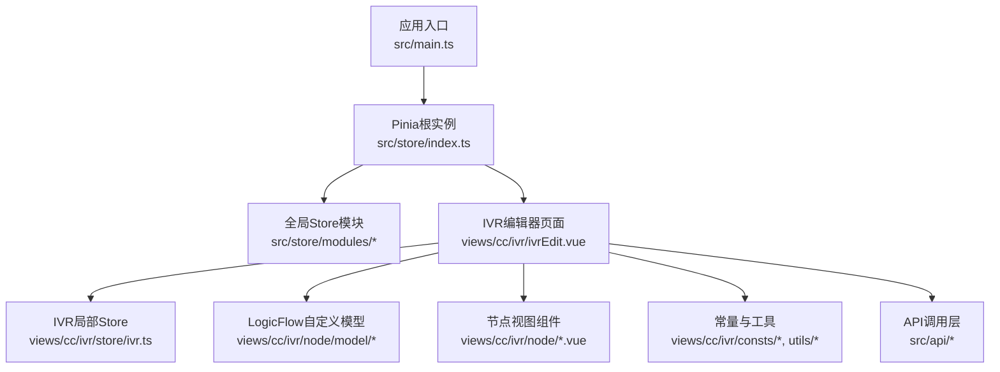
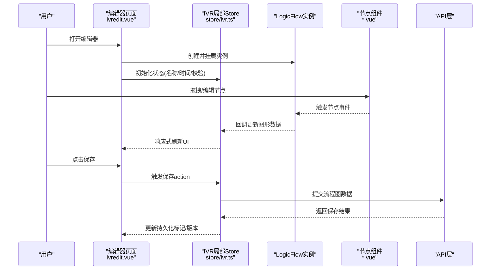
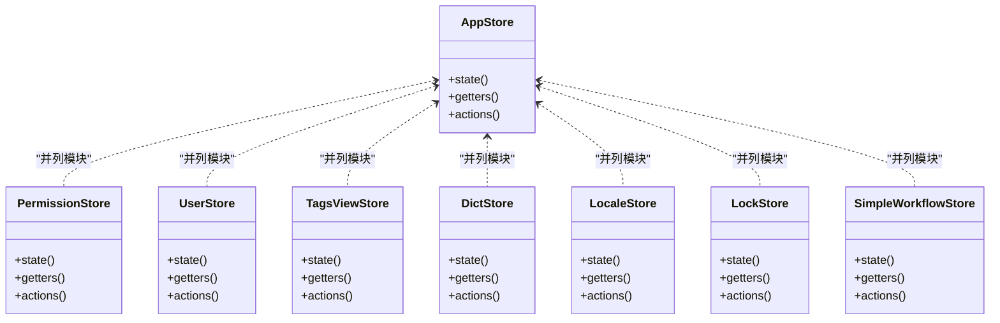
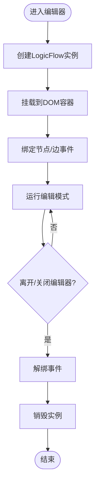
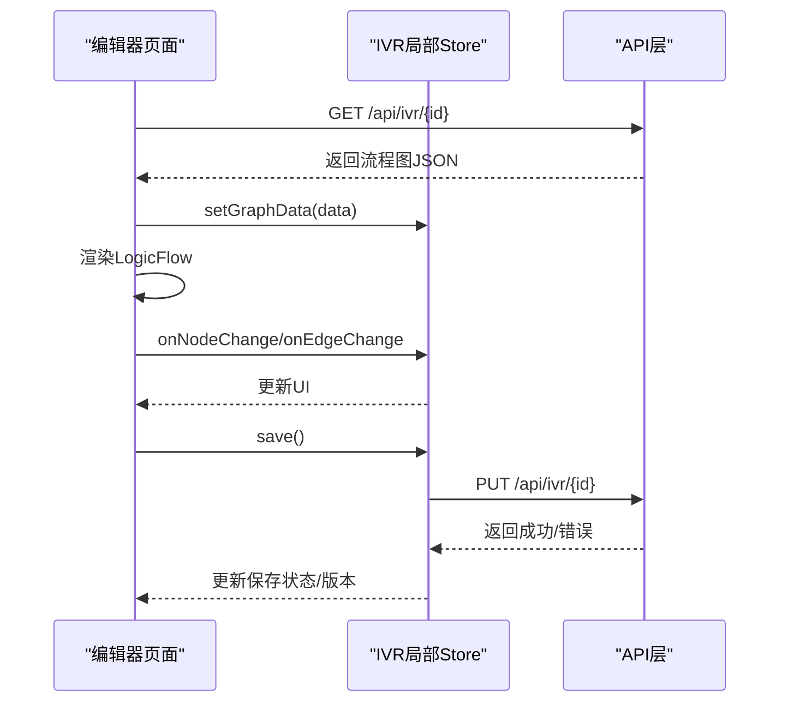
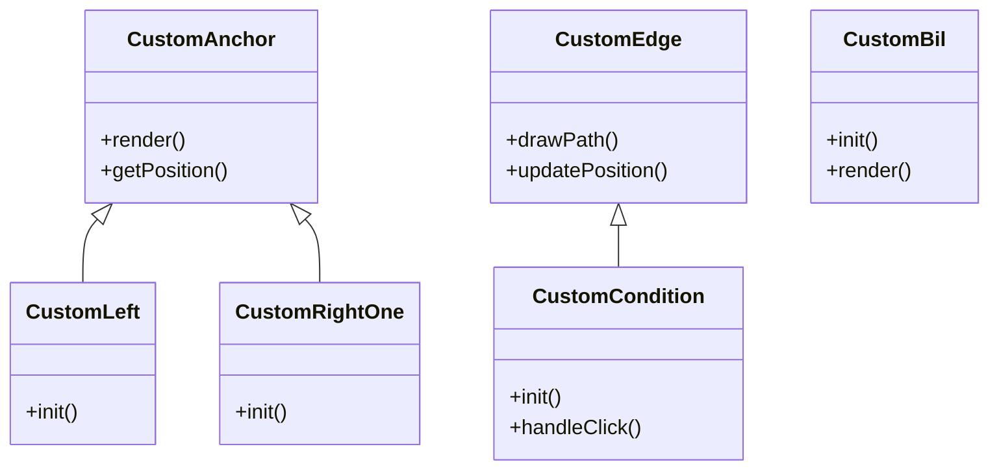
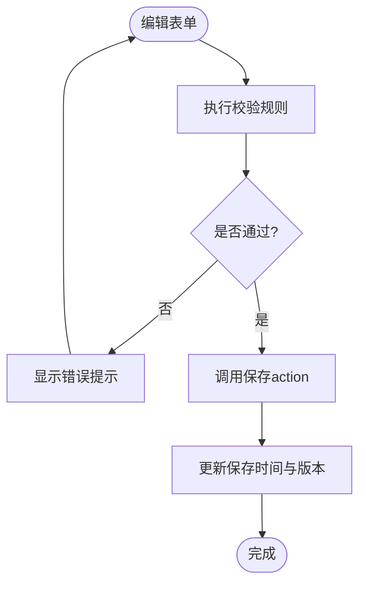
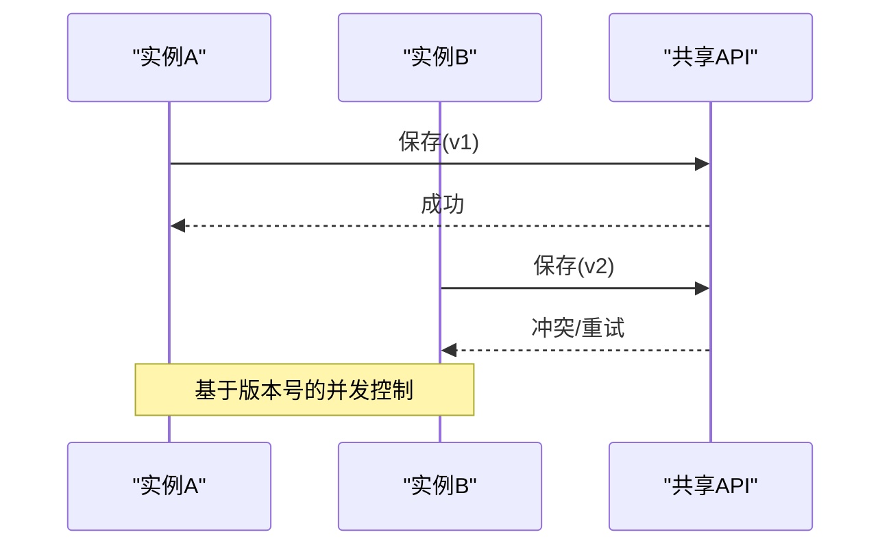
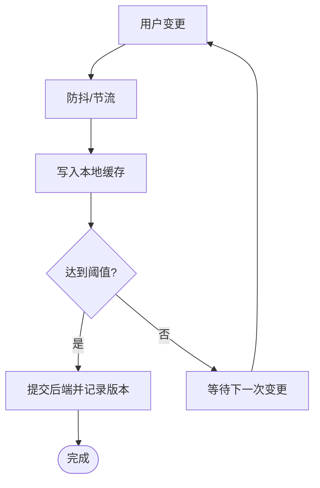
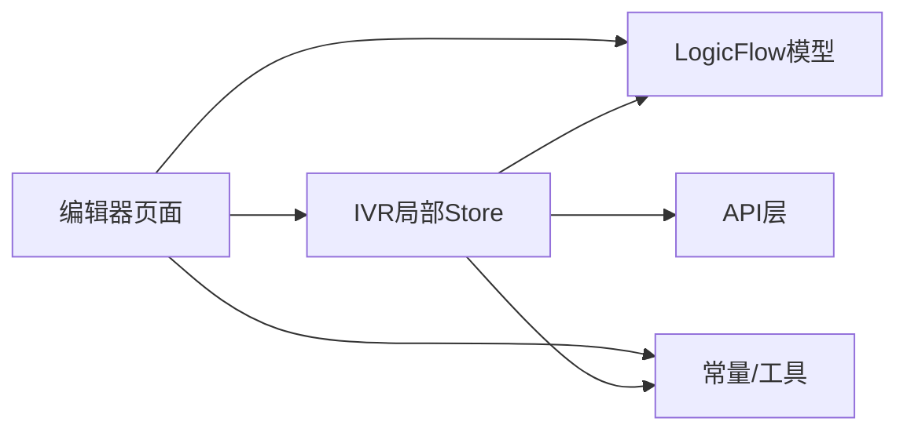

# 状态管理机制

<cite>
**本文引用的文件**
- [store/index.ts](file://yudao-ui-admin-vue3/src/store/index.ts)
- [store/modules/app.ts](file://yudao-ui-admin-vue3/src/store/modules/app.ts)
- [store/modules/permission.ts](file://yudao-ui-admin-vue3/src/store/modules/permission.ts)
- [store/modules/user.ts](file://yudao-ui-admin-vue3/src/store/modules/user.ts)
- [store/modules/tagsView.ts](file://yudao-ui-admin-vue3/src/store/modules/tagsView.ts)
- [store/modules/dict.ts](file://yudao-ui-admin-vue3/src/store/modules/dict.ts)
- [store/modules/locale.ts](file://yudao-ui-admin-vue3/src/store/modules/locale.ts)
- [store/modules/lock.ts](file://yudao-ui-admin-vue3/src/store/modules/lock.ts)
- [store/modules/bpm/simpleWorkflow.ts](file://yudao-ui-admin-vue3/src/store/modules/bpm/simpleWorkflow.ts)
- [views/cc/ivr/ivrEdit.vue](file://yudao-ui-admin-vue3/src/views/cc/ivr/ivrEdit.vue)
- [views/cc/ivr/store/ivr.ts](file://yudao-ui-admin-vue3/src/views/cc/ivr/store/ivr.ts)
- [views/cc/ivr/node/model/customEdge.ts](file://yudao-ui-admin-vue3/src/views/cc/ivr/node/model/customEdge.ts)
- [views/cc/ivr/node/model/customAnchor.ts](file://yudao-ui-admin-vue3/src/views/cc/ivr/node/model/customAnchor.ts)
- [views/cc/ivr/node/model/customCondition.ts](file://yudao-ui-admin-vue3/src/views/cc/ivr/node/model/customCondition.ts)
- [views/cc/ivr/node/model/customBil.ts](file://yudao-ui-admin-vue3/src/views/cc/ivr/node/model/customBil.ts)
- [views/cc/ivr/node/model/customLeft.ts](file://yudao-ui-admin-vue3/src/views/cc/ivr/node/model/customLeft.ts)
- [views/cc/ivr/node/model/customRightOne.ts](file://yudao-ui-admin-vue3/src/views/cc/ivr/node/model/customRightOne.ts)
- [views/cc/ivr/node/playback.vue](file://yudao-ui-admin-vue3/src/views/cc/ivr/node/playback.vue)
- [views/cc/ivr/node/receive.vue](file://yudao-ui-admin-vue3/src/views/cc/ivr/node/receive.vue)
- [views/cc/ivr/node/start.vue](file://yudao-ui-admin-vue3/src/views/cc/ivr/node/start.vue)
- [views/cc/ivr/node/end.vue](file://yudao-ui-admin-vue3/src/views/cc/ivr/node/end.vue)
- [views/cc/ivr/node/transfer.vue](file://yudao-ui-admin-vue3/src/views/cc/ivr/node/transfer.vue)
- [views/cc/ivr/node/method.vue](file://yudao-ui-admin-vue3/src/views/cc/ivr/node/method.vue)
- [views/cc/ivr/node/condition.vue](file://yudao-ui-admin-vue3/src/views/cc/ivr/node/condition.vue)
- [views/cc/ivr/utils/node.ts](file://yudao-ui-admin-vue3/src/views/cc/ivr/utils/node.ts)
- [views/cc/ivr/consts/ivrEnum.ts](file://yudao-ui-admin-vue3/src/views/cc/ivr/consts/ivrEnum.ts)
- [views/cc/ivr/consts/conditionOperator.ts](file://yudao-ui-admin-vue3/src/views/cc/ivr/consts/conditionOperator.ts)
- [views/cc/ivr/consts/nodeOutputs.ts](file://yudao-ui-admin-vue3/src/views/cc/ivr/consts/nodeOutputs.ts)
</cite>

## 目录
1. [简介](#简介)
2. [项目结构](#项目结构)
3. [核心组件](#核心组件)
4. [架构总览](#架构总览)
5. [详细组件分析](#详细组件分析)
6. [依赖分析](#依赖分析)
7. [性能考虑](#性能考虑)
8. [故障排查指南](#故障排查指南)
9. [结论](#结论)
10. [附录](#附录)

## 简介
本文件面向IVR流程编辑器的状态管理机制，围绕Pinia store设计、LogicFlow实例生命周期管理、流程图数据同步（前端状态与后端CRUD）、节点列表状态管理、表单状态管理、多实例隔离与并发控制、以及状态持久化方案进行系统化说明。文档以仓库中实际代码为依据，提供可追溯的源码路径与图示，帮助读者快速理解并扩展编辑器状态体系。

## 项目结构
本项目采用模块化组织：
- 全局状态：位于 src/store/modules，使用Pinia定义应用级状态（如用户、权限、标签页、字典、国际化、锁屏等）。
- IVR编辑器：位于 views/cc/ivr，包含编辑器页面、节点模型、常量配置、工具函数及局部store。
- LogicFlow集成：通过自定义节点模型（custom*）和边模型（customEdge）实现可视化流程编辑能力。
- API层：按业务模块划分在 src/api 下，供store或页面调用后端接口完成数据持久化。

图表来源
- [store/index.ts](file://yudao-ui-admin-vue3/src/store/index.ts)
- [views/cc/ivr/ivrEdit.vue](file://yudao-ui-admin-vue3/src/views/cc/ivr/ivrEdit.vue)
- [views/cc/ivr/store/ivr.ts](file://yudao-ui-admin-vue3/src/views/cc/ivr/store/ivr.ts)
- [views/cc/ivr/node/model/customEdge.ts](file://yudao-ui-admin-vue3/src/views/cc/ivr/node/model/customEdge.ts)
- [views/cc/ivr/node/model/customAnchor.ts](file://yudao-ui-admin-vue3/src/views/cc/ivr/node/model/customAnchor.ts)

章节来源
- [store/index.ts](file://yudao-ui-admin-vue3/src/store/index.ts)
- [views/cc/ivr/ivrEdit.vue](file://yudao-ui-admin-vue3/src/views/cc/ivr/ivrEdit.vue)

## 核心组件
- Pinia Store基座：通过store/index.ts注册全局store；各模块在modules下独立维护状态与actions。
- IVR局部Store：位于views/cc/ivr/store/ivr.ts，承载编辑器运行时状态（如图形数据、选中项、表单元信息等），并提供action更新。
- LogicFlow模型：customAnchor、customEdge、customCondition、customBil、customLeft、customRightOne等，封装节点与边的渲染与交互逻辑。
- 节点组件：start、end、receive、playback、transfer、method、condition等，负责节点属性面板与事件处理。
- 常量与工具：ivrEnum、conditionOperator、nodeOutputs、utils/node.ts，统一枚举、操作符与节点辅助方法。

章节来源
- [store/modules/app.ts](file://yudao-ui-admin-vue3/src/store/modules/app.ts)
- [store/modules/permission.ts](file://yudao-ui-admin-vue3/src/store/modules/permission.ts)
- [store/modules/user.ts](file://yudao-ui-admin-vue3/src/store/modules/user.ts)
- [store/modules/tagsView.ts](file://yudao-ui-admin-vue3/src/store/modules/tagsView.ts)
- [store/modules/dict.ts](file://yudao-ui-admin-vue3/src/store/modules/dict.ts)
- [store/modules/locale.ts](file://yudao-ui-admin-vue3/src/store/modules/locale.ts)
- [store/modules/lock.ts](file://yudao-ui-admin-vue3/src/store/modules/lock.ts)
- [store/modules/bpm/simpleWorkflow.ts](file://yudao-ui-admin-vue3/src/store/modules/bpm/simpleWorkflow.ts)
- [views/cc/ivr/store/ivr.ts](file://yudao-ui-admin-vue3/src/views/cc/ivr/store/ivr.ts)
- [views/cc/ivr/node/model/customEdge.ts](file://yudao-ui-admin-vue3/src/views/cc/ivr/node/model/customEdge.ts)
- [views/cc/ivr/node/model/customAnchor.ts](file://yudao-ui-admin-vue3/src/views/cc/ivr/node/model/customAnchor.ts)
- [views/cc/ivr/node/model/customCondition.ts](file://yudao-ui-admin-vue3/src/views/cc/ivr/node/model/customCondition.ts)
- [views/cc/ivr/node/model/customBil.ts](file://yudao-ui-admin-vue3/src/views/cc/ivr/node/model/customBil.ts)
- [views/cc/ivr/node/model/customLeft.ts](file://yudao-ui-admin-vue3/src/views/cc/ivr/node/model/customLeft.ts)
- [views/cc/ivr/node/model/customRightOne.ts](file://yudao-ui-admin-vue3/src/views/cc/ivr/node/model/customRightOne.ts)
- [views/cc/ivr/node/playback.vue](file://yudao-ui-admin-vue3/src/views/cc/ivr/node/playback.vue)
- [views/cc/ivr/node/receive.vue](file://yudao-ui-admin-vue3/src/views/cc/ivr/node/receive.vue)
- [views/cc/ivr/node/start.vue](file://yudao-ui-admin-vue3/src/views/cc/ivr/node/start.vue)
- [views/cc/ivr/node/end.vue](file://yudao-ui-admin-vue3/src/views/cc/ivr/node/end.vue)
- [views/cc/ivr/node/transfer.vue](file://yudao-ui-admin-vue3/src/views/cc/ivr/node/transfer.vue)
- [views/cc/ivr/node/method.vue](file://yudao-ui-admin-vue3/src/views/cc/ivr/node/method.vue)
- [views/cc/ivr/node/condition.vue](file://yudao-ui-admin-vue3/src/views/cc/ivr/node/condition.vue)
- [views/cc/ivr/utils/node.ts](file://yudao-ui-admin-vue3/src/views/cc/ivr/utils/node.ts)
- [views/cc/ivr/consts/ivrEnum.ts](file://yudao-ui-admin-vue3/src/views/cc/ivr/consts/ivrEnum.ts)
- [views/cc/ivr/consts/conditionOperator.ts](file://yudao-ui-admin-vue3/src/views/cc/ivr/consts/conditionOperator.ts)
- [views/cc/ivr/consts/nodeOutputs.ts](file://yudao-ui-admin-vue3/src/views/cc/ivr/consts/nodeOutputs.ts)

## 架构总览
IVR编辑器状态流由“页面-局部store-LogicFlow-节点组件-常量/工具-API”构成闭环。页面初始化时创建LogicFlow实例并挂载到容器；用户交互触发节点/边变更，LogicFlow回调将变更写入局部store；store通过action协调图形数据、表单状态与校验结果；保存时将图形数据序列化后提交至后端，并落盘本地缓存与版本记录。

图表来源
- [views/cc/ivr/ivrEdit.vue](file://yudao-ui-admin-vue3/src/views/cc/ivr/ivrEdit.vue)
- [views/cc/ivr/store/ivr.ts](file://yudao-ui-admin-vue3/src/views/cc/ivr/store/ivr.ts)
- [views/cc/ivr/node/model/customEdge.ts](file://yudao-ui-admin-vue3/src/views/cc/ivr/node/model/customEdge.ts)
- [views/cc/ivr/node/model/customAnchor.ts](file://yudao-ui-admin-vue3/src/views/cc/ivr/node/model/customAnchor.ts)

## 详细组件分析

### Pinia Store设计架构
- 状态定义：每个store通过defineStore声明state，集中管理相关字段（例如工作流、权限、用户信息、标签页、字典、国际化、锁屏等）。
- Getter计算属性：可在store内定义computed派生状态，用于组合多个state字段或对外暴露只读视图。
- Action方法：封装对state的修改逻辑，保证状态变更的可追踪性与一致性。
- 多模块组织：全局store集中在store/modules，IVR编辑器拥有独立store以隔离运行时状态。

图表来源
- [store/modules/app.ts](file://yudao-ui-admin-vue3/src/store/modules/app.ts)
- [store/modules/permission.ts](file://yudao-ui-admin-vue3/src/store/modules/permission.ts)
- [store/modules/user.ts](file://yudao-ui-admin-vue3/src/store/modules/user.ts)
- [store/modules/tagsView.ts](file://yudao-ui-admin-vue3/src/store/modules/tagsView.ts)
- [store/modules/dict.ts](file://yudao-ui-admin-vue3/src/store/modules/dict.ts)
- [store/modules/locale.ts](file://yudao-ui-admin-vue3/src/store/modules/locale.ts)
- [store/modules/lock.ts](file://yudao-ui-admin-vue3/src/store/modules/lock.ts)
- [store/modules/bpm/simpleWorkflow.ts](file://yudao-ui-admin-vue3/src/store/modules/bpm/simpleWorkflow.ts)

章节来源
- [store/modules/app.ts](file://yudao-ui-admin-vue3/src/store/modules/app.ts)
- [store/modules/permission.ts](file://yudao-ui-admin-vue3/src/store/modules/permission.ts)
- [store/modules/user.ts](file://yudao-ui-admin-vue3/src/store/modules/user.ts)
- [store/modules/tagsView.ts](file://yudao-ui-admin-vue3/src/store/modules/tagsView.ts)
- [store/modules/dict.ts](file://yudao-ui-admin-vue3/src/store/modules/dict.ts)
- [store/modules/locale.ts](file://yudao-ui-admin-vue3/src/store/modules/locale.ts)
- [store/modules/lock.ts](file://yudao-ui-admin-vue3/src/store/modules/lock.ts)
- [store/modules/bpm/simpleWorkflow.ts](file://yudao-ui-admin-vue3/src/store/modules/bpm/simpleWorkflow.ts)

### LogicFlow实例生命周期管理
- 实例创建：在编辑器页面初始化时创建LogicFlow实例，并绑定容器元素。
- 存储策略：实例引用保存在页面级变量或store中，便于后续访问与销毁。
- 销毁策略：页面卸载或切换流程时，调用销毁方法释放事件监听与内存占用，避免泄漏。
- 事件订阅：通过on('node-mouseup'等)监听节点/边变更，回调中同步到store。

图表来源
- [views/cc/ivr/ivrEdit.vue](file://yudao-ui-admin-vue3/src/views/cc/ivr/ivrEdit.vue)

章节来源
- [views/cc/ivr/ivrEdit.vue](file://yudao-ui-admin-vue3/src/views/cc/ivr/ivrEdit.vue)

### 流程图数据同步机制（前端状态与后端CRUD）
- 读取：页面加载时从后端获取流程图数据，反序列化为LogicFlow图数据格式，写入store并渲染。
- 变更：用户编辑触发LogicFlow回调，store合并变更并更新响应式视图。
- 保存：调用API提交图数据，成功后更新持久化标记与版本信息。
- 冲突处理：基于版本号或时间戳进行乐观/悲观锁策略，防止并发覆盖。

图表来源
- [views/cc/ivr/ivrEdit.vue](file://yudao-ui-admin-vue3/src/views/cc/ivr/ivrEdit.vue)
- [views/cc/ivr/store/ivr.ts](file://yudao-ui-admin-vue3/src/views/cc/ivr/store/ivr.ts)

章节来源
- [views/cc/ivr/ivrEdit.vue](file://yudao-ui-admin-vue3/src/views/cc/ivr/ivrEdit.vue)
- [views/cc/ivr/store/ivr.ts](file://yudao-ui-admin-vue3/src/views/cc/ivr/store/ivr.ts)

### 节点列表的状态管理
- 节点类型注册：通过LogicFlow的registerNode/registerEdge注册自定义节点与边，关联对应model文件。
- 属性配置：节点组件（如playback、receive、start、end、transfer、method、condition）提供属性面板，修改后通过store更新节点data。
- 动态更新：支持新增/删除/复制节点，联动边连接关系与条件分支。

图表来源
- [views/cc/ivr/node/model/customAnchor.ts](file://yudao-ui-admin-vue3/src/views/cc/ivr/node/model/customAnchor.ts)
- [views/cc/ivr/node/model/customEdge.ts](file://yudao-ui-admin-vue3/src/views/cc/ivr/node/model/customEdge.ts)
- [views/cc/ivr/node/model/customCondition.ts](file://yudao-ui-admin-vue3/src/views/cc/ivr/node/model/customCondition.ts)
- [views/cc/ivr/node/model/customBil.ts](file://yudao-ui-admin-vue3/src/views/cc/ivr/node/model/customBil.ts)
- [views/cc/ivr/node/model/customLeft.ts](file://yudao-ui-admin-vue3/src/views/cc/ivr/node/model/customLeft.ts)
- [views/cc/ivr/node/model/customRightOne.ts](file://yudao-ui-admin-vue3/src/views/cc/ivr/node/model/customRightOne.ts)

章节来源
- [views/cc/ivr/node/model/customAnchor.ts](file://yudao-ui-admin-vue3/src/views/cc/ivr/node/model/customAnchor.ts)
- [views/cc/ivr/node/model/customEdge.ts](file://yudao-ui-admin-vue3/src/views/cc/ivr/node/model/customEdge.ts)
- [views/cc/ivr/node/model/customCondition.ts](file://yudao-ui-admin-vue3/src/views/cc/ivr/node/model/customCondition.ts)
- [views/cc/ivr/node/model/customBil.ts](file://yudao-ui-admin-vue3/src/views/cc/ivr/node/model/customBil.ts)
- [views/cc/ivr/node/model/customLeft.ts](file://yudao-ui-admin-vue3/src/views/cc/ivr/node/model/customLeft.ts)
- [views/cc/ivr/node/model/customRightOne.ts](file://yudao-ui-admin-vue3/src/views/cc/ivr/node/model/customRightOne.ts)
- [views/cc/ivr/node/playback.vue](file://yudao-ui-admin-vue3/src/views/cc/ivr/node/playback.vue)
- [views/cc/ivr/node/receive.vue](file://yudao-ui-admin-vue3/src/views/cc/ivr/node/receive.vue)
- [views/cc/ivr/node/start.vue](file://yudao-ui-admin-vue3/src/views/cc/ivr/node/start.vue)
- [views/cc/ivr/node/end.vue](file://yudao-ui-admin-vue3/src/views/cc/ivr/node/end.vue)
- [views/cc/ivr/node/transfer.vue](file://yudao-ui-admin-vue3/src/views/cc/ivr/node/transfer.vue)
- [views/cc/ivr/node/method.vue](file://yudao-ui-admin-vue3/src/views/cc/ivr/node/method.vue)
- [views/cc/ivr/node/condition.vue](file://yudao-ui-admin-vue3/src/views/cc/ivr/node/condition.vue)

### 表单状态管理（流程名称、保存时间、验证状态）
- 流程名称：作为store中的表单字段，支持输入校验与提示。
- 保存时间：在每次成功保存后更新，用于显示最近保存时间与版本标识。
- 数据验证：在保存前执行规则校验（必填、格式、业务约束），失败则阻止提交并展示错误。

图表来源
- [views/cc/ivr/store/ivr.ts](file://yudao-ui-admin-vue3/src/views/cc/ivr/store/ivr.ts)

章节来源
- [views/cc/ivr/store/ivr.ts](file://yudao-ui-admin-vue3/src/views/cc/ivr/store/ivr.ts)

### 多实例场景下的状态隔离与并发控制
- 状态隔离：每个编辑器实例持有独立的LogicFlow实例与store副本，避免跨实例污染。
- 并发控制：保存时使用版本号或时间戳进行冲突检测；必要时采用锁机制确保串行写入。
- 资源回收：实例切换或页面关闭时及时销毁，释放内存与事件监听。

图表来源
- [views/cc/ivr/store/ivr.ts](file://yudao-ui-admin-vue3/src/views/cc/ivr/store/ivr.ts)

章节来源
- [views/cc/ivr/store/ivr.ts](file://yudao-ui-admin-vue3/src/views/cc/ivr/store/ivr.ts)

### 状态持久化方案（本地缓存、自动保存、版本管理）
- 本地缓存：在浏览器端缓存当前编辑内容，支持刷新恢复与草稿恢复。
- 自动保存：定时或增量变更触发自动保存，减少数据丢失风险。
- 版本管理：每次保存生成新版本，支持回滚与对比。

图表来源
- [views/cc/ivr/store/ivr.ts](file://yudao-ui-admin-vue3/src/views/cc/ivr/store/ivr.ts)

章节来源
- [views/cc/ivr/store/ivr.ts](file://yudao-ui-admin-vue3/src/views/cc/ivr/store/ivr.ts)

## 依赖分析
- 模块耦合：编辑器页面依赖局部store与LogicFlow模型；store依赖常量与工具；节点组件依赖模型与常量。
- 外部依赖：LogicFlow库、Element Plus UI、Axios HTTP客户端。
- 潜在循环：应避免store与页面之间直接相互import导致循环依赖，建议通过工具函数或事件总线解耦。

图表来源
- [views/cc/ivr/ivrEdit.vue](file://yudao-ui-admin-vue3/src/views/cc/ivr/ivrEdit.vue)
- [views/cc/ivr/store/ivr.ts](file://yudao-ui-admin-vue3/src/views/cc/ivr/store/ivr.ts)
- [views/cc/ivr/node/model/customEdge.ts](file://yudao-ui-admin-vue3/src/views/cc/ivr/node/model/customEdge.ts)
- [views/cc/ivr/consts/ivrEnum.ts](file://yudao-ui-admin-vue3/src/views/cc/ivr/consts/ivrEnum.ts)
- [views/cc/ivr/utils/node.ts](file://yudao-ui-admin-vue3/src/views/cc/ivr/utils/node.ts)

章节来源
- [views/cc/ivr/ivrEdit.vue](file://yudao-ui-admin-vue3/src/views/cc/ivr/ivrEdit.vue)
- [views/cc/ivr/store/ivr.ts](file://yudao-ui-admin-vue3/src/views/cc/ivr/store/ivr.ts)
- [views/cc/ivr/node/model/customEdge.ts](file://yudao-ui-admin-vue3/src/views/cc/ivr/node/model/customEdge.ts)
- [views/cc/ivr/consts/ivrEnum.ts](file://yudao-ui-admin-vue3/src/views/cc/ivr/consts/ivrEnum.ts)
- [views/cc/ivr/utils/node.ts](file://yudao-ui-admin-vue3/src/views/cc/ivr/utils/node.ts)

## 性能考虑
- 事件节流：对高频节点/边变更进行防抖/节流，降低store更新频率。
- 增量更新：仅更新变更节点与边，避免全量重绘。
- 懒加载：大型流程图按需加载节点与边数据。
- 内存管理：及时销毁LogicFlow实例与事件监听，避免内存泄漏。

## 故障排查指南
- 无法渲染：检查LogicFlow容器尺寸与初始化时机，确认模型已正确注册。
- 数据不同步：核对store的setGraphData与LogicFlow回调是否一致，确保双向绑定。
- 保存失败：查看API返回码与错误信息，检查网络与权限。
- 并发冲突：启用版本控制，出现冲突时提示用户选择保留策略。
- 节点属性不生效：确认节点组件是否正确更新节点data，并在store中持久化。

章节来源
- [views/cc/ivr/store/ivr.ts](file://yudao-ui-admin-vue3/src/views/cc/ivr/store/ivr.ts)
- [views/cc/ivr/node/model/customEdge.ts](file://yudao-ui-admin-vue3/src/views/cc/ivr/node/model/customEdge.ts)
- [views/cc/ivr/node/model/customAnchor.ts](file://yudao-ui-admin-vue3/src/views/cc/ivr/node/model/customAnchor.ts)

## 结论
本状态管理机制以Pinia为核心，结合LogicFlow的可视化能力，实现了IVR流程编辑器的完整状态闭环。通过清晰的职责划分、严格的变更控制与完善的持久化策略，保障了编辑体验与数据一致性。建议在后续迭代中持续优化性能与并发控制，完善错误处理与监控指标。

## 附录
- 关键文件路径参考：
  - 全局store：[store/modules/*](file://yudao-ui-admin-vue3/src/store/modules)
  - IVR编辑器：[views/cc/ivr](file://yudao-ui-admin-vue3/src/views/cc/ivr)
  - LogicFlow模型：[views/cc/ivr/node/model](file://yudao-ui-admin-vue3/src/views/cc/ivr/node/model)
  - 常量与工具：[views/cc/ivr/consts](file://yudao-ui-admin-vue3/src/views/cc/ivr/consts), [views/cc/ivr/utils](file://yudao-ui-admin-vue3/src/views/cc/ivr/utils)