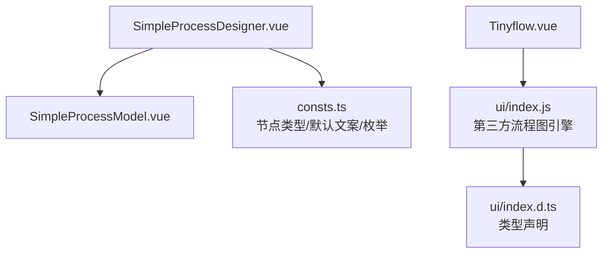
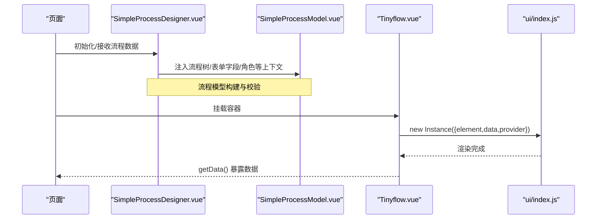
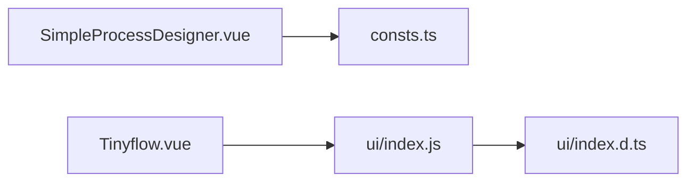

# 画布渲染引擎

<cite>
**本文引用的文件**
- [SimpleProcessDesigner.vue](file://yudao-ui-admin-vue3/src/components/SimpleProcessDesignerV2/src/SimpleProcessDesigner.vue)
- [index.ts](file://yudao-ui-admin-vue3/src/components/SimpleProcessDesignerV2/src/index.ts)
- [consts.ts](file://yudao-ui-admin-vue3/src/components/SimpleProcessDesignerV2/src/consts.ts)
- [Tinyflow.vue](file://yudao-ui-admin-vue3/src/components/Tinyflow/Tinyflow.vue)
- [ui/index.js](file://yudao-ui-admin-vue3/src/components/Tinyflow/ui/index.js)
- [ui/index.d.ts](file://yudao-ui-admin-vue3/src/components/Tinyflow/ui/index.d.ts)
</cite>

## 目录
1. [简介](#简介)
2. [项目结构](#项目结构)
3. [核心组件](#核心组件)
4. [架构总览](#架构总览)
5. [详细组件分析](#详细组件分析)
6. [依赖关系分析](#依赖关系分析)
7. [性能考虑](#性能考虑)
8. [故障排查指南](#故障排查指南)
9. [结论](#结论)
10. [附录](#附录)

## 简介
本文件面向IVR流程编辑器的画布渲染引擎，聚焦于LogicFlow核心库的集成与配置、画布初始化、网格与背景样式、缩放平移机制、节点渲染生命周期、自定义视图组件CustomNodeView的实现原理、画布事件系统（鼠标/键盘/触摸）以及性能优化方案（虚拟滚动、懒加载、内存管理）。文档基于仓库中现有前端工程中的流程图编辑器实现进行梳理，并结合LogicFlow官方能力给出可落地的集成与优化建议。

## 项目结构
当前工程中与流程图/画布相关的代码主要分布在两个位置：
- SimpleProcessDesignerV2：自研的流程设计器封装，负责流程模型数据、节点类型定义、校验与保存等上层业务逻辑。
- Tinyflow：一个轻量级流程图容器组件，内部通过引入第三方ui包（ui/index.js）实例化并挂载到DOM，提供基础的数据获取与销毁能力。

图表来源
- [SimpleProcessDesigner.vue:1-234](file://yudao-ui-admin-vue3/src/components/SimpleProcessDesignerV2/src/SimpleProcessDesigner.vue#L1-L234)
- [consts.ts:1-911](file://yudao-ui-admin-vue3/src/components/SimpleProcessDesignerV2/src/consts.ts#L1-L911)
- [Tinyflow.vue:1-64](file://yudao-ui-admin-vue3/src/components/Tinyflow/Tinyflow.vue#L1-L64)
- [ui/index.js](file://yudao-ui-admin-vue3/src/components/Tinyflow/ui/index.js)
- [ui/index.d.ts](file://yudao-ui-admin-vue3/src/components/Tinyflow/ui/index.d.ts)

章节来源
- [SimpleProcessDesigner.vue:1-234](file://yudao-ui-admin-vue3/src/components/SimpleProcessDesignerV2/src/SimpleProcessDesigner.vue#L1-L234)
- [index.ts:1-6](file://yudao-ui-admin-vue3/src/components/SimpleProcessDesignerV2/src/index.ts#L1-L6)
- [Tinyflow.vue:1-64](file://yudao-ui-admin-vue3/src/components/Tinyflow/Tinyflow.vue#L1-L64)

## 核心组件
- SimpleProcessDesigner.vue：流程设计器入口，负责流程树构建、数据注入、保存回调与错误提示；通过provide/inject向子组件传递上下文数据。
- consts.ts：集中定义节点类型、节点ID、节点数据结构、审批策略、条件规则、触发器等常量与枚举，是流程模型的“契约”。
- Tinyflow.vue：将第三方流程图引擎（ui/index.js）封装为Vue组件，完成实例创建、数据绑定与生命周期清理，并提供getData方法暴露给父组件。

章节来源
- [SimpleProcessDesigner.vue:1-234](file://yudao-ui-admin-vue3/src/components/SimpleProcessDesignerV2/src/SimpleProcessDesigner.vue#L1-L234)
- [consts.ts:1-911](file://yudao-ui-admin-vue3/src/components/SimpleProcessDesignerV2/src/consts.ts#L1-L911)
- [Tinyflow.vue:1-64](file://yudao-ui-admin-vue3/src/components/Tinyflow/Tinyflow.vue#L1-L64)

## 架构总览
下图展示了从页面到画布渲染的整体调用链：Vue组件负责状态与交互，第三方流程图引擎负责画布渲染与交互，SimpleProcessDesignerV2负责流程模型与业务校验。

图表来源
- [SimpleProcessDesigner.vue:1-234](file://yudao-ui-admin-vue3/src/components/SimpleProcessDesignerV2/src/SimpleProcessDesigner.vue#L1-L234)
- [Tinyflow.vue:1-64](file://yudao-ui-admin-vue3/src/components/Tinyflow/Tinyflow.vue#L1-L64)
- [ui/index.js](file://yudao-ui-admin-vue3/src/components/Tinyflow/ui/index.js)

## 详细组件分析

### LogicFlow集成与配置（画布初始化、网格、背景、样式）
- 画布初始化
  - 在Tinyflow.vue中，通过new第三方引擎实例并传入element、data、provider等参数完成初始化。该模式与LogicFlow的初始化方式一致，可在同一容器内复用。
  - 建议在初始化时设置：
    - grid：开启网格对齐，提升连线与节点布局精度。
    - background：设置背景色或背景图，增强视觉层次。
    - style：统一主题色、字体、边框等全局样式。
- 网格系统与背景
  - 网格有助于拖拽对齐、自动吸附与批量排版；背景可用于区分区域或展示参考线。
  - 若使用LogicFlow，可通过其配置项启用网格与背景，并在主题文件中覆盖默认样式。
- 样式配置
  - 建议将主题变量抽离至SCSS/CSS模块，便于多套主题切换；对节点、边、锚点、工具栏等进行统一风格控制。

章节来源
- [Tinyflow.vue:1-64](file://yudao-ui-admin-vue3/src/components/Tinyflow/Tinyflow.vue#L1-L64)
- [ui/index.js](file://yudao-ui-admin-vue3/src/components/Tinyflow/ui/index.js)

### 缩放与平移机制（transform事件、防抖、性能调优）
- transform事件处理
  - 监听画布的transform变化（缩放/平移），用于同步侧边面板、缩略图、坐标计算等。
  - 在LogicFlow中可通过事件总线订阅相关事件，避免直接操作DOM。
- 防抖优化
  - 对高频事件（如缩放、拖拽）进行防抖/节流，减少重排与重绘开销。
  - 对于需要精确坐标的场景，可使用requestAnimationFrame合并更新。
- 性能调优
  - 限制单次渲染节点数量，结合虚拟滚动按需渲染可视区节点。
  - 使用Canvas/WebGL渲染大量连线与节点，降低DOM压力。
  - 对复杂节点采用Web Component或Shadow DOM隔离样式与事件，减少全局污染。

章节来源
- [Tinyflow.vue:1-64](file://yudao-ui-admin-vue3/src/components/Tinyflow/Tinyflow.vue#L1-L64)

### 节点渲染生命周期（添加、删除、更新时的DOM操作与尺寸同步）
- 节点添加
  - 在模型层新增节点后，触发视图层增量渲染；优先复用已存在节点实例，避免全量重建。
  - 尺寸同步：首次渲染后读取节点实际尺寸，写入模型以便连线计算与布局算法。
- 节点删除
  - 先断开所有关联边，再移除节点DOM；确保事件解绑与定时器清理，防止内存泄漏。
- 节点更新
  - 最小化变更：仅更新变化的属性；对文本、图标等局部元素进行细粒度更新。
  - 尺寸变化：当内容高度变化时，重新计算连线锚点与相邻节点位置，必要时触发局部重排。

章节来源
- [consts.ts:1-911](file://yudao-ui-admin-vue3/src/components/SimpleProcessDesignerV2/src/consts.ts#L1-L911)
- [SimpleProcessDesigner.vue:1-234](file://yudao-ui-admin-vue3/src/components/SimpleProcessDesignerV2/src/SimpleProcessDesigner.vue#L1-L234)

### 自定义视图组件CustomNodeView（Vue组件与LogicFlow模型绑定）
- 绑定机制
  - 将Vue组件注册为LogicFlow的自定义节点视图，通过props接收节点数据，双向绑定更新。
  - 使用LogicFlow提供的API（如getNodeData、updateNodeData）保证视图与模型一致性。
- 生命周期
  - mounted：初始化内部状态、绑定本地事件、测量初始尺寸。
  - updated：响应数据变化，执行最小化DOM更新。
  - beforeDestroy：解绑事件、清理定时器与缓存。
- 交互扩展
  - 支持点击、双击、右键菜单、快捷键等；通过事件委托与防抖提升体验。
  - 对复杂交互建议使用Web Worker或异步任务，避免阻塞主线程。

章节来源
- [consts.ts:1-911](file://yudao-ui-admin-vue3/src/components/SimpleProcessDesignerV2/src/consts.ts#L1-L911)
- [SimpleProcessDesigner.vue:1-234](file://yudao-ui-admin-vue3/src/components/SimpleProcessDesignerV2/src/SimpleProcessDesigner.vue#L1-L234)

### 画布事件系统（鼠标、键盘、触摸的统一处理）
- 事件分类
  - 鼠标：click、dblclick、contextmenu、mousedown/mousemove/mouseup、wheel（缩放）。
  - 键盘：keydown/keyup（撤销、复制、删除、快捷键）。
  - 触摸：touchstart/touchmove/touchend（移动端缩放与拖拽）。
- 统一处理策略
  - 在画布根容器上统一捕获事件，按目标元素路由到对应处理器。
  - 对高频事件进行节流/防抖；对组合键进行状态机管理。
  - 对移动端手势进行归一化处理，屏蔽浏览器默认行为以避免冲突。
- 与LogicFlow集成
  - 通过LogicFlow的事件系统订阅/发布事件，避免直接操作DOM。
  - 对自定义节点内的事件进行冒泡控制，防止与画布事件冲突。

章节来源
- [Tinyflow.vue:1-64](file://yudao-ui-admin-vue3/src/components/Tinyflow/Tinyflow.vue#L1-L64)

### 流程模型与校验（SimpleProcessDesignerV2）
- 模型结构
  - 以树形结构表示流程，包含节点类型、名称、显示文案、子节点、条件分支等。
  - 通过consts.ts集中定义节点类型、默认文案、审批策略、条件规则等，保证前后端一致。
- 校验与保存
  - 在保存前遍历节点树进行完整性校验，缺失必填信息时弹窗提示并阻止保存。
  - 保存成功后通过emit向上抛出结果，供父组件持久化。

章节来源
- [SimpleProcessDesigner.vue:1-234](file://yudao-ui-admin-vue3/src/components/SimpleProcessDesignerV2/src/SimpleProcessDesigner.vue#L1-L234)
- [consts.ts:1-911](file://yudao-ui-admin-vue3/src/components/SimpleProcessDesignerV2/src/consts.ts#L1-L911)

## 依赖关系分析
- SimpleProcessDesignerV2依赖consts.ts定义的模型与枚举，并通过provide/inject向子组件传递上下文。
- Tinyflow依赖ui/index.js提供的流程图引擎，封装为Vue组件对外暴露getData接口。
- 两者职责清晰：前者负责业务模型与校验，后者负责画布渲染与交互。

图表来源
- [SimpleProcessDesigner.vue:1-234](file://yudao-ui-admin-vue3/src/components/SimpleProcessDesignerV2/src/SimpleProcessDesigner.vue#L1-L234)
- [consts.ts:1-911](file://yudao-ui-admin-vue3/src/components/SimpleProcessDesignerV2/src/consts.ts#L1-L911)
- [Tinyflow.vue:1-64](file://yudao-ui-admin-vue3/src/components/Tinyflow/Tinyflow.vue#L1-L64)
- [ui/index.js](file://yudao-ui-admin-vue3/src/components/Tinyflow/ui/index.js)
- [ui/index.d.ts](file://yudao-ui-admin-vue3/src/components/Tinyflow/ui/index.d.ts)

章节来源
- [SimpleProcessDesigner.vue:1-234](file://yudao-ui-admin-vue3/src/components/SimpleProcessDesignerV2/src/SimpleProcessDesigner.vue#L1-L234)
- [Tinyflow.vue:1-64](file://yudao-ui-admin-vue3/src/components/Tinyflow/Tinyflow.vue#L1-L64)

## 性能考虑
- 虚拟滚动
  - 对超大流程图的节点列表采用虚拟滚动，仅渲染可视区节点，显著降低DOM节点数量。
  - 结合LogicFlow的批量更新API，减少重排次数。
- 懒加载
  - 节点详情、图片、富文本等大资源按需加载；初次只渲染骨架屏或占位图。
  - 连线与锚点在节点进入视口后再计算，避免无谓计算。
- 内存管理
  - 及时释放事件监听、定时器、WebSocket连接；在组件卸载时清理引用，避免循环引用导致内存泄漏。
  - 对大对象使用弱引用或池化技术，降低GC压力。
- 渲染优化
  - 使用Canvas/WebGL绘制大量连线；对静态背景使用离屏渲染。
  - 对频繁更新的节点采用增量更新，避免整棵子树重建。
- 交互优化
  - 对缩放、拖拽、输入等高频事件进行节流/防抖；合并多次更新为一次批处理。
  - 对复杂计算放入Web Worker，避免阻塞UI线程。

[本节为通用性能指导，不直接分析具体文件]

## 故障排查指南
- 画布无法渲染
  - 检查容器ref是否正确挂载；确认第三方引擎实例是否成功创建。
  - 查看控制台是否有初始化参数错误或样式冲突。
- 节点不更新或尺寸不同步
  - 确认是否在数据变更后触发了视图更新；检查是否遗漏了尺寸测量与连线重算。
  - 验证自定义节点的生命周期钩子是否正确解绑事件与清理资源。
- 事件冲突或卡顿
  - 检查是否重复绑定事件或未解绑；对高频事件增加节流/防抖。
  - 使用性能分析工具定位热点函数与长任务，拆分或延迟执行。
- 保存失败或校验未生效
  - 确认校验逻辑是否覆盖所有节点类型；检查默认文案与必填字段映射是否正确。
  - 查看保存回调是否被正确触发，异常是否被捕获并提示。

章节来源
- [SimpleProcessDesigner.vue:1-234](file://yudao-ui-admin-vue3/src/components/SimpleProcessDesignerV2/src/SimpleProcessDesigner.vue#L1-L234)
- [consts.ts:1-911](file://yudao-ui-admin-vue3/src/components/SimpleProcessDesignerV2/src/consts.ts#L1-L911)
- [Tinyflow.vue:1-64](file://yudao-ui-admin-vue3/src/components/Tinyflow/Tinyflow.vue#L1-L64)

## 结论
本项目通过SimpleProcessDesignerV2与Tinyflow两个层次实现了流程编辑器的业务模型与画布渲染分离。前者专注流程建模与校验，后者封装第三方流程图引擎完成渲染与交互。在此基础上，结合LogicFlow的能力，可以进一步完善网格与背景、缩放平移、节点生命周期、事件系统与性能优化，从而打造高性能、可扩展的IVR流程编辑器画布。

[本节为总结性内容，不直接分析具体文件]

## 附录
- 关键路径参考
  - 流程设计器入口：[SimpleProcessDesigner.vue](file://yudao-ui-admin-vue3/src/components/SimpleProcessDesignerV2/src/SimpleProcessDesigner.vue)
  - 流程模型与枚举：[consts.ts](file://yudao-ui-admin-vue3/src/components/SimpleProcessDesignerV2/src/consts.ts)
  - 画布容器组件：[Tinyflow.vue](file://yudao-ui-admin-vue3/src/components/Tinyflow/Tinyflow.vue)
  - 第三方引擎封装：[ui/index.js](file://yudao-ui-admin-vue3/src/components/Tinyflow/ui/index.js)、[ui/index.d.ts](file://yudao-ui-admin-vue3/src/components/Tinyflow/ui/index.d.ts)

[本节为索引性内容，不直接分析具体文件]