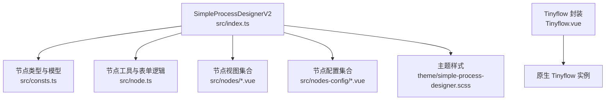
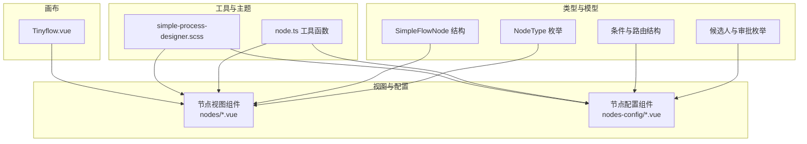
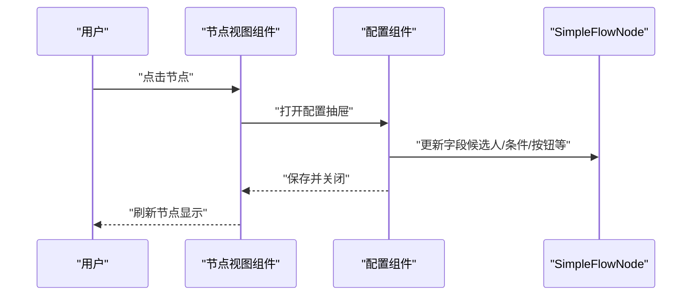
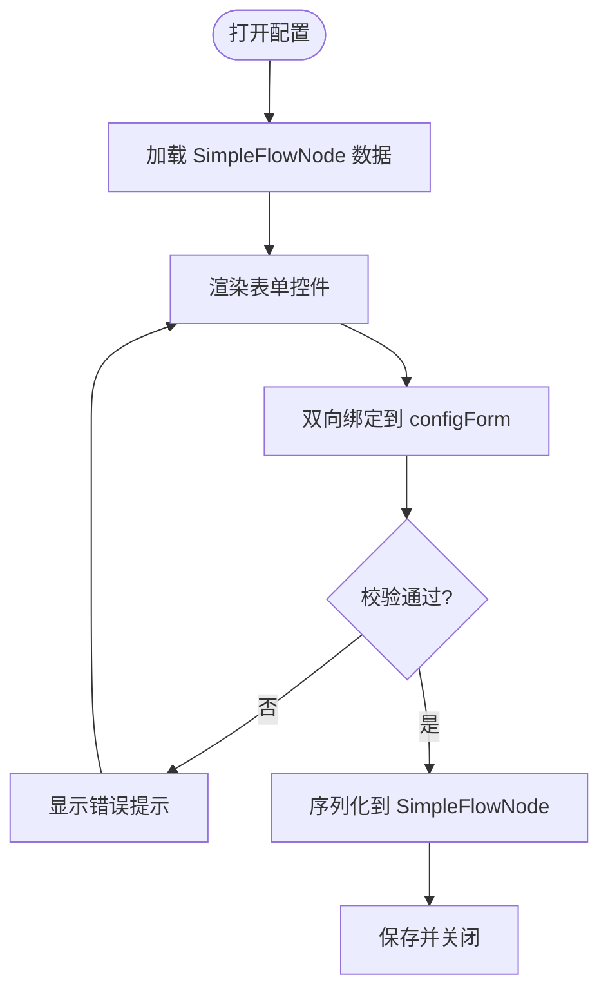
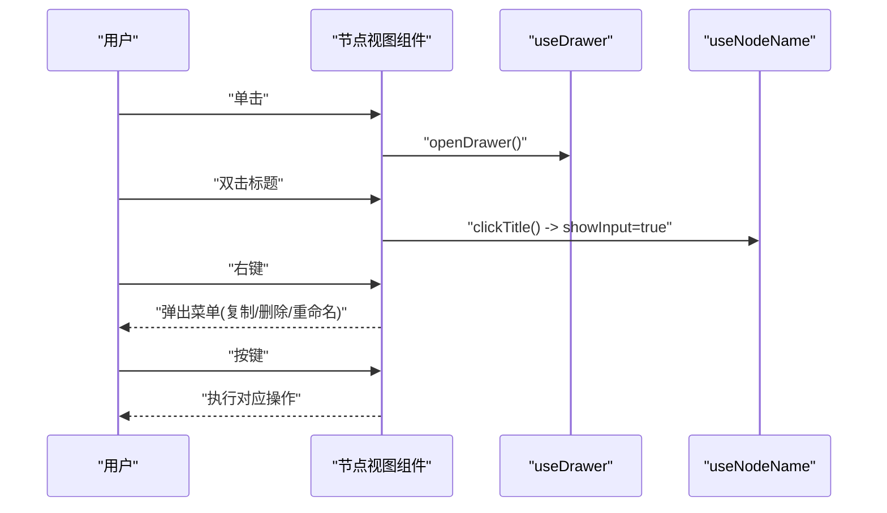
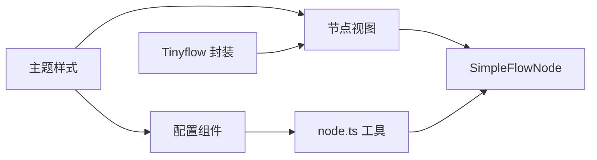

# 自定义节点开发

<cite>
**本文引用的文件**
- [SimpleProcessDesignerV2/src/consts.ts](file://yudao-ui-admin-vue3/src/components/SimpleProcessDesignerV2/src/consts.ts)
- [SimpleProcessDesignerV2/src/node.ts](file://yudao-ui-admin-vue3/src/components/SimpleProcessDesignerV2/src/node.ts)
- [SimpleProcessDesignerV2/src/index.ts](file://yudao-ui-admin-vue3/src/components/SimpleProcessDesignerV2/src/index.ts)
- [SimpleProcessDesignerV2/src/nodes/UserTaskNode.vue](file://yudao-ui-admin-vue3/src/components/SimpleProcessDesignerV2/src/nodes/UserTaskNode.vue)
- [SimpleProcessDesignerV2/src/nodes-config/UserTaskNodeConfig.vue](file://yudao-ui-admin-vue3/src/components/SimpleProcessDesignerV2/src/nodes-config/UserTaskNodeConfig.vue)
- [SimpleProcessDesignerV2/theme/simple-process-designer.scss](file://yudao-ui-admin-vue3/src/components/SimpleProcessDesignerV2/theme/simple-process-designer.scss)
- [Tinyflow/Tinyflow.vue](file://yudao-ui-admin-vue3/src/components/Tinyflow/Tinyflow.vue)
</cite>

## 目录
1. [简介](#简介)
2. [项目结构](#项目结构)
3. [核心组件](#核心组件)
4. [架构总览](#架构总览)
5. [详细组件分析](#详细组件分析)
6. [依赖关系分析](#依赖关系分析)
7. [性能考虑](#性能考虑)
8. [故障排查指南](#故障排查指南)
9. [结论](#结论)
10. [附录](#附录)

## 简介
本指南面向在 IVR 流程编辑器中扩展“自定义节点”的开发者，围绕以下目标展开：
- 节点类型定义与分类管理（NodeType 枚举扩展、默认名称与提示文案）
- 节点模型开发（SimpleFlowNode 字段、候选人与条件等配置项）
- 节点视图组件开发（Vue 组件结构、Props 接口、事件处理机制）
- 节点属性配置界面（表单控件选择、数据绑定、验证规则）
- 节点行为实现（点击、双击、右键菜单、快捷键支持）
- 节点样式定制（CSS 类名、主题适配、响应式布局）
- 节点测试方法（单元、集成、验收测试）
- 完整开发示例（从简单到复杂业务节点）

## 项目结构
本项目使用 SimpleProcessDesignerV2 作为流程编辑器核心，节点类型与模型集中在常量与工具文件中，具体节点视图与配置分别位于 nodes 与 nodes-config 目录。同时提供 Tinyflow 封装以承载原生流程图能力。

图表来源
- [SimpleProcessDesignerV2/src/index.ts:1-6](file://yudao-ui-admin-vue3/src/components/SimpleProcessDesignerV2/src/index.ts#L1-L6)
- [SimpleProcessDesignerV2/src/consts.ts:1-140](file://yudao-ui-admin-vue3/src/components/SimpleProcessDesignerV2/src/consts.ts#L1-L140)
- [SimpleProcessDesignerV2/src/node.ts:1-120](file://yudao-ui-admin-vue3/src/components/SimpleProcessDesignerV2/src/node.ts#L1-L120)
- [Tinyflow/Tinyflow.vue:1-64](file://yudao-ui-admin-vue3/src/components/Tinyflow/Tinyflow.vue#L1-L64)

章节来源
- [SimpleProcessDesignerV2/src/index.ts:1-6](file://yudao-ui-admin-vue3/src/components/SimpleProcessDesignerV2/src/index.ts#L1-L6)
- [SimpleProcessDesignerV2/src/consts.ts:1-140](file://yudao-ui-admin-vue3/src/components/SimpleProcessDesignerV2/src/consts.ts#L1-L140)
- [SimpleProcessDesignerV2/src/node.ts:1-120](file://yudao-ui-admin-vue3/src/components/SimpleProcessDesignerV2/src/node.ts#L1-L120)
- [Tinyflow/Tinyflow.vue:1-64](file://yudao-ui-admin-vue3/src/components/Tinyflow/Tinyflow.vue#L1-L64)

## 核心组件
- 节点类型与模型
  - NodeType 枚举：定义所有节点类型（结束、发起人、审批人、抄送、办理、延迟器、触发器、子流程、条件及分支网关等）。
  - SimpleFlowNode：节点数据结构，包含 id、type、name、showText、子节点、条件节点、候选人策略与参数、多人审批方式、按钮设置、表单权限、超时/拒绝/空处理、监听器、条件设置、活动状态、延迟设置、路由分组、签名与意见、跳过表达式、触发器与子流程设置等。
  - 候选人与审批相关枚举：CandidateStrategy、ApproveMethodType、RejectHandlerType、TimeoutHandlerType、AssignEmptyHandlerType、AssignStartUserHandlerType、ApproveType 等。
  - 条件与路由：ConditionType、ConditionGroup、RouterSetting 等。
  - 默认文本与名称映射：NODE_DEFAULT_TEXT、NODE_DEFAULT_NAME。
- 节点工具与表单逻辑
  - useFormFieldsPermission/useFormFields/useFormFieldsAndStartUser：用于解析表单字段与权限。
  - useNodeForm：根据节点类型生成配置表单初始值，并提供候选人参数序列化/反序列化、显示文本生成等。
  - useDrawer/useNodeName/useNodeName2：抽屉控制、节点名称编辑交互。
  - getConditionShowText：将条件配置渲染为可读文本。
- 视图与配置
  - nodes 下各 Vue 组件：对应不同节点类型的可视化呈现。
  - nodes-config 下各 Vue 组件：对应节点的属性配置面板。
- 主题与样式
  - simple-process-designer.scss：统一主题变量与样式覆盖。
- Tinyflow 封装
  - Tinyflow.vue：对原生 Tinyflow 进行初始化、销毁、数据获取等封装。

章节来源
- [SimpleProcessDesignerV2/src/consts.ts:1-800](file://yudao-ui-admin-vue3/src/components/SimpleProcessDesignerV2/src/consts.ts#L1-L800)
- [SimpleProcessDesignerV2/src/node.ts:1-618](file://yudao-ui-admin-vue3/src/components/SimpleProcessDesignerV2/src/node.ts#L1-L618)
- [SimpleProcessDesignerV2/src/nodes/UserTaskNode.vue](file://yudao-ui-admin-vue3/src/components/SimpleProcessDesignerV2/src/nodes/UserTaskNode.vue)
- [SimpleProcessDesignerV2/src/nodes-config/UserTaskNodeConfig.vue](file://yudao-ui-admin-vue3/src/components/SimpleProcessDesignerV2/src/nodes-config/UserTaskNodeConfig.vue)
- [SimpleProcessDesignerV2/theme/simple-process-designer.scss](file://yudao-ui-admin-vue3/src/components/SimpleProcessDesignerV2/theme/simple-process-designer.scss)
- [Tinyflow/Tinyflow.vue:1-64](file://yudao-ui-admin-vue3/src/components/Tinyflow/Tinyflow.vue#L1-L64)

## 架构总览
下图展示了自定义节点在编辑器中的整体协作关系：类型与模型定义驱动视图渲染，配置面板通过工具函数与模型双向绑定，主题样式统一外观，Tinyflow 负责底层画布能力。

图表来源
- [SimpleProcessDesignerV2/src/consts.ts:1-800](file://yudao-ui-admin-vue3/src/components/SimpleProcessDesignerV2/src/consts.ts#L1-L800)
- [SimpleProcessDesignerV2/src/node.ts:1-618](file://yudao-ui-admin-vue3/src/components/SimpleProcessDesignerV2/src/node.ts#L1-L618)
- [SimpleProcessDesignerV2/src/nodes/UserTaskNode.vue](file://yudao-ui-admin-vue3/src/components/SimpleProcessDesignerV2/src/nodes/UserTaskNode.vue)
- [SimpleProcessDesignerV2/src/nodes-config/UserTaskNodeConfig.vue](file://yudao-ui-admin-vue3/src/components/SimpleProcessDesignerV2/src/nodes-config/UserTaskNodeConfig.vue)
- [SimpleProcessDesignerV2/theme/simple-process-designer.scss](file://yudao-ui-admin-vue3/src/components/SimpleProcessDesignerV2/theme/simple-process-designer.scss)
- [Tinyflow/Tinyflow.vue:1-64](file://yudao-ui-admin-vue3/src/components/Tinyflow/Tinyflow.vue#L1-L64)

## 详细组件分析

### 节点类型定义与分类管理
- 扩展 NodeType 枚举：新增自定义节点时，需在 NodeType 中添加新值，并在 NODE_DEFAULT_NAME/NODE_DEFAULT_TEXT 中补充默认名称与提示文案，确保编辑器能正确识别与展示。
- 分类管理：现有分类包括开始/结束、任务类（审批/抄送/办理）、时间/触发类（延迟器/触发器）、流程控制类（条件/并行/包容/路由分支）、子流程等。新增节点应归入合适分类，便于在左侧面板或拖拽区组织。
- 候选人与审批策略：若节点涉及人员选择，需复用 CandidateStrategy 与 ApproveMethodType；若涉及拒绝/超时/空处理，需复用相应 Handler 类型。

章节来源
- [SimpleProcessDesignerV2/src/consts.ts:1-140](file://yudao-ui-admin-vue3/src/components/SimpleProcessDesignerV2/src/consts.ts#L1-L140)
- [SimpleProcessDesignerV2/src/consts.ts:519-540](file://yudao-ui-admin-vue3/src/components/SimpleProcessDesignerV2/src/consts.ts#L519-L540)
- [SimpleProcessDesignerV2/src/consts.ts:141-203](file://yudao-ui-admin-vue3/src/components/SimpleProcessDesignerV2/src/consts.ts#L141-L203)
- [SimpleProcessDesignerV2/src/consts.ts:205-371](file://yudao-ui-admin-vue3/src/components/SimpleProcessDesignerV2/src/consts.ts#L205-L371)

### 节点模型开发（SimpleFlowNode 与锚点）
- 节点模型：SimpleFlowNode 是节点的核心数据结构，包含基础信息、子节点、条件节点、候选人策略与参数、多人审批方式、按钮设置、表单权限、超时/拒绝/空处理、监听器、条件设置、活动状态、延迟设置、路由分组、签名与意见、跳过表达式、触发器与子流程设置等。
- 锚点模型：在当前代码库中未显式定义 CustomLeft/CustomRightOne 等锚点模型类。如需自定义锚点，建议在节点视图中基于 SimpleFlowNode 的 childNode/conditionNodes/routerGroups 等字段进行扩展，并通过配置组件暴露锚点开关与连接规则。
- 数据流：配置组件通过 useNodeForm 等方法将用户输入序列化为 candidateParam、conditionSetting、routerGroups 等字段，最终落盘到 SimpleFlowNode。

章节来源
- [SimpleProcessDesignerV2/src/consts.ts:81-140](file://yudao-ui-admin-vue3/src/components/SimpleProcessDesignerV2/src/consts.ts#L81-L140)
- [SimpleProcessDesignerV2/src/node.ts:196-469](file://yudao-ui-admin-vue3/src/components/SimpleProcessDesignerV2/src/node.ts#L196-L469)

### 节点视图组件开发（Vue 组件结构、Props、事件）
- 组件结构：每个节点类型对应一个 .vue 组件，通常包含模板（节点外观）、脚本（Props、事件、计算属性）、样式（局部或全局主题覆盖）。
- Props 接口：建议至少包含 flowNode（SimpleFlowNode 实例）、选中态、只读模式、上下文注入（如表单字段、角色/部门/用户列表）等。
- 事件处理：常见事件包括点击（选中/打开配置）、双击（快速编辑/跳转）、右键菜单（复制/删除/重命名）、键盘快捷键（Enter/Space/Delete/方向键移动连线）。
- 参考实现：UserTaskNode.vue 展示了审批人节点的视图结构与交互模式，可作为自定义节点视图的模板。

图表来源
- [SimpleProcessDesignerV2/src/nodes/UserTaskNode.vue](file://yudao-ui-admin-vue3/src/components/SimpleProcessDesignerV2/src/nodes/UserTaskNode.vue)
- [SimpleProcessDesignerV2/src/nodes-config/UserTaskNodeConfig.vue](file://yudao-ui-admin-vue3/src/components/SimpleProcessDesignerV2/src/nodes-config/UserTaskNodeConfig.vue)
- [SimpleProcessDesignerV2/src/node.ts:471-534](file://yudao-ui-admin-vue3/src/components/SimpleProcessDesignerV2/src/node.ts#L471-L534)

章节来源
- [SimpleProcessDesignerV2/src/nodes/UserTaskNode.vue](file://yudao-ui-admin-vue3/src/components/SimpleProcessDesignerV2/src/nodes/UserTaskNode.vue)
- [SimpleProcessDesignerV2/src/node.ts:471-534](file://yudao-ui-admin-vue3/src/components/SimpleProcessDesignerV2/src/node.ts#L471-L534)

### 节点属性配置界面（表单控件、数据绑定、验证）
- 表单控件选择：根据节点类型动态渲染控件（下拉、单选、多选、数字、日期、表达式编辑器等），可复用 FormCreate 或 Element Plus 组件。
- 数据绑定：通过 useNodeForm 生成的 configForm 与 SimpleFlowNode 字段双向绑定，提交时调用 handleCandidateParam 等方法序列化。
- 验证规则：对必填项、范围、格式等进行校验，错误提示与禁用提交按钮。
- 参考实现：UserTaskNodeConfig.vue 展示了审批人节点的配置面板，包括候选人策略、审批方式、超时/拒绝/空处理、监听器等。

图表来源
- [SimpleProcessDesignerV2/src/node.ts:196-469](file://yudao-ui-admin-vue3/src/components/SimpleProcessDesignerV2/src/node.ts#L196-L469)
- [SimpleProcessDesignerV2/src/nodes-config/UserTaskNodeConfig.vue](file://yudao-ui-admin-vue3/src/components/SimpleProcessDesignerV2/src/nodes-config/UserTaskNodeConfig.vue)

章节来源
- [SimpleProcessDesignerV2/src/node.ts:196-469](file://yudao-ui-admin-vue3/src/components/SimpleProcessDesignerV2/src/node.ts#L196-L469)
- [SimpleProcessDesignerV2/src/nodes-config/UserTaskNodeConfig.vue](file://yudao-ui-admin-vue3/src/components/SimpleProcessDesignerV2/src/nodes-config/UserTaskNodeConfig.vue)

### 节点行为实现（点击、双击、右键、快捷键）
- 点击：选中节点，高亮边框，打开右侧配置抽屉。
- 双击：进入名称编辑或快速配置入口。
- 右键菜单：提供复制、删除、重命名、插入前置/后置节点等操作。
- 快捷键：Enter/Space 确认/执行，Delete 删除节点，方向键调整连线顺序。
- 参考实现：结合 useDrawer/useNodeName/useNodeName2 控制抽屉与名称编辑；在节点视图中注册事件处理器。

图表来源
- [SimpleProcessDesignerV2/src/node.ts:471-534](file://yudao-ui-admin-vue3/src/components/SimpleProcessDesignerV2/src/node.ts#L471-L534)
- [SimpleProcessDesignerV2/src/nodes/UserTaskNode.vue](file://yudao-ui-admin-vue3/src/components/SimpleProcessDesignerV2/src/nodes/UserTaskNode.vue)

章节来源
- [SimpleProcessDesignerV2/src/node.ts:471-534](file://yudao-ui-admin-vue3/src/components/SimpleProcessDesignerV2/src/node.ts#L471-L534)
- [SimpleProcessDesignerV2/src/nodes/UserTaskNode.vue](file://yudao-ui-admin-vue3/src/components/SimpleProcessDesignerV2/src/nodes/UserTaskNode.vue)

### 节点样式定制（CSS 类名、主题、响应式）
- CSS 类名：为节点容器、锚点、连线区域定义语义化类名，便于定位与覆盖。
- 主题适配：通过 simple-process-designer.scss 统一管理颜色、圆角、阴影、字号等，支持明暗主题切换。
- 响应式布局：在小屏设备上折叠侧边栏、隐藏次要信息，保证节点可操作区域足够大。
- 实践建议：避免内联样式，优先使用 CSS 变量与主题类；为不同节点类型提供差异化图标与配色。

章节来源
- [SimpleProcessDesignerV2/theme/simple-process-designer.scss](file://yudao-ui-admin-vue3/src/components/SimpleProcessDesignerV2/theme/simple-process-designer.scss)

### 测试方法（单元、集成、验收）
- 单元测试
  - 针对 node.ts 的工具函数（如 handleCandidateParam、parseCandidateParam、getConditionShowText）编写用例，覆盖边界与异常输入。
  - 针对 SimpleFlowNode 的数据转换与校验逻辑进行测试。
- 集成测试
  - 模拟节点视图与配置组件的交互，验证数据绑定与序列化是否正确。
  - 验证抽屉开关、名称编辑、条件文本渲染等交互链路。
- 用户验收测试
  - 在真实编辑器中拖拽自定义节点，完成配置、连线、保存与回放，确保流程可执行。
  - 邀请业务用户进行可用性评估，收集反馈并迭代。

章节来源
- [SimpleProcessDesignerV2/src/node.ts:196-618](file://yudao-ui-admin-vue3/src/components/SimpleProcessDesignerV2/src/node.ts#L196-L618)

### 完整开发示例（从简单到复杂）
- 简单节点示例
  - 步骤：在 NodeType 添加新值；在 NODE_DEFAULT_NAME/NODE_DEFAULT_TEXT 补充默认值；创建 nodes/YourNode.vue 视图；创建 nodes-config/YourNodeConfig.vue 配置；在主题中增加样式；在编辑器中注册该节点。
  - 重点：最小可用，先跑通拖拽、选中、配置、保存。
- 复杂业务节点示例
  - 步骤：在 SimpleFlowNode 中扩展必要字段；在 useNodeForm 中增加候选人与业务参数序列化；在配置组件中实现复杂表单（多步、联动、校验）；在视图中实现高级交互（右键菜单、快捷键、动画）；完善主题与响应式；编写单元与集成测试；进行验收测试。
  - 重点：数据一致性、交互体验、可维护性与可扩展性。

[本节为概念性说明，不直接分析具体文件]

## 依赖关系分析
- 组件耦合
  - 视图组件依赖 SimpleFlowNode 与工具函数；配置组件依赖 useNodeForm 与表单字段选项。
  - 主题样式被所有节点共享，降低重复样式成本。
- 外部依赖
  - Tinyflow 封装提供画布能力；FormCreate 可用于动态表单；Element Plus 提供 UI 组件。
- 潜在循环依赖
  - 避免在 node.ts 中引入具体节点视图组件，保持工具层无副作用。
- 接口契约
  - SimpleFlowNode 为稳定契约，新增字段需向后兼容；枚举值变更需谨慎。

图表来源
- [SimpleProcessDesignerV2/src/consts.ts:1-800](file://yudao-ui-admin-vue3/src/components/SimpleProcessDesignerV2/src/consts.ts#L1-L800)
- [SimpleProcessDesignerV2/src/node.ts:1-618](file://yudao-ui-admin-vue3/src/components/SimpleProcessDesignerV2/src/node.ts#L1-L618)
- [Tinyflow/Tinyflow.vue:1-64](file://yudao-ui-admin-vue3/src/components/Tinyflow/Tinyflow.vue#L1-L64)

章节来源
- [SimpleProcessDesignerV2/src/consts.ts:1-800](file://yudao-ui-admin-vue3/src/components/SimpleProcessDesignerV2/src/consts.ts#L1-L800)
- [SimpleProcessDesignerV2/src/node.ts:1-618](file://yudao-ui-admin-vue3/src/components/SimpleProcessDesignerV2/src/node.ts#L1-L618)
- [Tinyflow/Tinyflow.vue:1-64](file://yudao-ui-admin-vue3/src/components/Tinyflow/Tinyflow.vue#L1-L64)

## 性能考虑
- 渲染优化：大型流程中使用虚拟滚动或分页加载节点；避免在每次渲染中创建大对象。
- 事件节流：高频事件（鼠标移动、缩放）做节流/防抖处理。
- 数据序列化：仅在保存时进行全量序列化，编辑过程中尽量使用局部状态。
- 主题与样式：减少深度选择器与复杂计算样式，提升重排性能。

[本节提供通用指导，不直接分析具体文件]

## 故障排查指南
- 常见问题
  - 节点类型未注册：检查 NodeType 是否新增且默认名称/提示已配置。
  - 配置不生效：检查 useNodeForm 的序列化逻辑与 SimpleFlowNode 字段映射。
  - 样式错乱：检查主题变量与节点类名是否一致，避免冲突。
  - 交互异常：检查事件绑定与快捷键冲突。
- 调试建议
  - 在配置组件中打印 configForm 与 SimpleFlowNode 的变化。
  - 使用浏览器开发者工具检查 DOM 类名与事件冒泡。
  - 逐步缩小问题范围，先验证数据再验证交互。

章节来源
- [SimpleProcessDesignerV2/src/node.ts:196-618](file://yudao-ui-admin-vue3/src/components/SimpleProcessDesignerV2/src/node.ts#L196-L618)
- [SimpleProcessDesignerV2/theme/simple-process-designer.scss](file://yudao-ui-admin-vue3/src/components/SimpleProcessDesignerV2/theme/simple-process-designer.scss)

## 结论
通过在本项目中扩展 NodeType、完善 SimpleFlowNode 字段、实现节点视图与配置组件、统一主题样式，并结合 Tinyflow 的画布能力，可以高效地构建 IVR 流程编辑器的自定义节点。遵循本指南的流程与最佳实践，能够确保节点的可维护性、可扩展性与用户体验。

[本节为总结性内容，不直接分析具体文件]

## 附录
- 推荐实践清单
  - 新增 NodeType 与默认文案
  - 扩展 SimpleFlowNode 字段并保持向后兼容
  - 实现节点视图与配置组件
  - 使用 useNodeForm 进行数据绑定与序列化
  - 统一主题样式与响应式布局
  - 编写单元与集成测试
  - 进行用户验收测试
- 参考路径
  - 节点类型与模型：[SimpleProcessDesignerV2/src/consts.ts](file://yudao-ui-admin-vue3/src/components/SimpleProcessDesignerV2/src/consts.ts)
  - 工具与表单逻辑：[SimpleProcessDesignerV2/src/node.ts](file://yudao-ui-admin-vue3/src/components/SimpleProcessDesignerV2/src/node.ts)
  - 视图与配置：[SimpleProcessDesignerV2/src/nodes](file://yudao-ui-admin-vue3/src/components/SimpleProcessDesignerV2/src/nodes)、[SimpleProcessDesignerV2/src/nodes-config](file://yudao-ui-admin-vue3/src/components/SimpleProcessDesignerV2/src/nodes-config)
  - 主题样式：[SimpleProcessDesignerV2/theme/simple-process-designer.scss](file://yudao-ui-admin-vue3/src/components/SimpleProcessDesignerV2/theme/simple-process-designer.scss)
  - 画布封装：[Tinyflow/Tinyflow.vue](file://yudao-ui-admin-vue3/src/components/Tinyflow/Tinyflow.vue)

[本节为附录，不直接分析具体文件]