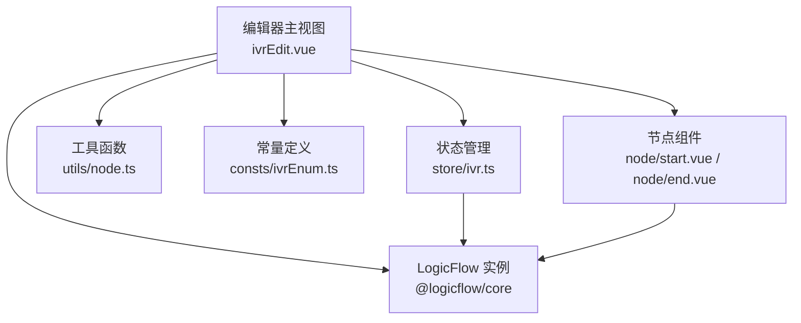
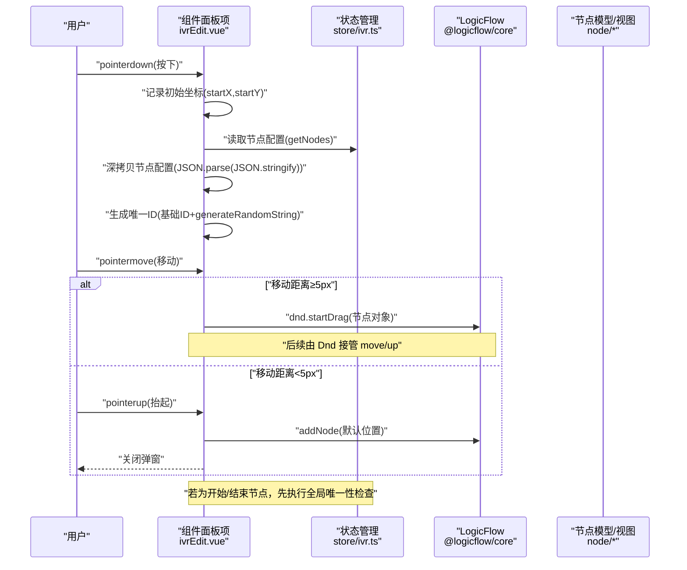
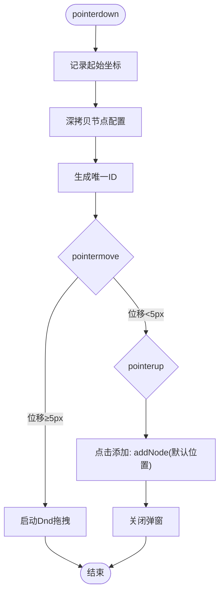
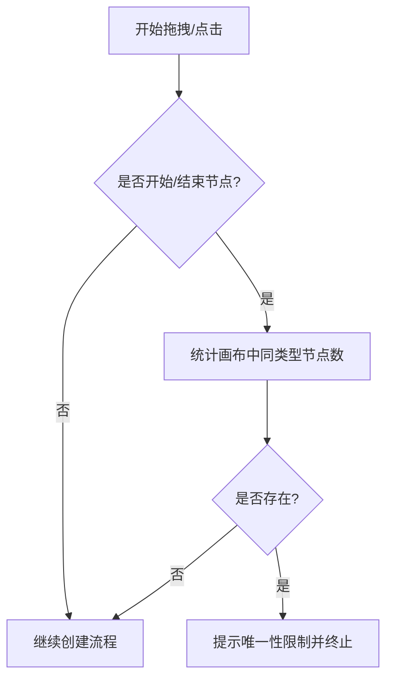
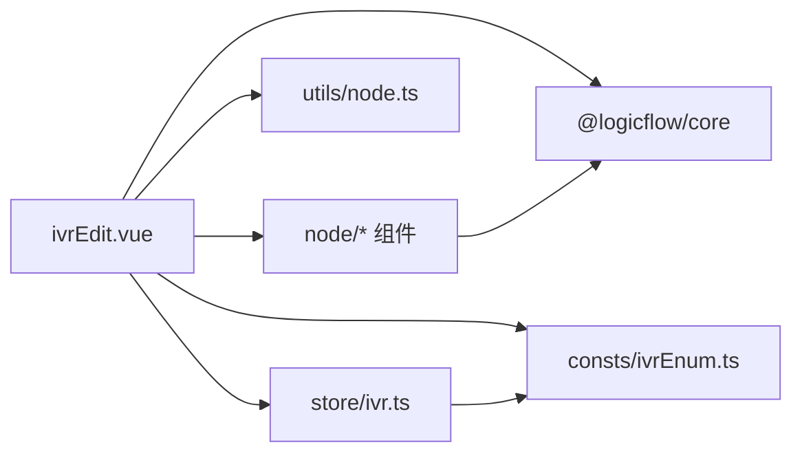

# 节点拖拽机制

<cite>
**本文引用的文件**
- [ivrEdit.vue](file://yudao-ui-admin-vue3/src/views/cc/ivr/ivrEdit.vue)
- [ivr.ts](file://yudao-ui-admin-vue3/src/views/cc/ivr/store/ivr.ts)
- [node.ts](file://yudao-ui-admin-vue3/src/views/cc/ivr/utils/node.ts)
- [ivrEnum.ts](file://yudao-ui-admin-vue3/src/views/cc/ivr/consts/ivrEnum.ts)
- [start.vue](file://yudao-ui-admin-vue3/src/views/cc/ivr/node/start.vue)
- [end.vue](file://yudao-ui-admin-vue3/src/views/cc/ivr/node/end.vue)
</cite>

## 目录
1. [简介](#简介)
2. [项目结构](#项目结构)
3. [核心组件](#核心组件)
4. [架构总览](#架构总览)
5. [详细组件分析](#详细组件分析)
6. [依赖关系分析](#依赖关系分析)
7. [性能考虑](#性能考虑)
8. [故障排查指南](#故障排查指南)
9. [结论](#结论)
10. [附录](#附录)

## 简介
本文档围绕 IVR 流程编辑器的“节点拖拽机制”进行系统化说明，覆盖从组件面板到画布的完整交互链路：pointerdown、pointermove、pointerup 事件处理；点击添加与拖拽添加的差异（含移动距离阈值 5px）；Dnd 插件的使用；开始/结束节点的全局唯一性校验；节点数据深拷贝与 ID 生成策略；拖拽过程中的视觉反馈；以及拖拽性能优化方案（事件节流、DOM 操作优化、内存泄漏防护）。

## 项目结构
IVR 编辑器位于前端 Vue3 工程，核心文件分布如下：
- 编辑器主视图：负责初始化 LogicFlow、注册节点、监听事件、实现拖拽入口逻辑
- 状态管理：集中维护节点元数据、配置与画布实例引用
- 工具函数：提供随机字符串生成等辅助能力
- 常量定义：节点类型枚举等
- 节点组件：具体节点渲染与属性编辑

图表来源
- [ivrEdit.vue:176-409](file://yudao-ui-admin-vue3/src/views/cc/ivr/ivrEdit.vue#L176-L409)
- [ivr.ts:283-352](file://yudao-ui-admin-vue3/src/views/cc/ivr/store/ivr.ts#L283-L352)
- [node.ts:12-30](file://yudao-ui-admin-vue3/src/views/cc/ivr/utils/node.ts#L12-L30)
- [ivrEnum.ts:1-17](file://yudao-ui-admin-vue3/src/views/cc/ivr/consts/ivrEnum.ts#L1-L17)
- [start.vue:79-159](file://yudao-ui-admin-vue3/src/views/cc/ivr/node/start.vue#L79-L159)
- [end.vue:45-135](file://yudao-ui-admin-vue3/src/views/cc/ivr/node/end.vue#L45-L135)

章节来源
- [ivrEdit.vue:176-409](file://yudao-ui-admin-vue3/src/views/cc/ivr/ivrEdit.vue#L176-L409)
- [ivr.ts:283-352](file://yudao-ui-admin-vue3/src/views/cc/ivr/store/ivr.ts#L283-L352)

## 核心组件
- 编辑器主视图 ivrEdit.vue
  - 初始化 LogicFlow，注册自定义节点与边
  - 实现“添加组件”弹窗的 pointerdown/pointermove/pointerup 组合逻辑
  - 使用 Dnd 插件完成拖拽添加
  - 对开始/结束节点做全局唯一性校验
  - 在 graph:transform、node:add、graph:rendered 等时机同步节点尺寸，避免缩放错位
- 状态管理 store/ivr.ts
  - 集中维护节点元数据与默认配置
  - 暴露 getNodeList/getNodes/getLf 等 getter
  - 保存 LF 实例引用供其他模块调用
- 工具 utils/node.ts
  - generateRandomString：生成指定长度的数字串，用于节点 ID 后缀
- 常量 consts/ivrEnum.ts
  - NodeType 枚举：start-node、end-node、playback-node、transfer-node、receive-node、condition-node、method-node
- 节点组件 start.vue / end.vue
  - 节点内部表单更新通过 setProperties 同步到 LF
  - 复制节点时通过 changeNodeId + 随机后缀保证唯一性

章节来源
- [ivrEdit.vue:176-409](file://yudao-ui-admin-vue3/src/views/cc/ivr/ivrEdit.vue#L176-L409)
- [ivr.ts:283-352](file://yudao-ui-admin-vue3/src/views/cc/ivr/store/ivr.ts#L283-L352)
- [node.ts:12-30](file://yudao-ui-admin-vue3/src/views/cc/ivr/utils/node.ts#L12-L30)
- [ivrEnum.ts:1-17](file://yudao-ui-admin-vue3/src/views/cc/ivr/consts/ivrEnum.ts#L1-L17)
- [start.vue:79-159](file://yudao-ui-admin-vue3/src/views/cc/ivr/node/start.vue#L79-L159)
- [end.vue:45-135](file://yudao-ui-admin-vue3/src/views/cc/ivr/node/end.vue#L45-L135)

## 架构总览
下图展示了从“组件面板”到“画布”的拖拽全流程，包括事件分流、唯一性校验、Dnd 启动与点击添加分支。

图表来源
- [ivrEdit.vue:584-643](file://yudao-ui-admin-vue3/src/views/cc/ivr/ivrEdit.vue#L584-L643)
- [node.ts:12-30](file://yudao-ui-admin-vue3/src/views/cc/ivr/utils/node.ts#L12-L30)
- [ivr.ts:283-352](file://yudao-ui-admin-vue3/src/views/cc/ivr/store/ivr.ts#L283-L352)

## 详细组件分析

### 拖拽事件处理与阈值判断（pointerdown/move/up）
- pointerdown
  - 记录起始坐标，准备计算移动距离
  - 深拷贝节点配置，避免污染源数据
  - 生成新节点 ID：基础类型前缀 + 随机数字串
  - 移除固定宽高等字段，交由 HtmlNodeModel 自动测量
- pointermove
  - 计算当前坐标与起始坐标的差值
  - 当任一方向位移超过 5px 时，标记进入拖拽态并清理临时监听器
  - 调用 LogicFlow 的 dnd.startDrag(obj)，将后续 move/up 交给 Dnd 处理
- pointerup
  - 若未进入拖拽态（即移动距离小于 5px），视为“点击添加”
  - 关闭组件弹窗，调用 addNode 将节点添加到画布默认位置

图表来源
- [ivrEdit.vue:584-643](file://yudao-ui-admin-vue3/src/views/cc/ivr/ivrEdit.vue#L584-L643)

章节来源
- [ivrEdit.vue:584-643](file://yudao-ui-admin-vue3/src/views/cc/ivr/ivrEdit.vue#L584-L643)

### 点击添加与拖拽添加的区别
- 点击添加
  - 触发条件：pointerdown 后未发生有效移动（<5px），直接 pointerup
  - 行为：关闭弹窗，调用 addNode 将节点插入到画布默认位置
- 拖拽添加
  - 触发条件：pointerdown 后移动距离达到或超过 5px
  - 行为：启动 Dnd 拖拽，节点跟随鼠标移动，释放时在释放位置落点
- 用户体验差异
  - 点击添加适合快速放置，无需精确控制位置
  - 拖拽添加适合精确定位，支持在画布任意区域放置

章节来源
- [ivrEdit.vue:584-643](file://yudao-ui-admin-vue3/src/views/cc/ivr/ivrEdit.vue#L584-L643)

### 全局唯一性校验（开始节点/结束节点）
- 校验时机：handleDragStart 开始时，针对开始/结束节点类型
- 校验规则：统计当前画布中同类型节点数量，若已存在则提示并阻止添加
- 错误提示：通过消息组件提示“只能存在一个开始/结束组件”，并关闭弹窗

图表来源
- [ivrEdit.vue:584-596](file://yudao-ui-admin-vue3/src/views/cc/ivr/ivrEdit.vue#L584-L596)

章节来源
- [ivrEdit.vue:584-596](file://yudao-ui-admin-vue3/src/views/cc/ivr/ivrEdit.vue#L584-L596)

### 节点数据深拷贝与 ID 生成策略
- 深拷贝
  - 使用 JSON.parse(JSON.stringify(...)) 对节点配置进行深拷贝，避免修改 Store 中的模板数据
  - 删除固定宽高等字段，使节点尺寸由内容自适应
- ID 生成
  - 基础 ID：来自 Store 中对应类型的 id 前缀（如 start-node_）
  - 随机后缀：generateRandomString(6) 生成 6 位数字串
  - 冲突避免：基于时间/随机性的低概率冲突；如需更强保证可在生成后遍历现有节点 ID 去重重试

章节来源
- [ivrEdit.vue:598-607](file://yudao-ui-admin-vue3/src/views/cc/ivr/ivrEdit.vue#L598-L607)
- [node.ts:12-30](file://yudao-ui-admin-vue3/src/views/cc/ivr/utils/node.ts#L12-L30)
- [ivr.ts:75-297](file://yudao-ui-admin-vue3/src/views/cc/ivr/store/ivr.ts#L75-L297)

### 拖拽过程中的视觉反馈
- 拖拽预览
  - 由 LogicFlow 的 Dnd 插件负责：在拖拽过程中显示被拖拽节点的半透明预览
- 放置区域高亮
  - 由 Dnd 根据目标区域判定高亮（例如可放置区域边框/背景变化）
- 错误提示
  - 开始/结束节点重复时，弹出警告提示并阻止添加
- 注意事项
  - 本实现未额外定制 DOM 级的高亮样式，主要依赖 Dnd 内置反馈与业务层消息提示

章节来源
- [ivrEdit.vue:584-643](file://yudao-ui-admin-vue3/src/views/cc/ivr/ivrEdit.vue#L584-L643)

### 尺寸同步与缩放稳定性（graph:transform、node:add、graph:rendered）
- 问题背景
  - 多次缩放后，HtmlNodeModel 缓存的 width/height 可能与真实 DOM 不一致，导致锚点、连线端点与选中轮廓错位
- 解决方案
  - 在 graph:transform 上防抖调用 syncAllNodesSize，延迟 80ms 统一同步一次
  - 在 node:add 后 requestAnimationFrame 内同步新节点尺寸
  - 在 graph:rendered 后两次 rAF 兜底，确保首次加载批量渲染后的尺寸对齐
- 效果
  - 避免缩放导致的布局抖动与锚点偏移，提升交互稳定性

章节来源
- [ivrEdit.vue:86-136](file://yudao-ui-admin-vue3/src/views/cc/ivr/ivrEdit.vue#L86-L136)
- [ivrEdit.vue:342-400](file://yudao-ui-admin-vue3/src/views/cc/ivr/ivrEdit.vue#L342-L400)

## 依赖关系分析
- ivrEdit.vue 依赖
  - @logicflow/core：画布与 Dnd 能力
  - @logicflow/vue-node-registry：Vue 节点注册
  - store/ivr.ts：获取节点元数据、配置与 LF 实例
  - utils/node.ts：随机字符串生成
  - consts/ivrEnum.ts：节点类型常量
  - node/*：各节点组件与模型
- store/ivr.ts 依赖
  - 资源图标与枚举常量，派生 nodeList 与 nodes
- 节点组件依赖
  - 通过 inject 获取 getNode/getGraph，调用 LF API 更新属性或删除/复制节点

图表来源
- [ivrEdit.vue:54-79](file://yudao-ui-admin-vue3/src/views/cc/ivr/ivrEdit.vue#L54-L79)
- [ivr.ts:1-12](file://yudao-ui-admin-vue3/src/views/cc/ivr/store/ivr.ts#L1-L12)
- [node.ts:1-4](file://yudao-ui-admin-vue3/src/views/cc/ivr/utils/node.ts#L1-L4)
- [ivrEnum.ts:1-17](file://yudao-ui-admin-vue3/src/views/cc/ivr/consts/ivrEnum.ts#L1-L17)

章节来源
- [ivrEdit.vue:54-79](file://yudao-ui-admin-vue3/src/views/cc/ivr/ivrEdit.vue#L54-L79)
- [ivr.ts:1-12](file://yudao-ui-admin-vue3/src/views/cc/ivr/store/ivr.ts#L1-L12)

## 性能考虑
- 事件节流/防抖
  - 对高频触发的 graph:transform 使用防抖（80ms），减少频繁尺寸同步带来的抖动与开销
- DOM 操作优化
  - 仅在必要时从真实 DOM 读取 offsetWidth/offsetHeight，并写回模型，避免无谓重排
  - 使用 requestAnimationFrame 在合适时机执行尺寸同步，降低掉帧风险
- 内存泄漏防护
  - 在 handleDragStart 中为 document 添加 pointermove/pointerup 监听器，并在 cleanup 中移除，防止残留监听
  - 组件卸载时调用全局表单守护者卸载方法，避免窗口级监听泄露
- 渲染时序优化
  - 在 node:add 与 graph:rendered 后采用 rAF 多次兜底，确保 Vue 组件挂载后再同步尺寸，避免首次渲染错位

章节来源
- [ivrEdit.vue:86-136](file://yudao-ui-admin-vue3/src/views/cc/ivr/ivrEdit.vue#L86-L136)
- [ivrEdit.vue:342-400](file://yudao-ui-admin-vue3/src/views/cc/ivr/ivrEdit.vue#L342-L400)
- [ivrEdit.vue:636-643](file://yudao-ui-admin-vue3/src/views/cc/ivr/ivrEdit.vue#L636-L643)
- [ivrEdit.vue:168-173](file://yudao-ui-admin-vue3/src/views/cc/ivr/ivrEdit.vue#L168-L173)

## 故障排查指南
- 拖拽无效或误判为点击
  - 检查 pointermove 是否被上层拦截（如表单守护者在表单交互期间捕获 move）
  - 确认移动距离阈值 5px 是否符合预期
- 开始/结束节点无法添加
  - 检查画布中是否已存在同类型节点，若存在需先删除再添加
- 节点尺寸异常或锚点错位
  - 检查是否在 graph:transform、node:add、graph:rendered 正确执行了尺寸同步
  - 查看是否有异常导致 syncAllNodesSize 静默降级
- 内存占用增长
  - 确认 pointermove/pointerup 监听器是否正确清理
  - 检查组件卸载时是否调用了全局守护者的卸载方法

章节来源
- [ivrEdit.vue:584-643](file://yudao-ui-admin-vue3/src/views/cc/ivr/ivrEdit.vue#L584-L643)
- [ivrEdit.vue:86-136](file://yudao-ui-admin-vue3/src/views/cc/ivr/ivrEdit.vue#L86-L136)
- [ivrEdit.vue:168-173](file://yudao-ui-admin-vue3/src/views/cc/ivr/ivrEdit.vue#L168-L173)

## 结论
本实现通过 pointerdown/move/up 的组合与 5px 移动阈值，清晰区分“点击添加”和“拖拽添加”，并利用 LogicFlow 的 Dnd 插件完成拖拽体验。通过全局唯一性校验保障开始/结束节点的唯一性；借助深拷贝与随机 ID 生成避免数据污染与冲突；在关键生命周期中进行尺寸同步，确保缩放与渲染稳定性。整体方案兼顾易用性与性能，适用于复杂 IVR 流程编辑场景。

## 附录
- 相关枚举与常量
  - NodeType：start-node、end-node、playback-node、transfer-node、receive-node、condition-node、method-node
- 节点默认配置
  - 所有节点在 Store 中集中定义，包含名称、描述、图标、业务属性等
- 节点组件交互
  - 节点内部通过 setProperties 同步属性，删除/复制通过 LF API 完成

章节来源
- [ivrEnum.ts:1-17](file://yudao-ui-admin-vue3/src/views/cc/ivr/consts/ivrEnum.ts#L1-L17)
- [ivr.ts:75-297](file://yudao-ui-admin-vue3/src/views/cc/ivr/store/ivr.ts#L75-L297)
- [start.vue:79-159](file://yudao-ui-admin-vue3/src/views/cc/ivr/node/start.vue#L79-L159)
- [end.vue:45-135](file://yudao-ui-admin-vue3/src/views/cc/ivr/node/end.vue#L45-L135)