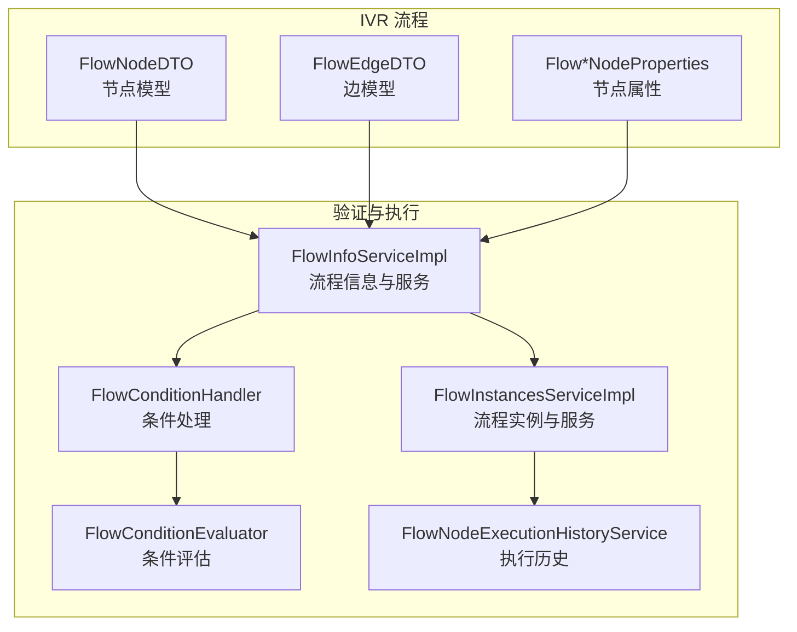
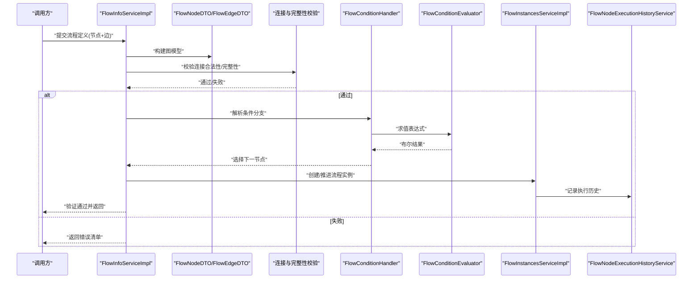
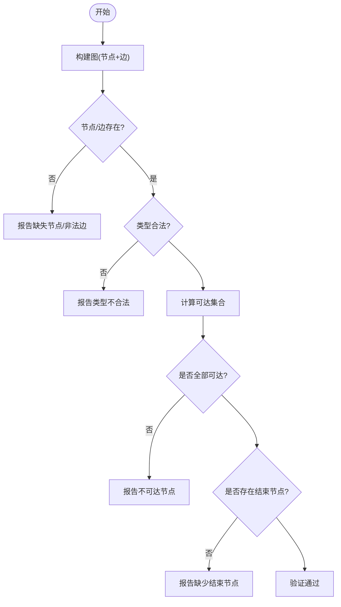
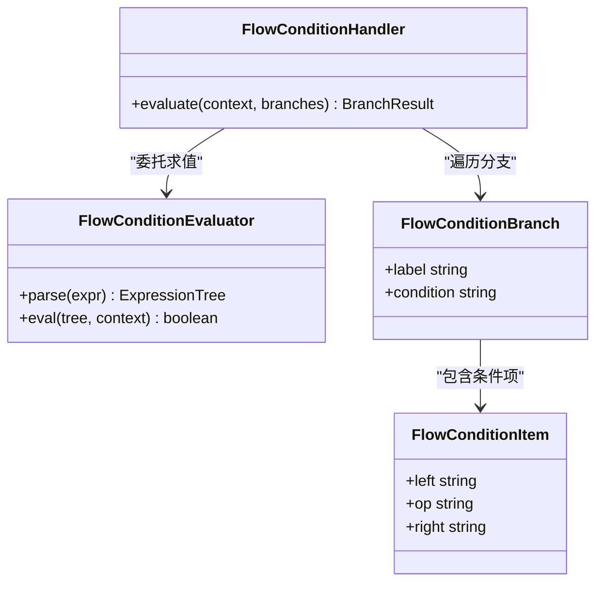
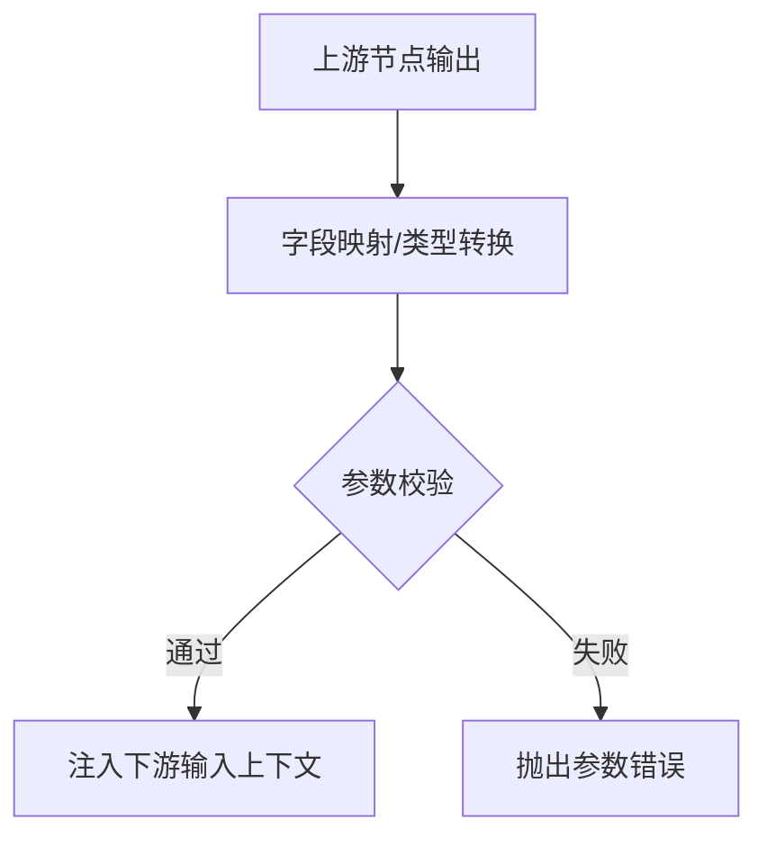
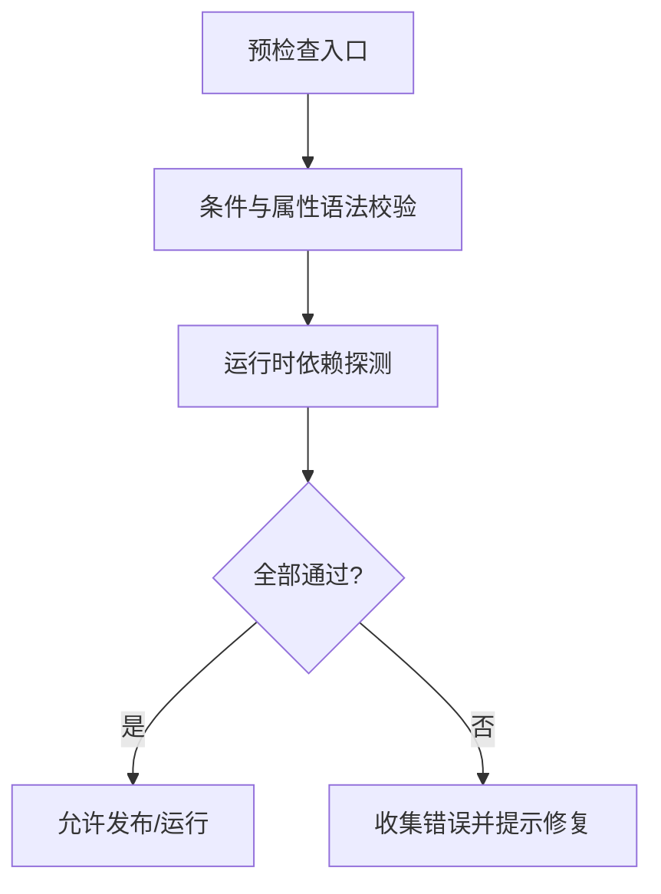
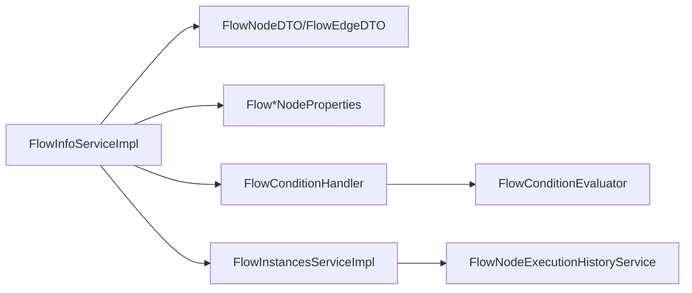

# 流程验证机制

<cite>
**本文引用的文件**
- [FlowNodeDTO.java](file://yudao-cloud/yudao-module-cc/yudao-module-cc-server/src/main/java/cn/iocoder/yudao/module/cc/ivr/dto/FlowNodeDTO.java)
- [FlowEdgeDTO.java](file://yudao-cloud/yudao-module-cc/yudao-module-cc-server/src/main/java/cn/iocoder/yudao/module/cc/ivr/dto/FlowEdgeDTO.java)
- [FlowInfoServiceImpl.java](file://yudao-cloud/yudao-module-cc/yudao-module-cc-server/src/main/java/cn/iocoder/yudao/module/cc/service/flow/FlowInfoServiceImpl.java)
- [FlowInstancesServiceImpl.java](file://yudao-cloud/yudao-module-cc/yudao-module-cc-server/src/main/java/cn/iocoder/yudao/module/cc/service/flow/FlowInstancesServiceImpl.java)
- [FlowConditionHandler.java](file://yudao-cloud/yudao-module-cc/yudao-module-cc-server/src/main/java/cn/iocoder/yudao/module/cc/ivr/handler/node/FlowConditionHandler.java)
- [FlowConditionEvaluator.java](file://yudao-cloud/yudao-module-cc/yudao-module-cc-server/src/main/java/cn/iocoder/yudao/module/cc/ivr/handler/node/FlowConditionEvaluator.java)
- [FlowStartNodeProperties.java](file://yudao-cloud/yudao-module-cc/yudao-module-cc-server/src/main/java/cn/iocoder/yudao/module/cc/ivr/properties/FlowStartNodeProperties.java)
- [FlowMenuNodeProperties.java](file://yudao-cloud/yudao-module-cc/yudao-module-cc-server/src/main/java/cn/iocoder/yudao/module/cc/ivr/properties/FlowMenuNodeProperties.java)
- [FlowPlaybackNodeProperties.java](file://yudao-cloud/yudao-module-cc/yudao-module-cc-server/src/main/java/cn/iocoder/yudao/module/cc/ivr/properties/FlowPlaybackNodeProperties.java)
- [FlowReceiveNodeProperties.java](file://yudao-cloud/yudao-module-cc/yudao-module-cc-server/src/main/java/cn/iocoder/yudao/module/cc/ivr/properties/FlowReceiveNodeProperties.java)
- [FlowMethodNodeProperties.java](file://yudao-cloud/yudao-module-cc/yudao-module-cc-server/src/main/java/cn/iocoder/yudao/module/cc/ivr/properties/FlowMethodNodeProperties.java)
- [FlowTransferNodeProperties.java](file://yudao-cloud/yudao-module-cc/yudao-module-cc-server/src/main/java/cn/iocoder/yudao/module/cc/ivr/properties/FlowTransferNodeProperties.java)
- [FlowEndNodeProperties.java](file://yudao-cloud/yudao-module-cc/yudao-module-cc-server/src/main/java/cn/iocoder/yudao/module/cc/ivr/properties/FlowEndNodeProperties.java)
- [FlowConditionBranch.java](file://yudao-cloud/yudao-module-cc/yudao-module-cc-server/src/main/java/cn/iocoder/yudao/module/cc/ivr/properties/FlowConditionBranch.java)
- [FlowConditionItem.java](file://yudao-cloud/yudao-module-cc/yudao-module-cc-server/src/main/java/cn/iocoder/yudao/module/cc/ivr/properties/FlowConditionItem.java)
- [FlowNodeExecutionHistoryService.java](file://yudao-cloud/yudao-module-cc/yudao-module-cc-server/src/main/java/cn/iocoder/yudao/module/cc/service/flow/FlowNodeExecutionHistoryService.java)
- [FlowNodeExecutionHistoryServiceImpl.java](file://yudao-cloud/yudao-module-cc/yudao-module-cc-server/src/main/java/cn/iocoder/yudao/module/cc/service/flow/FlowNodeExecutionHistoryServiceImpl.java)
</cite>

## 目录
1. [简介](#简介)
2. [项目结构](#项目结构)
3. [核心组件](#核心组件)
4. [架构总览](#架构总览)
5. [详细组件分析](#详细组件分析)
6. [依赖关系分析](#依赖关系分析)
7. [性能考虑](#性能考虑)
8. [故障排查指南](#故障排查指南)
9. [结论](#结论)
10. [附录](#附录)

## 简介
本文件面向IVR（交互式语音应答）流程的“验证机制”，聚焦以下目标：
- 节点连接合法性检查与业务流程完整性验证
- 条件运算符与规则引擎：比较、逻辑、函数调用
- 节点输出参数定义与管理，参数传递与数据映射
- 执行前预检查：语法校验与运行时依赖检查
- 验证错误诊断与修复建议
- 验证性能优化与批量验证策略

## 项目结构
IVR流程相关代码集中在模块 yudao-module-cc-server 下，关键路径如下：
- ivr/dto：流程节点与边模型（用于描述图结构）
- ivr/properties：各节点类型的属性定义（输入/输出/配置）
- ivr/handler/node：节点处理器与条件评估器（含规则引擎入口）
- service/flow：流程信息、实例与执行历史服务（含验证编排）
- dal/dataobject/flow：持久化实体（流程、实例、执行历史）

图表来源
- [FlowNodeDTO.java](file://yudao-cloud/yudao-module-cc/yudao-module-cc-server/src/main/java/cn/iocoder/yudao/module/cc/ivr/dto/FlowNodeDTO.java)
- [FlowEdgeDTO.java](file://yudao-cloud/yudao-module-cc/yudao-module-cc-server/src/main/java/cn/iocoder/yudao/module/cc/ivr/dto/FlowEdgeDTO.java)
- [FlowInfoServiceImpl.java](file://yudao-cloud/yudao-module-cc/yudao-module-cc-server/src/main/java/cn/iocoder/yudao/module/cc/service/flow/FlowInfoServiceImpl.java)
- [FlowInstancesServiceImpl.java](file://yudao-cloud/yudao-module-cc/yudao-module-cc-server/src/main/java/cn/iocoder/yudao/module/cc/service/flow/FlowInstancesServiceImpl.java)
- [FlowConditionHandler.java](file://yudao-cloud/yudao-module-cc/yudao-module-cc-server/src/main/java/cn/iocoder/yudao/module/cc/ivr/handler/node/FlowConditionHandler.java)
- [FlowConditionEvaluator.java](file://yudao-cloud/yudao-module-cc/yudao-module-cc-server/src/main/java/cn/iocoder/yudao/module/cc/ivr/handler/node/FlowConditionEvaluator.java)

章节来源
- [FlowNodeDTO.java](file://yudao-cloud/yudao-module-cc/yudao-module-cc-server/src/main/java/cn/iocoder/yudao/module/cc/ivr/dto/FlowNodeDTO.java)
- [FlowEdgeDTO.java](file://yudao-cloud/yudao-module-cc/yudao-module-cc-server/src/main/java/cn/iocoder/yudao/module/cc/ivr/dto/FlowEdgeDTO.java)
- [FlowInfoServiceImpl.java](file://yudao-cloud/yudao-module-cc/yudao-module-cc-server/src/main/java/cn/iocoder/yudao/module/cc/service/flow/FlowInfoServiceImpl.java)
- [FlowInstancesServiceImpl.java](file://yudao-cloud/yudao-module-cc/yudao-module-cc-server/src/main/java/cn/iocoder/yudao/module/cc/service/flow/FlowInstancesServiceImpl.java)

## 核心组件
- 流程图模型
  - FlowNodeDTO：描述节点ID、类型、属性等
  - FlowEdgeDTO：描述源节点、目标节点及边属性（如分支标签）
- 节点属性
  - FlowStartNodeProperties、FlowMenuNodeProperties、FlowPlaybackNodeProperties、FlowReceiveNodeProperties、FlowMethodNodeProperties、FlowTransferNodeProperties、FlowEndNodeProperties：定义各节点的输入/输出参数与配置项
- 条件与规则
  - FlowConditionHandler：条件分支处理入口
  - FlowConditionEvaluator：表达式解析与求值（支持比较、逻辑、函数调用）
- 服务层
  - FlowInfoServiceImpl：流程元数据加载、图构建、验证编排
  - FlowInstancesServiceImpl：流程实例创建、运行期上下文管理
  - FlowNodeExecutionHistoryService：执行历史记录（便于回溯与诊断）

章节来源
- [FlowNodeDTO.java](file://yudao-cloud/yudao-module-cc/yudao-module-cc-server/src/main/java/cn/iocoder/yudao/module/cc/ivr/dto/FlowNodeDTO.java)
- [FlowEdgeDTO.java](file://yudao-cloud/yudao-module-cc/yudao-module-cc-server/src/main/java/cn/iocoder/yudao/module/cc/ivr/dto/FlowEdgeDTO.java)
- [FlowStartNodeProperties.java](file://yudao-cloud/yudao-module-cc/yudao-module-cc-server/src/main/java/cn/iocoder/yudao/module/cc/ivr/properties/FlowStartNodeProperties.java)
- [FlowMenuNodeProperties.java](file://yudao-cloud/yudao-module-cc/yudao-module-cc-server/src/main/java/cn/iocoder/yudao/module/cc/ivr/properties/FlowMenuNodeProperties.java)
- [FlowPlaybackNodeProperties.java](file://yudao-cloud/yudao-module-cc/yudao-module-cc-server/src/main/java/cn/iocoder/yudao/module/cc/ivr/properties/FlowPlaybackNodeProperties.java)
- [FlowReceiveNodeProperties.java](file://yudao-cloud/yudao-module-cc/yudao-module-cc-server/src/main/java/cn/iocoder/yudao/module/cc/ivr/properties/FlowReceiveNodeProperties.java)
- [FlowMethodNodeProperties.java](file://yudao-cloud/yudao-module-cc/yudao-module-cc-server/src/main/java/cn/iocoder/yudao/module/cc/ivr/properties/FlowMethodNodeProperties.java)
- [FlowTransferNodeProperties.java](file://yudao-cloud/yudao-module-cc/yudao-module-cc-server/src/main/java/cn/iocoder/yudao/module/cc/ivr/properties/FlowTransferNodeProperties.java)
- [FlowEndNodeProperties.java](file://yudao-cloud/yudao-module-cc/yudao-module-cc-server/src/main/java/cn/iocoder/yudao/module/cc/ivr/properties/FlowEndNodeProperties.java)
- [FlowConditionHandler.java](file://yudao-cloud/yudao-module-cc/yudao-module-cc-server/src/main/java/cn/iocoder/yudao/module/cc/ivr/handler/node/FlowConditionHandler.java)
- [FlowConditionEvaluator.java](file://yudao-cloud/yudao-module-cc/yudao-module-cc-server/src/main/java/cn/iocoder/yudao/module/cc/ivr/handler/node/FlowConditionEvaluator.java)
- [FlowInfoServiceImpl.java](file://yudao-cloud/yudao-module-cc/yudao-module-cc-server/src/main/java/cn/iocoder/yudao/module/cc/service/flow/FlowInfoServiceImpl.java)
- [FlowInstancesServiceImpl.java](file://yudao-cloud/yudao-module-cc/yudao-module-cc-server/src/main/java/cn/iocoder/yudao/module/cc/service/flow/FlowInstancesServiceImpl.java)
- [FlowNodeExecutionHistoryService.java](file://yudao-cloud/yudao-module-cc/yudao-module-cc-server/src/main/java/cn/iocoder/yudao/module/cc/service/flow/FlowNodeExecutionHistoryService.java)

## 架构总览
下图展示了“流程验证”的关键交互：服务层从持久层加载流程元数据，构建图模型，进行连接合法性与完整性校验；进入条件分支时由条件处理器委托给评估器进行表达式求值；执行过程中记录历史以便诊断。

图表来源
- [FlowInfoServiceImpl.java](file://yudao-cloud/yudao-module-cc/yudao-module-cc-server/src/main/java/cn/iocoder/yudao/module/cc/service/flow/FlowInfoServiceImpl.java)
- [FlowNodeDTO.java](file://yudao-cloud/yudao-module-cc/yudao-module-cc-server/src/main/java/cn/iocoder/yudao/module/cc/ivr/dto/FlowNodeDTO.java)
- [FlowEdgeDTO.java](file://yudao-cloud/yudao-module-cc/yudao-module-cc-server/src/main/java/cn/iocoder/yudao/module/cc/ivr/dto/FlowEdgeDTO.java)
- [FlowConditionHandler.java](file://yudao-cloud/yudao-module-cc/yudao-module-cc-server/src/main/java/cn/iocoder/yudao/module/cc/ivr/handler/node/FlowConditionHandler.java)
- [FlowConditionEvaluator.java](file://yudao-cloud/yudao-module-cc/yudao-module-cc-server/src/main/java/cn/iocoder/yudao/module/cc/ivr/handler/node/FlowConditionEvaluator.java)
- [FlowInstancesServiceImpl.java](file://yudao-cloud/yudao-module-cc/yudao-module-cc-server/src/main/java/cn/iocoder/yudao/module/cc/service/flow/FlowInstancesServiceImpl.java)
- [FlowNodeExecutionHistoryService.java](file://yudao-cloud/yudao-module-cc/yudao-module-cc-server/src/main/java/cn/iocoder/yudao/module/cc/service/flow/FlowNodeExecutionHistoryService.java)

## 详细组件分析

### 节点连接合法性检查与流程完整性验证
- 图构建
  - 基于 FlowNodeDTO 与 FlowEdgeDTO 构建有向图，节点ID唯一性、边指向有效性需校验
- 连接合法性
  - 每条边的源节点必须存在，目标节点必须存在
  - 禁止自环、重复边、非法类型组合（例如结束节点不应有出边）
- 流程完整性
  - 至少包含一个开始节点和一个结束节点
  - 所有节点应可达（从开始节点出发可到达每个节点）
  - 无孤立子图或死胡同（除结束节点外，每个节点至少有一条出边）

图表来源
- [FlowNodeDTO.java](file://yudao-cloud/yudao-module-cc/yudao-module-cc-server/src/main/java/cn/iocoder/yudao/module/cc/ivr/dto/FlowNodeDTO.java)
- [FlowEdgeDTO.java](file://yudao-cloud/yudao-module-cc/yudao-module-cc-server/src/main/java/cn/iocoder/yudao/module/cc/ivr/dto/FlowEdgeDTO.java)
- [FlowInfoServiceImpl.java](file://yudao-cloud/yudao-module-cc/yudao-module-cc-server/src/main/java/cn/iocoder/yudao/module/cc/service/flow/FlowInfoServiceImpl.java)

章节来源
- [FlowInfoServiceImpl.java](file://yudao-cloud/yudao-module-cc/yudao-module-cc-server/src/main/java/cn/iocoder/yudao/module/cc/service/flow/FlowInfoServiceImpl.java)

### 条件运算符与规则引擎
- 表达式组成
  - 比较运算符：等于、不等于、大于、小于、大于等于、小于等于
  - 逻辑运算符：与、或、非
  - 函数调用：内置函数（如字符串处理、时间格式化、数值运算等），可通过扩展点注册自定义函数
- 求值过程
  - FlowConditionHandler 接收条件配置（分支列表）
  - FlowConditionEvaluator 解析表达式树，按优先级求值，返回布尔结果
  - 支持短路求值（与/或）以提升性能
- 变量与作用域
  - 变量来源于当前流程实例上下文（输入参数、上游节点输出、系统变量）
  - 作用域隔离：局部变量仅在当前节点有效，全局变量跨节点共享

图表来源
- [FlowConditionHandler.java](file://yudao-cloud/yudao-module-cc/yudao-module-cc-server/src/main/java/cn/iocoder/yudao/module/cc/ivr/handler/node/FlowConditionHandler.java)
- [FlowConditionEvaluator.java](file://yudao-cloud/yudao-module-cc/yudao-module-cc-server/src/main/java/cn/iocoder/yudao/module/cc/ivr/handler/node/FlowConditionEvaluator.java)
- [FlowConditionBranch.java](file://yudao-cloud/yudao-module-cc/yudao-module-cc-server/src/main/java/cn/iocoder/yudao/module/cc/ivr/properties/FlowConditionBranch.java)
- [FlowConditionItem.java](file://yudao-cloud/yudao-module-cc/yudao-module-cc-server/src/main/java/cn/iocoder/yudao/module/cc/ivr/properties/FlowConditionItem.java)

章节来源
- [FlowConditionHandler.java](file://yudao-cloud/yudao-module-cc/yudao-module-cc-server/src/main/java/cn/iocoder/yudao/module/cc/ivr/handler/node/FlowConditionHandler.java)
- [FlowConditionEvaluator.java](file://yudao-cloud/yudao-module-cc/yudao-module-cc-server/src/main/java/cn/iocoder/yudao/module/cc/ivr/handler/node/FlowConditionEvaluator.java)
- [FlowConditionBranch.java](file://yudao-cloud/yudao-module-cc/yudao-module-cc-server/src/main/java/cn/iocoder/yudao/module/cc/ivr/properties/FlowConditionBranch.java)
- [FlowConditionItem.java](file://yudao-cloud/yudao-module-cc/yudao-module-cc-server/src/main/java/cn/iocoder/yudao/module/cc/ivr/properties/FlowConditionItem.java)

### 节点输出参数定义与管理（参数传递与数据映射）
- 参数定义
  - 各节点属性类（如 FlowStartNodeProperties、FlowMenuNodeProperties、FlowPlaybackNodeProperties、FlowReceiveNodeProperties、FlowMethodNodeProperties、FlowTransferNodeProperties、FlowEndNodeProperties）声明了输入/输出参数名、类型、默认值、约束
- 参数传递
  - 上游节点输出自动注入下游节点输入上下文
  - 支持字段映射：将上游输出字段映射到下游输入字段（名称匹配或显式映射表）
- 数据校验
  - 在节点执行前对必需参数进行非空与格式校验
  - 类型转换与边界检查（如数值范围、枚举值）

图表来源
- [FlowStartNodeProperties.java](file://yudao-cloud/yudao-module-cc/yudao-module-cc-server/src/main/java/cn/iocoder/yudao/module/cc/ivr/properties/FlowStartNodeProperties.java)
- [FlowMenuNodeProperties.java](file://yudao-cloud/yudao-module-cc/yudao-module-cc-server/src/main/java/cn/iocoder/yudao/module/cc/ivr/properties/FlowMenuNodeProperties.java)
- [FlowPlaybackNodeProperties.java](file://yudao-cloud/yudao-module-cc/yudao-module-cc-server/src/main/java/cn/iocoder/yudao/module/cc/ivr/properties/FlowPlaybackNodeProperties.java)
- [FlowReceiveNodeProperties.java](file://yudao-cloud/yudao-module-cc/yudao-module-cc-server/src/main/java/cn/iocoder/yudao/module/cc/ivr/properties/FlowReceiveNodeProperties.java)
- [FlowMethodNodeProperties.java](file://yudao-cloud/yudao-module-cc/yudao-module-cc-server/src/main/java/cn/iocoder/yudao/module/cc/ivr/properties/FlowMethodNodeProperties.java)
- [FlowTransferNodeProperties.java](file://yudao-cloud/yudao-module-cc/yudao-module-cc-server/src/main/java/cn/iocoder/yudao/module/cc/ivr/properties/FlowTransferNodeProperties.java)
- [FlowEndNodeProperties.java](file://yudao-cloud/yudao-module-cc/yudao-module-cc-server/src/main/java/cn/iocoder/yudao/module/cc/ivr/properties/FlowEndNodeProperties.java)

章节来源
- [FlowStartNodeProperties.java](file://yudao-cloud/yudao-module-cc/yudao-module-cc-server/src/main/java/cn/iocoder/yudao/module/cc/ivr/properties/FlowStartNodeProperties.java)
- [FlowMenuNodeProperties.java](file://yudao-cloud/yudao-module-cc/yudao-module-cc-server/src/main/java/cn/iocoder/yudao/module/cc/ivr/properties/FlowMenuNodeProperties.java)
- [FlowPlaybackNodeProperties.java](file://yudao-cloud/yudao-module-cc/yudao-module-cc/server/src/main/java/cn/iocoder/yudao/module/cc/ivr/properties/FlowPlaybackNodeProperties.java)
- [FlowReceiveNodeProperties.java](file://yudao-cloud/yudao-module-cc/yudao-module-cc-server/src/main/java/cn/iocoder/yudao/module/cc/ivr/properties/FlowReceiveNodeProperties.java)
- [FlowMethodNodeProperties.java](file://yudao-cloud/yudao-module-cc/yudao-module-cc-server/src/main/java/cn/iocoder/yudao/module/cc/ivr/properties/FlowMethodNodeProperties.java)
- [FlowTransferNodeProperties.java](file://yudao-cloud/yudao-module-cc/yudao-module-cc-server/src/main/java/cn/iocoder/yudao/module/cc/ivr/properties/FlowTransferNodeProperties.java)
- [FlowEndNodeProperties.java](file://yudao-cloud/yudao-module-cc/yudao-module-cc-server/src/main/java/cn/iocoder/yudao/module/cc/ivr/properties/FlowEndNodeProperties.java)

### 执行前预检查（语法验证与运行时依赖检查）
- 语法验证
  - 条件表达式语法正确性（括号匹配、操作符合法、函数签名匹配）
  - 节点属性必填项与取值范围校验
- 运行时依赖检查
  - 外部资源可用性（如TTS音频文件、HTTP接口、数据库查询）
  - 权限与配置项（如网关、路由、队列）是否存在
- 预检查时机
  - 在流程发布/启用前进行离线预检查
  - 在首次运行时进行在线依赖探测并缓存结果

图表来源
- [FlowInfoServiceImpl.java](file://yudao-cloud/yudao-module-cc/yudao-module-cc-server/src/main/java/cn/iocoder/yudao/module/cc/service/flow/FlowInfoServiceImpl.java)
- [FlowInstancesServiceImpl.java](file://yudao-cloud/yudao-module-cc/yudao-module-cc-server/src/main/java/cn/iocoder/yudao/module/cc/service/flow/FlowInstancesServiceImpl.java)

章节来源
- [FlowInfoServiceImpl.java](file://yudao-cloud/yudao-module-cc/yudao-module-cc-server/src/main/java/cn/iocoder/yudao/module/cc/service/flow/FlowInfoServiceImpl.java)
- [FlowInstancesServiceImpl.java](file://yudao-cloud/yudao-module-cc/yudao-module-cc-server/src/main/java/cn/iocoder/yudao/module/cc/service/flow/FlowInstancesServiceImpl.java)

### 验证错误的诊断与修复建议
- 常见错误模式
  - 节点缺失或边指向不存在
  - 缺少开始/结束节点
  - 不可达节点或死循环
  - 条件表达式语法错误、函数未定义、变量不存在
  - 节点参数缺失或类型不匹配
  - 外部依赖不可用（文件、接口、配置）
- 诊断方法
  - 查看 FlowNodeExecutionHistoryService 记录的执行历史与错误堆栈
  - 使用服务层返回的错误清单定位具体节点与字段
- 修复建议
  - 补全缺失节点/边，修正连接关系
  - 修正条件表达式语法，确保变量与作用域正确
  - 为节点补充必填参数，调整数据类型
  - 修复外部依赖（部署文件、配置、网络连通性）

章节来源
- [FlowNodeExecutionHistoryService.java](file://yudao-cloud/yudao-module-cc/yudao-module-cc-server/src/main/java/cn/iocoder/yudao/module/cc/service/flow/FlowNodeExecutionHistoryService.java)
- [FlowNodeExecutionHistoryServiceImpl.java](file://yudao-cloud/yudao-module-cc/yudao-module-cc-server/src/main/java/cn/iocoder/yudao/module/cc/service/flow/FlowNodeExecutionHistoryServiceImpl.java)

## 依赖关系分析
- 组件耦合
  - FlowInfoServiceImpl 依赖图模型（FlowNodeDTO/FlowEdgeDTO）与各节点属性类，协调验证流程
  - FlowConditionHandler 依赖 FlowConditionEvaluator 与条件配置对象
  - FlowInstancesServiceImpl 依赖执行历史服务以记录运行轨迹
- 外部依赖
  - 文件系统（TTS音频）、HTTP客户端、数据库、配置中心
- 潜在风险
  - 循环依赖：避免在服务层与处理器之间形成环
  - 单点瓶颈：大量流程验证时可引入并行化与缓存

图表来源
- [FlowInfoServiceImpl.java](file://yudao-cloud/yudao-module-cc/yudao-module-cc-server/src/main/java/cn/iocoder/yudao/module/cc/service/flow/FlowInfoServiceImpl.java)
- [FlowNodeDTO.java](file://yudao-cloud/yudao-module-cc/yudao-module-cc-server/src/main/java/cn/iocoder/yudao/module/cc/ivr/dto/FlowNodeDTO.java)
- [FlowEdgeDTO.java](file://yudao-cloud/yudao-module-cc/yudao-module-cc-server/src/main/java/cn/iocoder/yudao/module/cc/ivr/dto/FlowEdgeDTO.java)
- [FlowConditionHandler.java](file://yudao-cloud/yudao-module-cc/yudao-module-cc-server/src/main/java/cn/iocoder/yudao/module/cc/ivr/handler/node/FlowConditionHandler.java)
- [FlowConditionEvaluator.java](file://yudao-cloud/yudao-module-cc/yudao-module-cc-server/src/main/java/cn/iocoder/yudao/module/cc/ivr/handler/node/FlowConditionEvaluator.java)
- [FlowInstancesServiceImpl.java](file://yudao-cloud/yudao-module-cc/yudao-module-cc-server/src/main/java/cn/iocoder/yudao/module/cc/service/flow/FlowInstancesServiceImpl.java)
- [FlowNodeExecutionHistoryService.java](file://yudao-cloud/yudao-module-cc/yudao-module-cc-server/src/main/java/cn/iocoder/yudao/module/cc/service/flow/FlowNodeExecutionHistoryService.java)

章节来源
- [FlowInfoServiceImpl.java](file://yudao-cloud/yudao-module-cc/yudao-module-cc-server/src/main/java/cn/iocoder/yudao/module/cc/service/flow/FlowInfoServiceImpl.java)
- [FlowInstancesServiceImpl.java](file://yudao-cloud/yudao-module-cc/yudao-module-cc-server/src/main/java/cn/iocoder/yudao/module/cc/service/flow/FlowInstancesServiceImpl.java)

## 性能考虑
- 验证阶段优化
  - 增量校验：仅对变更的节点/边重新校验
  - 并行校验：对多个流程或同一流程的不同子图并行验证
  - 表达式缓存：对常用条件表达式进行AST缓存与复用
- 运行时优化
  - 短路求值：利用与/或的短路特性减少求值开销
  - 依赖预热：启动时探测并缓存外部依赖状态
  - 批处理：批量创建/验证流程实例，减少往返与锁竞争

[本节为通用性能指导，不直接分析具体文件]

## 故障排查指南
- 快速定位
  - 通过 FlowNodeExecutionHistoryService 获取最近执行记录与错误信息
  - 结合服务层返回的错误清单，定位具体节点与字段
- 常见问题
  - 条件表达式报错：检查语法、变量作用域、函数签名
  - 参数缺失：核对节点属性中的必填项与默认值
  - 外部依赖失败：检查文件路径、接口地址、网络连通性与权限
- 修复步骤
  - 修正流程定义后重新触发预检查
  - 对复杂条件进行分步验证（拆分表达式逐步定位）
  - 必要时开启更详细的日志以捕获上下文快照

章节来源
- [FlowNodeExecutionHistoryService.java](file://yudao-cloud/yudao-module-cc/yudao-module-cc-server/src/main/java/cn/iocoder/yudao/module/cc/service/flow/FlowNodeExecutionHistoryService.java)
- [FlowNodeExecutionHistoryServiceImpl.java](file://yudao-cloud/yudao-module-cc/yudao-module-cc-server/src/main/java/cn/iocoder/yudao/module/cc/service/flow/FlowNodeExecutionHistoryServiceImpl.java)

## 结论
本机制围绕“图模型+规则引擎+预检查”构建了完整的IVR流程验证体系：
- 通过严格的连接合法性与完整性校验保障流程图的健壮性
- 借助可扩展的条件表达式与函数库实现灵活的业务分支控制
- 以参数映射与数据校验确保节点间数据流转的正确性
- 通过执行历史与诊断工具提升问题定位效率
- 提供性能优化与批量验证策略以满足高并发场景

[本节为总结性内容，不直接分析具体文件]

## 附录
- 术语
  - 节点：流程中的一个处理单元（开始、菜单、播放、接收、方法、转接、结束等）
  - 边：节点之间的连接关系，通常带有分支标签
  - 上下文：流程运行期的变量集合，包括输入、输出与系统变量
- 参考路径
  - 节点与边模型：FlowNodeDTO、FlowEdgeDTO
  - 节点属性：Flow*NodeProperties
  - 条件与规则：FlowConditionHandler、FlowConditionEvaluator
  - 服务与历史：FlowInfoServiceImpl、FlowInstancesServiceImpl、FlowNodeExecutionHistoryService

[本节为补充说明，不直接分析具体文件]