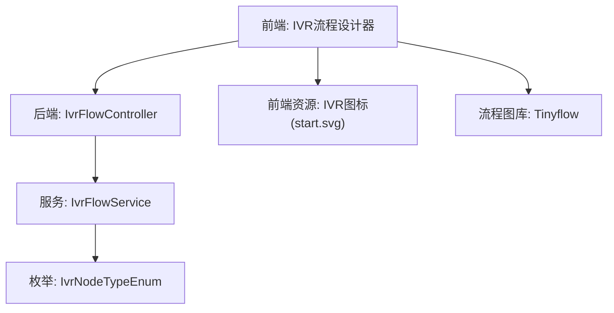
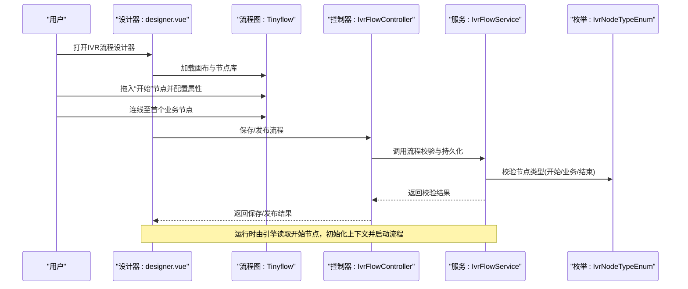
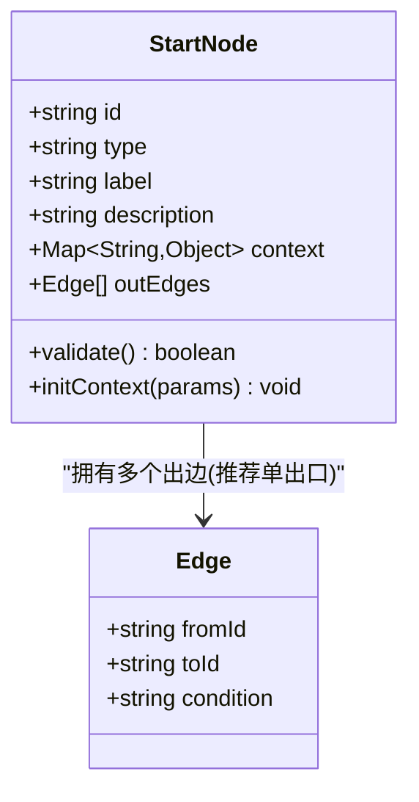
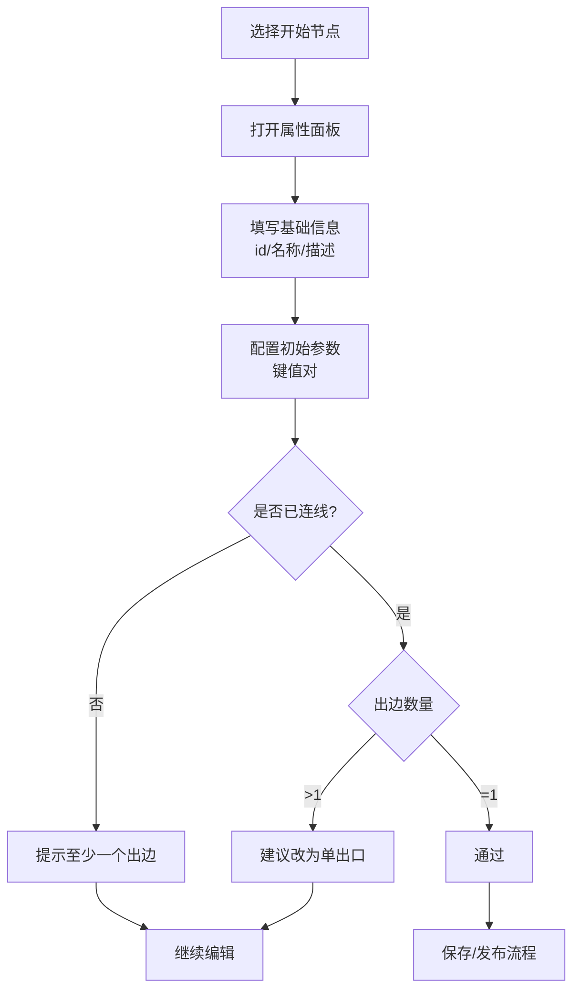
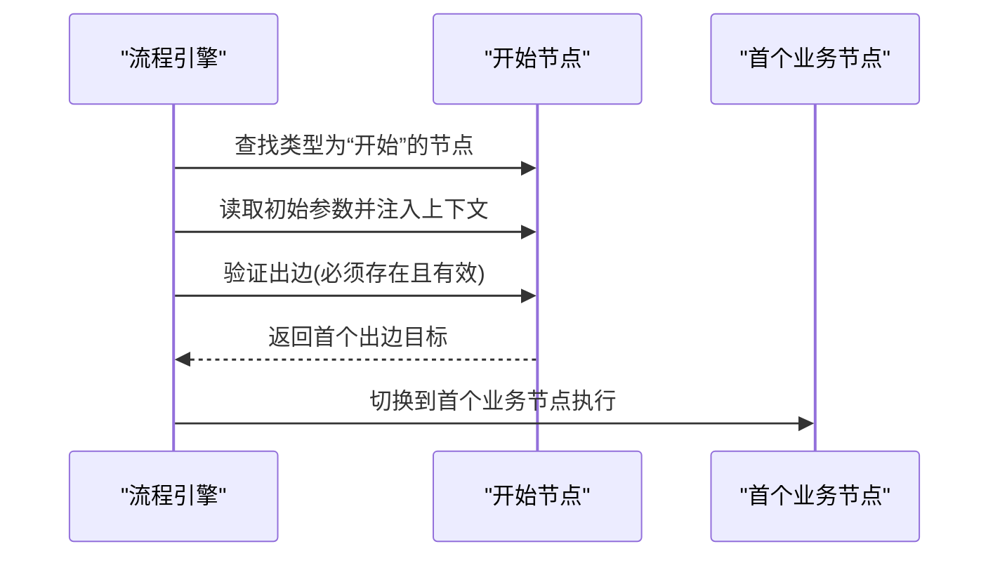
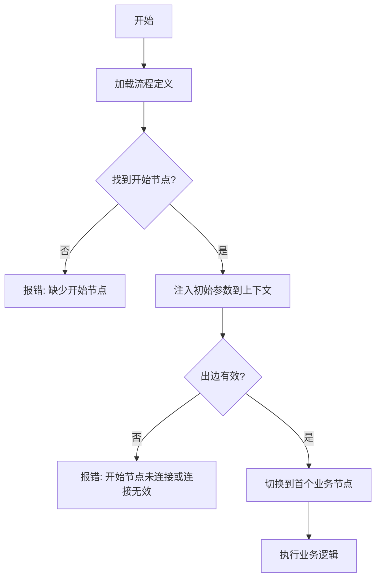
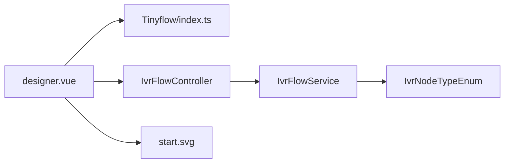

# 开始节点

<cite>
**本文引用的文件**
- [yudao-ui-admin-vue3/src/assets/ivr/start.svg](file://yudao-ui-admin-vue3/src/assets/ivr/start.svg)
- [yudao-ui-admin-vue3/src/components/Tinyflow/index.ts](file://yudao-ui-admin-vue3/src/components/Tinyflow/index.ts)
- [yudao-ui-admin-vue3/src/views/cc/ivr/designer.vue](file://yudao-ui-admin-vue3/src/views/cc/ivr/designer.vue)
- [yudao-ui-admin-vue3/src/api/cc/ivr-flow.ts](file://yudao-ui-admin-vue3/src/api/cc/ivr-flow.ts)
- [yudao-module-cc-server/src/main/java/cn/iocoder/yudao/module/cc/controller/admin/ivr/IvrFlowController.java](file://yudao-module-cc-server/src/main/java/cn/iocoder/yudao/module/cc/controller/admin/ivr/IvrFlowController.java)
- [yudao-module-cc-server/src/main/java/cn/iocoder/yudao/module/cc/service/ivr/IvrFlowService.java](file://yudao-module-cc-server/src/main/java/cn/iocoder/yudao/module/cc/service/ivr/IvrFlowService.java)
- [yudao-module-cc-api/src/main/java/cn/iocoder/yudao/module/cc/enums/IvrNodeTypeEnum.java](file://yudao-module-cc-api/src/main/java/cn/iocoder/yudao/module/cc/enums/IvrNodeTypeEnum.java)
</cite>

## 目录
1. [简介](#简介)
2. [项目结构](#项目结构)
3. [核心组件](#核心组件)
4. [架构总览](#架构总览)
5. [详细组件分析](#详细组件分析)
6. [依赖关系分析](#依赖关系分析)
7. [性能考虑](#性能考虑)
8. [故障排查指南](#故障排查指南)
9. [结论](#结论)
10. [附录](#附录)

## 简介
本章节面向IVR（交互式语音应答）流程中的“开始节点”，说明其作为流程入口点的作用、配置项、UI表现、数据模型与连接规则，并给出最佳实践与常见问题解决方案。开始节点用于初始化一次IVR通话的上下文参数，并将流程启动到首个业务节点，确保后续节点可获取必要的会话信息。

## 项目结构
与“开始节点”相关的代码主要分布在以下位置：
- 前端资源与可视化：
  - IVR节点图标资源位于 assets/ivr 目录，其中包含开始节点的SVG图标。
  - 流程图编辑器基于 Tinyflow 组件封装，提供节点拖拽、连线与属性面板。
  - IVR流程设计器页面负责承载画布、节点面板与属性编辑区。
- 后端接口与服务：
  - 管理端控制器暴露IVR流程的CRUD与发布等API。
  - 服务层负责流程校验、持久化与执行上下文构建。
  - 枚举定义IVR节点类型，包括“开始”等类型标识。

图表来源
- [yudao-ui-admin-vue3/src/assets/ivr/start.svg](file://yudao-ui-admin-vue3/src/assets/ivr/start.svg)
- [yudao-ui-admin-vue3/src/components/Tinyflow/index.ts](file://yudao-ui-admin-vue3/src/components/Tinyflow/index.ts)
- [yudao-ui-admin-vue3/src/views/cc/ivr/designer.vue](file://yudao-ui-admin-vue3/src/views/cc/ivr/designer.vue)
- [yudao-module-cc-server/src/main/java/cn/iocoder/yudao/module/cc/controller/admin/ivr/IvrFlowController.java](file://yudao-module-cc-server/src/main/java/cn/iocoder/yudao/module/cc/controller/admin/ivr/IvrFlowController.java)
- [yudao-module-cc-server/src/main/java/cn/iocoder/yudao/module/cc/service/ivr/IvrFlowService.java](file://yudao-module-cc-server/src/main/java/cn/iocoder/yudao/module/cc/service/ivr/IvrFlowService.java)
- [yudao-module-cc-api/src/main/java/cn/iocoder/yudao/module/cc/enums/IvrNodeTypeEnum.java](file://yudao-module-cc-api/src/main/java/cn/iocoder/yudao/module/cc/enums/IvrNodeTypeEnum.java)

章节来源
- [yudao-ui-admin-vue3/src/assets/ivr/start.svg](file://yudao-ui-admin-vue3/src/assets/ivr/start.svg)
- [yudao-ui-admin-vue3/src/components/Tinyflow/index.ts](file://yudao-ui-admin-vue3/src/components/Tinyflow/index.ts)
- [yudao-ui-admin-vue3/src/views/cc/ivr/designer.vue](file://yudao-ui-admin-vue3/src/views/cc/ivr/designer.vue)
- [yudao-module-cc-server/src/main/java/cn/iocoder/yudao/module/cc/controller/admin/ivr/IvrFlowController.java](file://yudao-module-cc-server/src/main/java/cn/iocoder/yudao/module/cc/controller/admin/ivr/IvrFlowController.java)
- [yudao-module-cc-server/src/main/java/cn/iocoder/yudao/module/cc/service/ivr/IvrFlowService.java](file://yudao-module-cc-server/src/main/java/cn/iocoder/yudao/module/cc/service/ivr/IvrFlowService.java)
- [yudao-module-cc-api/src/main/java/cn/iocoder/yudao/module/cc/enums/IvrNodeTypeEnum.java](file://yudao-module-cc-api/src/main/java/cn/iocoder/yudao/module/cc/enums/IvrNodeTypeEnum.java)

## 核心组件
- 开始节点（Start Node）
  - 角色：IVR流程的唯一入口，负责初始化会话上下文、注入初始参数，并触发流程进入第一个业务节点。
  - 关键能力：
    - 节点属性设置：如节点ID、显示名称、描述、标签等元信息。
    - 初始参数传递：将来电号码、渠道、时间戳、租户信息等放入流程上下文，供后续节点读取。
    - 流程启动逻辑：校验流程有效性后，将执行指针移动到首个后继节点。
- 流程图编辑器（Tinyflow + 自定义面板）
  - 提供节点创建、连线、属性编辑与预览能力。
  - 对开始节点进行特殊处理：限制入边数量、强制单出口等。
- 后端流程服务
  - 负责保存、校验与发布流程；在运行时根据开始节点构造执行上下文。
- 节点类型枚举
  - 统一节点类型标识，确保前后端一致识别“开始”节点。

章节来源
- [yudao-ui-admin-vue3/src/components/Tinyflow/index.ts](file://yudao-ui-admin-vue3/src/components/Tinyflow/index.ts)
- [yudao-ui-admin-vue3/src/views/cc/ivr/designer.vue](file://yudao-ui-admin-vue3/src/views/cc/ivr/designer.vue)
- [yudao-module-cc-server/src/main/java/cn/iocoder/yudao/module/cc/service/ivr/IvrFlowService.java](file://yudao-module-cc-server/src/main/java/cn/iocoder/yudao/module/cc/service/ivr/IvrFlowService.java)
- [yudao-module-cc-api/src/main/java/cn/iocoder/yudao/module/cc/enums/IvrNodeTypeEnum.java](file://yudao-module-cc-api/src/main/java/cn/iocoder/yudao/module/cc/enums/IvrNodeTypeEnum.java)

## 架构总览
下图展示了从前端设计器到后端服务的端到端交互，以及开始节点在流程启动时的职责边界。

图表来源
- [yudao-ui-admin-vue3/src/views/cc/ivr/designer.vue](file://yudao-ui-admin-vue3/src/views/cc/ivr/designer.vue)
- [yudao-ui-admin-vue3/src/components/Tinyflow/index.ts](file://yudao-ui-admin-vue3/src/components/Tinyflow/index.ts)
- [yudao-module-cc-server/src/main/java/cn/iocoder/yudao/module/cc/controller/admin/ivr/IvrFlowController.java](file://yudao-module-cc-server/src/main/java/cn/iocoder/yudao/module/cc/controller/admin/ivr/IvrFlowController.java)
- [yudao-module-cc-server/src/main/java/cn/iocoder/yudao/module/cc/service/ivr/IvrFlowService.java](file://yudao-module-cc-server/src/main/java/cn/iocoder/yudao/module/cc/service/ivr/IvrFlowService.java)
- [yudao-module-cc-api/src/main/java/cn/iocoder/yudao/module/cc/enums/IvrNodeTypeEnum.java](file://yudao-module-cc-api/src/main/java/cn/iocoder/yudao/module/cc/enums/IvrNodeTypeEnum.java)

## 详细组件分析

### 开始节点的数据模型
- 节点标识
  - id：唯一标识，用于流程内定位与调试。
  - type：节点类型，使用枚举值表示“开始”。
  - label/name/description：用于界面展示与文档说明。
- 连接关系
  - 入边：通常不允许或仅允许系统隐式入边（流程起点）。
  - 出边：建议单出口，指向首个业务节点，避免歧义。
- 状态管理
  - 草稿/已发布/已下线等生命周期状态由流程级管理，开始节点本身不维护运行态。
- 初始参数
  - 常见字段：来电号码、渠道、时间戳、租户、会话ID等，具体以实际实现为准。

图表来源
- [yudao-module-cc-api/src/main/java/cn/iocoder/yudao/module/cc/enums/IvrNodeTypeEnum.java](file://yudao-module-cc-api/src/main/java/cn/iocoder/yudao/module/cc/enums/IvrNodeTypeEnum.java)
- [yudao-ui-admin-vue3/src/components/Tinyflow/index.ts](file://yudao-ui-admin-vue3/src/components/Tinyflow/index.ts)

章节来源
- [yudao-module-cc-api/src/main/java/cn/iocoder/yudao/module/cc/enums/IvrNodeTypeEnum.java](file://yudao-module-cc-api/src/main/java/cn/iocoder/yudao/module/cc/enums/IvrNodeTypeEnum.java)
- [yudao-ui-admin-vue3/src/components/Tinyflow/index.ts](file://yudao-ui-admin-vue3/src/components/Tinyflow/index.ts)

### 开始节点的UI界面设计
- 节点图标
  - 使用 assets/ivr/start.svg 作为开始节点的视觉标识，便于在画布中快速识别。
- 标签显示
  - 节点下方显示名称/标签，支持编辑与国际化。
- 基本配置面板
  - 节点属性：id、类型（只读）、名称、描述。
  - 初始参数：键值对形式的上下文变量，供后续节点读取。
  - 连线约束：禁止添加入边；出边建议为单出口。
  - 校验提示：当无出边或多出边时给出警告。

图表来源
- [yudao-ui-admin-vue3/src/assets/ivr/start.svg](file://yudao-ui-admin-vue3/src/assets/ivr/start.svg)
- [yudao-ui-admin-vue3/src/views/cc/ivr/designer.vue](file://yudao-ui-admin-vue3/src/views/cc/ivr/designer.vue)

章节来源
- [yudao-ui-admin-vue3/src/assets/ivr/start.svg](file://yudao-ui-admin-vue3/src/assets/ivr/start.svg)
- [yudao-ui-admin-vue3/src/views/cc/ivr/designer.vue](file://yudao-ui-admin-vue3/src/views/cc/ivr/designer.vue)

### 开始节点的连接规则与触发机制
- 连接规则
  - 入边：不允许外部节点直接连入开始节点（流程起点）。
  - 出边：推荐单出口，指向首个业务节点；若存在多出口，需明确条件分支策略。
- 触发机制
  - 流程启动时，引擎识别类型为“开始”的节点，读取其初始参数并注入上下文。
  - 随后将执行指针移动到首个后继节点，开始执行业务逻辑。

图表来源
- [yudao-module-cc-server/src/main/java/cn/iocoder/yudao/module/cc/service/ivr/IvrFlowService.java](file://yudao-module-cc-server/src/main/java/cn/iocoder/yudao/module/cc/service/ivr/IvrFlowService.java)
- [yudao-module-cc-api/src/main/java/cn/iocoder/yudao/module/cc/enums/IvrNodeTypeEnum.java](file://yudao-module-cc-api/src/main/java/cn/iocoder/yudao/module/cc/enums/IvrNodeTypeEnum.java)

章节来源
- [yudao-module-cc-server/src/main/java/cn/iocoder/yudao/module/cc/service/ivr/IvrFlowService.java](file://yudao-module-cc-server/src/main/java/cn/iocoder/yudao/module/cc/service/ivr/IvrFlowService.java)
- [yudao-module-cc-api/src/main/java/cn/iocoder/yudao/module/cc/enums/IvrNodeTypeEnum.java](file://yudao-module-cc-api/src/main/java/cn/iocoder/yudao/module/cc/enums/IvrNodeTypeEnum.java)

### 开始节点的属性设置与初始参数传递
- 属性设置
  - id：流程内唯一，便于追踪与排障。
  - type：固定为“开始”，由系统控制。
  - 名称/描述：用于界面展示与文档说明。
- 初始参数传递
  - 通过键值对形式注入上下文，例如：来电号码、渠道、时间戳、租户、会话ID等。
  - 建议在开始节点集中声明所有必要参数，避免分散配置导致不一致。

章节来源
- [yudao-ui-admin-vue3/src/views/cc/ivr/designer.vue](file://yudao-ui-admin-vue3/src/views/cc/ivr/designer.vue)
- [yudao-module-cc-server/src/main/java/cn/iocoder/yudao/module/cc/service/ivr/IvrFlowService.java](file://yudao-module-cc-server/src/main/java/cn/iocoder/yudao/module/cc/service/ivr/IvrFlowService.java)

### 流程启动逻辑
- 设计阶段
  - 在设计器中添加开始节点，配置属性与初始参数，并连接到首个业务节点。
  - 保存流程，后端进行结构校验（节点类型、连接合法性）。
- 运行阶段
  - 引擎加载已发布的流程，定位开始节点，注入上下文，跳转到首个业务节点执行。
  - 若校验失败（如无出边、类型错误），则阻止发布或运行。

图表来源
- [yudao-module-cc-server/src/main/java/cn/iocoder/yudao/module/cc/service/ivr/IvrFlowService.java](file://yudao-module-cc-server/src/main/java/cn/iocoder/yudao/module/cc/service/ivr/IvrFlowService.java)
- [yudao-module-cc-api/src/main/java/cn/iocoder/yudao/module/cc/enums/IvrNodeTypeEnum.java](file://yudao-module-cc-api/src/main/java/cn/iocoder/yudao/module/cc/enums/IvrNodeTypeEnum.java)

章节来源
- [yudao-module-cc-server/src/main/java/cn/iocoder/yudao/module/cc/service/ivr/IvrFlowService.java](file://yudao-module-cc-server/src/main/java/cn/iocoder/yudao/module/cc/service/ivr/IvrFlowService.java)
- [yudao-module-cc-api/src/main/java/cn/iocoder/yudao/module/cc/enums/IvrNodeTypeEnum.java](file://yudao-module-cc-api/src/main/java/cn/iocoder/yudao/module/cc/enums/IvrNodeTypeEnum.java)

## 依赖关系分析
- 前端依赖
  - 设计器页面依赖 Tinyflow 组件库进行可视化编辑。
  - 开始节点图标来自 assets/ivr/start.svg。
- 后端依赖
  - 控制器暴露流程管理API。
  - 服务层负责流程校验与执行上下文构建。
  - 枚举定义节点类型，保证前后端一致性。

图表来源
- [yudao-ui-admin-vue3/src/views/cc/ivr/designer.vue](file://yudao-ui-admin-vue3/src/views/cc/ivr/designer.vue)
- [yudao-ui-admin-vue3/src/components/Tinyflow/index.ts](file://yudao-ui-admin-vue3/src/components/Tinyflow/index.ts)
- [yudao-module-cc-server/src/main/java/cn/iocoder/yudao/module/cc/controller/admin/ivr/IvrFlowController.java](file://yudao-module-cc-server/src/main/java/cn/iocoder/yudao/module/cc/controller/admin/ivr/IvrFlowController.java)
- [yudao-module-cc-server/src/main/java/cn/iocoder/yudao/module/cc/service/ivr/IvrFlowService.java](file://yudao-module-cc-server/src/main/java/cn/iocoder/yudao/module/cc/service/ivr/IvrFlowService.java)
- [yudao-module-cc-api/src/main/java/cn/iocoder/yudao/module/cc/enums/IvrNodeTypeEnum.java](file://yudao-module-cc-api/src/main/java/cn/iocoder/yudao/module/cc/enums/IvrNodeTypeEnum.java)
- [yudao-ui-admin-vue3/src/assets/ivr/start.svg](file://yudao-ui-admin-vue3/src/assets/ivr/start.svg)

章节来源
- [yudao-ui-admin-vue3/src/views/cc/ivr/designer.vue](file://yudao-ui-admin-vue3/src/views/cc/ivr/designer.vue)
- [yudao-ui-admin-vue3/src/components/Tinyflow/index.ts](file://yudao-ui-admin-vue3/src/components/Tinyflow/index.ts)
- [yudao-module-cc-server/src/main/java/cn/iocoder/yudao/module/cc/controller/admin/ivr/IvrFlowController.java](file://yudao-module-cc-server/src/main/java/cn/iocoder/yudao/module/cc/controller/admin/ivr/IvrFlowController.java)
- [yudao-module-cc-server/src/main/java/cn/iocoder/yudao/module/cc/service/ivr/IvrFlowService.java](file://yudao-module-cc-server/src/main/java/cn/iocoder/yudao/module/cc/service/ivr/IvrFlowService.java)
- [yudao-module-cc-api/src/main/java/cn/iocoder/yudao/module/cc/enums/IvrNodeTypeEnum.java](file://yudao-module-cc-api/src/main/java/cn/iocoder/yudao/module/cc/enums/IvrNodeTypeEnum.java)
- [yudao-ui-admin-vue3/src/assets/ivr/start.svg](file://yudao-ui-admin-vue3/src/assets/ivr/start.svg)

## 性能考虑
- 减少不必要的上下文变量：仅在开始节点注入必要参数，降低序列化与传输开销。
- 单出口优先：简化执行路径，提高引擎调度效率。
- 缓存热点数据：对于频繁读取的初始参数，可在服务层进行缓存（视实现而定）。
- 校验前置：在设计期完成连接与类型校验，减少运行时错误分支。

[本节为通用指导，无需特定文件引用]

## 故障排查指南
- 问题：开始节点无出边
  - 现象：无法发布或运行时报错。
  - 处理：在设计器中为开始节点添加至少一个出边，指向首个业务节点。
- 问题：开始节点有多条出边
  - 现象：流程分支不明确，可能导致执行歧义。
  - 处理：建议改为单出口；如需多分支，应在首个业务节点处进行条件判断。
- 问题：初始参数缺失
  - 现象：后续节点读取不到必要上下文。
  - 处理：在开始节点完善初始参数，并在服务层进行必填校验。
- 问题：节点类型不匹配
  - 现象：后端校验失败。
  - 处理：确认开始节点type值为“开始”，并与枚举保持一致。

章节来源
- [yudao-ui-admin-vue3/src/views/cc/ivr/designer.vue](file://yudao-ui-admin-vue3/src/views/cc/ivr/designer.vue)
- [yudao-module-cc-server/src/main/java/cn/iocoder/yudao/module/cc/service/ivr/IvrFlowService.java](file://yudao-module-cc-server/src/main/java/cn/iocoder/yudao/module/cc/service/ivr/IvrFlowService.java)
- [yudao-module-cc-api/src/main/java/cn/iocoder/yudao/module/cc/enums/IvrNodeTypeEnum.java](file://yudao-module-cc-api/src/main/java/cn/iocoder/yudao/module/cc/enums/IvrNodeTypeEnum.java)

## 结论
开始节点是IVR流程的入口点，承担上下文初始化与流程启动的关键职责。通过合理的属性设置、严格的连接规则与清晰的初始参数传递，可以显著提升流程的可维护性与运行稳定性。建议在设计期严格校验，在运行期保持最小化的上下文与明确的执行路径。

[本节为总结性内容，无需特定文件引用]

## 附录
- 相关API参考
  - 流程管理接口：见控制器文件。
  - 流程服务：见服务文件。
  - 节点类型枚举：见枚举文件。
- 前端资源
  - 开始节点图标：assets/ivr/start.svg。
  - 流程图编辑器：Tinyflow 组件封装。

章节来源
- [yudao-module-cc-server/src/main/java/cn/iocoder/yudao/module/cc/controller/admin/ivr/IvrFlowController.java](file://yudao-module-cc-server/src/main/java/cn/iocoder/yudao/module/cc/controller/admin/ivr/IvrFlowController.java)
- [yudao-module-cc-server/src/main/java/cn/iocoder/yudao/module/cc/service/ivr/IvrFlowService.java](file://yudao-module-cc-server/src/main/java/cn/iocoder/yudao/module/cc/service/ivr/IvrFlowService.java)
- [yudao-module-cc-api/src/main/java/cn/iocoder/yudao/module/cc/enums/IvrNodeTypeEnum.java](file://yudao-module-cc-api/src/main/java/cn/iocoder/yudao/module/cc/enums/IvrNodeTypeEnum.java)
- [yudao-ui-admin-vue3/src/assets/ivr/start.svg](file://yudao-ui-admin-vue3/src/assets/ivr/start.svg)
- [yudao-ui-admin-vue3/src/components/Tinyflow/index.ts](file://yudao-ui-admin-vue3/src/components/Tinyflow/index.ts)