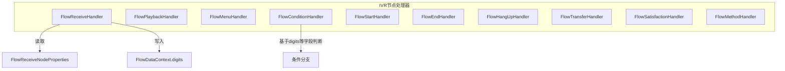
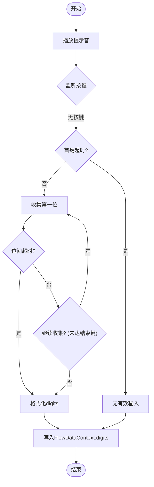
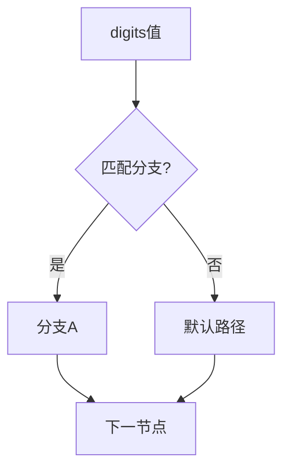
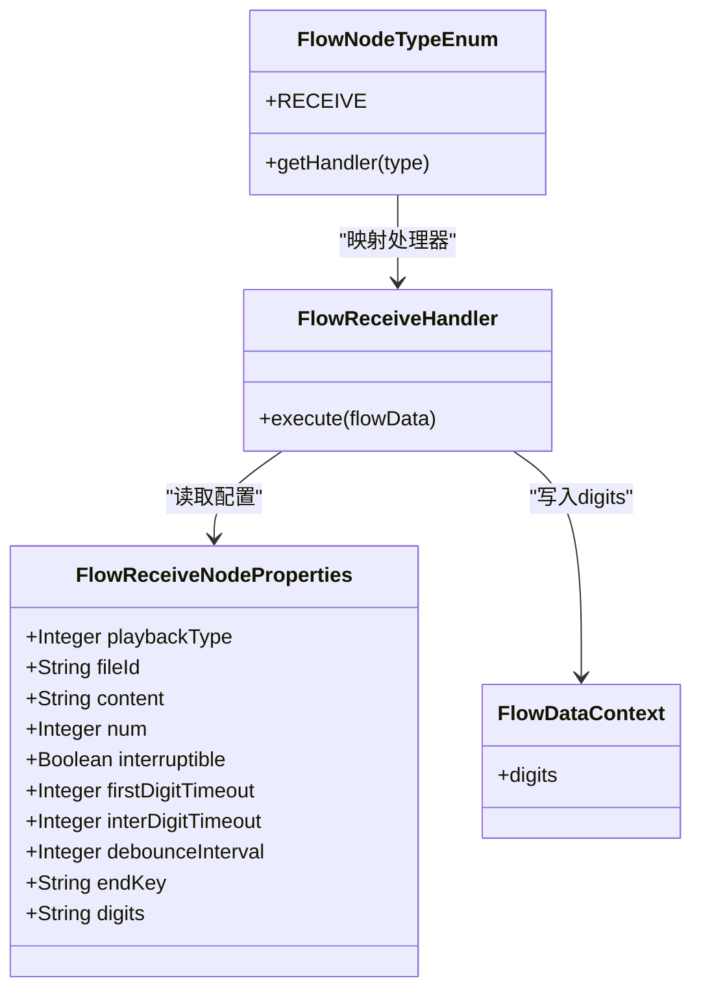

# 按键接收节点

<cite>
**本文引用的文件**
- [FlowReceiveNodeProperties.java](file://yudao-cloud/yudao-module-cc/yudao-module-cc-server/src/main/java/cn/iocoder/yudao/module/cc/ivr/properties/FlowReceiveNodeProperties.java)
- [FlowReceiveHandler.java](file://yudao-cloud/yudao-module-cc/yudao-module-cc-server/src/main/java/cn/iocoder/yudao/module/cc/ivr/handler/node/FlowReceiveHandler.java)
- [FlowNodeTypeEnum.java](file://yudao-cloud/yudao-module-cc/yudao-module-cc-server/src/main/java/cn/iocoder/yudao/module/cc/ivr/enums/FlowNodeTypeEnum.java)
- [AbstractIFlowNodeHandler.java](file://yudao-cloud/yudao-module-cc/yudao-module-cc-server/src/main/java/cn/iocoder/yudao/module/cc/ivr/handler/node/AbstractIFlowNodeHandler.java)
- [FlowConditionEvaluator.java](file://yudao-cloud/yudao-module-cc/yudao-module-cc-server/src/main/java/cn/iocoder/yudao/module/cc/ivr/handler/node/FlowConditionEvaluator.java)
- [FlowConditionHandler.java](file://yudao-cloud/yudao-module-cc/yudao-module-cc-server/src/main/java/cn/iocoder/yudao/module/cc/ivr/handler/node/FlowConditionHandler.java)
- [FlowMenuHandler.java](file://yudao-cloud/yudao-module-cc/yudao-module-cc-server/src/main/java/cn/iocoder/yudao/module/cc/ivr/handler/node/FlowMenuHandler.java)
- [FlowPlaybackHandler.java](file://yudao-cloud/yudao-module-cc/yudao-module-cc-server/src/main/java/cn/iocoder/yudao/module/cc/ivr/handler/node/FlowPlaybackHandler.java)
- [FlowStartHandler.java](file://yudao-cloud/yudao-module-cc/yudao-module-cc-server/src/main/java/cn/iocoder/yudao/module/cc/ivr/handler/node/FlowStartHandler.java)
- [FlowEndHandler.java](file://yudao-cloud/yudao-module-cc/yudao-module-cc-server/src/main/java/cn/iocoder/yudao/module/cc/ivr/handler/node/FlowEndHandler.java)
- [FlowHangUpHandler.java](file://yudao-cloud/yudao-module-cc/yudao-module-cc-server/src/main/java/cn/iocoder/yudao/module/cc/ivr/handler/node/FlowHangUpHandler.java)
- [FlowTransferHandler.java](file://yudao-cloud/yudao-module-cc/yudao-module-cc-server/src/main/java/cn/iocoder/yudao/module/cc/ivr/handler/node/FlowTransferHandler.java)
- [FlowSatisfactionHandler.java](file://yudao-cloud/yudao-module-cc/yudao-module-cc-server/src/main/java/cn/iocoder/yudao/module/cc/ivr/handler/node/FlowSatisfactionHandler.java)
- [FlowMethodHandler.java](file://yudao-cloud/yudao-module-cc/yudao-module-cc-server/src/main/java/cn/iocoder/yudao/module/cc/ivr/handler/node/FlowMethodHandler.java)
- [FlowNodeHanderConstant.java](file://yudao-cloud/yudao-module-cc/yudao-module-cc-server/src/main/java/cn/iocoder/yudao/module/cc/ivr/constant/FlowNodeHanderConstant.java)
- [FlowDataContext.java](file://yudao-cloud/yudao-module-cc/yudao-module-cc-server/src/main/java/cn/iocoder/yudao/module/cc/esl/dto/FlowDataContext.java)
</cite>

## 目录
1. [简介](#简介)
2. [项目结构](#项目结构)
3. [核心组件](#核心组件)
4. [架构总览](#架构总览)
5. [详细组件分析](#详细组件分析)
6. [依赖关系分析](#依赖关系分析)
7. [性能考量](#性能考量)
8. [故障排查指南](#故障排查指南)
9. [结论](#结论)
10. [附录](#附录)

## 简介
本章节面向IVR流程中的“按键接收节点”，说明其用于收集用户DTMF按键输入的功能特性、配置项、处理逻辑与条件分支实现，并提供用户体验优化建议与错误处理最佳实践。该节点在流程中负责：
- 播放提示音（支持语音文件或文本转语音）
- 监听并收集用户按键输入
- 对输入进行超时控制与格式化处理
- 将结果输出到流程上下文，供后续节点使用

## 项目结构
按键接收节点位于CC模块的IVR子系统中，采用“节点处理器”模式组织代码：
- 节点属性定义：FlowReceiveNodeProperties
- 节点处理器：FlowReceiveHandler（继承抽象基类）
- 节点类型枚举：FlowNodeTypeEnum（包含 RECEIVE 类型）
- 其他相关节点处理器：开始、放音、菜单、判断、转接、挂机、满意度、方法调用等
- 流程数据上下文：FlowDataContext（承载收号结果 digits）



图表来源
- [FlowReceiveHandler.java:1-23](file://yudao-cloud/yudao-module-cc/yudao-module-cc-server/src/main/java/cn/iocoder/yudao/module/cc/ivr/handler/node/FlowReceiveHandler.java#L1-L23)
- [FlowReceiveNodeProperties.java:1-68](file://yudao-cloud/yudao-module-cc/yudao-module-cc-server/src/main/java/cn/iocoder/yudao/module/cc/ivr/properties/FlowReceiveNodeProperties.java#L1-L68)
- [FlowNodeTypeEnum.java:1-50](file://yudao-cloud/yudao-module-cc/yudao-module-cc-server/src/main/java/cn/iocoder/yudao/module/cc/ivr/enums/FlowNodeTypeEnum.java#L1-L50)
- [FlowDataContext.java](file://yudao-cloud/yudao-module-cc/yudao-module-cc-server/src/main/java/cn/iocoder/yudao/module/cc/esl/dto/FlowDataContext.java)

章节来源
- [FlowReceiveHandler.java:1-23](file://yudao-cloud/yudao-module-cc/yudao-module-cc-server/src/main/java/cn/iocoder/yudao/module/cc/ivr/handler/node/FlowReceiveHandler.java#L1-L23)
- [FlowReceiveNodeProperties.java:1-68](file://yudao-cloud/yudao-module-cc/yudao-module-cc-server/src/main/java/cn/iocoder/yudao/module/cc/ivr/properties/FlowReceiveNodeProperties.java#L1-L68)
- [FlowNodeTypeEnum.java:1-50](file://yudao-cloud/yudao-module-cc/yudao-module-cc-server/src/main/java/cn/iocoder/yudao/module/cc/ivr/enums/FlowNodeTypeEnum.java#L1-L50)

## 核心组件
- FlowReceiveNodeProperties：定义按键接收节点的配置项，包括提示音类型、文件ID或文本内容、播放次数、是否可打断、首键超时、位间超时、防抖间隔、结束键以及输出字段 digits。
- FlowReceiveHandler：按键接收节点处理器，负责执行收号流程（当前为骨架实现，待完善业务逻辑）。
- FlowNodeTypeEnum：声明节点类型，其中 RECEIVE 对应收号节点及其处理器标识。
- AbstractIFlowNodeHandler：所有IVR节点处理器的抽象基类，提供统一的执行入口与上下文管理能力。
- FlowDataContext：流程运行时的数据载体，收号结果通过 digits 字段输出给后续节点使用。

章节来源
- [FlowReceiveNodeProperties.java:1-68](file://yudao-cloud/yudao-module-cc/yudao-module-cc-server/src/main/java/cn/iocoder/yudao/module/cc/ivr/properties/FlowReceiveNodeProperties.java#L1-L68)
- [FlowReceiveHandler.java:1-23](file://yudao-cloud/yudao-module-cc/yudao-module-cc-server/src/main/java/cn/iocoder/yudao/module/cc/ivr/handler/node/FlowReceiveHandler.java#L1-L23)
- [FlowNodeTypeEnum.java:1-50](file://yudao-cloud/yudao-module-cc/yudao-module-cc-server/src/main/java/cn/iocoder/yudao/module/cc/ivr/enums/FlowNodeTypeEnum.java#L1-L50)
- [AbstractIFlowNodeHandler.java](file://yudao-cloud/yudao-module-cc/yudao-module-cc-server/src/main/java/cn/iocoder/yudao/module/cc/ivr/handler/node/AbstractIFlowNodeHandler.java)
- [FlowDataContext.java](file://yudao-cloud/yudao-module-cc/yudao-module-cc-server/src/main/java/cn/iocoder/yudao/module/cc/esl/dto/FlowDataContext.java)

## 架构总览
IVR流程由多个节点串联组成，按键接收节点作为输入采集点，与放音、菜单、判断等节点协同工作。节点类型通过枚举映射到具体处理器，处理器统一继承抽象基类，保证一致的执行模型。

```mermaid
sequenceDiagram
participant Caller as "来电方"
participant FS as "FreeSWITCH"
participant CC as "CC服务(IVR)"
participant Play as "放音节点"
participant Receive as "按键接收节点"
participant Cond as "条件判断节点"
participant End as "结束/挂机节点"
Caller->>FS : 建立通话
FS->>CC : 触发流程
CC->>Play : 播放提示音
Play-->>FS : 音频流
FS-->>CC : 按键事件(DTMF)
CC->>Receive : 执行收号(监听/超时/防抖)
Receive-->>CC : 输出digits
CC->>Cond : 根据digits选择分支
Cond-->>End : 进入结束/挂机
```

图表来源
- [FlowNodeTypeEnum.java:1-50](file://yudao-cloud/yudao-module-cc/yudao-module-cc-server/src/main/java/cn/iocoder/yudao/module/cc/ivr/enums/FlowNodeTypeEnum.java#L1-L50)
- [FlowReceiveHandler.java:1-23](file://yudao-cloud/yudao-module-cc/yudao-module-cc-server/src/main/java/cn/iocoder/yudao/module/cc/ivr/handler/node/FlowReceiveHandler.java#L1-L23)
- [FlowPlaybackHandler.java](file://yudao-cloud/yudao-module-cc/yudao-module-cc-server/src/main/java/cn/iocoder/yudao/module/cc/ivr/handler/node/FlowPlaybackHandler.java)
- [FlowConditionHandler.java](file://yudao-cloud/yudao-module-cc/yudao-module-cc-server/src/main/java/cn/iocoder/yudao/module/cc/ivr/handler/node/FlowConditionHandler.java)
- [FlowEndHandler.java](file://yudao-cloud/yudao-module-cc/yudao-module-cc-server/src/main/java/cn/iocoder/yudao/module/cc/ivr/handler/node/FlowEndHandler.java)

## 详细组件分析

### 按键接收节点配置项
- 提示音设置
  - playbackType：放音类型（语音文件或文本内容）
  - fileId：语音文件ID（当类型为文件时）
  - content：文本内容（当类型为文本时）
  - num：播放次数
  - interruptible：是否允许按键打断播放
- 收号参数
  - firstDigitTimeout：首位超时秒数
  - interDigitTimeout：位间超时秒数
  - debounceInterval：防抖间隔毫秒
  - endKey：结束按键（默认“#”）
- 输出字段
  - digits：收号结果（字符串），供后续节点使用

章节来源
- [FlowReceiveNodeProperties.java:1-68](file://yudao-cloud/yudao-module-cc/yudao-module-cc-server/src/main/java/cn/iocoder/yudao/module/cc/ivr/properties/FlowReceiveNodeProperties.java#L1-L68)

### 按键接收节点处理逻辑
- 按键事件监听
  - 在播放提示音期间监听DTMF按键事件
  - 支持自定义结束键（如“#”）以提前终止收号
- 输入数据收集
  - 按位收集按键，结合位间超时判定输入完成
  - 首键超时控制首次按键等待时间
  - 防抖间隔避免重复按键导致的数据抖动
- 格式化与输出
  - 将收集的按键序列整理为字符串 digits
  - 将 digits 写入流程上下文 FlowDataContext，供后续节点读取



图表来源
- [FlowReceiveNodeProperties.java:1-68](file://yudao-cloud/yudao-module-cc/yudao-module-cc-server/src/main/java/cn/iocoder/yudao/module/cc/ivr/properties/FlowReceiveNodeProperties.java#L1-L68)
- [FlowReceiveHandler.java:1-23](file://yudao-cloud/yudao-module-cc/yudao-module-cc-server/src/main/java/cn/iocoder/yudao/module/cc/ivr/handler/node/FlowReceiveHandler.java#L1-L23)
- [FlowDataContext.java](file://yudao-cloud/yudao-module-cc/yudao-module-cc-server/src/main/java/cn/iocoder/yudao/module/cc/esl/dto/FlowDataContext.java)

### 条件分支实现
- 按键值对应的流程走向
  - 使用条件判断节点（CONDITION_NODE）依据 digits 的值进行分支路由
  - 常见分支：数字1-9、*、#、空输入等
- 默认路径处理
  - 当 digits 不匹配任何已知分支时，进入默认路径（如重新提示或转人工）
- 与收号节点的协作
  - 收号节点输出 digits，条件节点读取并评估，决定下一步节点



图表来源
- [FlowNodeTypeEnum.java:1-50](file://yudao-cloud/yudao-module-cc/yudao-module-cc-server/src/main/java/cn/iocoder/yudao/module/cc/ivr/enums/FlowNodeTypeEnum.java#L1-L50)
- [FlowConditionHandler.java](file://yudao-cloud/yudao-module-cc/yudao-module-cc-server/src/main/java/cn/iocoder/yudao/module/cc/ivr/handler/node/FlowConditionHandler.java)
- [FlowConditionEvaluator.java](file://yudao-cloud/yudao-module-cc/yudao-module-cc-server/src/main/java/cn/iocoder/yudao/module/cc/ivr/handler/node/FlowConditionEvaluator.java)

### 与其他节点的关系
- 放音节点（PLAY）：在收号前播放提示音，支持打断
- 菜单节点（MENU）：可与收号节点配合，提供菜单选项引导
- 转接节点（TRANSFER）：根据按键值转接至不同坐席或队列
- 挂机节点（HANGUP）：流程结束时挂断通话
- 满意度节点（SATISFACTION）：在特定分支后收集满意度
- 方法调用节点（METHOD）：在分支中调用外部方法或服务

章节来源
- [FlowPlaybackHandler.java](file://yudao-cloud/yudao-module-cc/yudao-module-cc-server/src/main/java/cn/iocoder/yudao/module/cc/ivr/handler/node/FlowPlaybackHandler.java)
- [FlowMenuHandler.java](file://yudao-cloud/yudao-module-cc/yudao-module-cc-server/src/main/java/cn/iocoder/yudao/module/cc/ivr/handler/node/FlowMenuHandler.java)
- [FlowTransferHandler.java](file://yudao-cloud/yudao-module-cc/yudao-module-cc-server/src/main/java/cn/iocoder/yudao/module/cc/ivr/handler/node/FlowTransferHandler.java)
- [FlowHangUpHandler.java](file://yudao-cloud/yudao-module-cc/yudao-module-cc-server/src/main/java/cn/iocoder/yudao/module/cc/ivr/handler/node/FlowHangUpHandler.java)
- [FlowSatisfactionHandler.java](file://yudao-cloud/yudao-module-cc/yudao-module-cc-server/src/main/java/cn/iocoder/yudao/module/cc/ivr/handler/node/FlowSatisfactionHandler.java)
- [FlowMethodHandler.java](file://yudao-cloud/yudao-module-cc/yudao-module-cc-server/src/main/java/cn/iocoder/yudao/module/cc/ivr/handler/node/FlowMethodHandler.java)

## 依赖关系分析
- 节点类型与处理器映射：FlowNodeTypeEnum 将“receive-node”映射到 RECEIVE_HANDLER
- 处理器注册：FlowReceiveHandler 通过常量标识注入到流程引擎
- 数据流转：FlowReceiveHandler 读取 FlowReceiveNodeProperties，向 FlowDataContext 写入 digits
- 条件分支：FlowConditionHandler 与 FlowConditionEvaluator 基于 digits 等上下文数据进行分支决策



图表来源
- [FlowReceiveNodeProperties.java:1-68](file://yudao-cloud/yudao-module-cc/yudao-module-cc-server/src/main/java/cn/iocoder/yudao/module/cc/ivr/properties/FlowReceiveNodeProperties.java#L1-L68)
- [FlowReceiveHandler.java:1-23](file://yudao-cloud/yudao-module-cc/yudao-module-cc-server/src/main/java/cn/iocoder/yudao/module/cc/ivr/handler/node/FlowReceiveHandler.java#L1-L23)
- [FlowNodeTypeEnum.java:1-50](file://yudao-cloud/yudao-module-cc/yudao-module-cc-server/src/main/java/cn/iocoder/yudao/module/cc/ivr/enums/FlowNodeTypeEnum.java#L1-L50)
- [FlowDataContext.java](file://yudao-cloud/yudao-module-cc/yudao-module-cc-server/src/main/java/cn/iocoder/yudao/module/cc/esl/dto/FlowDataContext.java)

章节来源
- [FlowNodeTypeEnum.java:1-50](file://yudao-cloud/yudao-module-cc/yudao-module-cc-server/src/main/java/cn/iocoder/yudao/module/cc/ivr/enums/FlowNodeTypeEnum.java#L1-L50)
- [FlowReceiveHandler.java:1-23](file://yudao-cloud/yudao-module-cc/yudao-module-cc-server/src/main/java/cn/iocoder/yudao/module/cc/ivr/handler/node/FlowReceiveHandler.java#L1-L23)
- [FlowReceiveNodeProperties.java:1-68](file://yudao-cloud/yudao-module-cc/yudao-module-cc-server/src/main/java/cn/iocoder/yudao/module/cc/ivr/properties/FlowReceiveNodeProperties.java#L1-L68)

## 性能考量
- 超时策略
  - 合理设置首键超时与位间超时，平衡响应速度与容错性
  - 避免过短超时导致误判，过长超时影响用户体验
- 防抖机制
  - 防抖间隔应适配设备与网络环境，减少重复按键带来的冗余处理
- 播放打断
  - 允许按键打断播放可减少用户等待，但需确保提示音关键信息完整
- 资源占用
  - 高频收号场景下注意线程与连接池管理，避免阻塞

[本节为通用指导，无需引用具体文件]

## 故障排查指南
- 常见问题
  - 无按键输入：检查首键超时是否过长；确认端侧DTMF发送是否正常
  - 输入不完整：调整位间超时与防抖间隔；验证结束键配置
  - 提示音异常：核对放音类型与文件ID/文本内容；确认打断开关
- 定位步骤
  - 查看 FlowDataContext.digits 是否为预期值
  - 检查条件分支是否正确匹配 digits
  - 回放流程日志，确认事件顺序与超时触发点
- 修复建议
  - 修正超时与防抖参数
  - 完善条件分支默认路径
  - 增加错误提示与重试机制

章节来源
- [FlowReceiveNodeProperties.java:1-68](file://yudao-cloud/yudao-module-cc/yudao-module-cc-server/src/main/java/cn/iocoder/yudao/module/cc/ivr/properties/FlowReceiveNodeProperties.java#L1-L68)
- [FlowReceiveHandler.java:1-23](file://yudao-cloud/yudao-module-cc/yudao-module-cc-server/src/main/java/cn/iocoder/yudao/module/cc/ivr/handler/node/FlowReceiveHandler.java#L1-L23)
- [FlowConditionHandler.java](file://yudao-cloud/yudao-module-cc/yudao-module-cc-server/src/main/java/cn/iocoder/yudao/module/cc/ivr/handler/node/FlowConditionHandler.java)

## 结论
按键接收节点在IVR流程中承担关键的输入采集职责。通过合理的配置项（提示音、超时、防抖、结束键）与严谨的处理逻辑（监听、收集、格式化），可以稳定地获取用户按键输入，并通过条件分支驱动后续流程。建议在生产环境中结合业务场景调优参数，完善默认路径与错误处理，以提升用户体验与系统健壮性。

[本节为总结，无需引用具体文件]

## 附录
- 节点类型参考：START、END、PLAY、MENU、RECEIVE、TRANSFER、HANGUP、SATISFACTION、CONDITION_NODE、METHOD_NODE
- 处理器常量：FlowNodeHanderConstant 定义了各节点处理器标识，便于注册与路由

章节来源
- [FlowNodeTypeEnum.java:1-50](file://yudao-cloud/yudao-module-cc/yudao-module-cc-server/src/main/java/cn/iocoder/yudao/module/cc/ivr/enums/FlowNodeTypeEnum.java#L1-L50)
- [FlowNodeHanderConstant.java](file://yudao-cloud/yudao-module-cc/yudao-module-cc-server/src/main/java/cn/iocoder/yudao/module/cc/ivr/constant/FlowNodeHanderConstant.java)