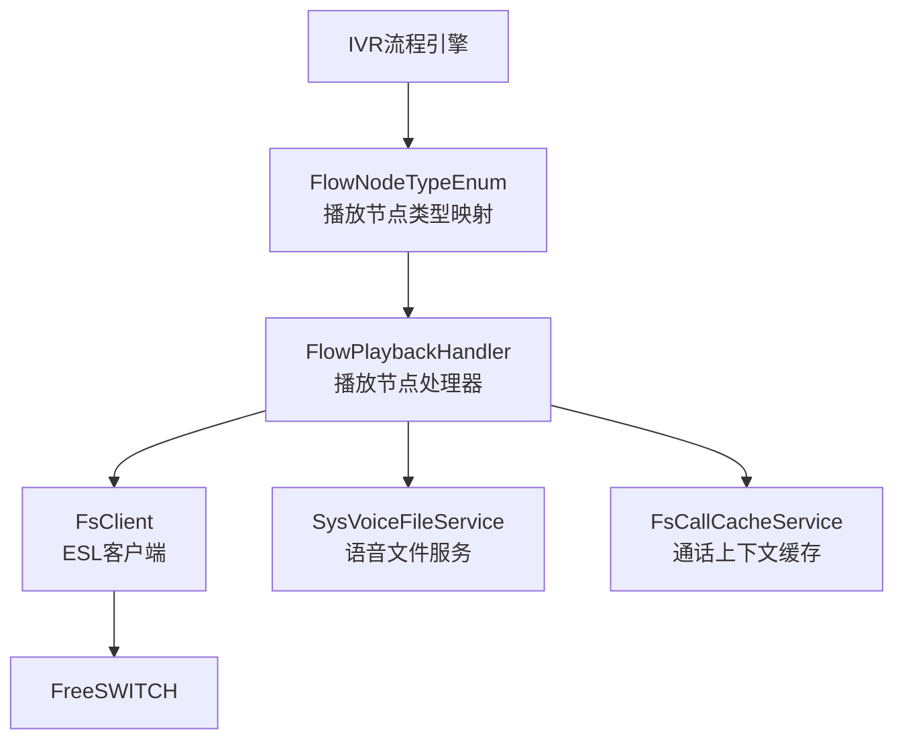
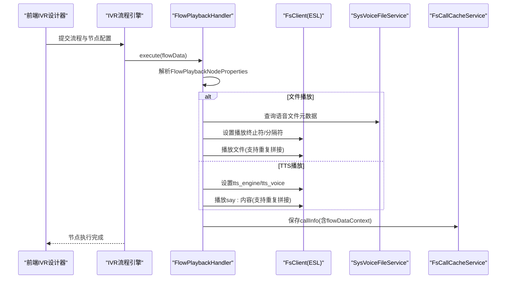
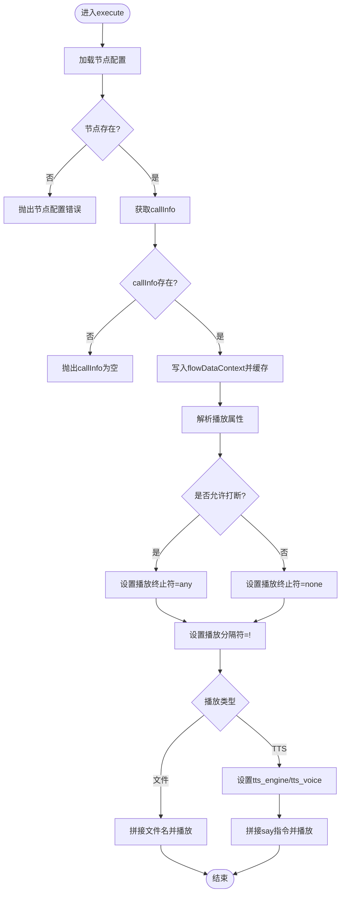
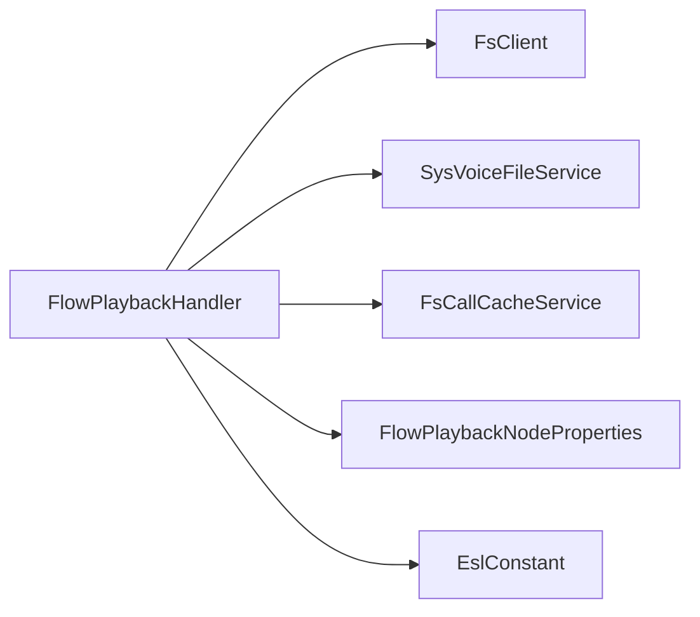

# 播放节点

<cite>
**本文引用的文件**
- [FlowPlaybackHandler.java](file://yudao-cloud/yudao-module-cc/yudao-module-cc-server/src/main/java/cn/iocoder/yudao/module/cc/ivr/handler/node/FlowPlaybackHandler.java)
- [FlowPlaybackNodeProperties.java](file://yudao-cloud/yudao-module-cc/yudao-module-cc-server/src/main/java/cn/iocoder/yudao/module/cc/ivr/properties/FlowPlaybackNodeProperties.java)
- [EslConstant.java](file://yudao-cloud/yudao-module-cc/yudao-module-cc-server/src/main/java/cn/iocoder/yudao/module/cc/esl/constant/EslConstant.java)
- [FlowNodeTypeEnum.java](file://yudao-cloud/yudao-module-cc/yudao-module-cc-server/src/main/java/cn/iocoder/yudao/module/cc/ivr/enums/FlowNodeTypeEnum.java)
</cite>

## 目录
1. [简介](#简介)
2. [项目结构](#项目结构)
3. [核心组件](#核心组件)
4. [架构总览](#架构总览)
5. [详细组件分析](#详细组件分析)
6. [依赖分析](#依赖分析)
7. [性能考虑](#性能考虑)
8. [故障排查指南](#故障排查指南)
9. [结论](#结论)
10. [附录](#附录)

## 简介
本章节面向IVR流程中的“播放节点”，说明其用于音频/TTS播放的功能特性、配置项与业务逻辑实现，包括：
- 支持的音频来源：系统语音文件与TTS文本内容
- 播放控制：打断行为、重复次数、播放分隔符
- 与FreeSWITCH的集成：通过ESL命令进行播放与参数设置
- 错误处理与状态管理：节点配置校验、通话上下文获取失败等异常路径
- 用户交互集成：播放中断与后续收号/识别事件的衔接
- 优化建议：音频格式、缓存与并发、延迟与资源占用

## 项目结构
播放节点位于CC模块的IVR子系统中，属于流程节点处理器之一。关键位置如下：
- IVR节点枚举定义播放节点类型与处理器映射
- 播放节点属性定义播放模式、打断开关、重复次数等
- 播放节点处理器负责解析配置、调用FS客户端执行播放
- ESL常量集中定义播放相关命令与通道变量

图表来源
- [FlowNodeTypeEnum.java:1-50](file://yudao-cloud/yudao-module-cc/yudao-module-cc-server/src/main/java/cn/iocoder/yudao/module/cc/ivr/enums/FlowNodeTypeEnum.java#L1-L50)
- [FlowPlaybackHandler.java:1-91](file://yudao-cloud/yudao-module-cc/yudao-module-cc-server/src/main/java/cn/iocoder/yudao/module/cc/ivr/handler/node/FlowPlaybackHandler.java#L1-L91)

章节来源
- [FlowNodeTypeEnum.java:1-50](file://yudao-cloud/yudao-module-cc/yudao-module-cc-server/src/main/java/cn/iocoder/yudao/module/cc/ivr/enums/FlowNodeTypeEnum.java#L1-L50)
- [FlowPlaybackHandler.java:1-91](file://yudao-cloud/yudao-module-cc/yudao-module-cc-server/src/main/java/cn/iocoder/yudao/module/cc/ivr/handler/node/FlowPlaybackHandler.java#L1-L91)

## 核心组件
- 播放节点处理器：负责读取节点配置、准备播放参数、下发FS播放命令
- 播放节点属性：描述是否允许打断、播放类型（文件/TTS）、文件ID或内容、重复次数
- ESL常量：集中定义播放相关的命令与通道变量，如播放终止符、分隔符、TTS引擎/音色等
- 枚举映射：将前端节点类型“playback-node”映射到后端处理器标识

章节来源
- [FlowPlaybackHandler.java:1-91](file://yudao-cloud/yudao-module-cc/yudao-module-cc-server/src/main/java/cn/iocoder/yudao/module/cc/ivr/handler/node/FlowPlaybackHandler.java#L1-L91)
- [FlowPlaybackNodeProperties.java:1-35](file://yudao-cloud/yudao-module-cc/yudao-module-cc-server/src/main/java/cn/iocoder/yudao/module/cc/ivr/properties/FlowPlaybackNodeProperties.java#L1-L35)
- [EslConstant.java:1-145](file://yudao-cloud/yudao-module-cc/yudao-module-cc-server/src/main/java/cn/iocoder/yudao/module/cc/esl/constant/EslConstant.java#L1-L145)
- [FlowNodeTypeEnum.java:1-50](file://yudao-cloud/yudao-module-cc/yudao-module-cc-server/src/main/java/cn/iocoder/yudao/module/cc/ivr/enums/FlowNodeTypeEnum.java#L1-L50)

## 架构总览
播放节点在IVR流程中作为可插拔节点被调度执行。其执行流程包括：
- 从流程上下文获取当前节点信息并解析属性
- 根据属性决定播放策略（文件/TTS、是否打断、重复次数）
- 通过FS客户端发送ESL命令完成播放
- 将通话上下文回写缓存，供后续节点使用

图表来源
- [FlowPlaybackHandler.java:35-84](file://yudao-cloud/yudao-module-cc/yudao-module-cc-server/src/main/java/cn/iocoder/yudao/module/cc/ivr/handler/node/FlowPlaybackHandler.java#L35-L84)
- [EslConstant.java:93-108](file://yudao-cloud/yudao-module-cc/yudao-module-cc-server/src/main/java/cn/iocoder/yudao/module/cc/esl/constant/EslConstant.java#L93-L108)

## 详细组件分析

### 播放节点处理器 FlowPlaybackHandler
职责与行为：
- 获取当前节点配置并解析为FlowPlaybackNodeProperties
- 校验节点与通话上下文是否存在，不存在则抛出服务异常
- 根据interrupt标志设置播放终止符（允许任意键打断或禁止打断）
- 设置播放分隔符以支持多次重复播放
- 文件播放：读取语音文件名称并按num重复拼接后播放
- TTS播放：设置TTS引擎与音色，按num重复拼接say指令后播放
- 将包含flowDataContext的callInfo写回缓存，便于后续节点读取

图表来源
- [FlowPlaybackHandler.java:35-84](file://yudao-cloud/yudao-module-cc/yudao-module-cc-server/src/main/java/cn/iocoder/yudao/module/cc/ivr/handler/node/FlowPlaybackHandler.java#L35-L84)

章节来源
- [FlowPlaybackHandler.java:35-84](file://yudao-cloud/yudao-module-cc/yudao-module-cc-server/src/main/java/cn/iocoder/yudao/module/cc/ivr/handler/node/FlowPlaybackHandler.java#L35-L84)

### 播放节点属性 FlowPlaybackNodeProperties
字段说明：
- interrupt：是否允许用户在播放过程中按键打断
- playbackType：播放类型（文件/内容）
- fileId：当类型为文件时，指定语音文件ID
- content：当类型为内容时，指定要合成的文本
- num：重复播放次数（大于1时按分隔符拼接多次）

章节来源
- [FlowPlaybackNodeProperties.java:1-35](file://yudao-cloud/yudao-module-cc/yudao-module-cc-server/src/main/java/cn/iocoder/yudao/module/cc/ivr/properties/FlowPlaybackNodeProperties.java#L1-L35)

### ESL常量 EslConstant
与播放相关的关键常量：
- PLAYBACK_TERMINATORS：控制是否允许按键终止播放
- PLAYBACK_TERMINATORS_ANY：允许任意键打断
- PLAYBACK_DELIMITER：播放分隔符，用于多次重复播放
- TTS_ENGINE/TTS_VOICE：设置TTS引擎与音色
- SPEAK/say：TTS播放指令前缀
- EXCLAMATION：用于拼接多次播放的分隔符

章节来源
- [EslConstant.java:93-108](file://yudao-cloud/yudao-module-cc/yudao-module-cc-server/src/main/java/cn/iocoder/yudao/module/cc/esl/constant/EslConstant.java#L93-L108)

### 节点类型枚举 FlowNodeTypeEnum
- 将前端节点类型“playback-node”映射到后端处理器标识，确保IVR引擎能正确路由到播放节点处理器

章节来源
- [FlowNodeTypeEnum.java:1-50](file://yudao-cloud/yudao-module-cc/yudao-module-cc-server/src/main/java/cn/iocoder/yudao/module/cc/ivr/enums/FlowNodeTypeEnum.java#L1-L50)

## 依赖分析
播放节点的直接依赖：
- FsClient：通过ESL向FreeSWITCH下发播放与参数设置命令
- SysVoiceFileService：查询语音文件元数据（名称等）
- FsCallCacheService：读写通话上下文缓存，传递flowDataContext
- FlowPlaybackNodeProperties：承载节点配置
- EslConstant：提供播放相关命令与变量常量

耦合关系与风险：
- 对FsClient强依赖，若FS不可用或连接异常将导致播放失败
- 对SysVoiceFileService依赖，文件不存在或权限问题会导致播放失败
- 对FsCallCacheService依赖，缓存异常会影响后续节点的数据一致性

图表来源
- [FlowPlaybackHandler.java:1-91](file://yudao-cloud/yudao-module-cc/yudao-module-cc-server/src/main/java/cn/iocoder/yudao/module/cc/ivr/handler/node/FlowPlaybackHandler.java#L1-L91)
- [EslConstant.java:1-145](file://yudao-cloud/yudao-module-cc/yudao-module-cc-server/src/main/java/cn/iocoder/yudao/module/cc/esl/constant/EslConstant.java#L1-L145)

章节来源
- [FlowPlaybackHandler.java:1-91](file://yudao-cloud/yudao-module-cc/yudao-module-cc-server/src/main/java/cn/iocoder/yudao/module/cc/ivr/handler/node/FlowPlaybackHandler.java#L1-L91)

## 性能考虑
- 音频格式建议：优先使用低延迟、高压缩比的格式（如G.711/G.729或高效编码的MP3/OPUS），减少带宽与解码开销
- 重复播放优化：当num较大时，避免在前端拼接过长字符串；可在FS侧使用循环播放能力以降低网络往返
- 打断与收号：合理设置播放终止符，避免过度监听DTMF造成CPU占用；结合菜单/收号节点提升交互效率
- 缓存与预热：常用语音文件可考虑本地缓存或CDN加速，降低首次播放延迟
- 并发与限流：在高并发场景下，限制同时播放的通道数，避免FS资源耗尽
- 日志与监控：记录播放开始/结束事件与错误码，便于定位卡顿与丢包问题

[本节为通用性能建议，不直接分析具体文件]

## 故障排查指南
常见问题与定位要点：
- 节点配置错误：当节点不存在或属性解析失败时会抛出服务异常，需检查流程配置与属性JSON
- callInfo为空：通话上下文未建立或缓存异常，需检查会话创建与缓存写入逻辑
- 播放无声音：确认FS通道已应答、音频文件存在且可读、TTS引擎/音色配置正确
- 无法打断：检查是否设置了播放终止符为any；若为none则不允许按键打断
- 重复播放异常：确认分隔符设置与拼接逻辑是否正确；注意FS对超长指令的限制

章节来源
- [FlowPlaybackHandler.java:35-84](file://yudao-cloud/yudao-module-cc/yudao-module-cc-server/src/main/java/cn/iocoder/yudao/module/cc/ivr/handler/node/FlowPlaybackHandler.java#L35-L84)

## 结论
播放节点提供了灵活的音频与TTS播放能力，支持打断控制、重复播放与TTS引擎切换。通过与FS的紧密集成，能够在IVR流程中实现稳定的语音交互。建议在工程实践中关注音频格式选择、缓存与并发控制，以及完善的错误处理与监控，以提升用户体验与系统稳定性。

[本节为总结性内容，不直接分析具体文件]

## 附录
- 播放节点配置项速查：
  - interrupt：是否允许按键打断
  - playbackType：文件/内容
  - fileId：文件ID（文件模式）
  - content：文本内容（TTS模式）
  - num：重复次数
- ESL相关命令参考：
  - 播放终止符：playback_terminators=none|any
  - 播放分隔符：playback_delimiter=!
  - TTS引擎与音色：tts_engine=... / tts_voice=...
  - 播放指令：playback 或 say:...

[本节为补充说明，不直接分析具体文件]