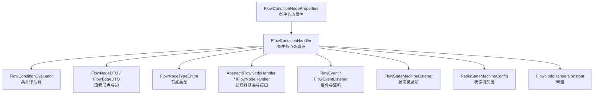
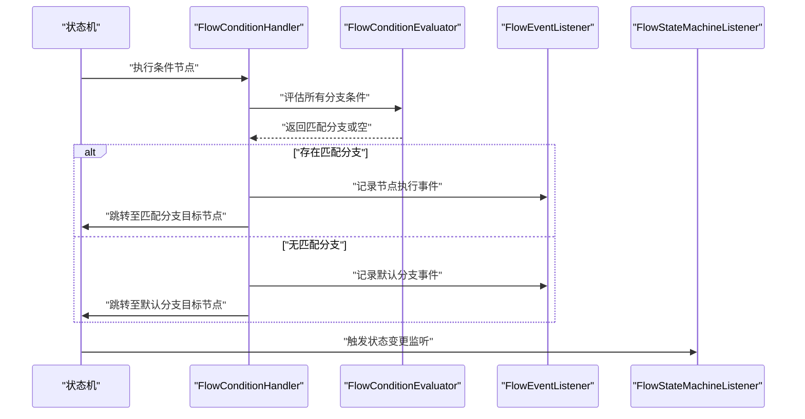
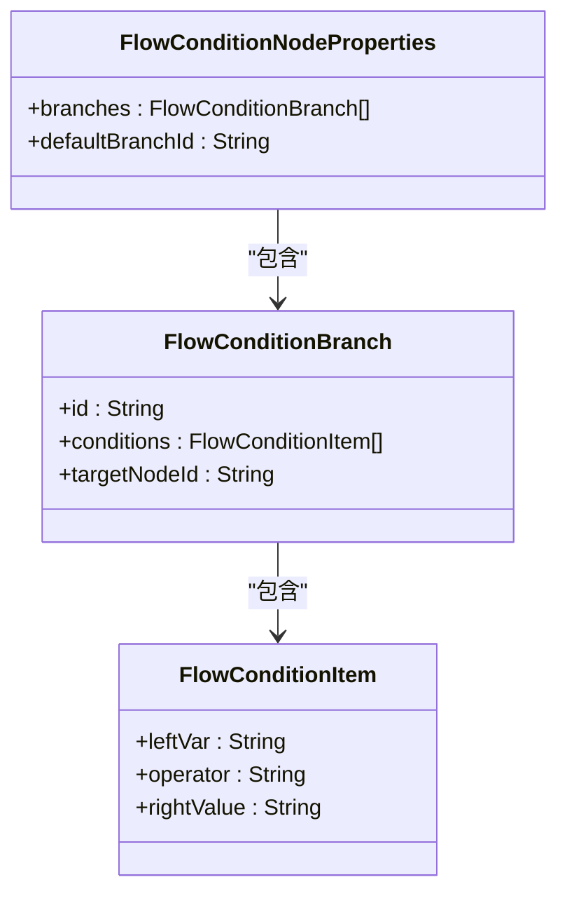
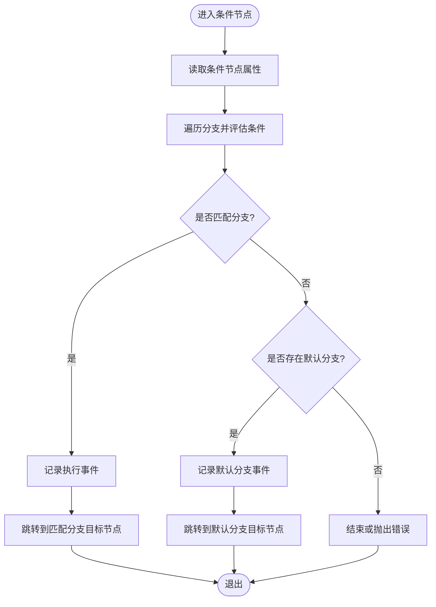
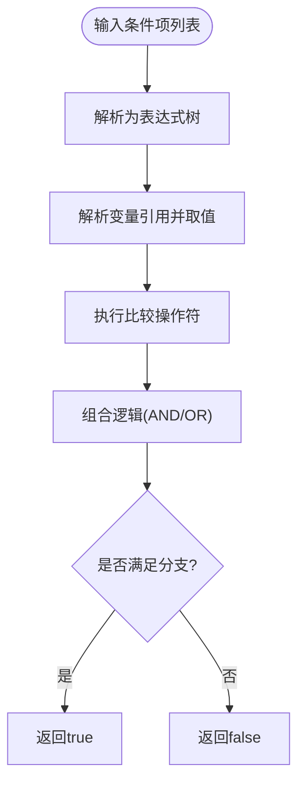
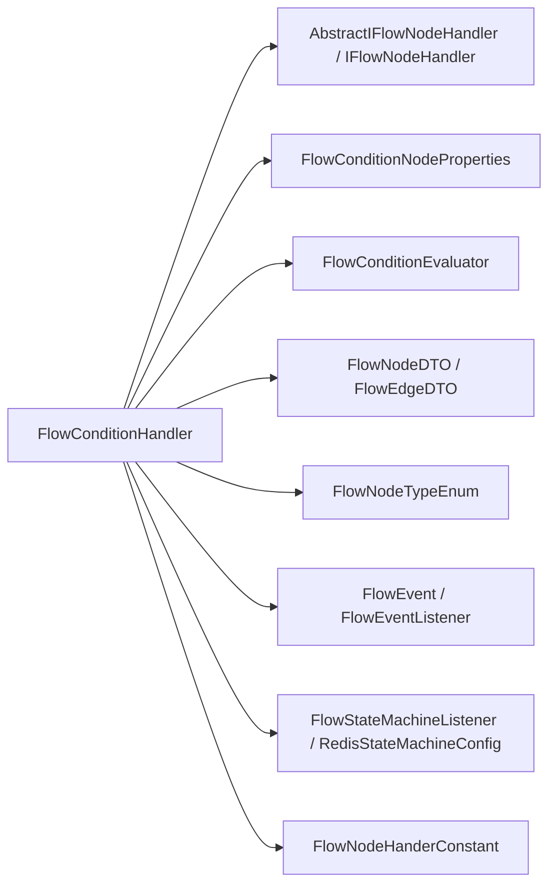

# 条件判断节点

<cite>
**本文引用的文件**
- [FlowConditionHandler.java](file://yudao-cloud/yudao-module-cc/yudao-module-cc-server/src/main/java/cn/iocoder/yudao/module/cc/ivr/handler/node/FlowConditionHandler.java)
- [FlowConditionEvaluator.java](file://yudao-cloud/yudao-module-cc/yudao-module-cc-server/src/main/java/cn/iocoder/yudao/module/cc/ivr/handler/node/FlowConditionEvaluator.java)
- [FlowConditionNodeProperties.java](file://yudao-cloud/yudao-module-cc/yudao-module-cc-server/src/main/java/cn/iocoder/yudao/module/cc/ivr/properties/FlowConditionNodeProperties.java)
- [FlowConditionItem.java](file://yudao-cloud/yudao-module-cc/yudao-module-cc-server/src/main/java/cn/iocoder/yudao/module/cc/ivr/properties/FlowConditionItem.java)
- [FlowConditionBranch.java](file://yudao-cloud/yudao-module-cc/yudao-module-cc-server/src/main/java/cn/iocoder/yudao/module/cc/ivr/properties/FlowConditionBranch.java)
- [FlowNodeDTO.java](file://yudao-cloud/yudao-module-cc/yudao-module-cc-server/src/main/java/cn/iocoder/yudao/module/cc/ivr/dto/FlowNodeDTO.java)
- [FlowEdgeDTO.java](file://yudao-cloud/yudao-module-cc/yudao-module-cc-server/src/main/java/cn/iocoder/yudao/module/cc/ivr/dto/FlowEdgeDTO.java)
- [FlowNodeTypeEnum.java](file://yudao-cloud/yudao-module-cc/yudao-module-cc-server/src/main/java/cn/iocoder/yudao/module/cc/ivr/enums/FlowNodeTypeEnum.java)
- [AbstractIFlowNodeHandler.java](file://yudao-cloud/yudao-module-cc/yudao-module-cc-server/src/main/java/cn/iocoder/yudao/module/cc/ivr/handler/node/AbstractIFlowNodeHandler.java)
- [IFlowNodeHandler.java](file://yudao-cloud/yudao-module-cc/yudao-module-cc-server/src/main/java/cn/iocoder/yudao/module/cc/ivr/handler/node/IFlowNodeHandler.java)
- [FlowEvent.java](file://yudao-cloud/yudao-module-cc/yudao-module-cc-server/src/main/java/cn/iocoder/yudao/module/cc/ivr/event/FlowEvent.java)
- [FlowEventListener.java](file://yudao-cloud/yudao-module-cc/yudao-module-cc-server/src/main/java/cn/iocoder/yudao/module/cc/ivr/listener/FlowEventListener.java)
- [FlowStateMachineListener.java](file://yudao-cloud/yudao-module-cc/yudao-module-cc-server/src/main/java/cn/iocoder/yudao/module/cc/ivr/listener/FlowStateMachineListener.java)
- [RedisStateMachineConfig.java](file://yudao-cloud/yudao-module-cc/yudao-module-cc-server/src/main/java/cn/iocoder/yudao/module/cc/ivr/config/RedisStateMachineConfig.java)
- [FlowNodeHanderConstant.java](file://yudao-cloud/yudao-module-cc/yudao-module-cc-server/src/main/java/cn/iocoder/yudao/module/cc/ivr/constant/FlowNodeHanderConstant.java)
</cite>

## 目录
1. [简介](#简介)
2. [项目结构](#项目结构)
3. [核心组件](#核心组件)
4. [架构总览](#架构总览)
5. [详细组件分析](#详细组件分析)
6. [依赖关系分析](#依赖关系分析)
7. [性能考量](#性能考量)
8. [故障排查指南](#故障排查指南)
9. [结论](#结论)
10. [附录](#附录)

## 简介
本章节面向IVR流程中的“条件判断节点”，说明其用于流程分支控制的核心能力：支持条件表达式编写、多分支判断与嵌套条件；提供配置界面说明（规则设置、分支路径、默认分支）；文档化后端业务逻辑（表达式解析引擎、变量取值机制、比较操作符）；解释与数据模型的集成方式（上下文变量访问、动态条件计算）；并给出复杂条件构建指南与性能优化建议。

## 项目结构
条件判断节点位于IVR模块的处理器与属性定义中，围绕“节点属性模型—处理器—评估器”的组织方式实现：
- 属性模型：描述节点的分支、条件项、默认分支等配置
- 处理器：负责节点执行、路由到分支
- 评估器：负责表达式解析与求值
- DTO/枚举：用于前后端交互与类型标识
- 事件与监听：用于状态机流转与审计

**图表来源**
- [FlowConditionNodeProperties.java](file://yudao-cloud/yudao-module-cc/yudao-module-cc-server/src/main/java/cn/iocoder/yudao/module/cc/ivr/properties/FlowConditionNodeProperties.java)
- [FlowConditionHandler.java](file://yudao-cloud/yudao-module-cc/yudao-module-cc-server/src/main/java/cn/iocoder/yudao/module/cc/ivr/handler/node/FlowConditionHandler.java)
- [FlowConditionEvaluator.java](file://yudao-cloud/yudao-module-cc/yudao-module-cc-server/src/main/java/cn/iocoder/yudao/module/cc/ivr/handler/node/FlowConditionEvaluator.java)
- [FlowNodeDTO.java](file://yudao-cloud/yudao-module-cc/yudao-module-cc-server/src/main/java/cn/iocoder/yudao/module/cc/ivr/dto/FlowNodeDTO.java)
- [FlowEdgeDTO.java](file://yudao-cloud/yudao-module-cc/yudao-module-cc-server/src/main/java/cn/iocoder/yudao/module/cc/ivr/dto/FlowEdgeDTO.java)
- [FlowNodeTypeEnum.java](file://yudao-cloud/yudao-module-cc/yudao-module-cc-server/src/main/java/cn/iocoder/yudao/module/cc/ivr/enums/FlowNodeTypeEnum.java)
- [AbstractIFlowNodeHandler.java](file://yudao-cloud/yudao-module-cc/yudao-module-cc-server/src/main/java/cn/iocoder/yudao/module/cc/ivr/handler/node/AbstractIFlowNodeHandler.java)
- [IFlowNodeHandler.java](file://yudao-cloud/yudao-module-cc/yudao-module-cc-server/src/main/java/cn/iocoder/yudao/module/cc/ivr/handler/node/IFlowNodeHandler.java)
- [FlowEvent.java](file://yudao-cloud/yudao-module-cc/yudao-module-cc-server/src/main/java/cn/iocoder/yudao/module/cc/ivr/event/FlowEvent.java)
- [FlowEventListener.java](file://yudao-cloud/yudao-module-cc/yudao-module-cc-server/src/main/java/cn/iocoder/yudao/module/cc/ivr/listener/FlowEventListener.java)
- [FlowStateMachineListener.java](file://yudao-cloud/yudao-module-cc/yudao-module-cc-server/src/main/java/cn/iocoder/yudao/module/cc/ivr/listener/FlowStateMachineListener.java)
- [RedisStateMachineConfig.java](file://yudao-cloud/yudao-module-cc/yudao-module-cc-server/src/main/java/cn/iocoder/yudao/module/cc/ivr/config/RedisStateMachineConfig.java)
- [FlowNodeHanderConstant.java](file://yudao-cloud/yudao-module-cc/yudao-module-cc-server/src/main/java/cn/iocoder/yudao/module/cc/ivr/constant/FlowNodeHanderConstant.java)

**章节来源**
- [FlowConditionNodeProperties.java](file://yudao-cloud/yudao-module-cc/yudao-module-cc-server/src/main/java/cn/iocoder/yudao/module/cc/ivr/properties/FlowConditionNodeProperties.java)
- [FlowConditionHandler.java](file://yudao-cloud/yudao-module-cc/yudao-module-cc-server/src/main/java/cn/iocoder/yudao/module/cc/ivr/handler/node/FlowConditionHandler.java)
- [FlowConditionEvaluator.java](file://yudao-cloud/yudao-module-cc/yudao-module-cc-server/src/main/java/cn/iocoder/yudao/module/cc/ivr/handler/node/FlowConditionEvaluator.java)

## 核心组件
- 条件节点属性模型：描述分支列表、每个分支的条件项集合、默认分支目标等
- 条件节点处理器：负责读取属性、调用评估器、选择匹配分支并继续流程
- 条件评估器：负责表达式解析、变量取值、比较操作符求值
- 事件与监听：记录节点执行、状态变更，便于追踪与排障
- 常量与枚举：统一节点类型与处理常量

**章节来源**
- [FlowConditionNodeProperties.java](file://yudao-cloud/yudao-module-cc/yudao-module-cc-server/src/main/java/cn/iocoder/yudao/module/cc/ivr/properties/FlowConditionNodeProperties.java)
- [FlowConditionItem.java](file://yudao-cloud/yudao-module-cc/yudao-module-cc-server/src/main/java/cn/iocoder/yudao/module/cc/ivr/properties/FlowConditionItem.java)
- [FlowConditionBranch.java](file://yudao-cloud/yudao-module-cc/yudao-module-cc-server/src/main/java/cn/iocoder/yudao/module/cc/ivr/properties/FlowConditionBranch.java)
- [FlowConditionHandler.java](file://yudao-cloud/yudao-module-cc/yudao-module-cc-server/src/main/java/cn/iocoder/yudao/module/cc/ivr/handler/node/FlowConditionHandler.java)
- [FlowConditionEvaluator.java](file://yudao-cloud/yudao-module-cc/yudao-module-cc-server/src/main/java/cn/iocoder/yudao/module/cc/ivr/handler/node/FlowConditionEvaluator.java)

## 架构总览
条件判断节点在流程执行时，由状态机调度到对应处理器，处理器读取节点属性，委托评估器对当前上下文进行条件求值，匹配成功后沿指定边进入下一节点；若无匹配则走默认分支。

**图表来源**
- [FlowConditionHandler.java](file://yudao-cloud/yudao-module-cc/yudao-module-cc-server/src/main/java/cn/iocoder/yudao/module/cc/ivr/handler/node/FlowConditionHandler.java)
- [FlowConditionEvaluator.java](file://yudao-cloud/yudao-module-cc/yudao-module-cc-server/src/main/java/cn/iocoder/yudao/module/cc/ivr/handler/node/FlowConditionEvaluator.java)
- [FlowEvent.java](file://yudao-cloud/yudao-module-cc/yudao-module-cc-server/src/main/java/cn/iocoder/yudao/module/cc/ivr/event/FlowEvent.java)
- [FlowEventListener.java](file://yudao-cloud/yudao-module-cc/yudao-module-cc-server/src/main/java/cn/iocoder/yudao/module/cc/ivr/listener/FlowEventListener.java)
- [FlowStateMachineListener.java](file://yudao-cloud/yudao-module-cc/yudao-module-cc-server/src/main/java/cn/iocoder/yudao/module/cc/ivr/listener/FlowStateMachineListener.java)

## 详细组件分析

### 条件节点属性模型
- 分支集合：每个分支包含一个或多个条件项
- 条件项：包含左值（变量）、操作符、右值（常量或表达式）
- 默认分支：当所有分支都不匹配时的兜底路径
- 与DTO/枚举的映射：用于前端可视化与后端序列化

**图表来源**
- [FlowConditionNodeProperties.java](file://yudao-cloud/yudao-module-cc/yudao-module-cc-server/src/main/java/cn/iocoder/yudao/module/cc/ivr/properties/FlowConditionNodeProperties.java)
- [FlowConditionBranch.java](file://yudao-cloud/yudao-module-cc/yudao-module-cc-server/src/main/java/cn/iocoder/yudao/module/cc/ivr/properties/FlowConditionBranch.java)
- [FlowConditionItem.java](file://yudao-cloud/yudao-module-cc/yudao-module-cc-server/src/main/java/cn/iocoder/yudao/module/cc/ivr/properties/FlowConditionItem.java)

**章节来源**
- [FlowConditionNodeProperties.java](file://yudao-cloud/yudao-module-cc/yudao-module-cc-server/src/main/java/cn/iocoder/yudao/module/cc/ivr/properties/FlowConditionNodeProperties.java)
- [FlowConditionBranch.java](file://yudao-cloud/yudao-module-cc/yudao-module-cc-server/src/main/java/cn/iocoder/yudao/module/cc/ivr/properties/FlowConditionBranch.java)
- [FlowConditionItem.java](file://yudao-cloud/yudao-module-cc/yudao-module-cc-server/src/main/java/cn/iocoder/yudao/module/cc/ivr/properties/FlowConditionItem.java)

### 条件节点处理器
- 职责：读取节点属性、调用评估器、选择分支、触发事件、推进状态机
- 与基础抽象：继承通用处理器能力，复用上下文、日志、异常处理
- 与边/节点：根据匹配结果确定下一个节点ID，结合边信息完成跳转

**图表来源**
- [FlowConditionHandler.java](file://yudao-cloud/yudao-module-cc/yudao-module-cc-server/src/main/java/cn/iocoder/yudao/module/cc/ivr/handler/node/FlowConditionHandler.java)
- [AbstractIFlowNodeHandler.java](file://yudao-cloud/yudao-module-cc/yudao-module-cc-server/src/main/java/cn/iocoder/yudao/module/cc/ivr/handler/node/AbstractIFlowNodeHandler.java)
- [FlowNodeDTO.java](file://yudao-cloud/yudao-module-cc/yudao-module-cc-server/src/main/java/cn/iocoder/yudao/module/cc/ivr/dto/FlowNodeDTO.java)
- [FlowEdgeDTO.java](file://yudao-cloud/yudao-module-cc/yudao-module-cc-server/src/main/java/cn/iocoder/yudao/module/cc/ivr/dto/FlowEdgeDTO.java)

**章节来源**
- [FlowConditionHandler.java](file://yudao-cloud/yudao-module-cc/yudao-module-cc-server/src/main/java/cn/iocoder/yudao/module/cc/ivr/handler/node/FlowConditionHandler.java)
- [AbstractIFlowNodeHandler.java](file://yudao-cloud/yudao-module-cc/yudao-module-cc-server/src/main/java/cn/iocoder/yudao/module/cc/ivr/handler/node/AbstractIFlowNodeHandler.java)
- [FlowNodeDTO.java](file://yudao-cloud/yudao-module-cc/yudao-module-cc-server/src/main/java/cn/iocoder/yudao/module/cc/ivr/dto/FlowNodeDTO.java)
- [FlowEdgeDTO.java](file://yudao-cloud/yudao-module-cc/yudao-module-cc-server/src/main/java/cn/iocoder/yudao/module/cc/ivr/dto/FlowEdgeDTO.java)

### 条件评估器（表达式解析与变量取值）
- 表达式解析：将条件项转换为可执行的表达式树或中间表示
- 变量取值：从流程上下文中按命名空间/路径获取变量值
- 比较操作符：支持常见比较与逻辑组合（如等于、不等于、大于、小于、包含、正则等）
- 嵌套条件：通过组合多个条件项实现AND/OR逻辑

**图表来源**
- [FlowConditionEvaluator.java](file://yudao-cloud/yudao-module-cc/yudao-module-cc-server/src/main/java/cn/iocoder/yudao/module/cc/ivr/handler/node/FlowConditionEvaluator.java)
- [FlowConditionItem.java](file://yudao-cloud/yudao-module-cc/yudao-module-cc-server/src/main/java/cn/iocoder/yudao/module/cc/ivr/properties/FlowConditionItem.java)

**章节来源**
- [FlowConditionEvaluator.java](file://yudao-cloud/yudao-module-cc/yudao-module-cc-server/src/main/java/cn/iocoder/yudao/module/cc/ivr/handler/node/FlowConditionEvaluator.java)
- [FlowConditionItem.java](file://yudao-cloud/yudao-module-cc/yudao-module-cc-server/src/main/java/cn/iocoder/yudao/module/cc/ivr/properties/FlowConditionItem.java)

### 与数据模型的集成（上下文变量与动态计算）
- 上下文变量：条件节点通过上下文对象访问IVR会话变量、来电信息、历史节点输出等
- 动态计算：每次进入节点都会重新解析与求值，确保基于最新上下文做出分支决策
- 安全与边界：对非法变量名、类型不匹配、空值等进行防御性处理

**章节来源**
- [FlowConditionHandler.java](file://yudao-cloud/yudao-module-cc/yudao-module-cc-server/src/main/java/cn/iocoder/yudao/module/cc/ivr/handler/node/FlowConditionHandler.java)
- [FlowConditionEvaluator.java](file://yudao-cloud/yudao-module-cc/yudao-module-cc-server/src/main/java/cn/iocoder/yudao/module/cc/ivr/handler/node/FlowConditionEvaluator.java)

### 配置界面说明（规则设置、分支路径、默认分支）
- 条件规则设置：添加/编辑条件项，选择变量、操作符与值
- 分支路径配置：为每个分支设置目标节点，支持多分支并列
- 默认分支处理：当无分支匹配时自动跳转至默认分支，保证流程不中断
- 校验与提示：前端对必填字段、变量有效性、循环引用等进行校验

**章节来源**
- [FlowConditionNodeProperties.java](file://yudao-cloud/yudao-module-cc/yudao-module-cc-server/src/main/java/cn/iocoder/yudao/module/cc/ivr/properties/FlowConditionNodeProperties.java)
- [FlowConditionBranch.java](file://yudao-cloud/yudao-module-cc/yudao-module-cc-server/src/main/java/cn/iocoder/yudao/module/cc/ivr/properties/FlowConditionBranch.java)
- [FlowConditionItem.java](file://yudao-cloud/yudao-module-cc/yudao-module-cc-server/src/main/java/cn/iocoder/yudao/module/cc/ivr/properties/FlowConditionItem.java)

### 事件与状态机集成
- 事件记录：条件节点执行成功/失败、分支选择、默认分支命中等事件
- 状态机监听：统一记录状态变化，便于链路追踪与监控
- 配置中心：通过状态机配置管理节点执行顺序与并发策略

**章节来源**
- [FlowEvent.java](file://yudao-cloud/yudao-module-cc/yudao-module-cc-server/src/main/java/cn/iocoder/yudao/module/cc/ivr/event/FlowEvent.java)
- [FlowEventListener.java](file://yudao-cloud/yudao-module-cc/yudao-module-cc-server/src/main/java/cn/iocoder/yudao/module/cc/ivr/listener/FlowEventListener.java)
- [FlowStateMachineListener.java](file://yudao-cloud/yudao-module-cc/yudao-module-cc-server/src/main/java/cn/iocoder/yudao/module/cc/ivr/listener/FlowStateMachineListener.java)
- [RedisStateMachineConfig.java](file://yudao-cloud/yudao-module-cc/yudao-module-cc-server/src/main/java/cn/iocoder/yudao/module/cc/ivr/config/RedisStateMachineConfig.java)

## 依赖关系分析
条件判断节点依赖处理器基类、DTO/枚举、事件与状态机组件，形成低耦合、高内聚的结构。

**图表来源**
- [FlowConditionHandler.java](file://yudao-cloud/yudao-module-cc/yudao-module-cc-server/src/main/java/cn/iocoder/yudao/module/cc/ivr/handler/node/FlowConditionHandler.java)
- [AbstractIFlowNodeHandler.java](file://yudao-cloud/yudao-module-cc/yudao-module-cc-server/src/main/java/cn/iocoder/yudao/module/cc/ivr/handler/node/AbstractIFlowNodeHandler.java)
- [IFlowNodeHandler.java](file://yudao-cloud/yudao-module-cc/yudao-module-cc-server/src/main/java/cn/iocoder/yudao/module/cc/ivr/handler/node/IFlowNodeHandler.java)
- [FlowConditionNodeProperties.java](file://yudao-cloud/yudao-module-cc/yudao-module-cc-server/src/main/java/cn/iocoder/yudao/module/cc/ivr/properties/FlowConditionNodeProperties.java)
- [FlowConditionEvaluator.java](file://yudao-cloud/yudao-module-cc/yudao-module-cc-server/src/main/java/cn/iocoder/yudao/module/cc/ivr/handler/node/FlowConditionEvaluator.java)
- [FlowNodeDTO.java](file://yudao-cloud/yudao-module-cc/yudao-module-cc-server/src/main/java/cn/iocoder/yudao/module/cc/ivr/dto/FlowNodeDTO.java)
- [FlowEdgeDTO.java](file://yudao-cloud/yudao-module-cc/yudao-module-cc-server/src/main/java/cn/iocoder/yudao/module/cc/ivr/dto/FlowEdgeDTO.java)
- [FlowNodeTypeEnum.java](file://yudao-cloud/yudao-module-cc/yudao-module-cc-server/src/main/java/cn/iocoder/yudao/module/cc/ivr/enums/FlowNodeTypeEnum.java)
- [FlowEvent.java](file://yudao-cloud/yudao-module-cc/yudao-module-cc-server/src/main/java/cn/iocoder/yudao/module/cc/ivr/event/FlowEvent.java)
- [FlowEventListener.java](file://yudao-cloud/yudao-module-cc/yudao-module-cc-server/src/main/java/cn/iocoder/yudao/module/cc/ivr/listener/FlowEventListener.java)
- [FlowStateMachineListener.java](file://yudao-cloud/yudao-module-cc/yudao-module-cc-server/src/main/java/cn/iocoder/yudao/module/cc/ivr/listener/FlowStateMachineListener.java)
- [RedisStateMachineConfig.java](file://yudao-cloud/yudao-module-cc/yudao-module-cc-server/src/main/java/cn/iocoder/yudao/module/cc/ivr/config/RedisStateMachineConfig.java)
- [FlowNodeHanderConstant.java](file://yudao-cloud/yudao-module-cc/yudao-module-cc-server/src/main/java/cn/iocoder/yudao/module/cc/ivr/constant/FlowNodeHanderConstant.java)

**章节来源**
- [FlowConditionHandler.java](file://yudao-cloud/yudao-module-cc/yudao-module-cc-server/src/main/java/cn/iocoder/yudao/module/cc/ivr/handler/node/FlowConditionHandler.java)
- [FlowConditionEvaluator.java](file://yudao-cloud/yudao-module-cc/yudao-module-cc-server/src/main/java/cn/iocoder/yudao/module/cc/ivr/handler/node/FlowConditionEvaluator.java)

## 性能考量
- 表达式缓存：对频繁使用的条件表达式进行编译与缓存，减少重复解析开销
- 短路求值：在AND逻辑中尽早返回false，在OR逻辑中尽早返回true，降低评估成本
- 变量取值优化：批量读取上下文变量，避免多次I/O或远程调用
- 分支排序：将高频匹配分支置于前面，提高命中率与整体吞吐
- 超时与限流：为复杂表达式设置最大执行时间与重试限制，防止阻塞主流程

[本节为通用性能建议，无需特定文件来源]

## 故障排查指南
- 常见问题
  - 变量未找到或为空：检查上下文是否正确注入、变量命名是否一致
  - 类型不匹配：确保比较操作符两侧类型兼容（字符串、数字、布尔）
  - 默认分支未生效：确认是否存在默认分支配置，以及是否有分支意外匹配
  - 表达式语法错误：检查操作符与括号配对、变量引用格式
- 定位手段
  - 查看事件日志：通过事件监听记录定位具体分支选择与错误原因
  - 状态机监听：核对状态变更序列，确认节点跳转是否符合预期
  - 调试工具：在评估器中打印表达式树与变量取值快照

**章节来源**
- [FlowEvent.java](file://yudao-cloud/yudao-module-cc/yudao-module-cc-server/src/main/java/cn/iocoder/yudao/module/cc/ivr/event/FlowEvent.java)
- [FlowEventListener.java](file://yudao-cloud/yudao-module-cc/yudao-module-cc-server/src/main/java/cn/iocoder/yudao/module/cc/ivr/listener/FlowEventListener.java)
- [FlowStateMachineListener.java](file://yudao-cloud/yudao-module-cc/yudao-module-cc-server/src/main/java/cn/iocoder/yudao/module/cc/ivr/listener/FlowStateMachineListener.java)

## 结论
条件判断节点通过清晰的属性模型、稳健的处理器与评估器、完善的事件与状态机集成，实现了灵活且高性能的流程分支控制。配合合理的配置与优化策略，可满足复杂IVR场景下的动态路由需求。

[本节为总结性内容，无需特定文件来源]

## 附录
- 复杂条件构建指南
  - 使用AND/OR组合多个条件项，优先将简单、确定性高的条件前置
  - 对长链条件进行拆分与模块化，提升可读性与可维护性
  - 利用默认分支兜底，避免流程死锁
- 最佳实践
  - 变量命名规范与版本化管理
  - 表达式复杂度控制与性能监控
  - 定期审查分支命中率与热点路径

[本节为通用指导，无需特定文件来源]