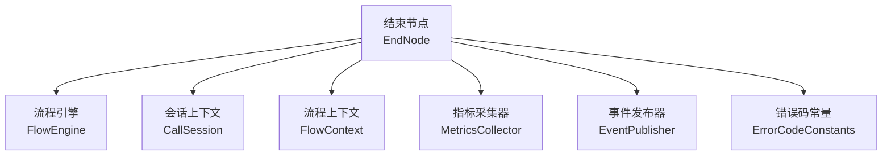
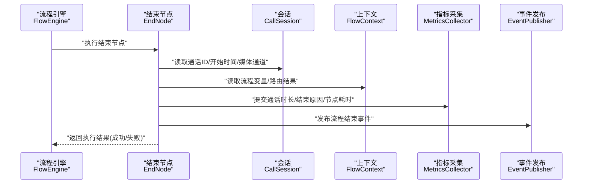
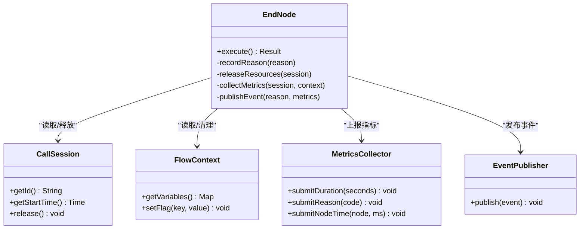
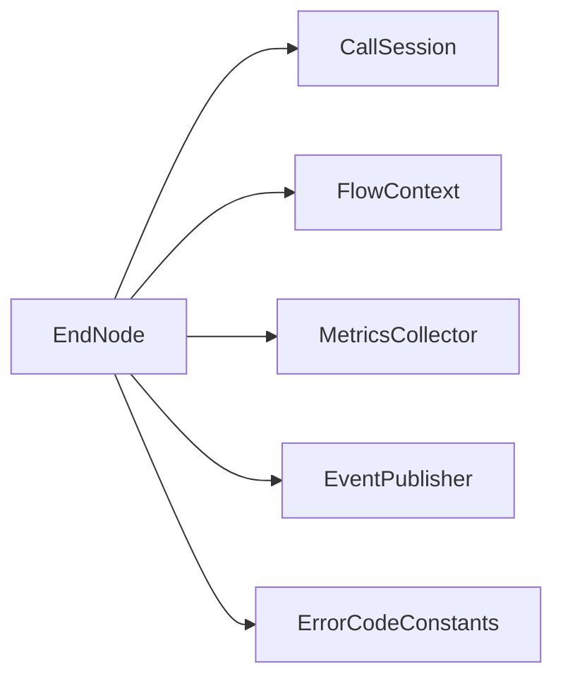
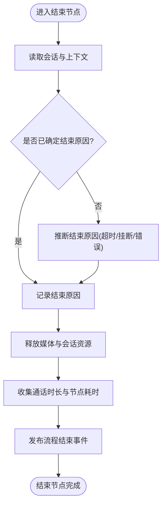

# 结束节点

<cite>
**本文引用的文件**
- [yudao-module-cc-server/src/main/java/cn/iocoder/yudao/module/cc/ivr/flow/node/EndNode.java](file://yudao-module-cc/yudao-module-cc-server/src/main/java/cn/iocoder/yudao/module/cc/ivr/flow/node/EndNode.java)
- [yudao-module-cc-server/src/main/java/cn/iocoder/yudao/module/cc/ivr/flow/FlowEngine.java](file://yudao-module-cc/yudao-module-cc-server/src/main/java/cn/iocoder/yudao/module/cc/ivr/flow/FlowEngine.java)
- [yudao-module-cc-server/src/main/java/cn/iocoder/yudao/module/cc/ivr/flow/session/CallSession.java](file://yudao-module-cc/yudao-module-cc-server/src/main/java/cn/iocoder/yudao/module/cc/ivr/flow/session/CallSession.java)
- [yudao-module-cc-server/src/main/java/cn/iocoder/yudao/module/cc/ivr/flow/context/FlowContext.java](file://yudao-module-cc/yudao-module-cc-server/src/main/java/cn/iocoder/yudao/module/cc/ivr/flow/context/FlowContext.java)
- [yudao-module-cc-api/src/main/java/cn/iocoder/yudao/module/cc/enums/ErrorCodeConstants.java](file://yudao-module-cc/yudao-module-cc-api/src/main/java/cn/iocoder/yudao/module/cc/enums/ErrorCodeConstants.java)
- [yudao-module-cc-server/src/main/java/cn/iocoder/yudao/module/cc/ivr/flow/metrics/MetricsCollector.java](file://yudao-module-cc/yudao-module-cc-server/src/main/java/cn/iocoder/yudao/module/cc/ivr/flow/metrics/MetricsCollector.java)
- [yudao-module-cc-server/src/main/java/cn/iocoder/yudao/module/cc/ivr/flow/event/EventPublisher.java](file://yudao-module-cc/yudao-module-cc-server/src/main/java/cn/iocoder/yudao/module/cc/ivr/flow/event/EventPublisher.java)
</cite>

## 目录
1. [简介](#简介)
2. [项目结构](#项目结构)
3. [核心组件](#核心组件)
4. [架构总览](#架构总览)
5. [详细组件分析](#详细组件分析)
6. [依赖关系分析](#依赖关系分析)
7. [性能考量](#性能考量)
8. [故障排查指南](#故障排查指南)
9. [结论](#结论)
10. [附录](#附录)

## 简介
本章节面向IVR流程中的“结束节点”，说明其用于终止IVR流程的核心职责：记录流程结束原因、释放通话与上下文资源、收集统计信息，并对外发布事件以支撑监控与分析。同时给出配置项说明（结束原因分类、后续处理动作、通知机制）、业务逻辑实现要点（状态清理、会话终止、资源回收），以及与系统监控的集成方式（通话时长统计、用户行为分析）。最后提供优化建议与异常处理方案。

## 项目结构
围绕结束节点的相关代码主要分布在IVR引擎模块中，关键位置如下：
- 节点实现：EndNode
- 流程调度：FlowEngine
- 会话上下文：CallSession、FlowContext
- 指标采集：MetricsCollector
- 事件发布：EventPublisher
- 错误码常量：ErrorCodeConstants

图表来源
- [yudao-module-cc-server/src/main/java/cn/iocoder/yudao/module/cc/ivr/flow/node/EndNode.java](file://yudao-module-cc/yudao-module-cc-server/src/main/java/cn/iocoder/yudao/module/cc/ivr/flow/node/EndNode.java)
- [yudao-module-cc-server/src/main/java/cn/iocoder/yudao/module/cc/ivr/flow/FlowEngine.java](file://yudao-module-cc/yudao-module-cc-server/src/main/java/cn/iocoder/yudao/module/cc/ivr/flow/FlowEngine.java)
- [yudao-module-cc-server/src/main/java/cn/iocoder/yudao/module/cc/ivr/flow/session/CallSession.java](file://yudao-module-cc/yudao-module-cc-server/src/main/java/cn/iocoder/yudao/module/cc/ivr/flow/session/CallSession.java)
- [yudao-module-cc-server/src/main/java/cn/iocoder/yudao/module/cc/ivr/flow/context/FlowContext.java](file://yudao-module-cc/yudao-module-cc-server/src/main/java/cn/iocoder/yudao/module/cc/ivr/flow/context/FlowContext.java)
- [yudao-module-cc-server/src/main/java/cn/iocoder/yudao/module/cc/ivr/flow/metrics/MetricsCollector.java](file://yudao-module-cc/yudao-module-cc-server/src/main/java/cn/iocoder/yudao/module/cc/ivr/flow/metrics/MetricsCollector.java)
- [yudao-module-cc-server/src/main/java/cn/iocoder/yudao/module/cc/ivr/flow/event/EventPublisher.java](file://yudao-module-cc/yudao-module-cc-server/src/main/java/cn/iocoder/yudao/module/cc/ivr/flow/event/EventPublisher.java)
- [yudao-module-cc-api/src/main/java/cn/iocoder/yudao/module/cc/enums/ErrorCodeConstants.java](file://yudao-module-cc/yudao-module-cc-api/src/main/java/cn/iocoder/yudao/module/cc/enums/ErrorCodeConstants.java)

章节来源
- [yudao-module-cc-server/src/main/java/cn/iocoder/yudao/module/cc/ivr/flow/node/EndNode.java](file://yudao-module-cc/yudao-module-cc-server/src/main/java/cn/iocoder/yudao/module/cc/ivr/flow/node/EndNode.java)
- [yudao-module-cc-server/src/main/java/cn/iocoder/yudao/module/cc/ivr/flow/FlowEngine.java](file://yudao-module-cc/yudao-module-cc-server/src/main/java/cn/iocoder/yudao/module/cc/ivr/flow/FlowEngine.java)

## 核心组件
- EndNode：负责在IVR流程到达结束时执行收尾工作，包括记录结束原因、触发资源释放、汇总统计、发布事件等。
- FlowEngine：驱动节点执行，协调上下文与会话生命周期，确保结束节点被正确调用并在完成后推进或终止流程。
- CallSession：维护通话级会话状态，包含通话ID、开始时间、媒体通道引用等，供结束节点进行时长计算与资源释放。
- FlowContext：承载流程运行期数据（如变量、路由结果、埋点数据），结束节点可读取并持久化关键指标。
- MetricsCollector：统一采集通话时长、节点耗时、结束原因分布等指标，便于监控与报表。
- EventPublisher：将“流程结束”事件异步发布到消息总线或日志系统，供下游消费（如审计、BI、告警）。
- ErrorCodeConstants：集中定义错误码与结束原因枚举，保证一致性。

章节来源
- [yudao-module-cc-server/src/main/java/cn/iocoder/yudao/module/cc/ivr/flow/node/EndNode.java](file://yudao-module-cc/yudao-module-cc-server/src/main/java/cn/iocoder/yudao/module/cc/ivr/flow/node/EndNode.java)
- [yudao-module-cc-server/src/main/java/cn/iocoder/yudao/module/cc/ivr/flow/FlowEngine.java](file://yudao-module-cc/yudao-module-cc-server/src/main/java/cn/iocoder/yudao/module/cc/ivr/flow/FlowEngine.java)
- [yudao-module-cc-server/src/main/java/cn/iocoder/yudao/module/cc/ivr/flow/session/CallSession.java](file://yudao-module-cc/yudao-module-cc/server/src/main/java/cn/iocoder/yudao/module/cc/ivr/flow/session/CallSession.java)
- [yudao-module-cc-server/src/main/java/cn/iocoder/yudao/module/cc/ivr/flow/context/FlowContext.java](file://yudao-module-cc/yudao-module-cc-server/src/main/java/cn/iocoder/yudao/module/cc/ivr/flow/context/FlowContext.java)
- [yudao-module-cc-server/src/main/java/cn/iocoder/yudao/module/cc/ivr/flow/metrics/MetricsCollector.java](file://yudao-module-cc/yudao-module-cc-server/src/main/java/cn/iocoder/yudao/module/cc/ivr/flow/metrics/MetricsCollector.java)
- [yudao-module-cc-server/src/main/java/cn/iocoder/yudao/module/cc/ivr/flow/event/EventPublisher.java](file://yudao-module-cc/yudao-module-cc-server/src/main/java/cn/iocoder/yudao/module/cc/ivr/flow/event/EventPublisher.java)
- [yudao-module-cc-api/src/main/java/cn/iocoder/yudao/module/cc/enums/ErrorCodeConstants.java](file://yudao-module-cc/yudao-module-cc-api/src/main/java/cn/iocoder/yudao/module/cc/enums/ErrorCodeConstants.java)

## 架构总览
结束节点作为流程终点，承担“收尾+上报”的职责。它从会话与上下文中提取必要信息，完成资源释放与统计上报，并通过事件发布器通知外部系统。

图表来源
- [yudao-module-cc-server/src/main/java/cn/iocoder/yudao/module/cc/ivr/flow/node/EndNode.java](file://yudao-module-cc/yudao-module-cc-server/src/main/java/cn/iocoder/yudao/module/cc/ivr/flow/node/EndNode.java)
- [yudao-module-cc-server/src/main/java/cn/iocoder/yudao/module/cc/ivr/flow/FlowEngine.java](file://yudao-module-cc/yudao-module-cc-server/src/main/java/cn/iocoder/yudao/module/cc/ivr/flow/FlowEngine.java)
- [yudao-module-cc-server/src/main/java/cn/iocoder/yudao/module/cc/ivr/flow/session/CallSession.java](file://yudao-module-cc/yudao-module-cc-server/src/main/java/cn/iocoder/yudao/module/cc/ivr/flow/session/CallSession.java)
- [yudao-module-cc-server/src/main/java/cn/iocoder/yudao/module/cc/ivr/flow/context/FlowContext.java](file://yudao-module-cc/yudao-module-cc-server/src/main/java/cn/iocoder/yudao/module/cc/ivr/flow/context/FlowContext.java)
- [yudao-module-cc-server/src/main/java/cn/iocoder/yudao/module/cc/ivr/flow/metrics/MetricsCollector.java](file://yudao-module-cc/yudao-module-cc-server/src/main/java/cn/iocoder/yudao/module/cc/ivr/flow/metrics/MetricsCollector.java)
- [yudao-module-cc-server/src/main/java/cn/iocoder/yudao/module/cc/ivr/flow/event/EventPublisher.java](file://yudao-module-cc/yudao-module-cc-server/src/main/java/cn/iocoder/yudao/module/cc/ivr/flow/event/EventPublisher.java)

## 详细组件分析

### 结束节点（EndNode）
- 功能特性
  - 流程结束原因记录：从上下文或配置中获取结束原因分类，写入指标与事件。
  - 资源释放：关闭媒体通道、释放会话句柄、清理临时数据。
  - 统计信息收集：计算通话时长、节点耗时、成功率等，提交至指标采集器。
  - 通知机制：发布“流程结束”事件，供审计、BI、告警系统消费。
- 配置选项
  - 结束原因分类：支持标准分类（如正常结束、超时、挂断、系统错误等），可通过枚举或字典配置。
  - 后续处理动作：是否立即释放资源、是否延迟上报、是否触发回调。
  - 通知机制：选择同步或异步事件发布，支持过滤条件与重试策略。
- 业务逻辑实现
  - 流程状态清理：标记流程为已结束，清除运行态变量。
  - 会话终止：调用会话接口释放媒体与信令资源。
  - 资源回收：释放内存对象、断开连接、清理缓存。
- 与监控集成
  - 通话时长统计：基于会话开始时间与当前时间计算时长，上报至指标系统。
  - 用户行为分析：结合路由路径与按键/语音交互结果，输出行为标签。

图表来源
- [yudao-module-cc-server/src/main/java/cn/iocoder/yudao/module/cc/ivr/flow/node/EndNode.java](file://yudao-module-cc/yudao-module-cc-server/src/main/java/cn/iocoder/yudao/module/cc/ivr/flow/node/EndNode.java)
- [yudao-module-cc-server/src/main/java/cn/iocoder/yudao/module/cc/ivr/flow/session/CallSession.java](file://yudao-module-cc/yudao-module-cc-server/src/main/java/cn/iocoder/yudao/module/cc/ivr/flow/session/CallSession.java)
- [yudao-module-cc-server/src/main/java/cn/iocoder/yudao/module/cc/ivr/flow/context/FlowContext.java](file://yudao-module-cc/yudao-module-cc-server/src/main/java/cn/iocoder/yudao/module/cc/ivr/flow/context/FlowContext.java)
- [yudao-module-cc-server/src/main/java/cn/iocoder/yudao/module/cc/ivr/flow/metrics/MetricsCollector.java](file://yudao-module-cc/yudao-module-cc-server/src/main/java/cn/iocoder/yudao/module/cc/ivr/flow/metrics/MetricsCollector.java)
- [yudao-module-cc-server/src/main/java/cn/iocoder/yudao/module/cc/ivr/flow/event/EventPublisher.java](file://yudao-module-cc/yudao-module-cc-server/src/main/java/cn/iocoder/yudao/module/cc/ivr/flow/event/EventPublisher.java)

章节来源
- [yudao-module-cc-server/src/main/java/cn/iocoder/yudao/module/cc/ivr/flow/node/EndNode.java](file://yudao-module-cc/yudao-module-cc-server/src/main/java/cn/iocoder/yudao/module/cc/ivr/flow/node/EndNode.java)

### 流程引擎（FlowEngine）
- 职责：编排节点执行，确保结束节点在适当时机被调用，并在结束后推进或终止流程。
- 关键点：捕获异常、保证资源释放、记录执行轨迹。

章节来源
- [yudao-module-cc-server/src/main/java/cn/iocoder/yudao/module/cc/ivr/flow/FlowEngine.java](file://yudao-module-cc/yudao-module-cc-server/src/main/java/cn/iocoder/yudao/module/cc/ivr/flow/FlowEngine.java)

### 会话与上下文（CallSession、FlowContext）
- CallSession：提供通话标识、开始时间、媒体通道等，是时长计算与资源释放的基础。
- FlowContext：保存流程运行期数据，结束节点据此生成统计维度与行为标签。

章节来源
- [yudao-module-cc-server/src/main/java/cn/iocoder/yudao/module/cc/ivr/flow/session/CallSession.java](file://yudao-module-cc/yudao-module-cc-server/src/main/java/cn/iocoder/yudao/module/cc/ivr/flow/session/CallSession.java)
- [yudao-module-cc-server/src/main/java/cn/iocoder/yudao/module/cc/ivr/flow/context/FlowContext.java](file://yudao-module-cc/yudao-module-cc-server/src/main/java/cn/iocoder/yudao/module/cc/ivr/flow/context/FlowContext.java)

### 指标与事件（MetricsCollector、EventPublisher）
- MetricsCollector：统一上报通话时长、结束原因、节点耗时等指标，便于监控大盘与报表。
- EventPublisher：将“流程结束”事件异步发布，支持重试与幂等，供下游系统消费。

章节来源
- [yudao-module-cc-server/src/main/java/cn/iocoder/yudao/module/cc/ivr/flow/metrics/MetricsCollector.java](file://yudao-module-cc/yudao-module-cc-server/src/main/java/cn/iocoder/yudao/module/cc/ivr/flow/metrics/MetricsCollector.java)
- [yudao-module-cc-server/src/main/java/cn/iocoder/yudao/module/cc/ivr/flow/event/EventPublisher.java](file://yudao-module-cc/yudao-module-cc-server/src/main/java/cn/iocoder/yudao/module/cc/ivr/flow/event/EventPublisher.java)

### 错误码与结束原因（ErrorCodeConstants）
- 作用：集中管理错误码与结束原因分类，确保全链路一致性与可追溯性。
- 使用：结束节点在记录原因与上报指标时引用统一常量。

章节来源
- [yudao-module-cc-api/src/main/java/cn/iocoder/yudao/module/cc/enums/ErrorCodeConstants.java](file://yudao-module-cc/yudao-module-cc-api/src/main/java/cn/iocoder/yudao/module/cc/enums/ErrorCodeConstants.java)

## 依赖关系分析
结束节点对多个子系统存在依赖，需关注耦合度与健壮性：
- 对会话与上下文的只读访问应最小化副作用；资源释放应在事务边界外执行。
- 指标与事件上报采用异步模式，避免阻塞主流程。
- 错误码与原因分类通过常量统一管理，降低硬编码风险。

图表来源
- [yudao-module-cc-server/src/main/java/cn/iocoder/yudao/module/cc/ivr/flow/node/EndNode.java](file://yudao-module-cc/yudao-module-cc-server/src/main/java/cn/iocoder/yudao/module/cc/ivr/flow/node/EndNode.java)
- [yudao-module-cc-server/src/main/java/cn/iocoder/yudao/module/cc/ivr/flow/session/CallSession.java](file://yudao-module-cc/yudao-module-cc-server/src/main/java/cn/iocoder/yudao/module/cc/ivr/flow/session/CallSession.java)
- [yudao-module-cc-server/src/main/java/cn/iocoder/yudao/module/cc/ivr/flow/context/FlowContext.java](file://yudao-module-cc/yudao-module-cc-server/src/main/java/cn/iocoder/yudao/module/cc/ivr/flow/context/FlowContext.java)
- [yudao-module-cc-server/src/main/java/cn/iocoder/yudao/module/cc/ivr/flow/metrics/MetricsCollector.java](file://yudao-module-cc/yudao-module-cc-server/src/main/java/cn/iocoder/yudao/module/cc/ivr/flow/metrics/MetricsCollector.java)
- [yudao-module-cc-server/src/main/java/cn/iocoder/yudao/module/cc/ivr/flow/event/EventPublisher.java](file://yudao-module-cc/yudao-module-cc-server/src/main/java/cn/iocoder/yudao/module/cc/ivr/flow/event/EventPublisher.java)
- [yudao-module-cc-api/src/main/java/cn/iocoder/yudao/module/cc/enums/ErrorCodeConstants.java](file://yudao-module-cc/yudao-module-cc-api/src/main/java/cn/iocoder/yudao/module/cc/enums/ErrorCodeConstants.java)

章节来源
- [yudao-module-cc-server/src/main/java/cn/iocoder/yudao/module/cc/ivr/flow/node/EndNode.java](file://yudao-module-cc/yudao-module-cc-server/src/main/java/cn/iocoder/yudao/module/cc/ivr/flow/node/EndNode.java)

## 性能考量
- 指标与事件上报采用异步与批量化策略，减少端到端延迟。
- 资源释放尽量早且幂等，避免重复释放导致开销。
- 会话与上下文访问加锁或不可变视图，防止并发竞争。
- 大对象及时释放，避免内存泄漏影响长时通话场景。

[本节为通用性能指导，不直接分析具体文件]

## 故障排查指南
- 常见问题
  - 结束原因未记录：检查上下文是否正确传递原因分类，确认常量使用一致。
  - 资源未释放：核查会话释放调用路径，确认异常分支也执行释放。
  - 指标缺失：确认指标采集器初始化与上报成功，查看异步任务队列。
  - 事件丢失：检查事件发布器的重试与持久化策略，核对消费者订阅。
- 定位方法
  - 通过流程引擎日志追踪节点执行轨迹。
  - 结合会话ID关联通话时长与指标记录。
  - 使用错误码常量快速筛选异常类型。

章节来源
- [yudao-module-cc-server/src/main/java/cn/iocoder/yudao/module/cc/ivr/flow/node/EndNode.java](file://yudao-module-cc/yudao-module-cc-server/src/main/java/cn/iocoder/yudao/module/cc/ivr/flow/node/EndNode.java)
- [yudao-module-cc-server/src/main/java/cn/iocoder/yudao/module/cc/ivr/flow/FlowEngine.java](file://yudao-module-cc/yudao-module-cc-server/src/main/java/cn/iocoder/yudao/module/cc/ivr/flow/FlowEngine.java)
- [yudao-module-cc-api/src/main/java/cn/iocoder/yudao/module/cc/enums/ErrorCodeConstants.java](file://yudao-module-cc/yudao-module-cc-api/src/main/java/cn/iocoder/yudao/module/cc/enums/ErrorCodeConstants.java)

## 结论
结束节点是IVR流程的关键收尾环节，负责记录结束原因、释放资源、收集统计并发布事件。通过合理的配置选项与稳健的业务逻辑，可实现可靠的流程终止与完整的可观测性。结合监控集成与异常处理方案，能有效提升系统的稳定性与可维护性。

[本节为总结性内容，不直接分析具体文件]

## 附录

### 配置项参考
- 结束原因分类：使用统一错误码与枚举，覆盖正常结束、超时、挂断、系统错误等。
- 后续处理动作：支持立即释放、延迟上报、回调触发等策略。
- 通知机制：支持同步/异步事件发布，具备重试与幂等保障。

[本节为概念性说明，不直接分析具体文件]

### 流程图：结束节点处理逻辑

图表来源
- [yudao-module-cc-server/src/main/java/cn/iocoder/yudao/module/cc/ivr/flow/node/EndNode.java](file://yudao-module-cc/yudao-module-cc-server/src/main/java/cn/iocoder/yudao/module/cc/ivr/flow/node/EndNode.java)
- [yudao-module-cc-server/src/main/java/cn/iocoder/yudao/module/cc/ivr/flow/session/CallSession.java](file://yudao-module-cc/yudao-module-cc-server/src/main/java/cn/iocoder/yudao/module/cc/ivr/flow/session/CallSession.java)
- [yudao-module-cc-server/src/main/java/cn/iocoder/yudao/module/cc/ivr/flow/context/FlowContext.java](file://yudao-module-cc/yudao-module-cc-server/src/main/java/cn/iocoder/yudao/module/cc/ivr/flow/context/FlowContext.java)
- [yudao-module-cc-server/src/main/java/cn/iocoder/yudao/module/cc/ivr/flow/metrics/MetricsCollector.java](file://yudao-module-cc/yudao-module-cc-server/src/main/java/cn/iocoder/yudao/module/cc/ivr/flow/metrics/MetricsCollector.java)
- [yudao-module-cc-server/src/main/java/cn/iocoder/yudao/module/cc/ivr/flow/event/EventPublisher.java](file://yudao-module-cc/yudao-module-cc-server/src/main/java/cn/iocoder/yudao/module/cc/ivr/flow/event/EventPublisher.java)