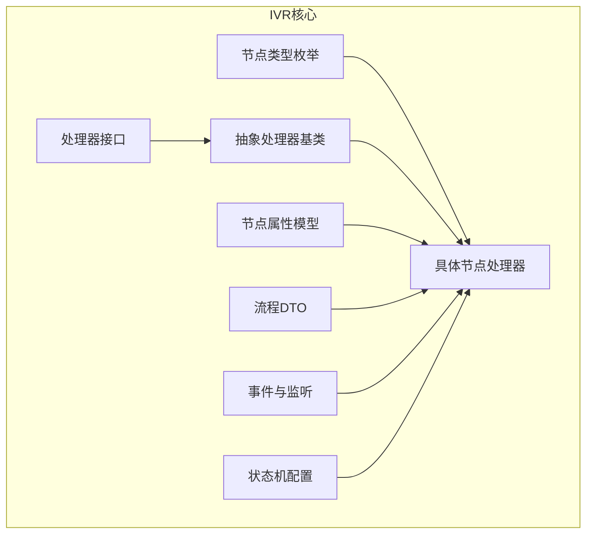
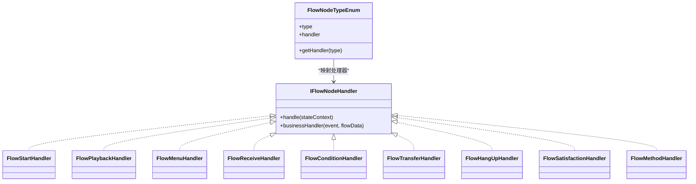
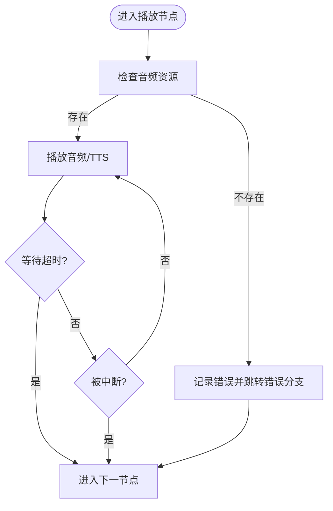
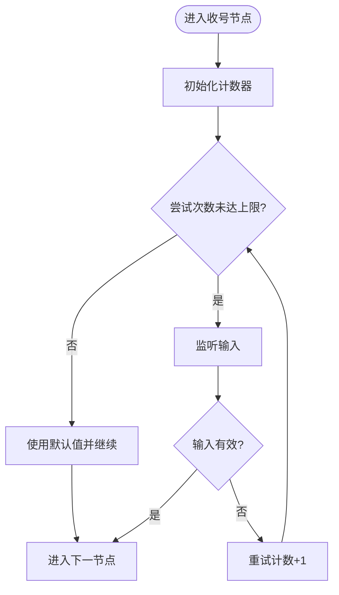
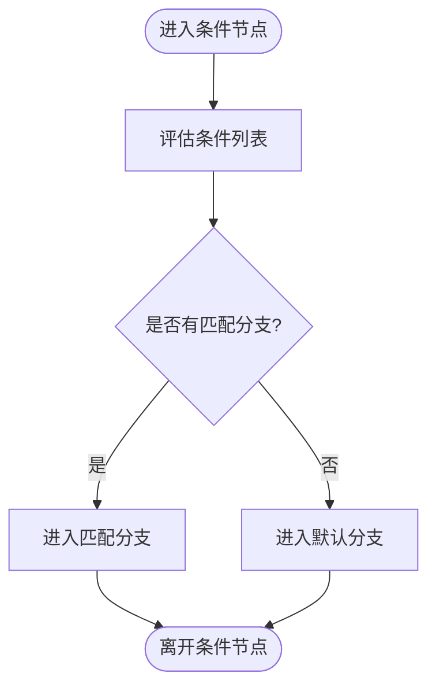
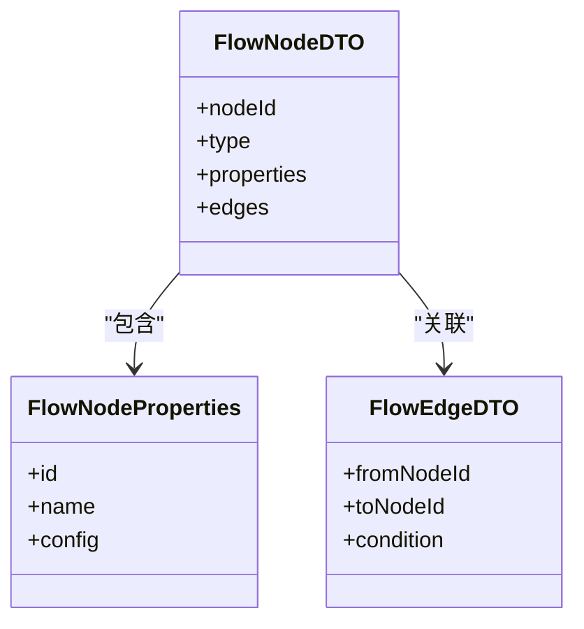
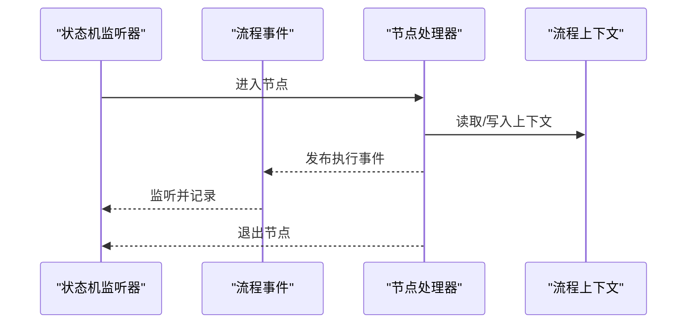
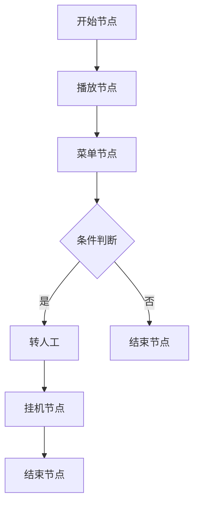
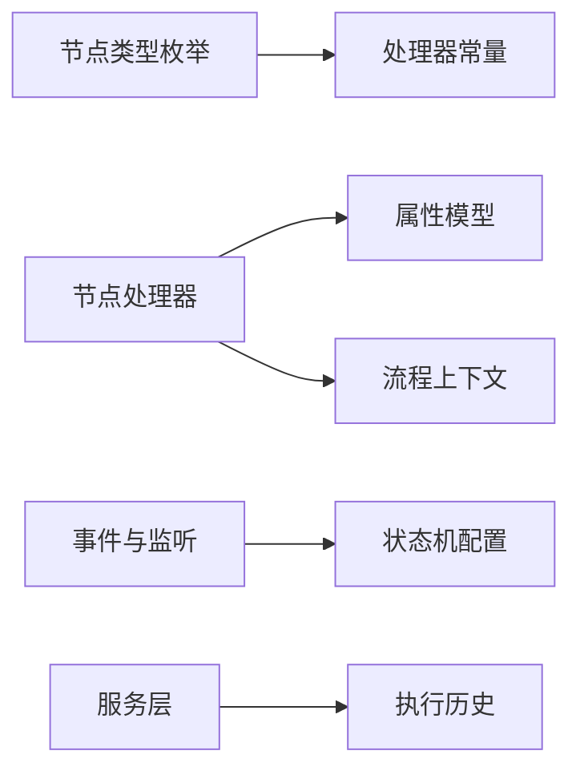

# 节点类型系统

<cite>
**本文引用的文件**
- [FlowNodeTypeEnum.java](file://yudao-cloud/yudao-module-cc/yudao-module-cc-server/src/main/java/cn/iocoder/yudao/module/cc/ivr/enums/FlowNodeTypeEnum.java)
- [IFlowNodeHandler.java](file://yudao-cloud/yudao-module-cc/yudao-module-cc-server/src/main/java/cn/iocoder/yudao/module/cc/ivr/handler/node/IFlowNodeHandler.java)
- [AbstractIFlowNodeHandler.java](file://yudao-cloud/yudao-module-cc/yudao-module-cc-server/src/main/java/cn/iocoder/yudao/module/cc/ivr/handler/node/AbstractIFlowNodeHandler.java)
- [FlowStartHandler.java](file://yudao-cloud/yudao-module-cc/yudao-module-cc-server/src/main/java/cn/iocoder/yudao/module/cc/ivr/handler/node/FlowStartHandler.java)
- [FlowPlaybackHandler.java](file://yudao-cloud/yudao-module-cc/yudao-module-cc-server/src/main/java/cn/iocoder/yudao/module/cc/ivr/handler/node/FlowPlaybackHandler.java)
- [FlowReceiveHandler.java](file://yudao-cloud/yudao-module-cc/yudao-module-cc-server/src/main/java/cn/iocoder/yudao/module/cc/ivr/handler/node/FlowReceiveHandler.java)
- [FlowConditionHandler.java](file://yudao-cloud/yudao-module-cc/yudao-module-cc-server/src/main/java/cn/iocoder/yudao/module/cc/ivr/handler/node/FlowConditionHandler.java)
- [FlowTransferHandler.java](file://yudao-cloud/yudao-module-cc/yudao-module-cc-server/src/main/java/cn/iocoder/yudao/module/cc/ivr/handler/node/FlowTransferHandler.java)
- [FlowEndHandler.java](file://yudao-cloud/yudao-module-cc/yudao-module-cc-server/src/main/java/cn/iocoder/yudao/module/cc/ivr/handler/node/FlowEndHandler.java)
- [FlowMenuHandler.java](file://yudao-cloud/yudao-module-cc/yudao-module-cc-server/src/main/java/cn/iocoder/yudao/module/cc/ivr/handler/node/FlowMenuHandler.java)
- [FlowHangUpHandler.java](file://yudao-cloud/yudao-module-cc/yudao-module-cc-server/src/main/java/cn/iocoder/yudao/module/cc/ivr/handler/node/FlowHangUpHandler.java)
- [FlowSatisfactionHandler.java](file://yudao-cloud/yudao-module-cc/yudao-module-cc-server/src/main/java/cn/iocoder/yudao/module/cc/ivr/handler/node/FlowSatisfactionHandler.java)
- [FlowMethodHandler.java](file://yudao-cloud/yudao-module-cc/yudao-module-cc-server/src/main/java/cn/iocoder/yudao/module/cc/ivr/handler/node/FlowMethodHandler.java)
- [FlowConditionEvaluator.java](file://yudao-cloud/yudao-module-cc/yudao-module-cc-server/src/main/java/cn/iocoder/yudao/module/cc/ivr/handler/node/FlowConditionEvaluator.java)
- [FlowNodeProperties.java](file://yudao-cloud/yudao-module-cc/yudao-module-cc-server/src/main/java/cn/iocoder/yudao/module/cc/ivr/properties/FlowNodeProperties.java)
- [FlowStartNodeProperties.java](file://yudao-cloud/yudao-module-cc/yudao-module-cc-server/src/main/java/cn/iocoder/yudao/module/cc/ivr/properties/FlowStartNodeProperties.java)
- [FlowPlaybackNodeProperties.java](file://yudao-cloud/yudao-module-cc/yudao-module-cc-server/src/main/java/cn/iocoder/yudao/module/cc/ivr/properties/FlowPlaybackNodeProperties.java)
- [FlowReceiveNodeProperties.java](file://yudao-cloud/yudao-module-cc/yudao-module-cc-server/src/main/java/cn/iocoder/yudao/module/cc/ivr/properties/FlowReceiveNodeProperties.java)
- [FlowConditionNodeProperties.java](file://yudao-cloud/yudao-module-cc/yudao-module-cc-server/src/main/java/cn/iocoder/yudao/module/cc/ivr/properties/FlowConditionNodeProperties.java)
- [FlowTransferNodeProperties.java](file://yudao-cloud/yudao-module-cc/yudao-module-cc-server/src/main/java/cn/iocoder/yudao/module/cc/ivr/properties/FlowTransferNodeProperties.java)
- [FlowEndNodeProperties.java](file://yudao-cloud/yudao-module-cc/yudao-module-cc-server/src/main/java/cn/iocoder/yudao/module/cc/ivr/properties/FlowEndNodeProperties.java)
- [FlowMenuNodeProperties.java](file://yudao-cloud/yudao-module-cc/yudao-module-cc-server/src/main/java/cn/iocoder/yudao/module/cc/ivr/properties/FlowMenuNodeProperties.java)
- [FlowHttpNodeProperties.java](file://yudao-cloud/yudao-module-cc/yudao-module-cc-server/src/main/java/cn/iocoder/yudao/module/cc/ivr/properties/FlowHttpNodeProperties.java)
- [FlowMethodNodeProperties.java](file://yudao-cloud/yudao-module-cc/yudao-module-cc-server/src/main/java/cn/iocoder/yudao/module/cc/ivr/properties/FlowMethodNodeProperties.java)
- [FlowEdgeDTO.java](file://yudao-cloud/yudao-module-cc/yudao-module-cc-server/src/main/java/cn/iocoder/yudao/module/cc/ivr/dto/FlowEdgeDTO.java)
- [FlowNodeDTO.java](file://yudao-cloud/yudao-module-cc/yudao-module-cc-server/src/main/java/cn/iocoder/yudao/module/cc/ivr/dto/FlowNodeDTO.java)
- [FlowEvent.java](file://yudao-cloud/yudao-module-cc/yudao-module-cc-server/src/main/java/cn/iocoder/yudao/module/cc/ivr/event/FlowEvent.java)
- [FlowEventListener.java](file://yudao-cloud/yudao-module-cc/yudao-module-cc-server/src/main/java/cn/iocoder/yudao/module/cc/ivr/listener/FlowEventListener.java)
- [FlowStateMachineListener.java](file://yudao-cloud/yudao-module-cc/yudao-module-cc-server/src/main/java/cn/iocoder/yudao/module/cc/ivr/listener/FlowStateMachineListener.java)
- [RedisStateMachineConfig.java](file://yudao-cloud/yudao-module-cc/yudao-module-cc-server/src/main/java/cn/iocoder/yudao/module/cc/ivr/config/RedisStateMachineConfig.java)
- [FlowInfoService.java](file://yudao-cloud/yudao-module-cc/yudao-module-cc-server/src/main/java/cn/iocoder/yudao/module/cc/service/flow/FlowInfoService.java)
- [FlowInstancesService.java](file://yudao-cloud/yudao-module-cc/yudao-module-cc-server/src/main/java/cn/iocoder/yudao/module/cc/service/flow/FlowInstancesService.java)
- [FlowNodeExecutionHistoryService.java](file://yudao-cloud/yudao-module-cc/yudao-module-cc-server/src/main/java/cn/iocoder/yudao/module/cc/service/flow/FlowNodeExecutionHistoryService.java)
- [FlowNodeHanderConstant.java](file://yudao-cloud/yudao-module-cc/yudao-module-cc-server/src/main/java/cn/iocoder/yudao/module/cc/ivr/constant/FlowNodeHanderConstant.java)
- [FlowDataContext.java](file://yudao-cloud/yudao-module-cc/yudao-module-cc-server/src/main/java/cn/iocoder/yudao/module/cc/esl/dto/FlowDataContext.java)
</cite>

## 目录
1. [简介](#简介)
2. [项目结构](#项目结构)
3. [核心组件](#核心组件)
4. [架构总览](#架构总览)
5. [详细组件分析](#详细组件分析)
6. [依赖关系分析](#依赖关系分析)
7. [性能考量](#性能考量)
8. [故障排查指南](#故障排查指南)
9. [结论](#结论)
10. [附录](#附录)

## 简介
本文件面向IVR（交互式语音应答）节点类型系统，系统化说明各节点类型的功能特性、配置选项与业务逻辑实现，覆盖开始节点、播放节点、按键接收节点、条件判断节点、转人工节点、结束节点等。文档同时给出节点模型的统一接口规范、生命周期管理、节点间连接规则与流转逻辑（含条件分支与循环处理）、自定义节点开发指南（模板编写与事件处理），以及性能优化与错误处理最佳实践。

## 项目结构
IVR节点系统位于呼叫中心模块的 ivr 子包中，围绕“节点枚举 + 处理器 + 属性模型 + DTO + 事件监听 + 状态机配置”组织：
- 节点类型枚举：集中定义所有支持的节点类型及其对应的处理器标识
- 处理器接口与抽象基类：统一执行入口与默认行为
- 具体节点处理器：实现各类节点的业务逻辑
- 属性模型：为每种节点提供可配置的参数集合
- DTO：用于流程编排与传输的数据结构
- 事件与监听：流程事件发布与监听、状态机生命周期监听
- 状态机配置：基于Spring StateMachine的持久化与扩展配置
- 服务层：流程信息、实例与执行历史的查询与管理



图表来源
- [FlowNodeTypeEnum.java:1-50](file://yudao-cloud/yudao-module-cc/yudao-module-cc-server/src/main/java/cn/iocoder/yudao/module/cc/ivr/enums/FlowNodeTypeEnum.java#L1-L50)
- [IFlowNodeHandler.java:1-16](file://yudao-cloud/yudao-module-cc/yudao-module-cc-server/src/main/java/cn/iocoder/yudao/module/cc/ivr/handler/node/IFlowNodeHandler.java#L1-L16)
- [AbstractIFlowNodeHandler.java](file://yudao-cloud/yudao-module-cc/yudao-module-cc-server/src/main/java/cn/iocoder/yudao/module/cc/ivr/handler/node/AbstractIFlowNodeHandler.java)
- [FlowStartHandler.java](file://yudao-cloud/yudao-module-cc/yudao-module-cc-server/src/main/java/cn/iocoder/yudao/module/cc/ivr/handler/node/FlowStartHandler.java)
- [FlowPlaybackHandler.java](file://yudao-cloud/yudao-module-cc/yudao-module-cc-server/src/main/java/cn/iocoder/yudao/module/cc/ivr/handler/node/FlowPlaybackHandler.java)
- [FlowReceiveHandler.java](file://yudao-cloud/yudao-module-cc/yudao-module-cc-server/src/main/java/cn/iocoder/yudao/module/cc/ivr/handler/node/FlowReceiveHandler.java)
- [FlowConditionHandler.java](file://yudao-cloud/yudao-module-cc/yudao-module-cc-server/src/main/java/cn/iocoder/yudao/module/cc/ivr/handler/node/FlowConditionHandler.java)
- [FlowTransferHandler.java](file://yudao-cloud/yudao-module-cc/yudao-module-cc-server/src/main/java/cn/iocoder/yudao/module/cc/ivr/handler/node/FlowTransferHandler.java)
- [FlowEndHandler.java](file://yudao-cloud/yudao-module-cc/yudao-module-cc-server/src/main/java/cn/iocoder/yudao/module/cc/ivr/handler/node/FlowEndHandler.java)
- [FlowMenuHandler.java](file://yudao-cloud/yudao-module-cc/yudao-module-cc-server/src/main/java/cn/iocoder/yudao/module/cc/ivr/handler/node/FlowMenuHandler.java)
- [FlowHangUpHandler.java](file://yudao-cloud/yudao-module-cc/yudao-module-cc-server/src/main/java/cn/iocoder/yudao/module/cc/ivr/handler/node/FlowHangUpHandler.java)
- [FlowSatisfactionHandler.java](file://yudao-cloud/yudao-module-cc/yudao-module-cc-server/src/main/java/cn/iocoder/yudao/module/cc/ivr/handler/node/FlowSatisfactionHandler.java)
- [FlowMethodHandler.java](file://yudao-cloud/yudao-module-cc/yudao-module-cc-server/src/main/java/cn/iocoder/yudao/module/cc/ivr/handler/node/FlowMethodHandler.java)
- [FlowNodeProperties.java](file://yudao-cloud/yudao-module-cc/yudao-module-cc-server/src/main/java/cn/iocoder/yudao/module/cc/ivr/properties/FlowNodeProperties.java)
- [FlowEdgeDTO.java](file://yudao-cloud/yudao-module-cc/yudao-module-cc-server/src/main/java/cn/iocoder/yudao/module/cc/ivr/dto/FlowEdgeDTO.java)
- [FlowNodeDTO.java](file://yudao-cloud/yudao-module-cc/yudao-module-cc-server/src/main/java/cn/iocoder/yudao/module/cc/ivr/dto/FlowNodeDTO.java)
- [FlowEvent.java](file://yudao-cloud/yudao-module-cc/yudao-module-cc-server/src/main/java/cn/iocoder/yudao/module/cc/ivr/event/FlowEvent.java)
- [FlowEventListener.java](file://yudao-cloud/yudao-module-cc/yudao-module-cc-server/src/main/java/cn/iocoder/yudao/module/cc/ivr/listener/FlowEventListener.java)
- [FlowStateMachineListener.java](file://yudao-cloud/yudao-module-cc/yudao-module-cc-server/src/main/java/cn/iocoder/yudao/module/cc/ivr/listener/FlowStateMachineListener.java)
- [RedisStateMachineConfig.java](file://yudao-cloud/yudao-module-cc/yudao-module-cc-server/src/main/java/cn/iocoder/yudao/module/cc/ivr/config/RedisStateMachineConfig.java)

章节来源
- [FlowNodeTypeEnum.java:1-50](file://yudao-cloud/yudao-module-cc/yudao-module-cc-server/src/main/java/cn/iocoder/yudao/module/cc/ivr/enums/FlowNodeTypeEnum.java#L1-L50)
- [IFlowNodeHandler.java:1-16](file://yudao-cloud/yudao-module-cc/yudao-module-cc-server/src/main/java/cn/iocoder/yudao/module/cc/ivr/handler/node/IFlowNodeHandler.java#L1-L16)

## 核心组件
- 节点类型枚举：集中声明所有IVR节点类型及对应处理器标识，便于路由分发与前端一致性维护
- 处理器接口：定义统一的 handle 方法与可选的 businessHandler 钩子，支持在状态机上下文中执行业务
- 抽象处理器基类：提供通用能力（如上下文读取、异常封装、日志埋点等）
- 具体节点处理器：实现各节点的业务逻辑（播放音频、收号、条件判断、转接、挂机、满意度、方法调用等）
- 属性模型：每种节点的可配置项，包括超时、重试、菜单项、条件表达式、转接目标等
- DTO：流程节点与边的数据载体，用于编排、存储与渲染
- 事件与监听：流程事件发布与监听，状态机进入/退出等生命周期回调
- 状态机配置：基于Spring StateMachine的Redis持久化配置，保障流程状态可恢复

章节来源
- [FlowNodeTypeEnum.java:1-50](file://yudao-cloud/yudao-module-cc/yudao-module-cc-server/src/main/java/cn/iocoder/yudao/module/cc/ivr/enums/FlowNodeTypeEnum.java#L1-L50)
- [IFlowNodeHandler.java:1-16](file://yudao-cloud/yudao-module-cc/yudao-module-cc-server/src/main/java/cn/iocoder/yudao/module/cc/ivr/handler/node/IFlowNodeHandler.java#L1-L16)
- [FlowNodeHanderConstant.java](file://yudao-cloud/yudao-module-cc/yudao-module-cc-server/src/main/java/cn/iocoder/yudao/module/cc/ivr/constant/FlowNodeHanderConstant.java)
- [FlowEvent.java:1-200](file://yudao-cloud/yudao-module-cc/yudao-module-cc-server/src/main/java/cn/iocoder/yudao/module/cc/ivr/event/FlowEvent.java)
- [FlowEventListener.java](file://yudao-cloud/yudao-module-cc/yudao-module-cc-server/src/main/java/cn/iocoder/yudao/module/cc/ivr/listener/FlowEventListener.java)
- [FlowStateMachineListener.java](file://yudao-cloud/yudao-module-cc/yudao-module-cc-server/src/main/java/cn/iocoder/yudao/module/cc/ivr/listener/FlowStateMachineListener.java)
- [RedisStateMachineConfig.java](file://yudao-cloud/yudao-module-cc/yudao-module-cc-server/src/main/java/cn/iocoder/yudao/module/cc/ivr/config/RedisStateMachineConfig.java)

## 架构总览
IVR节点系统采用“枚举驱动 + 策略处理器 + 状态机”的架构：
- 流程编排以节点和边构成有向图，节点类型为枚举值
- 运行时通过状态机驱动节点执行，每个节点由对应处理器完成
- 节点间通过事件与边进行流转，支持条件分支与循环
- 属性模型承载节点配置，DTO承载流程元数据
- 事件监听与状态机监听贯穿生命周期，便于审计与监控

```mermaid
sequenceDiagram
participant Caller as "来电"
participant FSM as "状态机"
participant Start as "开始节点处理器"
participant Play as "播放节点处理器"
participant Menu as "菜单节点处理器"
participant Receive as "收号节点处理器"
participant Cond as "条件节点处理器"
participant Transfer as "转接节点处理器"
participant End as "结束节点处理器"
Caller->>FSM : 触发流程启动
FSM->>Start : 执行开始节点
Start-->>FSM : 进入下一节点
FSM->>Play : 播放提示音
Play-->>FSM : 播放完成
FSM->>Menu : 展示菜单
Menu-->>FSM : 等待按键
FSM->>Receive : 收号并校验
Receive-->>FSM : 返回按键或号码
FSM->>Cond : 计算条件分支
Cond-->>FSM : 选择分支
alt 转人工
FSM->>Transfer : 转接至坐席
Transfer-->>FSM : 转接结果
else 结束
FSM->>End : 结束流程
End-->>FSM : 流程结束
end
```

图表来源
- [FlowStartHandler.java](file://yudao-cloud/yudao-module-cc/yudao-module-cc-server/src/main/java/cn/iocoder/yudao/module/cc/ivr/handler/node/FlowStartHandler.java)
- [FlowPlaybackHandler.java:1-200](file://yudao-cloud/yudao-module-cc/yudao-module-cc-server/src/main/java/cn/iocoder/yudao/module/cc/ivr/handler/node/FlowPlaybackHandler.java)
- [FlowMenuHandler.java](file://yudao-cloud/yudao-module-cc/yudao-module-cc-server/src/main/java/cn/iocoder/yudao/module/cc/ivr/handler/node/FlowMenuHandler.java)
- [FlowReceiveHandler.java:1-200](file://yudao-cloud/yudao-module-cc/yudao-module-cc-server/src/main/java/cn/iocoder/yudao/module/cc/ivr/handler/node/FlowReceiveHandler.java)
- [FlowConditionHandler.java:1-200](file://yudao-cloud/yudao-module-cc/yudao-module-cc-server/src/main/java/cn/iocoder/yudao/module/cc/ivr/handler/node/FlowConditionHandler.java)
- [FlowTransferHandler.java:1-200](file://yudao-cloud/yudao-module-cc/yudao-module-cc-server/src/main/java/cn/iocoder/yudao/module/cc/ivr/handler/node/FlowTransferHandler.java)
- [FlowEndHandler.java:1-200](file://yudao-cloud/yudao-module-cc/yudao-module-cc-server/src/main/java/cn/iocoder/yudao/module/cc/ivr/handler/node/FlowEndHandler.java)

## 详细组件分析

### 节点类型与处理器映射
- 开始节点：初始化上下文、设置环境变量、记录流程起点
- 播放节点：播放音频或TTS，支持超时与中断
- 菜单节点：展示菜单项，等待用户按键选择
- 收号节点：收集DTMF或语音识别结果，支持超时与重试
- 条件节点：根据表达式或变量计算分支走向
- 转接节点：将通话转接至坐席或外部号码
- 挂机节点：主动挂断通话
- 满意度节点：收集满意度评价
- 方法调用节点：调用外部HTTP或内部方法



图表来源
- [IFlowNodeHandler.java:1-16](file://yudao-cloud/yudao-module-cc/yudao-module-cc-server/src/main/java/cn/iocoder/yudao/module/cc/ivr/handler/node/IFlowNodeHandler.java#L1-L16)
- [FlowNodeTypeEnum.java:1-50](file://yudao-cloud/yudao-module-cc/yudao-module-cc-server/src/main/java/cn/iocoder/yudao/module/cc/ivr/enums/FlowNodeTypeEnum.java#L1-L50)
- [FlowStartHandler.java](file://yudao-cloud/yudao-module-cc/yudao-module-cc-server/src/main/java/cn/iocoder/yudao/module/cc/ivr/handler/node/FlowStartHandler.java)
- [FlowPlaybackHandler.java:1-200](file://yudao-cloud/yudao-module-cc/yudao-module-cc-server/src/main/java/cn/iocoder/yudao/module/cc/ivr/handler/node/FlowPlaybackHandler.java)
- [FlowMenuHandler.java](file://yudao-cloud/yudao-module-cc/yudao-module-cc-server/src/main/java/cn/iocoder/yudao/module/cc/ivr/handler/node/FlowMenuHandler.java)
- [FlowReceiveHandler.java:1-200](file://yudao-cloud/yudao-module-cc/yudao-module-cc-server/src/main/java/cn/iocoder/yudao/module/cc/ivr/handler/node/FlowReceiveHandler.java)
- [FlowConditionHandler.java:1-200](file://yudao-cloud/yudao-module-cc/yudao-module-cc-server/src/main/java/cn/iocoder/yudao/module/cc/ivr/handler/node/FlowConditionHandler.java)
- [FlowTransferHandler.java:1-200](file://yudao-cloud/yudao-module-cc/yudao-module-cc-server/src/main/java/cn/iocoder/yudao/module/cc/ivr/handler/node/FlowTransferHandler.java)
- [FlowHangUpHandler.java](file://yudao-cloud/yudao-module-cc/yudao-module-cc-server/src/main/java/cn/iocoder/yudao/module/cc/ivr/handler/node/FlowHangUpHandler.java)
- [FlowSatisfactionHandler.java](file://yudao-cloud/yudao-module-cc/yudao-module-cc-server/src/main/java/cn/iocoder/yudao/module/cc/ivr/handler/node/FlowSatisfactionHandler.java)
- [FlowMethodHandler.java](file://yudao-cloud/yudao-module-cc/yudao-module-cc-server/src/main/java/cn/iocoder/yudao/module/cc/ivr/handler/node/FlowMethodHandler.java)

章节来源
- [FlowNodeTypeEnum.java:1-50](file://yudao-cloud/yudao-module-cc/yudao-module-cc-server/src/main/java/cn/iocoder/yudao/module/cc/ivr/enums/FlowNodeTypeEnum.java#L1-L50)
- [IFlowNodeHandler.java:1-16](file://yudao-cloud/yudao-module-cc/yudao-module-cc-server/src/main/java/cn/iocoder/yudao/module/cc/ivr/handler/node/IFlowNodeHandler.java#L1-L16)

### 开始节点
- 功能：初始化流程上下文、设置全局变量、记录开始时间
- 配置：无特殊参数（可通过上下文注入变量）
- 流转：完成后进入下一个节点

章节来源
- [FlowStartHandler.java](file://yudao-cloud/yudao-module-cc/yudao-module-cc-server/src/main/java/cn/iocoder/yudao/module/cc/ivr/handler/node/FlowStartHandler.java)
- [FlowStartNodeProperties.java](file://yudao-cloud/yudao-module-cc/yudao-module-cc-server/src/main/java/cn/iocoder/yudao/module/cc/ivr/properties/FlowStartNodeProperties.java)

### 播放节点
- 功能：播放音频文件或TTS，支持超时、打断、音量控制
- 配置：音频资源ID、播放模式、超时时间、是否允许打断
- 流转：播放完成后进入下一节点；若超时或未检测到有效输入则按配置跳转



图表来源
- [FlowPlaybackHandler.java:1-200](file://yudao-cloud/yudao-module-cc/yudao-module-cc-server/src/main/java/cn/iocoder/yudao/module/cc/ivr/handler/node/FlowPlaybackHandler.java)
- [FlowPlaybackNodeProperties.java](file://yudao-cloud/yudao-module-cc/yudao-module-cc-server/src/main/java/cn/iocoder/yudao/module/cc/ivr/properties/FlowPlaybackNodeProperties.java)

章节来源
- [FlowPlaybackHandler.java:1-200](file://yudao-cloud/yudao-module-cc/yudao-module-cc-server/src/main/java/cn/iocoder/yudao/module/cc/ivr/handler/node/FlowPlaybackHandler.java)
- [FlowPlaybackNodeProperties.java](file://yudao-cloud/yudao-module-cc/yudao-module-cc-server/src/main/java/cn/iocoder/yudao/module/cc/ivr/properties/FlowPlaybackNodeProperties.java)

### 按键接收节点
- 功能：收集DTMF按键或语音识别结果，支持超时、重试、最小长度校验
- 配置：超时时间、最大尝试次数、期望格式、默认值
- 流转：收到有效输入后进入下一节点；否则按配置跳转或重试



图表来源
- [FlowReceiveHandler.java:1-200](file://yudao-cloud/yudao-module-cc/yudao-module-cc-server/src/main/java/cn/iocoder/yudao/module/cc/ivr/handler/node/FlowReceiveHandler.java)
- [FlowReceiveNodeProperties.java](file://yudao-cloud/yudao-module-cc/yudao-module-cc-server/src/main/java/cn/iocoder/yudao/module/cc/ivr/properties/FlowReceiveNodeProperties.java)

章节来源
- [FlowReceiveHandler.java:1-200](file://yudao-cloud/yudao-module-cc/yudao-module-cc-server/src/main/java/cn/iocoder/yudao/module/cc/ivr/handler/node/FlowReceiveHandler.java)
- [FlowReceiveNodeProperties.java](file://yudao-cloud/yudao-module-cc/yudao-module-cc-server/src/main/java/cn/iocoder/yudao/module/cc/ivr/properties/FlowReceiveNodeProperties.java)

### 条件判断节点
- 功能：根据表达式或变量计算分支走向，支持多分支与默认分支
- 配置：条件列表、表达式、比较操作符、默认分支
- 流转：按条件匹配结果跳转到对应分支；若无匹配则走默认分支



图表来源
- [FlowConditionHandler.java:1-200](file://yudao-cloud/yudao-module-cc/yudao-module-cc-server/src/main/java/cn/iocoder/yudao/module/cc/ivr/handler/node/FlowConditionHandler.java)
- [FlowConditionNodeProperties.java](file://yudao-cloud/yudao-module-cc/yudao-module-cc-server/src/main/java/cn/iocoder/yudao/module/cc/ivr/properties/FlowConditionNodeProperties.java)
- [FlowConditionBranch.java](file://yudao-cloud/yudao-module-cc/yudao-module-cc-server/src/main/java/cn/iocoder/yudao/module/cc/ivr/properties/FlowConditionBranch.java)
- [FlowConditionItem.java](file://yudao-cloud/yudao-module-cc/yudao-module-cc-server/src/main/java/cn/iocoder/yudao/module/cc/ivr/properties/FlowConditionItem.java)

章节来源
- [FlowConditionHandler.java:1-200](file://yudao-cloud/yudao-module-cc/yudao-module-cc/server/src/main/java/cn/iocoder/yudao/module/cc/ivr/handler/node/FlowConditionHandler.java)
- [FlowConditionNodeProperties.java](file://yudao-cloud/yudao-module-cc/yudao-module-cc-server/src/main/java/cn/iocoder/yudao/module/cc/ivr/properties/FlowConditionNodeProperties.java)

### 转人工节点
- 功能：将通话转接至指定坐席、分组或外部号码
- 配置：转接目标类型、目标ID、振铃时长、失败回退策略
- 流转：转接成功后进入坐席侧；失败时按回退策略跳转

章节来源
- [FlowTransferHandler.java:1-200](file://yudao-cloud/yudao-module-cc/yudao-module-cc-server/src/main/java/cn/iocoder/yudao/module/cc/ivr/handler/node/FlowTransferHandler.java)
- [FlowTransferNodeProperties.java](file://yudao-cloud/yudao-module-cc/yudao-module-cc-server/src/main/java/cn/iocoder/yudao/module/cc/ivr/properties/FlowTransferNodeProperties.java)

### 结束节点
- 功能：结束流程，释放资源，记录结束时间与原因
- 配置：结束原因码、是否发送通知
- 流转：流程终止

章节来源
- [FlowEndHandler.java:1-200](file://yudao-cloud/yudao-module-cc/yudao-module-cc/server/src/main/java/cn/iocoder/yudao/module/cc/ivr/handler/node/FlowEndHandler.java)
- [FlowEndNodeProperties.java](file://yudao-cloud/yudao-module-cc/yudao-module-cc/server/src/main/java/cn/iocoder/yudao/module/cc/ivr/properties/FlowEndNodeProperties.java)

### 其他节点
- 菜单节点：展示菜单项并等待按键选择
- 挂机节点：主动挂断通话
- 满意度节点：收集满意度评价
- 方法调用节点：调用外部HTTP或内部方法

章节来源
- [FlowMenuHandler.java](file://yudao-cloud/yudao-module-cc/yudao-module-cc/server/src/main/java/cn/iocoder/yudao/module/cc/ivr/handler/node/FlowMenuHandler.java)
- [FlowHangUpHandler.java](file://yudao-cloud/yudao-module-cc/yudao-module-cc/server/src/main/java/cn/iocoder/yudao/module/cc/ivr/handler/node/FlowHangUpHandler.java)
- [FlowSatisfactionHandler.java](file://yudao-cloud/yudao-module-cc/yudao-module-cc/server/src/main/java/cn/iocoder/yudao/module/cc/ivr/handler/node/FlowSatisfactionHandler.java)
- [FlowMethodHandler.java](file://yudao-cloud/yudao-module-cc/yudao-module-cc/server/src/main/java/cn/iocoder/yudao/module/cc/ivr/handler/node/FlowMethodHandler.java)
- [FlowMenuNodeProperties.java](file://yudao-cloud/yudao-module-cc/yudao-module-cc/server/src/main/java/cn/iocoder/yudao/module/cc/ivr/properties/FlowMenuNodeProperties.java)
- [FlowHttpNodeProperties.java](file://yudao-cloud/yudao-module-cc/yudao-module-cc/server/src/main/java/cn/iocoder/yudao/module/cc/ivr/properties/FlowHttpNodeProperties.java)
- [FlowMethodNodeProperties.java](file://yudao-cloud/yudao-module-cc/yudao-module-cc/server/src/main/java/cn/iocoder/yudao/module/cc/ivr/properties/FlowMethodNodeProperties.java)

### 节点模型统一接口规范
- 处理器接口：统一 handle 方法，接收状态机上下文；可选 businessHandler 钩子用于业务扩展
- 抽象处理器基类：提供上下文读取、异常封装、日志埋点等通用能力
- 属性模型：每种节点的可配置项，继承基础属性模型
- DTO：节点与边的数据结构，用于编排与传输



图表来源
- [FlowNodeProperties.java](file://yudao-cloud/yudao-module-cc/yudao-module-cc/server/src/main/java/cn/iocoder/yudao/module/cc/ivr/properties/FlowNodeProperties.java)
- [FlowNodeDTO.java](file://yudao-cloud/yudao-module-cc/yudao-module-cc/server/src/main/java/cn/iocoder/yudao/module/cc/ivr/dto/FlowNodeDTO.java)
- [FlowEdgeDTO.java](file://yudao-cloud/yudao-module-cc/yudao-module-cc/server/src/main/java/cn/iocoder/yudao/module/cc/ivr/dto/FlowEdgeDTO.java)

章节来源
- [IFlowNodeHandler.java:1-16](file://yudao-cloud/yudao-module-cc/yudao-module-cc/server/src/main/java/cn/iocoder/yudao/module/cc/ivr/handler/node/IFlowNodeHandler.java#L1-L16)
- [AbstractIFlowNodeHandler.java](file://yudao-cloud/yudao-module-cc/yudao-module-cc/server/src/main/java/cn/iocoder/yudao/module/cc/ivr/handler/node/AbstractIFlowNodeHandler.java)
- [FlowNodeProperties.java](file://yudao-cloud/yudao-module-cc/yudao-module-cc/server/src/main/java/cn/iocoder/yudao/module/cc/ivr/properties/FlowNodeProperties.java)
- [FlowNodeDTO.java](file://yudao-cloud/yudao-module-cc/yudao-module-cc/server/src/main/java/cn/iocoder/yudao/module/cc/ivr/dto/FlowNodeDTO.java)
- [FlowEdgeDTO.java](file://yudao-cloud/yudao-module-cc/yudao-module-cc/server/src/main/java/cn/iocoder/yudao/module/cc/ivr/dto/FlowEdgeDTO.java)

### 生命周期管理与事件机制
- 状态机监听：进入/退出节点、转换事件等生命周期回调
- 流程事件：节点执行前后、错误、超时等事件发布与监听
- 上下文数据：FlowDataContext 承载流程运行时的共享数据



图表来源
- [FlowStateMachineListener.java](file://yudao-cloud/yudao-module-cc/yudao-module-cc/server/src/main/java/cn/iocoder/yudao/module/cc/ivr/listener/FlowStateMachineListener.java)
- [FlowEvent.java:1-200](file://yudao-cloud/yudao-module-cc/yudao-module-cc/server/src/main/java/cn/iocoder/yudao/module/cc/ivr/event/FlowEvent.java)
- [FlowEventListener.java](file://yudao-cloud/yudao-module-cc/yudao-module-cc/server/src/main/java/cn/iocoder/yudao/module/cc/ivr/listener/FlowEventListener.java)
- [FlowDataContext.java](file://yudao-cloud/yudao-module-cc/yudao-module-cc/server/src/main/java/cn/iocoder/yudao/module/cc/esl/dto/FlowDataContext.java)

章节来源
- [FlowStateMachineListener.java](file://yudao-cloud/yudao-module-cc/yudao-module-cc/server/src/main/java/cn/iocoder/yudao/module/cc/ivr/listener/FlowStateMachineListener.java)
- [FlowEvent.java:1-200](file://yudao-cloud/yudao-module-cc/yudao-module-cc/server/src/main/java/cn/iocoder/yudao/module/cc/ivr/event/FlowEvent.java)
- [FlowEventListener.java](file://yudao-cloud/yudao-module-cc/yudao-module-cc/server/src/main/java/cn/iocoder/yudao/module/cc/ivr/listener/FlowEventListener.java)
- [FlowDataContext.java](file://yudao-cloud/yudao-module-cc/yudao-module-cc/server/src/main/java/cn/iocoder/yudao/module/cc/esl/dto/FlowDataContext.java)

### 节点间连接规则与流转逻辑
- 连接规则：节点通过边连接，边可携带条件表达式
- 流转逻辑：状态机根据当前节点与事件决定下一节点；条件节点动态计算分支
- 循环处理：允许从后续节点回到前序节点，形成循环；需避免死循环与资源泄漏



图表来源
- [FlowNodeDTO.java](file://yudao-cloud/yudao-module-cc/yudao-module-cc/server/src/main/java/cn/iocoder/yudao/module/cc/ivr/dto/FlowNodeDTO.java)
- [FlowEdgeDTO.java](file://yudao-cloud/yudao-module-cc/yudao-module-cc/server/src/main/java/cn/iocoder/yudao/module/cc/ivr/dto/FlowEdgeDTO.java)
- [FlowConditionHandler.java:1-200](file://yudao-cloud/yudao-module-cc/yudao-module-cc/server/src/main/java/cn/iocoder/yudao/module/cc/ivr/handler/node/FlowConditionHandler.java)

章节来源
- [FlowNodeDTO.java](file://yudao-cloud/yudao-module-cc/yudao-module-cc/server/src/main/java/cn/iocoder/yudao/module/cc/ivr/dto/FlowNodeDTO.java)
- [FlowEdgeDTO.java](file://yudao-cloud/yudao-module-cc/yudao-module-cc/server/src/main/java/cn/iocoder/yudao/module/cc/ivr/dto/FlowEdgeDTO.java)
- [FlowConditionHandler.java:1-200](file://yudao-cloud/yudao-module-cc/yudao-module-cc/server/src/main/java/cn/iocoder/yudao/module/cc/ivr/handler/node/FlowConditionHandler.java)

### 自定义节点开发指南
- 节点模板：新增节点类型需在枚举中注册，并实现处理器
- 事件处理：通过业务钩子或事件监听扩展行为
- 属性模型：为新节点定义属性模型，并在配置界面暴露
- 测试验证：编写单元测试与集成测试，覆盖正常与异常路径

步骤建议：
1. 在枚举中添加新节点类型与处理器标识
2. 实现 IFlowNodeHandler 的具体处理器
3. 定义节点属性模型并接入配置
4. 在状态机中注册事件与监听
5. 编写测试用例验证流转与异常处理

章节来源
- [FlowNodeTypeEnum.java:1-50](file://yudao-cloud/yudao-module-cc/yudao-module-cc/server/src/main/java/cn/iocoder/yudao/module/cc/ivr/enums/FlowNodeTypeEnum.java#L1-L50)
- [IFlowNodeHandler.java:1-16](file://yudao-cloud/yudao-module-cc/yudao-module-cc/server/src/main/java/cn/iocoder/yudao/module/cc/ivr/handler/node/IFlowNodeHandler.java#L1-L16)
- [FlowEvent.java:1-200](file://yudao-cloud/yudao-module-cc/yudao-module-cc/server/src/main/java/cn/iocoder/yudao/module/cc/ivr/event/FlowEvent.java)

## 依赖关系分析
- 节点类型枚举依赖处理器常量，确保前后端一致
- 处理器依赖属性模型与上下文数据
- 事件与监听依赖状态机配置
- 服务层依赖节点执行历史与流程实例



图表来源
- [FlowNodeTypeEnum.java:1-50](file://yudao-cloud/yudao-module-cc/yudao-module-cc/server/src/main/java/cn/iocoder/yudao/module/cc/ivr/enums/FlowNodeTypeEnum.java#L1-L50)
- [FlowNodeHanderConstant.java](file://yudao-cloud/yudao-module-cc/yudao-module-cc/server/src/main/java/cn/iocoder/yudao/module/cc/ivr/constant/FlowNodeHanderConstant.java)
- [FlowNodeProperties.java](file://yudao-cloud/yudao-module-cc/yudao-module-cc/server/src/main/java/cn/iocoder/yudao/module/cc/ivr/properties/FlowNodeProperties.java)
- [FlowDataContext.java](file://yudao-cloud/yudao-module-cc/yudao-module-cc/server/src/main/java/cn/iocoder/yudao/module/cc/esl/dto/FlowDataContext.java)
- [FlowStateMachineListener.java](file://yudao-cloud/yudao-module-cc/yudao-module-cc/server/src/main/java/cn/iocoder/yudao/module/cc/ivr/listener/FlowStateMachineListener.java)
- [RedisStateMachineConfig.java](file://yudao-cloud/yudao-module-cc/yudao-module-cc/server/src/main/java/cn/iocoder/yudao/module/cc/ivr/config/RedisStateMachineConfig.java)
- [FlowNodeExecutionHistoryService.java](file://yudao-cloud/yudao-module-cc/yudao-module-cc/server/src/main/java/cn/iocoder/yudao/module/cc/service/flow/FlowNodeExecutionHistoryService.java)

章节来源
- [FlowNodeTypeEnum.java:1-50](file://yudao-cloud/yudao-module-cc/yudao-module-cc/server/src/main/java/cn/iocoder/yudao/module/cc/ivr/enums/FlowNodeTypeEnum.java#L1-L50)
- [FlowNodeHanderConstant.java](file://yudao-cloud/yudao-module-cc/yudao-module-cc/server/src/main/java/cn/iocoder/yudao/module/cc/ivr/constant/FlowNodeHanderConstant.java)
- [FlowNodeExecutionHistoryService.java](file://yudao-cloud/yudao-module-cc/yudao-module-cc/server/src/main/java/cn/iocoder/yudao/module/cc/service/flow/FlowNodeExecutionHistoryService.java)

## 性能考量
- 减少阻塞：播放与收号节点应避免长时间阻塞主线程，使用异步与超时控制
- 缓存资源：音频与TTS资源应缓存，减少I/O开销
- 条件计算：复杂表达式应预编译或缓存，避免重复计算
- 重试策略：收号与外部调用应配置合理重试与退避策略
- 监控指标：记录节点执行耗时、成功率与错误率，便于定位瓶颈

[本节为通用指导，不直接分析具体文件]

## 故障排查指南
- 常见问题：
  - 节点未执行：检查枚举映射与状态机配置是否正确
  - 条件分支错误：验证表达式与变量取值
  - 播放失败：确认音频资源是否存在与权限
  - 收号超时：调整超时时间与重试次数
  - 转接失败：检查坐席状态与网络连通性
- 排查步骤：
  - 查看执行历史与事件日志
  - 检查上下文数据与属性配置
  - 复现问题并逐步缩小范围
  - 使用调试工具与监控面板定位

章节来源
- [FlowNodeExecutionHistoryService.java](file://yudao-cloud/yudao-module-cc/yudao-module-cc/server/src/main/java/cn/iocoder/yudao/module/cc/service/flow/FlowNodeExecutionHistoryService.java)
- [FlowEvent.java:1-200](file://yudao-cloud/yudao-module-cc/yudao-module-cc/server/src/main/java/cn/iocoder/yudao/module/cc/ivr/event/FlowEvent.java)
- [FlowEventListener.java](file://yudao-cloud/yudao-module-cc/yudao-module-cc/server/src/main/java/cn/iocoder/yudao/module/cc/ivr/listener/FlowEventListener.java)

## 结论
IVR节点类型系统通过枚举驱动与策略处理器实现了高内聚、低耦合的节点执行模型。结合状态机与事件机制，系统具备良好的可扩展性与可维护性。通过合理的配置与优化策略，可满足复杂IVR场景的需求。

[本节为总结，不直接分析具体文件]

## 附录
- 节点类型清单：开始、播放、菜单、收号、条件、转接、挂机、满意度、方法调用
- 配置项示例：超时、重试、菜单项、条件表达式、转接目标
- 事件清单：节点进入、退出、执行成功、执行失败、超时、错误
- 服务接口：流程信息、流程实例、执行历史

[本节为补充信息，不直接分析具体文件]