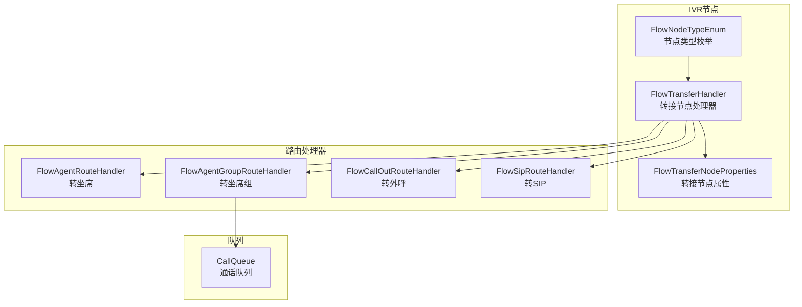
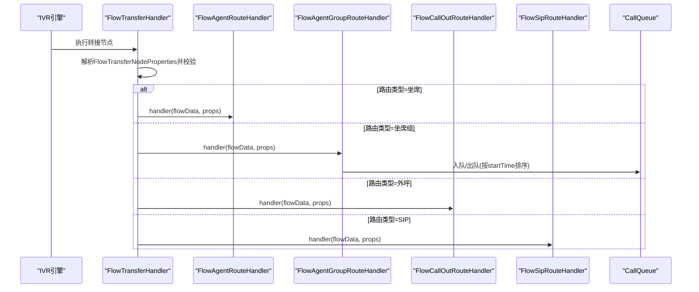
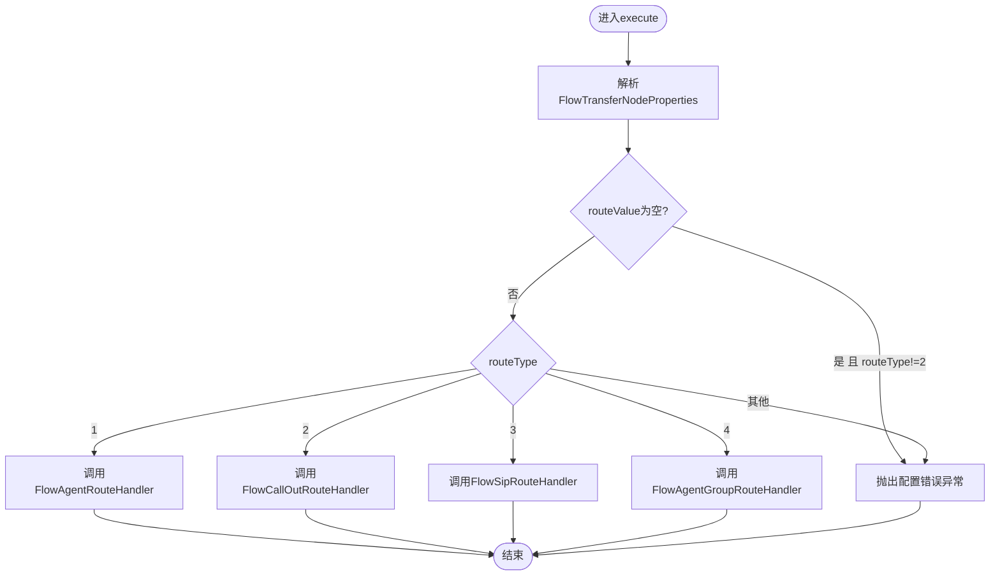
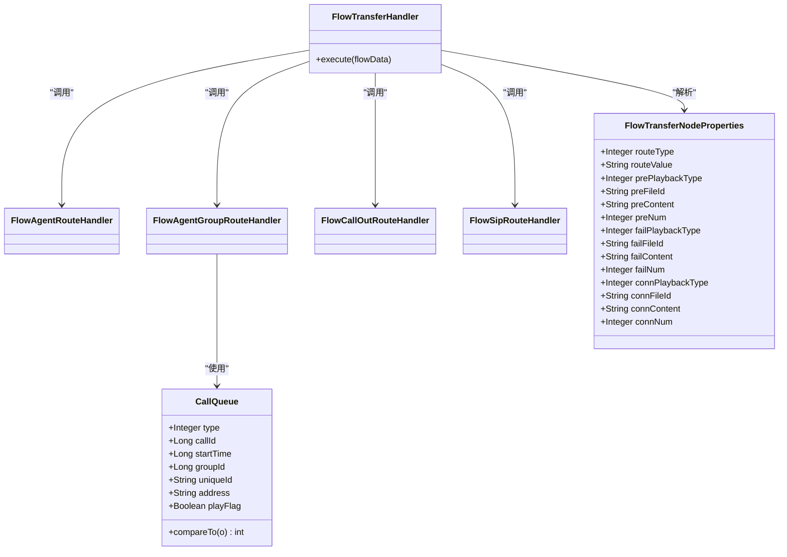

# 转人工节点

<cite>
**本文引用的文件**
- [FlowTransferHandler.java](file://yudao-cloud/yudao-module-cc/yudao-module-cc-server/src/main/java/cn/iocoder/yudao/module/cc/ivr/handler/node/FlowTransferHandler.java)
- [FlowTransferNodeProperties.java](file://yudao-cloud/yudao-module-cc/yudao-module-cc-server/src/main/java/cn/iocoder/yudao/module/cc/ivr/properties/FlowTransferNodeProperties.java)
- [FlowNodeTypeEnum.java](file://yudao-cloud/yudao-module-cc/yudao-module-cc-server/src/main/java/cn/iocoder/yudao/module/cc/ivr/enums/FlowNodeTypeEnum.java)
- [CallQueue.java](file://yudao-cloud/yudao-module-cc/yudao-module-cc-server/src/main/java/cn/iocoder/yudao/module/cc/esl/queue/CallQueue.java)
- [FlowAgentRouteHandler.java](file://yudao-cloud/yudao-module-cc/yudao-module-cc-server/src/main/java/cn/iocoder/yudao/module/cc/ivr/handler/route/FlowAgentRouteHandler.java)
- [FlowAgentGroupRouteHandler.java](file://yudao-cloud/yudao-module-cc/yudao-module-cc-server/src/main/java/cn/iocoder/yudao/module/cc/ivr/handler/route/FlowAgentGroupRouteHandler.java)
- [FlowCallOutRouteHandler.java](file://yudao-cloud/yudao-module-cc/yudao-module-cc-server/src/main/java/cn/iocoder/yudao/module/cc/ivr/handler/route/FlowCallOutRouteHandler.java)
- [FlowSipRouteHandler.java](file://yudao-cloud/yudao-module-cc/yudao-module-cc-server/src/main/java/cn/iocoder/yudao/module/cc/ivr/handler/route/FlowSipRouteHandler.java)
</cite>

## 目录
1. [简介](#简介)
2. [项目结构](#项目结构)
3. [核心组件](#核心组件)
4. [架构总览](#架构总览)
5. [详细组件分析](#详细组件分析)
6. [依赖关系分析](#依赖关系分析)
7. [性能考量](#性能考量)
8. [故障排查指南](#故障排查指南)
9. [结论](#结论)
10. [附录](#附录)

## 简介
本章节面向IVR流程中的“转人工”节点，说明其将呼叫转移到坐席或人工服务的功能特性与实现方式。内容涵盖：
- 坐席分配策略、排队机制与转移失败处理
- 配置项说明（目标坐席组选择、优先级设置、等待时间等）
- 业务逻辑（坐席可用性检查、路由算法、状态同步）
- 与呼叫中心系统的集成（SIP信令与会话管理）
- 体验优化与故障恢复策略

## 项目结构
“转人工”能力位于呼叫中心模块的IVR子系统中，由统一的转接处理器分发到不同路由处理器，分别负责坐席、外呼、SIP以及坐席组路由。队列模型用于承载排队信息。

图表来源
- [FlowTransferHandler.java:21-65](file://yudao-cloud/yudao-module-cc/yudao-module-cc-server/src/main/java/cn/iocoder/yudao/module/cc/ivr/handler/node/FlowTransferHandler.java#L21-L65)
- [FlowTransferNodeProperties.java:1-81](file://yudao-cloud/yudao-module-cc/yudao-module-cc-server/src/main/java/cn/iocoder/yudao/module/cc/ivr/properties/FlowTransferNodeProperties.java#L1-L81)
- [FlowNodeTypeEnum.java:1-50](file://yudao-cloud/yudao-module-cc/yudao-module-cc-server/src/main/java/cn/iocoder/yudao/module/cc/ivr/enums/FlowNodeTypeEnum.java#L1-L50)
- [CallQueue.java:1-54](file://yudao-cloud/yudao-module-cc/yudao-module-cc-server/src/main/java/cn/iocoder/yudao/module/cc/esl/queue/CallQueue.java#L1-L54)

章节来源
- [FlowTransferHandler.java:21-65](file://yudao-cloud/yudao-module-cc/yudao-module-cc-server/src/main/java/cn/iocoder/yudao/module/cc/ivr/handler/node/FlowTransferHandler.java#L21-L65)
- [FlowTransferNodeProperties.java:1-81](file://yudao-cloud/yudao-module-cc/yudao-module-cc-server/src/main/java/cn/iocoder/yudao/module/cc/ivr/properties/FlowTransferNodeProperties.java#L1-L81)
- [FlowNodeTypeEnum.java:1-50](file://yudao-cloud/yudao-module-cc/yudao-module-cc-server/src/main/java/cn/iocoder/yudao/module/cc/ivr/enums/FlowNodeTypeEnum.java#L1-L50)
- [CallQueue.java:1-54](file://yudao-cloud/yudao-module-cc/yudao-module-cc-server/src/main/java/cn/iocoder/yudao/module/cc/esl/queue/CallQueue.java#L1-L54)

## 核心组件
- 转接节点处理器：根据配置的路由类型，将请求分发至具体路由处理器；对配置进行校验并抛出异常以阻止错误流转。
- 转接节点属性：定义路由类型、目标值、转接前后放音策略（文件/文本及次数）、未接通/接通提示等。
- 路由处理器族：分别实现转坐席、转坐席组、转外呼、转SIP的具体路由逻辑。
- 通话队列：封装排队所需的关键字段（类型、通话ID、进入时间、坐席组ID、唯一标识、FS地址、是否播放排队音），支持按进入时间排序。

章节来源
- [FlowTransferHandler.java:21-65](file://yudao-cloud/yudao-module-cc/yudao-module-cc-server/src/main/java/cn/iocoder/yudao/module/cc/ivr/handler/node/FlowTransferHandler.java#L21-L65)
- [FlowTransferNodeProperties.java:1-81](file://yudao-cloud/yudao-module-cc/yudao-module-cc-server/src/main/java/cn/iocoder/yudao/module/cc/ivr/properties/FlowTransferNodeProperties.java#L1-L81)
- [CallQueue.java:1-54](file://yudao-cloud/yudao-module-cc/yudao-module-cc-server/src/main/java/cn/iocoder/yudao/module/cc/esl/queue/CallQueue.java#L1-L54)

## 架构总览
下图展示了从IVR节点触发到具体路由处理的调用链，以及队列在坐席组路由中的作用。

图表来源
- [FlowTransferHandler.java:45-65](file://yudao-cloud/yudao-module-cc/yudao-module-cc-server/src/main/java/cn/iocoder/yudao/module/cc/ivr/handler/node/FlowTransferHandler.java#L45-L65)
- [CallQueue.java:14-52](file://yudao-cloud/yudao-module-cc/yudao-module-cc-server/src/main/java/cn/iocoder/yudao/module/cc/esl/queue/CallQueue.java#L14-L52)

## 详细组件分析

### 转接节点处理器 FlowTransferHandler
- 职责：读取当前节点配置，解析为FlowTransferNodeProperties，校验必填项后按routeType分发给对应路由处理器。
- 关键行为：
  - 当routeValue为空且非“转外呼”时，视为配置错误并抛出异常，阻断流程。
  - 支持四种路由类型：坐席、外呼、SIP、坐席组。
- 可观测性：通过日志记录执行过程与异常。

图表来源
- [FlowTransferHandler.java:45-65](file://yudao-cloud/yudao-module-cc/yudao-module-cc-server/src/main/java/cn/iocoder/yudao/module/cc/ivr/handler/node/FlowTransferHandler.java#L45-L65)

章节来源
- [FlowTransferHandler.java:21-65](file://yudao-cloud/yudao-module-cc/yudao-module-cc-server/src/main/java/cn/iocoder/yudao/module/cc/ivr/handler/node/FlowTransferHandler.java#L21-L65)

### 转接节点属性 FlowTransferNodeProperties
- 路由相关：
  - routeType：路由类型（1-坐席，2-外呼，3-SIP，4-坐席组）
  - routeValue：路由目标值（如坐席ID、号码、SIP地址、坐席组ID等）
- 放音策略：
  - prePlaybackType/preFileId/preContent/preNum：转接前提示音（文件/文本及次数）
  - failPlaybackType/failFileId/failContent/failNum：未接通提示音
  - connPlaybackType/connFileId/connContent/connNum：接通提示音
- 用途：驱动IVR在不同阶段播放提示音，提升用户体验与可感知性。

章节来源
- [FlowTransferNodeProperties.java:1-81](file://yudao-cloud/yudao-module-cc/yudao-module-cc-server/src/main/java/cn/iocoder/yudao/module/cc/ivr/properties/FlowTransferNodeProperties.java#L1-L81)

### 路由处理器族
- FlowAgentRouteHandler：将呼叫路由到指定坐席，通常涉及坐席可用性检查、技能匹配、负载均衡等。
- FlowAgentGroupRouteHandler：将呼叫路由到坐席组，结合队列进行排队与分配。
- FlowCallOutRouteHandler：发起外呼，常用于回拨或主动联系场景。
- FlowSipRouteHandler：将呼叫路由到外部SIP终端或网关。

章节来源
- [FlowTransferHandler.java:36-43](file://yudao-cloud/yudao-module-cc/yudao-module-cc-server/src/main/java/cn/iocoder/yudao/module/cc/ivr/handler/node/FlowTransferHandler.java#L36-L43)
- [FlowTransferHandler.java:58-62](file://yudao-cloud/yudao-module-cc/yudao-module-cc-server/src/main/java/cn/iocoder/yudao/module/cc/ivr/handler/node/FlowTransferHandler.java#L58-L62)

### 队列模型 CallQueue
- 关键字段：
  - type：普通/VIP
  - callId：通话ID
  - startTime：进入时间（用于排序）
  - groupId：坐席组ID
  - uniqueId：通道唯一标识
  - address：FreeSWITCH地址
  - playFlag：是否播放排队音
- 排序规则：按进入时间升序，保证先到先服务。

章节来源
- [CallQueue.java:14-52](file://yudao-cloud/yudao-module-cc/yudao-module-cc-server/src/main/java/cn/iocoder/yudao/module/cc/esl/queue/CallQueue.java#L14-L52)

## 依赖关系分析
- FlowTransferHandler依赖四个路由处理器，形成“统一入口、多路分发”的结构，便于扩展新的路由类型。
- FlowNodeTypeEnum将前端节点类型映射到后端处理器名称，确保前后端一致。
- CallQueue作为数据载体被坐席组路由使用，支撑排队与优先级控制。

图表来源
- [FlowTransferHandler.java:36-65](file://yudao-cloud/yudao-module-cc/yudao-module-cc-server/src/main/java/cn/iocoder/yudao/module/cc/ivr/handler/node/FlowTransferHandler.java#L36-L65)
- [FlowTransferNodeProperties.java:1-81](file://yudao-cloud/yudao-module-cc/yudao-module-cc-server/src/main/java/cn/iocoder/yudao/module/cc/ivr/properties/FlowTransferNodeProperties.java#L1-L81)
- [CallQueue.java:14-52](file://yudao-cloud/yudao-module-cc/yudao-module-cc-server/src/main/java/cn/iocoder/yudao/module/cc/esl/queue/CallQueue.java#L14-L52)

章节来源
- [FlowTransferHandler.java:36-65](file://yudao-cloud/yudao-module-cc/yudao-module-cc-server/src/main/java/cn/iocoder/yudao/module/cc/ivr/handler/node/FlowTransferHandler.java#L36-L65)
- [FlowNodeTypeEnum.java:10-30](file://yudao-cloud/yudao-module-cc/yudao-module-cc-server/src/main/java/cn/iocoder/yudao/module/cc/ivr/enums/FlowNodeTypeEnum.java#L10-L30)

## 性能考量
- 路由分发：采用简单switch分发，O(1)复杂度，适合高并发场景。
- 队列排序：基于进入时间的比较，建议配合优先队列或索引结构降低排序开销。
- 放音策略：合理设置pre/fail/conn提示音次数，避免重复播放造成资源浪费。
- 可扩展性：新增路由类型只需增加处理器并在分发处注册，保持低耦合。

[本节为通用性能讨论，不直接分析具体文件]

## 故障排查指南
- 配置错误：当routeValue为空且非“转外呼”，或routeType不在支持范围内时，会抛出配置错误异常。请检查IVR节点配置是否正确。
- 路由失败：若坐席不可用或无空闲，应检查坐席状态、技能匹配与负载策略；必要时启用排队或降级到其他组。
- 放音异常：确认pre/fail/conn对应的音频文件或TTS内容存在且可播放。
- 队列问题：检查CallQueue的startTime与playFlag是否正确设置，确保排队顺序与提示音播放符合预期。

章节来源
- [FlowTransferHandler.java:49-65](file://yudao-cloud/yudao-module-cc/yudao-module-cc-server/src/main/java/cn/iocoder/yudao/module/cc/ivr/handler/node/FlowTransferHandler.java#L49-L65)
- [CallQueue.java:14-52](file://yudao-cloud/yudao-module-cc/yudao-module-cc-server/src/main/java/cn/iocoder/yudao/module/cc/esl/queue/CallQueue.java#L14-L52)

## 结论
“转人工”节点通过统一的转接处理器与多种路由处理器组合，实现了灵活的呼叫转移能力。借助队列模型与丰富的放音配置，可在不同场景下提供稳定、可控的人工接入体验。建议在生产环境中完善监控与告警，持续优化路由策略与排队体验。

[本节为总结性内容，不直接分析具体文件]

## 附录

### 配置选项速查
- 路由类型：1-坐席，2-外呼，3-SIP，4-坐席组
- 路由目标值：routeValue（坐席ID/号码/SIP地址/坐席组ID）
- 转接前提示：prePlaybackType、preFileId、preContent、preNum
- 未接通提示：failPlaybackType、failFileId、failContent、failNum
- 接通提示：connPlaybackType、connFileId、connContent、connNum

章节来源
- [FlowTransferNodeProperties.java:10-79](file://yudao-cloud/yudao-module-cc/yudao-module-cc-server/src/main/java/cn/iocoder/yudao/module/cc/ivr/properties/FlowTransferNodeProperties.java#L10-L79)

### 与呼叫中心系统集成要点
- SIP信令与会话：通过SIP路由处理器与FreeSWITCH交互，完成会话建立与媒体流转发。
- 事件与状态：利用ESL事件与队列状态，实现坐席可用性检查、排队与释放。
- 会话管理：通过uniqueId与address关联通道与FS节点，保障会话生命周期管理。

章节来源
- [FlowSipRouteHandler.java](file://yudao-cloud/yudao-module-cc/yudao-module-cc-server/src/main/java/cn/iocoder/yudao/module/cc/ivr/handler/route/FlowSipRouteHandler.java)
- [CallQueue.java:34-47](file://yudao-cloud/yudao-module-cc/yudao-module-cc-server/src/main/java/cn/iocoder/yudao/module/cc/esl/queue/CallQueue.java#L34-L47)