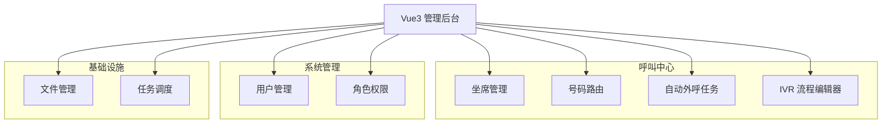
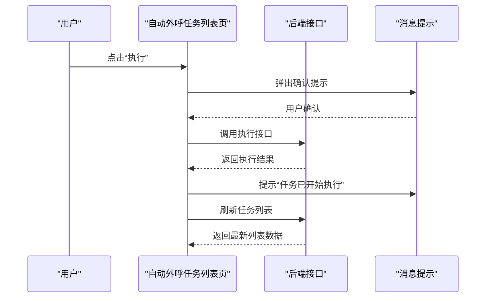
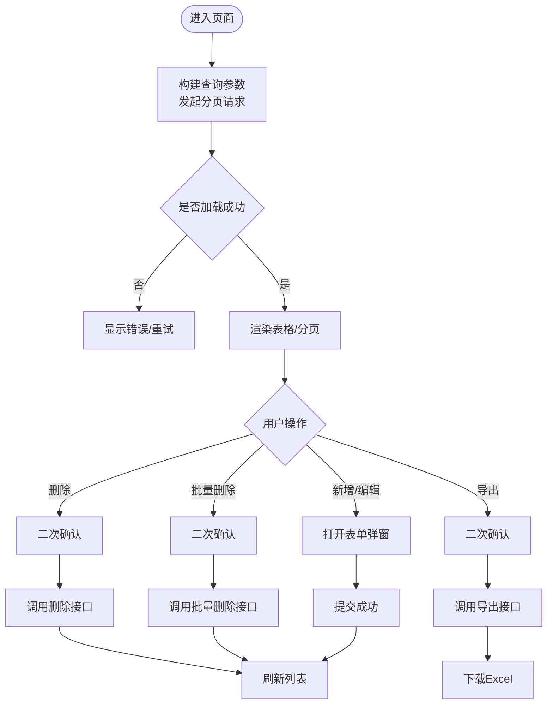
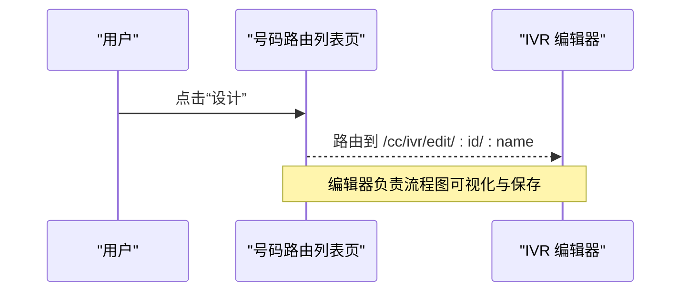
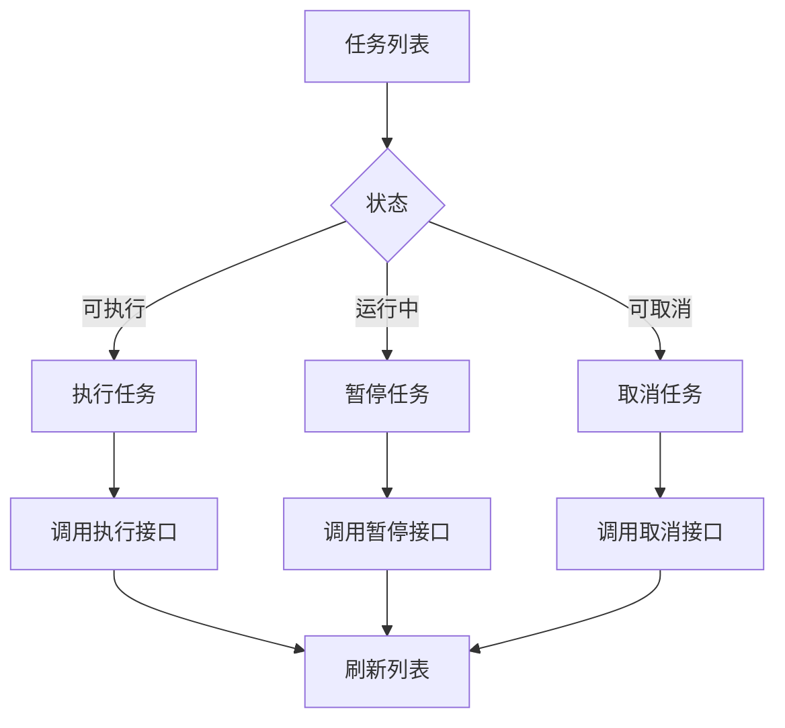
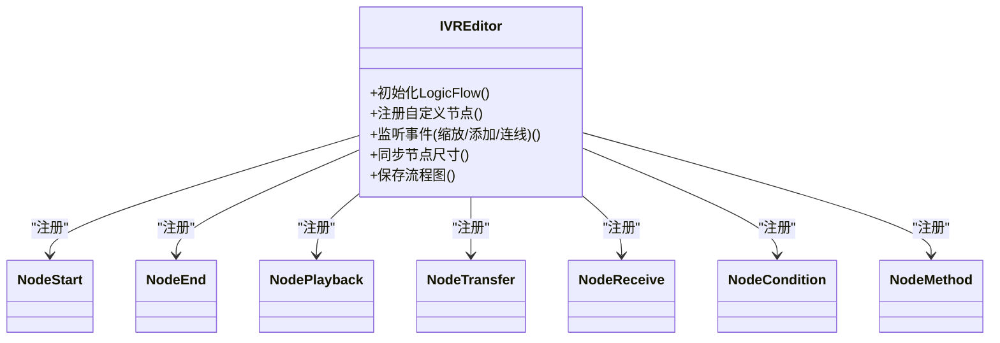
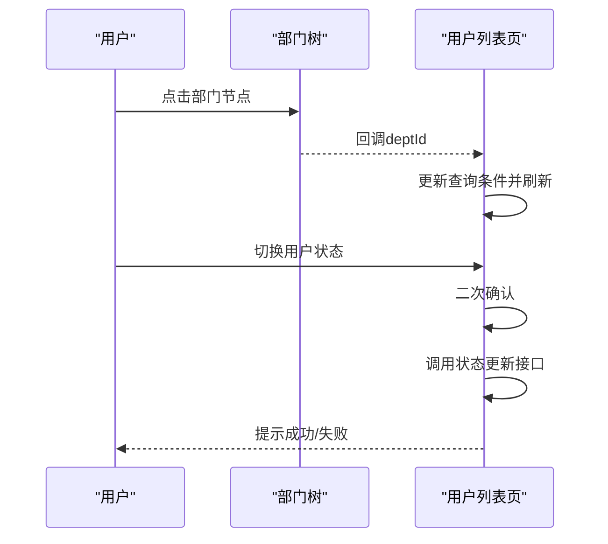
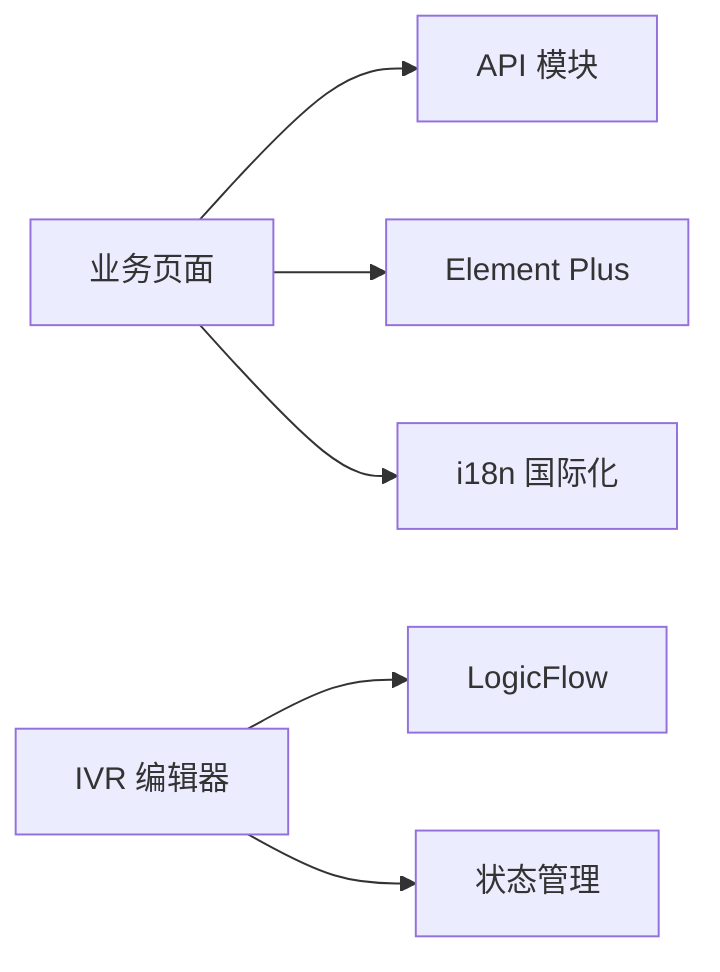

# 业务界面

<cite>
**本文引用的文件**
- [yudao-ui-admin-vue3/src/views/cc/sysagent/index.vue](file://yudao-ui-admin-vue3/src/views/cc/sysagent/index.vue)
- [yudao-ui-admin-vue3/src/views/cc/autocalltask/index.vue](file://yudao-ui-admin-vue3/src/views/cc/autocalltask/index.vue)
- [yudao-ui-admin-vue3/src/views/cc/callroute/index.vue](file://yudao-ui-admin-vue3/src/views/cc/callroute/index.vue)
- [yudao-ui-admin-vue3/src/views/cc/ivr/ivrEdit.vue](file://yudao-ui-admin-vue3/src/views/cc/ivr/ivrEdit.vue)
- [yudao-ui-admin-vue3/src/views/system/user/index.vue](file://yudao-ui-admin-vue3/src/views/system/user/index.vue)
- [yudao-ui-admin-vue3/src/views/system/role/index.vue](file://yudao-ui-admin-vue3/src/views/system/role/index.vue)
- [yudao-ui-admin-vue3/src/views/infra/file/index.vue](file://yudao-ui-admin-vue3/src/views/infra/file/index.vue)
- [yudao-ui-admin-vue3/src/views/infra/job/index.vue](file://yudao-ui-admin-vue3/src/views/infra/job/index.vue)
- [yudao-ui-admin-vue3/src/locales/zh-CN.ts](file://yudao-ui-admin-vue3/src/locales/zh-CN.ts)
</cite>

## 目录
1. [简介](#简介)
2. [项目结构](#项目结构)
3. [核心组件](#核心组件)
4. [架构总览](#架构总览)
5. [详细组件分析](#详细组件分析)
6. [依赖分析](#依赖分析)
7. [性能考虑](#性能考虑)
8. [故障排查指南](#故障排查指南)
9. [结论](#结论)
10. [附录](#附录)

## 简介
本文件面向呼叫中心业务界面的设计与实现，覆盖坐席工作台、呼叫控制面板与实时监控面板的交互逻辑、数据展示与操作流程；同时文档化系统管理（用户管理、角色权限、系统配置）与基础设施管理（文件管理、任务调度、监控告警）等模块。并给出响应式布局、多语言支持与国际化配置、界面定制开发与用户体验优化建议。

## 项目结构
前端采用 Vue3 + Element Plus 的管理后台工程，按“业务域”组织页面：
- 呼叫中心（cc）：坐席、号码路由、自动外呼、IVR 流程编辑器等
- 系统管理（system）：用户、角色、菜单、字典、通知、短信、邮件等
- 基础设施（infra）：文件、定时任务、Redis、服务监控等
- 国际化（locales）：中文文案集中管理

图表来源
- [yudao-ui-admin-vue3/src/views/cc/sysagent/index.vue:1-233](file://yudao-ui-admin-vue3/src/views/cc/sysagent/index.vue#L1-L233)
- [yudao-ui-admin-vue3/src/views/cc/callroute/index.vue:1-271](file://yudao-ui-admin-vue3/src/views/cc/callroute/index.vue#L1-L271)
- [yudao-ui-admin-vue3/src/views/cc/autocalltask/index.vue:1-395](file://yudao-ui-admin-vue3/src/views/cc/autocalltask/index.vue#L1-L395)
- [yudao-ui-admin-vue3/src/views/cc/ivr/ivrEdit.vue:1-793](file://yudao-ui-admin-vue3/src/views/cc/ivr/ivrEdit.vue#L1-L793)
- [yudao-ui-admin-vue3/src/views/system/user/index.vue:1-393](file://yudao-ui-admin-vue3/src/views/system/user/index.vue#L1-L393)
- [yudao-ui-admin-vue3/src/views/system/role/index.vue:1-300](file://yudao-ui-admin-vue3/src/views/system/role/index.vue#L1-L300)
- [yudao-ui-admin-vue3/src/views/infra/file/index.vue:1-247](file://yudao-ui-admin-vue3/src/views/infra/file/index.vue#L1-L247)
- [yudao-ui-admin-vue3/src/views/infra/job/index.vue:1-357](file://yudao-ui-admin-vue3/src/views/infra/job/index.vue#L1-L357)

章节来源
- [yudao-ui-admin-vue3/src/views/cc/sysagent/index.vue:1-233](file://yudao-ui-admin-vue3/src/views/cc/sysagent/index.vue#L1-L233)
- [yudao-ui-admin-vue3/src/views/cc/callroute/index.vue:1-271](file://yudao-ui-admin-vue3/src/views/cc/callroute/index.vue#L1-L271)
- [yudao-ui-admin-vue3/src/views/cc/autocalltask/index.vue:1-395](file://yudao-ui-admin-vue3/src/views/cc/autocalltask/index.vue#L1-L395)
- [yudao-ui-admin-vue3/src/views/cc/ivr/ivrEdit.vue:1-793](file://yudao-ui-admin-vue3/src/views/cc/ivr/ivrEdit.vue#L1-L793)
- [yudao-ui-admin-vue3/src/views/system/user/index.vue:1-393](file://yudao-ui-admin-vue3/src/views/system/user/index.vue#L1-L393)
- [yudao-ui-admin-vue3/src/views/system/role/index.vue:1-300](file://yudao-ui-admin-vue3/src/views/system/role/index.vue#L1-L300)
- [yudao-ui-admin-vue3/src/views/infra/file/index.vue:1-247](file://yudao-ui-admin-vue3/src/views/infra/file/index.vue#L1-L247)
- [yudao-ui-admin-vue3/src/views/infra/job/index.vue:1-357](file://yudao-ui-admin-vue3/src/views/infra/job/index.vue#L1-L357)

## 核心组件
- 坐席工作台（CC 坐席管理）：支持按 SIP 用户名、开通状态、在线状态筛选，列表分页、新增/编辑/删除/批量删除、导出。
- 呼叫控制面板（号码路由）：按名称、号码、方向、启用状态筛选，列表分页、新增/编辑/删除/批量删除/导出，支持跳转到 IVR 设计器。
- 实时监控面板（自动外呼任务）：任务名称、状态、计划时间筛选；列表显示进度条、状态标签；支持执行、暂停、取消、查看记录、导出。
- 系统管理（用户管理）：部门树联动筛选，用户列表分页，状态切换、导入/导出、批量删除、重置密码、分配角色。
- 系统管理（角色权限）：角色列表分页，菜单权限、数据权限分配，状态切换、导出、批量删除。
- 基础设施（文件管理）：路径/类型/时间范围筛选，图片预览、PDF 预览/下载、复制链接、删除、批量删除。
- 基础设施（任务调度）：任务名称/状态/处理器名筛选，开启/暂停、执行一次、同步到调度器、查看任务详情与日志、导出。

章节来源
- [yudao-ui-admin-vue3/src/views/cc/sysagent/index.vue:1-233](file://yudao-ui-admin-vue3/src/views/cc/sysagent/index.vue#L1-L233)
- [yudao-ui-admin-vue3/src/views/cc/callroute/index.vue:1-271](file://yudao-ui-admin-vue3/src/views/cc/callroute/index.vue#L1-L271)
- [yudao-ui-admin-vue3/src/views/cc/autocalltask/index.vue:1-395](file://yudao-ui-admin-vue3/src/views/cc/autocalltask/index.vue#L1-L395)
- [yudao-ui-admin-vue3/src/views/system/user/index.vue:1-393](file://yudao-ui-admin-vue3/src/views/system/user/index.vue#L1-L393)
- [yudao-ui-admin-vue3/src/views/system/role/index.vue:1-300](file://yudao-ui-admin-vue3/src/views/system/role/index.vue#L1-L300)
- [yudao-ui-admin-vue3/src/views/infra/file/index.vue:1-247](file://yudao-ui-admin-vue3/src/views/infra/file/index.vue#L1-L247)
- [yudao-ui-admin-vue3/src/views/infra/job/index.vue:1-357](file://yudao-ui-admin-vue3/src/views/infra/job/index.vue#L1-L357)

## 架构总览
以下序列图展示“自动外呼任务”从列表页到执行的关键交互链路：

图表来源
- [yudao-ui-admin-vue3/src/views/cc/autocalltask/index.vue:322-330](file://yudao-ui-admin-vue3/src/views/cc/autocalltask/index.vue#L322-L330)
- [yudao-ui-admin-vue3/src/views/cc/autocalltask/index.vue:282-292](file://yudao-ui-admin-vue3/src/views/cc/autocalltask/index.vue#L282-L292)

章节来源
- [yudao-ui-admin-vue3/src/views/cc/autocalltask/index.vue:1-395](file://yudao-ui-admin-vue3/src/views/cc/autocalltask/index.vue#L1-L395)

## 详细组件分析

### 坐席工作台（CC 坐席管理）
- 功能要点
  - 查询：SIP 用户名、开通状态、在线状态
  - 列表：分页、多选、状态字典渲染、创建时间格式化
  - 操作：新增/编辑/删除/批量删除/导出
- 交互流程
  - 搜索/重置触发分页查询
  - 行选择变更维护选中 ID 集合
  - 删除前二次确认，成功后刷新列表
  - 导出前二次确认，完成后下载 Excel

图表来源
- [yudao-ui-admin-vue3/src/views/cc/sysagent/index.vue:168-233](file://yudao-ui-admin-vue3/src/views/cc/sysagent/index.vue#L168-L233)

章节来源
- [yudao-ui-admin-vue3/src/views/cc/sysagent/index.vue:1-233](file://yudao-ui-admin-vue3/src/views/cc/sysagent/index.vue#L1-L233)

### 呼叫控制面板（号码路由）
- 功能要点
  - 查询：名称、号码、方向、启用状态
  - 列表：分页、状态/方向字典渲染、创建时间格式化
  - 操作：新增/编辑/删除/批量删除/导出；支持“设计”跳转至 IVR 编辑器
- 交互流程
  - 搜索/重置触发分页查询
  - 删除/批量删除前二次确认
  - 导出前二次确认并下载 Excel

图表来源
- [yudao-ui-admin-vue3/src/views/cc/callroute/index.vue:124-136](file://yudao-ui-admin-vue3/src/views/cc/callroute/index.vue#L124-L136)
- [yudao-ui-admin-vue3/src/views/cc/ivr/ivrEdit.vue:153-158](file://yudao-ui-admin-vue3/src/views/cc/ivr/ivrEdit.vue#L153-L158)

章节来源
- [yudao-ui-admin-vue3/src/views/cc/callroute/index.vue:1-271](file://yudao-ui-admin-vue3/src/views/cc/callroute/index.vue#L1-L271)

### 实时监控面板（自动外呼任务）
- 功能要点
  - 查询：任务名称、状态、计划时间范围
  - 列表：状态标签、进度条（成功/失败/总数）、计划时间、创建时间
  - 操作：执行、暂停、取消、查看记录、删除、导出
- 交互流程
  - 执行/暂停/取消均二次确认后调用对应接口
  - 进度计算：(成功+失败)/总数
  - 导出前二次确认并下载 Excel

图表来源
- [yudao-ui-admin-vue3/src/views/cc/autocalltask/index.vue:268-280](file://yudao-ui-admin-vue3/src/views/cc/autocalltask/index.vue#L268-L280)
- [yudao-ui-admin-vue3/src/views/cc/autocalltask/index.vue:322-350](file://yudao-ui-admin-vue3/src/views/cc/autocalltask/index.vue#L322-L350)

章节来源
- [yudao-ui-admin-vue3/src/views/cc/autocalltask/index.vue:1-395](file://yudao-ui-admin-vue3/src/views/cc/autocalltask/index.vue#L1-L395)

### IVR 流程编辑器
- 功能要点
  - 基于 LogicFlow 的可视化流程图编辑器
  - 节点类型：开始、结束、放音、转接、收号、判断器、方法等
  - 画布行为：网格背景、贝塞尔连线、锚点拖拽、边文本编辑、轮廓视图
  - 尺寸同步：缩放/平移后防抖同步节点尺寸，避免锚点/连线错位
  - 保存：导出图数据，处理分支事件标识，调用接口保存并回显
- 关键交互
  - 添加组件：点击添加或拖拽添加到指定位置
  - 连线：锚点拖拽时自动填充分支/按键值作为边文本
  - 视图定位：首次加载将开始节点置于视口合适位置，固定缩放便于编辑

图表来源
- [yudao-ui-admin-vue3/src/views/cc/ivr/ivrEdit.vue:176-410](file://yudao-ui-admin-vue3/src/views/cc/ivr/ivrEdit.vue#L176-L410)
- [yudao-ui-admin-vue3/src/views/cc/ivr/ivrEdit.vue:516-574](file://yudao-ui-admin-vue3/src/views/cc/ivr/ivrEdit.vue#L516-L574)

章节来源
- [yudao-ui-admin-vue3/src/views/cc/ivr/ivrEdit.vue:1-793](file://yudao-ui-admin-vue3/src/views/cc/ivr/ivrEdit.vue#L1-L793)

### 系统管理：用户管理
- 功能要点
  - 左侧部门树联动筛选
  - 用户列表：分页、状态开关、创建时间格式化
  - 操作：新增/修改、导入/导出、批量删除、重置密码、分配角色
- 交互流程
  - 部门节点点击更新 deptId 并刷新列表
  - 状态切换二次确认后调用接口，失败回滚
  - 导出前二次确认并下载 Excel

图表来源
- [yudao-ui-admin-vue3/src/views/system/user/index.vue:267-271](file://yudao-ui-admin-vue3/src/views/system/user/index.vue#L267-L271)
- [yudao-ui-admin-vue3/src/views/system/user/index.vue:285-300](file://yudao-ui-admin-vue3/src/views/system/user/index.vue#L285-L300)

章节来源
- [yudao-ui-admin-vue3/src/views/system/user/index.vue:1-393](file://yudao-ui-admin-vue3/src/views/system/user/index.vue#L1-L393)

### 系统管理：角色权限
- 功能要点
  - 角色列表：分页、状态/类型/标识/排序/备注
  - 操作：新增/编辑、菜单权限、数据权限、删除、批量删除、导出
- 交互流程
  - 菜单权限/数据权限通过独立弹窗完成
  - 删除/批量删除前二次确认
  - 导出前二次确认并下载 Excel

章节来源
- [yudao-ui-admin-vue3/src/views/system/role/index.vue:1-300](file://yudao-ui-admin-vue3/src/views/system/role/index.vue#L1-L300)

### 基础设施：文件管理
- 功能要点
  - 查询：路径、类型、创建时间范围
  - 列表：文件大小格式化、图片预览、PDF 预览/下载、复制链接、删除、批量删除
- 交互流程
  - 复制链接使用剪贴板 API，失败提示
  - 删除/批量删除前二次确认

章节来源
- [yudao-ui-admin-vue3/src/views/infra/file/index.vue:1-247](file://yudao-ui-admin-vue3/src/views/infra/file/index.vue#L1-L247)

### 基础设施：任务调度
- 功能要点
  - 查询：任务名称、状态、处理器名
  - 列表：状态字典、CRON 表达式、处理器参数
  - 操作：新增/修改、开启/暂停、执行一次、同步到调度器、查看任务详情与日志、导出
- 交互流程
  - 同步任务到调度器前二次确认
  - 执行一次前二次确认
  - 跳转日志页支持按任务过滤

章节来源
- [yudao-ui-admin-vue3/src/views/infra/job/index.vue:1-357](file://yudao-ui-admin-vue3/src/views/infra/job/index.vue#L1-L357)

## 依赖分析
- 页面与 API 解耦：各列表页通过统一 API 模块获取数据，便于替换后端或增加缓存层
- 权限控制：按钮级权限通过指令 v-hasPermi 控制可见性，减少无效请求
- 国际化：通用文案通过 i18n 注入，提升可维护性与扩展性
- 第三方库：LogicFlow 用于 IVR 流程图编辑；Element Plus 提供基础 UI 组件

图表来源
- [yudao-ui-admin-vue3/src/views/cc/ivr/ivrEdit.vue:54-79](file://yudao-ui-admin-vue3/src/views/cc/ivr/ivrEdit.vue#L54-L79)
- [yudao-ui-admin-vue3/src/views/cc/autocalltask/index.vue:192-205](file://yudao-ui-admin-vue3/src/views/cc/autocalltask/index.vue#L192-L205)
- [yudao-ui-admin-vue3/src/locales/zh-CN.ts:1-58](file://yudao-ui-admin-vue3/src/locales/zh-CN.ts#L1-L58)

章节来源
- [yudao-ui-admin-vue3/src/views/cc/ivr/ivrEdit.vue:1-793](file://yudao-ui-admin-vue3/src/views/cc/ivr/ivrEdit.vue#L1-L793)
- [yudao-ui-admin-vue3/src/views/cc/autocalltask/index.vue:1-395](file://yudao-ui-admin-vue3/src/views/cc/autocalltask/index.vue#L1-L395)
- [yudao-ui-admin-vue3/src/locales/zh-CN.ts:1-466](file://yudao-ui-admin-vue3/src/locales/zh-CN.ts#L1-L466)

## 性能考虑
- 列表分页：所有列表采用分页查询，避免一次性加载大量数据
- 防抖与节流：IVR 编辑器在缩放/平移时使用防抖同步节点尺寸，降低重绘开销
- 按需渲染：部分组件使用懒加载与虚拟滚动（如选择器），减少首屏压力
- 资源优化：图片懒加载、PDF 直接预览不下载，减少带宽占用
- 权限前置：按钮级权限控制减少无效请求与渲染

[本节为通用指导，无需特定文件引用]

## 故障排查指南
- 列表无数据
  - 检查查询参数是否正确，确认后端接口返回格式
  - 查看网络面板是否有 401/403/500 错误
- 导出失败
  - 确认导出接口返回二进制流，浏览器未拦截下载
  - 检查二次确认与 loading 状态是否正常
- IVR 编辑器异常
  - 缩放后节点错位：确认已启用 graph:transform 防抖与尺寸同步
  - 首次加载视图偏移：确认在数据渲染后正确设置初始视图与缩放
- 权限问题
  - 检查 v-hasPermi 指令绑定的权限码是否与后端一致
  - 确认登录态与角色/菜单权限配置

章节来源
- [yudao-ui-admin-vue3/src/views/cc/ivr/ivrEdit.vue:342-400](file://yudao-ui-admin-vue3/src/views/cc/ivr/ivrEdit.vue#L342-L400)
- [yudao-ui-admin-vue3/src/views/cc/autocalltask/index.vue:322-350](file://yudao-ui-admin-vue3/src/views/cc/autocalltask/index.vue#L322-L350)
- [yudao-ui-admin-vue3/src/views/system/user/index.vue:285-300](file://yudao-ui-admin-vue3/src/views/system/user/index.vue#L285-L300)

## 结论
本业务界面以模块化方式组织呼叫中心、系统管理与基础设施三大域，提供完善的列表查询、表单编辑、权限控制与导出能力。IVR 编辑器基于 LogicFlow 实现了可视化流程编排，具备健壮的尺寸同步与视图定位机制。整体遵循前后端分离、权限前置、国际化与响应式设计原则，具备良好的可扩展性与用户体验。

[本节为总结性内容，无需特定文件引用]

## 附录

### 界面交互与数据展示规范
- 统一使用 ContentWrap 包裹内容区，保持视觉一致性
- 列表统一分页组件，支持页码与每页条数切换
- 状态字段使用字典标签渲染，保证一致性与可维护性
- 时间字段统一格式化输出

章节来源
- [yudao-ui-admin-vue3/src/views/cc/sysagent/index.vue:77-133](file://yudao-ui-admin-vue3/src/views/cc/sysagent/index.vue#L77-L133)
- [yudao-ui-admin-vue3/src/views/cc/callroute/index.vue:92-154](file://yudao-ui-admin-vue3/src/views/cc/callroute/index.vue#L92-L154)
- [yudao-ui-admin-vue3/src/views/cc/autocalltask/index.vue:69-183](file://yudao-ui-admin-vue3/src/views/cc/autocalltask/index.vue#L69-L183)

### 响应式设计与多语言支持
- 响应式：使用栅格布局与弹性样式，适配不同屏幕尺寸
- 国际化：通过 i18n 注入通用文案，支持中英文切换（当前仓库包含中文文案）
- 主题：统一样式变量，确保全局视觉一致

章节来源
- [yudao-ui-admin-vue3/src/views/system/user/index.vue:6-13](file://yudao-ui-admin-vue3/src/views/system/user/index.vue#L6-L13)
- [yudao-ui-admin-vue3/src/locales/zh-CN.ts:1-58](file://yudao-ui-admin-vue3/src/locales/zh-CN.ts#L1-L58)

### 界面定制开发与用户体验优化建议
- 定制开发
  - 新增页面遵循现有目录结构与命名规范
  - 复用通用组件（ContentWrap、Pagination、Dialog、Form 等）
  - 通过 v-hasPermi 控制按钮可见性，确保权限安全
- 体验优化
  - 列表加载使用 v-loading，提升反馈
  - 重要操作二次确认，防止误操作
  - 导出/导入提供明确进度与结果提示
  - IVR 编辑器保持白色主题与网格背景，提升可读性

章节来源
- [yudao-ui-admin-vue3/src/views/cc/autocalltask/index.vue:69-183](file://yudao-ui-admin-vue3/src/views/cc/autocalltask/index.vue#L69-L183)
- [yudao-ui-admin-vue3/src/views/infra/job/index.vue:93-162](file://yudao-ui-admin-vue3/src/views/infra/job/index.vue#L93-L162)
- [yudao-ui-admin-vue3/src/views/cc/ivr/ivrEdit.vue:645-793](file://yudao-ui-admin-vue3/src/views/cc/ivr/ivrEdit.vue#L645-L793)