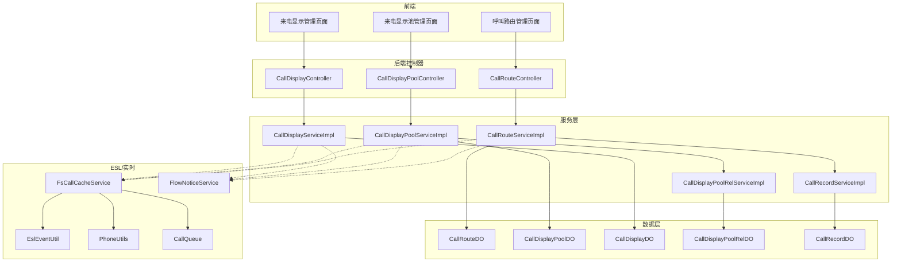
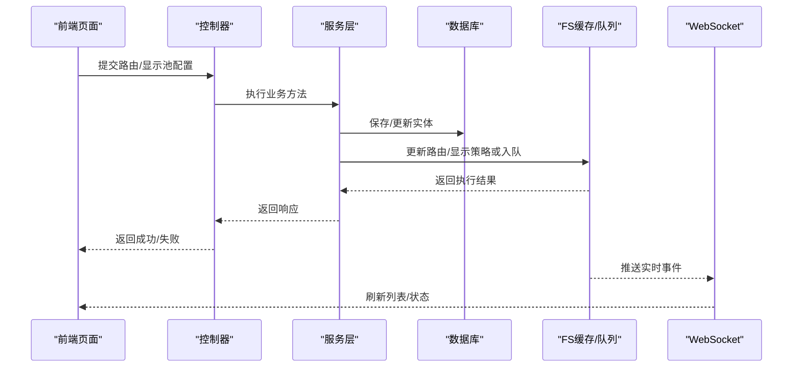
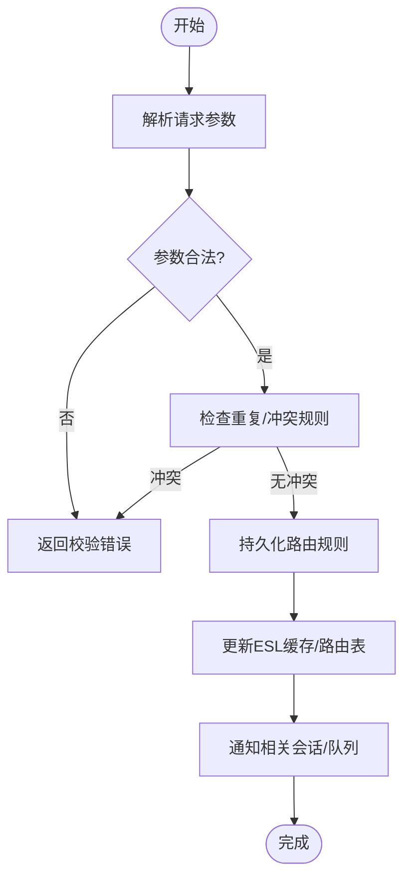
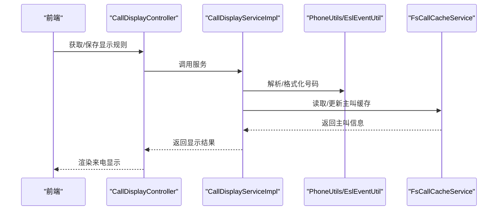
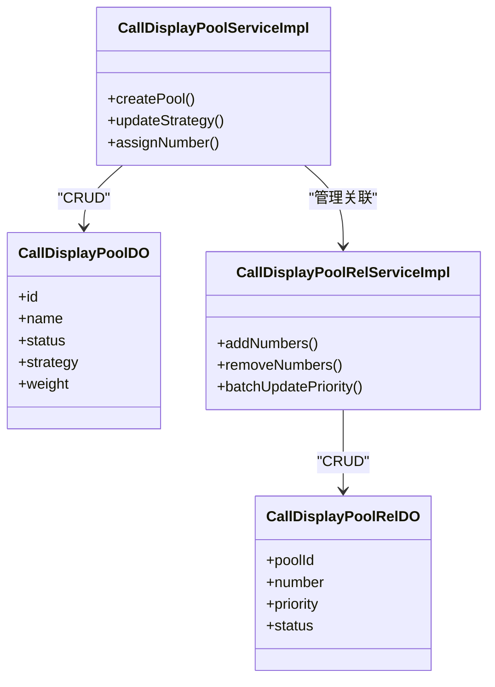
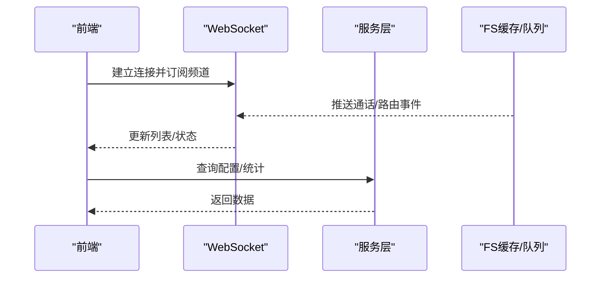
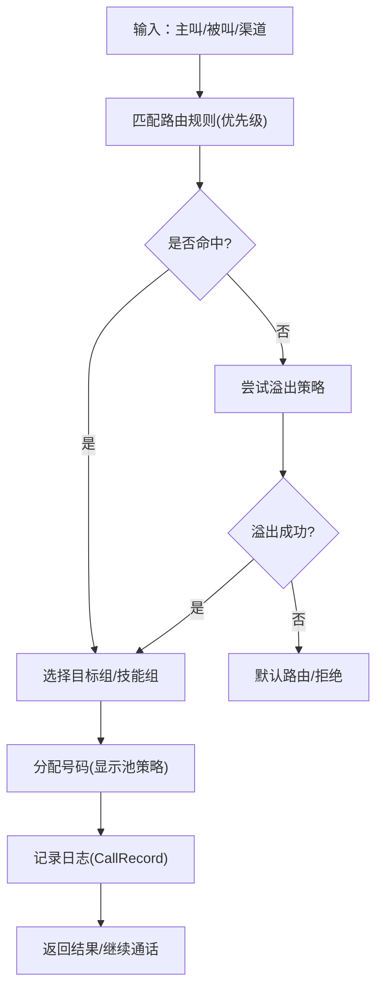
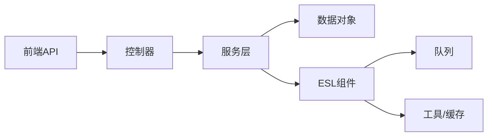

# 呼叫控制面板

<cite>
**本文引用的文件**
- [CallRouteController.java](file://yudao-cloud/yudao-module-cc/yudao-module-cc-server/src/main/java/cn/iocoder/yudao/module/cc/controller/admin/call/CallRouteController.java)
- [CallDisplayPoolController.java](file://yudao-cloud/yudao-module-cc/yudao-module-cc-server/src/main/java/cn/iocoder/yudao/module/cc/controller/admin/call/CallDisplayPoolController.java)
- [CallDisplayController.java](file://yudao-cloud/yudao-module-cc/yudao-module-cc-server/src/main/java/cn/iocoder/yudao/module/cc/controller/admin/call/CallDisplayController.java)
- [CallRouteServiceImpl.java](file://yudao-cloud/yudao-module-cc/yudao-module-cc-server/src/main/java/cn/iocoder/yudao/module/cc/service/call/CallRouteServiceImpl.java)
- [CallDisplayPoolServiceImpl.java](file://yudao-cloud/yudao-module-cc/yudao-module-cc-server/src/main/java/cn/iocoder/yudao/module/cc/service/call/CallDisplayPoolServiceImpl.java)
- [CallDisplayServiceImpl.java](file://yudao-cloud/yudao-module-cc/yudao-module-cc-server/src/main/java/cn/iocoder/yudao/module/cc/service/call/CallDisplayServiceImpl.java)
- [CallRouteDO.java](file://yudao-cloud/yudao-module-cc/yudao-module-cc-server/src/main/java/cn/iocoder/yudao/module/cc/dal/dataobject/call/CallRouteDO.java)
- [CallDisplayPoolDO.java](file://yudao-cloud/yudao-module-cc/yudao-module-cc-server/src/main/java/cn/iocoder/yudao/module/cc/dal/dataobject/call/CallDisplayPoolDO.java)
- [CallDisplayDO.java](file://yudao-cloud/yudao-module-cc/yudao-module-cc-server/src/main/java/cn/iocoder/yudao/module/cc/dal/dataobject/call/CallDisplayDO.java)
- [CallDisplayPoolRelDO.java](file://yudao-cloud/yudao-module-cc/yudao-module-cc-server/src/main/java/cn/iocoder/yudao/module/cc/dal/dataobject/call/CallDisplayPoolRelDO.java)
- [CallRecordDO.java](file://yudao-cloud/yudao-module-cc/yudao-module-cc-server/src/main/java/cn/iocoder/yudao/module/cc/dal/dataobject/call/CallRecordDO.java)
- [CallRoutePageReqVO.java](file://yudao-cloud/yudao-module-cc/yudao-module-cc-server/src/main/java/cn/iocoder/yudao/module/cc/controller/admin/call/vo/CallRoutePageReqVO.java)
- [CallRouteSaveReqVO.java](file://yudao-cloud/yudao-module-cc/yudao-module-cc-server/src/main/java/cn/iocoder/yudao/module/cc/controller/admin/call/vo/CallRouteSaveReqVO.java)
- [CallDisplayPoolPageReqVO.java](file://yudao-cloud/yudao-module-cc/yudao-module-cc-server/src/main/java/cn/iocoder/yudao/module/cc/controller/admin/call/vo/CallDisplayPoolPageReqVO.java)
- [CallDisplayPoolSaveReqVO.java](file://yudao-cloud/yudao-module-cc/yudao-module-cc-server/src/main/java/cn/iocoder/yudao/module/cc/controller/admin/call/vo/CallDisplayPoolSaveReqVO.java)
- [CallDisplayPoolRelSaveReqVO.java](file://yudao-cloud/yudao-module-cc/yudao-module-cc-server/src/main/java/cn/iocoder/yudao/module/cc/controller/admin/call/vo/CallDisplayPoolRelSaveReqVO.java)
- [CallDisplayPageReqVO.java](file://yudao-cloud/yudao-module-cc/yudao-module-cc-server/src/main/java/cn/iocoder/yudao/module/cc/controller/admin/call/vo/CallDisplayPageReqVO.java)
- [CallDisplaySaveReqVO.java](file://yudao-cloud/yudao-module-cc/yudao-module-cc-server/src/main/java/cn/iocoder/yudao/module/cc/controller/admin/call/vo/CallDisplaySaveReqVO.java)
- [CallRecordPageReqVO.java](file://yudao-cloud/yudao-module-cc/yudao-module-cc-server/src/main/java/cn/iocoder/yudao/module/cc/controller/admin/call/vo/CallRecordPageReqVO.java)
- [CallRecordSaveReqVO.java](file://yudao-cloud/yudao-module-cc/yudao-module-cc-server/src/main/java/cn/iocoder/yudao/module/cc/controller/admin/call/vo/CallRecordSaveReqVO.java)
- [CallRouteRespVO.java](file://yudao-cloud/yudao-module-cc/yudao-module-cc-server/src/main/java/cn/iocoder/yudao/module/cc/controller/admin/call/vo/CallRouteRespVO.java)
- [CallDisplayPoolRespVO.java](file://yudao-cloud/yudao-module-cc/yudao-module-cc-server/src/main/java/cn/iocoder/yudao/module/cc/controller/admin/call/vo/CallDisplayPoolRespVO.java)
- [CallDisplayPoolRelRespVO.java](file://yudao-cloud/yudao-module-cc/yudao-module-cc-server/src/main/java/cn/iocoder/yudao/module/cc/controller/admin/call/vo/CallDisplayPoolRelRespVO.java)
- [CallDisplayRespVO.java](file://yudao-cloud/yudao-module-cc/yudao-module-cc-server/src/main/java/cn/iocoder/yudao/module/cc/controller/admin/call/vo/CallDisplayRespVO.java)
- [CallRecordRespVO.java](file://yudao-cloud/yudao-module-cc/yudao-module-cc-server/src/main/java/cn/iocoder/yudao/module/cc/controller/admin/call/vo/CallRecordRespVO.java)
- [CallDisplayPoolRelService.java](file://yudao-cloud/yudao-module-cc/yudao-module-cc-server/src/main/java/cn/iocoder/yudao/module/cc/service/call/CallDisplayPoolRelService.java)
- [CallDisplayPoolRelServiceImpl.java](file://yudao-cloud/yudao-module-cc/yudao-module-cc-server/src/main/java/cn/iocoder/yudao/module/cc/service/call/CallDisplayPoolRelServiceImpl.java)
- [CallRecordService.java](file://yudao-cloud/yudao-module-cc/yudao-module-cc-server/src/main/java/cn/iocoder/yudao/module/cc/service/call/CallRecordService.java)
- [CallRecordServiceImpl.java](file://yudao-cloud/yudao-module-cc/yudao-module-cc-server/src/main/java/cn/iocoder/yudao/module/cc/service/call/CallRecordServiceImpl.java)
- [FsCallCacheService.java](file://yudao-cloud/yudao-module-cc/yudao-module-cc-server/src/main/java/cn/iocoder/yudao/module/cc/esl/service/FsCallCacheService.java)
- [FsCallCacheServiceImpl.java](file://yudao-cloud/yudao-module-cc/yudao-module-cc-server/src/main/java/cn/iocoder/yudao/module/cc/esl/service/FsCallCacheServiceImpl.java)
- [EslEventUtil.java](file://yudao-cloud/yudao-module-cc/yudao-module-cc-server/src/main/java/cn/iocoder/yudao/module/cc/esl/utils/EslEventUtil.java)
- [PhoneUtils.java](file://yudao-cloud/yudao-module-cc/yudao-module-cc-server/src/main/java/cn/iocoder/yudao/module/cc/esl/utils/PhoneUtils.java)
- [CallQueue.java](file://yudao-cloud/yudao-module-cc/yudao-module-cc-server/src/main/java/cn/iocoder/yudao/module/cc/esl/queue/CallQueue.java)
- [FsEslProcessFactory.java](file://yudao-cloud/yudao-module-cc/yudao-module-cc-server/src/main/java/cn/iocoder/yudao/module/cc/esl/factory/FsEslProcessFactory.java)
- [FsEslRouteFactory.java](file://yudao-cloud/yudao-module-cc/yudao-module-cc-server/src/main/java/cn/iocoder/yudao/module/cc/esl/factory/FsEslRouteFactory.java)
- [CallInfo.java](file://yudao-cloud/yudao-module-cc/yudao-module-cc-server/src/main/java/cn/iocoder/yudao/module/cc/esl/dto/CallInfo.java)
- [CallInfoDetail.java](file://yudao-cloud/yudao-module-cc/yudao-module-cc-server/src/main/java/cn/iocoder/yudao/module/cc/esl/dto/CallInfoDetail.java)
- [FlowNoticeService.java](file://yudao-cloud/yudao-module-cc/yudao-module-cc-server/src/main/java/cn/iocoder/yudao/module/cc/esl/service/FlowNoticeService.java)
- [FlowNoticeServiceImpl.java](file://yudao-cloud/yudao-module-cc/yudao-module-cc-server/src/main/java/cn/iocoder/yudao/module/cc/esl/service/FlowNoticeServiceImpl.java)
- [WebSocket配置类](file://yudao-cloud/yudao-module-cc/yudao-module-cc-server/src/main/java/cn/iocoder/yudao/module/cc/websocket/config/WebSocketConfig.java)
- [WebSocket核心模块目录](file://yudao-cloud/yudao-module-cc/yudao-module-cc-server/src/main/java/cn/iocoder/yudao/module/cc/websocket/core/)
- [前端API调用（cc路由）](file://yudao-ui-admin-vue3/src/api/cc/call/route.ts)
- [前端页面（呼叫路由管理）](file://yudao-ui-admin-vue3/src/views/cc/call/route/index.vue)
- [前端页面（来电显示池管理）](file://yudao-ui-admin-vue3/src/views/cc/call/display-pool/index.vue)
- [前端页面（来电显示管理）](file://yudao-ui-admin-vue3/src/views/cc/call/display/index.vue)
</cite>

## 目录
1. [简介](#简介)
2. [项目结构](#项目结构)
3. [核心组件](#核心组件)
4. [架构总览](#架构总览)
5. [详细组件分析](#详细组件分析)
6. [依赖关系分析](#依赖关系分析)
7. [性能考虑](#性能考虑)
8. [故障排查指南](#故障排查指南)
9. [结论](#结论)
10. [附录](#附录)

## 简介
本文件面向“呼叫控制面板”的后台管理与实时展示能力，覆盖以下关键主题：
- 呼叫路由配置的界面实现：号码路由规则设置、路由优先级配置与溢出策略管理。
- 来电显示配置界面：号码格式处理、主叫号码识别与显示规则设置。
- 呼叫显示池管理：号码池配置、分配策略与负载均衡机制。
- 数据展示与实时更新：数据模型、推送机制与用户操作流程。
- 路由算法配置与调试：如何配置路由策略、使用调试工具定位问题。
- 界面交互逻辑与错误处理：表单校验、异常提示与回滚策略。

## 项目结构
呼叫中心功能位于 yudao-module-cc-server 中，围绕 call 域提供控制器、服务、数据对象与ESL事件处理等能力；前端在 yudao-ui-admin-vue3 中提供对应页面与API封装。

图表来源
- [CallRouteController.java](file://yudao-cloud/yudao-module-cc/yudao-module-cc-server/src/main/java/cn/iocoder/yudao/module/cc/controller/admin/call/CallRouteController.java)
- [CallDisplayPoolController.java](file://yudao-cloud/yudao-module-cc/yudao-module-cc-server/src/main/java/cn/iocoder/yudao/module/cc/controller/admin/call/CallDisplayPoolController.java)
- [CallDisplayController.java](file://yudao-cloud/yudao-module-cc/yudao-module-cc-server/src/main/java/cn/iocoder/yudao/module/cc/controller/admin/call/CallDisplayController.java)
- [CallRouteServiceImpl.java](file://yudao-cloud/yudao-module-cc/yudao-module-cc-server/src/main/java/cn/iocoder/yudao/module/cc/service/call/CallRouteServiceImpl.java)
- [CallDisplayPoolServiceImpl.java](file://yudao-cloud/yudao-module-cc/yudao-module-cc-server/src/main/java/cn/iocoder/yudao/module/cc/service/call/CallDisplayPoolServiceImpl.java)
- [CallDisplayServiceImpl.java](file://yudao-cloud/yudao-module-cc/yudao-module-cc-server/src/main/java/cn/iocoder/yudao/module/cc/service/call/CallDisplayServiceImpl.java)
- [FsCallCacheService.java](file://yudao-cloud/yudao-module-cc/yudao-module-cc-server/src/main/java/cn/iocoder/yudao/module/cc/esl/service/FsCallCacheService.java)
- [EslEventUtil.java](file://yudao-cloud/yudao-module-cc/yudao-module-cc-server/src/main/java/cn/iocoder/yudao/module/cc/esl/utils/EslEventUtil.java)
- [PhoneUtils.java](file://yudao-cloud/yudao-module-cc/yudao-module-cc-server/src/main/java/cn/iocoder/yudao/module/cc/esl/utils/PhoneUtils.java)
- [CallQueue.java](file://yudao-cloud/yudao-module-cc/yudao-module-cc-server/src/main/java/cn/iocoder/yudao/module/cc/esl/queue/CallQueue.java)
- [FlowNoticeService.java](file://yudao-cloud/yudao-module-cc/yudao-module-cc-server/src/main/java/cn/iocoder/yudao/module/cc/esl/service/FlowNoticeService.java)

章节来源
- [CallRouteController.java](file://yudao-cloud/yudao-module-cc/yudao-module-cc-server/src/main/java/cn/iocoder/yudao/module/cc/controller/admin/call/CallRouteController.java)
- [CallDisplayPoolController.java](file://yudao-cloud/yudao-module-cc/yudao-module-cc-server/src/main/java/cn/iocoder/yudao/module/cc/controller/admin/call/CallDisplayPoolController.java)
- [CallDisplayController.java](file://yudao-cloud/yudao-module-cc/yudao-module-cc-server/src/main/java/cn/iocoder/yudao/module/cc/controller/admin/call/CallDisplayController.java)

## 核心组件
- 呼叫路由管理
  - 控制器：CallRouteController
  - 服务：CallRouteServiceImpl
  - 数据对象：CallRouteDO
  - 记录：CallRecordServiceImpl / CallRecordDO
- 来电显示池管理
  - 控制器：CallDisplayPoolController
  - 服务：CallDisplayPoolServiceImpl / CallDisplayPoolRelServiceImpl
  - 数据对象：CallDisplayPoolDO / CallDisplayPoolRelDO
- 来电显示管理
  - 控制器：CallDisplayController
  - 服务：CallDisplayServiceImpl
  - 数据对象：CallDisplayDO
- ESL与实时能力
  - FsCallCacheService / FsCallCacheServiceImpl
  - EslEventUtil / PhoneUtils / CallQueue
  - FlowNoticeService / FlowNoticeServiceImpl

章节来源
- [CallRouteServiceImpl.java](file://yudao-cloud/yudao-module-cc/yudao-module-cc-server/src/main/java/cn/iocoder/yudao/module/cc/service/call/CallRouteServiceImpl.java)
- [CallDisplayPoolServiceImpl.java](file://yudao-cloud/yudao-module-cc/yudao-module-cc-server/src/main/java/cn/iocoder/yudao/module/cc/service/call/CallDisplayPoolServiceImpl.java)
- [CallDisplayServiceImpl.java](file://yudao-cloud/yudao-module-cc/yudao-module-cc-server/src/main/java/cn/iocoder/yudao/module/cc/service/call/CallDisplayServiceImpl.java)
- [CallDisplayPoolRelServiceImpl.java](file://yudao-cloud/yudao-module-cc/yudao-module-cc-server/src/main/java/cn/iocoder/yudao/module/cc/service/call/CallDisplayPoolRelServiceImpl.java)
- [CallRecordServiceImpl.java](file://yudao-cloud/yudao-module-cc/yudao-module-cc-server/src/main/java/cn/iocoder/yudao/module/cc/service/call/CallRecordServiceImpl.java)
- [FsCallCacheService.java](file://yudao-cloud/yudao-module-cc/yudao-module-cc-server/src/main/java/cn/iocoder/yudao/module/cc/esl/service/FsCallCacheService.java)
- [EslEventUtil.java](file://yudao-cloud/yudao-module-cc/yudao-module-cc-server/src/main/java/cn/iocoder/yudao/module/cc/esl/utils/EslEventUtil.java)
- [PhoneUtils.java](file://yudao-cloud/yudao-module-cc/yudao-module-cc-server/src/main/java/cn/iocoder/yudao/module/cc/esl/utils/PhoneUtils.java)
- [CallQueue.java](file://yudao-cloud/yudao-module-cc/yudao-module-cc-server/src/main/java/cn/iocoder/yudao/module/cc/esl/queue/CallQueue.java)
- [FlowNoticeService.java](file://yudao-cloud/yudao-module-cc/yudao-module-cc-server/src/main/java/cn/iocoder/yudao/module/cc/esl/service/FlowNoticeService.java)

## 架构总览
呼叫控制面板采用前后端分离架构：
- 前端通过 API 调用后端控制器，完成路由规则、显示池与显示规则的增删改查。
- 服务层负责业务编排、数据持久化以及与ESL缓存/队列的交互。
- ESL侧提供通话事件、通道信息与队列能力，支撑实时展示与路由决策。
- WebSocket用于将实时状态推送到前端，提升监控与操作体验。

图表来源
- [CallRouteController.java](file://yudao-cloud/yudao-module-cc/yudao-module-cc-server/src/main/java/cn/iocoder/yudao/module/cc/controller/admin/call/CallRouteController.java)
- [CallDisplayPoolController.java](file://yudao-cloud/yudao-module-cc/yudao-module-cc-server/src/main/java/cn/iocoder/yudao/module/cc/controller/admin/call/CallDisplayPoolController.java)
- [CallDisplayController.java](file://yudao-cloud/yudao-module-cc/yudao-module-cc-server/src/main/java/cn/iocoder/yudao/module/cc/controller/admin/call/CallDisplayController.java)
- [CallRouteServiceImpl.java](file://yudao-cloud/yudao-module-cc/yudao-module-cc-server/src/main/java/cn/iocoder/yudao/module/cc/service/call/CallRouteServiceImpl.java)
- [CallDisplayPoolServiceImpl.java](file://yudao-cloud/yudao-module-cc/yudao-module-cc-server/src/main/java/cn/iocoder/yudao/module/cc/service/call/CallDisplayPoolServiceImpl.java)
- [CallDisplayServiceImpl.java](file://yudao-cloud/yudao-module-cc/yudao-module-cc-server/src/main/java/cn/iocoder/yudao/module/cc/service/call/CallDisplayServiceImpl.java)
- [FsCallCacheService.java](file://yudao-cloud/yudao-module-cc/yudao-module-cc-server/src/main/java/cn/iocoder/yudao/module/cc/esl/service/FsCallCacheService.java)
- [WebSocket配置类](file://yudao-cloud/yudao-module-cc/yudao-module-cc-server/src/main/java/cn/iocoder/yudao/module/cc/websocket/config/WebSocketConfig.java)

## 详细组件分析

### 呼叫路由配置（号码路由规则、优先级、溢出策略）
- 界面入口
  - 前端页面：呼叫路由管理
  - 前端API：cc/call/route
- 后端接口
  - 控制器：CallRouteController
  - 服务：CallRouteServiceImpl
  - 数据对象：CallRouteDO
  - 记录：CallRecordServiceImpl / CallRecordDO
- 关键流程
  - 新增/修改路由规则时，服务层进行参数校验、冲突检测与优先级排序。
  - 写入数据库后，同步更新ESL缓存或触发路由热更新，确保在线通话按新规则路由。
  - 溢出策略：当目标组/技能组不可用时，按预设顺序转移到下一优先级或默认路由。
- 数据结构要点
  - CallRouteDO：包含匹配条件、优先级、目标组/技能组、溢出策略等字段。
  - CallRecordDO：记录路由命中轨迹与结果，便于审计与排障。

图表来源
- [CallRouteController.java](file://yudao-cloud/yudao-module-cc/yudao-module-cc-server/src/main/java/cn/iocoder/yudao/module/cc/controller/admin/call/CallRouteController.java)
- [CallRouteServiceImpl.java](file://yudao-cloud/yudao-module-cc/yudao-module-cc-server/src/main/java/cn/iocoder/yudao/module/cc/service/call/CallRouteServiceImpl.java)
- [CallRouteDO.java](file://yudao-cloud/yudao-module-cc/yudao-module-cc-server/src/main/java/cn/iocoder/yudao/module/cc/dal/dataobject/call/CallRouteDO.java)
- [CallRecordServiceImpl.java](file://yudao-cloud/yudao-module-cc/yudao-module-cc-server/src/main/java/cn/iocoder/yudao/module/cc/service/call/CallRecordServiceImpl.java)
- [CallRecordDO.java](file://yudao-cloud/yudao-module-cc/yudao-module-cc-server/src/main/java/cn/iocoder/yudao/module/cc/dal/dataobject/call/CallRecordDO.java)

章节来源
- [CallRouteController.java](file://yudao-cloud/yudao-module-cc/yudao-module-cc-server/src/main/java/cn/iocoder/yudao/module/cc/controller/admin/call/CallRouteController.java)
- [CallRouteServiceImpl.java](file://yudao-cloud/yudao-module-cc/yudao-module-cc-server/src/main/java/cn/iocoder/yudao/module/cc/service/call/CallRouteServiceImpl.java)
- [CallRouteDO.java](file://yudao-cloud/yudao-module-cc/yudao-module-cc-server/src/main/java/cn/iocoder/yudao/module/cc/dal/dataobject/call/CallRouteDO.java)
- [CallRecordServiceImpl.java](file://yudao-cloud/yudao-module-cc/yudao-module-cc-server/src/main/java/cn/iocoder/yudao/module/cc/service/call/CallRecordServiceImpl.java)
- [CallRecordDO.java](file://yudao-cloud/yudao-module-cc/yudao-module-cc-server/src/main/java/cn/iocoder/yudao/module/cc/dal/dataobject/call/CallRecordDO.java)

### 来电显示配置（号码格式、主叫识别、显示规则）
- 界面入口
  - 前端页面：来电显示管理
  - 前端API：cc/call/display
- 后端接口
  - 控制器：CallDisplayController
  - 服务：CallDisplayServiceImpl
  - 数据对象：CallDisplayDO
- 处理逻辑
  - 号码格式处理：统一标准化（去前缀、补全国家码、掩码/脱敏）。
  - 主叫号码识别：基于规则匹配或外部系统查询，决定显示名称/头像等。
  - 显示规则：根据主叫/被叫/时间/渠道等维度组合，输出最终显示信息。
- 与ESL集成
  - 通过 PhoneUtils 进行号码规范化。
  - 通过 EslEventUtil 解析事件中的主叫/被叫信息。
  - 通过 FsCallCacheService 缓存最近通话的主叫信息，供快速读取。

图表来源
- [CallDisplayController.java](file://yudao-cloud/yudao-module-cc/yudao-module-cc-server/src/main/java/cn/iocoder/yudao/module/cc/controller/admin/call/CallDisplayController.java)
- [CallDisplayServiceImpl.java](file://yudao-cloud/yudao-module-cc/yudao-module-cc-server/src/main/java/cn/iocoder/yudao/module/cc/service/call/CallDisplayServiceImpl.java)
- [CallDisplayDO.java](file://yudao-cloud/yudao-module-cc/yudao-module-cc-server/src/main/java/cn/iocoder/yudao/module/cc/dal/dataobject/call/CallDisplayDO.java)
- [PhoneUtils.java](file://yudao-cloud/yudao-module-cc/yudao-module-cc-server/src/main/java/cn/iocoder/yudao/module/cc/esl/utils/PhoneUtils.java)
- [EslEventUtil.java](file://yudao-cloud/yudao-module-cc/yudao-module-cc-server/src/main/java/cn/iocoder/yudao/module/cc/esl/utils/EslEventUtil.java)
- [FsCallCacheService.java](file://yudao-cloud/yudao-module-cc/yudao-module-cc-server/src/main/java/cn/iocoder/yudao/module/cc/esl/service/FsCallCacheService.java)

章节来源
- [CallDisplayController.java](file://yudao-cloud/yudao-module-cc/yudao-module-cc-server/src/main/java/cn/iocoder/yudao/module/cc/controller/admin/call/CallDisplayController.java)
- [CallDisplayServiceImpl.java](file://yudao-cloud/yudao-module-cc/yudao-module-cc-server/src/main/java/cn/iocoder/yudao/module/cc/service/call/CallDisplayServiceImpl.java)
- [CallDisplayDO.java](file://yudao-cloud/yudao-module-cc/yudao-module-cc-server/src/main/java/cn/iocoder/yudao/module/cc/dal/dataobject/call/CallDisplayDO.java)
- [PhoneUtils.java](file://yudao-cloud/yudao-module-cc/yudao-module-cc-server/src/main/java/cn/iocoder/yudao/module/cc/esl/utils/PhoneUtils.java)
- [EslEventUtil.java](file://yudao-cloud/yudao-module-cc/yudao-module-cc-server/src/main/java/cn/iocoder/yudao/module/cc/esl/utils/EslEventUtil.java)
- [FsCallCacheService.java](file://yudao-cloud/yudao-module-cc/yudao-module-cc-server/src/main/java/cn/iocoder/yudao/module/cc/esl/service/FsCallCacheService.java)

### 呼叫显示池管理（号码池、分配策略、负载均衡）
- 界面入口
  - 前端页面：来电显示池管理
  - 前端API：cc/call/display-pool
- 后端接口
  - 控制器：CallDisplayPoolController
  - 服务：CallDisplayPoolServiceImpl / CallDisplayPoolRelServiceImpl
  - 数据对象：CallDisplayPoolDO / CallDisplayPoolRelDO
- 功能说明
  - 号码池配置：维护可用号码集合、归属地、标签等元数据。
  - 分配策略：支持轮询、权重、最少占用、地理就近等策略。
  - 负载均衡：结合当前通话量、成功率、延迟等指标动态调整选择。
- 与队列和缓存
  - 通过 CallQueue 进行号码资源排队与并发控制。
  - 通过 FsCallCacheService 缓存热点号码与分配结果，降低查询开销。

图表来源
- [CallDisplayPoolController.java](file://yudao-cloud/yudao-module-cc/yudao-module-cc-server/src/main/java/cn/iocoder/yudao/module/cc/controller/admin/call/CallDisplayPoolController.java)
- [CallDisplayPoolServiceImpl.java](file://yudao-cloud/yudao-module-cc/yudao-module-cc-server/src/main/java/cn/iocoder/yudao/module/cc/service/call/CallDisplayPoolServiceImpl.java)
- [CallDisplayPoolRelServiceImpl.java](file://yudao-cloud/yudao-module-cc/yudao-module-cc-server/src/main/java/cn/iocoder/yudao/module/cc/service/call/CallDisplayPoolRelServiceImpl.java)
- [CallDisplayPoolDO.java](file://yudao-cloud/yudao-module-cc/yudao-module-cc-server/src/main/java/cn/iocoder/yudao/module/cc/dal/dataobject/call/CallDisplayPoolDO.java)
- [CallDisplayPoolRelDO.java](file://yudao-cloud/yudao-module-cc/yudao-module-cc-server/src/main/java/cn/iocoder/yudao/module/cc/dal/dataobject/call/CallDisplayPoolRelDO.java)

章节来源
- [CallDisplayPoolController.java](file://yudao-cloud/yudao-module-cc/yudao-module-cc-server/src/main/java/cn/iocoder/yudao/module/cc/controller/admin/call/CallDisplayPoolController.java)
- [CallDisplayPoolServiceImpl.java](file://yudao-cloud/yudao-module-cc/yudao-module-cc-server/src/main/java/cn/iocoder/yudao/module/cc/service/call/CallDisplayPoolServiceImpl.java)
- [CallDisplayPoolRelServiceImpl.java](file://yudao-cloud/yudao-module-cc/yudao-module-cc-server/src/main/java/cn/iocoder/yudao/module/cc/service/call/CallDisplayPoolRelServiceImpl.java)
- [CallDisplayPoolDO.java](file://yudao-cloud/yudao-module-cc/yudao-module-cc-server/src/main/java/cn/iocoder/yudao/module/cc/dal/dataobject/call/CallDisplayPoolDO.java)
- [CallDisplayPoolRelDO.java](file://yudao-cloud/yudao-module-cc/yudao-module-cc-server/src/main/java/cn/iocoder/yudao/module/cc/dal/dataobject/call/CallDisplayPoolRelDO.java)

### 数据展示与实时更新
- 数据来源
  - 数据库：路由规则、显示池、显示规则等静态配置。
  - ESL缓存：通话状态、主叫信息、通道信息等动态数据。
  - 队列：待处理任务与资源排队。
- 推送机制
  - 通过 WebSocket 将实时事件（如通话状态变化、路由命中、号码分配结果）推送至前端。
  - 前端订阅频道并按事件类型更新UI。
- 用户操作流程
  - 管理员在页面配置路由/显示池/显示规则。
  - 保存后即时生效，并在列表中看到最新状态。
  - 实时监控面板可观察通话与路由执行情况。

图表来源
- [WebSocket配置类](file://yudao-cloud/yudao-module-cc/yudao-module-cc-server/src/main/java/cn/iocoder/yudao/module/cc/websocket/config/WebSocketConfig.java)
- [WebSocket核心模块目录](file://yudao-cloud/yudao-module-cc/yudao-module-cc-server/src/main/java/cn/iocoder/yudao/module/cc/websocket/core/)
- [FsCallCacheService.java](file://yudao-cloud/yudao-module-cc/yudao-module-cc-server/src/main/java/cn/iocoder/yudao/module/cc/esl/service/FsCallCacheService.java)
- [CallQueue.java](file://yudao-cloud/yudao-module-cc/yudao-module-cc-server/src/main/java/cn/iocoder/yudao/module/cc/esl/queue/CallQueue.java)

章节来源
- [WebSocket配置类](file://yudao-cloud/yudao-module-cc/yudao-module-cc-server/src/main/java/cn/iocoder/yudao/module/cc/websocket/config/WebSocketConfig.java)
- [WebSocket核心模块目录](file://yudao-cloud/yudao-module-cc/yudao-module-cc-server/src/main/java/cn/iocoder/yudao/module/cc/websocket/core/)
- [FsCallCacheService.java](file://yudao-cloud/yudao-module-cc/yudao-module-cc-server/src/main/java/cn/iocoder/yudao/module/cc/esl/service/FsCallCacheService.java)
- [CallQueue.java](file://yudao-cloud/yudao-module-cc/yudao-module-cc-server/src/main/java/cn/iocoder/yudao/module/cc/esl/queue/CallQueue.java)

### 路由算法配置与调试
- 配置方法
  - 在路由规则中设置匹配条件、优先级、目标组/技能组与溢出策略。
  - 在显示池中配置分配策略（轮询/权重/最少占用/地理就近）与权重。
- 调试工具
  - 使用 CallRecordDO 查看历史路由命中与结果。
  - 通过 FsCallCacheService 获取当前通话上下文（CallInfo/CallInfoDetail）。
  - 使用 EslEventUtil 解析事件，辅助定位主叫/被叫与通道信息。
  - 使用 PhoneUtils 验证号码格式是否符合预期。
  - 通过 CallQueue 观察排队与分配过程。

图表来源
- [CallRouteServiceImpl.java](file://yudao-cloud/yudao-module-cc/yudao-module-cc-server/src/main/java/cn/iocoder/yudao/module/cc/service/call/CallRouteServiceImpl.java)
- [CallDisplayPoolServiceImpl.java](file://yudao-cloud/yudao-module-cc/yudao-module-cc-server/src/main/java/cn/iocoder/yudao/module/cc/service/call/CallDisplayPoolServiceImpl.java)
- [CallRecordServiceImpl.java](file://yudao-cloud/yudao-module-cc/yudao-module-cc-server/src/main/java/cn/iocoder/yudao/module/cc/service/call/CallRecordServiceImpl.java)
- [CallInfo.java](file://yudao-cloud/yudao-module-cc/yudao-module-cc-server/src/main/java/cn/iocoder/yudao/module/cc/esl/dto/CallInfo.java)
- [CallInfoDetail.java](file://yudao-cloud/yudao-module-cc/yudao-module-cc-server/src/main/java/cn/iocoder/yudao/module/cc/esl/dto/CallInfoDetail.java)
- [EslEventUtil.java](file://yudao-cloud/yudao-module-cc/yudao-module-cc-server/src/main/java/cn/iocoder/yudao/module/cc/esl/utils/EslEventUtil.java)
- [PhoneUtils.java](file://yudao-cloud/yudao-module-cc/yudao-module-cc-server/src/main/java/cn/iocoder/yudao/module/cc/esl/utils/PhoneUtils.java)
- [CallQueue.java](file://yudao-cloud/yudao-module-cc/yudao-module-cc-server/src/main/java/cn/iocoder/yudao/module/cc/esl/queue/CallQueue.java)

章节来源
- [CallRouteServiceImpl.java](file://yudao-cloud/yudao-module-cc/yudao-module-cc-server/src/main/java/cn/iocoder/yudao/module/cc/service/call/CallRouteServiceImpl.java)
- [CallDisplayPoolServiceImpl.java](file://yudao-cloud/yudao-module-cc/yudao-module-cc-server/src/main/java/cn/iocoder/yudao/module/cc/service/call/CallDisplayPoolServiceImpl.java)
- [CallRecordServiceImpl.java](file://yudao-cloud/yudao-module-cc/yudao-module-cc-server/src/main/java/cn/iocoder/yudao/module/cc/service/call/CallRecordServiceImpl.java)
- [CallInfo.java](file://yudao-cloud/yudao-module-cc/yudao-module-cc-server/src/main/java/cn/iocoder/yudao/module/cc/esl/dto/CallInfo.java)
- [CallInfoDetail.java](file://yudao-cloud/yudao-module-cc/yudao-module-cc-server/src/main/java/cn/iocoder/yudao/module/cc/esl/dto/CallInfoDetail.java)
- [EslEventUtil.java](file://yudao-cloud/yudao-module-cc/yudao-module-cc-server/src/main/java/cn/iocoder/yudao/module/cc/esl/utils/EslEventUtil.java)
- [PhoneUtils.java](file://yudao-cloud/yudao-module-cc/yudao-module-cc-server/src/main/java/cn/iocoder/yudao/module/cc/esl/utils/PhoneUtils.java)
- [CallQueue.java](file://yudao-cloud/yudao-module-cc/yudao-module-cc-server/src/main/java/cn/iocoder/yudao/module/cc/esl/queue/CallQueue.java)

### 界面交互逻辑与错误处理
- 交互逻辑
  - 表单校验：必填项、格式校验（如号码）、唯一性校验（避免重复规则）。
  - 批量操作：支持导入/导出、批量启用/停用。
  - 实时反馈：保存成功后刷新列表，必要时触发热更新。
- 错误处理
  - 参数非法：返回明确错误消息与字段级提示。
  - 冲突检测：如路由规则冲突、号码重复，给出冲突详情与修复建议。
  - 异步失败：对ESL/队列操作失败进行重试或降级，保证一致性。
  - 事务保障：配置变更在同一事务内完成，失败回滚。

章节来源
- [CallRouteController.java](file://yudao-cloud/yudao-module-cc/yudao-module-cc-server/src/main/java/cn/iocoder/yudao/module/cc/controller/admin/call/CallRouteController.java)
- [CallDisplayPoolController.java](file://yudao-cloud/yudao-module-cc/yudao-module-cc-server/src/main/java/cn/iocoder/yudao/module/cc/controller/admin/call/CallDisplayPoolController.java)
- [CallDisplayController.java](file://yudao-cloud/yudao-module-cc/yudao-module-cc-server/src/main/java/cn/iocoder/yudao/module/cc/controller/admin/call/CallDisplayController.java)
- [CallRouteServiceImpl.java](file://yudao-cloud/yudao-module-cc/yudao-module-cc-server/src/main/java/cn/iocoder/yudao/module/cc/service/call/CallRouteServiceImpl.java)
- [CallDisplayPoolServiceImpl.java](file://yudao-cloud/yudao-module-cc/yudao-module-cc-server/src/main/java/cn/iocoder/yudao/module/cc/service/call/CallDisplayPoolServiceImpl.java)
- [CallDisplayServiceImpl.java](file://yudao-cloud/yudao-module-cc/yudao-module-cc-server/src/main/java/cn/iocoder/yudao/module/cc/service/call/CallDisplayServiceImpl.java)

## 依赖关系分析
- 控制器到服务：每个控制器仅暴露REST接口，具体业务下沉至服务层。
- 服务到数据对象：通过DO进行持久化，VO用于前后端传输。
- 服务到ESL：通过FsCallCacheService、EslEventUtil、PhoneUtils、CallQueue等组件实现实时能力。
- 前端到后端：通过API模块调用控制器，使用WebSocket接收实时事件。

图表来源
- [CallRouteController.java](file://yudao-cloud/yudao-module-cc/yudao-module-cc-server/src/main/java/cn/iocoder/yudao/module/cc/controller/admin/call/CallRouteController.java)
- [CallDisplayPoolController.java](file://yudao-cloud/yudao-module-cc/yudao-module-cc-server/src/main/java/cn/iocoder/yudao/module/cc/controller/admin/call/CallDisplayPoolController.java)
- [CallDisplayController.java](file://yudao-cloud/yudao-module-cc/yudao-module-cc-server/src/main/java/cn/iocoder/yudao/module/cc/controller/admin/call/CallDisplayController.java)
- [CallRouteServiceImpl.java](file://yudao-cloud/yudao-module-cc/yudao-module-cc-server/src/main/java/cn/iocoder/yudao/module/cc/service/call/CallRouteServiceImpl.java)
- [CallDisplayPoolServiceImpl.java](file://yudao-cloud/yudao-module-cc/yudao-module-cc-server/src/main/java/cn/iocoder/yudao/module/cc/service/call/CallDisplayPoolServiceImpl.java)
- [CallDisplayServiceImpl.java](file://yudao-cloud/yudao-module-cc/yudao-module-cc-server/src/main/java/cn/iocoder/yudao/module/cc/service/call/CallDisplayServiceImpl.java)
- [FsCallCacheService.java](file://yudao-cloud/yudao-module-cc/yudao-module-cc-server/src/main/java/cn/iocoder/yudao/module/cc/esl/service/FsCallCacheService.java)
- [EslEventUtil.java](file://yudao-cloud/yudao-module-cc/yudao-module-cc-server/src/main/java/cn/iocoder/yudao/module/cc/esl/utils/EslEventUtil.java)
- [PhoneUtils.java](file://yudao-cloud/yudao-module-cc/yudao-module-cc-server/src/main/java/cn/iocoder/yudao/module/cc/esl/utils/PhoneUtils.java)
- [CallQueue.java](file://yudao-cloud/yudao-module-cc/yudao-module-cc-server/src/main/java/cn/iocoder/yudao/module/cc/esl/queue/CallQueue.java)

章节来源
- [CallRouteController.java](file://yudao-cloud/yudao-module-cc/yudao-module-cc-server/src/main/java/cn/iocoder/yudao/module/cc/controller/admin/call/CallRouteController.java)
- [CallDisplayPoolController.java](file://yudao-cloud/yudao-module-cc/yudao-module-cc-server/src/main/java/cn/iocoder/yudao/module/cc/controller/admin/call/CallDisplayPoolController.java)
- [CallDisplayController.java](file://yudao-cloud/yudao-module-cc/yudao-module-cc-server/src/main/java/cn/iocoder/yudao/module/cc/controller/admin/call/CallDisplayController.java)
- [CallRouteServiceImpl.java](file://yudao-cloud/yudao-module-cc/yudao-module-cc-server/src/main/java/cn/iocoder/yudao/module/cc/service/call/CallRouteServiceImpl.java)
- [CallDisplayPoolServiceImpl.java](file://yudao-cloud/yudao-module-cc/yudao-module-cc-server/src/main/java/cn/iocoder/yudao/module/cc/service/call/CallDisplayPoolServiceImpl.java)
- [CallDisplayServiceImpl.java](file://yudao-cloud/yudao-module-cc/yudao-module-cc-server/src/main/java/cn/iocoder/yudao/module/cc/service/call/CallDisplayServiceImpl.java)
- [FsCallCacheService.java](file://yudao-cloud/yudao-module-cc/yudao-module-cc-server/src/main/java/cn/iocoder/yudao/module/cc/esl/service/FsCallCacheService.java)
- [EslEventUtil.java](file://yudao-cloud/yudao-module-cc/yudao-module-cc-server/src/main/java/cn/iocoder/yudao/module/cc/esl/utils/EslEventUtil.java)
- [PhoneUtils.java](file://yudao-cloud/yudao-module-cc/yudao-module-cc-server/src/main/java/cn/iocoder/yudao/module/cc/esl/utils/PhoneUtils.java)
- [CallQueue.java](file://yudao-cloud/yudao-module-cc/yudao-module-cc-server/src/main/java/cn/iocoder/yudao/module/cc/esl/queue/CallQueue.java)

## 性能考虑
- 路由匹配与优先级
  - 建议将高频匹配的规则置于更高优先级，减少遍历成本。
  - 对复杂匹配条件进行索引或预计算，避免每次全表扫描。
- 显示池分配
  - 使用本地缓存+分布式键值存储（如Redis）加速热点号码查询。
  - 分配策略尽量无锁或轻量锁，避免阻塞高并发场景。
- 实时推送
  - WebSocket连接数与消息吞吐需评估，必要时分片或限流。
  - 事件合并与节流，减少前端渲染压力。
- 记录与审计
  - 通话记录异步落库，避免影响主流程。
  - 定期归档与压缩，控制数据库体积。

[本节为通用性能建议，不直接分析具体文件]

## 故障排查指南
- 常见问题
  - 路由未命中：检查规则优先级、匹配条件与溢出策略是否正确。
  - 显示号码异常：确认号码格式化处理与主叫识别规则。
  - 号码池分配失败：检查池容量、权重与负载指标。
- 排查步骤
  - 查看 CallRecordDO 的历史记录，定位命中路径。
  - 使用 FsCallCacheService 获取当前通话上下文（CallInfo/CallInfoDetail）。
  - 使用 EslEventUtil 解析事件，核对主叫/被叫与通道信息。
  - 使用 PhoneUtils 验证号码格式是否符合预期。
  - 通过 CallQueue 观察排队与分配过程。
- 恢复策略
  - 临时关闭有问题的规则或池，切换到备用策略。
  - 对ESL/队列操作失败进行重试或降级，保证可用性。

章节来源
- [CallRecordServiceImpl.java](file://yudao-cloud/yudao-module-cc/yudao-module-cc-server/src/main/java/cn/iocoder/yudao/module/cc/service/call/CallRecordServiceImpl.java)
- [CallRecordDO.java](file://yudao-cloud/yudao-module-cc/yudao-module-cc-server/src/main/java/cn/iocoder/yudao/module/cc/dal/dataobject/call/CallRecordDO.java)
- [FsCallCacheService.java](file://yudao-cloud/yudao-module-cc/yudao-module-cc-server/src/main/java/cn/iocoder/yudao/module/cc/esl/service/FsCallCacheService.java)
- [CallInfo.java](file://yudao-cloud/yudao-module-cc/yudao-module-cc-server/src/main/java/cn/iocoder/yudao/module/cc/esl/dto/CallInfo.java)
- [CallInfoDetail.java](file://yudao-cloud/yudao-module-cc/yudao-module-cc-server/src/main/java/cn/iocoder/yudao/module/cc/esl/dto/CallInfoDetail.java)
- [EslEventUtil.java](file://yudao-cloud/yudao-module-cc/yudao-module-cc-server/src/main/java/cn/iocoder/yudao/module/cc/esl/utils/EslEventUtil.java)
- [PhoneUtils.java](file://yudao-cloud/yudao-module-cc/yudao-module-cc-server/src/main/java/cn/iocoder/yudao/module/cc/esl/utils/PhoneUtils.java)
- [CallQueue.java](file://yudao-cloud/yudao-module-cc/yudao-module-cc-server/src/main/java/cn/iocoder/yudao/module/cc/esl/queue/CallQueue.java)

## 结论
呼叫控制面板围绕“路由—显示—池”三大能力构建，配合ESL实时能力与WebSocket推送，实现了从配置到展示的闭环。通过清晰的职责划分与模块化设计，系统具备良好的可扩展性与可维护性。建议在上线前充分验证路由优先级与溢出策略，并结合记录与调试工具持续优化。

[本节为总结性内容，不直接分析具体文件]

## 附录
- 前端页面与API
  - 呼叫路由管理：[前端页面（呼叫路由管理）](file://yudao-ui-admin-vue3/src/views/cc/call/route/index.vue)、[前端API调用（cc路由）](file://yudao-ui-admin-vue3/src/api/cc/call/route.ts)
  - 来电显示池管理：[前端页面（来电显示池管理）](file://yudao-ui-admin-vue3/src/views/cc/call/display-pool/index.vue)
  - 来电显示管理：[前端页面（来电显示管理）](file://yudao-ui-admin-vue3/src/views/cc/call/display/index.vue)
- 数据对象与VO参考
  - 路由：[CallRouteDO](file://yudao-cloud/yudao-module-cc/yudao-module-cc-server/src/main/java/cn/iocoder/yudao/module/cc/dal/dataobject/call/CallRouteDO.java)、[CallRoutePageReqVO](file://yudao-cloud/yudao-module-cc/yudao-module-cc-server/src/main/java/cn/iocoder/yudao/module/cc/controller/admin/call/vo/CallRoutePageReqVO.java)、[CallRouteSaveReqVO](file://yudao-cloud/yudao-module-cc/yudao-module-cc-server/src/main/java/cn/iocoder/yudao/module/cc/controller/admin/call/vo/CallRouteSaveReqVO.java)、[CallRouteRespVO](file://yudao-cloud/yudao-module-cc/yudao-module-cc-server/src/main/java/cn/iocoder/yudao/module/cc/controller/admin/call/vo/CallRouteRespVO.java)
  - 显示池：[CallDisplayPoolDO](file://yudao-cloud/yudao-module-cc/yudao-module-cc-server/src/main/java/cn/iocoder/yudao/module/cc/dal/dataobject/call/CallDisplayPoolDO.java)、[CallDisplayPoolRelDO](file://yudao-cloud/yudao-module-cc/yudao-module-cc-server/src/main/java/cn/iocoder/yudao/module/cc/dal/dataobject/call/CallDisplayPoolRelDO.java)、[CallDisplayPoolPageReqVO](file://yudao-cloud/yudao-module-cc/yudao-module-cc-server/src/main/java/cn/iocoder/yudao/module/cc/controller/admin/call/vo/CallDisplayPoolPageReqVO.java)、[CallDisplayPoolSaveReqVO](file://yudao-cloud/yudao-module-cc/yudao-module-cc-server/src/main/java/cn/iocoder/yudao/module/cc/controller/admin/call/vo/CallDisplayPoolSaveReqVO.java)、[CallDisplayPoolRelSaveReqVO](file://yudao-cloud/yudao-module-cc/yudao-module-cc-server/src/main/java/cn/iocoder/yudao/module/cc/controller/admin/call/vo/CallDisplayPoolRelSaveReqVO.java)、[CallDisplayPoolRespVO](file://yudao-cloud/yudao-module-cc/yudao-module-cc-server/src/main/java/cn/iocoder/yudao/module/cc/controller/admin/call/vo/CallDisplayPoolRespVO.java)、[CallDisplayPoolRelRespVO](file://yudao-cloud/yudao-module-cc/yudao-module-cc-server/src/main/java/cn/iocoder/yudao/module/cc/controller/admin/call/vo/CallDisplayPoolRelRespVO.java)
  - 显示规则：[CallDisplayDO](file://yudao-cloud/yudao-module-cc/yudao-module-cc-server/src/main/java/cn/iocoder/yudao/module/cc/dal/dataobject/call/CallDisplayDO.java)、[CallDisplayPageReqVO](file://yudao-cloud/yudao-module-cc/yudao-module-cc-server/src/main/java/cn/iocoder/yudao/module/cc/controller/admin/call/vo/CallDisplayPageReqVO.java)、[CallDisplaySaveReqVO](file://yudao-cloud/yudao-module-cc/yudao-module-cc-server/src/main/java/cn/iocoder/yudao/module/cc/controller/admin/call/vo/CallDisplaySaveReqVO.java)、[CallDisplayRespVO](file://yudao-cloud/yudao-module-cc/yudao-module-cc-server/src/main/java/cn/iocoder/yudao/module/cc/controller/admin/call/vo/CallDisplayRespVO.java)
  - 记录：[CallRecordDO](file://yudao-cloud/yudao-module-cc/yudao-module-cc-server/src/main/java/cn/iocoder/yudao/module/cc/dal/dataobject/call/CallRecordDO.java)、[CallRecordPageReqVO](file://yudao-cloud/yudao-module-cc/yudao-module-cc-server/src/main/java/cn/iocoder/yudao/module/cc/controller/admin/call/vo/CallRecordPageReqVO.java)、[CallRecordSaveReqVO](file://yudao-cloud/yudao-module-cc/yudao-module-cc-server/src/main/java/cn/iocoder/yudao/module/cc/controller/admin/call/vo/CallRecordSaveReqVO.java)、[CallRecordRespVO](file://yudao-cloud/yudao-module-cc/yudao-module-cc-server/src/main/java/cn/iocoder/yudao/module/cc/controller/admin/call/vo/CallRecordRespVO.java)

章节来源
- [CallRouteDO.java](file://yudao-cloud/yudao-module-cc/yudao-module-cc-server/src/main/java/cn/iocoder/yudao/module/cc/dal/dataobject/call/CallRouteDO.java)
- [CallDisplayPoolDO.java](file://yudao-cloud/yudao-module-cc/yudao-module-cc-server/src/main/java/cn/iocoder/yudao/module/cc/dal/dataobject/call/CallDisplayPoolDO.java)
- [CallDisplayPoolRelDO.java](file://yudao-cloud/yudao-module-cc/yudao-module-cc-server/src/main/java/cn/iocoder/yudao/module/cc/dal/dataobject/call/CallDisplayPoolRelDO.java)
- [CallDisplayDO.java](file://yudao-cloud/yudao-module-cc/yudao-module-cc-server/src/main/java/cn/iocoder/yudao/module/cc/dal/dataobject/call/CallDisplayDO.java)
- [CallRecordDO.java](file://yudao-cloud/yudao-module-cc/yudao-module-cc-server/src/main/java/cn/iocoder/yudao/module/cc/dal/dataobject/call/CallRecordDO.java)
- [CallRoutePageReqVO.java](file://yudao-cloud/yudao-module-cc/yudao-module-cc-server/src/main/java/cn/iocoder/yudao/module/cc/controller/admin/call/vo/CallRoutePageReqVO.java)
- [CallRouteSaveReqVO.java](file://yudao-cloud/yudao-module-cc/yudao-module-cc-server/src/main/java/cn/iocoder/yudao/module/cc/controller/admin/call/vo/CallRouteSaveReqVO.java)
- [CallRouteRespVO.java](file://yudao-cloud/yudao-module-cc/yudao-module-cc-server/src/main/java/cn/iocoder/yudao/module/cc/controller/admin/call/vo/CallRouteRespVO.java)
- [CallDisplayPoolPageReqVO.java](file://yudao-cloud/yudao-module-cc/yudao-module-cc-server/src/main/java/cn/iocoder/yudao/module/cc/controller/admin/call/vo/CallDisplayPoolPageReqVO.java)
- [CallDisplayPoolSaveReqVO.java](file://yudao-cloud/yudao-module-cc/yudao-module-cc-server/src/main/java/cn/iocoder/yudao/module/cc/controller/admin/call/vo/CallDisplayPoolSaveReqVO.java)
- [CallDisplayPoolRelSaveReqVO.java](file://yudao-cloud/yudao-module-cc/yudao-module-cc-server/src/main/java/cn/iocoder/yudao/module/cc/controller/admin/call/vo/CallDisplayPoolRelSaveReqVO.java)
- [CallDisplayPoolRespVO.java](file://yudao-cloud/yudao-module-cc/yudao-module-cc-server/src/main/java/cn/iocoder/yudao/module/cc/controller/admin/call/vo/CallDisplayPoolRespVO.java)
- [CallDisplayPoolRelRespVO.java](file://yudao-cloud/yudao-module-cc/yudao-module-cc-server/src/main/java/cn/iocoder/yudao/module/cc/controller/admin/call/vo/CallDisplayPoolRelRespVO.java)
- [CallDisplayPageReqVO.java](file://yudao-cloud/yudao-module-cc/yudao-module-cc-server/src/main/java/cn/iocoder/yudao/module/cc/controller/admin/call/vo/CallDisplayPageReqVO.java)
- [CallDisplaySaveReqVO.java](file://yudao-cloud/yudao-module-cc/yudao-module-cc-server/src/main/java/cn/iocoder/yudao/module/cc/controller/admin/call/vo/CallDisplaySaveReqVO.java)
- [CallDisplayRespVO.java](file://yudao-cloud/yudao-module-cc/yudao-module-cc-server/src/main/java/cn/iocoder/yudao/module/cc/controller/admin/call/vo/CallDisplayRespVO.java)
- [CallRecordPageReqVO.java](file://yudao-cloud/yudao-module-cc/yudao-module-cc-server/src/main/java/cn/iocoder/yudao/module/cc/controller/admin/call/vo/CallRecordPageReqVO.java)
- [CallRecordSaveReqVO.java](file://yudao-cloud/yudao-module-cc/yudao-module-cc-server/src/main/java/cn/iocoder/yudao/module/cc/controller/admin/call/vo/CallRecordSaveReqVO.java)
- [CallRecordRespVO.java](file://yudao-cloud/yudao-module-cc/yudao-module-cc-server/src/main/java/cn/iocoder/yudao/module/cc/controller/admin/call/vo/CallRecordRespVO.java)
- [前端页面（呼叫路由管理）](file://yudao-ui-admin-vue3/src/views/cc/call/route/index.vue)
- [前端页面（来电显示池管理）](file://yudao-ui-admin-vue3/src/views/cc/call/display-pool/index.vue)
- [前端页面（来电显示管理）](file://yudao-ui-admin-vue3/src/views/cc/call/display/index.vue)
- [前端API调用（cc路由）](file://yudao-ui-admin-vue3/src/api/cc/call/route.ts)