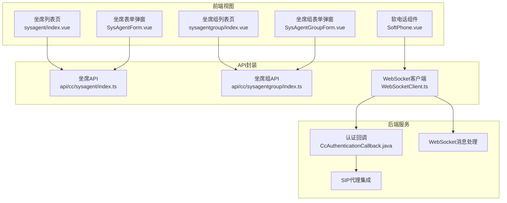
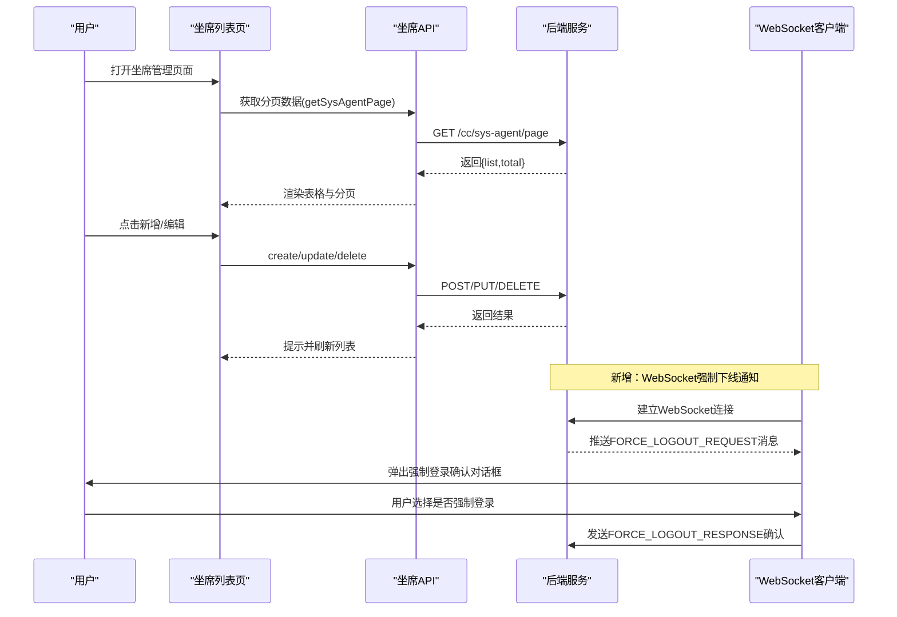
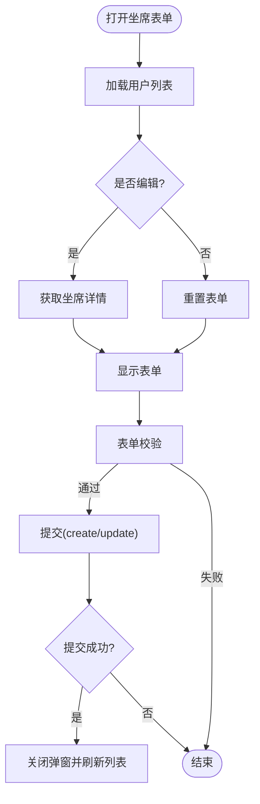
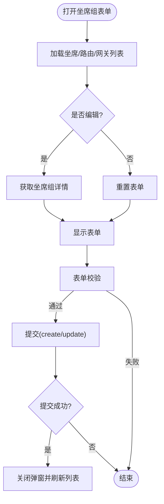
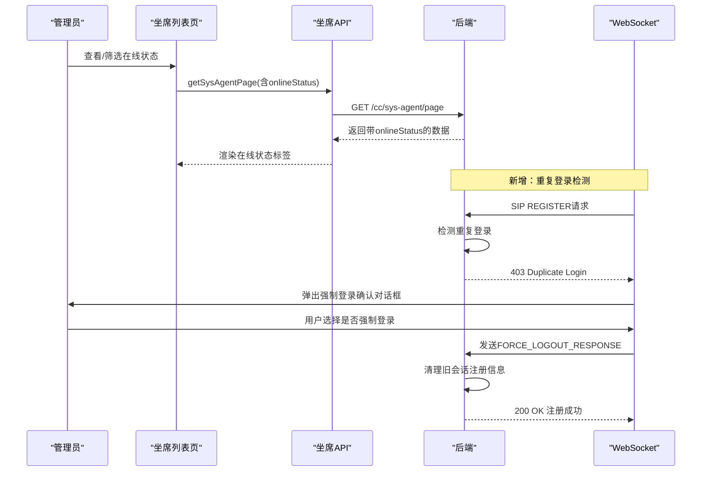
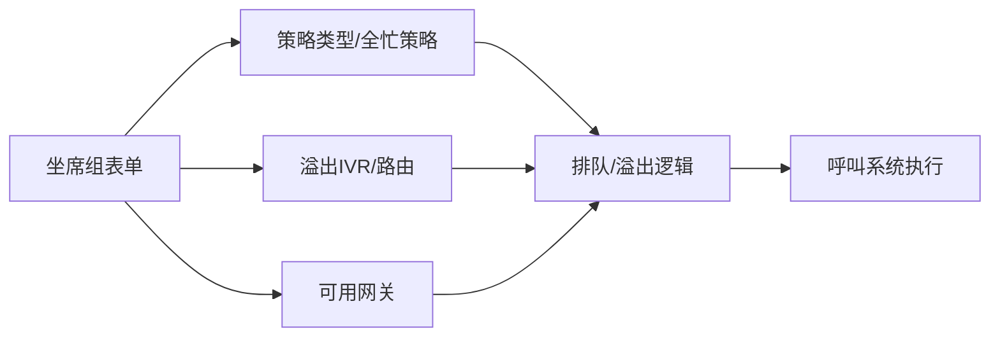
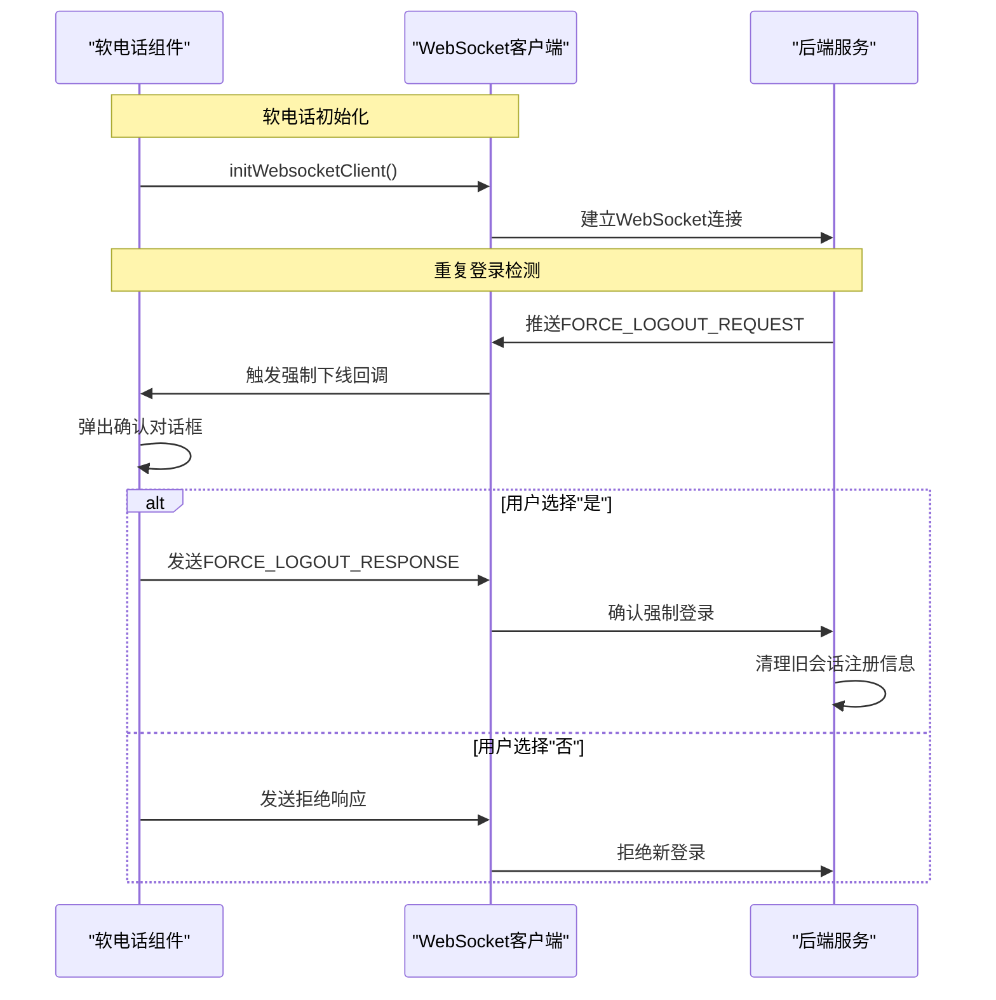
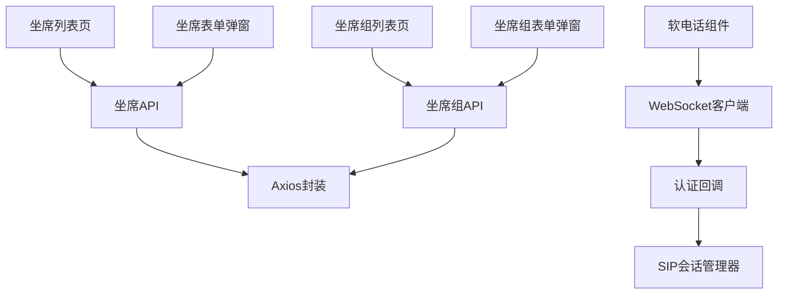

# 坐席工作台

<cite>
**本文引用的文件**
- [yudao-ui-admin-vue3/src/views/cc/sysagent/index.vue](file://yudao-ui-admin-vue3/src/views/cc/sysagent/index.vue)
- [yudao-ui-admin-vue3/src/views/cc/sysagent/SysAgentForm.vue](file://yudao-ui-admin-vue3/src/views/cc/sysagent/SysAgentForm.vue)
- [yudao-ui-admin-vue3/src/api/cc/sysagent/index.ts](file://yudao-ui-admin-vue3/src/api/cc/sysagent/index.ts)
- [yudao-ui-admin-vue3/src/views/cc/sysagentgroup/index.vue](file://yudao-ui-admin-vue3/src/views/cc/sysagentgroup/index.vue)
- [yudao-ui-admin-vue3/src/views/cc/sysagentgroup/SysAgentGroupForm.vue](file://yudao-ui-admin-vue3/src/views/cc/sysagentgroup/SysAgentGroupForm.vue)
- [yudao-ui-admin-vue3/src/api/cc/sysagentgroup/index.ts](file://yudao-ui-admin-vue3/src/api/cc/sysagentgroup/index.ts)
- [yudao-cloud/yudao-module-cc/yudao-module-cc-server/src/main/java/cn/iocoder/yudao/module/cc/sipproxy/integration/CcAuthenticationCallback.java](file://yudao-cloud/yudao-module-cc/yudao-module-cc-server/src/main/java/cn/iocoder/yudao/module/cc/sipproxy/integration/CcAuthenticationCallback.java)
- [yudao-ui-admin-vue3/src/layout/components/SoftPhone/src/WebSocketClient.ts](file://yudao-ui-admin-vue3/src/layout/components/SoftPhone/src/WebSocketClient.ts)
- [yudao-ui-admin-vue3/src/layout/components/SoftPhone/src/SoftPhone.vue](file://yudao-ui-admin-vue3/src/layout/components/SoftPhone/src/SoftPhone.vue)
</cite>

## 更新摘要

**变更内容**

- 新增坐席软电话唯一登录逻辑（强制踢下线）功能文档
- 更新坐席登录认证流程，支持同一坐席账号的强制登录场景
- 新增WebSocket消息处理机制说明
- 补充SIP认证回调机制实现细节
- 增加前端强制下线确认对话框交互流程

## 目录
1. [简介](#简介)
2. [项目结构](#项目结构)
3. [核心组件](#核心组件)
4. [架构总览](#架构总览)
5. [详细组件分析](#详细组件分析)
6. [依赖关系分析](#依赖关系分析)
7. [性能考虑](#性能考虑)
8. [故障排查指南](#故障排查指南)
9. [结论](#结论)
10. [附录](#附录)

## 简介

本文件为"坐席工作台"的完整技术文档，聚焦于坐席管理界面的功能实现与前后端交互。内容覆盖：
- 坐席组管理：创建、编辑、查询、导出、删除及策略配置（排队/溢出/优先级/可用网关）。
- 坐席状态监控：在线状态展示、筛选与列表分页。
- 权限控制：基于按钮级权限指令控制操作可见性。
- **新增** 坐席唯一登录认证：支持同一坐席账号的强制登录场景，包含WebSocket消息处理和SIP认证回调机制。
- 登录认证与状态切换：结合系统用户与SIP账号体系，提供在线/离线/忙碌等状态管理能力（前端通过字典与接口联动）。
- 通话状态显示：在列表中通过字典标签呈现当前在线状态。
- 界面布局与交互：表单校验、弹窗编辑、表格选择与批量操作、导出Excel。
- 呼叫系统集成：通过路由、IVR、网关等配置项完成来电接听、去电拨打、通话转移等能力的前端配置入口。
- 配置管理与性能监控：队列长度、超时时间、溢出策略、可用网关等参数化配置；页面加载态与导出进度反馈。
- 响应式设计与用户体验优化：统一UI组件、可访问性与易用性建议。

## 项目结构

坐席工作台相关代码位于前端Vue3项目中，采用"视图层 + API封装"的分层组织方式：
- 视图层：按业务模块划分目录（如 sysagent、sysagentgroup），每个模块包含列表页与表单弹窗。
- API层：集中定义数据模型与HTTP请求方法，便于复用与维护。
- 数据绑定：使用Element Plus表单与表格组件，配合响应式数据与校验规则。
- 权限控制：通过自定义指令 v-hasPermi 控制按钮可见性。
- 字典与国际化：通过字典类型渲染枚举值，支持多语言提示。
- **新增** WebSocket通信：支持实时状态推送和强制下线通知。

**图表来源**
- [yudao-ui-admin-vue3/src/views/cc/sysagent/index.vue:1-233](file://yudao-ui-admin-vue3/src/views/cc/sysagent/index.vue#L1-L233)
- [yudao-ui-admin-vue3/src/views/cc/sysagent/SysAgentForm.vue:1-131](file://yudao-ui-admin-vue3/src/views/cc/sysagent/SysAgentForm.vue#L1-L131)
- [yudao-ui-admin-vue3/src/api/cc/sysagent/index.ts:1-41](file://yudao-ui-admin-vue3/src/api/cc/sysagent/index.ts#L1-L41)
- [yudao-ui-admin-vue3/src/views/cc/sysagentgroup/index.vue:1-226](file://yudao-ui-admin-vue3/src/views/cc/sysagentgroup/index.vue#L1-L226)
- [yudao-ui-admin-vue3/src/views/cc/sysagentgroup/SysAgentGroupForm.vue:1-273](file://yudao-ui-admin-vue3/src/views/cc/sysagentgroup/SysAgentGroupForm.vue#L1-L273)
- [yudao-ui-admin-vue3/src/api/cc/sysagentgroup/index.ts:1-44](file://yudao-ui-admin-vue3/src/api/cc/sysagentgroup/index.ts#L1-L44)
- [yudao-cloud/yudao-module-cc/yudao-module-cc-server/src/main/java/cn/iocoder/yudao/module/cc/sipproxy/integration/CcAuthenticationCallback.java:1-101](file://yudao-cloud/yudao-module-cc/yudao-module-cc-server/src/main/java/cn/iocoder/yudao/module/cc/sipproxy/integration/CcAuthenticationCallback.java#L1-L101)
- [yudao-ui-admin-vue3/src/layout/components/SoftPhone/src/WebSocketClient.ts:1-800](file://yudao-ui-admin-vue3/src/layout/components/SoftPhone/src/WebSocketClient.ts#L1-L800)

**章节来源**
- [yudao-ui-admin-vue3/src/views/cc/sysagent/index.vue:1-233](file://yudao-ui-admin-vue3/src/views/cc/sysagent/index.vue#L1-L233)
- [yudao-ui-admin-vue3/src/views/cc/sysagentgroup/index.vue:1-226](file://yudao-ui-admin-vue3/src/views/cc/sysagentgroup/index.vue#L1-L226)

## 核心组件
- 坐席管理（CRUD）
    - 列表页：支持按SIP用户名、开通状态、在线状态筛选；分页展示；批量删除；导出Excel。
  - 表单弹窗：新增/编辑SIP账号信息，关联系统用户，设置密码与开通状态。
  - API：分页查询、详情获取、创建、更新、删除、导出、批量删除、按用户ID查询等。
- 坐席组管理（CRUD与策略配置）
  - 列表页：名称、优先级、描述、创建时间；分页；批量删除；导出。
  - 表单弹窗：选择坐席（多选）、策略类型、全忙策略（排队/溢出）、溢出目标（IVR）、优先级、描述、可用网关（多选）。
  - API：分页查询、详情获取、创建、更新、删除、导出、批量删除、列表获取。
- **新增** 软电话组件
    - SIP注册与认证：支持SIP over WebSocket连接，实现SIP协议通信。
    - 状态管理：在线/离线/忙碌状态切换，支持多会话管理。
    - 通话控制：拨号、接听、挂断、保持、静音、转接等功能。
    - **新增** 强制登录处理：接收服务端强制下线通知，弹出确认对话框。

**章节来源**
- [yudao-ui-admin-vue3/src/views/cc/sysagent/index.vue:1-233](file://yudao-ui-admin-vue3/src/views/cc/sysagent/index.vue#L1-L233)
- [yudao-ui-admin-vue3/src/views/cc/sysagent/SysAgentForm.vue:1-131](file://yudao-ui-admin-vue3/src/views/cc/sysagent/SysAgentForm.vue#L1-L131)
- [yudao-ui-admin-vue3/src/api/cc/sysagent/index.ts:1-41](file://yudao-ui-admin-vue3/src/api/cc/sysagent/index.ts#L1-L41)
- [yudao-ui-admin-vue3/src/views/cc/sysagentgroup/index.vue:1-226](file://yudao-ui-admin-vue3/src/views/cc/sysagentgroup/index.vue#L1-L226)
- [yudao-ui-admin-vue3/src/views/cc/sysagentgroup/SysAgentGroupForm.vue:1-273](file://yudao-ui-admin-vue3/src/views/cc/sysagentgroup/SysAgentGroupForm.vue#L1-L273)
- [yudao-ui-admin-vue3/src/api/cc/sysagentgroup/index.ts:1-44](file://yudao-ui-admin-vue3/src/api/cc/sysagentgroup/index.ts#L1-L44)
- [yudao-ui-admin-vue3/src/layout/components/SoftPhone/src/SoftPhone.vue:1-200](file://yudao-ui-admin-vue3/src/layout/components/SoftPhone/src/SoftPhone.vue#L1-L200)

## 架构总览
坐席工作台采用典型的前后端分离架构：
- 前端：Vue3 + Element Plus，负责页面渲染、表单校验、权限控制、数据绑定与交互。
- API层：Axios封装，统一请求路径与方法，返回结构化数据。
- **新增** WebSocket通信：实时状态推送和强制下线通知机制。
- 后端：RESTful接口提供坐席与坐席组的增删改查、导出等功能（由前端调用）。
- **新增** SIP认证回调：处理重复登录检测和强制下线逻辑。

**图表来源**
- [yudao-ui-admin-vue3/src/views/cc/sysagent/index.vue:148-177](file://yudao-ui-admin-vue3/src/views/cc/sysagent/index.vue#L148-L177)
- [yudao-ui-admin-vue3/src/api/cc/sysagent/index.ts:12-39](file://yudao-ui-admin-vue3/src/api/cc/sysagent/index.ts#L12-L39)
- [yudao-cloud/yudao-module-cc/yudao-module-cc-server/src/main/java/cn/iocoder/yudao/module/cc/sipproxy/integration/CcAuthenticationCallback.java:74-80](file://yudao-cloud/yudao-module-cc/yudao-module-cc-server/src/main/java/cn/iocoder/yudao/module/cc/sipproxy/integration/CcAuthenticationCallback.java#L74-L80)

**章节来源**
- [yudao-ui-admin-vue3/src/views/cc/sysagent/index.vue:148-177](file://yudao-ui-admin-vue3/src/views/cc/sysagent/index.vue#L148-L177)
- [yudao-ui-admin-vue3/src/api/cc/sysagent/index.ts:12-39](file://yudao-ui-admin-vue3/src/api/cc/sysagent/index.ts#L12-L39)

## 详细组件分析

### 坐席管理（列表与表单）
- 列表页
    - 搜索条件：SIP用户名、开通状态、在线状态。
    - 表格字段：主键id、SIP用户名、用户、在线状态、开通状态、创建时间。
  - 操作：编辑、删除、批量删除、导出。
  - 权限：新增、导出、删除均受权限指令控制。
- 表单弹窗
    - 字段：SIP用户名、用户、SIP密码、开通状态。
  - 校验：必填项校验。
  - 提交：新增或更新成功后关闭弹窗并触发父组件刷新。

**图表来源**
- [yudao-ui-admin-vue3/src/views/cc/sysagent/SysAgentForm.vue:81-116](file://yudao-ui-admin-vue3/src/views/cc/sysagent/SysAgentForm.vue#L81-L116)
- [yudao-ui-admin-vue3/src/views/cc/sysagent/index.vue:189-210](file://yudao-ui-admin-vue3/src/views/cc/sysagent/index.vue#L189-L210)

**章节来源**
- [yudao-ui-admin-vue3/src/views/cc/sysagent/index.vue:1-233](file://yudao-ui-admin-vue3/src/views/cc/sysagent/index.vue#L1-L233)
- [yudao-ui-admin-vue3/src/views/cc/sysagent/SysAgentForm.vue:1-131](file://yudao-ui-admin-vue3/src/views/cc/sysagent/SysAgentForm.vue#L1-L131)
- [yudao-ui-admin-vue3/src/api/cc/sysagent/index.ts:1-41](file://yudao-ui-admin-vue3/src/api/cc/sysagent/index.ts#L1-L41)

### 坐席组管理（列表与表单）
- 列表页
  - 搜索条件：坐席组名称。
  - 表格字段：主键id、坐席组名称、优先级、描述、创建时间。
  - 操作：编辑、删除、批量删除、导出。
  - 权限：新增、导出、删除受权限指令控制。
- 表单弹窗
  - 字段：坐席组名称、选择坐席（多选）、策略类型、全忙策略（排队/溢出）、溢出IVR、优先级、描述、可用网关（多选）。
  - 动态显示：根据全忙策略显示不同配置项。
  - 数据源：从API获取坐席列表、路由列表、网关列表用于下拉选择。

**图表来源**
- [yudao-ui-admin-vue3/src/views/cc/sysagentgroup/SysAgentGroupForm.vue:173-243](file://yudao-ui-admin-vue3/src/views/cc/sysagentgroup/SysAgentGroupForm.vue#L173-L243)
- [yudao-ui-admin-vue3/src/views/cc/sysagentgroup/index.vue:171-199](file://yudao-ui-admin-vue3/src/views/cc/sysagentgroup/index.vue#L171-L199)

**章节来源**
- [yudao-ui-admin-vue3/src/views/cc/sysagentgroup/index.vue:1-226](file://yudao-ui-admin-vue3/src/views/cc/sysagentgroup/index.vue#L1-L226)
- [yudao-ui-admin-vue3/src/views/cc/sysagentgroup/SysAgentGroupForm.vue:1-273](file://yudao-ui-admin-vue3/src/views/cc/sysagentgroup/SysAgentGroupForm.vue#L1-L273)
- [yudao-ui-admin-vue3/src/api/cc/sysagentgroup/index.ts:1-44](file://yudao-ui-admin-vue3/src/api/cc/sysagentgroup/index.ts#L1-L44)

### 坐席登录认证与状态切换
- 登录认证
  - 通过系统用户与SIP账号绑定，表单中维护userId与name/password等字段，确保SIP账户有效。
  - 列表页支持按"开通状态"筛选，体现账户启用/禁用。
- **新增** 唯一登录认证
    - SIP注册时检测重复登录，向已登录会话发送强制下线通知。
    - 前端收到通知后弹出确认对话框，用户可选择是否强制登录。
    - 确认后清理旧会话的SIP注册信息，允许新会话注册。
- 状态切换
  - 在线状态通过字典类型渲染，列表支持按在线状态筛选。
  - 实际状态切换通常由后端或通信层驱动，前端通过接口与字典同步展示。

**图表来源**
- [yudao-ui-admin-vue3/src/views/cc/sysagent/index.vue:168-177](file://yudao-ui-admin-vue3/src/views/cc/sysagent/index.vue#L168-L177)
- [yudao-ui-admin-vue3/src/api/cc/sysagent/index.ts:12-27](file://yudao-ui-admin-vue3/src/api/cc/sysagent/index.ts#L12-L27)
- [yudao-cloud/yudao-module-cc/yudao-module-cc-server/src/main/java/cn/iocoder/yudao/module/cc/sipproxy/integration/CcAuthenticationCallback.java:74-80](file://yudao-cloud/yudao-module-cc/yudao-module-cc-server/src/main/java/cn/iocoder/yudao/module/cc/sipproxy/integration/CcAuthenticationCallback.java#L74-L80)

**章节来源**
- [yudao-ui-admin-vue3/src/views/cc/sysagent/index.vue:1-233](file://yudao-ui-admin-vue3/src/views/cc/sysagent/index.vue#L1-L233)
- [yudao-ui-admin-vue3/src/views/cc/sysagent/SysAgentForm.vue:1-131](file://yudao-ui-admin-vue3/src/views/cc/sysagent/SysAgentForm.vue#L1-L131)
- [yudao-ui-admin-vue3/src/api/cc/sysagent/index.ts:1-41](file://yudao-ui-admin-vue3/src/api/cc/sysagent/index.ts#L1-L41)
- [yudao-cloud/yudao-module-cc/yudao-module-cc-server/src/main/java/cn/iocoder/yudao/module/cc/sipproxy/integration/CcAuthenticationCallback.java:1-101](file://yudao-cloud/yudao-module-cc/yudao-module-cc-server/src/main/java/cn/iocoder/yudao/module/cc/sipproxy/integration/CcAuthenticationCallback.java#L1-L101)

### 通话状态显示与呼叫系统集成
- 通话状态显示
    - 列表中的"在线状态"通过字典标签展示，便于快速识别坐席可用性。
- 呼叫系统集成
  - 坐席组表单支持配置策略类型、全忙策略（排队/溢出）、溢出IVR、可用网关等，这些配置将影响来电分配、去电路由与通话转移行为。
  - 路由与IVR作为溢出目标，可实现复杂呼叫流转。

**图表来源**
- [yudao-ui-admin-vue3/src/views/cc/sysagentgroup/SysAgentGroupForm.vue:30-105](file://yudao-ui-admin-vue3/src/views/cc/sysagentgroup/SysAgentGroupForm.vue#L30-L105)

**章节来源**
- [yudao-ui-admin-vue3/src/views/cc/sysagentgroup/SysAgentGroupForm.vue:1-273](file://yudao-ui-admin-vue3/src/views/cc/sysagentgroup/SysAgentGroupForm.vue#L1-L273)

### 权限控制
- 按钮级权限：通过v-hasPermi指令控制新增、编辑、删除、导出的可见性。
- 常见权限标识示例：cc:sys-agent:create、cc:sys-agent:update、cc:sys-agent:delete、cc:sys-agent:export、cc:sys-agent-group:*。

**章节来源**
- [yudao-ui-admin-vue3/src/views/cc/sysagent/index.vue:47-72](file://yudao-ui-admin-vue3/src/views/cc/sysagent/index.vue#L47-L72)
- [yudao-ui-admin-vue3/src/views/cc/sysagentgroup/index.vue:23-48](file://yudao-ui-admin-vue3/src/views/cc/sysagentgroup/index.vue#L23-L48)

### 用户界面布局与交互逻辑

- 布局：统一的ContentWrap包裹搜索区与列表区，表格行内操作按钮集中在"操作"列。
- 交互：
  - 搜索与重置：清空表单后重新查询。
  - 分页：页码与条数变化时自动刷新列表。
  - 批量操作：勾选多行后进行批量删除。
  - 导出：二次确认后下载Excel。
  - 表单：弹窗形式，提交后关闭并触发父组件刷新。
- **新增** 强制登录交互：
    - 收到服务端强制下线通知时弹出确认对话框。
    - 用户可选择"是"强制登录或"否"拒绝登录。
    - 确认后执行签出操作并清理SIP会话。

**章节来源**
- [yudao-ui-admin-vue3/src/views/cc/sysagent/index.vue:1-233](file://yudao-ui-admin-vue3/src/views/cc/sysagent/index.vue#L1-L233)
- [yudao-ui-admin-vue3/src/views/cc/sysagentgroup/index.vue:1-226](file://yudao-ui-admin-vue3/src/views/cc/sysagentgroup/index.vue#L1-L226)
- [yudao-ui-admin-vue3/src/layout/components/SoftPhone/src/SoftPhone.vue:1-200](file://yudao-ui-admin-vue3/src/layout/components/SoftPhone/src/SoftPhone.vue#L1-L200)

### 数据绑定方式
- 表单绑定：v-model双向绑定formData字段，rules进行校验。
- 列表绑定：v-for渲染表格数据，dict-tag渲染字典值。
- 下拉选择：从API获取字典或关联数据（用户、路由、网关）绑定到select/transfer。
- **新增** WebSocket数据绑定：
    - 实时状态变更通过事件监听器更新UI。
    - 强制下线通知通过WebSocket消息处理更新组件状态。

**章节来源**
- [yudao-ui-admin-vue3/src/views/cc/sysagent/SysAgentForm.vue:63-77](file://yudao-ui-admin-vue3/src/views/cc/sysagent/SysAgentForm.vue#L63-L77)
- [yudao-ui-admin-vue3/src/views/cc/sysagentgroup/SysAgentGroupForm.vue:144-171](file://yudao-ui-admin-vue3/src/views/cc/sysagentgroup/SysAgentGroupForm.vue#L144-L171)
- [yudao-ui-admin-vue3/src/layout/components/SoftPhone/src/WebSocketClient.ts:266-284](file://yudao-ui-admin-vue3/src/layout/components/SoftPhone/src/WebSocketClient.ts#L266-L284)

### 软电话组件与WebSocket通信

- **新增** 软电话组件功能
    - SIP注册与认证：支持SIP over WebSocket连接，实现SIP协议通信。
    - 状态管理：在线/离线/忙碌状态切换，支持多会话管理。
    - 通话控制：拨号、接听、挂断、保持、静音、转接等功能。
    - **新增** 强制登录处理：接收服务端强制下线通知，弹出确认对话框。
- **新增** WebSocket通信机制
    - 心跳保活：定时发送心跳包维持连接。
    - 重连机制：指数退避策略自动重连。
    - **新增** 强制下线通知：接收FORCE_LOGOUT_REQUEST消息并处理。
    - 待发送队列：网络断开时缓存消息，重连后自动发送。

**图表来源**

- [yudao-ui-admin-vue3/src/layout/components/SoftPhone/src/WebSocketClient.ts:437-513](file://yudao-ui-admin-vue3/src/layout/components/SoftPhone/src/WebSocketClient.ts#L437-L513)
- [yudao-ui-admin-vue3/src/layout/components/SoftPhone/src/SoftPhone.vue:565-583](file://yudao-ui-admin-vue3/src/layout/components/SoftPhone/src/SoftPhone.vue#L565-L583)
- [yudao-cloud/yudao-module-cc/yudao-module-cc-server/src/main/java/cn/iocoder/yudao/module/cc/sipproxy/integration/CcAuthenticationCallback.java:74-80](file://yudao-cloud/yudao-module-cc/yudao-module-cc-server/src/main/java/cn/iocoder/yudao/module/cc/sipproxy/integration/CcAuthenticationCallback.java#L74-L80)

**章节来源**

- [yudao-ui-admin-vue3/src/layout/components/SoftPhone/src/WebSocketClient.ts:1-800](file://yudao-ui-admin-vue3/src/layout/components/SoftPhone/src/WebSocketClient.ts#L1-L800)
- [yudao-ui-admin-vue3/src/layout/components/SoftPhone/src/SoftPhone.vue:1-200](file://yudao-ui-admin-vue3/src/layout/components/SoftPhone/src/SoftPhone.vue#L1-L200)
- [yudao-cloud/yudao-module-cc/yudao-module-cc-server/src/main/java/cn/iocoder/yudao/module/cc/sipproxy/integration/CcAuthenticationCallback.java:1-101](file://yudao-cloud/yudao-module-cc/yudao-module-cc-server/src/main/java/cn/iocoder/yudao/module/cc/sipproxy/integration/CcAuthenticationCallback.java#L1-L101)

## 依赖关系分析
- 视图依赖API：列表页与表单弹窗分别依赖对应API模块进行数据获取与提交。
- API依赖Axios：统一封装请求方法与错误处理。
- 表单依赖字典与工具：字典用于枚举渲染，工具函数用于格式化时间与下载。
- **新增** WebSocket依赖：
    - 软电话组件依赖WebSocket客户端进行实时通信。
    - 认证回调依赖SIP会话管理器进行重复登录检测。
    - 前端组件依赖事件监听器处理状态变更通知。

**图表来源**
- [yudao-ui-admin-vue3/src/views/cc/sysagent/index.vue:148-177](file://yudao-ui-admin-vue3/src/views/cc/sysagent/index.vue#L148-L177)
- [yudao-ui-admin-vue3/src/views/cc/sysagent/SysAgentForm.vue:81-116](file://yudao-ui-admin-vue3/src/views/cc/sysagent/SysAgentForm.vue#L81-L116)
- [yudao-ui-admin-vue3/src/views/cc/sysagentgroup/index.vue:147-157](file://yudao-ui-admin-vue3/src/views/cc/sysagentgroup/index.vue#L147-L157)
- [yudao-ui-admin-vue3/src/views/cc/sysagentgroup/SysAgentGroupForm.vue:173-243](file://yudao-ui-admin-vue3/src/views/cc/sysagentgroup/SysAgentGroupForm.vue#L173-L243)
- [yudao-ui-admin-vue3/src/api/cc/sysagent/index.ts:12-39](file://yudao-ui-admin-vue3/src/api/cc/sysagent/index.ts#L12-L39)
- [yudao-ui-admin-vue3/src/api/cc/sysagentgroup/index.ts:17-41](file://yudao-ui-admin-vue3/src/api/cc/sysagentgroup/index.ts#L17-L41)
- [yudao-ui-admin-vue3/src/layout/components/SoftPhone/src/WebSocketClient.ts:437-513](file://yudao-ui-admin-vue3/src/layout/components/SoftPhone/src/WebSocketClient.ts#L437-L513)
- [yudao-cloud/yudao-module-cc/yudao-module-cc-server/src/main/java/cn/iocoder/yudao/module/cc/sipproxy/integration/CcAuthenticationCallback.java:33-34](file://yudao-cloud/yudao-module-cc/yudao-module-cc-server/src/main/java/cn/iocoder/yudao/module/cc/sipproxy/integration/CcAuthenticationCallback.java#L33-L34)

**章节来源**
- [yudao-ui-admin-vue3/src/api/cc/sysagent/index.ts:1-41](file://yudao-ui-admin-vue3/src/api/cc/sysagent/index.ts#L1-L41)
- [yudao-ui-admin-vue3/src/api/cc/sysagentgroup/index.ts:1-44](file://yudao-ui-admin-vue3/src/api/cc/sysagentgroup/index.ts#L1-L44)
- [yudao-ui-admin-vue3/src/layout/components/SoftPhone/src/WebSocketClient.ts:1-800](file://yudao-ui-admin-vue3/src/layout/components/SoftPhone/src/WebSocketClient.ts#L1-L800)
- [yudao-cloud/yudao-module-cc/yudao-module-cc-server/src/main/java/cn/iocoder/yudao/module/cc/sipproxy/integration/CcAuthenticationCallback.java:1-101](file://yudao-cloud/yudao-module-cc/yudao-module-cc-server/src/main/java/cn/iocoder/yudao/module/cc/sipproxy/integration/CcAuthenticationCallback.java#L1-L101)

## 性能考虑
- 列表加载：使用loading状态避免重复请求，分页减少单次数据量。
- 导出性能：导出前二次确认，避免误操作；下载完成后恢复按钮状态。
- 表单校验：即时校验减少无效提交，提升用户体验。
- 资源加载：按需加载下拉选项（坐席、路由、网关），减少初始负载。
- **新增** WebSocket性能优化：
    - 心跳间隔调优：10秒心跳间隔，35秒超时检测。
    - 重连策略：指数退避算法，最大60秒间隔。
    - 消息队列：断线期间缓存消息，重连后自动发送。
    - 内存管理：及时清理事件监听器和定时器。

[本节为通用指导，不直接分析具体文件]

## 故障排查指南
- 列表无法加载
  - 检查网络请求是否成功，确认API路径与参数是否正确。
  - 查看控制台错误与后端返回状态码。
- 表单提交失败
  - 检查必填项是否填写完整，校验规则是否满足。
  - 确认权限是否足够（新增/编辑/删除/导出）。
- 导出无响应
  - 确认导出接口返回二进制流，浏览器是否拦截下载。
  - 检查导出参数是否合法。
- 状态显示异常
  - 检查字典配置是否正确映射。
  - 确认后端返回的在线状态值是否符合预期。
- **新增** WebSocket连接问题
    - 检查WebSocket连接状态，确认token是否有效。
    - 查看心跳是否正常，网络连接是否稳定。
    - 检查重连机制是否正常工作。
- **新增** 强制登录问题
    - 确认重复登录检测逻辑是否生效。
    - 检查强制下线通知是否正确推送。
    - 验证用户确认对话框是否正常显示。

**章节来源**
- [yudao-ui-admin-vue3/src/views/cc/sysagent/index.vue:168-177](file://yudao-ui-admin-vue3/src/views/cc/sysagent/index.vue#L168-L177)
- [yudao-ui-admin-vue3/src/views/cc/sysagent/SysAgentForm.vue:99-116](file://yudao-ui-admin-vue3/src/views/cc/sysagent/SysAgentForm.vue#L99-L116)
- [yudao-ui-admin-vue3/src/views/cc/sysagentgroup/index.vue:206-218](file://yudao-ui-admin-vue3/src/views/cc/sysagentgroup/index.vue#L206-L218)
- [yudao-ui-admin-vue3/src/layout/components/SoftPhone/src/WebSocketClient.ts:622-639](file://yudao-ui-admin-vue3/src/layout/components/SoftPhone/src/WebSocketClient.ts#L622-L639)
- [yudao-cloud/yudao-module-cc/yudao-module-cc-server/src/main/java/cn/iocoder/yudao/module/cc/sipproxy/integration/CcAuthenticationCallback.java:74-80](file://yudao-cloud/yudao-module-cc/yudao-module-cc-server/src/main/java/cn/iocoder/yudao/module/cc/sipproxy/integration/CcAuthenticationCallback.java#L74-L80)

## 结论

坐席工作台在前端实现了完整的坐席与坐席组管理能力，涵盖列表查询、表单编辑、权限控制、导出与批量操作。通过策略配置与路由/IVR/网关集成，为呼叫中心提供了灵活的呼叫分发与通话管理能力。
**新增的坐席唯一登录功能**
进一步增强了系统的安全性和用户体验，通过WebSocket实时通信和SIP认证回调机制，实现了同一坐席账号的强制登录场景。建议在后续迭代中增强实时状态推送、更丰富的统计报表与更细粒度的权限模型，以提升运营效率与用户体验。

[本节为总结性内容，不直接分析具体文件]

## 附录
- 常用API路径参考
  - 坐席：/cc/sys-agent/page、/cc/sys-agent/create、/cc/sys-agent/update、/cc/sys-agent/delete、/cc/sys-agent/export-excel
  - 坐席组：/cc/sys-agent-group/page、/cc/sys-agent-group/create、/cc/sys-agent-group/update、/cc/sys-agent-group/delete、/cc/sys-agent-group/export-excel
- **新增** WebSocket消息类型
    - FORCE_LOGOUT_REQUEST：强制下线请求消息
    - FORCE_LOGOUT_RESPONSE：强制下线响应消息
    - AGENT_STATUS_CHANGED：坐席状态变更通知
    - HEARTBEAT：心跳包消息
- 关键字典类型
  - CC_SIP_SUBSCRIBER_STATUS：SIP订阅者开通状态
  - CC_SYS_AGENT_ONLINE_STATUS：坐席在线状态
  - CC_SYS_AGENT_GROUP_STRATEGY_TYPE：坐席组策略类型
  - CC_SYS_AGENT_GROUP_FULL_BUSY_TYPE：全忙策略类型
  - CC_SYS_AGENT_GROUP_OVERFLOW_TYPE：溢出策略类型

**章节来源**
- [yudao-ui-admin-vue3/src/api/cc/sysagent/index.ts:12-39](file://yudao-ui-admin-vue3/src/api/cc/sysagent/index.ts#L12-L39)
- [yudao-ui-admin-vue3/src/api/cc/sysagentgroup/index.ts:17-41](file://yudao-ui-admin-vue3/src/api/cc/sysagentgroup/index.ts#L17-L41)
- [yudao-ui-admin-vue3/src/views/cc/sysagent/index.vue:19-43](file://yudao-ui-admin-vue3/src/views/cc/sysagent/index.vue#L19-L43)
- [yudao-ui-admin-vue3/src/views/cc/sysagentgroup/SysAgentGroupForm.vue:30-81](file://yudao-ui-admin-vue3/src/views/cc/sysagentgroup/SysAgentGroupForm.vue#L30-L81)
- [yudao-ui-admin-vue3/src/layout/components/SoftPhone/src/WebSocketClient.ts:201-210](file://yudao-ui-admin-vue3/src/layout/components/SoftPhone/src/WebSocketClient.ts#L201-L210)