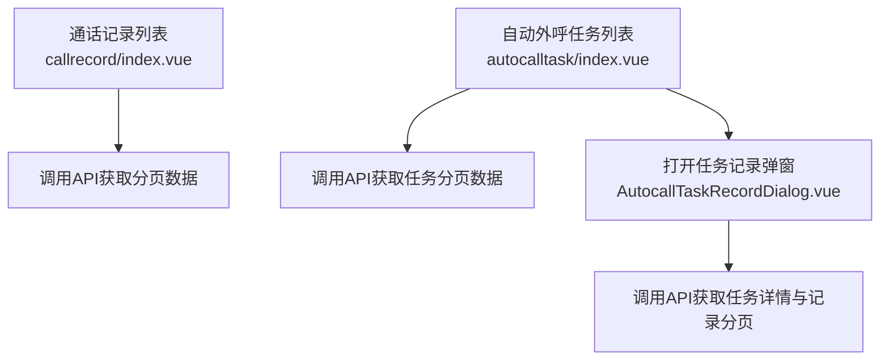
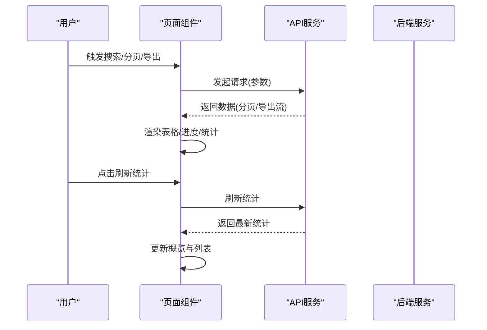
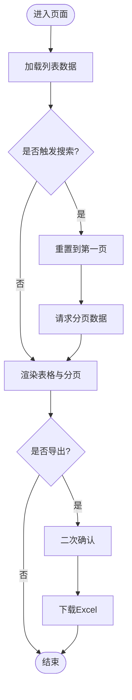
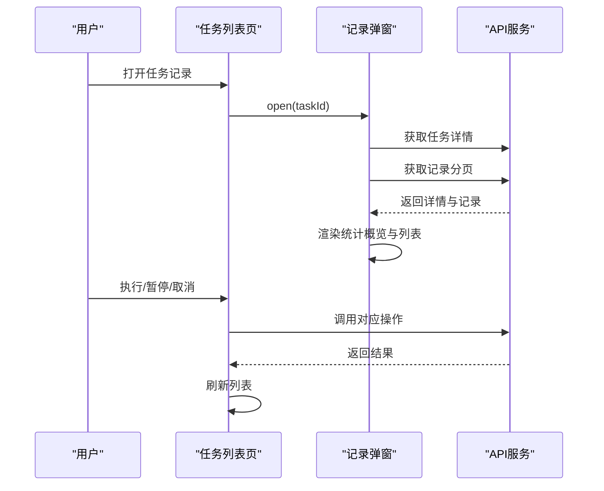
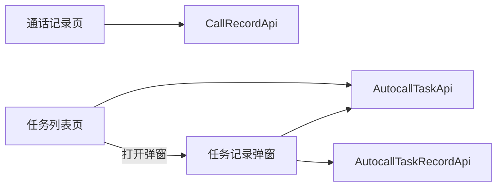

# 实时监控面板

<cite>
**本文引用的文件**
- [yudao-ui-admin-vue3/src/views/cc/callrecord/index.vue](file://yudao-ui-admin-vue3/src/views/cc/callrecord/index.vue)
- [yudao-ui-admin-vue3/src/views/cc/autocalltask/index.vue](file://yudao-ui-admin-vue3/src/views/cc/autocalltask/index.vue)
- [yudao-ui-admin-vue3/src/views/cc/autocalltask/AutocallTaskRecordDialog.vue](file://yudao-ui-admin-vue3/src/views/cc/autocalltask/AutocallTaskRecordDialog.vue)
</cite>

## 目录
1. [简介](#简介)
2. [项目结构](#项目结构)
3. [核心组件](#核心组件)
4. [架构总览](#架构总览)
5. [详细组件分析](#详细组件分析)
6. [依赖关系分析](#依赖关系分析)
7. [性能考虑](#性能考虑)
8. [故障排查指南](#故障排查指南)
9. [结论](#结论)
10. [附录](#附录)

## 简介
本文件为“实时监控面板”的技术与使用文档，聚焦以下能力：
- 通话记录查询界面：支持按呼叫唯一ID、主被叫号码、时间范围等条件检索，展示通话状态、方向、应答标识、振铃/接通/结束时间等关键指标，并提供导出。
- 自动外呼任务监控界面：提供任务列表、状态跟踪、拨号进度显示、失败记录查看，以及任务的执行、暂停、取消等操作。
- 实时数据展示组件：说明WebSocket连接管理、数据刷新机制与图表可视化（结合前端通用组件）。
- 监控面板的性能指标收集、告警通知与报表生成（基于现有导出能力与可拓展点）。
- 缓存策略与性能优化方案，以及自定义配置与扩展开发指导。

## 项目结构
监控相关的前端页面位于 CC 模块的视图层，主要包含：
- 通话记录列表页：用于历史通话检索与导出。
- 自动外呼任务列表页：用于任务创建、执行、暂停、取消及进度查看。
- 自动外呼任务记录弹窗：用于查看具体任务下的逐条外呼记录与统计概览。

图示来源
- [yudao-ui-admin-vue3/src/views/cc/callrecord/index.vue:1-268](file://yudao-ui-admin-vue3/src/views/cc/callrecord/index.vue#L1-L268)
- [yudao-ui-admin-vue3/src/views/cc/autocalltask/index.vue:1-395](file://yudao-ui-admin-vue3/src/views/cc/autocalltask/index.vue#L1-L395)
- [yudao-ui-admin-vue3/src/views/cc/autocalltask/AutocallTaskRecordDialog.vue:1-280](file://yudao-ui-admin-vue3/src/views/cc/autocalltask/AutocallTaskRecordDialog.vue#L1-L280)

章节来源
- [yudao-ui-admin-vue3/src/views/cc/callrecord/index.vue:1-268](file://yudao-ui-admin-vue3/src/views/cc/callrecord/index.vue#L1-L268)
- [yudao-ui-admin-vue3/src/views/cc/autocalltask/index.vue:1-395](file://yudao-ui-admin-vue3/src/views/cc/autocalltask/index.vue#L1-L395)
- [yudao-ui-admin-vue3/src/views/cc/autocalltask/AutocallTaskRecordDialog.vue:1-280](file://yudao-ui-admin-vue3/src/views/cc/autocalltask/AutocallTaskRecordDialog.vue#L1-L280)

## 核心组件
- 通话记录查询界面
  - 搜索维度：呼叫唯一ID、主叫号码、被叫号码、呼叫开始/结束时间范围。
  - 列表字段：主被叫显号、归属地、坐席信息、呼叫状态、方向、应答标识、振铃/接通/结束时间、创建时间等。
  - 操作：查看详情、导出Excel。
  - 数据来源：通过API分页获取并渲染表格与分页控件。
- 自动外呼任务监控界面
  - 搜索维度：任务名称、任务状态、计划时间范围。
  - 列表字段：任务ID、名称、目标号码、网关ID、IVR流程、主叫号码、状态、进度、计划/创建时间。
  - 操作：新增、编辑、执行、暂停、取消、删除、查看记录、导出。
  - 进度计算：成功数+失败数/总数；状态映射为标签类型。
- 自动外呼任务记录弹窗
  - 统计概览：任务名称、状态、总数、成功、失败、待呼叫、开始/结束时间。
  - 记录列表：被叫号码、呼叫状态、通话记录ID、开始/接通/结束时间、时长、挂断原因、IVR按键。
  - 操作：搜索、重置、刷新统计、导出。

章节来源
- [yudao-ui-admin-vue3/src/views/cc/callrecord/index.vue:1-268](file://yudao-ui-admin-vue3/src/views/cc/callrecord/index.vue#L1-L268)
- [yudao-ui-admin-vue3/src/views/cc/autocalltask/index.vue:1-395](file://yudao-ui-admin-vue3/src/views/cc/autocalltask/index.vue#L1-L395)
- [yudao-ui-admin-vue3/src/views/cc/autocalltask/AutocallTaskRecordDialog.vue:1-280](file://yudao-ui-admin-vue3/src/views/cc/autocalltask/AutocallTaskRecordDialog.vue#L1-L280)

## 架构总览
监控面板采用“页面组件 + API调用 + 通用UI组件”的分层模式：
- 页面组件负责表单输入、列表渲染、分页交互与导出。
- API层封装后端接口调用（分页、导出、刷新统计等）。
- 通用UI组件包括表格、分页、对话框、标签、日期选择器等。
- 对于实时性要求较高的场景，可通过WebSocket推送更新（如任务进度），当前页面已预留刷新统计入口。

图示来源
- [yudao-ui-admin-vue3/src/views/cc/autocalltask/index.vue:282-375](file://yudao-ui-admin-vue3/src/views/cc/autocalltask/index.vue#L282-L375)
- [yudao-ui-admin-vue3/src/views/cc/autocalltask/AutocallTaskRecordDialog.vue:196-262](file://yudao-ui-admin-vue3/src/views/cc/autocalltask/AutocallTaskRecordDialog.vue#L196-L262)

## 详细组件分析

### 通话记录查询界面
- 功能要点
  - 多条件组合查询：支持按呼叫唯一ID、主被叫号码、时间范围筛选。
  - 列表展示：关键字段均带格式化与字典标签，便于快速识别状态与方向。
  - 导出：支持将当前查询结果导出为Excel。
- 交互流程
  - 初始化加载列表。
  - 搜索/重置后重新拉取分页数据。
  - 导出前二次确认，成功后下载文件。

图示来源
- [yudao-ui-admin-vue3/src/views/cc/callrecord/index.vue:170-268](file://yudao-ui-admin-vue3/src/views/cc/callrecord/index.vue#L170-L268)

章节来源
- [yudao-ui-admin-vue3/src/views/cc/callrecord/index.vue:1-268](file://yudao-ui-admin-vue3/src/views/cc/callrecord/index.vue#L1-L268)

### 自动外呼任务监控界面
- 功能要点
  - 任务状态跟踪：以标签形式展示任务状态，支持按状态筛选。
  - 拨号进度显示：根据成功数与失败数计算百分比，并在异常或完成时显示不同状态。
  - 失败记录查看：通过“记录”按钮打开弹窗，查看该任务下每条外呼记录的详细信息。
  - 任务控制：支持立即执行、暂停、取消、删除等。
- 交互流程
  - 初始化加载IVR流程映射与任务列表。
  - 搜索/重置后重新拉取分页数据。
  - 执行/暂停/取消后刷新列表。
  - 打开记录弹窗，并行加载任务详情与记录分页。

图示来源
- [yudao-ui-admin-vue3/src/views/cc/autocalltask/index.vue:200-375](file://yudao-ui-admin-vue3/src/views/cc/autocalltask/index.vue#L200-L375)
- [yudao-ui-admin-vue3/src/views/cc/autocalltask/AutocallTaskRecordDialog.vue:126-262](file://yudao-ui-admin-vue3/src/views/cc/autocalltask/AutocallTaskRecordDialog.vue#L126-L262)

章节来源
- [yudao-ui-admin-vue3/src/views/cc/autocalltask/index.vue:1-395](file://yudao-ui-admin-vue3/src/views/cc/autocalltask/index.vue#L1-L395)
- [yudao-ui-admin-vue3/src/views/cc/autocalltask/AutocallTaskRecordDialog.vue:1-280](file://yudao-ui-admin-vue3/src/views/cc/autocalltask/AutocallTaskRecordDialog.vue#L1-L280)

### 实时数据展示组件
- WebSocket连接管理
  - 建议通过全局WebSocket管理器维护连接生命周期（建立、心跳、重连、断开处理）。
  - 针对任务进度、通话状态变更等高频事件，采用增量推送减少轮询压力。
- 数据刷新机制
  - 页面级：在关键操作（执行/暂停/取消）后主动刷新列表。
  - 弹窗级：提供“刷新统计”按钮，按需拉取最新统计并更新概览。
  - 定时刷新：对长耗时任务可引入轻量定时器，避免频繁全量刷新。
- 图表可视化
  - 使用通用图表组件（如ECharts）展示趋势、分布与对比。
  - 数据源优先来自WebSocket推送，其次回退到HTTP轮询。

章节来源
- [yudao-ui-admin-vue3/src/views/cc/autocalltask/AutocallTaskRecordDialog.vue:242-253](file://yudao-ui-admin-vue3/src/views/cc/autocalltask/AutocallTaskRecordDialog.vue#L242-L253)
- [yudao-ui-admin-vue3/src/views/cc/autocalltask/index.vue:282-375](file://yudao-ui-admin-vue3/src/views/cc/autocalltask/index.vue#L282-L375)

### 性能指标收集、告警通知与报表生成
- 性能指标收集
  - 前端埋点：页面加载耗时、接口响应耗时、错误率、用户行为（搜索、导出、刷新）。
  - 业务指标：任务成功率、失败原因分布、平均通话时长、接通率。
- 告警通知
  - 阈值告警：当失败率或错误率超过阈值时，通过站内消息或外部渠道通知。
  - 事件告警：任务异常终止、长时间无进展时触发告警。
- 报表生成
  - 导出能力：通话记录、任务列表、任务记录均可导出Excel。
  - 定时报表：可结合后端定时任务生成日报/周报，供运营分析。

章节来源
- [yudao-ui-admin-vue3/src/views/cc/callrecord/index.vue:248-261](file://yudao-ui-admin-vue3/src/views/cc/callrecord/index.vue#L248-L261)
- [yudao-ui-admin-vue3/src/views/cc/autocalltask/index.vue:358-369](file://yudao-ui-admin-vue3/src/views/cc/autocalltask/index.vue#L358-L369)
- [yudao-ui-admin-vue3/src/views/cc/autocalltask/AutocallTaskRecordDialog.vue:255-262](file://yudao-ui-admin-vue3/src/views/cc/autocalltask/AutocallTaskRecordDialog.vue#L255-L262)

## 依赖关系分析
- 页面与API
  - 通话记录页依赖CallRecordApi进行分页查询与导出。
  - 任务列表页依赖AutocallTaskApi进行分页、执行、暂停、取消、导出等。
  - 任务记录弹窗依赖AutocallTaskRecordApi进行记录分页与导出，并通过AutocallTaskApi刷新统计。
- 页面间耦合
  - 任务列表页与记录弹窗存在父子关系，通过ref暴露open方法传递taskId。
- 外部依赖
  - UI组件库（Element Plus）、工具函数（日期格式化、下载）、权限指令（v-hasPermi）。

图示来源
- [yudao-ui-admin-vue3/src/views/cc/callrecord/index.vue:170-268](file://yudao-ui-admin-vue3/src/views/cc/callrecord/index.vue#L170-L268)
- [yudao-ui-admin-vue3/src/views/cc/autocalltask/index.vue:192-375](file://yudao-ui-admin-vue3/src/views/cc/autocalltask/index.vue#L192-L375)
- [yudao-ui-admin-vue3/src/views/cc/autocalltask/AutocallTaskRecordDialog.vue:126-262](file://yudao-ui-admin-vue3/src/views/cc/autocalltask/AutocallTaskRecordDialog.vue#L126-L262)

章节来源
- [yudao-ui-admin-vue3/src/views/cc/callrecord/index.vue:1-268](file://yudao-ui-admin-vue3/src/views/cc/callrecord/index.vue#L1-L268)
- [yudao-ui-admin-vue3/src/views/cc/autocalltask/index.vue:1-395](file://yudao-ui-admin-vue3/src/views/cc/autocalltask/index.vue#L1-L395)
- [yudao-ui-admin-vue3/src/views/cc/autocalltask/AutocallTaskRecordDialog.vue:1-280](file://yudao-ui-admin-vue3/src/views/cc/autocalltask/AutocallTaskRecordDialog.vue#L1-L280)

## 性能考虑
- 列表与分页
  - 使用分页减少单次数据量，避免大列表导致渲染卡顿。
  - 搜索时重置到第一页，保证一致性。
- 导出优化
  - 导出前二次确认，避免误操作；服务端流式导出降低内存占用。
- 刷新策略
  - 关键操作后立即刷新；对长任务提供“刷新统计”按钮，按需拉取。
  - 可引入防抖/节流，避免重复请求。
- 实时性
  - 对高频事件采用WebSocket推送，降低轮询频率。
  - 断线重连与心跳保活，提升稳定性。
- 缓存策略
  - 字典与静态数据（如IVR流程映射）本地缓存，减少重复请求。
  - 任务统计可短期缓存，配合定时刷新策略平衡实时性与性能。

[本节为通用性能建议，不直接分析具体文件]

## 故障排查指南
- 常见问题
  - 列表不更新：检查搜索参数是否正确重置；确认API返回数据结构是否符合预期。
  - 进度显示异常：核对成功数、失败数、总数逻辑；确认状态映射是否正确。
  - 导出失败：检查权限与网络；确认后端返回文件流格式。
  - 实时数据不刷新：检查WebSocket连接状态与重连逻辑；确认推送通道是否正常。
- 定位步骤
  - 打开浏览器开发者工具，查看Network与Console日志。
  - 核对请求参数与响应体，确认字段命名一致。
  - 对关键操作添加日志输出，逐步缩小问题范围。

章节来源
- [yudao-ui-admin-vue3/src/views/cc/autocalltask/index.vue:282-375](file://yudao-ui-admin-vue3/src/views/cc/autocalltask/index.vue#L282-L375)
- [yudao-ui-admin-vue3/src/views/cc/autocalltask/AutocallTaskRecordDialog.vue:196-262](file://yudao-ui-admin-vue3/src/views/cc/autocalltask/AutocallTaskRecordDialog.vue#L196-L262)

## 结论
本监控面板围绕通话记录查询与自动外呼任务监控两大核心场景，提供了完整的检索、展示、操作与导出能力。通过合理的分页、刷新与导出策略，保障了用户体验与系统性能。未来可进一步增强WebSocket实时推送、图表可视化与告警通知，以满足更高实时性与可观测性需求。

[本节为总结性内容，不直接分析具体文件]

## 附录
- 自定义配置
  - 可在页面中扩展搜索条件与导出字段，适配不同业务场景。
  - 通过字典与标签统一状态展示，便于后期维护。
- 扩展开发指导
  - 新增监控指标：在前端增加卡片/图表组件，接入WebSocket或轮询接口。
  - 新增告警规则：在后端定义阈值与通知渠道，前端展示告警列表与详情。
  - 新增报表模板：在后端实现定时报表生成，前端提供下载入口。

[本节为扩展性建议，不直接分析具体文件]