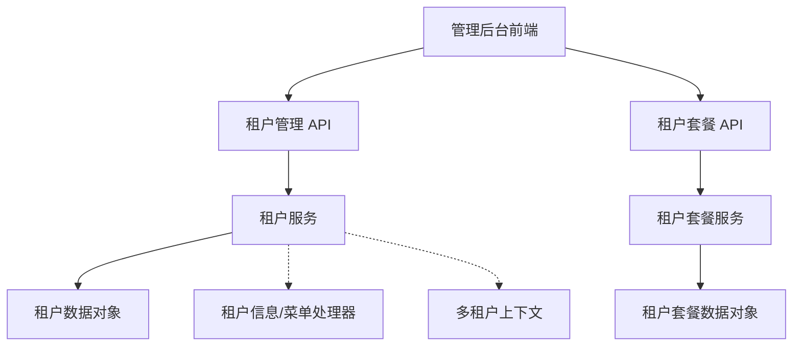
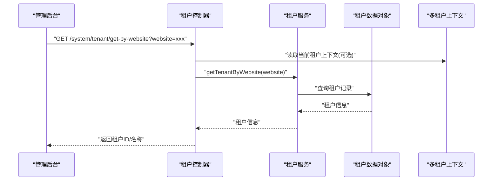
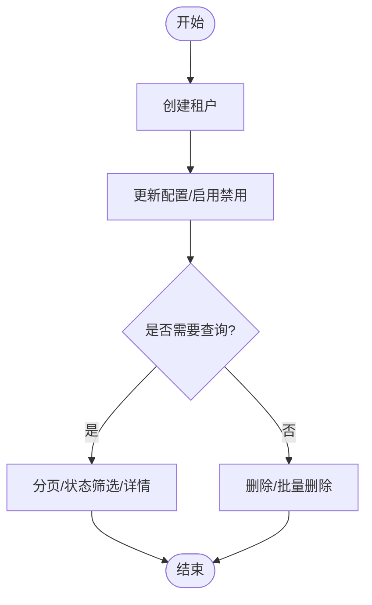
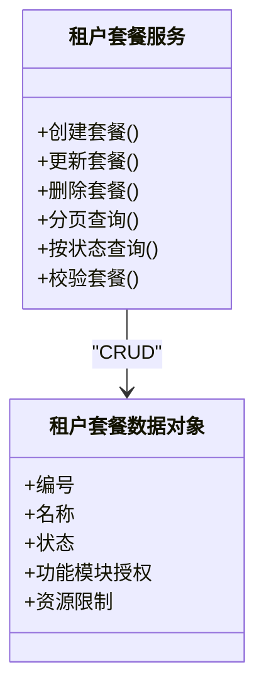
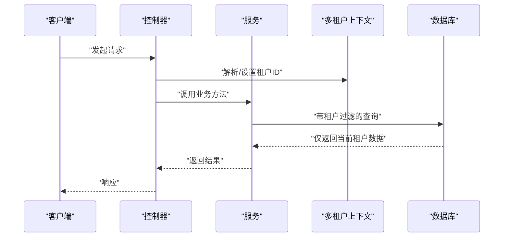
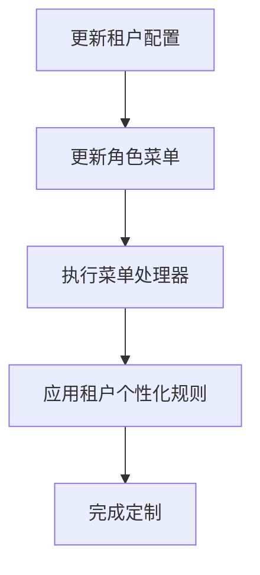
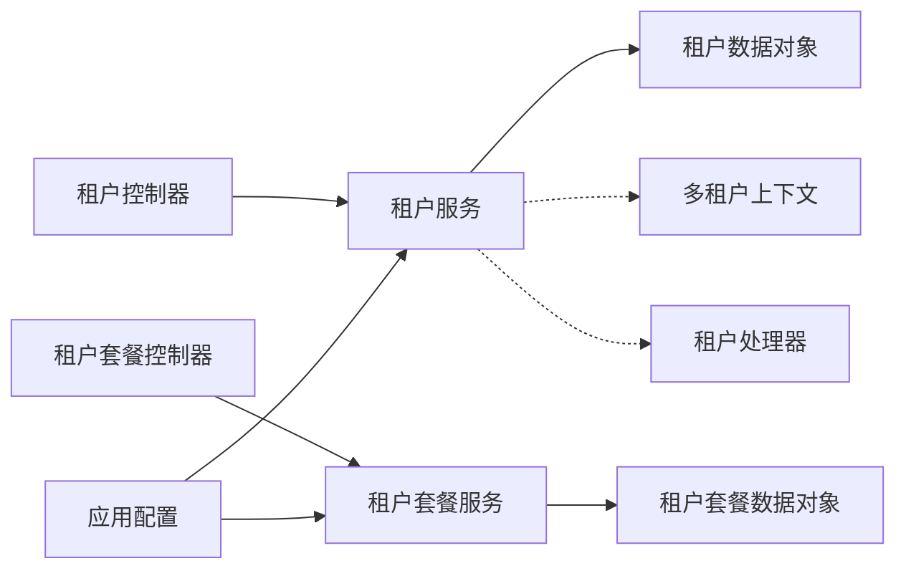

# 多租户管理界面

<cite>
**本文引用的文件**
- [TenantController.java](file://yudao-cloud/yudao-module-system/yudao-module-system-server/src/main/java/cn/iocoder/yudao/module/system/controller/admin/tenant/TenantController.java)
- [TenantPackageController.java](file://yudao-cloud/yudao-module-system/yudao-module-system-server/src/main/java/cn/iocoder/yudao/module/system/controller/admin/tenant/TenantPackageController.java)
- [TenantService.java](file://yudao-cloud/yudao-module-system/yudao-module-system-server/src/main/java/cn/iocoder/yudao/module/system/service/tenant/TenantService.java)
- [TenantPackageService.java](file://yudao-cloud/yudao-module-system/yudao-module-system-server/src/main/java/cn/iocoder/yudao/module/system/service/tenant/TenantPackageService.java)
- [TenantServiceImpl.java](file://yudao-cloud/yudao-module-system/yudao-module-system-server/src/main/java/cn/iocoder/yudao/module/system/service/tenant/TenantServiceImpl.java)
- [TenantPackageServiceImpl.java](file://yudao-cloud/yudao-module-system/yudao-module-system-server/src/main/java/cn/iocoder/yudao/module/system/service/tenant/TenantPackageServiceImpl.java)
- [TenantDO.java](file://yudao-cloud/yudao-module-system/yudao-module-system-server/src/main/java/cn/iocoder/yudao/module/system/dal/dataobject/tenant/TenantDO.java)
- [TenantPackageDO.java](file://yudao-cloud/yudao-module-system/yudao-module-system-server/src/main/java/cn/iocoder/yudao/module/system/dal/dataobject/tenant/TenantPackageDO.java)
- [TenantInfoHandler.java](file://yudao-cloud/yudao-module-system/yudao-module-system-server/src/main/java/cn/iocoder/yudao/module/system/service/tenant/handler/TenantInfoHandler.java)
- [TenantMenuHandler.java](file://yudao-cloud/yudao-module-system/yudao-module-system-server/src/main/java/cn/iocoder/yudao/module/system/service/tenant/handler/TenantMenuHandler.java)
- [application.yaml](file://yudao-cloud/yudao-module-system/yudao-module-system-server/src/main/resources/application.yaml)
- [application-dev.yaml](file://yudao-cloud/yudao-module-system/yudao-module-system-server/src/main/resources/application-dev.yaml)
- [application-local.yaml](file://yudao-cloud/yudao-module-system/yudao-module-system-server/src/main/resources/application-local.yaml)
- [TenantContextHolder.java](file://yudao-framework/yudao-spring-boot-starter-biz-tenant/src/main/java/cn/iocoder/yudao/framework/tenant/core/context/TenantContextHolder.java)
- [TenantIgnore.java](file://yudao-framework/yudao-spring-boot-starter-biz-tenant/src/main/java/cn/iocoder/yudao/framework/tenant/core/aop/TenantIgnore.java)
</cite>

## 目录
1. [简介](#简介)
2. [项目结构](#项目结构)
3. [核心组件](#核心组件)
4. [架构总览](#架构总览)
5. [详细组件分析](#详细组件分析)
6. [依赖关系分析](#依赖关系分析)
7. [性能考虑](#性能考虑)
8. [故障排查指南](#故障排查指南)
9. [结论](#结论)
10. [附录](#附录)

## 简介
本文件面向“多租户管理界面”的运维与产品人员，系统化说明租户生命周期管理（注册、配置、启用/禁用、删除）、租户套餐管理（定义、功能模块授权、资源限制）、租户数据隔离与共享机制、租户级配置与个性化定制、监控指标与容量规划建议，以及服务故障隔离与灾难恢复方案。文档基于系统模块中的租户控制器与服务实现进行梳理，并结合框架提供的多租户能力进行解释。

## 项目结构
多租户管理能力集中在系统模块中：
- 管理端控制器：提供租户与租户套餐的增删改查、分页、导出等接口。
- 服务层：封装租户与套餐的业务逻辑，包括状态管理、菜单权限关联、处理器扩展点等。
- 数据对象：租户与套餐的数据模型。
- 框架支撑：通过多租户上下文与注解，实现请求级租户识别与忽略控制。

图表来源
- [TenantController.java:35-138](file://yudao-cloud/yudao-module-system/yudao-module-system-server/src/main/java/cn/iocoder/yudao/module/system/controller/admin/tenant/TenantController.java#L35-L138)
- [TenantPackageController.java:26-90](file://yudao-cloud/yudao-module-system/yudao-module-system-server/src/main/java/cn/iocoder/yudao/module/system/controller/admin/tenant/TenantPackageController.java#L26-L90)
- [TenantService.java:20-146](file://yudao-cloud/yudao-module-system/yudao-module-system-server/src/main/java/cn/iocoder/yudao/module/system/service/tenant/TenantService.java#L20-L146)
- [TenantPackageService.java:16-80](file://yudao-cloud/yudao-module-system/yudao-module-system-server/src/main/java/cn/iocoder/yudao/module/system/service/tenant/TenantPackageService.java#L16-L80)

章节来源
- [TenantController.java:35-138](file://yudao-cloud/yudao-module-system/yudao-module-system-server/src/main/java/cn/iocoder/yudao/module/system/controller/admin/tenant/TenantController.java#L35-L138)
- [TenantPackageController.java:26-90](file://yudao-cloud/yudao-module-system/yudao-module-system-server/src/main/java/cn/iocoder/yudao/module/system/controller/admin/tenant/TenantPackageController.java#L26-L90)

## 核心组件
- 租户管理接口
  - 创建、更新、删除、批量删除、分页查询、详情查询、按名称或域名获取、精简列表、Excel导出。
  - 部分接口标注“忽略租户”，用于登录前根据域名或租户名解析租户ID。
- 租户套餐管理接口
  - 创建、更新、删除、批量删除、分页查询、详情查询、开启状态的精简列表。
- 服务层能力
  - 租户状态管理、角色菜单关联、按套餐统计与查询、按状态过滤、处理器扩展点（信息处理、菜单处理）。
  - 套餐校验、按状态查询等。
- 数据模型
  - 租户与套餐实体对象，承载基础信息与状态字段。
- 框架能力
  - 多租户上下文：在请求上下文中维护当前租户标识。
  - 租户忽略注解：对特定接口跳过租户过滤，便于全局解析。

章节来源
- [TenantController.java:44-138](file://yudao-cloud/yudao-module-system/yudao-module-system-server/src/main/java/cn/iocoder/yudao/module/system/controller/admin/tenant/TenantController.java#L44-L138)
- [TenantPackageController.java:35-90](file://yudao-cloud/yudao-module-system/yudao-module-system-server/src/main/java/cn/iocoder/yudao/module/system/controller/admin/tenant/TenantPackageController.java#L35-L90)
- [TenantService.java:20-146](file://yudao-cloud/yudao-module-system/yudao-module-system-server/src/main/java/cn/iocoder/yudao/module/system/service/tenant/TenantService.java#L20-L146)
- [TenantPackageService.java:16-80](file://yudao-cloud/yudao-module-system/yudao-module-system-server/src/main/java/cn/iocoder/yudao/module/system/service/tenant/TenantPackageService.java#L16-L80)
- [TenantDO.java](file://yudao-cloud/yudao-module-system/yudao-module-system-server/src/main/java/cn/iocoder/yudao/module/system/dal/dataobject/tenant/TenantDO.java)
- [TenantPackageDO.java](file://yudao-cloud/yudao-module-system/yudao-module-system-server/src/main/java/cn/iocoder/yudao/module/system/dal/dataobject/tenant/TenantPackageDO.java)
- [TenantContextHolder.java](file://yudao-framework/yudao-spring-boot-starter-biz-tenant/src/main/java/cn/iocoder/yudao/framework/tenant/core/context/TenantContextHolder.java)
- [TenantIgnore.java](file://yudao-framework/yudao-spring-boot-starter-biz-tenant/src/main/java/cn/iocoder/yudao/framework/tenant/core/aop/TenantIgnore.java)

## 架构总览
多租户管理采用“控制器-服务-数据对象”的分层结构，结合框架的多租户上下文与处理器扩展点，形成可插拔的租户能力。

图表来源
- [TenantController.java:64-76](file://yudao-cloud/yudao-module-system/yudao-module-system-server/src/main/java/cn/iocoder/yudao/module/system/controller/admin/tenant/TenantController.java#L64-L76)
- [TenantService.java:83-89](file://yudao-cloud/yudao-module-system/yudao-module-system-server/src/main/java/cn/iocoder/yudao/module/system/service/tenant/TenantService.java#L83-L89)
- [TenantDO.java](file://yudao-cloud/yudao-module-system/yudao-module-system-server/src/main/java/cn/iocoder/yudao/module/system/dal/dataobject/tenant/TenantDO.java)
- [TenantContextHolder.java](file://yudao-framework/yudao-spring-boot-starter-biz-tenant/src/main/java/cn/iocoder/yudao/framework/tenant/core/context/TenantContextHolder.java)

## 详细组件分析

### 租户生命周期管理
- 注册与创建
  - 通过创建接口完成租户初始化，包含基本信息与状态设置。
- 配置与启用/禁用
  - 更新接口支持修改租户配置；状态字段用于启用/禁用控制。
  - 查询接口支持按状态筛选，便于展示已启用的租户列表。
- 删除
  - 支持单条与批量删除，确保清理相关数据与权限。
- 登录前租户识别
  - 提供按名称获取ID、按域名获取租户信息的接口，并标注忽略租户过滤，用于登录阶段快速定位租户。

图表来源
- [TenantController.java:78-138](file://yudao-cloud/yudao-module-system/yudao-module-system-server/src/main/java/cn/iocoder/yudao/module/system/controller/admin/tenant/TenantController.java#L78-L138)
- [TenantService.java:22-113](file://yudao-cloud/yudao-module-system/yudao-module-system-server/src/main/java/cn/iocoder/yudao/module/system/service/tenant/TenantService.java#L22-L113)

章节来源
- [TenantController.java:44-138](file://yudao-cloud/yudao-module-system/yudao-module-system-server/src/main/java/cn/iocoder/yudao/module/system/controller/admin/tenant/TenantController.java#L44-L138)
- [TenantService.java:22-113](file://yudao-cloud/yudao-module-system/yudao-module-system-server/src/main/java/cn/iocoder/yudao/module/system/service/tenant/TenantService.java#L22-L113)

### 租户套餐管理
- 套餐定义
  - 通过创建/更新接口定义套餐，包含功能模块授权与资源限制等配置项。
- 授权与限制
  - 套餐作为租户的能力模板，可被多个租户复用；支持按状态筛选可用套餐。
- 管理与查询
  - 提供分页、详情、精简列表等接口，便于前端下拉选择与展示。

图表来源
- [TenantPackageController.java:35-90](file://yudao-cloud/yudao-module-system/yudao-module-system-server/src/main/java/cn/iocoder/yudao/module/system/controller/admin/tenant/TenantPackageController.java#L35-L90)
- [TenantPackageService.java:16-80](file://yudao-cloud/yudao-module-system/yudao-module-system-server/src/main/java/cn/iocoder/yudao/module/system/service/tenant/TenantPackageService.java#L16-L80)
- [TenantPackageDO.java](file://yudao-cloud/yudao-module-system/yudao-module-system-server/src/main/java/cn/iocoder/yudao/module/system/dal/dataobject/tenant/TenantPackageDO.java)

章节来源
- [TenantPackageController.java:35-90](file://yudao-cloud/yudao-module-system/yudao-module-system-server/src/main/java/cn/iocoder/yudao/module/system/controller/admin/tenant/TenantPackageController.java#L35-L90)
- [TenantPackageService.java:16-80](file://yudao-cloud/yudao-module-system/yudao-module-system-server/src/main/java/cn/iocoder/yudao/module/system/service/tenant/TenantPackageService.java#L16-L80)

### 租户数据隔离与共享
- 数据隔离
  - 通过多租户上下文在请求级别注入租户标识，配合框架能力对数据访问进行自动过滤，实现租户间数据隔离。
- 共享数据
  - 对于需要跨租户共享的配置或字典数据，可通过忽略租户过滤的接口或专用表进行统一管理。
- 处理器扩展
  - 提供租户信息与菜单处理的扩展点，可在业务层实现更细粒度的隔离策略与个性化加载。

图表来源
- [TenantService.java:115-129](file://yudao-cloud/yudao-module-system/yudao-module-system-server/src/main/java/cn/iocoder/yudao/module/system/service/tenant/TenantService.java#L115-L129)
- [TenantContextHolder.java](file://yudao-framework/yudao-spring-boot-starter-biz-tenant/src/main/java/cn/iocoder/yudao/framework/tenant/core/context/TenantContextHolder.java)
- [TenantIgnore.java](file://yudao-framework/yudao-spring-boot-starter-biz-tenant/src/main/java/cn/iocoder/yudao/framework/tenant/core/aop/TenantIgnore.java)

章节来源
- [TenantService.java:115-129](file://yudao-cloud/yudao-module-system/yudao-module-system-server/src/main/java/cn/iocoder/yudao/module/system/service/tenant/TenantService.java#L115-L129)
- [TenantInfoHandler.java](file://yudao-cloud/yudao-module-system/yudao-module-system-server/src/main/java/cn/iocoder/yudao/module/system/service/tenant/handler/TenantInfoHandler.java)
- [TenantMenuHandler.java](file://yudao-cloud/yudao-module-system/yudao-module-system-server/src/main/java/cn/iocoder/yudao/module/system/service/tenant/handler/TenantMenuHandler.java)

### 租户级配置与个性化定制
- 配置入口
  - 通过租户更新接口调整租户级配置，如域名、联系人、状态等。
- 菜单与权限
  - 通过服务层的菜单处理器与角色菜单关联接口，为不同租户定制可见菜单与权限范围。
- 扩展点
  - 使用信息处理器与菜单处理器，实现租户级别的特性开关、主题、语言等个性化定制。

图表来源
- [TenantController.java:85-118](file://yudao-cloud/yudao-module-system/yudao-module-system-server/src/main/java/cn/iocoder/yudao/module/system/controller/admin/tenant/TenantController.java#L85-L118)
- [TenantService.java:37-43](file://yudao-cloud/yudao-module-system/yudao-module-system-server/src/main/java/cn/iocoder/yudao/module/system/service/tenant/TenantService.java#L37-L43)
- [TenantInfoHandler.java](file://yudao-cloud/yudao-module-system/yudao-module-system-server/src/main/java/cn/iocoder/yudao/module/system/service/tenant/handler/TenantInfoHandler.java)
- [TenantMenuHandler.java](file://yudao-cloud/yudao-module-system/yudao-module-system-server/src/main/java/cn/iocoder/yudao/module/system/service/tenant/handler/TenantMenuHandler.java)

章节来源
- [TenantController.java:85-118](file://yudao-cloud/yudao-module-system/yudao-module-system-server/src/main/java/cn/iocoder/yudao/module/system/controller/admin/tenant/TenantController.java#L85-L118)
- [TenantService.java:37-43](file://yudao-cloud/yudao-module-system/yudao-module-system-server/src/main/java/cn/iocoder/yudao/module/system/service/tenant/TenantService.java#L37-L43)

### 监控指标与容量规划
- 监控指标建议
  - 租户数量与活跃租户数、套餐使用分布、登录成功率与失败原因、接口耗时与错误率、数据库连接池使用率与慢查询。
- 容量规划建议
  - 按租户规模划分套餐等级，评估CPU/内存/存储/带宽峰值；建立扩容阈值与自动化扩缩容策略；对热点租户实施限流与降级。
- 观测与告警
  - 接入日志与链路追踪，设置关键指标告警；定期生成租户健康报告。

[本节为通用指导，不直接分析具体文件]

### 故障隔离与灾难恢复
- 故障隔离
  - 利用租户上下文与忽略注解，将异常控制在租户范围内；对高负载租户实施熔断与限流。
- 备份与恢复
  - 定期备份租户数据与配置；制定回滚策略与演练计划；对关键操作增加审计日志。
- 恢复流程
  - 发现异常后快速定位租户与套餐；必要时切换至备用环境或只读模式；验证数据一致性后恢复服务。

[本节为通用指导，不直接分析具体文件]

## 依赖关系分析
- 控制器依赖服务层，服务层依赖数据对象与框架多租户能力。
- 处理器扩展点解耦了租户信息与菜单处理的实现细节。
- 配置文件提供运行期参数与环境差异。

图表来源
- [TenantController.java:35-138](file://yudao-cloud/yudao-module-system/yudao-module-system-server/src/main/java/cn/iocoder/yudao/module/system/controller/admin/tenant/TenantController.java#L35-L138)
- [TenantPackageController.java:26-90](file://yudao-cloud/yudao-module-system/yudao-module-system-server/src/main/java/cn/iocoder/yudao/module/system/controller/admin/tenant/TenantPackageController.java#L26-L90)
- [TenantService.java:20-146](file://yudao-cloud/yudao-module-system/yudao-module-system-server/src/main/java/cn/iocoder/yudao/module/system/service/tenant/TenantService.java#L20-L146)
- [TenantPackageService.java:16-80](file://yudao-cloud/yudao-module-system/yudao-module-system-server/src/main/java/cn/iocoder/yudao/module/system/service/tenant/TenantPackageService.java#L16-L80)
- [application.yaml](file://yudao-cloud/yudao-module-system/yudao-module-system-server/src/main/resources/application.yaml)
- [application-dev.yaml](file://yudao-cloud/yudao-module-system/yudao-module-system-server/src/main/resources/application-dev.yaml)
- [application-local.yaml](file://yudao-cloud/yudao-module-system/yudao-module-system-server/src/main/resources/application-local.yaml)

章节来源
- [TenantController.java:35-138](file://yudao-cloud/yudao-module-system/yudao-module-system-server/src/main/java/cn/iocoder/yudao/module/system/controller/admin/tenant/TenantController.java#L35-L138)
- [TenantPackageController.java:26-90](file://yudao-cloud/yudao-module-system/yudao-module-system-server/src/main/java/cn/iocoder/yudao/module/system/controller/admin/tenant/TenantPackageController.java#L26-L90)
- [application.yaml](file://yudao-cloud/yudao-module-system/yudao-module-system-server/src/main/resources/application.yaml)

## 性能考虑
- 分页与导出
  - 分页查询避免全量拉取；导出时关闭分页以获取完整数据集，注意大文件传输与内存占用。
- 缓存与索引
  - 对高频查询字段建立索引；对静态配置与字典数据进行缓存，减少数据库压力。
- 并发与限流
  - 对登录解析与热门接口实施限流；合理设置线程池与连接池大小。
- 监控与优化
  - 关注慢查询与热点接口；定期分析日志与指标，持续优化。

[本节为通用指导，不直接分析具体文件]

## 故障排查指南
- 常见问题
  - 租户无法识别：检查域名解析与忽略租户注解的使用是否正确。
  - 数据越界：确认多租户上下文是否在当前请求中正确设置。
  - 套餐未生效：核对套餐状态与租户关联关系。
- 定位步骤
  - 查看接口日志与错误码；检查数据库记录与索引；验证配置项与权限。
- 恢复措施
  - 回滚变更、修复数据、重启服务；必要时切换到只读模式保障稳定性。

章节来源
- [TenantController.java:44-76](file://yudao-cloud/yudao-module-system/yudao-module-system-server/src/main/java/cn/iocoder/yudao/module/system/controller/admin/tenant/TenantController.java#L44-L76)
- [TenantService.java:115-129](file://yudao-cloud/yudao-module-system/yudao-module-system-server/src/main/java/cn/iocoder/yudao/module/system/service/tenant/TenantService.java#L115-L129)

## 结论
本多租户管理界面通过清晰的控制器与服务分层、完善的套餐管理与处理器扩展点，实现了租户的全生命周期管理与个性化定制。结合框架的多租户能力，提供了可靠的数据隔离与灵活的配置机制。建议在上线前后完善监控与容量规划，确保系统的稳定与可扩展性。

## 附录
- 常用接口路径
  - 租户：/system/tenant/*
  - 租户套餐：/system/tenant-package/*
- 关键注解与上下文
  - 忽略租户：@TenantIgnore
  - 租户上下文：TenantContextHolder

[本节为补充信息，不直接分析具体文件]