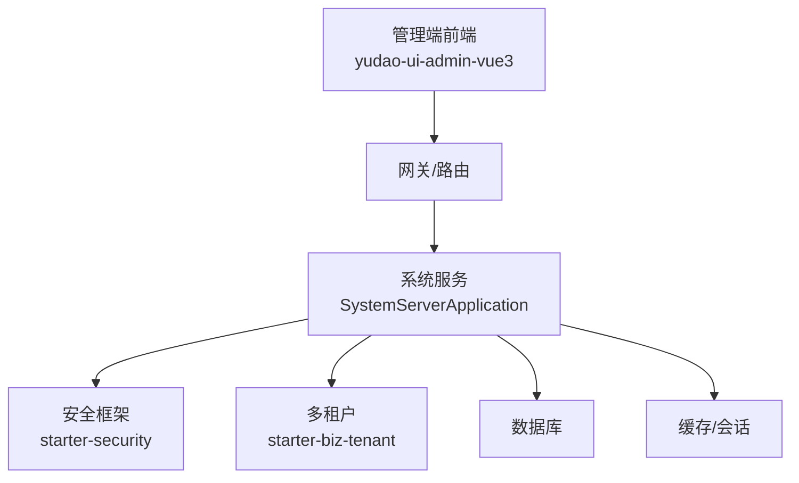
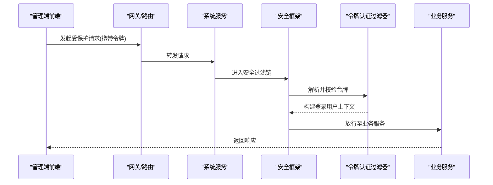
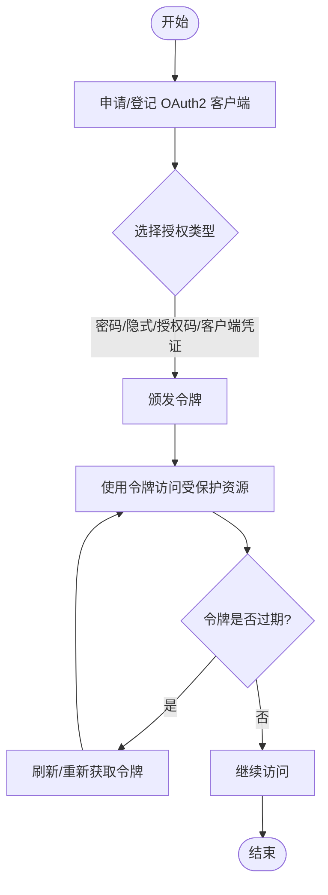
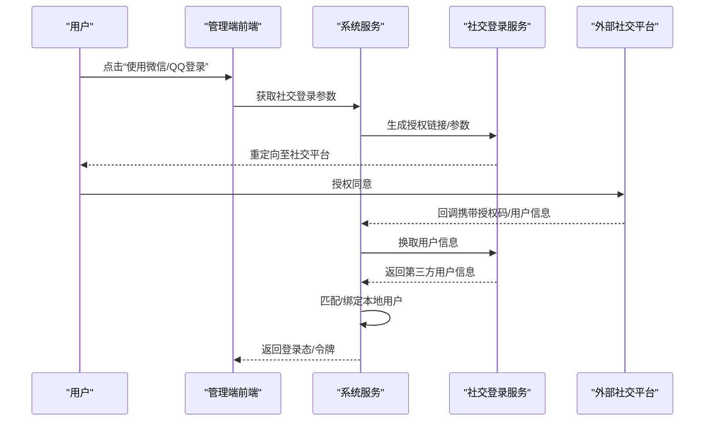
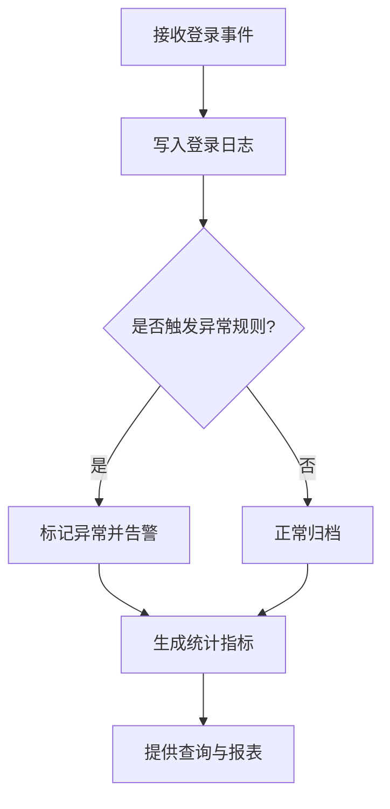
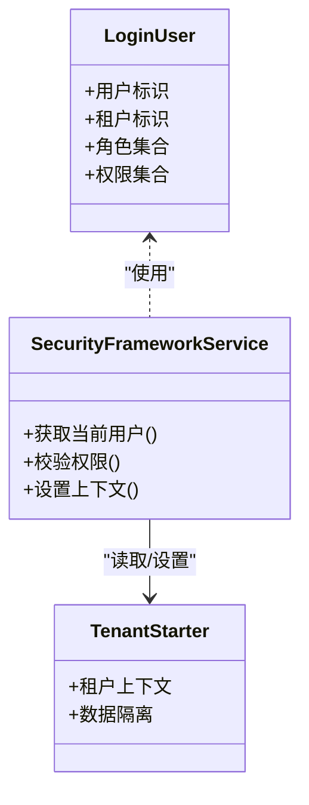
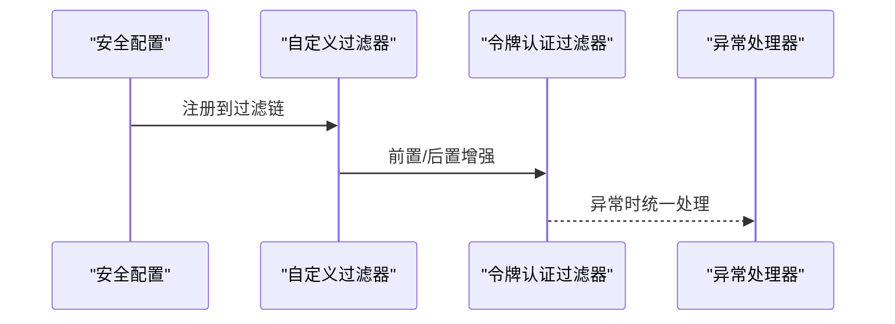
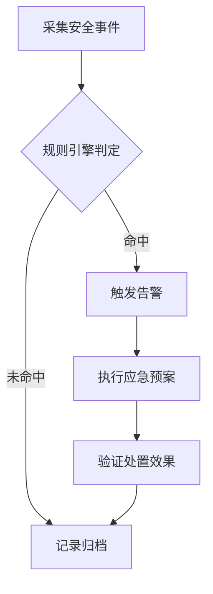
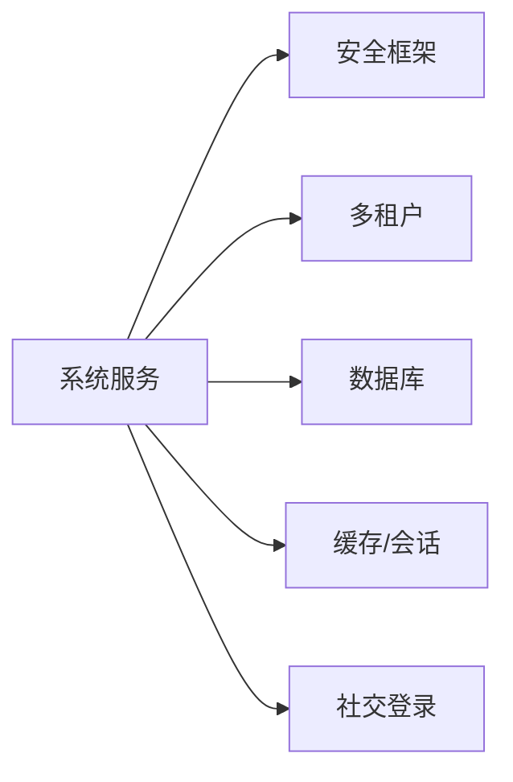

# 安全认证管理界面

<cite>
**本文引用的文件**
- [yudao-module-system-api/.../oauth2/OAuth2ClientConstants.java](file://yudao-cloud/yudao-module-system/yudao-module-system-api/src/main/java/cn/iocoder/yudao/module/system/enums/oauth2/OAuth2ClientConstants.java)
- [yudao-module-system-api/.../oauth2/OAuth2GrantTypeEnum.java](file://yudao-cloud/yudao-module-system/yudao-module-system-api/src/main/java/cn/iocoder/yudao/module/system/enums/oauth2/OAuth2GrantTypeEnum.java)
- [yudao-module-system-api/.../social/SocialTypeEnum.java](file://yudao-cloud/yudao-module-system/yudao-module-system-api/src/main/java/cn/iocoder/yudao/module/system/enums/social/SocialTypeEnum.java)
- [yudao-module-system-api/.../logger/LoginLogTypeEnum.java](file://yudao-cloud/yudao-module-system/yudao-module-system-api/src/main/java/cn/iocoder/yudao/module/system/enums/logger/LoginLogTypeEnum.java)
- [yudao-module-system-api/.../logger/LoginResultEnum.java](file://yudao-cloud/yudao-module-system/yudao-module-system-api/src/main/java/cn/iocoder/yudao/module/system/enums/logger/LoginResultEnum.java)
- [yudao-framework-security/YudaoSecurityAutoConfiguration.java](file://yudao-cloud/yudao-framework/yudao-spring-boot-starter-security/src/main/java/cn/iocoder/yudao/framework/security/config/YudaoSecurityAutoConfiguration.java)
- [yudao-framework-security/YudaoWebSecurityConfigurerAdapter.java](file://yudao-cloud/yudao-framework/yudao-spring-boot-starter-security/src/main/java/cn/iocoder/yudao/framework/security/config/YudaoWebSecurityConfigurerAdapter.java)
- [yudao-framework-security/TokenAuthenticationFilter.java](file://yudao-cloud/yudao-framework/yudao-spring-boot-starter-security/src/main/java/cn/iocoder/yudao/framework/security/core/filter/TokenAuthenticationFilter.java)
- [yudao-framework-security/SecurityFrameworkServiceImpl.java](file://yudao-cloud/yudao-framework/yudao-spring-boot-starter-security/src/main/java/cn/iocoder/yudao/framework/security/core/service/SecurityFrameworkServiceImpl.java)
- [yudao-framework-security/LoginUser.java](file://yudao-cloud/yudao-framework/yudao-spring-boot-starter-security/src/main/java/cn/iocoder/yudao/framework/security/core/LoginUser.java)
- [yudao-framework-tenant/多租户启动器](file://yudao-cloud/yudao-framework/yudao-spring-boot-starter-biz-tenant/pom.xml)
- [yudao-module-system-server/SystemServerApplication.java](file://yudao-cloud/yudao-module-system/yudao-module-system-server/src/main/java/cn/iocoder/yudao/module/system/SystemServerApplication.java)
</cite>

## 目录
1. [简介](#简介)
2. [项目结构](#项目结构)
3. [核心组件](#核心组件)
4. [架构总览](#架构总览)
5. [详细组件分析](#详细组件分析)
6. [依赖关系分析](#依赖关系分析)
7. [性能考虑](#性能考虑)
8. [故障排查指南](#故障排查指南)
9. [结论](#结论)
10. [附录](#附录)

## 简介
本文件面向“安全认证管理界面”的运维与二次开发，围绕以下目标展开：
- OAuth2 客户端管理：应用注册、权限配置、令牌生命周期管理。
- 第三方社交登录：微信、QQ 等平台的接入流程与用户绑定管理。
- 登录日志分析：登录记录查询、异常登录检测、登录统计。
- 多租户安全隔离与访问控制策略。
- 安全认证扩展开发与自定义认证流程。
- 安全事件监控告警与应急响应方案。

## 项目结构
本项目采用微服务模块化架构，安全能力由框架层 starter 提供，业务侧通过 system 模块暴露统一 API；前端位于 yudao-ui-admin-vue3。与安全相关的关键位置如下：
- 框架安全能力：yudao-spring-boot-starter-security（自动装配、过滤器、上下文、处理器）。
- 系统模块：yudao-module-system（OAuth2、社交登录、日志枚举、权限等）。
- 多租户：yudao-spring-boot-starter-biz-tenant（租户上下文与数据隔离）。
- 应用入口：yudao-module-system-server/SystemServerApplication。

图表来源
- [SystemServerApplication.java](file://yudao-cloud/yudao-module-system/yudao-module-system-server/src/main/java/cn/iocoder/yudao/module/system/SystemServerApplication.java)
- [YudaoSecurityAutoConfiguration.java](file://yudao-cloud/yudao-framework/yudao-spring-boot-starter-security/src/main/java/cn/iocoder/yudao/framework/security/config/YudaoSecurityAutoConfiguration.java)
- [yudao-framework-tenant/多租户启动器](file://yudao-cloud/yudao-framework/yudao-spring-boot-starter-biz-tenant/pom.xml)

章节来源
- [SystemServerApplication.java](file://yudao-cloud/yudao-module-system/yudao-module-system-server/src/main/java/cn/iocoder/yudao/module/system/SystemServerApplication.java)

## 核心组件
- 安全自动装配与 Web 安全配置：负责全局安全策略、拦截器链、异常处理与鉴权入口。
- 令牌认证过滤器：解析请求中的令牌并建立当前登录用户上下文。
- 登录用户上下文：封装当前用户、租户、权限等信息，贯穿调用链。
- OAuth2 常量与授权类型：定义客户端管理与授权模式。
- 社交登录类型：定义第三方平台接入标识。
- 登录日志类型与结果：用于记录登录行为与结果状态。

章节来源
- [YudaoSecurityAutoConfiguration.java](file://yudao-cloud/yudao-framework/yudao-spring-boot-starter-security/src/main/java/cn/iocoder/yudao/framework/security/config/YudaoSecurityAutoConfiguration.java)
- [YudaoWebSecurityConfigurerAdapter.java](file://yudao-cloud/yudao-framework/yudao-spring-boot-starter-security/src/main/java/cn/iocoder/yudao/framework/security/config/YudaoWebSecurityConfigurerAdapter.java)
- [TokenAuthenticationFilter.java](file://yudao-cloud/yudao-framework/yudao-spring-boot-starter-security/src/main/java/cn/iocoder/yudao/framework/security/core/filter/TokenAuthenticationFilter.java)
- [SecurityFrameworkServiceImpl.java](file://yudao-cloud/yudao-framework/yudao-spring-boot-starter-security/src/main/java/cn/iocoder/yudao/framework/security/core/service/SecurityFrameworkServiceImpl.java)
- [LoginUser.java](file://yudao-cloud/yudao-framework/yudao-spring-boot-starter-security/src/main/java/cn/iocoder/yudao/framework/security/core/LoginUser.java)
- [OAuth2ClientConstants.java](file://yudao-cloud/yudao-module-system/yudao-module-system-api/src/main/java/cn/iocoder/yudao/module/system/enums/oauth2/OAuth2ClientConstants.java)
- [OAuth2GrantTypeEnum.java](file://yudao-cloud/yudao-module-system/yudao-module-system-api/src/main/java/cn/iocoder/yudao/module/system/enums/oauth2/OAuth2GrantTypeEnum.java)
- [SocialTypeEnum.java](file://yudao-cloud/yudao-module-system/yudao-module-system-api/src/main/java/cn/iocoder/yudao/module/system/enums/social/SocialTypeEnum.java)
- [LoginLogTypeEnum.java](file://yudao-cloud/yudao-module-system/yudao-module-system-api/src/main/java/cn/iocoder/yudao/module/system/enums/logger/LoginLogTypeEnum.java)
- [LoginResultEnum.java](file://yudao-cloud/yudao-module-system/yudao-module-system-api/src/main/java/cn/iocoder/yudao/module/system/enums/logger/LoginResultEnum.java)

## 架构总览
下图展示一次受保护接口调用的安全链路：前端携带令牌访问系统服务，安全框架进行令牌校验、构建登录用户上下文，再进入业务逻辑。

图表来源
- [YudaoWebSecurityConfigurerAdapter.java](file://yudao-cloud/yudao-framework/yudao-spring-boot-starter-security/src/main/java/cn/iocoder/yudao/framework/security/config/YudaoWebSecurityConfigurerAdapter.java)
- [TokenAuthenticationFilter.java](file://yudao-cloud/yudao-framework/yudao-spring-boot-starter-security/src/main/java/cn/iocoder/yudao/framework/security/core/filter/TokenAuthenticationFilter.java)
- [SecurityFrameworkServiceImpl.java](file://yudao-cloud/yudao-framework/yudao-spring-boot-starter-security/src/main/java/cn/iocoder/yudao/framework/security/core/service/SecurityFrameworkServiceImpl.java)

## 详细组件分析

### OAuth2 客户端管理（应用注册、权限配置、令牌管理）
- 应用注册：通过系统模块提供的 OAuth2 客户端配置项进行应用登记，包含客户端标识、密钥、回调地址、授权类型等。
- 权限配置：结合角色与数据权限，将资源与权限点映射到客户端或用户角色，实现细粒度访问控制。
- 令牌管理：基于授权类型发放访问令牌与刷新令牌，支持令牌过期、吊销与续期。

图表来源
- [OAuth2ClientConstants.java](file://yudao-cloud/yudao-module-system/yudao-module-system-api/src/main/java/cn/iocoder/yudao/module/system/enums/oauth2/OAuth2ClientConstants.java)
- [OAuth2GrantTypeEnum.java](file://yudao-cloud/yudao-module-system/yudao-module-system-api/src/main/java/cn/iocoder/yudao/module/system/enums/oauth2/OAuth2GrantTypeEnum.java)

章节来源
- [OAuth2ClientConstants.java](file://yudao-cloud/yudao-module-system/yudao-module-system-api/src/main/java/cn/iocoder/yudao/module/system/enums/oauth2/OAuth2ClientConstants.java)
- [OAuth2GrantTypeEnum.java](file://yudao-cloud/yudao-module-system/yudao-module-system-api/src/main/java/cn/iocoder/yudao/module/system/enums/oauth2/OAuth2GrantTypeEnum.java)

### 第三方社交登录（微信、QQ 等）与用户绑定管理
- 平台接入：通过社交类型枚举统一管理各平台标识，便于扩展新平台。
- 登录流程：前端跳转至社交平台授权，服务端回调后换取用户信息并创建或关联本地账户。
- 用户绑定：支持同一本地账号绑定多个第三方身份，或第三方身份与本地账号解绑。

图表来源
- [SocialTypeEnum.java](file://yudao-cloud/yudao-module-system/yudao-module-system-api/src/main/java/cn/iocoder/yudao/module/system/enums/social/SocialTypeEnum.java)

章节来源
- [SocialTypeEnum.java](file://yudao-cloud/yudao-module-system/yudao-module-system-api/src/main/java/cn/iocoder/yudao/module/system/enums/social/SocialTypeEnum.java)

### 登录日志分析（查询、异常检测、统计）
- 登录记录：记录登录来源、结果、时间、设备/IP 等关键信息，便于审计与回溯。
- 异常检测：基于失败次数、异地登录、非常用设备等维度识别异常登录。
- 登录统计：按时间、渠道、结果等维度聚合统计，辅助运营与安全决策。

图表来源
- [LoginLogTypeEnum.java](file://yudao-cloud/yudao-module-system/yudao-module-system-api/src/main/java/cn/iocoder/yudao/module/system/enums/logger/LoginLogTypeEnum.java)
- [LoginResultEnum.java](file://yudao-cloud/yudao-module-system/yudao-module-system-api/src/main/java/cn/iocoder/yudao/module/system/enums/logger/LoginResultEnum.java)

章节来源
- [LoginLogTypeEnum.java](file://yudao-cloud/yudao-module-system/yudao-module-system-api/src/main/java/cn/iocoder/yudao/module/system/enums/logger/LoginLogTypeEnum.java)
- [LoginResultEnum.java](file://yudao-cloud/yudao-module-system/yudao-module-system-api/src/main/java/cn/iocoder/yudao/module/system/enums/logger/LoginResultEnum.java)

### 多租户安全隔离机制与访问控制策略
- 租户隔离：通过多租户 starter 在请求上下文中注入租户标识，确保数据与配置按租户隔离。
- 访问控制：结合角色、权限点与数据范围，实现接口级与数据级双重控制。
- 安全上下文：登录用户上下文携带租户、角色、权限等信息，贯穿服务调用链。

图表来源
- [LoginUser.java](file://yudao-cloud/yudao-framework/yudao-spring-boot-starter-security/src/main/java/cn/iocoder/yudao/framework/security/core/LoginUser.java)
- [SecurityFrameworkServiceImpl.java](file://yudao-cloud/yudao-framework/yudao-spring-boot-starter-security/src/main/java/cn/iocoder/yudao/framework/security/core/service/SecurityFrameworkServiceImpl.java)
- [yudao-framework-tenant/多租户启动器](file://yudao-cloud/yudao-framework/yudao-spring-boot-starter-biz-tenant/pom.xml)

章节来源
- [LoginUser.java](file://yudao-cloud/yudao-framework/yudao-spring-boot-starter-security/src/main/java/cn/iocoder/yudao/framework/security/core/LoginUser.java)
- [SecurityFrameworkServiceImpl.java](file://yudao-cloud/yudao-framework/yudao-spring-boot-starter-security/src/main/java/cn/iocoder/yudao/framework/security/core/service/SecurityFrameworkServiceImpl.java)
- [yudao-framework-tenant/多租户启动器](file://yudao-cloud/yudao-framework/yudao-spring-boot-starter-biz-tenant/pom.xml)

### 安全认证扩展开发与自定义认证流程
- 扩展点：通过安全自动装配与 Web 安全配置，可插入自定义过滤器、处理器与策略。
- 自定义流程：在令牌认证过滤器前后增加自定义校验（如设备指纹、风控策略），或在登录成功后追加审计与通知。
- 最佳实践：保持无状态、幂等与最小权限原则，避免在过滤器中执行重型 I/O。

图表来源
- [YudaoSecurityAutoConfiguration.java](file://yudao-cloud/yudao-framework/yudao-spring-boot-starter-security/src/main/java/cn/iocoder/yudao/framework/security/config/YudaoSecurityAutoConfiguration.java)
- [YudaoWebSecurityConfigurerAdapter.java](file://yudao-cloud/yudao-framework/yudao-spring-boot-starter-security/src/main/java/cn/iocoder/yudao/framework/security/config/YudaoWebSecurityConfigurerAdapter.java)
- [TokenAuthenticationFilter.java](file://yudao-cloud/yudao-framework/yudao-spring-boot-starter-security/src/main/java/cn/iocoder/yudao/framework/security/core/filter/TokenAuthenticationFilter.java)

章节来源
- [YudaoSecurityAutoConfiguration.java](file://yudao-cloud/yudao-framework/yudao-spring-boot-starter-security/src/main/java/cn/iocoder/yudao/framework/security/config/YudaoSecurityAutoConfiguration.java)
- [YudaoWebSecurityConfigurerAdapter.java](file://yudao-cloud/yudao-framework/yudao-spring-boot-starter-security/src/main/java/cn/iocoder/yudao/framework/security/config/YudaoWebSecurityConfigurerAdapter.java)
- [TokenAuthenticationFilter.java](file://yudao-cloud/yudao-framework/yudao-spring-boot-starter-security/src/main/java/cn/iocoder/yudao/framework/security/core/filter/TokenAuthenticationFilter.java)

### 安全事件监控告警与应急响应
- 监控要点：登录失败率、异常 IP/设备、令牌滥用、跨租户越权尝试。
- 告警策略：阈值触发、趋势突变、黑名单命中即告警。
- 应急响应：快速封禁、强制下线、令牌批量吊销、限流降级。

[本节为概念性说明，不直接引用具体代码文件]

## 依赖关系分析
- 框架层依赖：安全 starter 提供自动装配、过滤器、上下文与处理器；多租户 starter 提供租户上下文与数据隔离。
- 业务层依赖：system 模块对外暴露 OAuth2、社交登录、日志等能力；server 模块作为应用入口加载上述能力。
- 外部依赖：社交平台、数据库、缓存等。

图表来源
- [SystemServerApplication.java](file://yudao-cloud/yudao-module-system/yudao-module-system-server/src/main/java/cn/iocoder/yudao/module/system/SystemServerApplication.java)
- [YudaoSecurityAutoConfiguration.java](file://yudao-cloud/yudao-framework/yudao-spring-boot-starter-security/src/main/java/cn/iocoder/yudao/framework/security/config/YudaoSecurityAutoConfiguration.java)
- [yudao-framework-tenant/多租户启动器](file://yudao-cloud/yudao-framework/yudao-spring-boot-starter-biz-tenant/pom.xml)

章节来源
- [SystemServerApplication.java](file://yudao-cloud/yudao-module-system/yudao-module-system-server/src/main/java/cn/iocoder/yudao/module/system/SystemServerApplication.java)

## 性能考虑
- 令牌校验：尽量在过滤器中完成轻量校验，避免重复计算；对热点路径引入缓存。
- 登录日志：异步落库或消息队列削峰，降低主链路延迟。
- 多租户：合理设计索引与查询条件，避免全表扫描；利用租户上下文缩小数据范围。
- 社交登录：对第三方回调做重试与超时控制，防止阻塞线程池。

[本节为通用指导，不直接引用具体代码文件]

## 故障排查指南
- 无法访问受保护接口：检查令牌是否正确传递、过滤器是否生效、权限是否覆盖。
- 登录失败频繁：查看登录日志类型与结果，定位失败原因（密码错误、账号锁定、验证码失败等）。
- 跨租户越权：确认租户上下文是否正确注入，数据权限是否限制到当前租户。
- 社交登录回调异常：核对回调地址、签名校验、用户信息映射与绑定逻辑。

章节来源
- [TokenAuthenticationFilter.java](file://yudao-cloud/yudao-framework/yudao-spring-boot-starter-security/src/main/java/cn/iocoder/yudao/framework/security/core/filter/TokenAuthenticationFilter.java)
- [LoginLogTypeEnum.java](file://yudao-cloud/yudao-module-system/yudao-module-system-api/src/main/java/cn/iocoder/yudao/module/system/enums/logger/LoginLogTypeEnum.java)
- [LoginResultEnum.java](file://yudao-cloud/yudao-module-system/yudao-module-system-api/src/main/java/cn/iocoder/yudao/module/system/enums/logger/LoginResultEnum.java)

## 结论
本方案以框架层安全能力为基础，结合系统模块的 OAuth2、社交登录与日志能力，构建了完整的安全认证管理体系。通过多租户隔离与访问控制，满足企业级安全需求；通过可扩展的过滤器与处理器，支持自定义认证流程与风控策略。建议在生产环境完善监控告警与应急预案，持续优化性能与稳定性。

[本节为总结性内容，不直接引用具体代码文件]

## 附录
- 术语
  - OAuth2：开放授权标准，用于第三方应用访问受保护资源。
  - 令牌：访问资源的凭据，通常包含有效期与权限范围。
  - 多租户：在同一实例中为不同租户提供数据与配置的逻辑隔离。
- 参考
  - 安全框架自动装配与配置类。
  - 系统模块 OAuth2、社交登录、日志枚举。
  - 多租户启动器与上下文。

[本节为补充说明，不直接引用具体代码文件]