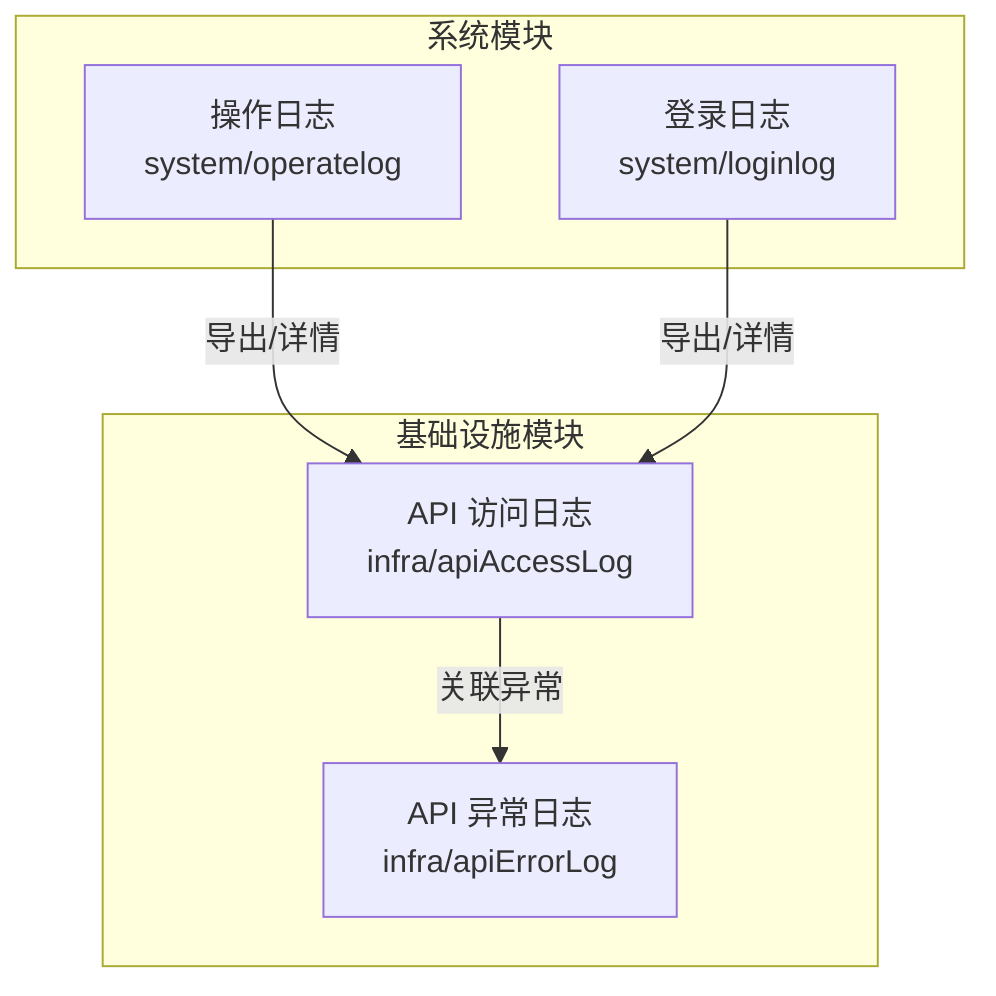
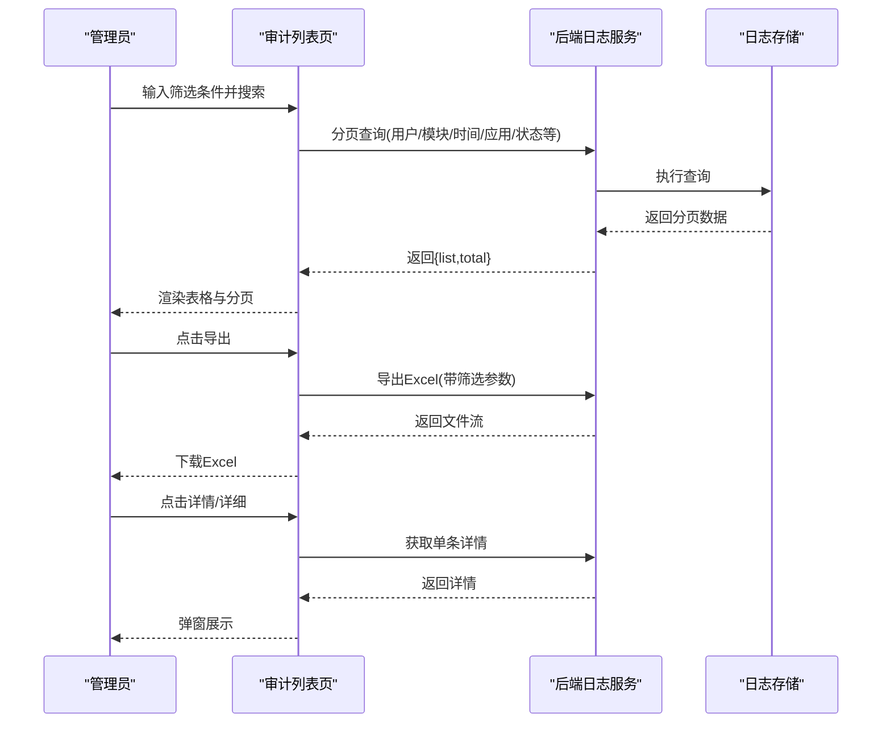
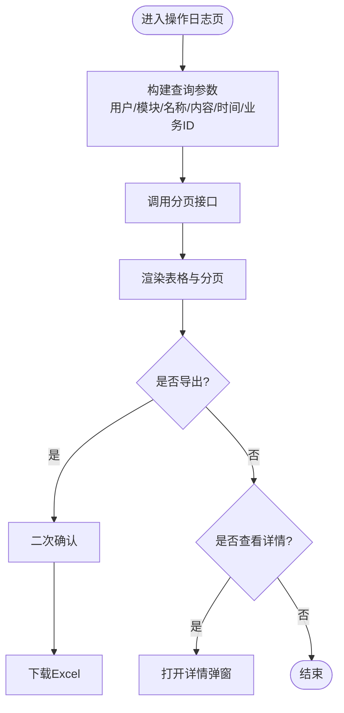
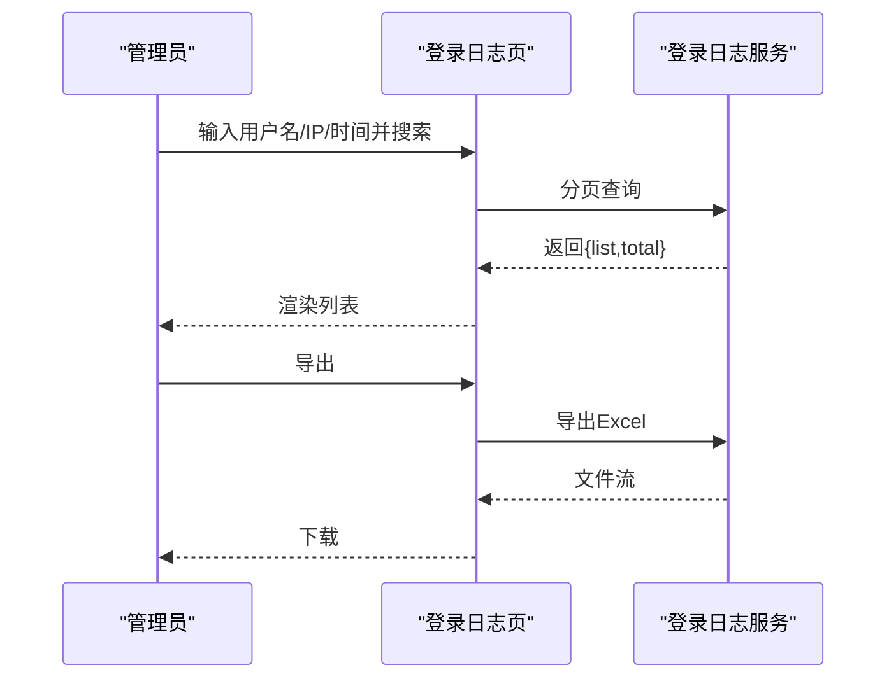
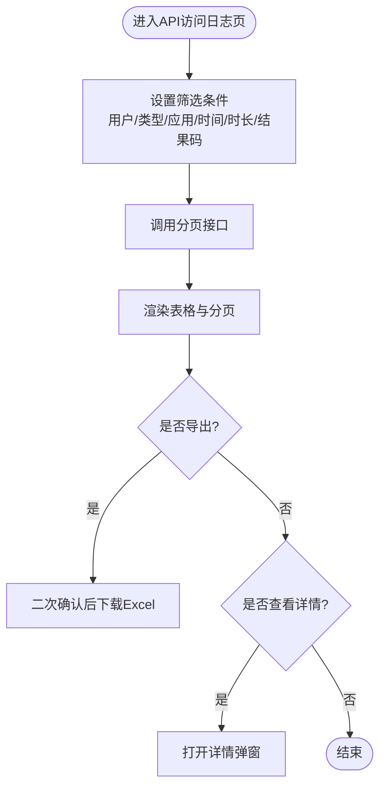
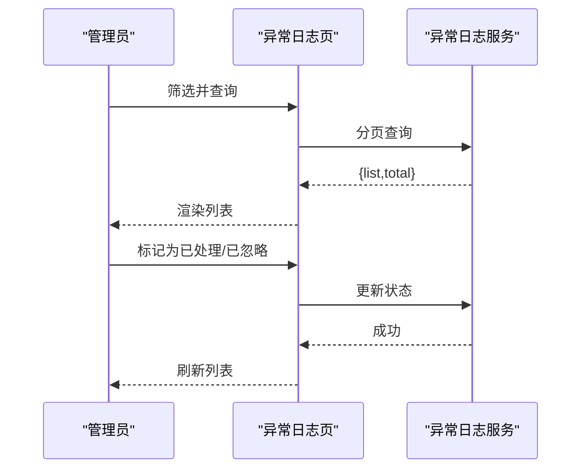
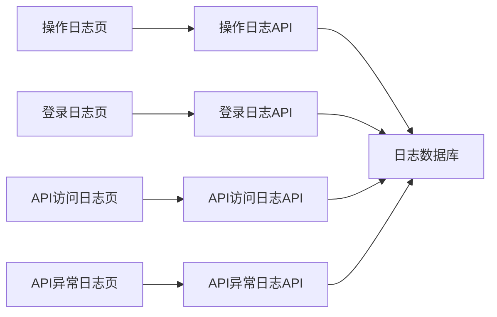

# 操作审计管理界面

<cite>
**本文引用的文件**
- [yudao-ui-admin-vue3/src/views/system/operatelog/index.vue](file://yudao-ui-admin-vue3/src/views/system/operatelog/index.vue)
- [yudao-ui-admin-vue3/src/views/system/loginlog/index.vue](file://yudao-ui-admin-vue3/src/views/system/loginlog/index.vue)
- [yudao-ui-admin-vue3/src/views/infra/apiAccessLog/index.vue](file://yudao-ui-admin-vue3/src/views/infra/apiAccessLog/index.vue)
- [yudao-ui-admin-vue3/src/views/infra/apiErrorLog/index.vue](file://yudao-ui-admin-vue3/src/views/infra/apiErrorLog/index.vue)
</cite>

## 目录
1. [简介](#简介)
2. [项目结构](#项目结构)
3. [核心组件](#核心组件)
4. [架构总览](#架构总览)
5. [详细组件分析](#详细组件分析)
6. [依赖关系分析](#依赖关系分析)
7. [性能考虑](#性能考虑)
8. [故障排查指南](#故障排查指南)
9. [结论](#结论)
10. [附录](#附录)

## 简介
本文件面向“操作审计管理界面”，围绕以下目标提供系统化说明：
- 操作日志管理：用户操作记录、接口调用日志、错误日志分析。
- 登录日志监控：登录成功/失败记录、IP 地址追踪与地理位置分析思路。
- 审计数据存储策略与查询优化建议。
- 敏感操作的审计标记与告警机制（基于现有能力扩展）。
- 审计报表生成与数据导出。
- 审计数据的归档清理与合规性要求。

本说明以仓库中前端审计相关页面为依据，结合通用后端实践给出可落地的设计与优化建议。

## 项目结构
审计管理功能在前端按“系统模块”和“基础设施模块”划分：
- 系统模块
  - 操作日志：system/operatelog
  - 登录日志：system/loginlog
- 基础设施模块
  - API 访问日志：infra/apiAccessLog
  - API 异常日志：infra/apiErrorLog

图表来源
- [yudao-ui-admin-vue3/src/views/system/operatelog/index.vue:1-214](file://yudao-ui-admin-vue3/src/views/system/operatelog/index.vue#L1-L214)
- [yudao-ui-admin-vue3/src/views/system/loginlog/index.vue:1-181](file://yudao-ui-admin-vue3/src/views/system/loginlog/index.vue#L1-L181)
- [yudao-ui-admin-vue3/src/views/infra/apiAccessLog/index.vue:1-227](file://yudao-ui-admin-vue3/src/views/infra/apiAccessLog/index.vue#L1-L227)
- [yudao-ui-admin-vue3/src/views/infra/apiErrorLog/index.vue:1-253](file://yudao-ui-admin-vue3/src/views/infra/apiErrorLog/index.vue#L1-L253)

章节来源
- [yudao-ui-admin-vue3/src/views/system/operatelog/index.vue:1-214](file://yudao-ui-admin-vue3/src/views/system/operatelog/index.vue#L1-L214)
- [yudao-ui-admin-vue3/src/views/system/loginlog/index.vue:1-181](file://yudao-ui-admin-vue3/src/views/system/loginlog/index.vue#L1-L181)
- [yudao-ui-admin-vue3/src/views/infra/apiAccessLog/index.vue:1-227](file://yudao-ui-admin-vue3/src/views/infra/apiAccessLog/index.vue#L1-L227)
- [yudao-ui-admin-vue3/src/views/infra/apiErrorLog/index.vue:1-253](file://yudao-ui-admin-vue3/src/views/infra/apiErrorLog/index.vue#L1-L253)

## 核心组件
- 操作日志列表页：支持按操作人、模块、操作名、内容、时间范围、业务编号筛选；分页展示；导出 Excel；查看详情。
- 登录日志列表页：支持按用户名、登录地址、时间范围筛选；展示登录类型、结果；分页展示；导出 Excel；查看详情。
- API 访问日志列表页：支持按用户编号、用户类型、应用名、请求时间、执行时长、结果码等筛选；展示请求方法、URL、耗时、状态；分页展示；导出 Excel；查看详情。
- API 异常日志列表页：支持按用户编号、用户类型、应用名、异常时间、处理状态筛选；支持将异常标记为“已处理/已忽略”；分页展示；导出 Excel；查看详情。

章节来源
- [yudao-ui-admin-vue3/src/views/system/operatelog/index.vue:1-214](file://yudao-ui-admin-vue3/src/views/system/operatelog/index.vue#L1-L214)
- [yudao-ui-admin-vue3/src/views/system/loginlog/index.vue:1-181](file://yudao-ui-admin-vue3/src/views/system/loginlog/index.vue#L1-L181)
- [yudao-ui-admin-vue3/src/views/infra/apiAccessLog/index.vue:1-227](file://yudao-ui-admin-vue3/src/views/infra/apiAccessLog/index.vue#L1-L227)
- [yudao-ui-admin-vue3/src/views/infra/apiErrorLog/index.vue:1-253](file://yudao-ui-admin-vue3/src/views/infra/apiErrorLog/index.vue#L1-L253)

## 架构总览
审计界面的典型交互流程如下：
- 用户在前端选择筛选条件并发起查询。
- 前端调用对应 API 获取分页数据并渲染表格。
- 用户点击“导出”触发二次确认后下载 Excel。
- 用户点击“详情/详细”打开弹窗查看单条记录的完整信息。
- 异常日志支持状态流转（初始化→已处理/已忽略）。

图表来源
- [yudao-ui-admin-vue3/src/views/system/operatelog/index.vue:162-205](file://yudao-ui-admin-vue3/src/views/system/operatelog/index.vue#L162-L205)
- [yudao-ui-admin-vue3/src/views/system/loginlog/index.vue:131-174](file://yudao-ui-admin-vue3/src/views/system/loginlog/index.vue#L131-L174)
- [yudao-ui-admin-vue3/src/views/infra/apiAccessLog/index.vue:177-219](file://yudao-ui-admin-vue3/src/views/infra/apiAccessLog/index.vue#L177-L219)
- [yudao-ui-admin-vue3/src/views/infra/apiErrorLog/index.vue:189-245](file://yudao-ui-admin-vue3/src/views/infra/apiErrorLog/index.vue#L189-L245)

## 详细组件分析

### 操作日志（system/operatelog）
- 筛选维度：操作人、操作模块、操作名、操作内容、操作时间、业务编号。
- 列表字段：日志编号、操作人、模块、操作名、内容、时间、业务编号、操作 IP。
- 功能：分页、导出 Excel、查看详情。
- 权限控制：导出与详情查看具备权限标识。

图表来源
- [yudao-ui-admin-vue3/src/views/system/operatelog/index.vue:6-89](file://yudao-ui-admin-vue3/src/views/system/operatelog/index.vue#L6-L89)
- [yudao-ui-admin-vue3/src/views/system/operatelog/index.vue:92-129](file://yudao-ui-admin-vue3/src/views/system/operatelog/index.vue#L92-L129)
- [yudao-ui-admin-vue3/src/views/system/operatelog/index.vue:162-205](file://yudao-ui-admin-vue3/src/views/system/operatelog/index.vue#L162-L205)

章节来源
- [yudao-ui-admin-vue3/src/views/system/operatelog/index.vue:1-214](file://yudao-ui-admin-vue3/src/views/system/operatelog/index.vue#L1-L214)

### 登录日志（system/loginlog）
- 筛选维度：用户名、登录地址、登录日期范围。
- 列表字段：日志编号、登录类型、用户名、登录地址、浏览器、登录结果、登录时间。
- 功能：分页、导出 Excel、查看详情。
- 安全要点：登录结果包含成功/失败，便于后续风控与告警。

图表来源
- [yudao-ui-admin-vue3/src/views/system/loginlog/index.vue:6-55](file://yudao-ui-admin-vue3/src/views/system/loginlog/index.vue#L6-L55)
- [yudao-ui-admin-vue3/src/views/system/loginlog/index.vue:58-102](file://yudao-ui-admin-vue3/src/views/system/loginlog/index.vue#L58-L102)
- [yudao-ui-admin-vue3/src/views/system/loginlog/index.vue:131-174](file://yudao-ui-admin-vue3/src/views/system/loginlog/index.vue#L131-L174)

章节来源
- [yudao-ui-admin-vue3/src/views/system/loginlog/index.vue:1-181](file://yudao-ui-admin-vue3/src/views/system/loginlog/index.vue#L1-L181)

### API 访问日志（infra/apiAccessLog）
- 筛选维度：用户编号、用户类型、应用名、请求时间、执行时长、结果码。
- 列表字段：日志编号、用户编号、用户类型、应用名、请求方法、请求地址、请求时间、执行时长、操作结果、操作模块、操作名、操作类型。
- 功能：分页、导出 Excel、查看详情。

图表来源
- [yudao-ui-admin-vue3/src/views/infra/apiAccessLog/index.vue:6-88](file://yudao-ui-admin-vue3/src/views/infra/apiAccessLog/index.vue#L6-L88)
- [yudao-ui-admin-vue3/src/views/infra/apiAccessLog/index.vue:91-144](file://yudao-ui-admin-vue3/src/views/infra/apiAccessLog/index.vue#L91-L144)
- [yudao-ui-admin-vue3/src/views/infra/apiAccessLog/index.vue:177-219](file://yudao-ui-admin-vue3/src/views/infra/apiAccessLog/index.vue#L177-L219)

章节来源
- [yudao-ui-admin-vue3/src/views/infra/apiAccessLog/index.vue:1-227](file://yudao-ui-admin-vue3/src/views/infra/apiAccessLog/index.vue#L1-L227)

### API 异常日志（infra/apiErrorLog）
- 筛选维度：用户编号、用户类型、应用名、异常时间、处理状态。
- 列表字段：日志编号、用户编号、用户类型、应用名、请求方法、请求地址、异常发生时间、异常名、处理状态。
- 功能：分页、导出 Excel、查看详情；支持将异常标记为“已处理/已忽略”。

图表来源
- [yudao-ui-admin-vue3/src/views/infra/apiErrorLog/index.vue:6-85](file://yudao-ui-admin-vue3/src/views/infra/apiErrorLog/index.vue#L6-L85)
- [yudao-ui-admin-vue3/src/views/infra/apiErrorLog/index.vue:88-155](file://yudao-ui-admin-vue3/src/views/infra/apiErrorLog/index.vue#L88-L155)
- [yudao-ui-admin-vue3/src/views/infra/apiErrorLog/index.vue:219-231](file://yudao-ui-admin-vue3/src/views/infra/apiErrorLog/index.vue#L219-L231)

章节来源
- [yudao-ui-admin-vue3/src/views/infra/apiErrorLog/index.vue:1-253](file://yudao-ui-admin-vue3/src/views/infra/apiErrorLog/index.vue#L1-L253)

## 依赖关系分析
- 页面与 API：各日志页面通过各自模块的 API 模块进行分页查询与导出。
- 页面与工具：统一使用消息提示、导出下载、字典标签、时间格式化等通用工具。
- 页面与权限：导出与详情查看按钮均带有权限标识，确保最小权限原则。

图表来源
- [yudao-ui-admin-vue3/src/views/system/operatelog/index.vue:134-205](file://yudao-ui-admin-vue3/src/views/system/operatelog/index.vue#L134-L205)
- [yudao-ui-admin-vue3/src/views/system/loginlog/index.vue:107-174](file://yudao-ui-admin-vue3/src/views/system/loginlog/index.vue#L107-L174)
- [yudao-ui-admin-vue3/src/views/infra/apiAccessLog/index.vue:149-219](file://yudao-ui-admin-vue3/src/views/infra/apiAccessLog/index.vue#L149-L219)
- [yudao-ui-admin-vue3/src/views/infra/apiErrorLog/index.vue:161-245](file://yudao-ui-admin-vue3/src/views/infra/apiErrorLog/index.vue#L161-L245)

章节来源
- [yudao-ui-admin-vue3/src/views/system/operatelog/index.vue:134-205](file://yudao-ui-admin-vue3/src/views/system/operatelog/index.vue#L134-L205)
- [yudao-ui-admin-vue3/src/views/system/loginlog/index.vue:107-174](file://yudao-ui-admin-vue3/src/views/system/loginlog/index.vue#L107-L174)
- [yudao-ui-admin-vue3/src/views/infra/apiAccessLog/index.vue:149-219](file://yudao-ui-admin-vue3/src/views/infra/apiAccessLog/index.vue#L149-L219)
- [yudao-ui-admin-vue3/src/views/infra/apiErrorLog/index.vue:161-245](file://yudao-ui-admin-vue3/src/views/infra/apiErrorLog/index.vue#L161-L245)

## 性能考虑
- 分页与索引
  - 所有日志列表均采用分页加载，避免一次性拉取大量数据。
  - 建议在服务端对常用筛选字段建立复合索引，如：用户/应用/时间范围/状态等。
- 导出优化
  - 导出时携带相同筛选条件，服务端应流式写入以减少内存占用。
  - 大表导出建议异步任务+通知下载，避免阻塞。
- 查询性能
  - 时间范围查询需配合时间字段索引。
  - 模糊匹配尽量限制长度或采用前缀匹配。
- 缓存与降级
  - 热点统计可引入缓存层（如 Redis），但审计明细不建议强缓存以保证一致性。
  - 高并发下可对非关键路径做限流与降级。

[本节为通用性能建议，不直接分析具体文件]

## 故障排查指南
- 列表无法加载
  - 检查网络请求是否成功、分页参数是否正确、后端接口是否可用。
  - 关注 loading 状态切换逻辑，确保 finally 分支重置加载态。
- 导出失败
  - 确认二次确认流程与权限标识。
  - 检查后端导出接口返回是否为文件流及文件名是否正确。
- 异常日志状态未更新
  - 检查“已处理/已忽略”按钮是否具备相应权限。
  - 确认状态更新接口调用成功并刷新列表。
- 详情弹窗无数据
  - 检查详情接口入参（如 id）是否正确传递。
  - 校验后端返回数据结构是否与前端期望一致。

章节来源
- [yudao-ui-admin-vue3/src/views/system/operatelog/index.vue:162-205](file://yudao-ui-admin-vue3/src/views/system/operatelog/index.vue#L162-L205)
- [yudao-ui-admin-vue3/src/views/system/loginlog/index.vue:131-174](file://yudao-ui-admin-vue3/src/views/system/loginlog/index.vue#L131-L174)
- [yudao-ui-admin-vue3/src/views/infra/apiAccessLog/index.vue:177-219](file://yudao-ui-admin-vue3/src/views/infra/apiAccessLog/index.vue#L177-L219)
- [yudao-ui-admin-vue3/src/views/infra/apiErrorLog/index.vue:219-245](file://yudao-ui-admin-vue3/src/views/infra/apiErrorLog/index.vue#L219-L245)

## 结论
- 前端已提供完整的操作日志、登录日志、API 访问日志与异常日志管理能力，覆盖查询、分页、导出与详情查看。
- 异常日志具备状态流转能力，便于闭环处理。
- 建议在后端完善索引、导出与告警能力，以满足大规模审计场景下的性能与合规需求。

[本节为总结性内容，不直接分析具体文件]

## 附录

### 审计数据模型与字段（基于前端可见字段归纳）
- 操作日志
  - 关键字段：日志编号、操作人、模块、操作名、内容、时间、业务编号、操作 IP。
- 登录日志
  - 关键字段：日志编号、登录类型、用户名、登录地址、浏览器、登录结果、登录时间。
- API 访问日志
  - 关键字段：日志编号、用户编号、用户类型、应用名、请求方法、请求地址、请求时间、执行时长、操作结果、操作模块、操作名、操作类型。
- API 异常日志
  - 关键字段：日志编号、用户编号、用户类型、应用名、请求方法、请求地址、异常发生时间、异常名、处理状态。

[本节为概念性汇总，不直接分析具体文件]

### 登录日志监控与 IP 地理分析
- 登录成功/失败记录：通过登录日志的“登录结果”字段区分，便于统计成功率与异常趋势。
- IP 地址追踪：利用“登录地址”字段进行去重与频次统计，识别异常高频登录。
- 地理位置分析（建议方案）
  - 在登录日志入库时，将 IP 解析为城市/国家等地理信息并落库，便于地图可视化与区域统计。
  - 若实时解析成本高，可采用离线批处理或异步任务完成解析与回填。
  - 注意隐私保护与合规，仅保留必要字段并脱敏展示。

[本节为概念性设计，不直接分析具体文件]

### 敏感操作审计标记与告警机制（建议方案）
- 敏感操作定义：在操作日志中标记高风险模块/操作名（如删除、批量修改、权限变更、资金相关）。
- 标记策略：在服务端对特定模块/操作名打标签，并在前端列表增加“敏感”列或筛选器。
- 告警规则：
  - 阈值告警：同一用户短时间多次敏感操作。
  - 异常告警：非工作时间敏感操作、异地登录后的敏感操作。
  - 渠道：站内信、邮件、短信或企业 IM。
- 处置闭环：与异常日志类似，提供“已处理/已忽略”状态，形成审计闭环。

[本节为概念性设计，不直接分析具体文件]

### 审计报表生成与数据导出
- 报表维度
  - 操作日志：按用户/模块/时间统计操作量、成功率、失败率。
  - 登录日志：按用户/IP/地区统计登录次数、成功率、失败原因分布。
  - API 日志：按应用/接口/用户统计调用量、耗时分布、错误率。
  - 异常日志：按异常名/应用/用户统计异常量、处理进度。
- 导出能力
  - 列表页已支持导出 Excel，建议后端实现流式导出与异步任务化。
  - 报表导出支持多 Sheet 与图表图片嵌入（可选）。

[本节为概念性设计，不直接分析具体文件]

### 审计数据归档清理与合规性
- 归档策略
  - 冷热分层：近期数据热存（高性能库），历史数据冷存（归档库/对象存储）。
  - 生命周期：按时间窗口自动归档与清理，保留策略可配置。
- 合规要求
  - 最小化采集：仅采集必要字段，敏感信息脱敏。
  - 访问控制：严格权限与审计，禁止越权导出。
  - 留存周期：满足法规与内部政策要求，到期自动销毁。
- 技术建议
  - 归档任务：定时任务迁移历史数据至归档库。
  - 清理任务：定期删除过期数据或压缩归档文件。
  - 备份与恢复：归档数据纳入备份体系，支持快速恢复。

[本节为概念性设计，不直接分析具体文件]