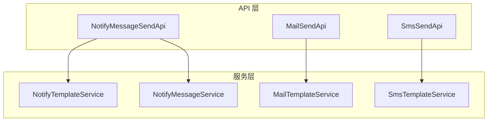
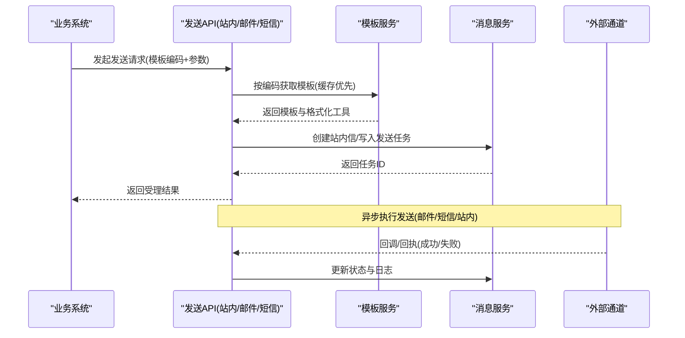
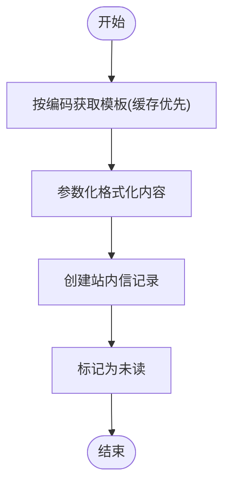
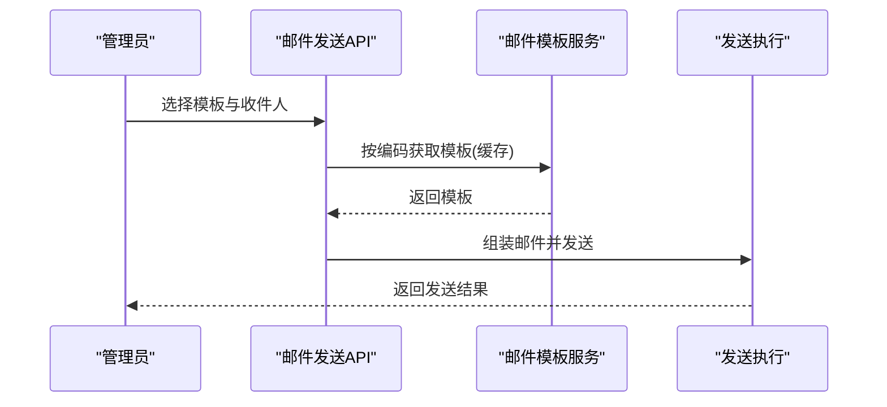
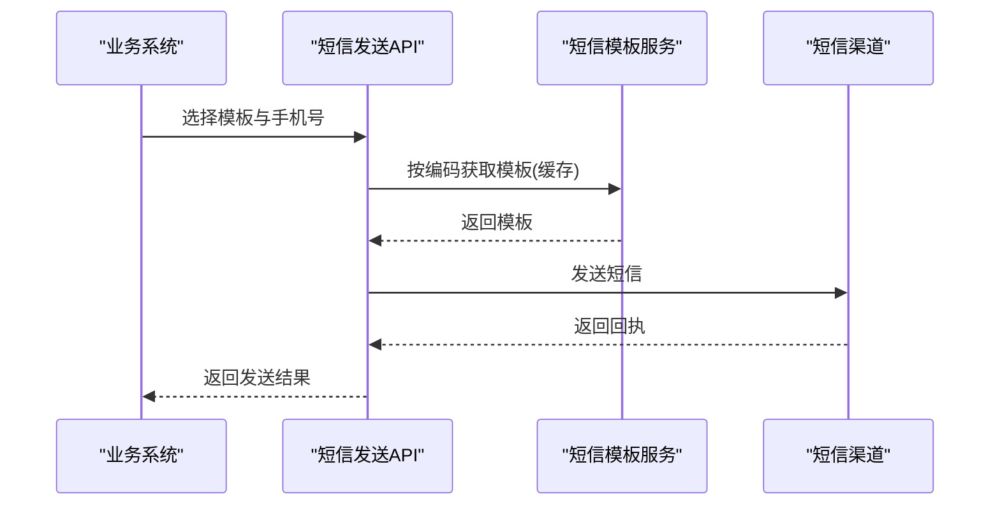
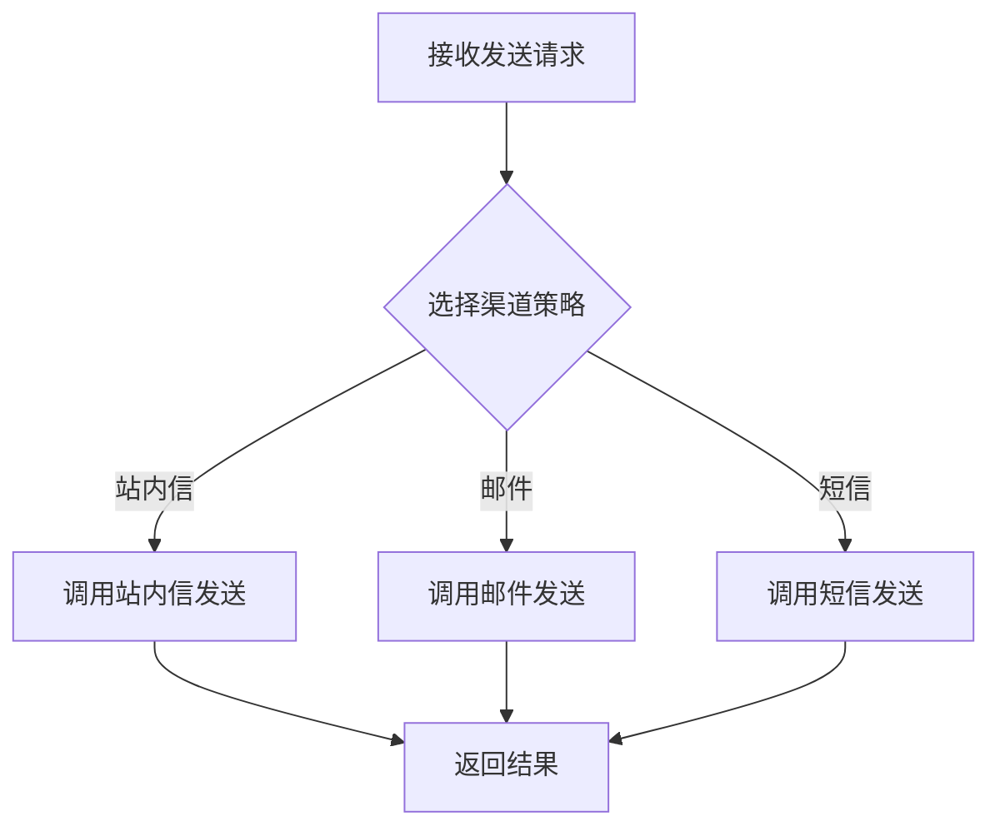
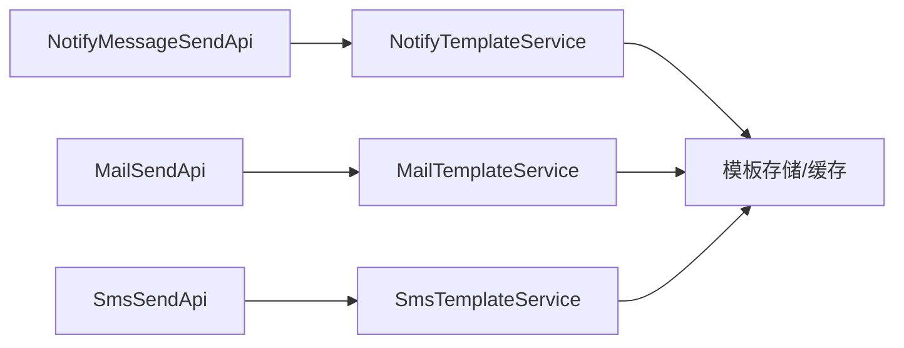

# 消息通知管理界面

<cite>
**本文引用的文件**
- [NotifyMessageService.java](file://yudao-cloud/yudao-module-system/yudao-module-system-server/src/main/java/cn/iocoder/yudao/module/system/service/notify/NotifyMessageService.java)
- [NotifyTemplateService.java](file://yudao-cloud/yudao-module-system/yudao-module-system-server/src/main/java/cn/iocoder/yudao/module/system/service/notify/NotifyTemplateService.java)
- [MailTemplateService.java](file://yudao-cloud/yudao-module-system/yudao-module-system-server/src/main/java/cn/iocoder/yudao/module/system/service/mail/MailTemplateService.java)
- [SmsTemplateService.java](file://yudao-cloud/yudao-module-system/yudao-module-system-server/src/main/java/cn/iocoder/yudao/module/system/service/sms/SmsTemplateService.java)
- [MailSendApi.java](file://yudao-cloud/yudao-module-system/yudao-module-system-api/src/main/java/cn/iocoder/yudao/module/system/api/mail/MailSendApi.java)
- [SmsSendApi.java](file://yudao-cloud/yudao-module-system/yudao-module-system-api/src/main/java/cn/iocoder/yudao/module/system/api/sms/SmsSendApi.java)
- [NotifyMessageSendApi.java](file://yudao-cloud/yudao-module-system/yudao-module-system-api/src/main/java/cn/iocoder/yudao/module/system/api/notify/NotifyMessageSendApi.java)
</cite>

## 目录
1. [简介](#简介)
2. [项目结构](#项目结构)
3. [核心组件](#核心组件)
4. [架构总览](#架构总览)
5. [详细组件分析](#详细组件分析)
6. [依赖关系分析](#依赖关系分析)
7. [性能考虑](#性能考虑)
8. [故障排查指南](#故障排查指南)
9. [结论](#结论)
10. [附录](#附录)

## 简介
本文件为“消息通知管理界面”的权威技术文档，覆盖站内消息、邮件通知与短信通知三大能力，并统一说明多渠道消息的管理与路由策略、异步处理与失败重试机制、以及性能监控与成本控制方案。面向产品、研发与运维人员，帮助快速理解系统能力、定位问题与优化成本。

## 项目结构
本项目采用模块化分层架构：
- API 层：对外暴露统一的发送接口（站内信、邮件、短信），供业务模块调用。
- 服务层：按渠道拆分服务（通知模板、站内信消息、邮件模板、短信模板等），提供模板管理、内容格式化、分页查询、缓存读取等能力。
- 数据层：通过 DO/VO/分页对象进行数据建模与传输。
- 前端：管理后台页面负责模板配置、消息查看与日志查询。

图表来源
- [NotifyMessageSendApi.java](file://yudao-cloud/yudao-module-system/yudao-module-system-api/src/main/java/cn/iocoder/yudao/module/system/api/notify/NotifyMessageSendApi.java)
- [MailSendApi.java](file://yudao-cloud/yudao-module-system/yudao-module-system-api/src/main/java/cn/iocoder/yudao/module/system/api/mail/MailSendApi.java)
- [SmsSendApi.java](file://yudao-cloud/yudao-module-system/yudao-module-system-api/src/main/java/cn/iocoder/yudao/module/system/api/sms/SmsSendApi.java)
- [NotifyTemplateService.java](file://yudao-cloud/yudao-module-system/yudao-module-system-server/src/main/java/cn/iocoder/yudao/module/system/service/notify/NotifyTemplateService.java)
- [NotifyMessageService.java](file://yudao-cloud/yudao-module-system/yudao-module-system-server/src/main/java/cn/iocoder/yudao/module/system/service/notify/NotifyMessageService.java)
- [MailTemplateService.java](file://yudao-cloud/yudao-module-system/yudao-module-system-server/src/main/java/cn/iocoder/yudao/module/system/service/mail/MailTemplateService.java)
- [SmsTemplateService.java](file://yudao-cloud/yudao-module-system/yudao-module-system-server/src/main/java/cn/iocoder/yudao/module/system/service/sms/SmsTemplateService.java)

章节来源
- [NotifyMessageService.java:1-98](file://yudao-cloud/yudao-module-system/yudao-module-system-server/src/main/java/cn/iocoder/yudao/module/system/service/notify/NotifyMessageService.java#L1-L98)
- [NotifyTemplateService.java:1-90](file://yudao-cloud/yudao-module-system/yudao-module-system-server/src/main/java/cn/iocoder/yudao/module/system/service/notify/NotifyTemplateService.java#L1-L90)
- [MailTemplateService.java:1-106](file://yudao-cloud/yudao-module-system/yudao-module-system-server/src/main/java/cn/iocoder/yudao/module/system/service/mail/MailTemplateService.java#L1-L106)
- [SmsTemplateService.java:1-99](file://yudao-cloud/yudao-module-system/yudao-module-system-server/src/main/java/cn/iocoder/yudao/module/system/service/sms/SmsTemplateService.java#L1-L99)

## 核心组件
- 站内消息
  - 模板管理：创建/更新/删除/分页/状态筛选/按编码从缓存获取/内容格式化。
  - 消息管理：创建站内信、分页查询、我的站内信、未读统计与列表、批量标记已读、全部已读。
- 邮件通知
  - 模板管理：创建/更新/删除/分页/状态筛选/按编码从缓存获取/内容格式化/按账号维度统计模板数量。
  - 发送入口：通过邮件发送 API 触发发送流程（含账户与模板选择）。
- 短信通知
  - 模板管理：创建/更新/删除/分页/状态筛选/按编码从缓存获取/内容格式化/按渠道维度统计模板数量。
  - 发送入口：通过短信发送 API 触发发送流程（含渠道与模板选择）。

章节来源
- [NotifyTemplateService.java:18-88](file://yudao-cloud/yudao-module-system/yudao-module-system-server/src/main/java/cn/iocoder/yudao/module/system/service/notify/NotifyTemplateService.java#L18-L88)
- [NotifyMessageService.java:20-95](file://yudao-cloud/yudao-module-system/yudao-module-system-server/src/main/java/cn/iocoder/yudao/module/system/service/notify/NotifyMessageService.java#L20-L95)
- [MailTemplateService.java:20-103](file://yudao-cloud/yudao-module-system/yudao-module-system-server/src/main/java/cn/iocoder/yudao/module/system/service/mail/MailTemplateService.java#L20-L103)
- [SmsTemplateService.java:20-96](file://yudao-cloud/yudao-module-system/yudao-module-system-server/src/main/java/cn/iocoder/yudao/module/system/service/sms/SmsTemplateService.java#L20-L96)

## 架构总览
多渠道消息的统一管理与路由策略：
- 统一入口：各渠道发送 API 作为统一接入点，屏蔽底层差异。
- 模板抽象：各渠道模板均支持按编码缓存读取与内容参数化格式化，便于复用与动态渲染。
- 路由策略：根据业务场景、用户偏好或规则引擎选择合适渠道；同一模板可适配多通道输出。
- 异步与重试：发送过程建议异步化，失败进入重试队列，结合幂等键与去重保障可靠性。
- 观测与成本：记录发送日志、成功率、耗时与渠道用量，支撑监控告警与成本核算。

图表来源
- [NotifyMessageSendApi.java](file://yudao-cloud/yudao-module-system/yudao-module-system-api/src/main/java/cn/iocoder/yudao/module/system/api/notify/NotifyMessageSendApi.java)
- [MailSendApi.java](file://yudao-cloud/yudao-module-system/yudao-module-system-api/src/main/java/cn/iocoder/yudao/module/system/api/mail/MailSendApi.java)
- [SmsSendApi.java](file://yudao-cloud/yudao-module-system/yudao-module-system-api/src/main/java/cn/iocoder/yudao/module/system/api/sms/SmsSendApi.java)
- [NotifyTemplateService.java:56-88](file://yudao-cloud/yudao-module-system/yudao-module-system-server/src/main/java/cn/iocoder/yudao/module/system/service/notify/NotifyTemplateService.java#L56-L88)
- [MailTemplateService.java:80-95](file://yudao-cloud/yudao-module-system/yudao-module-system-server/src/main/java/cn/iocoder/yudao/module/system/service/mail/MailTemplateService.java#L80-L95)
- [SmsTemplateService.java:57-96](file://yudao-cloud/yudao-module-system/yudao-module-system-server/src/main/java/cn/iocoder/yudao/module/system/service/sms/SmsTemplateService.java#L57-L96)

## 详细组件分析

### 站内消息管理
- 模板管理
  - 能力：创建/更新/删除/分页/按状态筛选/按编码从缓存获取/内容格式化。
  - 关键点：模板编码唯一、内容参数化、缓存命中提升读取性能。
- 消息管理
  - 能力：创建站内信、分页查询、我的站内信、未读统计与列表、批量标记已读、全部已读。
  - 关键点：用户维度隔离、未读计数用于角标展示、批量操作提升效率。

图表来源
- [NotifyTemplateService.java:56-88](file://yudao-cloud/yudao-module-system/yudao-module-system-server/src/main/java/cn/iocoder/yudao/module/system/service/notify/NotifyTemplateService.java#L56-L88)
- [NotifyMessageService.java:20-76](file://yudao-cloud/yudao-module-system/yudao-module-system-server/src/main/java/cn/iocoder/yudao/module/system/service/notify/NotifyMessageService.java#L20-L76)

章节来源
- [NotifyTemplateService.java:18-88](file://yudao-cloud/yudao-module-system/yudao-module-system-server/src/main/java/cn/iocoder/yudao/module/system/service/notify/NotifyTemplateService.java#L18-L88)
- [NotifyMessageService.java:20-95](file://yudao-cloud/yudao-module-system/yudao-module-system-server/src/main/java/cn/iocoder/yudao/module/system/service/notify/NotifyMessageService.java#L20-L95)

### 邮件通知管理
- 邮件账户配置
  - 由上层服务装配账户信息，发送时选择对应账户。
- 邮件模板管理
  - 能力：创建/更新/删除/分页/状态筛选/按编码从缓存获取/内容格式化/按账号维度统计模板数量。
- 邮件发送日志
  - 通过发送 API 触发发送，记录发送结果与关键指标，便于审计与排障。

图表来源
- [MailTemplateService.java:20-103](file://yudao-cloud/yudao-module-system/yudao-module-system-server/src/main/java/cn/iocoder/yudao/module/system/service/mail/MailTemplateService.java#L20-L103)
- [MailSendApi.java](file://yudao-cloud/yudao-module-system/yudao-module-system-api/src/main/java/cn/iocoder/yudao/module/system/api/mail/MailSendApi.java)

章节来源
- [MailTemplateService.java:20-103](file://yudao-cloud/yudao-module-system/yudao-module-system-server/src/main/java/cn/iocoder/yudao/module/system/service/mail/MailTemplateService.java#L20-L103)
- [MailSendApi.java](file://yudao-cloud/yudao-module-system/yudao-module-system-api/src/main/java/cn/iocoder/yudao/module/system/api/mail/MailSendApi.java)

### 短信通知管理
- 短信渠道配置
  - 由上层服务维护渠道信息，发送时选择对应渠道。
- 短信模板管理
  - 能力：创建/更新/删除/分页/状态筛选/按编码从缓存获取/内容格式化/按渠道维度统计模板数量。
- 发送记录查询
  - 通过发送 API 触发发送，记录发送结果与关键指标，便于审计与排障。

图表来源
- [SmsTemplateService.java:20-96](file://yudao-cloud/yudao-module-system/yudao-module-system-server/src/main/java/cn/iocoder/yudao/module/system/service/sms/SmsTemplateService.java#L20-L96)
- [SmsSendApi.java](file://yudao-cloud/yudao-module-system/yudao-module-system-api/src/main/java/cn/iocoder/yudao/module/system/api/sms/SmsSendApi.java)

章节来源
- [SmsTemplateService.java:20-96](file://yudao-cloud/yudao-module-system/yudao-module-system-server/src/main/java/cn/iocoder/yudao/module/system/service/sms/SmsTemplateService.java#L20-L96)
- [SmsSendApi.java](file://yudao-cloud/yudao-module-system/yudao-module-system-api/src/main/java/cn/iocoder/yudao/module/system/api/sms/SmsSendApi.java)

### 多渠道统一管理与路由策略
- 统一入口：站内信、邮件、短信分别提供发送 API，便于业务侧统一接入。
- 模板抽象：各渠道模板均支持按编码缓存读取与内容参数化格式化，降低耦合。
- 路由策略：基于业务类型、用户偏好、渠道可用性进行智能路由；失败自动切换备选渠道。
- 幂等与去重：通过业务主键与发送上下文保证重复提交不重复发送。

图表来源
- [NotifyMessageSendApi.java](file://yudao-cloud/yudao-module-system/yudao-module-system-api/src/main/java/cn/iocoder/yudao/module/system/api/notify/NotifyMessageSendApi.java)
- [MailSendApi.java](file://yudao-cloud/yudao-module-system/yudao-module-system-api/src/main/java/cn/iocoder/yudao/module/system/api/mail/MailSendApi.java)
- [SmsSendApi.java](file://yudao-cloud/yudao-module-system/yudao-module-system-api/src/main/java/cn/iocoder/yudao/module/system/api/sms/SmsSendApi.java)

## 依赖关系分析
- 服务间依赖
  - 发送 API 依赖各自模板服务以获取模板与格式化能力。
  - 站内信消息服务依赖模板服务完成内容渲染与消息持久化。
- 缓存依赖
  - 模板服务普遍提供“按编码从缓存获取”的能力，减少数据库压力。
- 外部依赖
  - 邮件与短信发送依赖外部通道服务，需关注超时、限流与重试。

图表来源
- [NotifyMessageSendApi.java](file://yudao-cloud/yudao-module-system/yudao-module-system-api/src/main/java/cn/iocoder/yudao/module/system/api/notify/NotifyMessageSendApi.java)
- [MailSendApi.java](file://yudao-cloud/yudao-module-system/yudao-module-system-api/src/main/java/cn/iocoder/yudao/module/system/api/mail/MailSendApi.java)
- [SmsSendApi.java](file://yudao-cloud/yudao-module-system/yudao-module-system-api/src/main/java/cn/iocoder/yudao/module/system/api/sms/SmsSendApi.java)
- [NotifyTemplateService.java:56-88](file://yudao-cloud/yudao-module-system/yudao-module-system-server/src/main/java/cn/iocoder/yudao/module/system/service/notify/NotifyTemplateService.java#L56-L88)
- [MailTemplateService.java:80-95](file://yudao-cloud/yudao-module-system/yudao-module-system-server/src/main/java/cn/iocoder/yudao/module/system/service/mail/MailTemplateService.java#L80-L95)
- [SmsTemplateService.java:57-96](file://yudao-cloud/yudao-module-system/yudao-module-system-server/src/main/java/cn/iocoder/yudao/module/system/service/sms/SmsTemplateService.java#L57-L96)

章节来源
- [NotifyTemplateService.java:56-88](file://yudao-cloud/yudao-module-system/yudao-module-system-server/src/main/java/cn/iocoder/yudao/module/system/service/notify/NotifyTemplateService.java#L56-L88)
- [MailTemplateService.java:80-95](file://yudao-cloud/yudao-module-system/yudao-module-system-server/src/main/java/cn/iocoder/yudao/module/system/service/mail/MailTemplateService.java#L80-L95)
- [SmsTemplateService.java:57-96](file://yudao-cloud/yudao-module-system/yudao-module-system-server/src/main/java/cn/iocoder/yudao/module/system/service/sms/SmsTemplateService.java#L57-L96)

## 性能考虑
- 模板缓存
  - 各渠道模板服务均提供“按编码从缓存获取”，显著降低热点模板的数据库访问。
- 分页与只读查询
  - 模板与消息查询均采用分页 VO，避免全量拉取。
- 异步与背压
  - 发送流程建议异步执行，结合消息队列削峰填谷，避免阻塞主线程。
- 连接池与超时
  - 邮件/短信客户端应合理设置连接池大小与超时时间，防止资源耗尽。
- 成本优化
  - 对高成本渠道（如短信）实施阈值控制与降级策略；优先使用低成本渠道（站内信/邮件）。

[本节为通用性能建议，不直接分析具体文件]

## 故障排查指南
- 常见问题
  - 模板未找到：检查模板编码是否正确、是否启用、是否已发布到缓存。
  - 发送失败：检查渠道配置、网络连通性、第三方服务限流与配额。
  - 未读计数异常：确认标记已读逻辑是否被正确调用，是否存在并发写冲突。
- 排查步骤
  - 核对模板缓存命中情况与格式化参数。
  - 查看发送日志与回执，定位失败原因。
  - 对高频失败场景开启重试与告警。

[本节为通用故障排查建议，不直接分析具体文件]

## 结论
本系统围绕站内信、邮件、短信三大渠道提供了完整的模板管理与发送能力，并通过统一 API 与模板抽象实现多渠道协同。借助缓存、分页、异步与重试等机制，系统在可用性与性能方面具备良好基础。后续可进一步增强路由策略、成本治理与可视化监控，以提升整体运营效率与用户体验。

[本节为总结性内容，不直接分析具体文件]

## 附录
- 术语
  - 模板编码：用于唯一标识模板的字符串，常用于缓存与路由。
  - 渠道：指具体的通知通道，如站内信、邮件、短信。
  - 幂等键：用于防止重复提交的唯一标识。
- 最佳实践
  - 模板变更需灰度发布并保留回滚能力。
  - 发送失败必须落库记录，便于审计与重试。
  - 对敏感信息（手机号、邮箱）进行脱敏展示。

[本节为补充说明，不直接分析具体文件]