# 用户管理界面

<cite>
**本文引用的文件**
- [yudao-ui-admin-vue3/src/views/system/user/index.vue](file://yudao-ui-admin-vue3/src/views/system/user/index.vue)
- [yudao-ui-admin-vue3/src/views/system/user/UserForm.vue](file://yudao-ui-admin-vue3/src/views/system/user/UserForm.vue)
- [yudao-ui-admin-vue3/src/views/system/user/UserImportForm.vue](file://yudao-ui-admin-vue3/src/views/system/user/UserImportForm.vue)
- [yudao-ui-admin-vue3/src/views/system/user/UserAssignRoleForm.vue](file://yudao-ui-admin-vue3/src/views/system/user/UserAssignRoleForm.vue)
- [yudao-ui-admin-vue3/src/views/system/role/index.vue](file://yudao-ui-admin-vue3/src/views/system/role/index.vue)
- [yudao-ui-admin-vue3/src/views/system/role/RoleForm.vue](file://yudao-ui-admin-vue3/src/views/system/role/RoleForm.vue)
- [yudao-ui-admin-vue3/src/views/system/role/RoleAssignMenuForm.vue](file://yudao-ui-admin-vue3/src/views/system/role/RoleAssignMenuForm.vue)
- [yudao-ui-admin-vue3/src/views/system/role/RoleDataPermissionForm.vue](file://yudao-ui-admin-vue3/src/views/system/role/RoleDataPermissionForm.vue)
</cite>

## 目录
1. [简介](#简介)
2. [项目结构](#项目结构)
3. [核心组件](#核心组件)
4. [架构总览](#架构总览)
5. [详细组件分析](#详细组件分析)
6. [依赖关系分析](#依赖关系分析)
7. [性能考虑](#性能考虑)
8. [故障排查指南](#故障排查指南)
9. [结论](#结论)
10. [附录](#附录)

## 简介
本文件面向“用户管理”与“角色权限”相关的前端界面，覆盖以下能力：
- 用户信息维护：新增、编辑、导入导出、状态管理（启用/停用）、批量删除、重置密码。
- 角色权限分配：角色创建/编辑、菜单权限配置、数据权限范围设置。
- 用户与角色关联：为用户分配角色（支持多选），并说明权限继承机制。
- 用户选择组件：提供使用方式与扩展建议（基于现有 UserSelect 系列组件）。
- 最佳实践与安全建议：表单校验、权限控制、审计日志与异常处理。
- 操作审计与异常处理：结合登录日志、操作日志等通用能力进行记录与排障。

## 项目结构
用户管理与角色权限功能集中在 system 模块的 views 目录下，采用“页面 + 弹窗表单”的组织方式：
- 用户管理页：列表、搜索、分页、批量操作、导入导出、状态切换、分配角色。
- 用户表单：新增/编辑用户基本信息、部门、岗位、联系方式等。
- 用户导入：Excel 模板下载与上传，支持更新已存在用户。
- 角色管理页：列表、搜索、分页、批量删除、导出、菜单权限、数据权限。
- 角色表单：新增/编辑角色基础信息。
- 菜单权限：以树形结构为角色勾选菜单。
- 数据权限：按数据范围与部门范围限制可见数据。

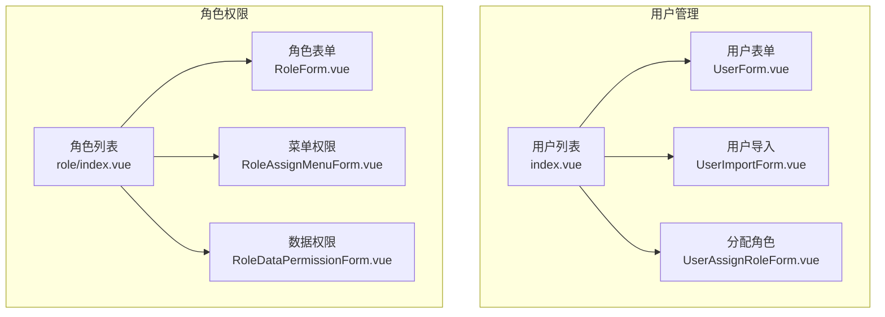

图表来源
- [yudao-ui-admin-vue3/src/views/system/user/index.vue:1-210](file://yudao-ui-admin-vue3/src/views/system/user/index.vue#L1-L210)
- [yudao-ui-admin-vue3/src/views/system/role/index.vue:1-176](file://yudao-ui-admin-vue3/src/views/system/role/index.vue#L1-L176)

章节来源
- [yudao-ui-admin-vue3/src/views/system/user/index.vue:1-210](file://yudao-ui-admin-vue3/src/views/system/user/index.vue#L1-L210)
- [yudao-ui-admin-vue3/src/views/system/role/index.vue:1-176](file://yudao-ui-admin-vue3/src/views/system/role/index.vue#L1-L176)

## 核心组件
- 用户列表与操作：提供查询、分页、批量删除、状态切换、导入导出、分配角色等入口。
- 用户表单：负责用户基本信息的录入与校验，提交新增或更新。
- 用户导入：通过 Excel 批量导入用户，支持更新已有用户，并提供模板下载。
- 角色列表与操作：提供查询、分页、批量删除、导出、菜单权限、数据权限等入口。
- 角色表单：负责角色的基础信息录入与校验。
- 菜单权限：以树形结构为角色分配菜单权限，支持全选/全不选、展开/折叠。
- 数据权限：按数据范围与部门范围限制角色可访问的数据集。
- 用户-角色分配：为用户多选分配角色，获取当前已分配角色并保存。

章节来源
- [yudao-ui-admin-vue3/src/views/system/user/index.vue:212-393](file://yudao-ui-admin-vue3/src/views/system/user/index.vue#L212-L393)
- [yudao-ui-admin-vue3/src/views/system/user/UserForm.vue:98-220](file://yudao-ui-admin-vue3/src/views/system/user/UserForm.vue#L98-L220)
- [yudao-ui-admin-vue3/src/views/system/user/UserImportForm.vue:43-139](file://yudao-ui-admin-vue3/src/views/system/user/UserImportForm.vue#L43-L139)
- [yudao-ui-admin-vue3/src/views/system/user/UserAssignRoleForm.vue:22-97](file://yudao-ui-admin-vue3/src/views/system/user/UserAssignRoleForm.vue#L22-L97)
- [yudao-ui-admin-vue3/src/views/system/role/index.vue:178-300](file://yudao-ui-admin-vue3/src/views/system/role/index.vue#L178-L300)
- [yudao-ui-admin-vue3/src/views/system/role/RoleForm.vue:39-127](file://yudao-ui-admin-vue3/src/views/system/role/RoleForm.vue#L39-L127)
- [yudao-ui-admin-vue3/src/views/system/role/RoleAssignMenuForm.vue:47-154](file://yudao-ui-admin-vue3/src/views/system/role/RoleAssignMenuForm.vue#L47-L154)
- [yudao-ui-admin-vue3/src/views/system/role/RoleDataPermissionForm.vue:65-170](file://yudao-ui-admin-vue3/src/views/system/role/RoleDataPermissionForm.vue#L65-L170)

## 架构总览
前端通过统一的 API 层调用后端服务，完成用户与角色的增删改查及权限分配。关键交互如下：
- 用户列表：分页查询、筛选、状态切换、批量删除、导出。
- 用户导入：下载模板 -> 选择文件 -> 上传 -> 展示导入结果。
- 角色管理：分页查询、导出、菜单权限、数据权限。
- 权限分配：为用户分配角色；为角色分配菜单与数据范围。

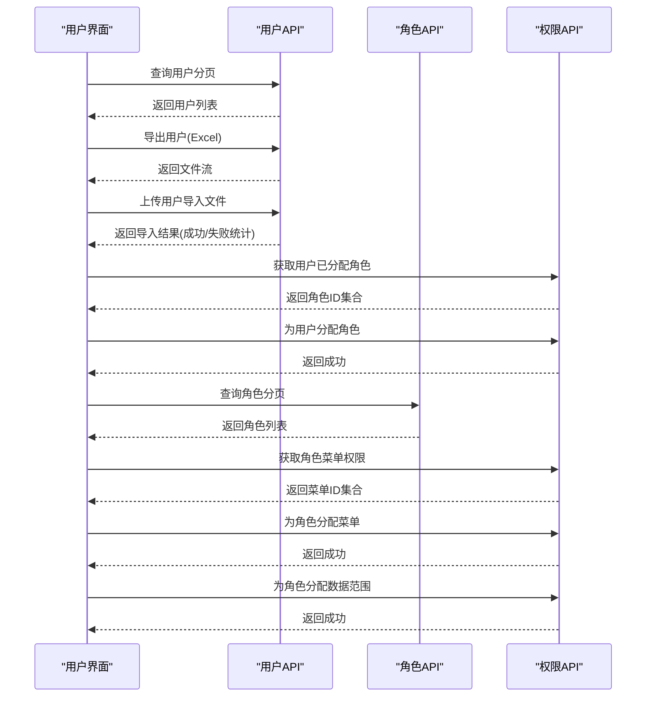

图表来源
- [yudao-ui-admin-vue3/src/views/system/user/index.vue:244-316](file://yudao-ui-admin-vue3/src/views/system/user/index.vue#L244-L316)
- [yudao-ui-admin-vue3/src/views/system/user/UserImportForm.vue:71-112](file://yudao-ui-admin-vue3/src/views/system/user/UserImportForm.vue#L71-L112)
- [yudao-ui-admin-vue3/src/views/system/user/UserAssignRoleForm.vue:44-84](file://yudao-ui-admin-vue3/src/views/system/user/UserAssignRoleForm.vue#L44-L84)
- [yudao-ui-admin-vue3/src/views/system/role/index.vue:206-293](file://yudao-ui-admin-vue3/src/views/system/role/index.vue#L206-L293)
- [yudao-ui-admin-vue3/src/views/system/role/RoleAssignMenuForm.vue:73-119](file://yudao-ui-admin-vue3/src/views/system/role/RoleAssignMenuForm.vue#L73-L119)
- [yudao-ui-admin-vue3/src/views/system/role/RoleDataPermissionForm.vue:95-133](file://yudao-ui-admin-vue3/src/views/system/role/RoleDataPermissionForm.vue#L95-L133)

## 详细组件分析

### 用户列表与操作（index.vue）
- 功能要点
  - 左侧部门树联动筛选。
  - 多条件查询：用户名、手机号、状态、创建时间范围。
  - 列表展示：编号、名称、昵称、部门、手机、状态、创建时间。
  - 行内状态切换：启用/停用，带二次确认与回滚。
  - 操作项：修改、删除、重置密码、分配角色（受权限控制）。
  - 批量操作：批量删除。
  - 导入导出：下载模板、上传导入、导出 Excel。
- 关键流程
  - 状态切换：触发确认 -> 调用接口 -> 刷新列表；取消时恢复状态。
  - 导出：二次确认 -> 请求导出 -> 下载文件。
  - 导入：选择文件 -> 携带鉴权头与租户头上传 -> 解析结果并提示。
  - 分配角色：打开分配弹窗 -> 加载用户已分配角色 -> 保存后刷新。

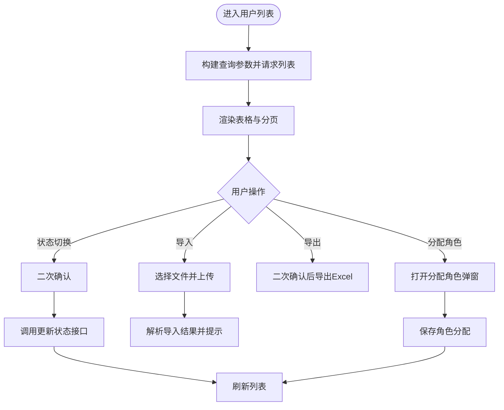

图表来源
- [yudao-ui-admin-vue3/src/views/system/user/index.vue:244-393](file://yudao-ui-admin-vue3/src/views/system/user/index.vue#L244-L393)

章节来源
- [yudao-ui-admin-vue3/src/views/system/user/index.vue:1-393](file://yudao-ui-admin-vue3/src/views/system/user/index.vue#L1-L393)

### 用户表单（UserForm.vue）
- 字段与校验
  - 必填：用户名称、用户昵称、用户密码（新增时）。
  - 格式：邮箱格式校验、手机号正则校验。
  - 其他：部门树选择、岗位多选、备注。
- 交互流程
  - 打开弹窗：根据类型区分新增/编辑，编辑时加载详情。
  - 提交：表单校验通过后调用新增或更新接口，成功后关闭弹窗并通知父组件刷新。

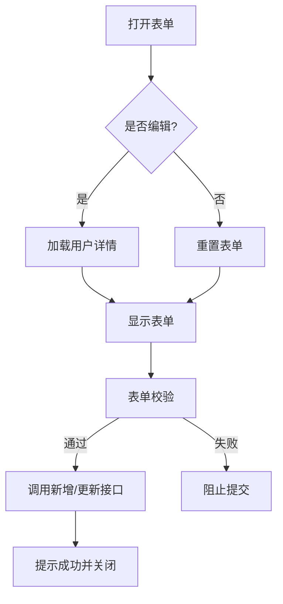

图表来源
- [yudao-ui-admin-vue3/src/views/system/user/UserForm.vue:153-199](file://yudao-ui-admin-vue3/src/views/system/user/UserForm.vue#L153-L199)

章节来源
- [yudao-ui-admin-vue3/src/views/system/user/UserForm.vue:1-220](file://yudao-ui-admin-vue3/src/views/system/user/UserForm.vue#L1-L220)

### 用户导入（UserImportForm.vue）
- 功能要点
  - 支持 .xlsx/.xls 文件上传，限制单文件。
  - 提供模板下载链接。
  - 上传时携带 Authorization 与 tenant-id 头。
  - 导入完成后展示新增、更新、失败的统计与明细。
- 错误处理
  - 上传失败提示重试。
  - 业务失败提示具体原因并清空文件。

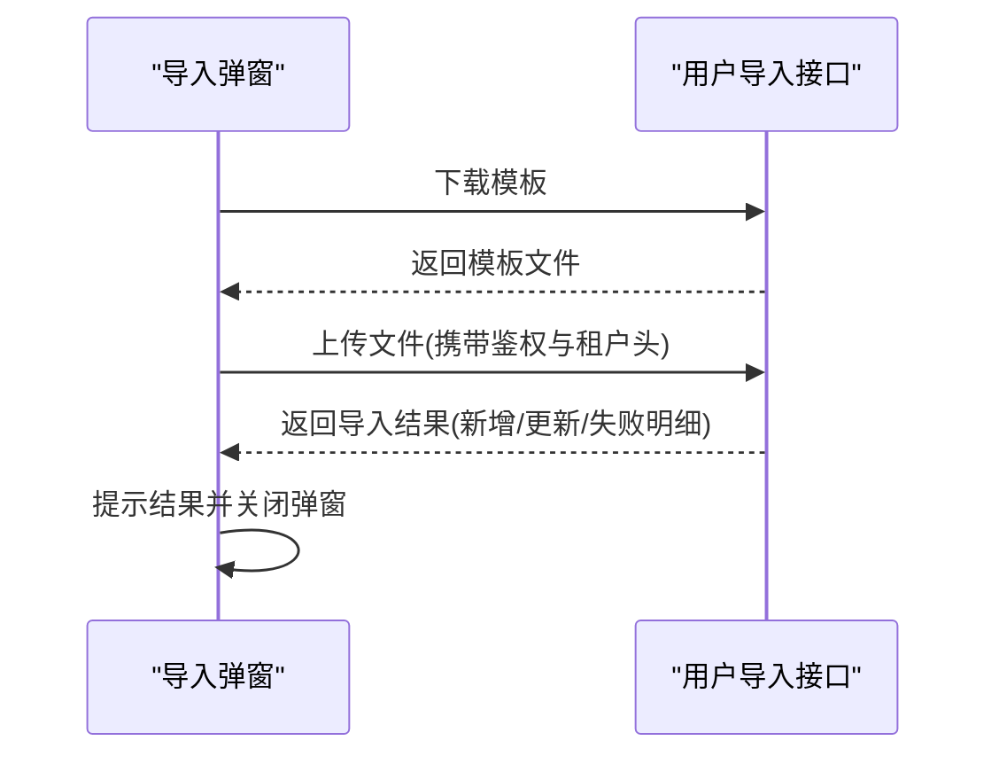

图表来源
- [yudao-ui-admin-vue3/src/views/system/user/UserImportForm.vue:61-137](file://yudao-ui-admin-vue3/src/views/system/user/UserImportForm.vue#L61-L137)

章节来源
- [yudao-ui-admin-vue3/src/views/system/user/UserImportForm.vue:1-139](file://yudao-ui-admin-vue3/src/views/system/user/UserImportForm.vue#L1-L139)

### 用户-角色分配（UserAssignRoleForm.vue）
- 功能要点
  - 展示用户基本信息（只读）。
  - 多选角色下拉框，加载用户已分配角色。
  - 保存时将用户ID与角色ID集合提交到权限接口。
- 权限继承说明
  - 用户获得角色后，将继承该角色的菜单权限与数据权限。
  - 若用户拥有多个角色，权限取并集（由后端权限模型决定）。

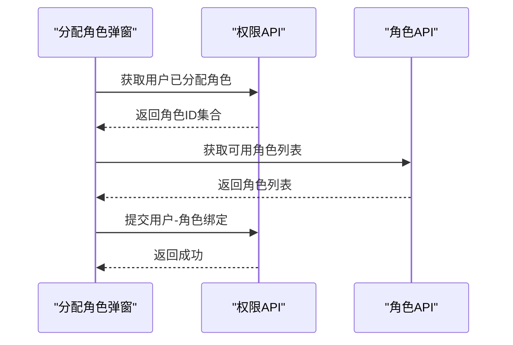

图表来源
- [yudao-ui-admin-vue3/src/views/system/user/UserAssignRoleForm.vue:44-84](file://yudao-ui-admin-vue3/src/views/system/user/UserAssignRoleForm.vue#L44-L84)

章节来源
- [yudao-ui-admin-vue3/src/views/system/user/UserAssignRoleForm.vue:1-97](file://yudao-ui-admin-vue3/src/views/system/user/UserAssignRoleForm.vue#L1-L97)

### 角色列表与操作（role/index.vue）
- 功能要点
  - 多条件查询：角色名称、标识、状态、创建时间范围。
  - 列表展示：编号、名称、类型、标识、排序、备注、状态、创建时间。
  - 操作项：编辑、菜单权限、数据权限、删除。
  - 批量删除与导出。
- 关键流程
  - 菜单权限：打开弹窗 -> 加载菜单树与已分配菜单 -> 保存选中节点。
  - 数据权限：选择数据范围与部门范围 -> 保存范围。

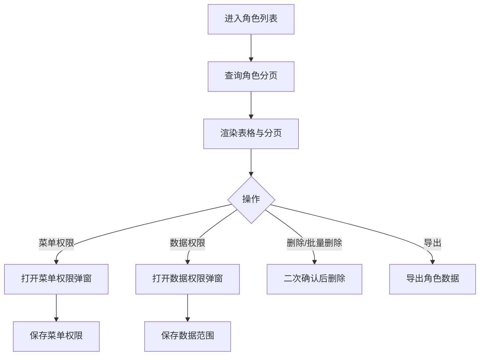

图表来源
- [yudao-ui-admin-vue3/src/views/system/role/index.vue:178-300](file://yudao-ui-admin-vue3/src/views/system/role/index.vue#L178-L300)

章节来源
- [yudao-ui-admin-vue3/src/views/system/role/index.vue:1-300](file://yudao-ui-admin-vue3/src/views/system/role/index.vue#L1-L300)

### 角色表单（RoleForm.vue）
- 字段与校验
  - 必填：角色名称、角色标识、显示顺序、状态。
  - 可选：备注。
- 交互流程
  - 打开弹窗：新增或编辑模式，编辑时加载详情。
  - 提交：校验通过后调用新增或更新接口，成功后关闭弹窗并通知父组件刷新。

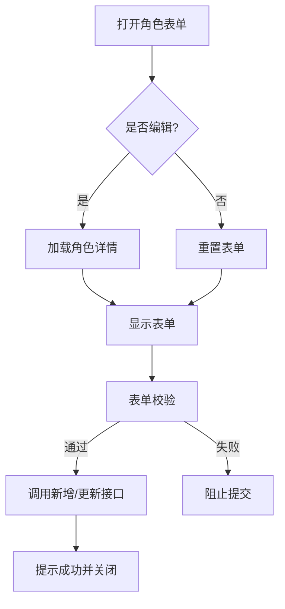

图表来源
- [yudao-ui-admin-vue3/src/views/system/role/RoleForm.vue:70-127](file://yudao-ui-admin-vue3/src/views/system/role/RoleForm.vue#L70-L127)

章节来源
- [yudao-ui-admin-vue3/src/views/system/role/RoleForm.vue:1-127](file://yudao-ui-admin-vue3/src/views/system/role/RoleForm.vue#L1-L127)

### 菜单权限（RoleAssignMenuForm.vue）
- 功能要点
  - 展示角色名称与标识。
  - 树形菜单选择：支持全选/全不选、全部展开/折叠。
  - 提交时包含选中节点与半选父节点。
- 交互流程
  - 打开弹窗：加载菜单树与角色已分配菜单 -> 设置选中 -> 保存。

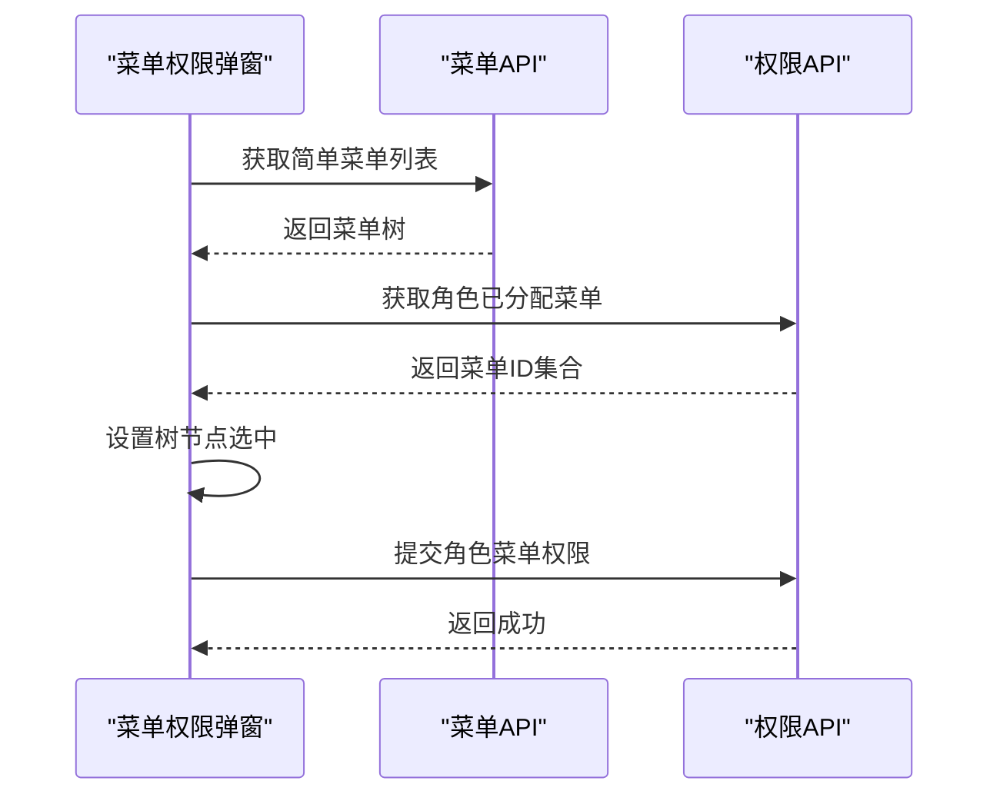

图表来源
- [yudao-ui-admin-vue3/src/views/system/role/RoleAssignMenuForm.vue:73-119](file://yudao-ui-admin-vue3/src/views/system/role/RoleAssignMenuForm.vue#L73-L119)

章节来源
- [yudao-ui-admin-vue3/src/views/system/role/RoleAssignMenuForm.vue:1-154](file://yudao-ui-admin-vue3/src/views/system/role/RoleAssignMenuForm.vue#L1-L154)

### 数据权限（RoleDataPermissionForm.vue）
- 功能要点
  - 选择数据范围（如全部、本部门、本部门及以下、自定义等）。
  - 当选择“自定义”时，选择部门范围（支持父子联动开关）。
  - 提交时根据数据范围决定是否携带部门ID集合。
- 交互流程
  - 打开弹窗：加载部门树与角色数据范围 -> 设置选中 -> 保存。

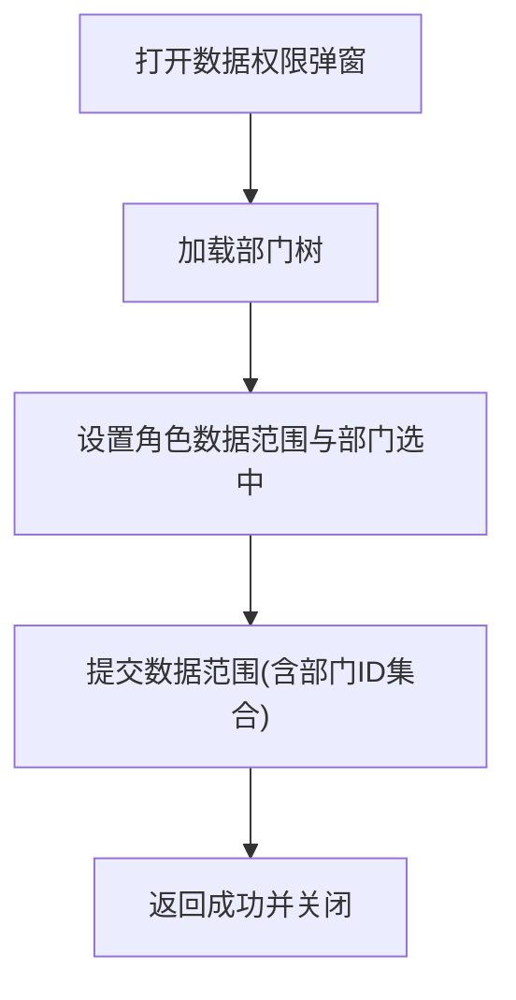

图表来源
- [yudao-ui-admin-vue3/src/views/system/role/RoleDataPermissionForm.vue:95-133](file://yudao-ui-admin-vue3/src/views/system/role/RoleDataPermissionForm.vue#L95-L133)

章节来源
- [yudao-ui-admin-vue3/src/views/system/role/RoleDataPermissionForm.vue:1-170](file://yudao-ui-admin-vue3/src/views/system/role/RoleDataPermissionForm.vue#L1-L170)

### 用户选择组件的使用与扩展
- 现有组件
  - 在 system/user/components 下提供 UserSelect、UserSelectDialogV2、UserSelectV2 等组件，用于在其它业务场景中快速选择用户。
- 使用方法
  - 在表单中引入组件，绑定 v-model 获取选中用户ID或对象。
  - 通过组件提供的 open/search 等方法实现弹窗选择或远程搜索。
- 扩展建议
  - 增加过滤条件：如按部门、状态、岗位筛选。
  - 支持多选/单选切换。
  - 增加选择后的展示与编辑能力（如直接编辑用户信息）。
  - 与权限系统联动：仅展示当前用户有权限查看的用户。

[本节为概念性内容，不直接分析具体文件]

## 依赖关系分析
- 页面与表单之间的耦合
  - 用户列表依赖用户表单、导入表单、分配角色表单。
  - 角色列表依赖角色表单、菜单权限表单、数据权限表单。
- 与 API 层的依赖
  - 用户相关：用户分页、详情、新增、更新、删除、状态更新、导入导出。
  - 角色相关：角色分页、详情、新增、更新、删除、导出。
  - 权限相关：用户-角色绑定、角色-菜单绑定、角色-数据范围绑定。
- 外部依赖
  - Element Plus 组件库（表格、表单、树、对话框等）。
  - 工具函数：字典、权限判断、日期格式化、下载、树形数据处理等。

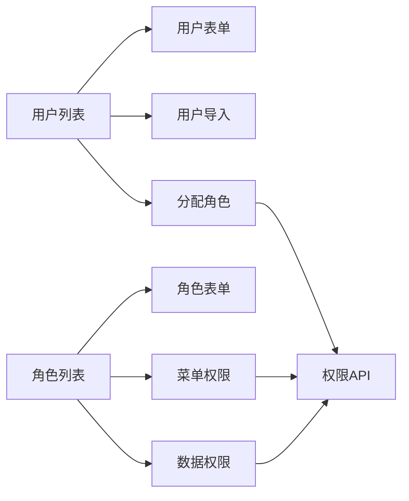

图表来源
- [yudao-ui-admin-vue3/src/views/system/user/index.vue:212-393](file://yudao-ui-admin-vue3/src/views/system/user/index.vue#L212-L393)
- [yudao-ui-admin-vue3/src/views/system/role/index.vue:178-300](file://yudao-ui-admin-vue3/src/views/system/role/index.vue#L178-L300)

章节来源
- [yudao-ui-admin-vue3/src/views/system/user/index.vue:212-393](file://yudao-ui-admin-vue3/src/views/system/user/index.vue#L212-L393)
- [yudao-ui-admin-vue3/src/views/system/role/index.vue:178-300](file://yudao-ui-admin-vue3/src/views/system/role/index.vue#L178-L300)

## 性能考虑
- 列表与分页
  - 合理设置 pageSize，避免一次性加载过多数据。
  - 使用懒加载与虚拟滚动（如需）提升大数据量体验。
- 树形结构
  - 菜单与部门树尽量使用“简单列表”接口并按需构建树，减少冗余数据。
  - 展开/折叠与全选/全不选操作应尽量减少 DOM 重绘。
- 导入导出
  - 大文件导入建议分片或异步处理，前端仅做上传与结果展示。
  - 导出时使用流式下载，避免内存占用过高。
- 权限计算
  - 菜单与数据权限在后端集中计算，前端只做展示与提交，降低前端复杂度。

[本节提供通用指导，不直接分析具体文件]

## 故障排查指南
- 常见错误与处理
  - 导入失败：检查文件格式、模板是否正确；查看导入结果中的失败明细。
  - 状态切换失败：确认权限与网络；必要时回滚状态。
  - 权限分配失败：检查用户/角色是否存在；确认权限接口返回码与消息。
  - 菜单/数据权限未生效：确认已正确提交并刷新；检查后端权限模型与缓存。
- 审计日志
  - 登录日志：可查看登录行为与异常。
  - 操作日志：记录关键操作的执行人与结果。
- 异常捕获
  - 统一错误提示：对网络异常、业务异常进行友好提示。
  - 表单校验失败：明确提示缺失或错误字段。

章节来源
- [yudao-ui-admin-vue3/src/views/system/user/UserImportForm.vue:85-118](file://yudao-ui-admin-vue3/src/views/system/user/UserImportForm.vue#L85-L118)
- [yudao-ui-admin-vue3/src/views/system/user/index.vue:285-300](file://yudao-ui-admin-vue3/src/views/system/user/index.vue#L285-L300)
- [yudao-ui-admin-vue3/src/views/system/role/RoleAssignMenuForm.vue:95-119](file://yudao-ui-admin-vue3/src/views/system/role/RoleAssignMenuForm.vue#L95-L119)
- [yudao-ui-admin-vue3/src/views/system/role/RoleDataPermissionForm.vue:113-133](file://yudao-ui-admin-vue3/src/views/system/role/RoleDataPermissionForm.vue#L113-L133)

## 结论
本界面实现了完整的用户与角色权限管理能力，涵盖用户信息维护、角色权限配置、用户-角色关联以及导入导出等常用场景。通过严格的表单校验、权限控制与审计日志，保障了系统的可用性与安全性。建议在后续迭代中持续优化大数据量下的性能表现，并完善用户选择组件的扩展能力。

[本节为总结性内容，不直接分析具体文件]

## 附录
- 最佳实践
  - 表单设计：必填字段清晰、提示信息明确、错误定位准确。
  - 权限控制：按钮级权限与接口级权限一致，避免越权。
  - 数据安全：敏感字段脱敏展示，传输加密。
  - 用户体验：操作反馈及时，支持撤销与回滚。
- 安全建议
  - 密码策略：强制复杂度与定期更换。
  - 会话管理：超时自动退出，防重放攻击。
  - 审计追踪：关键操作留痕，便于追溯。
- 参考路径
  - 用户列表与操作：[用户列表](file://yudao-ui-admin-vue3/src/views/system/user/index.vue)
  - 用户表单：[用户表单](file://yudao-ui-admin-vue3/src/views/system/user/UserForm.vue)
  - 用户导入：[用户导入](file://yudao-ui-admin-vue3/src/views/system/user/UserImportForm.vue)
  - 用户-角色分配：[分配角色](file://yudao-ui-admin-vue3/src/views/system/user/UserAssignRoleForm.vue)
  - 角色列表与操作：[角色列表](file://yudao-ui-admin-vue3/src/views/system/role/index.vue)
  - 角色表单：[角色表单](file://yudao-ui-admin-vue3/src/views/system/role/RoleForm.vue)
  - 菜单权限：[菜单权限](file://yudao-ui-admin-vue3/src/views/system/role/RoleAssignMenuForm.vue)
  - 数据权限：[数据权限](file://yudao-ui-admin-vue3/src/views/system/role/RoleDataPermissionForm.vue)

[本节为参考性内容，不直接分析具体文件]