# 系统管理界面

<cite>
**本文引用的文件**
- [用户列表](file://yudao-ui-admin-vue3/src/views/system/user/index.vue)
- [角色列表](file://yudao-ui-admin-vue3/src/views/system/role/index.vue)
- [部门列表](file://yudao-ui-admin-vue3/src/views/system/dept/index.vue)
- [字典类型列表](file://yudao-ui-admin-vue3/src/views/system/dict/index.vue)
- [参数配置列表](file://yudao-ui-admin-vue3/src/views/infra/config/index.vue)
- [定时任务列表](file://yudao-ui-admin-vue3/src/views/infra/job/index.vue)
- [API访问日志列表](file://yudao-ui-admin-vue3/src/views/infra/apiAccessLog/index.vue)
- [文件存储列表](file://yudao-ui-admin-vue3/src/views/infra/file/index.vue)
- [租户管理列表](file://yudao-ui-admin-vue3/src/views/system/tenant/index.vue)
</cite>

## 目录
1. [简介](#简介)
2. [项目结构](#项目结构)
3. [核心组件](#核心组件)
4. [架构总览](#架构总览)
5. [详细组件分析](#详细组件分析)
6. [依赖关系分析](#依赖关系分析)
7. [性能考虑](#性能考虑)
8. [故障排查指南](#故障排查指南)
9. [结论](#结论)
10. [附录](#附录)

## 简介
本文件面向系统管理界面的实现与使用，覆盖以下能力：
- 用户管理：用户信息维护、角色权限分配、部门组织架构管理
- 系统配置：参数配置、字典管理、系统开关控制
- 基础设施：文件存储管理、任务调度监控、日志查看与分析
- 权限控制：菜单权限、按钮权限、数据权限的实现方式
- 多租户与国际化：多租户支持与前端国际化配置方法
- 安全加固与审计：安全策略与操作审计日志的说明

## 项目结构
管理界面基于 Vue3 + Element Plus 的前端工程，按“模块-页面”组织。系统管理与基础设施管理分别位于 system 与 infra 目录下，每个功能以独立页面和表单弹窗组合实现，统一通过 API 层调用后端服务。

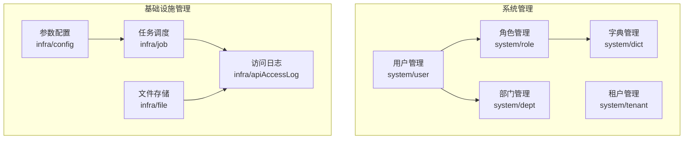

图表来源
- [用户列表:1-393](file://yudao-ui-admin-vue3/src/views/system/user/index.vue#L1-L393)
- [角色列表:1-300](file://yudao-ui-admin-vue3/src/views/system/role/index.vue#L1-L300)
- [部门列表:1-221](file://yudao-ui-admin-vue3/src/views/system/dept/index.vue#L1-L221)
- [字典类型列表:1-262](file://yudao-ui-admin-vue3/src/views/system/dict/index.vue#L1-L262)
- [参数配置列表:1-258](file://yudao-ui-admin-vue3/src/views/infra/config/index.vue#L1-L258)
- [定时任务列表:1-357](file://yudao-ui-admin-vue3/src/views/infra/job/index.vue#L1-L357)
- [文件存储列表:1-247](file://yudao-ui-admin-vue3/src/views/infra/file/index.vue#L1-L247)
- [API访问日志列表:1-227](file://yudao-ui-admin-vue3/src/views/infra/apiAccessLog/index.vue#L1-L227)

章节来源
- [用户列表:1-393](file://yudao-ui-admin-vue3/src/views/system/user/index.vue#L1-L393)
- [角色列表:1-300](file://yudao-ui-admin-vue3/src/views/system/role/index.vue#L1-L300)
- [部门列表:1-221](file://yudao-ui-admin-vue3/src/views/system/dept/index.vue#L1-L221)
- [字典类型列表:1-262](file://yudao-ui-admin-vue3/src/views/system/dict/index.vue#L1-L262)
- [参数配置列表:1-258](file://yudao-ui-admin-vue3/src/views/infra/config/index.vue#L1-L258)
- [定时任务列表:1-357](file://yudao-ui-admin-vue3/src/views/infra/job/index.vue#L1-L357)
- [文件存储列表:1-247](file://yudao-ui-admin-vue3/src/views/infra/file/index.vue#L1-L247)
- [API访问日志列表:1-227](file://yudao-ui-admin-vue3/src/views/infra/apiAccessLog/index.vue#L1-L227)

## 核心组件
- 用户管理：提供用户查询、新增、编辑、导入导出、批量删除、状态切换、重置密码、分配角色等能力；左侧集成部门树用于按部门筛选。
- 角色管理：支持角色增删改查、导出、批量删除；提供“菜单权限”“数据权限”两个关键子能力入口。
- 部门管理：树形表格展示，支持展开/折叠、负责人显示（联动用户）、批量删除。
- 字典管理：字典类型的增删改查与导出，支持跳转到具体字典数据页。
- 参数配置：系统参数的分页查询、新增、编辑、删除、导出，支持按名称/键名/类型/时间范围检索。
- 任务调度：任务列表、启停、执行一次、同步到调度器、查看任务详情与调度日志。
- 文件存储：文件上传、预览/下载、复制链接、批量删除，支持按路径/类型/时间范围检索。
- 访问日志：按用户、应用、时间、耗时、结果码等多维度检索，支持导出与查看详情。
- 租户管理：租户信息维护、套餐绑定、域名绑定、状态管理、导出与批量删除。

章节来源
- [用户列表:1-393](file://yudao-ui-admin-vue3/src/views/system/user/index.vue#L1-L393)
- [角色列表:1-300](file://yudao-ui-admin-vue3/src/views/system/role/index.vue#L1-L300)
- [部门列表:1-221](file://yudao-ui-admin-vue3/src/views/system/dept/index.vue#L1-L221)
- [字典类型列表:1-262](file://yudao-ui-admin-vue3/src/views/system/dict/index.vue#L1-L262)
- [参数配置列表:1-258](file://yudao-ui-admin-vue3/src/views/infra/config/index.vue#L1-L258)
- [定时任务列表:1-357](file://yudao-ui-admin-vue3/src/views/infra/job/index.vue#L1-L357)
- [文件存储列表:1-247](file://yudao-ui-admin-vue3/src/views/infra/file/index.vue#L1-L247)
- [API访问日志列表:1-227](file://yudao-ui-admin-vue3/src/views/infra/apiAccessLog/index.vue#L1-L227)
- [租户管理列表:1-305](file://yudao-ui-admin-vue3/src/views/system/tenant/index.vue#L1-L305)

## 架构总览
管理界面采用“页面-表单-弹窗-API”的分层模式：
- 页面层：负责搜索条件、列表渲染、分页、操作按钮与弹窗触发
- 表单层：封装新增/编辑/导入等复杂交互
- API层：统一调用后端接口，处理分页、导出、错误提示
- 权限层：通过指令与工具函数对按钮与菜单进行可见性控制

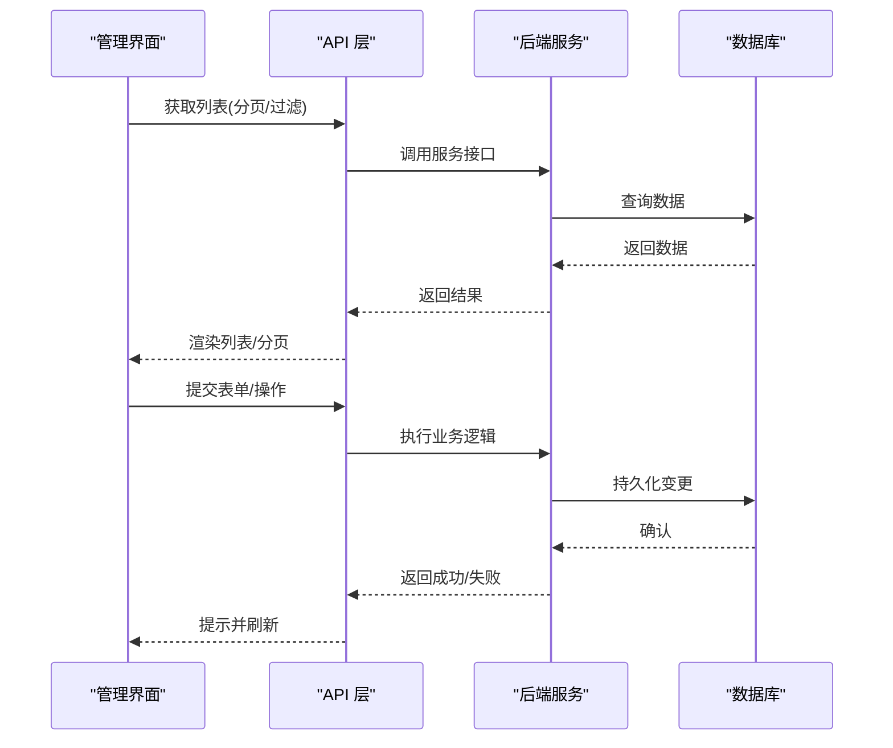

图表来源
- [用户列表:243-253](file://yudao-ui-admin-vue3/src/views/system/user/index.vue#L243-L253)
- [角色列表:206-216](file://yudao-ui-admin-vue3/src/views/system/role/index.vue#L206-L216)
- [参数配置列表:176-186](file://yudao-ui-admin-vue3/src/views/infra/config/index.vue#L176-L186)
- [定时任务列表:198-208](file://yudao-ui-admin-vue3/src/views/infra/job/index.vue#L198-L208)
- [文件存储列表:167-177](file://yudao-ui-admin-vue3/src/views/infra/file/index.vue#L167-L177)
- [API访问日志列表:177-186](file://yudao-ui-admin-vue3/src/views/infra/apiAccessLog/index.vue#L177-L186)

## 详细组件分析

### 用户管理
- 功能要点
  - 左侧部门树筛选，右侧列表支持用户名/手机/状态/创建时间多维查询
  - 支持新增、编辑、导入、导出、批量删除、状态切换、重置密码、分配角色
  - 按钮级权限控制：新增/导入/导出/删除/修改/更多下拉项均受权限指令或函数保护
- 交互流程（状态切换）
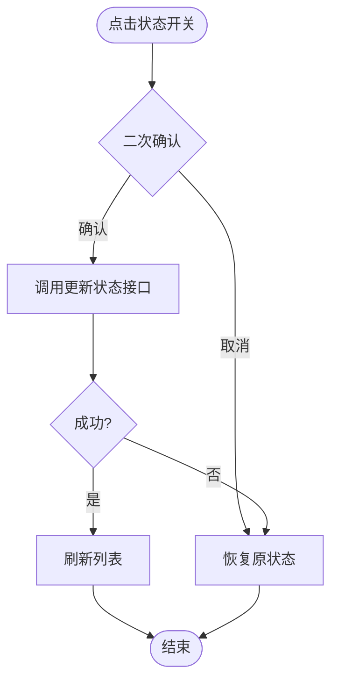

图表来源
- [用户列表:285-300](file://yudao-ui-admin-vue3/src/views/system/user/index.vue#L285-L300)

章节来源
- [用户列表:1-393](file://yudao-ui-admin-vue3/src/views/system/user/index.vue#L1-L393)

### 角色管理
- 功能要点
  - 角色增删改查、导出、批量删除
  - “菜单权限”“数据权限”两个子能力入口，分别对应菜单可见性与数据范围控制
- 交互流程（菜单权限分配）
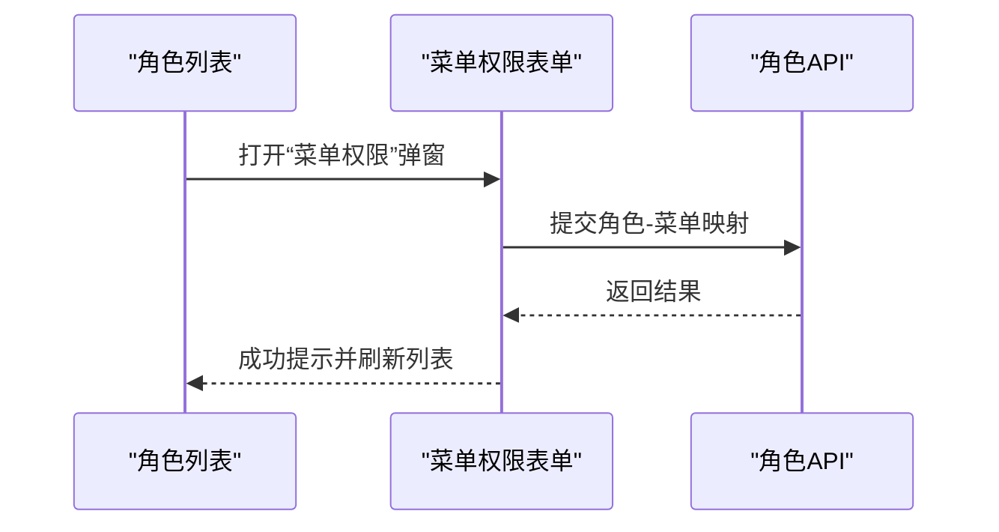

图表来源
- [角色列表:131-150](file://yudao-ui-admin-vue3/src/views/system/role/index.vue#L131-L150)
- [角色列表:236-246](file://yudao-ui-admin-vue3/src/views/system/role/index.vue#L236-L246)

章节来源
- [角色列表:1-300](file://yudao-ui-admin-vue3/src/views/system/role/index.vue#L1-L300)

### 部门管理
- 功能要点
  - 树形表格展示，支持展开/折叠、负责人显示（联动用户列表）
  - 支持新增、编辑、删除、批量删除
- 交互流程（展开/折叠）
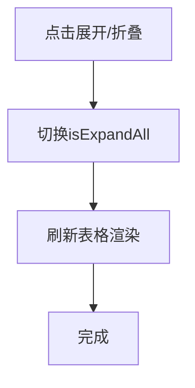

图表来源
- [部门列表:155-162](file://yudao-ui-admin-vue3/src/views/system/dept/index.vue#L155-L162)

章节来源
- [部门列表:1-221](file://yudao-ui-admin-vue3/src/views/system/dept/index.vue#L1-L221)

### 字典管理
- 功能要点
  - 字典类型增删改查与导出
  - 支持跳转到具体字典数据页进行数据维护
- 交互流程（跳转数据页）
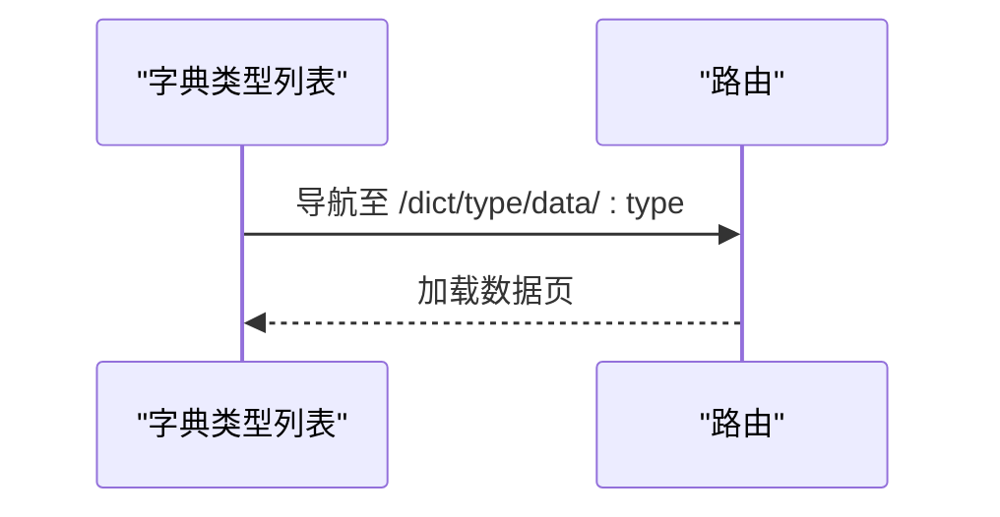

图表来源
- [字典类型列表:127-129](file://yudao-ui-admin-vue3/src/views/system/dict/index.vue#L127-L129)

章节来源
- [字典类型列表:1-262](file://yudao-ui-admin-vue3/src/views/system/dict/index.vue#L1-L262)

### 参数配置
- 功能要点
  - 参数名称/键名/类型/时间范围检索
  - 新增、编辑、删除、导出
  - 支持“是否可见”“系统内置”等字段展示
- 交互流程（导出）
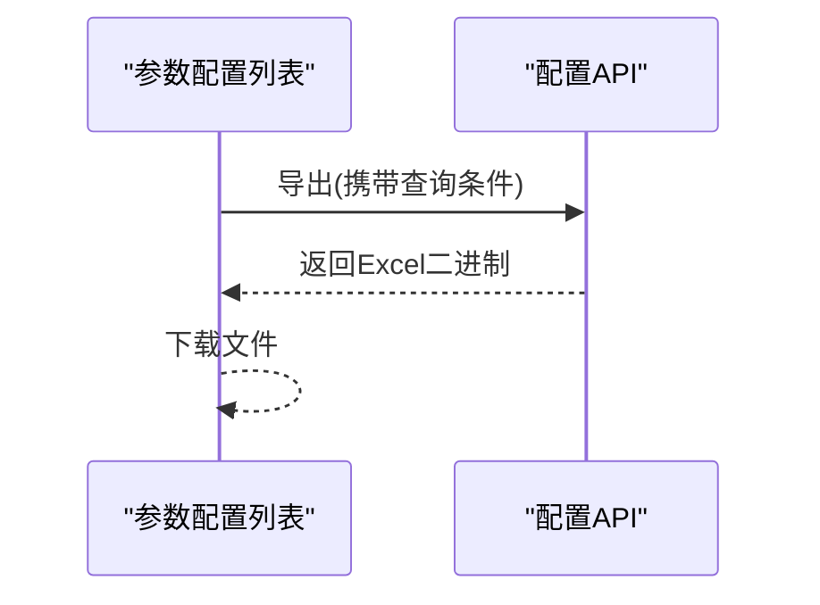

图表来源
- [参数配置列表:238-250](file://yudao-ui-admin-vue3/src/views/infra/config/index.vue#L238-L250)

章节来源
- [参数配置列表:1-258](file://yudao-ui-admin-vue3/src/views/infra/config/index.vue#L1-L258)

### 任务调度
- 功能要点
  - 任务列表、启停、执行一次、同步到调度器、查看任务详情与调度日志
  - 支持按名称/状态/处理器名检索与导出
- 交互流程（执行一次）
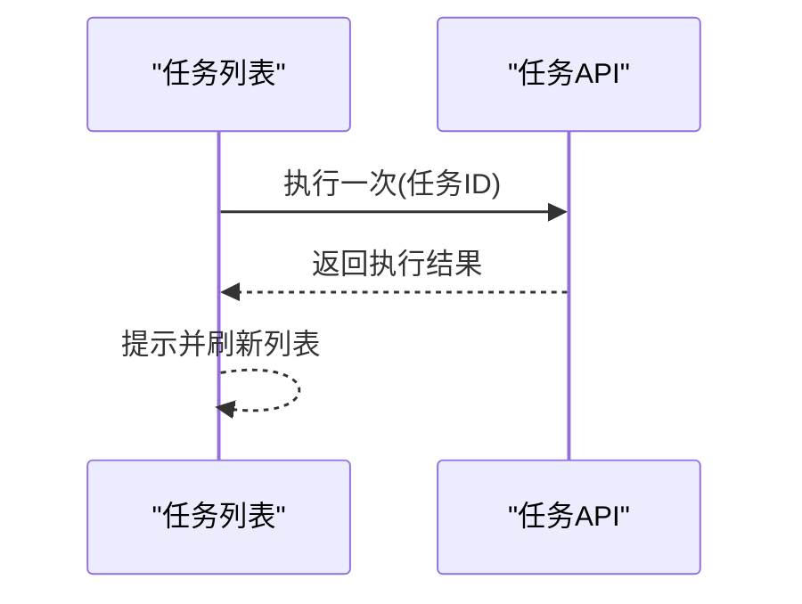

图表来源
- [定时任务列表:324-335](file://yudao-ui-admin-vue3/src/views/infra/job/index.vue#L324-L335)

章节来源
- [定时任务列表:1-357](file://yudao-ui-admin-vue3/src/views/infra/job/index.vue#L1-L357)

### 文件存储
- 功能要点
  - 文件上传、预览/下载、复制链接、批量删除
  - 支持按路径/类型/时间范围检索
- 交互流程（复制链接）
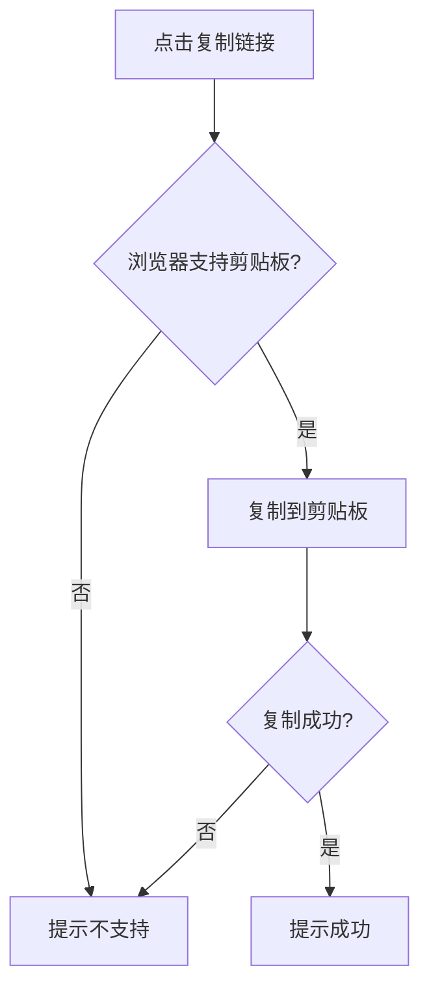

图表来源
- [文件存储列表:197-208](file://yudao-ui-admin-vue3/src/views/infra/file/index.vue#L197-L208)

章节来源
- [文件存储列表:1-247](file://yudao-ui-admin-vue3/src/views/infra/file/index.vue#L1-L247)

### API访问日志
- 功能要点
  - 多维度检索：用户编号/类型、应用名、请求时间、执行时长、结果码
  - 导出与查看详情
- 交互流程（查看详情）
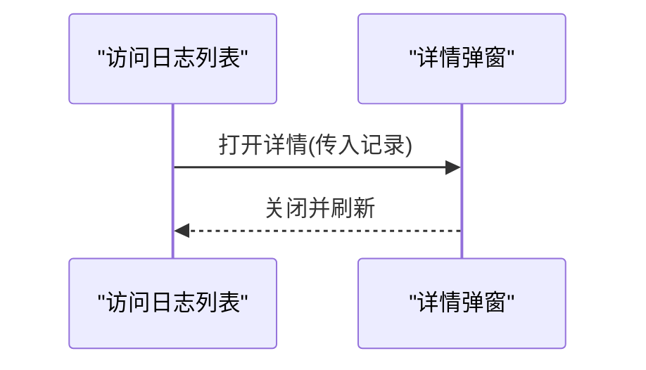

图表来源
- [API访问日志列表:201-205](file://yudao-ui-admin-vue3/src/views/infra/apiAccessLog/index.vue#L201-L205)

章节来源
- [API访问日志列表:1-227](file://yudao-ui-admin-vue3/src/views/infra/apiAccessLog/index.vue#L1-L227)

### 租户管理
- 功能要点
  - 租户信息维护、套餐绑定、域名绑定、状态管理、导出与批量删除
  - 列表展示账号额度、过期时间、绑定域名等
- 交互流程（导出）
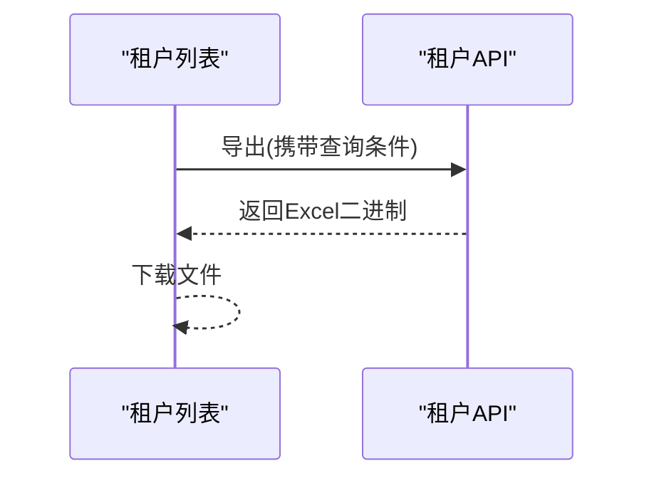

图表来源
- [租户管理列表:283-295](file://yudao-ui-admin-vue3/src/views/system/tenant/index.vue#L283-L295)

章节来源
- [租户管理列表:1-305](file://yudao-ui-admin-vue3/src/views/system/tenant/index.vue#L1-L305)

## 依赖关系分析
- 页面与API
  - 各页面通过统一的 API 模块发起请求，集中处理分页、导出与错误提示
- 页面与组件
  - 列表页复用通用 ContentWrap、Pagination、DictTag 等基础组件
  - 表单与弹窗通过 ref 暴露 open/close 方法，便于父组件控制
- 权限与交互
  - 按钮级权限通过 v-hasPermi 指令与 checkPermi 函数双重保障
  - 敏感操作（删除、状态切换、导出）均包含二次确认

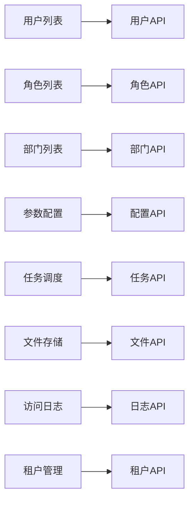

图表来源
- [用户列表:218-222](file://yudao-ui-admin-vue3/src/views/system/user/index.vue#L218-L222)
- [角色列表:179-185](file://yudao-ui-admin-vue3/src/views/system/role/index.vue#L179-L185)
- [部门列表:118-125](file://yudao-ui-admin-vue3/src/views/system/dept/index.vue#L118-L125)
- [参数配置列表:150-155](file://yudao-ui-admin-vue3/src/views/infra/config/index.vue#L150-L155)
- [定时任务列表:169-176](file://yudao-ui-admin-vue3/src/views/infra/job/index.vue#L169-L176)
- [文件存储列表:142-147](file://yudao-ui-admin-vue3/src/views/infra/file/index.vue#L142-L147)
- [API访问日志列表:149-154](file://yudao-ui-admin-vue3/src/views/infra/apiAccessLog/index.vue#L149-L154)
- [租户管理列表:192-198](file://yudao-ui-admin-vue3/src/views/system/tenant/index.vue#L192-L198)

章节来源
- [用户列表:218-222](file://yudao-ui-admin-vue3/src/views/system/user/index.vue#L218-L222)
- [角色列表:179-185](file://yudao-ui-admin-vue3/src/views/system/role/index.vue#L179-L185)
- [部门列表:118-125](file://yudao-ui-admin-vue3/src/views/system/dept/index.vue#L118-L125)
- [参数配置列表:150-155](file://yudao-ui-admin-vue3/src/views/infra/config/index.vue#L150-L155)
- [定时任务列表:169-176](file://yudao-ui-admin-vue3/src/views/infra/job/index.vue#L169-L176)
- [文件存储列表:142-147](file://yudao-ui-admin-vue3/src/views/infra/file/index.vue#L142-L147)
- [API访问日志列表:149-154](file://yudao-ui-admin-vue3/src/views/infra/apiAccessLog/index.vue#L149-L154)
- [租户管理列表:192-198](file://yudao-ui-admin-vue3/src/views/system/tenant/index.vue#L192-L198)

## 性能考虑
- 列表分页：所有列表默认分页加载，避免一次性拉取大量数据
- 懒加载与按需渲染：图片懒加载、长列表虚拟滚动建议结合业务场景启用
- 导出优化：导出前二次确认，避免误操作导致大文件生成
- 缓存与去抖：搜索框输入可考虑防抖，减少频繁请求
- 资源压缩：静态资源与第三方库按需引入，减少首屏体积

[本节为通用指导，不直接分析具体文件]

## 故障排查指南
- 常见问题定位
  - 列表无数据：检查查询条件、分页参数与后端接口返回
  - 按钮不可用：检查权限指令与当前用户权限集合
  - 导出失败：检查网络与后端导出接口状态码
  - 任务无法执行：检查任务状态、处理器是否存在、调度器同步是否成功
- 日志与审计
  - 访问日志：通过 API 访问日志查看请求链路、耗时与结果码
  - 操作日志：通过系统操作日志查看关键操作的审计记录
- 快速修复步骤
  - 清空查询条件重试
  - 重新登录刷新权限
  - 重启任务或同步任务到调度器
  - 查看相关日志详情定位根因

章节来源
- [API访问日志列表:1-227](file://yudao-ui-admin-vue3/src/views/infra/apiAccessLog/index.vue#L1-L227)
- [定时任务列表:1-357](file://yudao-ui-admin-vue3/src/views/infra/job/index.vue#L1-L357)

## 结论
本系统管理界面以模块化、组件化的方式实现了用户、角色、部门、字典、参数配置、任务调度、文件存储、访问日志与租户管理等核心能力。通过统一的权限控制与二次确认机制，保障了操作的安全性与一致性。配合完善的日志与审计能力，便于问题定位与合规追溯。

[本节为总结性内容，不直接分析具体文件]

## 附录

### 权限控制机制
- 菜单权限：由后端返回的菜单结构与路由守卫共同决定侧边栏与路由可见性
- 按钮权限：通过 v-hasPermi 指令与 checkPermi 函数在模板中控制按钮显隐
- 数据权限：角色数据权限范围影响列表数据的可见范围（如部门、租户维度）

章节来源
- [用户列表:73-102](file://yudao-ui-admin-vue3/src/views/system/user/index.vue#L73-L102)
- [角色列表:131-150](file://yudao-ui-admin-vue3/src/views/system/role/index.vue#L131-L150)

### 多租户支持与国际化配置
- 多租户支持：租户管理页面提供租户信息维护、套餐绑定、域名绑定与状态管理；列表展示账号额度与过期时间
- 国际化：界面使用 i18n 工具进行文案国际化，统一通过 t('...') 获取本地化文本

章节来源
- [租户管理列表:1-305](file://yudao-ui-admin-vue3/src/views/system/tenant/index.vue#L1-L305)
- [用户列表:226-228](file://yudao-ui-admin-vue3/src/views/system/user/index.vue#L226-L228)
- [角色列表:189-191](file://yudao-ui-admin-vue3/src/views/system/role/index.vue#L189-L191)
- [参数配置列表:159-161](file://yudao-ui-admin-vue3/src/views/infra/config/index.vue#L159-L161)
- [定时任务列表:179-181](file://yudao-ui-admin-vue3/src/views/infra/job/index.vue#L179-L181)
- [文件存储列表:151-153](file://yudao-ui-admin-vue3/src/views/infra/file/index.vue#L151-L153)
- [API访问日志列表:158-160](file://yudao-ui-admin-vue3/src/views/infra/apiAccessLog/index.vue#L158-L160)

### 安全加固与审计日志
- 安全加固
  - 敏感操作二次确认（删除、状态切换、导出）
  - 按钮级权限控制，防止越权操作
  - 文件上传与预览需校验类型与大小（结合后端策略）
- 审计日志
  - API 访问日志记录请求链路、耗时与结果码
  - 操作日志记录关键业务操作，便于审计与回溯

章节来源
- [用户列表:285-300](file://yudao-ui-admin-vue3/src/views/system/user/index.vue#L285-L300)
- [角色列表:248-259](file://yudao-ui-admin-vue3/src/views/system/role/index.vue#L248-L259)
- [参数配置列表:206-217](file://yudao-ui-admin-vue3/src/views/infra/config/index.vue#L206-L217)
- [定时任务列表:257-273](file://yudao-ui-admin-vue3/src/views/infra/job/index.vue#L257-L273)
- [文件存储列表:210-221](file://yudao-ui-admin-vue3/src/views/infra/file/index.vue#L210-L221)
- [API访问日志列表:1-227](file://yudao-ui-admin-vue3/src/views/infra/apiAccessLog/index.vue#L1-L227)