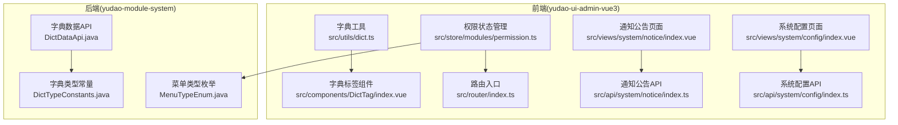
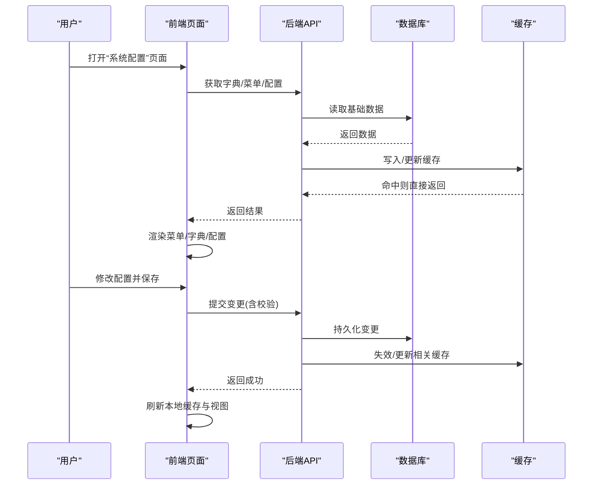
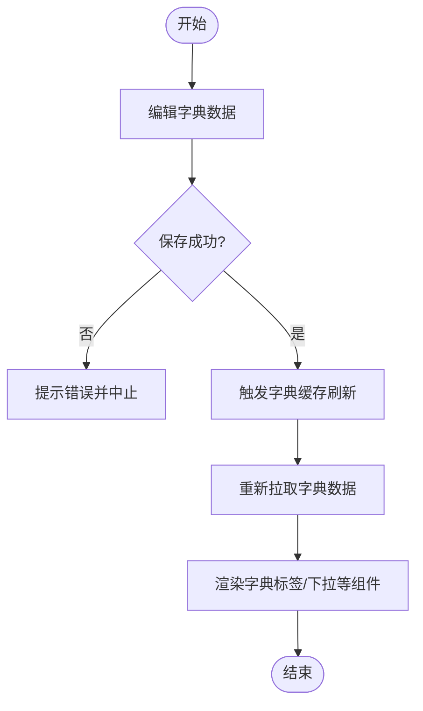
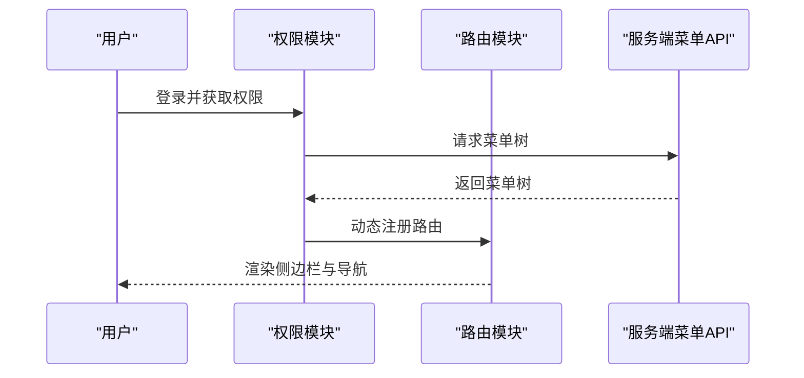
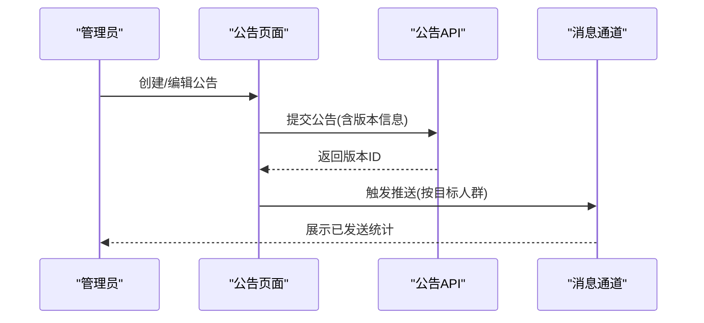
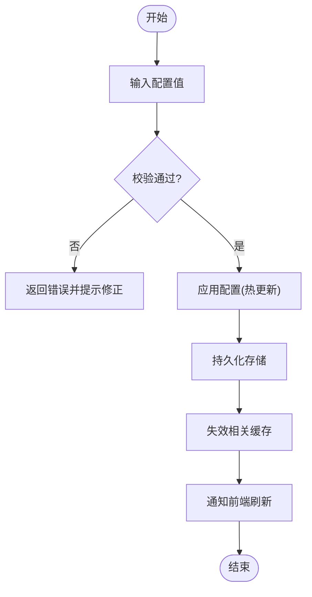
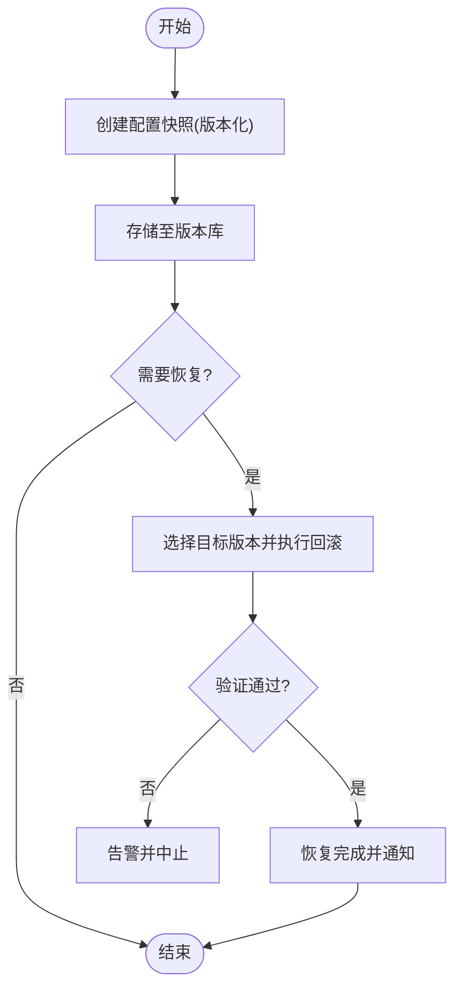
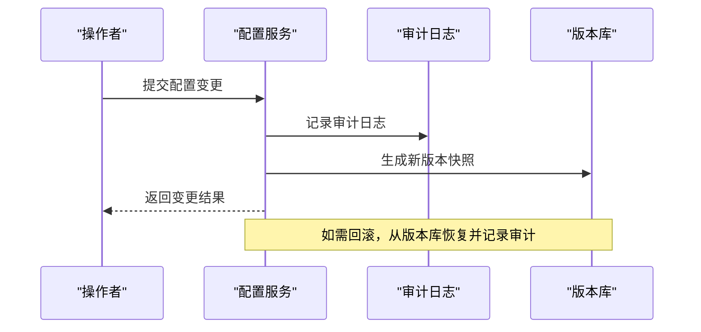
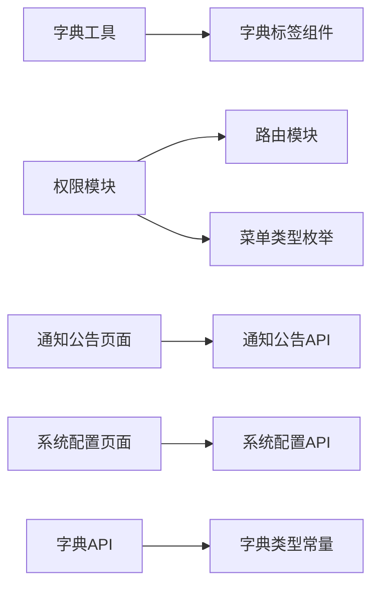

# 系统配置管理界面

<cite>
**本文引用的文件**
- [yudao-module-system-api/DictTypeConstants.java](file://yudao-cloud/yudao-module-system/yudao-module-system-api/src/main/java/cn/iocoder/yudao/module/system/enums/DictTypeConstants.java)
- [yudao-module-system-api/DictDataApi.java](file://yudao-cloud/yudao-module-system/yudao-module-system-api/src/main/java/cn/iocoder/yudao/module/system/api/dict/DictDataApi.java)
- [yudao-module-system-server/MenuTypeEnum.java](file://yudao-cloud/yudao-module-system/yudao-module-system-api/src/main/java/cn/iocoder/yudao/module/system/enums/permission/MenuTypeEnum.java)
- [yudao-ui-admin-vue3/src/utils/dict.ts](file://yudao-ui-admin-vue3/src/utils/dict.ts)
- [yudao-ui-admin-vue3/src/components/DictTag/index.vue](file://yudao-ui-admin-vue3/src/components/DictTag/index.vue)
- [yudao-ui-admin-vue3/src/store/modules/permission.ts](file://yudao-ui-admin-vue3/src/store/modules/permission.ts)
- [yudao-ui-admin-vue3/src/router/index.ts](file://yudao-ui-admin-vue3/src/router/index.ts)
- [yudao-ui-admin-vue3/src/views/system/notice/index.vue](file://yudao-ui-admin-vue3/src/views/system/notice/index.vue)
- [yudao-ui-admin-vue3/src/api/system/notice/index.ts](file://yudao-ui-admin-vue3/src/api/system/notice/index.ts)
- [yudao-ui-admin-vue3/src/api/system/config/index.ts](file://yudao-ui-admin-vue3/src/api/system/config/index.ts)
- [yudao-ui-admin-vue3/src/views/system/config/index.vue](file://yudao-ui-admin-vue3/src/views/system/config/index.vue)
</cite>

## 目录
1. [简介](#简介)
2. [项目结构](#项目结构)
3. [核心组件](#核心组件)
4. [架构总览](#架构总览)
5. [详细组件分析](#详细组件分析)
6. [依赖关系分析](#依赖关系分析)
7. [性能考虑](#性能考虑)
8. [故障排查指南](#故障排查指南)
9. [结论](#结论)
10. [附录](#附录)

## 简介
本文件面向“系统配置管理界面”的文档化说明，覆盖以下能力：
- 字典管理：字典类型定义、字典数据维护与缓存刷新
- 菜单配置：菜单树形结构、权限控制与动态路由生成
- 通知公告：公告发布、版本管理与用户触达
- 系统参数：热更新机制与配置验证规则
- 备份恢复与版本控制：配置变更的备份恢复方案与版本控制策略
- 审计跟踪与回滚：配置变更的审计记录与回滚机制

## 项目结构
围绕系统配置管理，前端位于 yudao-ui-admin-vue3，后端能力由 yudao-module-system 提供。关键路径包括：
- 字典：API 接口定义与前端工具、标签组件
- 菜单与权限：权限状态管理、路由注册与菜单枚举
- 通知公告：前端页面与 API
- 系统配置：前端页面与 API

图表来源
- [yudao-ui-admin-vue3/src/utils/dict.ts](file://yudao-ui-admin-vue3/src/utils/dict.ts)
- [yudao-ui-admin-vue3/src/components/DictTag/index.vue](file://yudao-ui-admin-vue3/src/components/DictTag/index.vue)
- [yudao-ui-admin-vue3/src/store/modules/permission.ts](file://yudao-ui-admin-vue3/src/store/modules/permission.ts)
- [yudao-ui-admin-vue3/src/router/index.ts](file://yudao-ui-admin-vue3/src/router/index.ts)
- [yudao-ui-admin-vue3/src/views/system/notice/index.vue](file://yudao-ui-admin-vue3/src/views/system/notice/index.vue)
- [yudao-ui-admin-vue3/src/api/system/notice/index.ts](file://yudao-ui-admin-vue3/src/api/system/notice/index.ts)
- [yudao-ui-admin-vue3/src/views/system/config/index.vue](file://yudao-ui-admin-vue3/src/views/system/config/index.vue)
- [yudao-ui-admin-vue3/src/api/system/config/index.ts](file://yudao-ui-admin-vue3/src/api/system/config/index.ts)
- [yudao-module-system-api/DictTypeConstants.java](file://yudao-cloud/yudao-module-system/yudao-module-system-api/src/main/java/cn/iocoder/yudao/module/system/enums/DictTypeConstants.java)
- [yudao-module-system-api/DictDataApi.java](file://yudao-cloud/yudao-module-system/yudao-module-system-api/src/main/java/cn/iocoder/yudao/module/system/api/dict/DictDataApi.java)
- [yudao-module-system-server/MenuTypeEnum.java](file://yudao-cloud/yudao-module-system/yudao-module-system-api/src/main/java/cn/iocoder/yudao/module/system/enums/permission/MenuTypeEnum.java)

章节来源
- [yudao-ui-admin-vue3/src/utils/dict.ts](file://yudao-ui-admin-vue3/src/utils/dict.ts)
- [yudao-ui-admin-vue3/src/components/DictTag/index.vue](file://yudao-ui-admin-vue3/src/components/DictTag/index.vue)
- [yudao-ui-admin-vue3/src/store/modules/permission.ts](file://yudao-ui-admin-vue3/src/store/modules/permission.ts)
- [yudao-ui-admin-vue3/src/router/index.ts](file://yudao-ui-admin-vue3/src/router/index.ts)
- [yudao-ui-admin-vue3/src/views/system/notice/index.vue](file://yudao-ui-admin-vue3/src/views/system/notice/index.vue)
- [yudao-ui-admin-vue3/src/api/system/notice/index.ts](file://yudao-ui-admin-vue3/src/api/system/notice/index.ts)
- [yudao-ui-admin-vue3/src/views/system/config/index.vue](file://yudao-ui-admin-vue3/src/views/system/config/index.vue)
- [yudao-ui-admin-vue3/src/api/system/config/index.ts](file://yudao-ui-admin-vue3/src/api/system/config/index.ts)
- [yudao-module-system-api/DictTypeConstants.java](file://yudao-cloud/yudao-module-system/yudao-module-system-api/src/main/java/cn/iocoder/yudao/module/system/enums/DictTypeConstants.java)
- [yudao-module-system-api/DictDataApi.java](file://yudao-cloud/yudao-module-system/yudao-module-system-api/src/main/java/cn/iocoder/yudao/module/system/api/dict/DictDataApi.java)
- [yudao-module-system-server/MenuTypeEnum.java](file://yudao-cloud/yudao-module-system/yudao-module-system-api/src/main/java/cn/iocoder/yudao/module/system/enums/permission/MenuTypeEnum.java)

## 核心组件
- 字典管理
  - 字典类型定义：通过统一常量集中管理字典类型键，便于前后端对齐与扩展。
  - 字典数据维护：提供字典数据的查询、新增、修改、删除等能力。
  - 字典缓存刷新：前端在字典数据变更后主动刷新本地缓存，保证展示一致性。
- 菜单配置
  - 菜单树形结构：基于菜单类型枚举构建层级菜单。
  - 权限控制：结合用户角色/权限集合，过滤可访问菜单。
  - 动态路由生成：根据权限与菜单信息动态注册路由，实现按需加载。
- 通知公告
  - 公告发布：支持富文本/模板内容编辑与发布。
  - 版本管理：对公告进行版本化管理，便于回溯与灰度。
  - 用户触达：按目标人群或全局推送，确保通知到达。
- 系统参数
  - 热更新：在不重启服务的情况下，将配置变更实时生效到运行期。
  - 配置验证：在保存前进行格式、范围、依赖等校验，防止非法配置进入生产。
- 备份恢复与版本控制
  - 备份恢复：对关键配置进行快照备份与一键恢复。
  - 版本控制：为每次变更生成版本号，支持对比与回滚。
- 审计跟踪与回滚
  - 审计跟踪：记录操作人、时间、变更内容与影响范围。
  - 回滚机制：基于版本快照快速恢复到历史稳定版本。

章节来源
- [yudao-module-system-api/DictTypeConstants.java](file://yudao-cloud/yudao-module-system/yudao-module-system-api/src/main/java/cn/iocoder/yudao/module/system/enums/DictTypeConstants.java)
- [yudao-module-system-api/DictDataApi.java](file://yudao-cloud/yudao-module-system/yudao-module-system-api/src/main/java/cn/iocoder/yudao/module/system/api/dict/DictDataApi.java)
- [yudao-ui-admin-vue3/src/utils/dict.ts](file://yudao-ui-admin-vue3/src/utils/dict.ts)
- [yudao-ui-admin-vue3/src/components/DictTag/index.vue](file://yudao-ui-admin-vue3/src/components/DictTag/index.vue)
- [yudao-ui-admin-vue3/src/store/modules/permission.ts](file://yudao-ui-admin-vue3/src/store/modules/permission.ts)
- [yudao-ui-admin-vue3/src/router/index.ts](file://yudao-ui-admin-vue3/src/router/index.ts)
- [yudao-ui-admin-vue3/src/views/system/notice/index.vue](file://yudao-ui-admin-vue3/src/views/system/notice/index.vue)
- [yudao-ui-admin-vue3/src/api/system/notice/index.ts](file://yudao-ui-admin-vue3/src/api/system/notice/index.ts)
- [yudao-ui-admin-vue3/src/views/system/config/index.vue](file://yudao-ui-admin-vue3/src/views/system/config/index.vue)
- [yudao-ui-admin-vue3/src/api/system/config/index.ts](file://yudao-ui-admin-vue3/src/api/system/config/index.ts)

## 架构总览
系统配置管理采用前后端分离架构：
- 前端负责交互、表单校验、缓存与动态路由注册
- 后端提供统一的字典、菜单、通知、配置等能力
- 通过 API 契约连接前后端，配合权限与缓存机制保障一致性与性能

图表来源
- [yudao-ui-admin-vue3/src/views/system/config/index.vue](file://yudao-ui-admin-vue3/src/views/system/config/index.vue)
- [yudao-ui-admin-vue3/src/api/system/config/index.ts](file://yudao-ui-admin-vue3/src/api/system/config/index.ts)
- [yudao-module-system-api/DictDataApi.java](file://yudao-cloud/yudao-module-system/yudao-module-system-api/src/main/java/cn/iocoder/yudao/module/system/api/dict/DictDataApi.java)

## 详细组件分析

### 字典管理
- 字典类型定义
  - 通过集中常量管理字典类型键，避免硬编码，提升可维护性。
- 字典数据维护
  - 提供字典项的增删改查能力，支持批量操作与导入导出（如存在）。
- 字典缓存刷新
  - 前端在字典数据变更后调用刷新接口，清空本地缓存并重新拉取最新数据。

图表来源
- [yudao-ui-admin-vue3/src/utils/dict.ts](file://yudao-ui-admin-vue3/src/utils/dict.ts)
- [yudao-ui-admin-vue3/src/components/DictTag/index.vue](file://yudao-ui-admin-vue3/src/components/DictTag/index.vue)
- [yudao-module-system-api/DictDataApi.java](file://yudao-cloud/yudao-module-system/yudao-module-system-api/src/main/java/cn/iocoder/yudao/module/system/api/dict/DictDataApi.java)

章节来源
- [yudao-module-system-api/DictTypeConstants.java](file://yudao-cloud/yudao-module-system/yudao-module-system-api/src/main/java/cn/iocoder/yudao/module/system/enums/DictTypeConstants.java)
- [yudao-module-system-api/DictDataApi.java](file://yudao-cloud/yudao-module-system/yudao-module-system-api/src/main/java/cn/iocoder/yudao/module/system/api/dict/DictDataApi.java)
- [yudao-ui-admin-vue3/src/utils/dict.ts](file://yudao-ui-admin-vue3/src/utils/dict.ts)
- [yudao-ui-admin-vue3/src/components/DictTag/index.vue](file://yudao-ui-admin-vue3/src/components/DictTag/index.vue)

### 菜单配置
- 菜单树形结构
  - 基于菜单类型枚举组织父子关系，形成可展开的树形菜单。
- 权限控制
  - 根据当前用户权限集合过滤菜单，未授权菜单不显示。
- 动态路由生成
  - 根据菜单信息与权限，动态注册路由，实现按需加载与访问控制。

图表来源
- [yudao-ui-admin-vue3/src/store/modules/permission.ts](file://yudao-ui-admin-vue3/src/store/modules/permission.ts)
- [yudao-ui-admin-vue3/src/router/index.ts](file://yudao-ui-admin-vue3/src/router/index.ts)
- [yudao-module-system-server/MenuTypeEnum.java](file://yudao-cloud/yudao-module-system/yudao-module-system-api/src/main/java/cn/iocoder/yudao/module/system/enums/permission/MenuTypeEnum.java)

章节来源
- [yudao-ui-admin-vue3/src/store/modules/permission.ts](file://yudao-ui-admin-vue3/src/store/modules/permission.ts)
- [yudao-ui-admin-vue3/src/router/index.ts](file://yudao-ui-admin-vue3/src/router/index.ts)
- [yudao-module-system-server/MenuTypeEnum.java](file://yudao-cloud/yudao-module-system/yudao-module-system-api/src/main/java/cn/iocoder/yudao/module/system/enums/permission/MenuTypeEnum.java)

### 通知公告
- 公告发布
  - 支持富文本/模板编辑，设置标题、内容、可见范围与优先级。
- 版本管理
  - 每次发布生成新版本，保留历史版本以便回溯与对比。
- 用户触达
  - 支持按角色/部门/全员等维度推送，确保消息到达目标用户。

图表来源
- [yudao-ui-admin-vue3/src/views/system/notice/index.vue](file://yudao-ui-admin-vue3/src/views/system/notice/index.vue)
- [yudao-ui-admin-vue3/src/api/system/notice/index.ts](file://yudao-ui-admin-vue3/src/api/system/notice/index.ts)

章节来源
- [yudao-ui-admin-vue3/src/views/system/notice/index.vue](file://yudao-ui-admin-vue3/src/views/system/notice/index.vue)
- [yudao-ui-admin-vue3/src/api/system/notice/index.ts](file://yudao-ui-admin-vue3/src/api/system/notice/index.ts)

### 系统参数与热更新
- 热更新机制
  - 配置变更后即时生效，无需重启服务；通常通过内存缓存/配置中心同步更新。
- 配置验证规则
  - 保存前进行格式、取值范围、依赖关系等校验，失败则拒绝提交并给出明确提示。

图表来源
- [yudao-ui-admin-vue3/src/views/system/config/index.vue](file://yudao-ui-admin-vue3/src/views/system/config/index.vue)
- [yudao-ui-admin-vue3/src/api/system/config/index.ts](file://yudao-ui-admin-vue3/src/api/system/config/index.ts)

章节来源
- [yudao-ui-admin-vue3/src/views/system/config/index.vue](file://yudao-ui-admin-vue3/src/views/system/config/index.vue)
- [yudao-ui-admin-vue3/src/api/system/config/index.ts](file://yudao-ui-admin-vue3/src/api/system/config/index.ts)

### 备份恢复与版本控制
- 备份恢复
  - 对关键配置进行快照备份，支持一键恢复到指定版本。
- 版本控制
  - 每次变更生成唯一版本号，支持版本对比、差异查看与回滚。

[本节为概念流程，不直接映射具体源码文件]

### 审计跟踪与回滚机制
- 审计跟踪
  - 记录操作人、时间、变更前后的值、影响范围与审批信息。
- 回滚机制
  - 基于版本快照快速回滚，确保异常变更可逆。

[本节为概念流程，不直接映射具体源码文件]

## 依赖关系分析
- 前端依赖
  - 字典工具与标签组件依赖字典缓存与API
  - 权限模块依赖菜单与路由注册
  - 通知公告与系统配置页面依赖各自API
- 后端依赖
  - 字典API依赖字典类型常量
  - 菜单枚举支撑前端树形结构与权限判断

图表来源
- [yudao-ui-admin-vue3/src/utils/dict.ts](file://yudao-ui-admin-vue3/src/utils/dict.ts)
- [yudao-ui-admin-vue3/src/components/DictTag/index.vue](file://yudao-ui-admin-vue3/src/components/DictTag/index.vue)
- [yudao-ui-admin-vue3/src/store/modules/permission.ts](file://yudao-ui-admin-vue3/src/store/modules/permission.ts)
- [yudao-ui-admin-vue3/src/router/index.ts](file://yudao-ui-admin-vue3/src/router/index.ts)
- [yudao-ui-admin-vue3/src/views/system/notice/index.vue](file://yudao-ui-admin-vue3/src/views/system/notice/index.vue)
- [yudao-ui-admin-vue3/src/api/system/notice/index.ts](file://yudao-ui-admin-vue3/src/api/system/notice/index.ts)
- [yudao-ui-admin-vue3/src/views/system/config/index.vue](file://yudao-ui-admin-vue3/src/views/system/config/index.vue)
- [yudao-ui-admin-vue3/src/api/system/config/index.ts](file://yudao-ui-admin-vue3/src/api/system/config/index.ts)
- [yudao-module-system-api/DictTypeConstants.java](file://yudao-cloud/yudao-module-system/yudao-module-system-api/src/main/java/cn/iocoder/yudao/module/system/enums/DictTypeConstants.java)
- [yudao-module-system-api/DictDataApi.java](file://yudao-cloud/yudao-module-system/yudao-module-system-api/src/main/java/cn/iocoder/yudao/module/system/api/dict/DictDataApi.java)
- [yudao-module-system-server/MenuTypeEnum.java](file://yudao-cloud/yudao-module-system/yudao-module-system-api/src/main/java/cn/iocoder/yudao/module/system/enums/permission/MenuTypeEnum.java)

章节来源
- [同上各文件引用](file://yudao-ui-admin-vue3/src/utils/dict.ts)

## 性能考虑
- 字典缓存
  - 使用本地缓存减少重复请求，仅在变更时刷新，降低后端压力。
- 菜单懒加载
  - 动态路由按需加载，减少首屏资源体积。
- 配置热更新
  - 通过缓存失效与增量更新，避免全量重建，提高响应速度。
- 通知推送
  - 按目标人群分批推送，避免瞬时峰值造成阻塞。

[本节为通用性能建议，不直接映射具体源码文件]

## 故障排查指南
- 字典不显示或显示旧值
  - 检查是否调用了字典缓存刷新接口
  - 确认字典数据已成功保存且后端缓存已更新
- 菜单权限异常
  - 核对用户权限集合是否正确加载
  - 检查动态路由是否按权限正确注册
- 通知未送达
  - 确认目标人群筛选条件与推送通道配置
  - 查看推送任务执行日志与重试情况
- 配置热更新无效
  - 检查配置校验是否通过
  - 确认缓存失效逻辑是否执行

章节来源
- [yudao-ui-admin-vue3/src/utils/dict.ts](file://yudao-ui-admin-vue3/src/utils/dict.ts)
- [yudao-ui-admin-vue3/src/store/modules/permission.ts](file://yudao-ui-admin-vue3/src/store/modules/permission.ts)
- [yudao-ui-admin-vue3/src/views/system/config/index.vue](file://yudao-ui-admin-vue3/src/views/system/config/index.vue)
- [yudao-ui-admin-vue3/src/api/system/config/index.ts](file://yudao-ui-admin-vue3/src/api/system/config/index.ts)

## 结论
本系统配置管理界面以字典、菜单、通知、参数为核心，结合前后端协作与缓存机制，实现了高效、可控、可追溯的配置管理能力。通过版本控制、备份恢复与审计跟踪，进一步提升了系统的稳定性与可运维性。

[本节为总结性内容，不直接映射具体源码文件]

## 附录
- 术语
  - 字典：用于统一管理业务中固定可选值的键值对集合
  - 动态路由：根据权限与菜单信息在运行时生成的路由表
  - 热更新：在不重启服务的情况下使配置变更立即生效
- 参考路径
  - 字典工具与组件：[字典工具](file://yudao-ui-admin-vue3/src/utils/dict.ts)、[字典标签组件](file://yudao-ui-admin-vue3/src/components/DictTag/index.vue)
  - 权限与路由：[权限模块](file://yudao-ui-admin-vue3/src/store/modules/permission.ts)、[路由入口](file://yudao-ui-admin-vue3/src/router/index.ts)
  - 通知公告：[页面](file://yudao-ui-admin-vue3/src/views/system/notice/index.vue)、[API](file://yudao-ui-admin-vue3/src/api/system/notice/index.ts)
  - 系统配置：[页面](file://yudao-ui-admin-vue3/src/views/system/config/index.vue)、[API](file://yudao-ui-admin-vue3/src/api/system/config/index.ts)
  - 后端能力：[字典类型常量](file://yudao-cloud/yudao-module-system/yudao-module-system-api/src/main/java/cn/iocoder/yudao/module/system/enums/DictTypeConstants.java)、[字典数据API](file://yudao-cloud/yudao-module-system/yudao-module-system-api/src/main/java/cn/iocoder/yudao/module/system/api/dict/DictDataApi.java)、[菜单类型枚举](file://yudao-cloud/yudao-module-system/yudao-module-system-api/src/main/java/cn/iocoder/yudao/module/system/enums/permission/MenuTypeEnum.java)