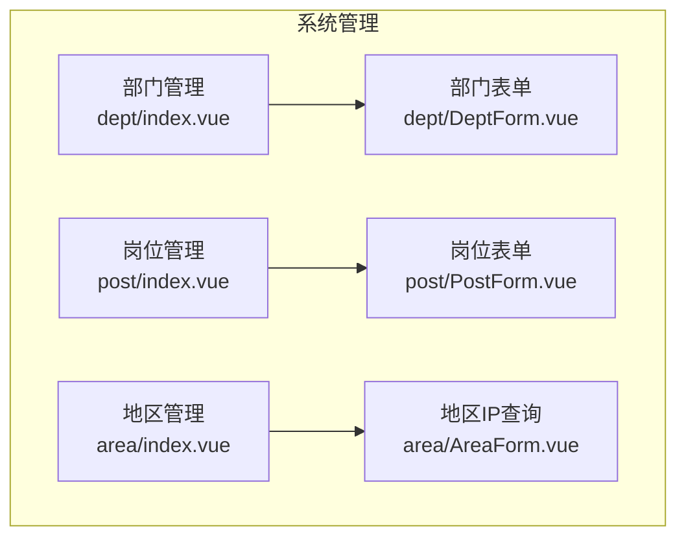
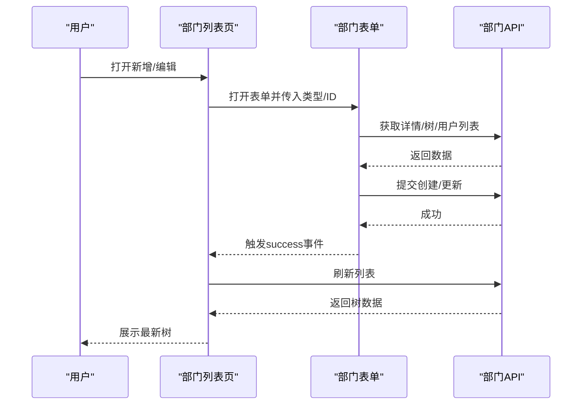
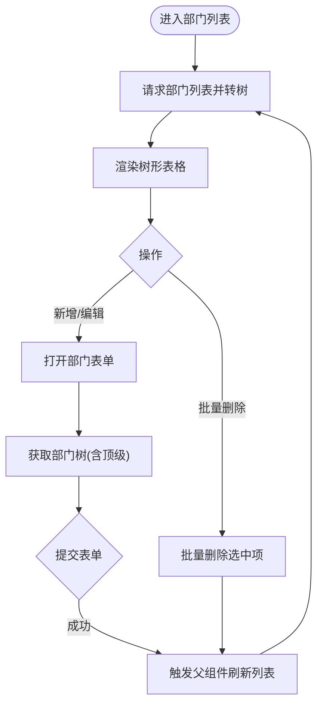
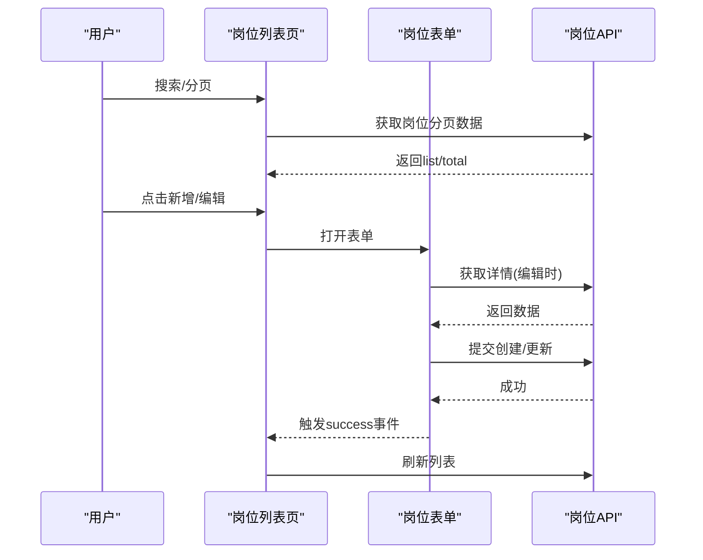
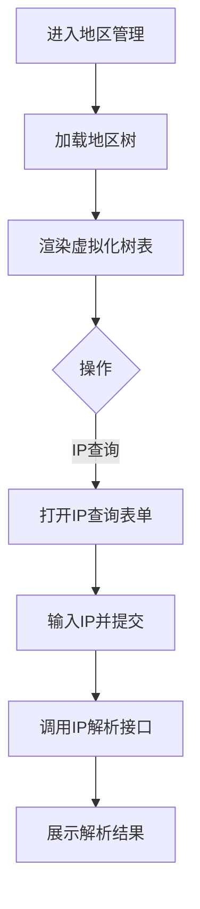
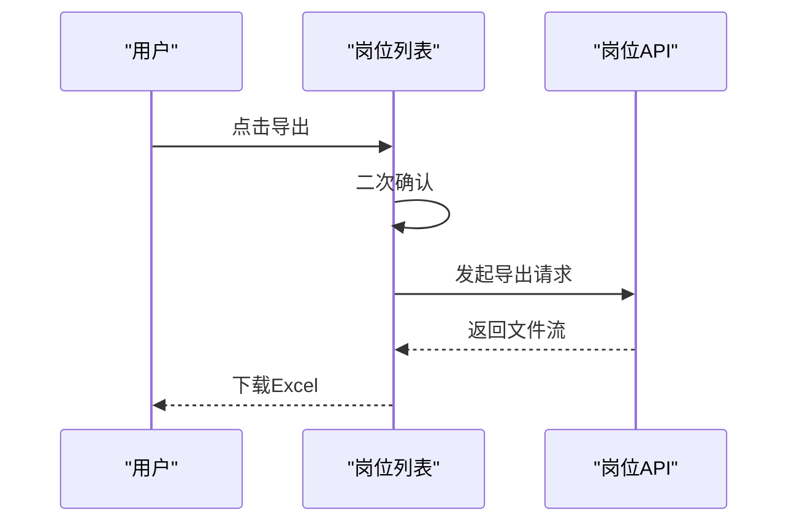
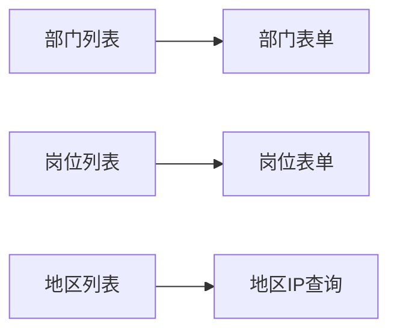

# 组织架构管理界面

<cite>
**本文引用的文件**
- [部门列表页面](file://yudao-ui-admin-vue3/src/views/system/dept/index.vue)
- [部门表单组件](file://yudao-ui-admin-vue3/src/views/system/dept/DeptForm.vue)
- [岗位列表页面](file://yudao-ui-admin-vue3/src/views/system/post/index.vue)
- [岗位表单组件](file://yudao-ui-admin-vue3/src/views/system/post/PostForm.vue)
- [地区列表页面](file://yudao-ui-admin-vue3/src/views/system/area/index.vue)
- [地区IP查询表单](file://yudao-ui-admin-vue3/src/views/system/area/AreaForm.vue)
</cite>

## 目录
1. [简介](#简介)
2. [项目结构](#项目结构)
3. [核心组件](#核心组件)
4. [架构总览](#架构总览)
5. [详细组件分析](#详细组件分析)
6. [依赖关系分析](#依赖关系分析)
7. [性能考虑](#性能考虑)
8. [故障排查指南](#故障排查指南)
9. [结论](#结论)
10. [附录](#附录)

## 简介
本文件面向“组织架构管理”相关的前端界面，覆盖以下能力：
- 部门树形结构管理：层级关系、树选择与数据同步
- 岗位管理：岗位定义、岗位分配与权限控制（基于角色/菜单的通用权限体系）
- 地区信息管理：省市区三级联动与地区数据维护，以及IP地址解析
- 导入导出与批量操作：岗位导出、部门批量删除等
- 最佳实践与性能优化建议：大数据量表格、树形渲染、表单校验与交互体验
- 组织变更的历史记录与操作审计：通过系统级操作日志进行追踪

## 项目结构
围绕“组织架构”的前端实现主要位于 system 模块下的 dept、post、area 三个子目录，分别对应部门、岗位、地区三大功能。各页面采用统一的 ContentWrap + el-table/el-form 布局，配合弹窗表单组件完成新增/编辑流程。

图表来源
- [部门列表页面:1-221](file://yudao-ui-admin-vue3/src/views/system/dept/index.vue#L1-L221)
- [部门表单组件:1-173](file://yudao-ui-admin-vue3/src/views/system/dept/DeptForm.vue#L1-L173)
- [岗位列表页面:1-233](file://yudao-ui-admin-vue3/src/views/system/post/index.vue#L1-L233)
- [岗位表单组件:1-126](file://yudao-ui-admin-vue3/src/views/system/post/PostForm.vue#L1-L126)
- [地区列表页面:1-80](file://yudao-ui-admin-vue3/src/views/system/area/index.vue#L1-L80)
- [地区IP查询表单:1-73](file://yudao-ui-admin-vue3/src/views/system/area/AreaForm.vue#L1-L73)

章节来源
- [部门列表页面:1-221](file://yudao-ui-admin-vue3/src/views/system/dept/index.vue#L1-L221)
- [岗位列表页面:1-233](file://yudao-ui-admin-vue3/src/views/system/post/index.vue#L1-L233)
- [地区列表页面:1-80](file://yudao-ui-admin-vue3/src/views/system/area/index.vue#L1-L80)

## 核心组件
- 部门管理
  - 树形展示与筛选：支持按名称、状态过滤；提供展开/折叠、批量删除
  - 树选择器：新增/编辑时通过上级部门树选择父节点，支持顶级部门
  - 数据同步：提交成功后触发父组件刷新列表
- 岗位管理
  - 分页列表：支持按名称、编码、状态搜索；支持导出Excel
  - 表单校验：必填字段包含名称、编码、状态；支持备注
  - 批量删除：勾选后批量删除
- 地区管理
  - 树形表格：使用虚拟化表格展示地区树，提升大数据渲染性能
  - IP查询：输入IP返回地区信息，用于辅助定位或审计

章节来源
- [部门列表页面:1-221](file://yudao-ui-admin-vue3/src/views/system/dept/index.vue#L1-L221)
- [部门表单组件:1-173](file://yudao-ui-admin-vue3/src/views/system/dept/DeptForm.vue#L1-L173)
- [岗位列表页面:1-233](file://yudao-ui-admin-vue3/src/views/system/post/index.vue#L1-L233)
- [岗位表单组件:1-126](file://yudao-ui-admin-vue3/src/views/system/post/PostForm.vue#L1-L126)
- [地区列表页面:1-80](file://yudao-ui-admin-vue3/src/views/system/area/index.vue#L1-L80)
- [地区IP查询表单:1-73](file://yudao-ui-admin-vue3/src/views/system/area/AreaForm.vue#L1-L73)

## 架构总览
前端以“页面 + 表单组件 + API调用”的模式组织。页面负责查询、展示与交互；表单组件封装新增/编辑逻辑；API层统一对接后端接口。

图表来源
- [部门列表页面:144-153](file://yudao-ui-admin-vue3/src/views/system/dept/index.vue#L144-L153)
- [部门表单组件:100-171](file://yudao-ui-admin-vue3/src/views/system/dept/DeptForm.vue#L100-L171)

## 详细组件分析

### 部门树形结构管理
- 层级关系
  - 列表以树形表格展示，行键为id，支持默认全部展开与切换
  - 通过工具函数将扁平数据转换为树结构，便于前端渲染
- 部门树选择
  - 新增/编辑时使用树选择器选择上级部门，支持选择“顶级部门”
  - 树数据来源于简化部门列表接口，并在本地拼装根节点
- 数据同步
  - 表单提交成功后向父组件发送 success 事件，触发列表重新加载
  - 列表加载完成后再次拉取用户简表，用于负责人显示

图表来源
- [部门列表页面:62-113](file://yudao-ui-admin-vue3/src/views/system/dept/index.vue#L62-L113)
- [部门列表页面:144-153](file://yudao-ui-admin-vue3/src/views/system/dept/index.vue#L144-L153)
- [部门表单组件:100-171](file://yudao-ui-admin-vue3/src/views/system/dept/DeptForm.vue#L100-L171)

章节来源
- [部门列表页面:1-221](file://yudao-ui-admin-vue3/src/views/system/dept/index.vue#L1-L221)
- [部门表单组件:1-173](file://yudao-ui-admin-vue3/src/views/system/dept/DeptForm.vue#L1-L173)

### 岗位管理（定义、分配、权限）
- 岗位定义
  - 列表支持按名称、编码、状态检索；分页展示
  - 表单包含标题、编码、顺序、状态、备注等字段，具备必填校验
- 岗位分配
  - 岗位本身不直接绑定用户，通常通过“用户-角色-菜单/数据权限”的组合实现岗位相关的访问控制
  - 本仓库中岗位模块聚焦于岗位主数据的增删改查与导出
- 权限控制
  - 按钮级权限通过指令控制可见性（如新增、编辑、删除、导出）
  - 具体到用户的授权由角色与菜单/数据权限模块承担

图表来源
- [岗位列表页面:151-161](file://yudao-ui-admin-vue3/src/views/system/post/index.vue#L151-L161)
- [岗位表单组件:69-111](file://yudao-ui-admin-vue3/src/views/system/post/PostForm.vue#L69-L111)

章节来源
- [岗位列表页面:1-233](file://yudao-ui-admin-vue3/src/views/system/post/index.vue#L1-L233)
- [岗位表单组件:1-126](file://yudao-ui-admin-vue3/src/views/system/post/PostForm.vue#L1-L126)

### 地区信息管理（省市区联动与IP解析）
- 省市区三级联动
  - 地区数据以树形结构存储，前端通过树形表格展示，支持展开/收起
  - 列表通过树接口一次性获取完整结构，避免多次请求
- 地区数据维护
  - 当前页面提供“IP查询”入口，用于根据IP解析地区信息，辅助定位与审计
- 性能优化
  - 使用虚拟化表格组件承载大数据量地区树，减少DOM压力

图表来源
- [地区列表页面:59-67](file://yudao-ui-admin-vue3/src/views/system/area/index.vue#L59-L67)
- [地区IP查询表单:48-61](file://yudao-ui-admin-vue3/src/views/system/area/AreaForm.vue#L48-L61)

章节来源
- [地区列表页面:1-80](file://yudao-ui-admin-vue3/src/views/system/area/index.vue#L1-L80)
- [地区IP查询表单:1-73](file://yudao-ui-admin-vue3/src/views/system/area/AreaForm.vue#L1-L73)

### 导入导出与批量操作
- 导出
  - 岗位列表支持导出Excel，点击导出前进行二次确认，下载成功后重置加载状态
- 批量操作
  - 部门列表支持批量删除，需先勾选再执行，带二次确认
  - 岗位列表支持批量删除，同样需要勾选与确认

图表来源
- [岗位列表页面:213-226](file://yudao-ui-admin-vue3/src/views/system/post/index.vue#L213-L226)

章节来源
- [岗位列表页面:1-233](file://yudao-ui-admin-vue3/src/views/system/post/index.vue#L1-L233)
- [部门列表页面:195-212](file://yudao-ui-admin-vue3/src/views/system/dept/index.vue#L195-L212)

### 组织变更的历史记录与操作审计
- 操作审计
  - 本仓库提供“操作日志”模块，可追溯关键操作的执行者、时间、参数与结果
  - 建议在涉及组织架构变更的关键接口处开启操作日志记录，以便审计与回溯
- 变更记录
  - 对于重要实体（如部门、岗位），可在服务端增加版本化或变更流水表，记录关键字段变更前后值

章节来源
- [操作日志页面](file://yudao-ui-admin-vue3/src/views/system/operatelog/index.vue)

## 依赖关系分析
- 页面与组件
  - 部门列表依赖部门表单组件进行新增/编辑
  - 岗位列表依赖岗位表单组件进行新增/编辑
  - 地区列表依赖地区IP查询表单进行IP解析
- 外部依赖
  - Element Plus 表格/表单/对话框等UI组件
  - 国际化与消息提示工具
  - 日期格式化、树处理工具函数

图表来源
- [部门列表页面:115-117](file://yudao-ui-admin-vue3/src/views/system/dept/index.vue#L115-L117)
- [岗位列表页面:123-124](file://yudao-ui-admin-vue3/src/views/system/post/index.vue#L123-L124)
- [地区列表页面:31-33](file://yudao-ui-admin-vue3/src/views/system/area/index.vue#L31-L33)

章节来源
- [部门列表页面:1-221](file://yudao-ui-admin-vue3/src/views/system/dept/index.vue#L1-L221)
- [岗位列表页面:1-233](file://yudao-ui-admin-vue3/src/views/system/post/index.vue#L1-L233)
- [地区列表页面:1-80](file://yudao-ui-admin-vue3/src/views/system/area/index.vue#L1-L80)

## 性能考虑
- 大数据量树表
  - 地区管理使用虚拟化表格，显著降低渲染开销，适合大规模地区数据
- 树形数据转换
  - 在列表加载后将扁平数据转换为树结构，避免重复计算；必要时对树数据进行缓存
- 表单校验
  - 使用前端校验规则减少无效提交，提高用户体验
- 分页与懒加载
  - 岗位列表采用分页加载，避免一次性加载过多数据
- 网络请求合并
  - 在表单打开时并行获取必要数据（如用户列表、部门树），缩短等待时间

[本节为通用性能建议，不直接分析具体文件]

## 故障排查指南
- 树形展示异常
  - 检查列表接口返回的数据是否包含必要的父子关系字段
  - 确认树转换工具是否正确处理根节点与子节点
- 表单提交失败
  - 查看表单校验规则是否满足；检查必填字段是否填写
  - 检查权限指令是否允许当前用户执行该操作
- 导出失败
  - 确认导出接口返回的是文件流；检查浏览器下载拦截设置
- 批量操作无响应
  - 检查是否已正确勾选数据；确认二次确认流程未被中断

章节来源
- [部门列表页面:182-212](file://yudao-ui-admin-vue3/src/views/system/dept/index.vue#L182-L212)
- [岗位列表页面:181-226](file://yudao-ui-admin-vue3/src/views/system/post/index.vue#L181-L226)
- [地区IP查询表单:48-61](file://yudao-ui-admin-vue3/src/views/system/area/AreaForm.vue#L48-L61)

## 结论
本方案在前端层面实现了组织架构管理的核心能力：部门树形管理与选择、岗位主数据维护与导出、地区树展示与IP解析。结合系统级操作日志可实现变更审计。建议在生产环境中结合后端服务完善数据权限与变更流水，进一步提升安全性与可追溯性。

[本节为总结性内容，不直接分析具体文件]

## 附录
- 最佳实践
  - 树形数据尽量在后端组装好层级，前端仅做展示与轻量转换
  - 表单设计遵循最小必填原则，并提供清晰的错误提示
  - 对敏感操作（删除、导出）增加二次确认与权限控制
  - 对大数据量场景优先采用虚拟化表格与分页
- 扩展建议
  - 在部门/岗位维度引入版本化或变更流水，记录关键字段变更历史
  - 将岗位与角色/菜单/数据权限打通，形成“岗位-角色-权限”的映射关系
  - 地区数据支持增量更新与缓存策略，减少重复请求

[本节为补充说明，不直接分析具体文件]