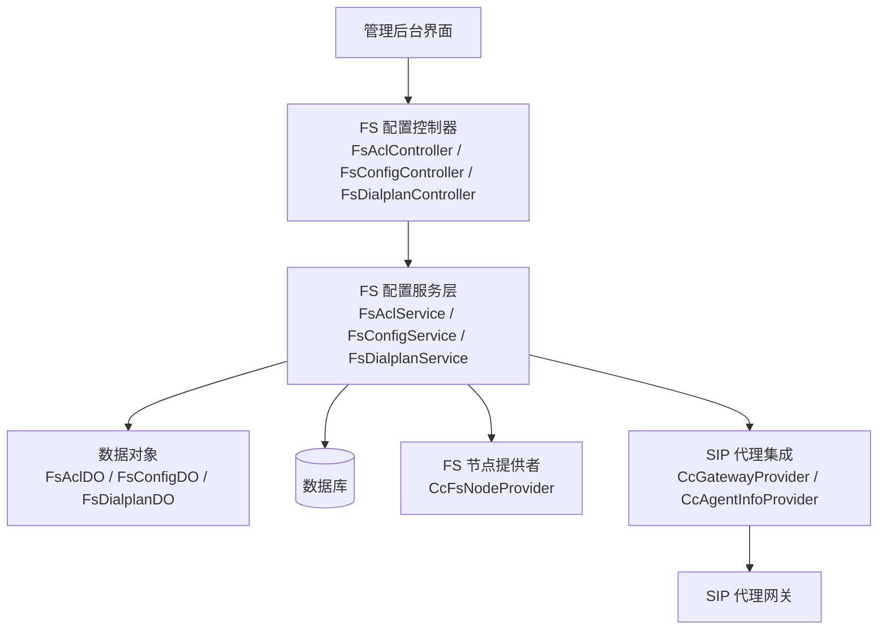
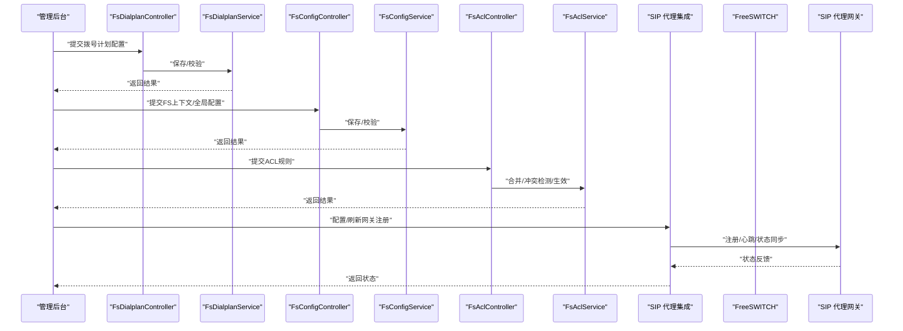
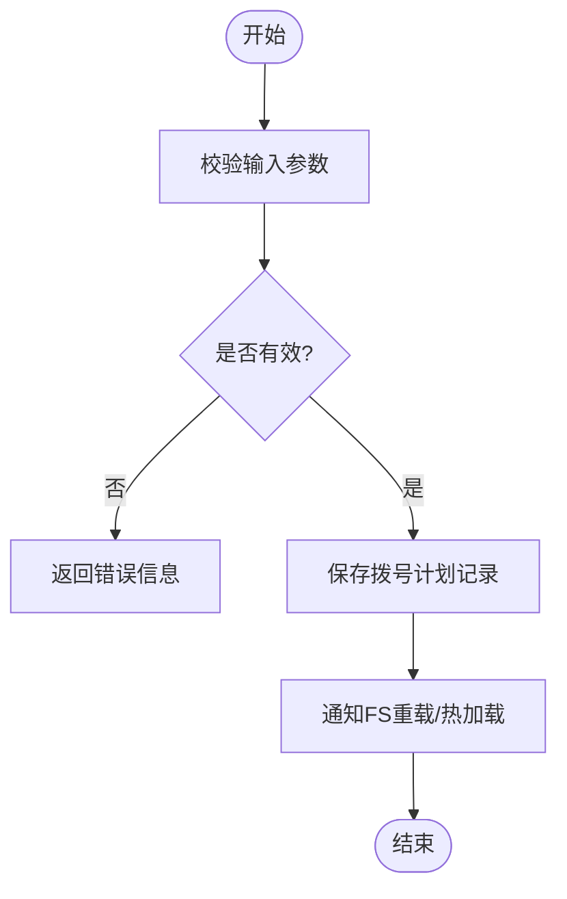
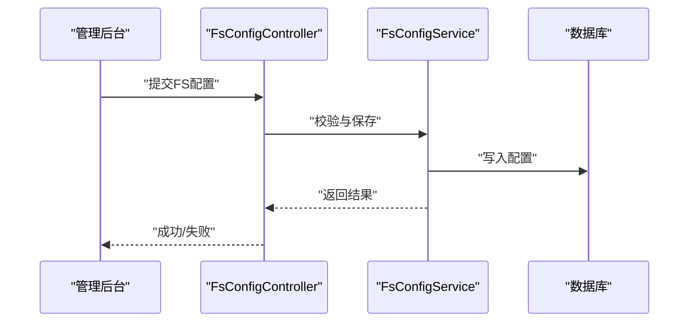
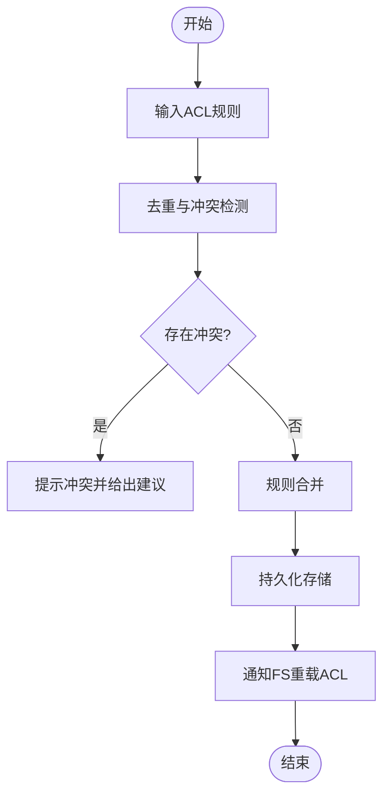
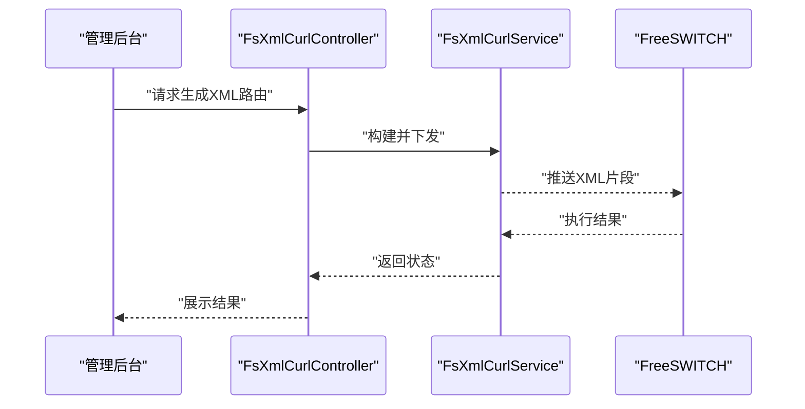
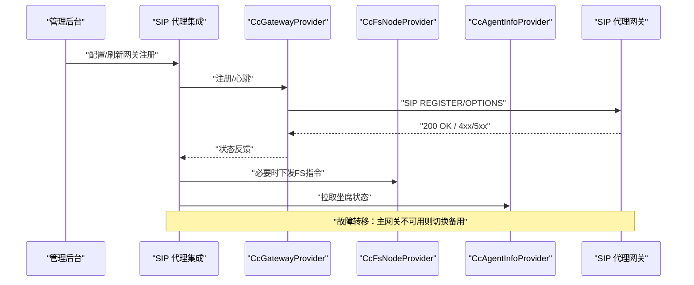
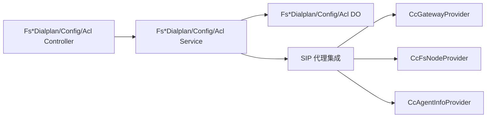

# 配置管理界面

<cite>
**本文引用的文件**
- [FsAclController.java](file://yudao-cloud/yudao-module-cc/yudao-module-cc-server/src/main/java/cn/iocoder/yudao/module/cc/controller/admin/fs/FsAclController.java)
- [FsConfigController.java](file://yudao-cloud/yudao-module-cc/yudao-module-cc-server/src/main/java/cn/iocoder/yudao/module/cc/controller/admin/fs/FsConfigController.java)
- [FsDialplanController.java](file://yudao-cloud/yudao-module-cc/yudao-module-cc-server/src/main/java/cn/iocoder/yudao/module/cc/controller/admin/fs/FsDialplanController.java)
- [FsXmlCurlController.java](file://yudao-cloud/yudao-module-cc/yudao-module-cc-server/src/main/java/cn/iocoder/yudao/module/cc/controller/admin/fs/FsXmlCurlController.java)
- [FsAclService.java](file://yudao-cloud/yudao-module-cc/yudao-module-cc-server/src/main/java/cn/iocoder/yudao/module/cc/service/fs/FsAclService.java)
- [FsAclServiceImpl.java](file://yudao-cloud/yudao-module-cc/yudao-module-cc-server/src/main/java/cn/iocoder/yudao/module/cc/service/fs/FsAclServiceImpl.java)
- [FsConfigService.java](file://yudao-cloud/yudao-module-cc/yudao-module-cc-server/src/main/java/cn/iocoder/yudao/module/cc/service/fs/FsConfigService.java)
- [FsConfigServiceImpl.java](file://yudao-cloud/yudao-module-cc/yudao-module-cc-server/src/main/java/cn/iocoder/yudao/module/cc/service/fs/FsConfigServiceImpl.java)
- [FsDialplanService.java](file://yudao-cloud/yudao-module-cc/yudao-module-cc-server/src/main/java/cn/iocoder/yudao/module/cc/service/fs/FsDialplanService.java)
- [FsDialplanServiceImpl.java](file://yudao-cloud/yudao-module-cc/yudao-module-cc-server/src/main/java/cn/iocoder/yudao/module/cc/service/fs/FsDialplanServiceImpl.java)
- [FsXmlCurlService.java](file://yudao-cloud/yudao-module-cc/yudao-module-cc-server/src/main/java/cn/iocoder/yudao/module/cc/service/fs/FsXmlCurlService.java)
- [FsXmlCurlServiceImpl.java](file://yudao-cloud/yudao-module-cc/yudao-module-cc-server/src/main/java/cn/iocoder/yudao/module/cc/service/fs/FsXmlCurlServiceImpl.java)
- [FsAclDO.java](file://yudao-cloud/yudao-module-cc/yudao-module-cc-server/src/main/java/cn/iocoder/yudao/module/cc/dal/dataobject/fs/FsAclDO.java)
- [FsConfigDO.java](file://yudao-cloud/yudao-module-cc/yudao-module-cc-server/src/main/java/cn/iocoder/yudao/module/cc/dal/dataobject/fs/FsConfigDO.java)
- [FsDialplanDO.java](file://yudao-cloud/yudao-module-cc/yudao-module-cc-server/src/main/java/cn/iocoder/yudao/module/cc/dal/dataobject/fs/FsDialplanDO.java)
- [FsModulesDO.java](file://yudao-cloud/yudao-module-cc/yudao-module-cc-server/src/main/java/cn/iocoder/yudao/module/cc/dal/dataobject/fs/FsModulesDO.java)
- [FsAclPageReqVO.java](file://yudao-cloud/yudao-module-cc/yudao-module-cc-server/src/main/java/cn/iocoder/yudao/module/cc/controller/admin/fs/vo/FsAclPageReqVO.java)
- [FsAclSaveReqVO.java](file://yudao-cloud/yudao-module-cc/yudao-module-cc-server/src/main/java/cn/iocoder/yudao/module/cc/controller/admin/fs/vo/FsAclSaveReqVO.java)
- [FsAclRespVO.java](file://yudao-cloud/yudao-module-cc/yudao-module-cc-server/src/main/java/cn/iocoder/yudao/module/cc/controller/admin/fs/vo/FsAclRespVO.java)
- [FsConfigPageReqVO.java](file://yudao-cloud/yudao-module-cc/yudao-module-cc-server/src/main/java/cn/iocoder/yudao/module/cc/controller/admin/fs/vo/FsConfigPageReqVO.java)
- [FsConfigSaveReqVO.java](file://yudao-cloud/yudao-module-cc/yudao-module-cc-server/src/main/java/cn/iocoder/yudao/module/cc/controller/admin/fs/vo/FsConfigSaveReqVO.java)
- [FsConfigRespVO.java](file://yudao-cloud/yudao-module-cc/yudao-module-cc-server/src/main/java/cn/iocoder/yudao/module/cc/controller/admin/fs/vo/FsConfigRespVO.java)
- [FsDialplanPageReqVO.java](file://yudao-cloud/yudao-module-cc/yudao-module-cc-server/src/main/java/cn/iocoder/yudao/module/cc/controller/admin/fs/vo/FsDialplanPageReqVO.java)
- [FsDialplanSaveReqVO.java](file://yudao-cloud/yudao-module-cc/yudao-module-cc-server/src/main/java/cn/iocoder/yudao/module/cc/controller/admin/fs/vo/FsDialplanSaveReqVO.java)
- [FsDialplanRespVO.java](file://yudao-cloud/yudao-module-cc/yudao-module-cc-server/src/main/java/cn/iocoder/yudao/module/cc/controller/admin/fs/vo/FsDialplanRespVO.java)
- [CcGatewayProvider.java](file://yudao-cloud/yudao-module-cc/yudao-module-cc-server/src/main/java/cn/iocoder/yudao/module/cc/sipproxy/integration/CcGatewayProvider.java)
- [CcFsNodeProvider.java](file://yudao-cloud/yudao-module-cc/yudao-module-cc-server/src/main/java/cn/iocoder/yudao/module/cc/sipproxy/integration/CcFsNodeProvider.java)
- [CcAgentInfoProvider.java](file://yudao-cloud/yudao-module-cc/yudao-module-cc-server/src/main/java/cn/iocoder/yudao/module/cc/sipproxy/integration/CcAgentInfoProvider.java)
- [SipProxyGatewayAuthTypeEnum.java](file://yudao-cloud/yudao-module-cc/yudao-module-cc-api/src/main/java/cn/iocoder/yudao/module/cc/enums/SipProxyGatewayAuthTypeEnum.java)
- [SipTransportProtocolEnum.java](file://yudao-cloud/yudao-module-cc/yudao-module-cc-api/src/main/java/cn/iocoder/yudao/module/cc/enums/SipTransportProtocolEnum.java)
- [SipGatewayParamEnum.java](file://yudao-cloud/yudao-module-cc/yudao-module-cc-api/src/main/java/cn/iocoder/yudao/module/cc/enums/SipGatewayParamEnum.java)
- [SipGatewaySettingParamEnum.java](file://yudao-cloud/yudao-module-cc/yudao-module-cc-api/src/main/java/cn/iocoder/yudao/module/cc/enums/SipGatewaySettingParamEnum.java)
</cite>

## 目录
1. [简介](#简介)
2. [项目结构](#项目结构)
3. [核心组件](#核心组件)
4. [架构总览](#架构总览)
5. [详细组件分析](#详细组件分析)
6. [依赖关系分析](#依赖关系分析)
7. [性能考虑](#性能考虑)
8. [故障排查指南](#故障排查指南)
9. [结论](#结论)
10. [附录](#附录)

## 简介
本文件面向“FreeSWITCH 配置管理界面”的文档化说明，覆盖拨号计划配置、上下文设置与 ACL 规则管理；访问控制列表（ACL）界面的 IP 白名单/黑名单与访问策略；SIP 代理网关的配置能力（注册、状态监控、故障转移）；配置版本控制机制（变更历史、回滚、冲突解决）；以及配置验证与测试工具的使用方法与最佳实践与安全建议。内容基于后端控制器、服务层、数据对象及 SIP 代理集成模块进行梳理，帮助读者快速理解并正确使用该配置管理能力。

## 项目结构
本项目在通话中心模块中提供 FreeSWITCH 配置管理能力，主要位于 yudao-module-cc-server 下的 controller/admin/fs、service/fs、dal/dataobject/fs 等包中，并通过 sipproxy/integration 与 SIP 代理网关集成。前端通过管理后台页面调用这些接口完成拨号计划、ACL、FS 节点与 SIP 网关的配置与维护。

图表来源
- [FsAclController.java](file://yudao-cloud/yudao-module-cc/yudao-module-cc-server/src/main/java/cn/iocoder/yudao/module/cc/controller/admin/fs/FsAclController.java)
- [FsConfigController.java](file://yudao-cloud/yudao-module-cc/yudao-module-cc-server/src/main/java/cn/iocoder/yudao/module/cc/controller/admin/fs/FsConfigController.java)
- [FsDialplanController.java](file://yudao-cloud/yudao-module-cc/yudao-module-cc-server/src/main/java/cn/iocoder/yudao/module/cc/controller/admin/fs/FsDialplanController.java)
- [FsAclService.java](file://yudao-cloud/yudao-module-cc/yudao-module-cc-server/src/main/java/cn/iocoder/yudao/module/cc/service/fs/FsAclService.java)
- [FsConfigService.java](file://yudao-cloud/yudao-module-cc/yudao-module-cc-server/src/main/java/cn/iocoder/yudao/module/cc/service/fs/FsConfigService.java)
- [FsDialplanService.java](file://yudao-cloud/yudao-module-cc/yudao-module-cc-server/src/main/java/cn/iocoder/yudao/module/cc/service/fs/FsDialplanService.java)
- [FsAclDO.java](file://yudao-cloud/yudao-module-cc/yudao-module-cc-server/src/main/java/cn/iocoder/yudao/module/cc/dal/dataobject/fs/FsAclDO.java)
- [FsConfigDO.java](file://yudao-cloud/yudao-module-cc/yudao-module-cc-server/src/main/java/cn/iocoder/yudao/module/cc/dal/dataobject/fs/FsConfigDO.java)
- [FsDialplanDO.java](file://yudao-cloud/yudao-module-cc/yudao-module-cc-server/src/main/java/cn/iocoder/yudao/module/cc/dal/dataobject/fs/FsDialplanDO.java)
- [CcGatewayProvider.java](file://yudao-cloud/yudao-module-cc/yudao-module-cc-server/src/main/java/cn/iocoder/yudao/module/cc/sipproxy/integration/CcGatewayProvider.java)
- [CcFsNodeProvider.java](file://yudao-cloud/yudao-module-cc/yudao-module-cc-server/src/main/java/cn/iocoder/yudao/module/cc/sipproxy/integration/CcFsNodeProvider.java)
- [CcAgentInfoProvider.java](file://yudao-cloud/yudao-module-cc/yudao-module-cc-server/src/main/java/cn/iocoder/yudao/module/cc/sipproxy/integration/CcAgentInfoProvider.java)

章节来源
- [FsAclController.java](file://yudao-cloud/yudao-module-cc/yudao-module-cc-server/src/main/java/cn/iocoder/yudao/module/cc/controller/admin/fs/FsAclController.java)
- [FsConfigController.java](file://yudao-cloud/yudao-module-cc/yudao-module-cc-server/src/main/java/cn/iocoder/yudao/module/cc/controller/admin/fs/FsConfigController.java)
- [FsDialplanController.java](file://yudao-cloud/yudao-module-cc/yudao-module-cc-server/src/main/java/cn/iocoder/yudao/module/cc/controller/admin/fs/FsDialplanController.java)
- [FsAclService.java](file://yudao-cloud/yudao-module-cc/yudao-module-cc-server/src/main/java/cn/iocoder/yudao/module/cc/service/fs/FsAclService.java)
- [FsConfigService.java](file://yudao-cloud/yudao-module-cc/yudao-module-cc-server/src/main/java/cn/iocoder/yudao/module/cc/service/fs/FsConfigService.java)
- [FsDialplanService.java](file://yudao-cloud/yudao-module-cc/yudao-module-cc-server/src/main/java/cn/iocoder/yudao/module/cc/service/fs/FsDialplanService.java)
- [FsAclDO.java](file://yudao-cloud/yudao-module-cc/yudao-module-cc-server/src/main/java/cn/iocoder/yudao/module/cc/dal/dataobject/fs/FsAclDO.java)
- [FsConfigDO.java](file://yudao-cloud/yudao-module-cc/yudao-module-cc-server/src/main/java/cn/iocoder/yudao/module/cc/dal/dataobject/fs/FsConfigDO.java)
- [FsDialplanDO.java](file://yudao-cloud/yudao-module-cc/yudao-module-cc-server/src/main/java/cn/iocoder/yudao/module/cc/dal/dataobject/fs/FsDialplanDO.java)
- [CcGatewayProvider.java](file://yudao-cloud/yudao-module-cc/yudao-module-cc-server/src/main/java/cn/iocoder/yudao/module/cc/sipproxy/integration/CcGatewayProvider.java)
- [CcFsNodeProvider.java](file://yudao-cloud/yudao-module-cc/yudao-module-cc-server/src/main/java/cn/iocoder/yudao/module/cc/sipproxy/integration/CcFsNodeProvider.java)
- [CcAgentInfoProvider.java](file://yudao-cloud/yudao-module-cc/yudao-module-cc-server/src/main/java/cn/iocoder/yudao/module/cc/sipproxy/integration/CcAgentInfoProvider.java)

## 核心组件
- 拨号计划配置：通过 FsDialplanController 暴露分页查询、保存等接口，由 FsDialplanService 实现业务逻辑，持久化到 FsDialplanDO。
- 上下文与全局配置：FsConfigController 提供 FS 节点相关配置项的查询与保存，FsConfigService 负责校验与落库。
- ACL 规则管理：FsAclController 提供 ACL 条目增删改查，FsAclService 处理规则合并、冲突检测与生效流程。
- XML Curl 动态路由：FsXmlCurlController 与 FsXmlCurlService 配合，用于根据请求动态生成或更新 FS 的 XML 路由片段。
- SIP 代理网关集成：通过 CcGatewayProvider、CcFsNodeProvider、CcAgentInfoProvider 对接 SIP 代理，支持网关注册、状态监控与故障转移。

章节来源
- [FsDialplanController.java](file://yudao-cloud/yudao-module-cc/yudao-module-cc-server/src/main/java/cn/iocoder/yudao/module/cc/controller/admin/fs/FsDialplanController.java)
- [FsDialplanService.java](file://yudao-cloud/yudao-module-cc/yudao-module-cc-server/src/main/java/cn/iocoder/yudao/module/cc/service/fs/FsDialplanService.java)
- [FsDialplanServiceImpl.java](file://yudao-cloud/yudao-module-cc/yudao-module-cc-server/src/main/java/cn/iocoder/yudao/module/cc/service/fs/FsDialplanServiceImpl.java)
- [FsConfigController.java](file://yudao-cloud/yudao-module-cc/yudao-module-cc-server/src/main/java/cn/iocoder/yudao/module/cc/controller/admin/fs/FsConfigController.java)
- [FsConfigService.java](file://yudao-cloud/yudao-module-cc/yudao-module-cc-server/src/main/java/cn/iocoder/yudao/module/cc/service/fs/FsConfigService.java)
- [FsConfigServiceImpl.java](file://yudao-cloud/yudao-module-cc/yudao-module-cc-server/src/main/java/cn/iocoder/yudao/module/cc/service/fs/FsConfigServiceImpl.java)
- [FsAclController.java](file://yudao-cloud/yudao-module-cc/yudao-module-cc-server/src/main/java/cn/iocoder/yudao/module/cc/controller/admin/fs/FsAclController.java)
- [FsAclService.java](file://yudao-cloud/yudao-module-cc/yudao-module-cc-server/src/main/java/cn/iocoder/yudao/module/cc/service/fs/FsAclService.java)
- [FsAclServiceImpl.java](file://yudao-cloud/yudao-module-cc/yudao-module-cc-server/src/main/java/cn/iocoder/yudao/module/cc/service/fs/FsAclServiceImpl.java)
- [FsXmlCurlController.java](file://yudao-cloud/yudao-module-cc/yudao-module-cc-server/src/main/java/cn/iocoder/yudao/module/cc/controller/admin/fs/FsXmlCurlController.java)
- [FsXmlCurlService.java](file://yudao-cloud/yudao-module-cc/yudao-module-cc-server/src/main/java/cn/iocoder/yudao/module/cc/service/fs/FsXmlCurlService.java)
- [FsXmlCurlServiceImpl.java](file://yudao-cloud/yudao-module-cc/yudao-module-cc-server/src/main/java/cn/iocoder/yudao/module/cc/service/fs/FsXmlCurlServiceImpl.java)
- [CcGatewayProvider.java](file://yudao-cloud/yudao-module-cc/yudao-module-cc-server/src/main/java/cn/iocoder/yudao/module/cc/sipproxy/integration/CcGatewayProvider.java)
- [CcFsNodeProvider.java](file://yudao-cloud/yudao-module-cc/yudao-module-cc-server/src/main/java/cn/iocoder/yudao/module/cc/sipproxy/integration/CcFsNodeProvider.java)
- [CcAgentInfoProvider.java](file://yudao-cloud/yudao-module-cc/yudao-module-cc-server/src/main/java/cn/iocoder/yudao/module/cc/sipproxy/integration/CcAgentInfoProvider.java)

## 架构总览
下图展示了从管理后台到 FreeSWITCH 与 SIP 代理的整体交互路径，包括拨号计划、ACL、FS 配置与 SIP 网关配置的调用链。

图表来源
- [FsDialplanController.java](file://yudao-cloud/yudao-module-cc/yudao-module-cc-server/src/main/java/cn/iocoder/yudao/module/cc/controller/admin/fs/FsDialplanController.java)
- [FsDialplanService.java](file://yudao-cloud/yudao-module-cc/yudao-module-cc-server/src/main/java/cn/iocoder/yudao/module/cc/service/fs/FsDialplanService.java)
- [FsConfigController.java](file://yudao-cloud/yudao-module-cc/yudao-module-cc-server/src/main/java/cn/iocoder/yudao/module/cc/controller/admin/fs/FsConfigController.java)
- [FsConfigService.java](file://yudao-cloud/yudao-module-cc/yudao-module-cc-server/src/main/java/cn/iocoder/yudao/module/cc/service/fs/FsConfigService.java)
- [FsAclController.java](file://yudao-cloud/yudao-module-cc/yudao-module-cc-server/src/main/java/cn/iocoder/yudao/module/cc/controller/admin/fs/FsAclController.java)
- [FsAclService.java](file://yudao-cloud/yudao-module-cc/yudao-module-cc-server/src/main/java/cn/iocoder/yudao/module/cc/service/fs/FsAclService.java)
- [CcGatewayProvider.java](file://yudao-cloud/yudao-module-cc/yudao-module-cc-server/src/main/java/cn/iocoder/yudao/module/cc/sipproxy/integration/CcGatewayProvider.java)
- [CcFsNodeProvider.java](file://yudao-cloud/yudao-module-cc/yudao-module-cc-server/src/main/java/cn/iocoder/yudao/module/cc/sipproxy/integration/CcFsNodeProvider.java)
- [CcAgentInfoProvider.java](file://yudao-cloud/yudao-module-cc/yudao-module-cc-server/src/main/java/cn/iocoder/yudao/module/cc/sipproxy/integration/CcAgentInfoProvider.java)

## 详细组件分析

### 拨号计划配置（Dialplan）
- 功能要点
  - 拨号计划的分页查询、新增、修改、删除与批量操作。
  - 支持按上下文、匹配条件、动作序列等维度组织。
  - 保存前进行基础校验（如必填字段、格式），保存后触发 FS 侧热加载或提示重启。
- 关键类与职责
  - 控制器：FsDialplanController 暴露 REST 接口，接收 VO 参数。
  - 服务：FsDialplanService 实现业务逻辑，协调 DO 与外部系统。
  - 数据对象：FsDialplanDO 描述拨号计划实体。
- 典型流程
  - 前端提交拨号计划表单 -> 控制器校验 -> 服务层组装 -> 持久化 -> 可选地通知 FS 重载。

图表来源
- [FsDialplanController.java](file://yudao-cloud/yudao-module-cc/yudao-module-cc-server/src/main/java/cn/iocoder/yudao/module/cc/controller/admin/fs/FsDialplanController.java)
- [FsDialplanService.java](file://yudao-cloud/yudao-module-cc/yudao-module-cc-server/src/main/java/cn/iocoder/yudao/module/cc/service/fs/FsDialplanService.java)
- [FsDialplanDO.java](file://yudao-cloud/yudao-module-cc/yudao-module-cc-server/src/main/java/cn/iocoder/yudao/module/cc/dal/dataobject/fs/FsDialplanDO.java)

章节来源
- [FsDialplanController.java](file://yudao-cloud/yudao-module-cc/yudao-module-cc-server/src/main/java/cn/iocoder/yudao/module/cc/controller/admin/fs/FsDialplanController.java)
- [FsDialplanService.java](file://yudao-cloud/yudao-module-cc/yudao-module-cc-server/src/main/java/cn/iocoder/yudao/module/cc/service/fs/FsDialplanService.java)
- [FsDialplanServiceImpl.java](file://yudao-cloud/yudao-module-cc/yudao-module-cc-server/src/main/java/cn/iocoder/yudao/module/cc/service/fs/FsDialplanServiceImpl.java)
- [FsDialplanDO.java](file://yudao-cloud/yudao-module-cc/yudao-module-cc-server/src/main/java/cn/iocoder/yudao/module/cc/dal/dataobject/fs/FsDialplanDO.java)
- [FsDialplanPageReqVO.java](file://yudao-cloud/yudao-module-cc/yudao-module-cc-server/src/main/java/cn/iocoder/yudao/module/cc/controller/admin/fs/vo/FsDialplanPageReqVO.java)
- [FsDialplanSaveReqVO.java](file://yudao-cloud/yudao-module-cc/yudao-module-cc-server/src/main/java/cn/iocoder/yudao/module/cc/controller/admin/fs/vo/FsDialplanSaveReqVO.java)
- [FsDialplanRespVO.java](file://yudao-cloud/yudao-module-cc/yudao-module-cc-server/src/main/java/cn/iocoder/yudao/module/cc/controller/admin/fs/vo/FsDialplanRespVO.java)

### 上下文与全局配置（FS Config）
- 功能要点
  - 管理 FreeSWITCH 上下文、全局参数、模块开关等。
  - 支持按环境隔离与多实例部署场景。
  - 保存时进行兼容性检查与风险提示。
- 关键类与职责
  - 控制器：FsConfigController 提供配置项的查询与保存。
  - 服务：FsConfigService 负责配置项校验、合并与落库。
  - 数据对象：FsConfigDO 表示配置项实体。
- 典型流程
  - 前端选择配置项 -> 控制器接收 -> 服务层校验 -> 持久化 -> 可选地触发 FS 重载。

图表来源
- [FsConfigController.java](file://yudao-cloud/yudao-module-cc/yudao-module-cc-server/src/main/java/cn/iocoder/yudao/module/cc/controller/admin/fs/FsConfigController.java)
- [FsConfigService.java](file://yudao-cloud/yudao-module-cc/yudao-module-cc-server/src/main/java/cn/iocoder/yudao/module/cc/service/fs/FsConfigService.java)
- [FsConfigServiceImpl.java](file://yudao-cloud/yudao-module-cc/yudao-module-cc-server/src/main/java/cn/iocoder/yudao/module/cc/service/fs/FsConfigServiceImpl.java)
- [FsConfigDO.java](file://yudao-cloud/yudao-module-cc/yudao-module-cc-server/src/main/java/cn/iocoder/yudao/module/cc/dal/dataobject/fs/FsConfigDO.java)

章节来源
- [FsConfigController.java](file://yudao-cloud/yudao-module-cc/yudao-module-cc-server/src/main/java/cn/iocoder/yudao/module/cc/controller/admin/fs/FsConfigController.java)
- [FsConfigService.java](file://yudao-cloud/yudao-module-cc/yudao-module-cc-server/src/main/java/cn/iocoder/yudao/module/cc/service/fs/FsConfigService.java)
- [FsConfigServiceImpl.java](file://yudao-cloud/yudao-module-cc/yudao-module-cc-server/src/main/java/cn/iocoder/yudao/module/cc/service/fs/FsConfigServiceImpl.java)
- [FsConfigDO.java](file://yudao-cloud/yudao-module-cc/yudao-module-cc-server/src/main/java/cn/iocoder/yudao/module/cc/dal/dataobject/fs/FsConfigDO.java)
- [FsConfigPageReqVO.java](file://yudao-cloud/yudao-module-cc/yudao-module-cc-server/src/main/java/cn/iocoder/yudao/module/cc/controller/admin/fs/vo/FsConfigPageReqVO.java)
- [FsConfigSaveReqVO.java](file://yudao-cloud/yudao-module-cc/yudao-module-cc-server/src/main/java/cn/iocoder/yudao/module/cc/controller/admin/fs/vo/FsConfigSaveReqVO.java)
- [FsConfigRespVO.java](file://yudao-cloud/yudao-module-cc/yudao-module-cc-server/src/main/java/cn/iocoder/yudao/module/cc/controller/admin/fs/vo/FsConfigRespVO.java)

### ACL 规则管理（Access Control List）
- 功能要点
  - IP 白名单/黑名单管理：支持按 CIDR、主机名、标签等多维规则。
  - 访问策略设置：允许/拒绝、优先级、作用域（上下文/网关）。
  - 规则合并与冲突检测：避免重复与矛盾规则，保障生效一致性。
- 关键类与职责
  - 控制器：FsAclController 提供 ACL 条目的 CRUD 与批量操作。
  - 服务：FsAclService 实现规则校验、合并、冲突检测与生效。
  - 数据对象：FsAclDO 表示 ACL 条目。
- 典型流程
  - 前端提交 ACL 规则 -> 控制器接收 -> 服务层校验与合并 -> 持久化 -> 通知 FS 重载 ACL。

图表来源
- [FsAclController.java](file://yudao-cloud/yudao-module-cc/yudao-module-cc-server/src/main/java/cn/iocoder/yudao/module/cc/controller/admin/fs/FsAclController.java)
- [FsAclService.java](file://yudao-cloud/yudao-module-cc/yudao-module-cc-server/src/main/java/cn/iocoder/yudao/module/cc/service/fs/FsAclService.java)
- [FsAclServiceImpl.java](file://yudao-cloud/yudao-module-cc/yudao-module-cc-server/src/main/java/cn/iocoder/yudao/module/cc/service/fs/FsAclServiceImpl.java)
- [FsAclDO.java](file://yudao-cloud/yudao-module-cc/yudao-module-cc-server/src/main/java/cn/iocoder/yudao/module/cc/dal/dataobject/fs/FsAclDO.java)

章节来源
- [FsAclController.java](file://yudao-cloud/yudao-module-cc/yudao-module-cc-server/src/main/java/cn/iocoder/yudao/module/cc/controller/admin/fs/FsAclController.java)
- [FsAclService.java](file://yudao-cloud/yudao-module-cc/yudao-module-cc-server/src/main/java/cn/iocoder/yudao/module/cc/service/fs/FsAclService.java)
- [FsAclServiceImpl.java](file://yudao-cloud/yudao-module-cc/yudao-module-cc-server/src/main/java/cn/iocoder/yudao/module/cc/service/fs/FsAclServiceImpl.java)
- [FsAclDO.java](file://yudao-cloud/yudao-module-cc/yudao-module-cc-server/src/main/java/cn/iocoder/yudao/module/cc/dal/dataobject/fs/FsAclDO.java)
- [FsAclPageReqVO.java](file://yudao-cloud/yudao-module-cc/yudao-module-cc-server/src/main/java/cn/iocoder/yudao/module/cc/controller/admin/fs/vo/FsAclPageReqVO.java)
- [FsAclSaveReqVO.java](file://yudao-cloud/yudao-module-cc/yudao-module-cc-server/src/main/java/cn/iocoder/yudao/module/cc/controller/admin/fs/vo/FsAclSaveReqVO.java)
- [FsAclRespVO.java](file://yudao-cloud/yudao-module-cc/yudao-module-cc-server/src/main/java/cn/iocoder/yudao/module/cc/controller/admin/fs/vo/FsAclRespVO.java)

### XML Curl 动态路由
- 功能要点
  - 根据请求上下文动态生成或更新 FS 的 XML 路由片段，便于灵活扩展拨号逻辑。
  - 支持事件驱动与回调机制，结合 FS 的 XML Curl 能力。
- 关键类与职责
  - 控制器：FsXmlCurlController 暴露动态路由接口。
  - 服务：FsXmlCurlService 负责生成、缓存与下发。
- 典型流程
  - 前端触发动态路由生成 -> 控制器调用服务 -> 服务生成 XML -> 下发至 FS。

图表来源
- [FsXmlCurlController.java](file://yudao-cloud/yudao-module-cc/yudao-module-cc-server/src/main/java/cn/iocoder/yudao/module/cc/controller/admin/fs/FsXmlCurlController.java)
- [FsXmlCurlService.java](file://yudao-cloud/yudao-module-cc/yudao-module-cc-server/src/main/java/cn/iocoder/yudao/module/cc/service/fs/FsXmlCurlService.java)
- [FsXmlCurlServiceImpl.java](file://yudao-cloud/yudao-module-cc/yudao-module-cc-server/src/main/java/cn/iocoder/yudao/module/cc/service/fs/FsXmlCurlServiceImpl.java)

章节来源
- [FsXmlCurlController.java](file://yudao-cloud/yudao-module-cc/yudao-module-cc-server/src/main/java/cn/iocoder/yudao/module/cc/controller/admin/fs/FsXmlCurlController.java)
- [FsXmlCurlService.java](file://yudao-cloud/yudao-module-cc/yudao-module-cc-server/src/main/java/cn/iocoder/yudao/module/cc/service/fs/FsXmlCurlService.java)
- [FsXmlCurlServiceImpl.java](file://yudao-cloud/yudao-module-cc/yudao-module-cc-server/src/main/java/cn/iocoder/yudao/module/cc/service/fs/FsXmlCurlServiceImpl.java)

### SIP 代理网关配置（注册、状态监控、故障转移）
- 功能要点
  - 网关注册：维护 SIP 代理网关的连接信息与认证方式。
  - 状态监控：实时获取网关在线/离线、负载与错误率。
  - 故障转移：当主网关不可用时自动切换到备用网关。
- 关键类与职责
  - 集成提供者：CcGatewayProvider 负责网关注册、心跳与状态同步。
  - FS 节点提供者：CcFsNodeProvider 管理与 FS 节点的连接与命令下发。
  - 坐席信息提供者：CcAgentInfoProvider 提供坐席状态与路由信息。
  - 枚举定义：SipProxyGatewayAuthTypeEnum、SipTransportProtocolEnum、SipGatewayParamEnum、SipGatewaySettingParamEnum 定义网关参数与协议类型。
- 典型流程
  - 前端配置网关 -> 服务层调用集成提供者 -> 向 SIP 代理发送注册/心跳 -> 订阅状态事件 -> 故障时切换备用网关。

图表来源
- [CcGatewayProvider.java](file://yudao-cloud/yudao-module-cc/yudao-module-cc-server/src/main/java/cn/iocoder/yudao/module/cc/sipproxy/integration/CcGatewayProvider.java)
- [CcFsNodeProvider.java](file://yudao-cloud/yudao-module-cc/yudao-module-cc-server/src/main/java/cn/iocoder/yudao/module/cc/sipproxy/integration/CcFsNodeProvider.java)
- [CcAgentInfoProvider.java](file://yudao-cloud/yudao-module-cc/yudao-module-cc-server/src/main/java/cn/iocoder/yudao/module/cc/sipproxy/integration/CcAgentInfoProvider.java)
- [SipProxyGatewayAuthTypeEnum.java](file://yudao-cloud/yudao-module-cc/yudao-module-cc-api/src/main/java/cn/iocoder/yudao/module/cc/enums/SipProxyGatewayAuthTypeEnum.java)
- [SipTransportProtocolEnum.java](file://yudao-cloud/yudao-module-cc/yudao-module-cc-api/src/main/java/cn/iocoder/yudao/module/cc/enums/SipTransportProtocolEnum.java)
- [SipGatewayParamEnum.java](file://yudao-cloud/yudao-module-cc/yudao-module-cc-api/src/main/java/cn/iocoder/yudao/module/cc/enums/SipGatewayParamEnum.java)
- [SipGatewaySettingParamEnum.java](file://yudao-cloud/yudao-module-cc/yudao-module-cc-api/src/main/java/cn/iocoder/yudao/module/cc/enums/SipGatewaySettingParamEnum.java)

章节来源
- [CcGatewayProvider.java](file://yudao-cloud/yudao-module-cc/yudao-module-cc-server/src/main/java/cn/iocoder/yudao/module/cc/sipproxy/integration/CcGatewayProvider.java)
- [CcFsNodeProvider.java](file://yudao-cloud/yudao-module-cc/yudao-module-cc-server/src/main/java/cn/iocoder/yudao/module/cc/sipproxy/integration/CcFsNodeProvider.java)
- [CcAgentInfoProvider.java](file://yudao-cloud/yudao-module-cc/yudao-module-cc-server/src/main/java/cn/iocoder/yudao/module/cc/sipproxy/integration/CcAgentInfoProvider.java)
- [SipProxyGatewayAuthTypeEnum.java](file://yudao-cloud/yudao-module-cc/yudao-module-cc-api/src/main/java/cn/iocoder/yudao/module/cc/enums/SipProxyGatewayAuthTypeEnum.java)
- [SipTransportProtocolEnum.java](file://yudao-cloud/yudao-module-cc/yudao-module-cc-api/src/main/java/cn/iocoder/yudao/module/cc/enums/SipTransportProtocolEnum.java)
- [SipGatewayParamEnum.java](file://yudao-cloud/yudao-module-cc/yudao-module-cc-api/src/main/java/cn/iocoder/yudao/module/cc/enums/SipGatewayParamEnum.java)
- [SipGatewaySettingParamEnum.java](file://yudao-cloud/yudao-module-cc/yudao-module-cc-api/src/main/java/cn/iocoder/yudao/module/cc/enums/SipGatewaySettingParamEnum.java)

## 依赖关系分析
- 组件耦合
  - 控制器与服务层解耦清晰，服务层聚合多个提供者以完成跨系统协作。
  - SIP 代理集成与 FS 节点提供者之间松耦合，便于替换与扩展。
- 直接依赖
  - Fs*Controller 依赖对应 Fs*Service。
  - Fs*Service 依赖 Fs*DO 与 SIP 集成提供者。
- 间接依赖
  - 通过枚举与常量定义统一网关参数与协议类型，降低硬编码风险。
- 潜在循环依赖
  - 当前分层清晰，未见明显循环依赖。

图表来源
- [FsDialplanController.java](file://yudao-cloud/yudao-module-cc/yudao-module-cc-server/src/main/java/cn/iocoder/yudao/module/cc/controller/admin/fs/FsDialplanController.java)
- [FsConfigController.java](file://yudao-cloud/yudao-module-cc/yudao-module-cc-server/src/main/java/cn/iocoder/yudao/module/cc/controller/admin/fs/FsConfigController.java)
- [FsAclController.java](file://yudao-cloud/yudao-module-cc/yudao-module-cc-server/src/main/java/cn/iocoder/yudao/module/cc/controller/admin/fs/FsAclController.java)
- [FsDialplanService.java](file://yudao-cloud/yudao-module-cc/yudao-module-cc-server/src/main/java/cn/iocoder/yudao/module/cc/service/fs/FsDialplanService.java)
- [FsConfigService.java](file://yudao-cloud/yudao-module-cc/yudao-module-cc-server/src/main/java/cn/iocoder/yudao/module/cc/service/fs/FsConfigService.java)
- [FsAclService.java](file://yudao-cloud/yudao-module-cc/yudao-module-cc-server/src/main/java/cn/iocoder/yudao/module/cc/service/fs/FsAclService.java)
- [CcGatewayProvider.java](file://yudao-cloud/yudao-module-cc/yudao-module-cc-server/src/main/java/cn/iocoder/yudao/module/cc/sipproxy/integration/CcGatewayProvider.java)
- [CcFsNodeProvider.java](file://yudao-cloud/yudao-module-cc/yudao-module-cc-server/src/main/java/cn/iocoder/yudao/module/cc/sipproxy/integration/CcFsNodeProvider.java)
- [CcAgentInfoProvider.java](file://yudao-cloud/yudao-module-cc/yudao-module-cc-server/src/main/java/cn/iocoder/yudao/module/cc/sipproxy/integration/CcAgentInfoProvider.java)

章节来源
- [FsDialplanController.java](file://yudao-cloud/yudao-module-cc/yudao-module-cc-server/src/main/java/cn/iocoder/yudao/module/cc/controller/admin/fs/FsDialplanController.java)
- [FsConfigController.java](file://yudao-cloud/yudao-module-cc/yudao-module-cc-server/src/main/java/cn/iocoder/yudao/module/cc/controller/admin/fs/FsConfigController.java)
- [FsAclController.java](file://yudao-cloud/yudao-module-cc/yudao-module-cc-server/src/main/java/cn/iocoder/yudao/module/cc/controller/admin/fs/FsAclController.java)
- [FsDialplanService.java](file://yudao-cloud/yudao-module-cc/yudao-module-cc-server/src/main/java/cn/iocoder/yudao/module/cc/service/fs/FsDialplanService.java)
- [FsConfigService.java](file://yudao-cloud/yudao-module-cc/yudao-module-cc-server/src/main/java/cn/iocoder/yudao/module/cc/service/fs/FsConfigService.java)
- [FsAclService.java](file://yudao-cloud/yudao-module-cc/yudao-module-cc-server/src/main/java/cn/iocoder/yudao/module/cc/service/fs/FsAclService.java)
- [CcGatewayProvider.java](file://yudao-cloud/yudao-module-cc/yudao-module-cc-server/src/main/java/cn/iocoder/yudao/module/cc/sipproxy/integration/CcGatewayProvider.java)
- [CcFsNodeProvider.java](file://yudao-cloud/yudao-module-cc/yudao-module-cc-server/src/main/java/cn/iocoder/yudao/module/cc/sipproxy/integration/CcFsNodeProvider.java)
- [CcAgentInfoProvider.java](file://yudao-cloud/yudao-module-cc/yudao-module-cc-server/src/main/java/cn/iocoder/yudao/module/cc/sipproxy/integration/CcAgentInfoProvider.java)

## 性能考虑
- 批量操作与分页：对拨号计划与 ACL 列表采用分页查询，减少单次响应体积。
- 规则合并优化：ACL 规则合并应在内存中进行增量计算，避免全量重建。
- 异步下发：FS 重载与 SIP 代理状态同步建议使用异步任务，避免阻塞用户请求。
- 缓存策略：对频繁读取的配置项可引入缓存，注意失效与一致性。
- 连接池：与 FS 和 SIP 代理的网络连接应使用连接池，限制并发与超时。

## 故障排查指南
- 常见问题定位
  - 拨号计划未生效：检查保存流程是否触发 FS 重载，查看 FS 日志与路由命中情况。
  - ACL 规则冲突：查看规则合并日志，确认优先级与作用域是否正确。
  - SIP 网关离线：检查注册与心跳报文，确认网络连通性与认证配置。
- 日志与监控
  - 启用 FS ESL 事件监听，收集 call 事件与 hangup 原因。
  - 监控 SIP 代理网关状态与错误率，设置告警阈值。
- 回滚与恢复
  - 对关键配置变更前创建快照，出现异常时快速回滚。
  - 对 ACL 与拨号计划变更采用灰度发布，逐步放量。

章节来源
- [FsAclService.java](file://yudao-cloud/yudao-module-cc/yudao-module-cc-server/src/main/java/cn/iocoder/yudao/module/cc/service/fs/FsAclService.java)
- [FsConfigService.java](file://yudao-cloud/yudao-module-cc/yudao-module-cc-server/src/main/java/cn/iocoder/yudao/module/cc/service/fs/FsConfigService.java)
- [FsDialplanService.java](file://yudao-cloud/yudao-module-cc/yudao-module-cc-server/src/main/java/cn/iocoder/yudao/module/cc/service/fs/FsDialplanService.java)
- [CcGatewayProvider.java](file://yudao-cloud/yudao-module-cc/yudao-module-cc-server/src/main/java/cn/iocoder/yudao/module/cc/sipproxy/integration/CcGatewayProvider.java)
- [CcFsNodeProvider.java](file://yudao-cloud/yudao-module-cc/yudao-module-cc-server/src/main/java/cn/iocoder/yudao/module/cc/sipproxy/integration/CcFsNodeProvider.java)

## 结论
本配置管理界面围绕 FreeSWITCH 的拨号计划、上下文与 ACL 规则提供了完整的配置能力，并通过 SIP 代理集成实现了网关注册、状态监控与故障转移。整体架构分层清晰、职责明确，具备良好的可扩展性与可维护性。建议在生产环境中严格遵循变更审批、灰度发布与回滚预案，确保稳定性与安全性。

## 附录
- 配置验证与测试工具使用方法
  - 拨号计划验证：在测试环境导入样例拨号计划，使用模拟呼叫验证路由命中与动作执行。
  - ACL 规则验证：构造不同源地址的呼叫，验证白名单/黑名单与策略生效。
  - SIP 网关验证：使用 SIP 客户端进行注册与呼叫，观察状态变化与故障转移行为。
- 最佳实践
  - 变更前备份：对 FS 与 SIP 代理配置进行快照备份。
  - 最小权限：仅开放必要的管理接口与网络端口。
  - 审计与追踪：记录所有配置变更与操作人，便于追溯。
- 安全配置建议
  - 强认证：为 SIP 代理与 FS 管理接口启用强认证与加密传输。
  - 访问控制：限制管理后台访问来源 IP，启用防火墙策略。
  - 敏感信息：避免在配置中明文存放密码，使用密钥管理服务。