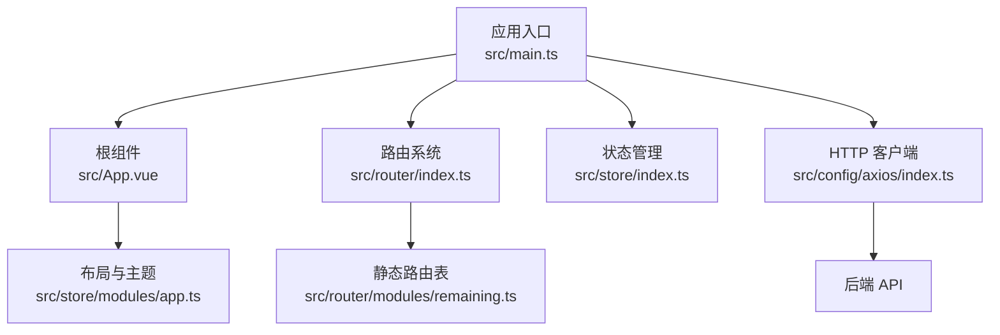
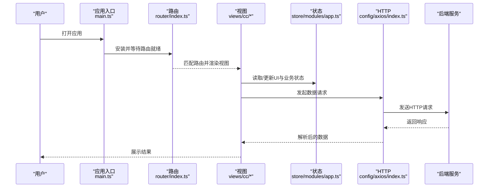
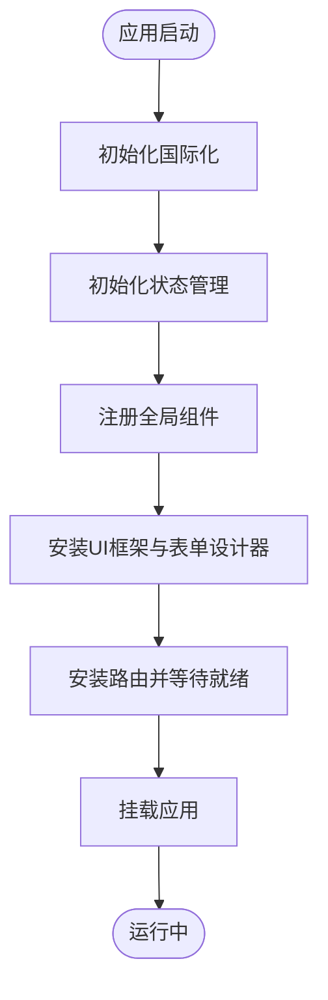
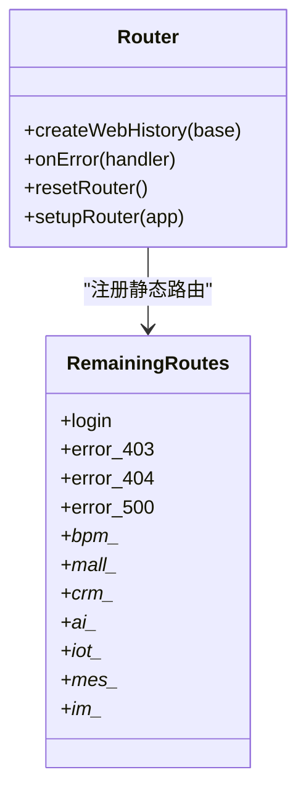
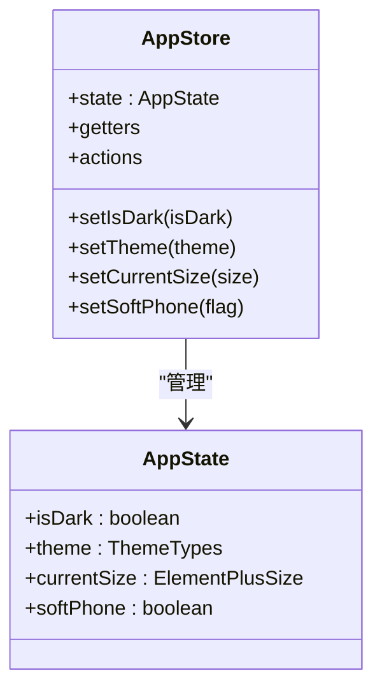
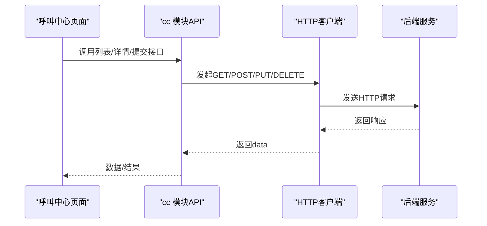
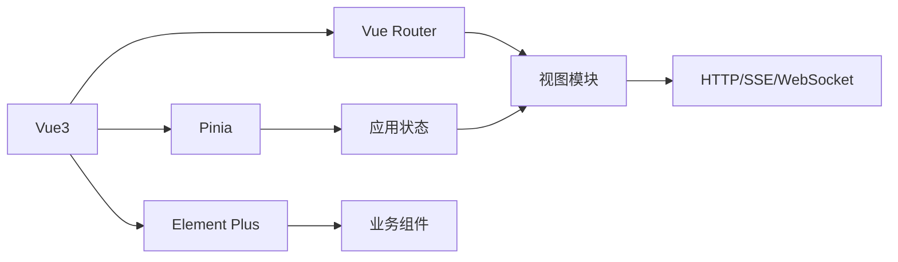

# 前端应用

<cite>
**本文引用的文件**
- [package.json](file://yudao-ui-admin-vue3/package.json)
- [main.ts](file://yudao-ui-admin-vue3/src/main.ts)
- [App.vue](file://yudao-ui-admin-vue3/src/App.vue)
- [vite.config.ts](file://yudao-ui-admin-vue3/vite.config.ts)
- [router/index.ts](file://yudao-ui-admin-vue3/src/router/index.ts)
- [router/modules/remaining.ts](file://yudao-ui-admin-vue3/src/router/modules/remaining.ts)
- [store/index.ts](file://yudao-ui-admin-vue3/src/store/index.ts)
- [store/modules/app.ts](file://yudao-ui-admin-vue3/src/store/modules/app.ts)
- [config/axios/index.ts](file://yudao-ui-admin-vue3/src/config/axios/index.ts)
</cite>

## 目录
1. [简介](#简介)
2. [项目结构](#项目结构)
3. [核心组件](#核心组件)
4. [架构总览](#架构总览)
5. [详细组件分析](#详细组件分析)
6. [依赖分析](#依赖分析)
7. [性能考虑](#性能考虑)
8. [故障排查指南](#故障排查指南)
9. [结论](#结论)
10. [附录](#附录)

## 简介
本文件面向呼叫中心（CC）前端应用的开发与维护，聚焦 Vue3 应用的初始化、路由配置与状态管理；梳理呼叫中心相关页面与模块的组织方式；说明前后端数据交互、实时通信与错误处理机制；并提供开发规范、构建配置与部署流程建议，以及扩展开发与自定义界面的指导。

## 项目结构
前端工程位于 yudao-ui-admin-vue3，采用 Vite + Vue3 + TypeScript + Element Plus + Pinia 的技术栈。关键入口与配置如下：
- 应用入口：src/main.ts 负责创建 Vue 实例并挂载插件、国际化、全局组件、Element Plus、表单设计器、路由、指令等。
- 根组件：src/App.vue 提供全局布局容器、主题与尺寸控制、路由视图渲染与全局搜索入口。
- 构建配置：vite.config.ts 定义开发服务器、SCSS 变量注入、别名、分包策略、压缩与 SourceMap 等。
- 路由：src/router/index.ts 创建路由实例并注册到应用；src/router/modules/remaining.ts 集中声明静态路由（登录、错误页、各业务域子路由等）。
- 状态管理：src/store/index.ts 初始化 Pinia 并启用持久化插件；src/store/modules/app.ts 提供应用级 UI 与主题、布局、软电话开关等状态。
- HTTP 客户端：src/config/axios/index.ts 封装统一的请求方法（get/post/delete/put/download/upload），统一设置 Content-Type 与透传 headers。

图表来源
- [main.ts:57-86](file://yudao-ui-admin-vue3/src/main.ts#L57-L86)
- [App.vue:27-31](file://yudao-ui-admin-vue3/src/App.vue#L27-L31)
- [router/index.ts:7-20](file://yudao-ui-admin-vue3/src/router/index.ts#L7-L20)
- [store/index.ts:5-10](file://yudao-ui-admin-vue3/src/store/index.ts#L5-L10)
- [config/axios/index.ts:7-46](file://yudao-ui-admin-vue3/src/config/axios/index.ts#L7-L46)

章节来源
- [main.ts:1-92](file://yudao-ui-admin-vue3/src/main.ts#L1-L92)
- [App.vue:1-58](file://yudao-ui-admin-vue3/src/App.vue#L1-L58)
- [vite.config.ts:21-107](file://yudao-ui-admin-vue3/vite.config.ts#L21-L107)
- [router/index.ts:1-47](file://yudao-ui-admin-vue3/src/router/index.ts#L1-L47)
- [router/modules/remaining.ts:1-800](file://yudao-ui-admin-vue3/src/router/modules/remaining.ts#L1-L800)
- [store/index.ts:1-13](file://yudao-ui-admin-vue3/src/store/index.ts#L1-L13)
- [store/modules/app.ts:14-109](file://yudao-ui-admin-vue3/src/store/modules/app.ts#L14-L109)
- [config/axios/index.ts:1-48](file://yudao-ui-admin-vue3/src/config/axios/index.ts#L1-L48)

## 核心组件
- 应用启动流程
  - 创建 Vue 实例并依次安装国际化、Pinia、全局组件、Element Plus、FormCreate、路由、指令、打印插件等。
  - 等待路由就绪后挂载 DOM，并在控制台输出欢迎信息。
- 根组件职责
  - 通过 ConfigGlobal 提供全局尺寸与主题上下文。
  - 使用 RouterView 渲染当前路由视图，并挂载全局路由搜索组件。
  - 根据本地缓存或浏览器主题自动设置暗黑模式。
- 路由系统
  - 使用 createWebHistory 模式，支持滚动行为重置与动态导入失败时的自动跳转恢复。
  - 提供 resetRouter 用于清理动态路由（保留白名单）。
- 状态管理
  - 基于 Pinia，启用持久化插件以保存主题、布局、暗黑模式等。
  - app store 管理 UI 显示、布局、主题色、移动端适配、软电话开关等。
- HTTP 客户端
  - 统一封装 get/post/put/delete/download/upload，默认设置 Content-Type，支持透传 headers。
  - 返回 data 字段，便于上层调用直接消费。

章节来源
- [main.ts:57-86](file://yudao-ui-admin-vue3/src/main.ts#L57-L86)
- [App.vue:10-25](file://yudao-ui-admin-vue3/src/App.vue#L10-L25)
- [router/index.ts:7-44](file://yudao-ui-admin-vue3/src/router/index.ts#L7-L44)
- [store/index.ts:5-10](file://yudao-ui-admin-vue3/src/store/index.ts#L5-L10)
- [store/modules/app.ts:14-109](file://yudao-ui-admin-vue3/src/store/modules/app.ts#L14-L109)
- [config/axios/index.ts:7-46](file://yudao-ui-admin-vue3/src/config/axios/index.ts#L7-L46)

## 架构总览
前端采用“入口装配 -> 路由分发 -> 视图渲染 -> 状态共享 -> 网络请求”的分层架构。呼叫中心功能以 views/cc 为业务域组织，API 按模块拆分在 src/api/cc 下，便于按需引入与维护。

图表来源
- [main.ts:57-86](file://yudao-ui-admin-vue3/src/main.ts#L57-L86)
- [router/index.ts:7-44](file://yudao-ui-admin-vue3/src/router/index.ts#L7-L44)
- [store/modules/app.ts:14-109](file://yudao-ui-admin-vue3/src/store/modules/app.ts#L14-L109)
- [config/axios/index.ts:7-46](file://yudao-ui-admin-vue3/src/config/axios/index.ts#L7-L46)

## 详细组件分析

### 应用初始化与装配
- 初始化顺序：国际化 -> 状态管理 -> 全局组件 -> Element Plus -> FormCreate -> 路由 -> 指令 -> 打印插件 -> 挂载。
- 预加载失败处理：监听 vite:preloadError 事件，避免 chunk 哈希变化导致的加载失败，自动刷新页面。
- 路由错误恢复：捕获动态导入失败的错误，重定向到目标路径。

图表来源
- [main.ts:57-86](file://yudao-ui-admin-vue3/src/main.ts#L57-L86)
- [router/index.ts:22-30](file://yudao-ui-admin-vue3/src/router/index.ts#L22-L30)

章节来源
- [main.ts:1-92](file://yudao-ui-admin-vue3/src/main.ts#L1-L92)
- [router/index.ts:22-30](file://yudao-ui-admin-vue3/src/router/index.ts#L22-L30)

### 路由配置与权限
- 路由模式：history 模式，base 由环境变量控制。
- 滚动行为：切换标签时滚动条回到顶部，提升体验一致性。
- 动态路由重置：resetRouter 仅保留白名单路由，便于登出或权限变更时重建路由表。
- 静态路由：remaining.ts 集中管理登录、错误页、各业务域（含 CC）的隐藏路由与详情页路由。

图表来源
- [router/index.ts:7-44](file://yudao-ui-admin-vue3/src/router/index.ts#L7-L44)
- [router/modules/remaining.ts:177-800](file://yudao-ui-admin-vue3/src/router/modules/remaining.ts#L177-L800)

章节来源
- [router/index.ts:1-47](file://yudao-ui-admin-vue3/src/router/index.ts#L1-L47)
- [router/modules/remaining.ts:1-800](file://yudao-ui-admin-vue3/src/router/modules/remaining.ts#L1-L800)

### 状态管理与主题
- 应用状态：包含面包屑、折叠菜单、全屏、搜索、多语言、消息、IM、标签页、Logo、固定头部、灰色模式、布局、标题、用户信息、暗黑模式、组件尺寸、移动端、页脚、主题、固定菜单、软电话等。
- 主题与尺寸：支持动态切换主题色、生成 RGB 变量、切换暗黑/亮色模式并持久化。
- 软电话开关：app store 暴露 softPhone 状态，供呼叫中心界面控制软电话面板显隐。

图表来源
- [store/modules/app.ts:14-109](file://yudao-ui-admin-vue3/src/store/modules/app.ts#L14-L109)
- [store/modules/app.ts:197-334](file://yudao-ui-admin-vue3/src/store/modules/app.ts#L197-L334)

章节来源
- [store/modules/app.ts:14-334](file://yudao-ui-admin-vue3/src/store/modules/app.ts#L14-L334)

### 呼叫中心界面与模块
- 目录组织：views/cc 下按功能域划分（如 ivr、callrecord、sysagent、sipproxygateway 等），每个域通常包含列表页与表单页。
- API 组织：src/api/cc 下按模块拆分接口文件，便于按页面引入。
- 典型页面示例：
  - IVR 编辑：ivr/ivrEdit.vue 及 node 节点组件，配合 store/ivr.ts 与 utils/node.ts 实现可视化编排。
  - 坐席与分组：sysagent、sysagentgroup 提供坐席与分组的基础数据管理。
  - SIP 代理网关：sipproxygateway 提供网关配置与列表管理。
  - 呼叫记录：callrecord 提供通话记录查询与详情查看。
- 交互逻辑：列表页通常结合表格、分页、筛选；表单页使用 FormCreate 或 Element Plus 表单；详情页通过路由参数传递 ID。

章节来源
- [router/modules/remaining.ts:247-800](file://yudao-ui-admin-vue3/src/router/modules/remaining.ts#L247-L800)

### 前后端数据交互
- 统一请求封装：config/axios/index.ts 提供 get/post/put/delete/download/upload，统一设置 Content-Type，支持上传与下载。
- 调用约定：上层模块通过 api/cc/* 中的函数发起请求，返回数据可直接消费。
- 错误处理：建议在业务层对响应码进行判断，并结合全局错误提示（可结合 Element Plus 的消息组件）。

图表来源
- [config/axios/index.ts:7-46](file://yudao-ui-admin-vue3/src/config/axios/index.ts#L7-L46)

章节来源
- [config/axios/index.ts:1-48](file://yudao-ui-admin-vue3/src/config/axios/index.ts#L1-L48)

### WebSocket 实时通信
- 技术选型：项目依赖 @microsoft/fetch-event-source，可用于服务端推送（SSE）场景；如需双向实时通信，可在业务模块自行集成 WebSocket 或基于 SSE 的长连接方案。
- 建议实践：
  - 建立连接管理器：封装连接、心跳、断线重连、消息订阅/发布。
  - 与状态管理结合：将实时事件写入 Pinia Store，驱动界面更新。
  - 错误与降级：网络异常时给出提示，必要时回退为轮询。

[本节为通用实践建议，不直接引用具体源码]

### 错误处理机制
- 路由层面：捕获动态导入失败，自动跳转到目标路径，避免白屏。
- 应用层面：监听 Vite 预加载失败事件，触发页面刷新，解决 chunk 哈希变化问题。
- 业务层面：建议在 API 层统一拦截响应码，结合 Element Plus 的 Message/Dialog 提示错误，并记录日志。

章节来源
- [main.ts:51-54](file://yudao-ui-admin-vue3/src/main.ts#L51-L54)
- [router/index.ts:22-30](file://yudao-ui-admin-vue3/src/router/index.ts#L22-L30)

## 依赖分析
- 运行时依赖：Vue3、Vue Router、Pinia、Element Plus、ECharts、Video.js、LiveKit Client、JSSIP、FormCreate、WangEditor、i18n、Dayjs、CryptoJS 等。
- 构建与工具：Vite、TypeScript、ESLint、Stylelint、Prettier、UnoCSS、压缩与 SVG 图标插件等。
- 包脚本：提供 dev、build:*、preview、lint 等常用命令，支持多环境构建与预览。

图表来源
- [package.json:31-96](file://yudao-ui-admin-vue3/package.json#L31-L96)

章节来源
- [package.json:1-159](file://yudao-ui-admin-vue3/package.json#L1-L159)

## 性能考虑
- 代码分割：vite.config.ts 中将 echarts、form-create、form-designer 单独分包，减少首屏体积。
- 资源优化：启用 oxc 压缩、可选 SourceMap、按需引入与 Tree Shaking。
- SCSS 变量注入：通过 additionalData 自动注入 variables.scss，减少重复 import。
- 构建产物：可通过环境变量控制是否移除 debugger/console，减小生产包体积。

章节来源
- [vite.config.ts:82-106](file://yudao-ui-admin-vue3/vite.config.ts#L82-L106)

## 故障排查指南
- 路由动态导入失败
  - 现象：控制台报错“Failed to fetch dynamically imported module”。
  - 处理：路由 onError 已内置跳转恢复；若仍出现，检查路由 path 与组件路径是否正确。
- 预加载失败
  - 现象：重新构建后 chunk 哈希变化导致加载失败。
  - 处理：已监听 vite:preloadError 并自动刷新页面；确保构建产物完整。
- 样式变量未生效
  - 现象：SCSS 变量未注入。
  - 处理：检查 vite.config.ts 的 additionalData 配置与 variables.scss 路径。
- 主题切换无效
  - 现象：暗黑模式或主题色未生效。
  - 处理：确认 app store 的 setIsDark/setTheme 被正确调用，且 CSS 变量已更新。

章节来源
- [router/index.ts:22-30](file://yudao-ui-admin-vue3/src/router/index.ts#L22-L30)
- [main.ts:51-54](file://yudao-ui-admin-vue3/src/main.ts#L51-L54)
- [vite.config.ts:55-70](file://yudao-ui-admin-vue3/vite.config.ts#L55-L70)
- [store/modules/app.ts:299-327](file://yudao-ui-admin-vue3/src/store/modules/app.ts#L299-L327)

## 结论
该前端工程以清晰的入口装配、模块化路由与状态管理为基础，支撑呼叫中心业务的快速迭代。通过统一的 HTTP 客户端与可扩展的状态模型，便于接入实时通信与复杂交互。构建配置兼顾性能与可维护性，适合团队协作与持续交付。

## 附录

### 呼叫中心相关界面清单（示例）
- IVR 编辑器：views/cc/ivr/ivrEdit.vue
- 呼叫记录：views/cc/callrecord/index.vue
- 坐席与分组：views/cc/sysagent/index.vue、views/cc/sysagentgroup/index.vue
- SIP 代理网关：views/cc/sipproxygateway/index.vue
- 其他：areacode、autocalltask、calldisplay、calldisplaypool、callroute、fsacl、fsconfig、fsdialplan、sysphonelocation、sysvoiceengine、sysvoicefile

章节来源
- [router/modules/remaining.ts:247-800](file://yudao-ui-admin-vue3/src/router/modules/remaining.ts#L247-L800)

### 开发规范
- 代码风格：使用 ESLint + Prettier + Stylelint 统一格式与质量检查。
- 命名规范：组件与文件采用 PascalCase/kebab-case 保持一致；模块按功能域划分。
- 状态管理：优先使用 Pinia，避免在组件内维护复杂状态。
- 路由：新增页面需在 remaining.ts 中声明路由 meta，合理设置 hidden/noCache/affix。
- 网络请求：统一通过 config/axios/index.ts 封装的方法发起，避免分散的 axios 调用。

[本节为通用规范建议，不直接引用具体源码]

### 构建配置与部署流程
- 开发
  - 安装依赖：pnpm i
  - 启动开发：pnpm dev
- 构建
  - 本地构建：pnpm build:local
  - 测试/预发/生产：pnpm build:test / build:stage / build:prod
- 预览
  - 预览构建产物：pnpm preview
- 环境变量
  - base、端口、open、source map、输出目录、调试开关等通过环境变量控制。

章节来源
- [package.json:7-29](file://yudao-ui-admin-vue3/package.json#L7-L29)
- [vite.config.ts:21-47](file://yudao-ui-admin-vue3/vite.config.ts#L21-L47)

### 扩展开发与自定义界面
- 新增页面
  - 在 views/cc 下新建模块目录，编写列表与表单组件。
  - 在 router/modules/remaining.ts 中注册路由，设置 meta（title/icon/hidden/noCache 等）。
- 新增 API
  - 在 src/api/cc 下新建模块 index.ts，封装 get/post/put/delete 等方法。
  - 在页面中按需引入并使用。
- 新增状态
  - 在 store/modules 下新增模块，使用 defineStore 定义 state/getters/actions。
  - 在页面中通过 useXxxStore 获取与更新状态。
- 主题与样式
  - 通过 store/modules/app.ts 的 setTheme 动态调整主题变量。
  - 使用 UnoCSS/SCSS 进行样式定制，遵循全局变量与命名空间。

[本节为通用扩展指导，不直接引用具体源码]