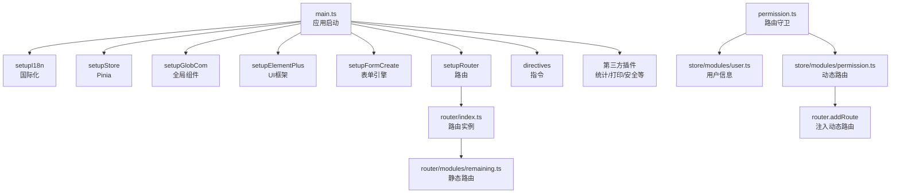
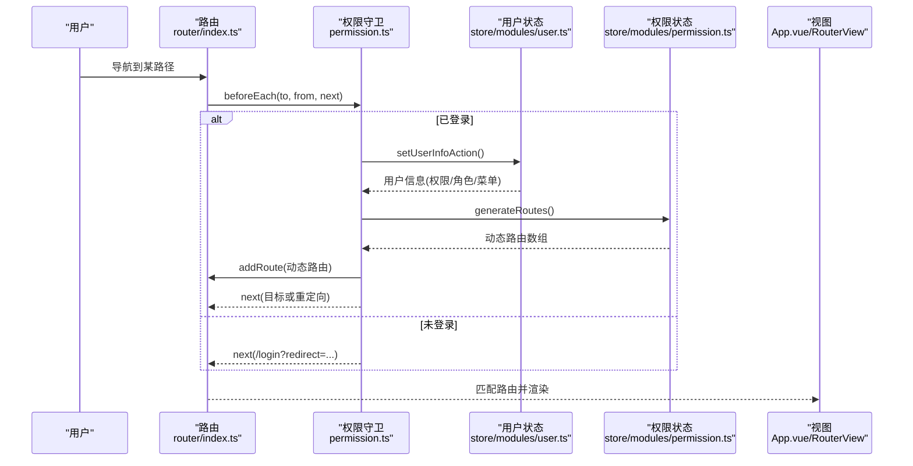
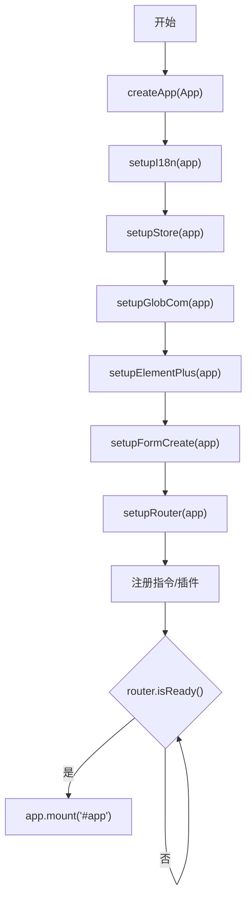
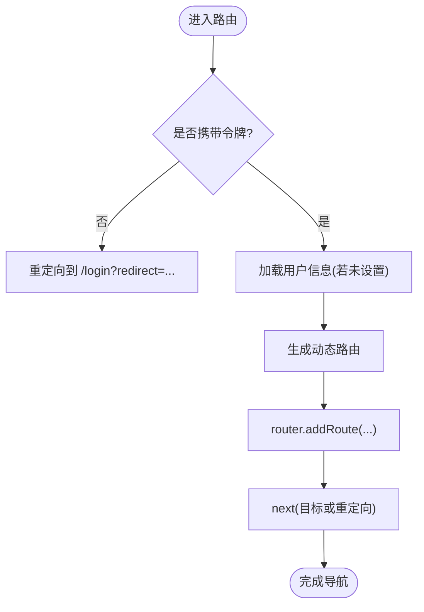
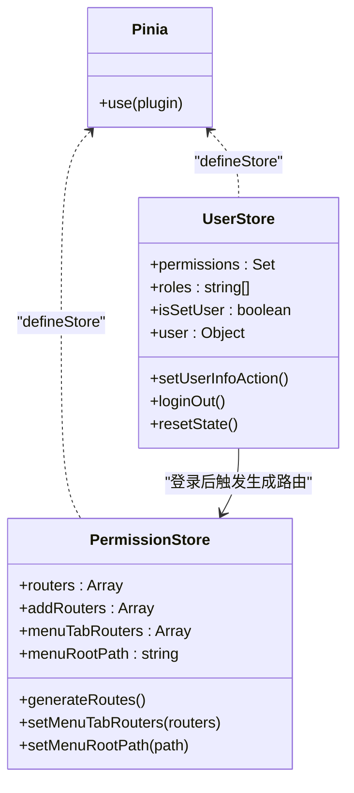
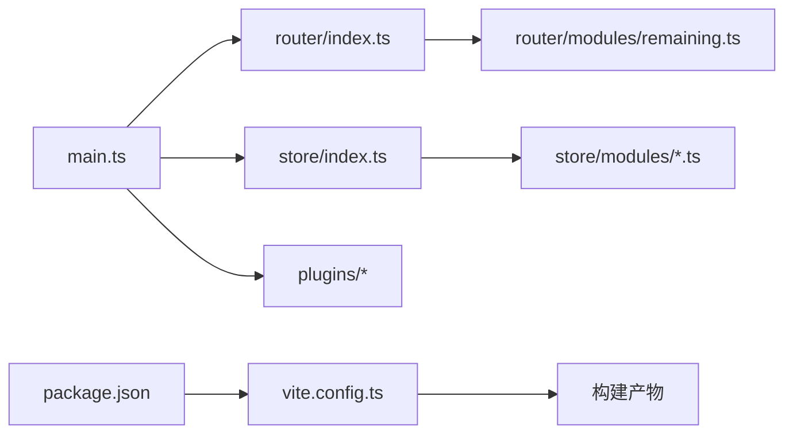

# 应用架构

<cite>
**本文引用的文件**
- [main.ts](file://yudao-ui-admin-vue3/src/main.ts)
- [App.vue](file://yudao-ui-admin-vue3/src/App.vue)
- [package.json](file://yudao-ui-admin-vue3/package.json)
- [vite.config.ts](file://yudao-ui-admin-vue3/vite.config.ts)
- [router/index.ts](file://yudao-ui-admin-vue3/src/router/index.ts)
- [permission.ts](file://yudao-ui-admin-vue3/src/permission.ts)
- [store/index.ts](file://yudao-ui-admin-vue3/src/store/index.ts)
- [store/modules/permission.ts](file://yudao-ui-admin-vue3/src/store/modules/permission.ts)
- [store/modules/user.ts](file://yudao-ui-admin-vue3/src/store/modules/user.ts)
- [router/modules/remaining.ts](file://yudao-ui-admin-vue3/src/router/modules/remaining.ts)
- [plugins/elementPlus/index.ts](file://yudao-ui-admin-vue3/src/plugins/elementPlus/index.ts)
- [plugins/vueI18n/index.ts](file://yudao-ui-admin-vue3/src/plugins/vueI18n/index.ts)
</cite>

## 目录
1. [简介](#简介)
2. [项目结构](#项目结构)
3. [核心组件](#核心组件)
4. [架构总览](#架构总览)
5. [详细组件分析](#详细组件分析)
6. [依赖关系分析](#依赖关系分析)
7. [性能考虑](#性能考虑)
8. [故障排查指南](#故障排查指南)
9. [结论](#结论)
10. [附录](#附录)

## 简介
本文件面向基于 Vue3 + Vite + Pinia + Vue Router 的管理后台前端工程，系统化说明应用的初始化流程、模块加载机制与插件注册过程；详解路由配置系统（含动态路由生成、权限控制与路由守卫）；文档化状态管理架构（Pinia 模块化设计、状态持久化与跨组件通信模式）；并覆盖应用生命周期管理、错误处理策略、性能优化方案、构建配置与部署流程，以及扩展开发与自定义集成指导。

## 项目结构
- 入口与装配：应用通过 main.ts 创建 Vue 实例，依次初始化国际化、状态管理、全局组件、UI 框架、表单引擎、路由、指令与第三方插件，最后挂载到 DOM。
- 根组件：App.vue 提供全局主题、灰度模式与路由视图容器。
- 路由：router/index.ts 创建路由实例并暴露 setupRouter；剩余静态路由集中在 router/modules/remaining.ts；动态路由在权限校验后由 permission.ts 触发注入。
- 状态：store/index.ts 统一创建 Pinia 并启用持久化插件；业务状态按模块拆分至 store/modules/*。
- 构建：vite.config.ts 集中管理开发服务器、SCSS 变量注入、别名、分包与压缩等；package.json 提供多环境脚本。

图表来源
- [main.ts:57-86](file://yudao-ui-admin-vue3/src/main.ts#L57-L86)
- [router/index.ts:7-20](file://yudao-ui-admin-vue3/src/router/index.ts#L7-L20)
- [permission.ts:28-71](file://yudao-ui-admin-vue3/src/permission.ts#L28-L71)
- [store/modules/user.ts:51-71](file://yudao-ui-admin-vue3/src/store/modules/user.ts#L51-L71)
- [store/modules/permission.ts:39-65](file://yudao-ui-admin-vue3/src/store/modules/permission.ts#L39-L65)

章节来源
- [main.ts:1-92](file://yudao-ui-admin-vue3/src/main.ts#L1-L92)
- [App.vue:1-58](file://yudao-ui-admin-vue3/src/App.vue#L1-L58)
- [router/index.ts:1-47](file://yudao-ui-admin-vue3/src/router/index.ts#L1-L47)
- [router/modules/remaining.ts:1-245](file://yudao-ui-admin-vue3/src/router/modules/remaining.ts#L1-L245)
- [store/index.ts:1-13](file://yudao-ui-admin-vue3/src/store/index.ts#L1-L13)

## 核心组件
- 应用初始化管线：main.ts 中按序执行 i18n、store、全局组件、UI 框架、表单引擎、路由、指令与第三方插件，确保依赖顺序正确。
- 路由与守卫：router/index.ts 提供路由实例与 resetRouter；permission.ts 实现 before/after 钩子，完成鉴权、字典与用户信息预取、动态路由注入与标题更新。
- 状态管理：store/index.ts 使用 Pinia 并启用持久化；user.ts 负责用户信息与菜单缓存；permission.ts 负责将后端菜单转换为可渲染路由并追加 404。
- 插件体系：elementPlus 按需引入必要组件；vueI18n 动态加载语言包并设置页面 lang。

章节来源
- [main.ts:57-86](file://yudao-ui-admin-vue3/src/main.ts#L57-L86)
- [permission.ts:28-78](file://yudao-ui-admin-vue3/src/permission.ts#L28-L78)
- [store/index.ts:1-13](file://yudao-ui-admin-vue3/src/store/index.ts#L1-L13)
- [store/modules/user.ts:51-71](file://yudao-ui-admin-vue3/src/store/modules/user.ts#L51-L71)
- [store/modules/permission.ts:39-65](file://yudao-ui-admin-vue3/src/store/modules/permission.ts#L39-L65)
- [plugins/elementPlus/index.ts:1-18](file://yudao-ui-admin-vue3/src/plugins/elementPlus/index.ts#L1-L18)
- [plugins/vueI18n/index.ts:9-42](file://yudao-ui-admin-vue3/src/plugins/vueI18n/index.ts#L9-L42)

## 架构总览
下图展示从浏览器访问到页面渲染的完整链路，包括鉴权、数据预取、动态路由注入与视图渲染。

图表来源
- [permission.ts:28-71](file://yudao-ui-admin-vue3/src/permission.ts#L28-L71)
- [store/modules/user.ts:51-71](file://yudao-ui-admin-vue3/src/store/modules/user.ts#L51-L71)
- [store/modules/permission.ts:39-65](file://yudao-ui-admin-vue3/src/store/modules/permission.ts#L39-L65)
- [router/index.ts:7-20](file://yudao-ui-admin-vue3/src/router/index.ts#L7-L20)

## 详细组件分析

### 应用初始化流程
- 创建应用实例并等待异步资源就绪。
- 依次安装国际化、状态管理、全局组件、UI 框架、表单引擎、路由、指令与第三方插件。
- 监听 Vite 预加载失败事件，自动刷新页面避免 chunk 哈希不一致导致的白屏。
- 等待路由就绪后挂载应用。

图表来源
- [main.ts:57-86](file://yudao-ui-admin-vue3/src/main.ts#L57-L86)

章节来源
- [main.ts:1-92](file://yudao-ui-admin-vue3/src/main.ts#L1-L92)

### 路由配置系统与动态路由
- 静态路由：router/modules/remaining.ts 定义基础路由（首页、登录、错误页、公共功能页等）。
- 动态路由：permission.ts 在登录后调用 user.store 获取用户信息（包含菜单），再由 permission.store 将菜单转换为路由表，并通过 router.addRoute 注入。
- 路由重置：resetRouter 支持移除除白名单外的所有动态路由，便于登出或切换租户时清理。
- 滚动行为：每次导航回到顶部，保证标签页切换体验一致。

图表来源
- [permission.ts:28-71](file://yudao-ui-admin-vue3/src/permission.ts#L28-L71)
- [store/modules/user.ts:51-71](file://yudao-ui-admin-vue3/src/store/modules/user.ts#L51-L71)
- [store/modules/permission.ts:39-65](file://yudao-ui-admin-vue3/src/store/modules/permission.ts#L39-L65)
- [router/index.ts:32-40](file://yudao-ui-admin-vue3/src/router/index.ts#L32-L40)

章节来源
- [router/index.ts:1-47](file://yudao-ui-admin-vue3/src/router/index.ts#L1-L47)
- [router/modules/remaining.ts:1-245](file://yudao-ui-admin-vue3/src/router/modules/remaining.ts#L1-L245)
- [permission.ts:1-79](file://yudao-ui-admin-vue3/src/permission.ts#L1-L79)
- [store/modules/permission.ts:1-80](file://yudao-ui-admin-vue3/src/store/modules/permission.ts#L1-L80)

### 权限控制与路由守卫
- 白名单：登录、社交登录、绑定、注册、OAuth 回调等路径无需鉴权。
- 前置守卫：
  - 显示进度条与页面加载态。
  - 若已登录且首次进入，则拉取字典、用户信息，生成并注入动态路由，再跳转到目标地址。
  - 若未登录且不在白名单，则跳转登录页并附带 redirect。
- 后置守卫：根据路由 meta.title 设置页面标题，结束进度条与加载态。

章节来源
- [permission.ts:17-78](file://yudao-ui-admin-vue3/src/permission.ts#L17-L78)

### 状态管理架构（Pinia 模块化）
- 全局 Store：store/index.ts 创建 Pinia 并启用持久化插件 pinia-plugin-persistedstate。
- 用户模块：store/modules/user.ts 维护用户信息、权限集合、角色列表与“是否已设置”标记；提供登录退出、头像昵称更新等方法，并将关键数据写入本地缓存。
- 权限模块：store/modules/permission.ts 负责将后端菜单转换为路由表，合并静态路由，并追加 404 兜底路由；提供菜单 Tab 路由与根路径管理能力。
- 跨组件通信：通过 Pinia 的响应式 state/getters/actions 在任意组件中订阅与更新；结合 useCache 进行本地缓存读写，实现状态持久化。

图表来源
- [store/modules/user.ts:24-103](file://yudao-ui-admin-vue3/src/store/modules/user.ts#L24-L103)
- [store/modules/permission.ts:17-75](file://yudao-ui-admin-vue3/src/store/modules/permission.ts#L17-L75)
- [store/index.ts:1-13](file://yudao-ui-admin-vue3/src/store/index.ts#L1-L13)

章节来源
- [store/index.ts:1-13](file://yudao-ui-admin-vue3/src/store/index.ts#L1-L13)
- [store/modules/user.ts:1-109](file://yudao-ui-admin-vue3/src/store/modules/user.ts#L1-L109)
- [store/modules/permission.ts:1-80](file://yudao-ui-admin-vue3/src/store/modules/permission.ts#L1-L80)

### 插件注册与全局能力
- Element Plus：按需引入必要组件与插件，避免全量引入带来的体积膨胀。
- 国际化：vueI18n 动态加载当前语言包，设置页面 lang，并提供 t 函数。
- 其他：统计、打印、富文本、动画等插件在 main.ts 中统一注册。

章节来源
- [plugins/elementPlus/index.ts:1-18](file://yudao-ui-admin-vue3/src/plugins/elementPlus/index.ts#L1-L18)
- [plugins/vueI18n/index.ts:9-42](file://yudao-ui-admin-vue3/src/plugins/vueI18n/index.ts#L9-L42)
- [main.ts:1-92](file://yudao-ui-admin-vue3/src/main.ts#L1-L92)

### 应用生命周期与错误处理
- 路由级错误：router.onError 捕获动态导入失败（如重新构建导致 chunk 哈希变化），自动跳转到目标页面。
- 预加载错误：window.addEventListener('vite:preloadError') 阻止默认行为并刷新页面，避免白屏。
- 页面加载反馈：beforeEach/afterEach 配合进度条与加载态，提升感知性能。

章节来源
- [router/index.ts:22-30](file://yudao-ui-admin-vue3/src/router/index.ts#L22-L30)
- [main.ts:50-54](file://yudao-ui-admin-vue3/src/main.ts#L50-L54)
- [permission.ts:28-78](file://yudao-ui-admin-vue3/src/permission.ts#L28-L78)

## 依赖关系分析
- 运行时依赖：Vue3、Vue Router、Pinia、Element Plus、i18n、ECharts、表单引擎等。
- 构建依赖：Vite、TypeScript、Sass、Unocss、ESLint/Prettier/Stylelint、压缩与图标插件等。
- 环境变量：通过 vite.config.ts 读取 .env.* 中的端口、基础路径、输出目录、调试开关等。

图表来源
- [main.ts:57-86](file://yudao-ui-admin-vue3/src/main.ts#L57-L86)
- [vite.config.ts:21-107](file://yudao-ui-admin-vue3/vite.config.ts#L21-L107)
- [package.json:7-29](file://yudao-ui-admin-vue3/package.json#L7-L29)

章节来源
- [package.json:1-159](file://yudao-ui-admin-vue3/package.json#L1-L159)
- [vite.config.ts:1-109](file://yudao-ui-admin-vue3/vite.config.ts#L1-L109)

## 性能考虑
- 代码分割与分包：vite.config.ts 将 ECharts、form-create 等大包单独拆分为独立 chunk，降低首屏体积。
- 压缩与调试开关：生产构建关闭 console/debugger，支持 inline sourcemap 按需开启。
- SCSS 变量注入：通过 additionalData 自动注入全局变量，减少重复 import。
- 懒加载路由：大量页面采用动态 import，减少初始包大小。
- 预加载错误恢复：监听 vite:preloadError 自动刷新，避免二次请求失败。
- 建议：
  - 对大组件与第三方库继续按需引入与懒加载。
  - 合理使用 keep-alive 与 noCache 控制组件缓存粒度。
  - 利用浏览器缓存与 CDN 加速静态资源。

章节来源
- [vite.config.ts:82-104](file://yudao-ui-admin-vue3/vite.config.ts#L82-L104)
- [router/modules/remaining.ts:1-245](file://yudao-ui-admin-vue3/src/router/modules/remaining.ts#L1-L245)
- [main.ts:50-54](file://yudao-ui-admin-vue3/src/main.ts#L50-L54)

## 故障排查指南
- 动态导入失败白屏：检查路由组件路径是否正确；确认构建后 chunk 名称是否变化；必要时触发页面刷新。
- 登录后无法进入目标页：检查 redirect 参数编码与解析逻辑；确认动态路由已注入；核对权限与菜单数据。
- 状态不同步：确认 Pinia 持久化插件生效；检查本地缓存键值是否被覆盖；必要时清除缓存重试。
- 样式异常：确认 SCSS 变量注入正常；检查 Element Plus 按需组件是否引入。

章节来源
- [router/index.ts:22-30](file://yudao-ui-admin-vue3/src/router/index.ts#L22-L30)
- [permission.ts:28-71](file://yudao-ui-admin-vue3/src/permission.ts#L28-L71)
- [store/index.ts:1-13](file://yudao-ui-admin-vue3/src/store/index.ts#L1-L13)

## 结论
本项目以清晰的初始化管线、完善的路由与权限体系、模块化的状态管理与健壮的构建配置，构建了可扩展、高性能的前端架构。通过动态路由与权限控制，实现了灵活的菜单与页面访问控制；借助 Pinia 与本地缓存，保证了状态的一致性与可用性；结合 Vite 的分包与压缩策略，有效提升了首屏性能与可维护性。

## 附录

### 构建与部署
- 开发环境：
  - 安装依赖：pnpm install
  - 启动开发服务：pnpm dev
  - 指定模式：pnpm dev-server（dev 模式）
- 构建命令：
  - 本地构建：pnpm build:local
  - 测试/预发/生产：pnpm build:test | build:stage | build:prod
  - 预览：pnpm preview
- 环境变量：
  - 通过 vite.config.ts 读取 .env.* 中的 VITE_BASE_PATH、VITE_PORT、VITE_OUT_DIR、VITE_SOURCEMAP、VITE_DROP_DEBUGGER、VITE_DROP_CONSOLE 等。
- 部署建议：
  - 将 dist 目录部署至静态资源服务器或反向代理后端。
  - 配置 base 路径与缓存策略，确保版本更新后资源正确刷新。

章节来源
- [package.json:7-29](file://yudao-ui-admin-vue3/package.json#L7-L29)
- [vite.config.ts:21-31](file://yudao-ui-admin-vue3/vite.config.ts#L21-L31)

### 扩展开发与自定义集成
- 新增页面：
  - 在 router/modules/remaining.ts 添加静态路由或在后端菜单中配置动态路由。
  - 在 views 下新建页面组件，并在路由中懒加载。
- 新增状态：
  - 在 store/modules 下新建模块，使用 defineStore 定义 state/getters/actions，并在需要处通过组合式 API 引入。
- 新增插件：
  - 在 plugins 目录下创建模块，导出 setupXxx(app) 并在 main.ts 中注册。
- 权限控制：
  - 通过后端返回的菜单与权限标识，结合 permission.store 生成路由；在前端使用 v-permission 指令或条件渲染控制按钮与区域可见性。

章节来源
- [router/modules/remaining.ts:1-245](file://yudao-ui-admin-vue3/src/router/modules/remaining.ts#L1-L245)
- [store/index.ts:1-13](file://yudao-ui-admin-vue3/src/store/index.ts#L1-L13)
- [main.ts:57-86](file://yudao-ui-admin-vue3/src/main.ts#L57-L86)