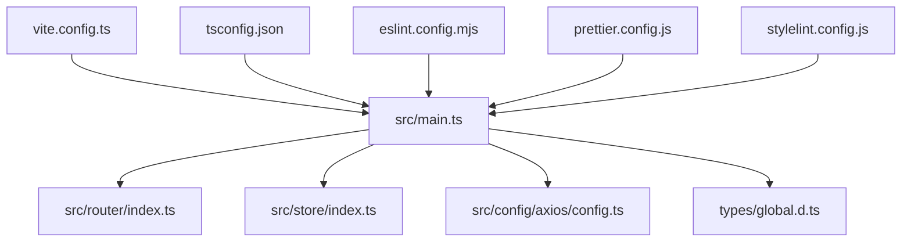
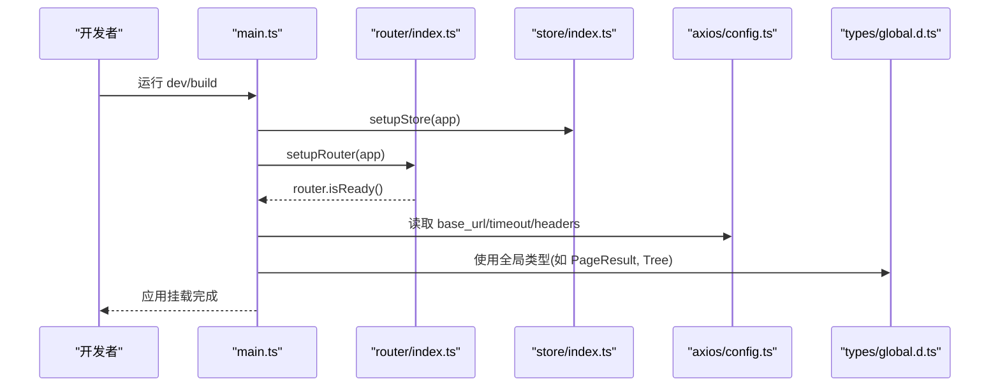
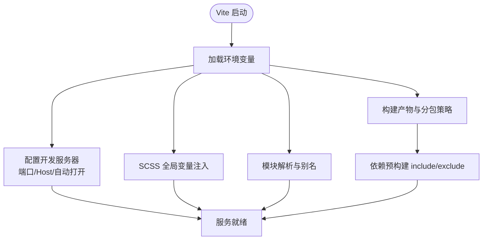
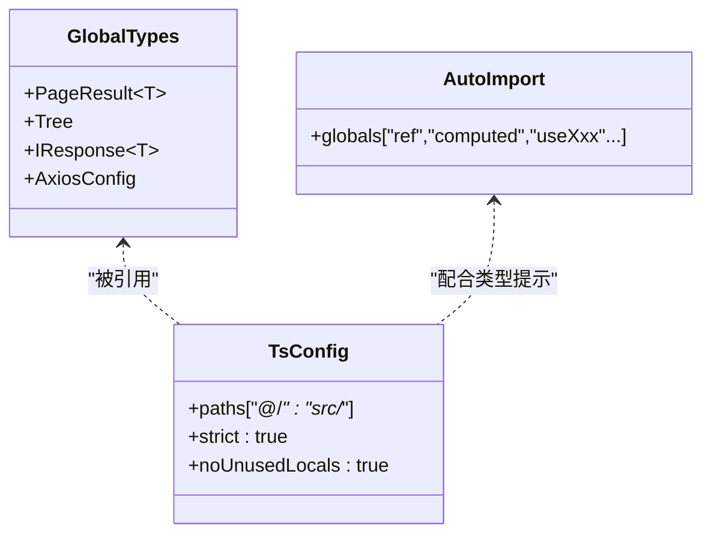
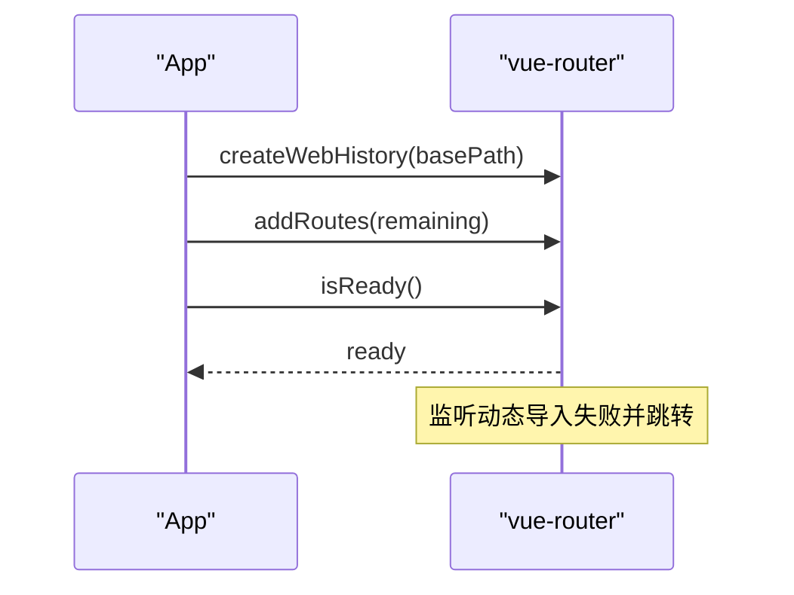
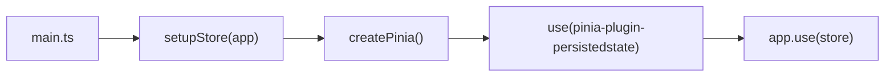
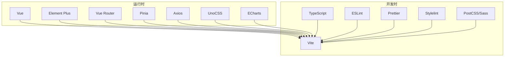

# 开发指南

<cite>
**本文引用的文件**
- [package.json](file://yudao-ui-admin-vue3/package.json)
- [README.md](file://yudao-ui-admin-vue3/README.md)
- [vite.config.ts](file://yudao-ui-admin-vue3/vite.config.ts)
- [tsconfig.json](file://yudao-ui-admin-vue3/tsconfig.json)
- [main.ts](file://yudao-ui-admin-vue3/src/main.ts)
- [eslint.config.mjs](file://yudao-ui-admin-vue3/eslint.config.mjs)
- [prettier.config.js](file://yudao-ui-admin-vue3/prettier.config.js)
- [stylelint.config.js](file://yudao-ui-admin-vue3/stylelint.config.js)
- [.eslintrc-auto-import.json](file://yudao-ui-admin-vue3/.eslintrc-auto-import.json)
- [global.d.ts](file://yudao-ui-admin-vue3/types/global.d.ts)
- [axios/config.ts](file://yudao-ui-admin-vue3/src/config/axios/config.ts)
- [store/index.ts](file://yudao-ui-admin-vue3/src/store/index.ts)
- [router/index.ts](file://yudao-ui-admin-vue3/src/router/index.ts)
</cite>

## 目录
1. [简介](#简介)
2. [项目结构](#项目结构)
3. [核心组件](#核心组件)
4. [架构总览](#架构总览)
5. [详细组件分析](#详细组件分析)
6. [依赖分析](#依赖分析)
7. [性能考虑](#性能考虑)
8. [故障排查指南](#故障排查指南)
9. [结论](#结论)
10. [附录](#附录)

## 简介
本指南面向前端开发者，覆盖开发环境搭建、依赖管理、构建与工具链配置、代码规范与命名约定、目录组织、TypeScript 类型定义与类型安全实践、调试技巧、性能分析与错误排查、测试策略（单元/集成/E2E）、重构建议与最佳实践。本项目基于 Vue 3 + Vite + TypeScript + Element Plus + UnoCSS，采用模块化与插件化架构，提供完善的开发体验与工程化能力。

## 项目结构
前端工程位于 yudao-ui-admin-vue3，核心目录与职责如下：
- src/main.ts：应用入口，统一初始化国际化、状态管理、全局组件、UI 库、表单构建器、路由、指令、打印等插件，并挂载根实例。
- src/config/axios/config.ts：Axios 基础配置（请求基地址、超时、默认头）。
- src/store/index.ts：Pinia 实例创建与持久化插件注册。
- src/router/index.ts：Vue Router 实例、历史模式、滚动行为、动态导入失败处理、路由重置。
- types/global.d.ts：全局类型声明（通用接口、分页、树形结构、HTTP 相关类型等）。
- vite.config.ts：Vite 构建与开发服务器配置，包含 SCSS 变量注入、别名、分包优化、压缩与 SourceMap 控制等。
- tsconfig.json：TypeScript 编译选项、路径映射、类型声明引入范围。
- eslint.config.mjs / prettier.config.js / stylelint.config.js：代码风格与质量检查规则。
- package.json：脚本命令、依赖版本、引擎要求。

**图表来源**
- [main.ts:1-92](file://yudao-ui-admin-vue3/src/main.ts#L1-L92)
- [router/index.ts:1-47](file://yudao-ui-admin-vue3/src/router/index.ts#L1-L47)
- [store/index.ts:1-13](file://yudao-ui-admin-vue3/src/store/index.ts#L1-L13)
- [axios/config.ts:1-29](file://yudao-ui-admin-vue3/src/config/axios/config.ts#L1-L29)
- [global.d.ts:1-70](file://yudao-ui-admin-vue3/types/global.d.ts#L1-L70)
- [vite.config.ts:1-109](file://yudao-ui-admin-vue3/vite.config.ts#L1-L109)
- [tsconfig.json:1-45](file://yudao-ui-admin-vue3/tsconfig.json#L1-L45)
- [eslint.config.mjs:1-118](file://yudao-ui-admin-vue3/eslint.config.mjs#L1-L118)
- [prettier.config.js:1-23](file://yudao-ui-admin-vue3/prettier.config.js#L1-L23)
- [stylelint.config.js:1-258](file://yudao-ui-admin-vue3/stylelint.config.js#L1-L258)

**章节来源**
- [package.json:1-159](file://yudao-ui-admin-vue3/package.json#L1-L159)
- [README.md:1-351](file://yudao-ui-admin-vue3/README.md#L1-L351)
- [vite.config.ts:1-109](file://yudao-ui-admin-vue3/vite.config.ts#L1-L109)
- [tsconfig.json:1-45](file://yudao-ui-admin-vue3/tsconfig.json#L1-L45)
- [main.ts:1-92](file://yudao-ui-admin-vue3/src/main.ts#L1-L92)

## 核心组件
- 应用启动流程：在 main.ts 中按顺序初始化 i18n、Pinia、全局组件、Element Plus、FormCreate、Router、指令、wangEditor 插件、打印插件，等待路由就绪后挂载根实例。
- 路由：使用 createWebHistory，支持滚动行为重置；对动态模块加载失败进行兜底跳转。
- 状态管理：Pinia + 持久化插件，便于跨会话保留关键状态。
- HTTP 客户端：Axios 基础配置集中管理，统一 base_url、超时、默认头。
- 类型系统：通过 tsconfig 与 types/global.d.ts 提供全局类型与路径别名，增强类型推断与一致性。

**章节来源**
- [main.ts:1-92](file://yudao-ui-admin-vue3/src/main.ts#L1-L92)
- [router/index.ts:1-47](file://yudao-ui-admin-vue3/src/router/index.ts#L1-L47)
- [store/index.ts:1-13](file://yudao-ui-admin-vue3/src/store/index.ts#L1-L13)
- [axios/config.ts:1-29](file://yudao-ui-admin-vue3/src/config/axios/config.ts#L1-L29)
- [global.d.ts:1-70](file://yudao-ui-admin-vue3/types/global.d.ts#L1-L70)

## 架构总览
下图展示应用启动时的关键调用链与模块关系：

**图表来源**
- [main.ts:57-89](file://yudao-ui-admin-vue3/src/main.ts#L57-L89)
- [router/index.ts:7-20](file://yudao-ui-admin-vue3/src/router/index.ts#L7-L20)
- [store/index.ts:5-10](file://yudao-ui-admin-vue3/src/store/index.ts#L5-L10)
- [axios/config.ts:1-29](file://yudao-ui-admin-vue3/src/config/axios/config.ts#L1-L29)
- [global.d.ts:49-68](file://yudao-ui-admin-vue3/types/global.d.ts#L49-L68)

## 详细组件分析

### 构建与开发工具链（Vite）
- 环境变量加载：根据 mode 或命令行参数加载 .env.* 文件，用于端口、代理、输出目录、SourceMap、是否删除 debugger/console 等。
- 开发服务器：host 绑定 0.0.0.0，可配置自动打开浏览器。
- CSS 预处理：SCSS 自动注入全局 variables.scss，避免重复注入导致冲突。
- 模块解析：扩展名与别名 @/* -> src/*。
- 构建优化：分包策略（echarts、form-create 等），按需压缩与 SourceMap 控制。
- 依赖预优化：include/exclude 列表控制预构建范围。

**图表来源**
- [vite.config.ts:21-107](file://yudao-ui-admin-vue3/vite.config.ts#L21-L107)

**章节来源**
- [vite.config.ts:1-109](file://yudao-ui-admin-vue3/vite.config.ts#L1-L109)

### 类型系统与类型安全实践
- 全局类型：在 types/global.d.ts 中定义通用接口（如 PageResult<T>、Tree、IResponse<T>、AxiosConfig 等），供全项目复用。
- 路径映射：tsconfig.json 中配置 @/* -> src/*，简化导入路径。
- 严格模式：启用 strict 与 noUnusedLocals/Parameters，提升类型安全性。
- 自动导入：通过 .eslintrc-auto-import.json 暴露大量 Vue/VueUse 全局函数，减少样板代码。

**图表来源**
- [global.d.ts:1-70](file://yudao-ui-admin-vue3/types/global.d.ts#L1-L70)
- [tsconfig.json:1-45](file://yudao-ui-admin-vue3/tsconfig.json#L1-L45)
- [.eslintrc-auto-import.json:1-260](file://yudao-ui-admin-vue3/.eslintrc-auto-import.json#L1-L260)

**章节来源**
- [global.d.ts:1-70](file://yudao-ui-admin-vue3/types/global.d.ts#L1-L70)
- [tsconfig.json:1-45](file://yudao-ui-admin-vue3/tsconfig.json#L1-L45)
- [.eslintrc-auto-import.json:1-260](file://yudao-ui-admin-vue3/.eslintrc-auto-import.json#L1-L260)

### 路由与权限
- 路由模式：createWebHistory，基于环境变量设置 base path。
- 滚动行为：切换路由时滚动条回到顶部，保证一致体验。
- 动态导入失败：捕获模块加载失败并跳转到目标页面，提升健壮性。
- 路由重置：提供 resetRouter 方法，便于登出或权限变更后清理动态路由。

**图表来源**
- [router/index.ts:7-20](file://yudao-ui-admin-vue3/src/router/index.ts#L7-L20)
- [router/index.ts:22-40](file://yudao-ui-admin-vue3/src/router/index.ts#L22-L40)

**章节来源**
- [router/index.ts:1-47](file://yudao-ui-admin-vue3/src/router/index.ts#L1-L47)

### 状态管理与数据流
- Pinia 实例：在 store/index.ts 中创建并使用持久化插件，便于跨刷新保持状态。
- 应用集成：main.ts 中通过 setupStore(app) 将 Pinia 注入到应用实例。

**图表来源**
- [store/index.ts:5-10](file://yudao-ui-admin-vue3/src/store/index.ts#L5-L10)
- [main.ts:60-63](file://yudao-ui-admin-vue3/src/main.ts#L60-L63)

**章节来源**
- [store/index.ts:1-13](file://yudao-ui-admin-vue3/src/store/index.ts#L1-L13)
- [main.ts:57-89](file://yudao-ui-admin-vue3/src/main.ts#L57-L89)

### HTTP 客户端配置
- 基础配置：base_url 由环境变量拼接，result_code 标识成功码，request_timeout 设置超时，default_headers 指定默认请求头。
- 类型约束：结合 global.d.ts 中的 AxiosHeaders/AxiosMethod/AxiosResponseType 等类型，确保类型安全。

**章节来源**
- [axios/config.ts:1-29](file://yudao-ui-admin-vue3/src/config/axios/config.ts#L1-L29)
- [global.d.ts:31-47](file://yudao-ui-admin-vue3/types/global.d.ts#L31-L47)

### 代码规范与质量保障
- ESLint：基于 flat config，集成 Vue、TypeScript、UnoCSS 规则，关闭部分过于严格的规则以适配团队习惯。
- Prettier：统一缩进、引号、分号、尾随逗号等格式。
- Stylelint：针对 CSS/SCSS/Vue 样式进行校验，包含属性排序与兼容规则。
- 自动导入：通过 auto-import 暴露常用 API 为全局，减少重复 import。

**章节来源**
- [eslint.config.mjs:1-118](file://yudao-ui-admin-vue3/eslint.config.mjs#L1-L118)
- [prettier.config.js:1-23](file://yudao-ui-admin-vue3/prettier.config.js#L1-L23)
- [stylelint.config.js:1-258](file://yudao-ui-admin-vue3/stylelint.config.js#L1-L258)
- [.eslintrc-auto-import.json:1-260](file://yudao-ui-admin-vue3/.eslintrc-auto-import.json#L1-L260)

## 依赖分析
- 运行时依赖：Vue、Element Plus、Vue Router、Pinia、Axios、UnoCSS、ECharts、富文本编辑器、视频播放器、即时通讯 SDK 等。
- 开发依赖：Vite、TypeScript、ESLint、Prettier、Stylelint、PostCSS、Sass、Rollup、压缩与图标插件等。
- 脚本命令：dev、build:*、preview、lint 系列、clean 等，覆盖开发与发布全流程。

**图表来源**
- [package.json:31-143](file://yudao-ui-admin-vue3/package.json#L31-L143)

**章节来源**
- [package.json:1-159](file://yudao-ui-admin-vue3/package.json#L1-L159)

## 性能考虑
- 构建体积与加载速度
  - 分包策略：将 ECharts、FormCreate 等大包单独拆分，降低首屏压力。
  - 压缩与 SourceMap：生产环境按需开启 SourceMap，关闭 console/debugger 以提升性能。
  - 依赖预构建：通过 optimizeDeps.include/exclude 控制预构建范围，缩短冷启动时间。
- 运行时性能
  - 路由懒加载：利用 Vue Router 的动态导入特性，减少初始包体。
  - 资源优化：合理使用图片、图标与字体，避免大资源阻塞。
  - 网络优化：合理设置请求超时与重试策略，缓存静态资源。

[本节为通用指导，不直接分析具体文件]

## 故障排查指南
- 动态模块加载失败
  - 现象：重新构建后 chunk 哈希变化导致动态导入失败。
  - 处理：main.ts 监听 vite:preloadError 事件并刷新页面；router.onError 捕获动态导入失败并跳转到目标路由。
- 路由滚动位置异常
  - 现象：切换标签页后滚动位置未重置。
  - 处理：router 的 scrollBehavior 强制滚动到顶部。
- 构建产物过大或加载慢
  - 检查：vite.config.ts 的分包策略与压缩配置；确认是否启用了不必要的插件或资源。
- 类型报错或提示缺失
  - 检查：tsconfig.json 的 paths 与 types；确认 auto-import 的全局类型已生效。

**章节来源**
- [main.ts:50-54](file://yudao-ui-admin-vue3/src/main.ts#L50-L54)
- [router/index.ts:22-30](file://yudao-ui-admin-vue3/src/router/index.ts#L22-L30)
- [vite.config.ts:82-106](file://yudao-ui-admin-vue3/vite.config.ts#L82-L106)
- [tsconfig.json:24-35](file://yudao-ui-admin-vue3/tsconfig.json#L24-L35)

## 结论
本项目提供了完善的前端工程化体系：基于 Vite 的高性能构建、TypeScript 的类型安全保障、统一的代码规范与质量门禁、以及清晰的模块划分与启动流程。遵循本指南的配置与实践，可快速搭建开发环境、稳定迭代业务功能，并在大规模项目中保持良好的可维护性与性能表现。

[本节为总结性内容，不直接分析具体文件]

## 附录

### 开发环境搭建与依赖管理
- 环境要求：Node.js >= 20.19.0，pnpm >= 8.6.0（见 engines 字段）。
- 安装依赖：使用 pnpm install。
- 启动开发服务器：pnpm dev（本地模式）或 pnpm dev-server（开发模式）。
- 构建与预览：
  - 构建：pnpm build:local / build:dev / build:test / build:stage / build:prod
  - 预览：pnpm preview 或 serve:dev / serve:prod

**章节来源**
- [package.json:7-29](file://yudao-ui-admin-vue3/package.json#L7-L29)
- [package.json:154-157](file://yudao-ui-admin-vue3/package.json#L154-L157)

### 构建工具与环境变量
- 环境变量：通过 VITE_* 前缀暴露给前端，如 VITE_BASE_PATH、VITE_PORT、VITE_OPEN、VITE_OUT_DIR、VITE_SOURCEMAP、VITE_DROP_DEBUGGER、VITE_DROP_CONSOLE、VITE_BASE_URL、VITE_API_URL。
- 构建输出：默认 dist，可通过 VITE_OUT_DIR 调整。
- SourceMap：通过 VITE_SOURCEMAP 控制 inline 或关闭。
- 压缩与调试：生产构建可移除 debugger 与 console。

**章节来源**
- [vite.config.ts:21-28](file://yudao-ui-admin-vue3/vite.config.ts#L21-L28)
- [vite.config.ts:30-47](file://yudao-ui-admin-vue3/vite.config.ts#L30-L47)
- [vite.config.ts:82-106](file://yudao-ui-admin-vue3/vite.config.ts#L82-L106)
- [axios/config.ts:1-29](file://yudao-ui-admin-vue3/src/config/axios/config.ts#L1-L29)

### 代码规范与命名约定
- 代码风格：ESLint + Prettier + Stylelint 统一代码风格与样式规范。
- 命名约定：遵循 Vue/TS 社区惯例，组件 PascalCase，文件与目录 kebab-case 或 PascalCase 保持一致。
- 提交规范：可结合 commitlint（已在 devDependencies 中）实现提交信息规范化。

**章节来源**
- [eslint.config.mjs:1-118](file://yudao-ui-admin-vue3/eslint.config.mjs#L1-L118)
- [prettier.config.js:1-23](file://yudao-ui-admin-vue3/prettier.config.js#L1-L23)
- [stylelint.config.js:1-258](file://yudao-ui-admin-vue3/stylelint.config.js#L1-L258)

### 目录结构与组织建议
- 视图层：views 下按模块划分页面，组件放在 components 下，公共逻辑抽取至 hooks/utils。
- 资源与样式：assets 存放静态资源，styles 管理全局样式与主题变量。
- 配置与工具：config 存放客户端配置，utils 提供通用工具函数。
- 类型与声明：types 放置全局类型与第三方类型声明。

[本节为通用指导，不直接分析具体文件]

### 单元测试、集成测试与端到端测试策略
- 单元测试：可使用 Vitest 或 Jest 对 utils、hooks、store 等进行单测，覆盖边界条件与异常分支。
- 集成测试：对路由、API 封装、组件交互进行集成验证，模拟后端响应与状态变化。
- 端到端测试：使用 Playwright/Cypress 对关键用户流程进行自动化测试，覆盖登录、导航、表单提交等。
- 持续集成：在 CI 中执行 lint、type-check、test、build，确保代码质量与稳定性。

[本节为通用指导，不直接分析具体文件]

### 调试技巧、性能分析与错误排查
- 调试技巧：
  - 开发阶段开启 SourceMap，借助浏览器 DevTools 定位问题。
  - 使用控制台日志与断点调试，注意生产环境移除 console/debugger。
- 性能分析：
  - 使用 Performance 面板分析渲染瓶颈，关注长任务与重排重绘。
  - 使用 Network 面板分析资源加载与请求耗时。
- 错误排查：
  - 关注路由动态导入失败与模块热更新导致的加载异常。
  - 检查环境变量是否正确加载，确保 API 地址与超时配置符合预期。

**章节来源**
- [vite.config.ts:82-106](file://yudao-ui-admin-vue3/vite.config.ts#L82-L106)
- [router/index.ts:22-30](file://yudao-ui-admin-vue3/src/router/index.ts#L22-L30)
- [main.ts:50-54](file://yudao-ui-admin-vue3/src/main.ts#L50-L54)

### 重构建议与最佳实践
- 类型优先：优先使用 TypeScript 类型约束，减少 any 的使用，充分利用泛型与联合类型。
- 组件拆分：将复杂组件拆分为更小的子组件，提高复用性与可测试性。
- 状态管理：尽量将副作用逻辑下沉到 store 或 composables，保持组件纯净。
- 构建优化：按需引入第三方库，避免全量引入；合理使用分包与懒加载。
- 文档与注释：为关键模块与接口添加清晰注释，便于团队协作与维护。

[本节为通用指导，不直接分析具体文件]