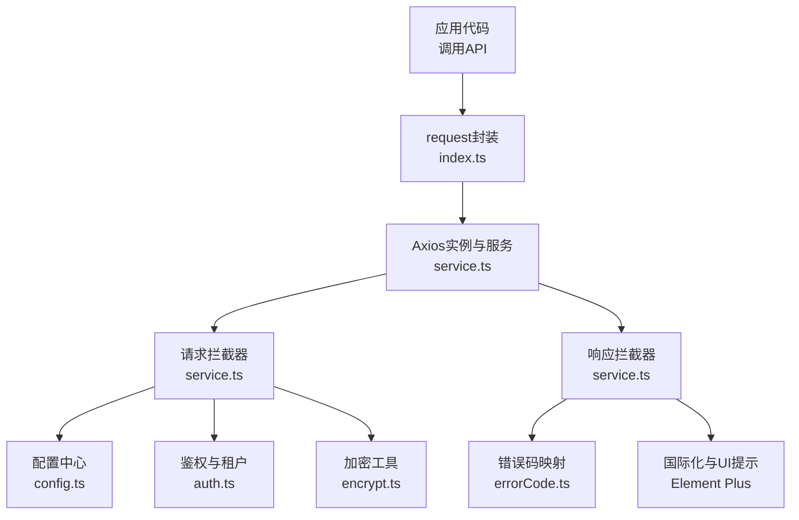
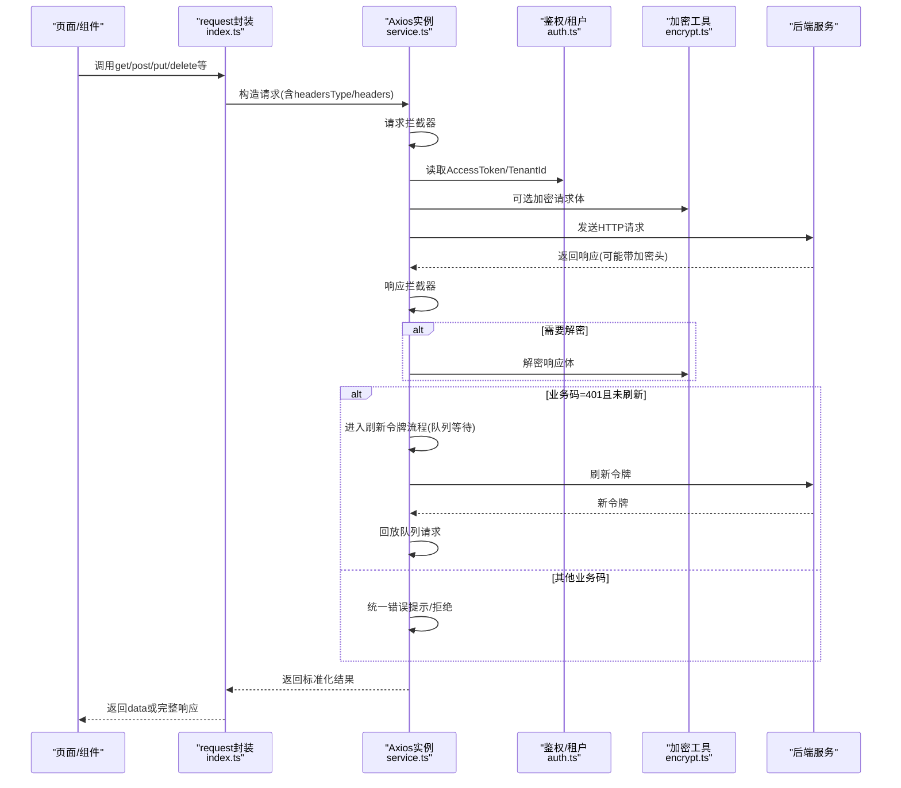
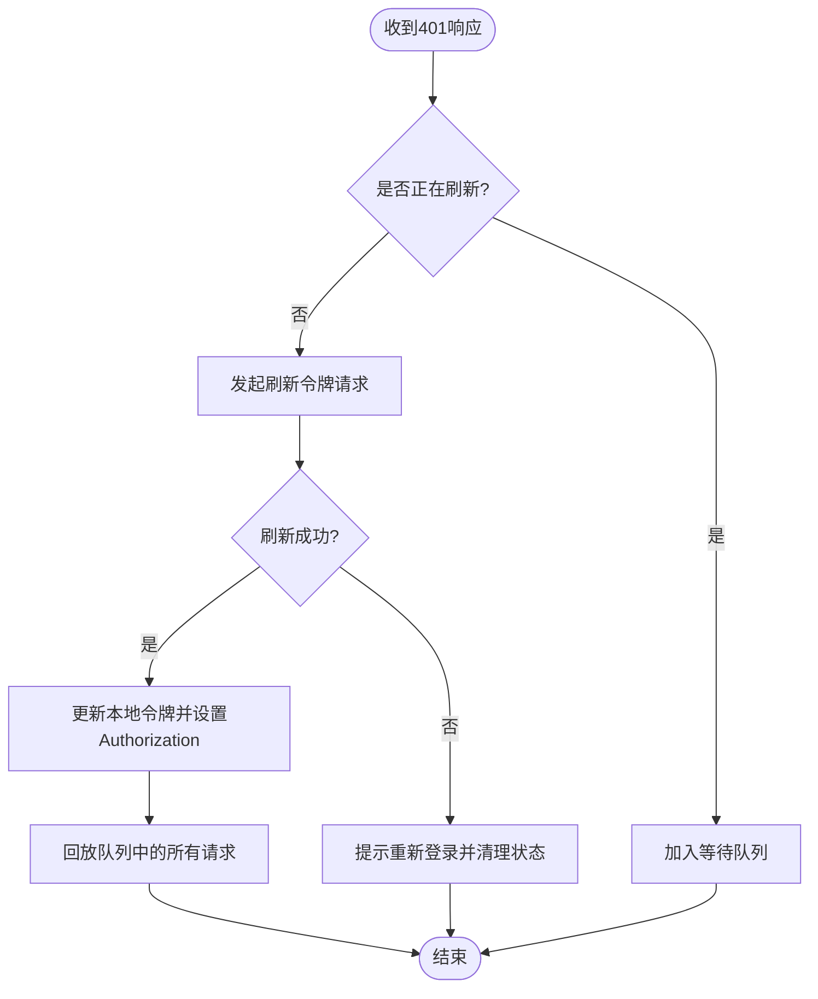
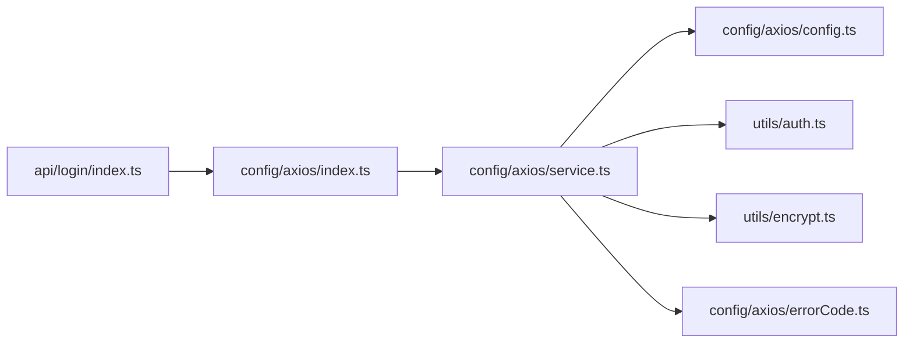

# API请求封装

<cite>
**本文引用的文件**
- [index.ts](file://yudao-ui-admin-vue3/src/config/axios/index.ts)
- [service.ts](file://yudao-ui-admin-vue3/src/config/axios/service.ts)
- [config.ts](file://yudao-ui-admin-vue3/src/config/axios/config.ts)
- [errorCode.ts](file://yudao-ui-admin-vue3/src/config/axios/errorCode.ts)
- [auth.ts](file://yudao-ui-admin-vue3/src/utils/auth.ts)
- [encrypt.ts](file://yudao-ui-admin-vue3/src/utils/encrypt.ts)
- [login/index.ts](file://yudao-ui-admin-vue3/src/api/login/index.ts)
</cite>

## 目录
1. [简介](#简介)
2. [项目结构](#项目结构)
3. [核心组件](#核心组件)
4. [架构总览](#架构总览)
5. [详细组件分析](#详细组件分析)
6. [依赖关系分析](#依赖关系分析)
7. [性能与可靠性](#性能与可靠性)
8. [故障排查指南](#故障排查指南)
9. [结论](#结论)
10. [附录：使用示例与最佳实践](#附录使用示例与最佳实践)

## 简介
本文件面向前端工程中的API请求封装层，系统性说明Axios实例的创建与配置、请求拦截器（Token注入、租户头、参数序列化、加密）、响应拦截器（统一响应格式、错误码处理、无感知刷新令牌）、HTTP方法封装（GET/POST/PUT/DELETE/下载/上传）以及重试与取消机制。文档同时提供实际调用示例与最佳实践建议，帮助开发者快速、安全、稳定地发起后端请求。

## 项目结构
该封装层位于Vue3管理端的前端工程中，核心目录为 src/config/axios，包含以下关键文件：
- config.ts：基础URL、超时、默认Content-Type等全局配置
- service.ts：Axios实例创建、请求/响应拦截器、令牌刷新、错误处理
- index.ts：对外的HTTP方法封装（get/post/put/delete/download/upload）
- errorCode.ts：业务错误码到提示信息的映射
- 辅助工具：auth.ts（Token/租户信息存取）、encrypt.ts（API加解密）

图表来源
- [index.ts:7-46](file://yudao-ui-admin-vue3/src/config/axios/index.ts#L7-L46)
- [service.ts:39-106](file://yudao-ui-admin-vue3/src/config/axios/service.ts#L39-L106)
- [service.ts:109-239](file://yudao-ui-admin-vue3/src/config/axios/service.ts#L109-L239)
- [config.ts:1-29](file://yudao-ui-admin-vue3/src/config/axios/config.ts#L1-L29)
- [auth.ts:11-86](file://yudao-ui-admin-vue3/src/utils/auth.ts#L11-L86)
- [encrypt.ts:143-232](file://yudao-ui-admin-vue3/src/utils/encrypt.ts#L143-L232)
- [errorCode.ts:1-7](file://yudao-ui-admin-vue3/src/config/axios/errorCode.ts#L1-L7)

章节来源
- [index.ts:1-48](file://yudao-ui-admin-vue3/src/config/axios/index.ts#L1-L48)
- [service.ts:1-272](file://yudao-ui-admin-vue3/src/config/axios/service.ts#L1-L272)
- [config.ts:1-29](file://yudao-ui-admin-vue3/src/config/axios/config.ts#L1-L29)
- [errorCode.ts:1-7](file://yudao-ui-admin-vue3/src/config/axios/errorCode.ts#L1-L7)
- [auth.ts:1-87](file://yudao-ui-admin-vue3/src/utils/auth.ts#L1-L87)
- [encrypt.ts:1-232](file://yudao-ui-admin-vue3/src/utils/encrypt.ts#L1-L232)

## 核心组件
- Axios实例与全局配置
  - 基础URL：由环境变量拼接得到
  - 超时时间：统一设置请求超时阈值
  - 默认Content-Type：JSON为主，支持表单与文件上传场景切换
  - 参数序列化：查询参数使用qs进行点号分隔序列化
- 请求拦截器
  - Token注入：自动附加Authorization头，白名单接口跳过
  - 租户上下文：根据开关注入tenant-id与visit-tenant-id
  - GET防缓存：追加Cache-Control与Pragma
  - 表单序列化：application/x-www-form-urlencoded时自动序列化对象
  - 可选加密：按标志位对请求体进行AES/RSA加密并设置加密标识头
- 响应拦截器
  - 二进制流直返：blob/arraybuffer直接返回，便于下载
  - 响应解密：根据响应头判断是否解密响应体
  - 统一业务码处理：成功、认证失败、系统错误、未知错误分类处理
  - 无感知刷新令牌：并发安全队列+单例刷新，刷新后回放请求
  - 网络/超时/状态码错误：统一提示并拒绝Promise
- HTTP方法封装
  - get/post/put/delete：统一返回data字段
  - postOriginal：返回完整响应体（用于验证码等）
  - download：以blob方式下载文件
  - upload：multipart/form-data上传文件

章节来源
- [config.ts:1-29](file://yudao-ui-admin-vue3/src/config/axios/config.ts#L1-L29)
- [service.ts:39-106](file://yudao-ui-admin-vue3/src/config/axios/service.ts#L39-L106)
- [service.ts:109-239](file://yudao-ui-admin-vue3/src/config/axios/service.ts#L109-L239)
- [index.ts:7-46](file://yudao-ui-admin-vue3/src/config/axios/index.ts#L7-L46)

## 架构总览
下图展示了从页面调用到服务端响应的完整链路，包括拦截器、加密、令牌刷新与错误处理。

图表来源
- [service.ts:39-106](file://yudao-ui-admin-vue3/src/config/axios/service.ts#L39-L106)
- [service.ts:109-239](file://yudao-ui-admin-vue3/src/config/axios/service.ts#L109-L239)
- [encrypt.ts:143-232](file://yudao-ui-admin-vue3/src/utils/encrypt.ts#L143-L232)
- [auth.ts:11-86](file://yudao-ui-admin-vue3/src/utils/auth.ts#L11-L86)

## 详细组件分析

### Axios实例与配置
- 基础URL：通过环境变量拼接，便于多环境部署
- 超时：统一设置请求超时，避免长时间阻塞
- 默认头部：默认JSON；上传时通过封装方法切换为multipart/form-data
- 参数序列化：查询参数使用qs序列化，兼容复杂对象

章节来源
- [config.ts:1-29](file://yudao-ui-admin-vue3/src/config/axios/config.ts#L1-L29)
- [service.ts:39-47](file://yudao-ui-admin-vue3/src/config/axios/service.ts#L39-L47)

### 请求拦截器
- Token注入：若接口不在白名单且存在访问令牌，则自动在Authorization头中附加Bearer前缀
- 租户上下文：当启用租户时，注入tenant-id；登录态下可注入visit-tenant-id
- GET防缓存：为GET请求添加no-cache相关头
- 表单序列化：当Content-Type为application/x-www-form-urlencoded时，将对象序列化为字符串
- 可选加密：当请求头标记isEncrypt为true且尚未加密时，对请求体进行AES或RSA加密，并设置加密标识头

章节来源
- [service.ts:50-106](file://yudao-ui-admin-vue3/src/config/axios/service.ts#L50-L106)
- [auth.ts:11-86](file://yudao-ui-admin-vue3/src/utils/auth.ts#L11-L86)
- [encrypt.ts:143-232](file://yudao-ui-admin-vue3/src/utils/encrypt.ts#L143-L232)

### 响应拦截器
- 二进制流处理：当responseType为blob/arraybuffer时，若非JSON类型直接返回数据，否则解析为JSON以便错误提示
- 响应解密：根据响应头判断是否解密响应体
- 统一业务码处理：
  - 成功：返回data
  - 401：触发无感知刷新令牌流程，刷新成功后重试原请求
  - 500/901：展示错误消息并拒绝
  - 其他非成功码：统一提示或忽略特定刷新令牌错误
- 网络/超时/状态码错误：统一转换为友好提示并拒绝

章节来源
- [service.ts:109-239](file://yudao-ui-admin-vue3/src/config/axios/service.ts#L109-L239)
- [errorCode.ts:1-7](file://yudao-ui-admin-vue3/src/config/axios/errorCode.ts#L1-L7)

### 无感知刷新令牌（并发安全）
- 并发控制：维护请求队列与刷新标志，确保同一时刻仅一次刷新
- 刷新逻辑：获取刷新令牌，更新本地存储，重新设置Authorization头，回放队列中的请求
- 失败处理：刷新失败时清空队列并引导用户重新登录

图表来源
- [service.ts:152-194](file://yudao-ui-admin-vue3/src/config/axios/service.ts#L152-L194)
- [service.ts:241-270](file://yudao-ui-admin-vue3/src/config/axios/service.ts#L241-L270)

### HTTP方法封装
- get/post/put/delete：统一返回data字段，简化调用方处理
- postOriginal：返回完整响应体，适用于验证码等非标准响应
- download：以blob方式下载文件，适合导出Excel等场景
- upload：自动设置multipart/form-data，适合文件上传

章节来源
- [index.ts:7-46](file://yudao-ui-admin-vue3/src/config/axios/index.ts#L7-L46)

### 文件上传与下载
- 上传：通过upload方法设置Content-Type为multipart/form-data，配合FormData提交文件
- 下载：通过download方法设置responseType为blob，接收二进制流并触发浏览器下载

章节来源
- [index.ts:38-46](file://yudao-ui-admin-vue3/src/config/axios/index.ts#L38-L46)
- [service.ts:136-145](file://yudao-ui-admin-vue3/src/config/axios/service.ts#L136-L145)

### 请求重试与取消
- 重试：当前实现采用“无感知刷新令牌”的重试策略，仅在401时自动重试；其他错误不自动重试
- 取消：当前封装未内置AbortController取消机制；如需支持，可在调用处自行传入cancelToken或在封装层扩展

章节来源
- [service.ts:152-194](file://yudao-ui-admin-vue3/src/config/axios/service.ts#L152-L194)

## 依赖关系分析
- 模块耦合
  - index.ts依赖service.ts与config.ts，对外暴露简洁API
  - service.ts依赖config.ts、auth.ts、encrypt.ts、errorCode.ts及UI库
  - 各API模块（如login/index.ts）通过import request调用封装层
- 外部依赖
  - axios：HTTP客户端
  - qs：参数序列化
  - Element Plus：消息与确认框
  - crypto-js/jsencrypt：加解密算法

图表来源
- [login/index.ts:1-92](file://yudao-ui-admin-vue3/src/api/login/index.ts#L1-L92)
- [index.ts:1-48](file://yudao-ui-admin-vue3/src/config/axios/index.ts#L1-L48)
- [service.ts:1-272](file://yudao-ui-admin-vue3/src/config/axios/service.ts#L1-L272)
- [config.ts:1-29](file://yudao-ui-admin-vue3/src/config/axios/config.ts#L1-L29)
- [auth.ts:1-87](file://yudao-ui-admin-vue3/src/utils/auth.ts#L1-L87)
- [encrypt.ts:1-232](file://yudao-ui-admin-vue3/src/utils/encrypt.ts#L1-L232)
- [errorCode.ts:1-7](file://yudao-ui-admin-vue3/src/config/axios/errorCode.ts#L1-L7)

章节来源
- [login/index.ts:1-92](file://yudao-ui-admin-vue3/src/api/login/index.ts#L1-L92)
- [index.ts:1-48](file://yudao-ui-admin-vue3/src/config/axios/index.ts#L1-L48)
- [service.ts:1-272](file://yudao-ui-admin-vue3/src/config/axios/service.ts#L1-L272)

## 性能与可靠性
- 性能优化
  - 查询参数序列化：使用qs提升复杂对象传输效率
  - GET防缓存：减少重复请求的网络开销
  - 二进制流直返：避免不必要的JSON解析
- 可靠性保障
  - 统一错误处理：网络、超时、状态码均给出友好提示
  - 无感知刷新令牌：降低并发下的401风暴
  - 可选加密：保护敏感数据传输

[本节为通用指导，不直接分析具体文件]

## 故障排查指南
- 401频繁出现
  - 检查刷新令牌是否存在与有效
  - 查看刷新接口是否被正确调用
  - 确认白名单接口是否正确配置
- 下载文件异常
  - 确认responseType为blob/arraybuffer
  - 检查响应是否为JSON错误而非二进制流
- 加密/解密失败
  - 核对环境变量中的算法与密钥配置
  - 检查请求头与响应头加密标识是否一致
- 表单提交报错
  - 确认Content-Type与数据格式匹配
  - 检查是否触发了自动序列化逻辑

章节来源
- [service.ts:152-239](file://yudao-ui-admin-vue3/src/config/axios/service.ts#L152-L239)
- [encrypt.ts:143-232](file://yudao-ui-admin-vue3/src/utils/encrypt.ts#L143-L232)

## 结论
该API请求封装层提供了完整的Axios实例化、拦截器、统一错误处理、无感知刷新令牌、文件上传下载与可选加密能力。通过简洁的HTTP方法封装，显著降低了业务代码的复杂度，提升了可维护性与一致性。建议在项目中遵循本文的最佳实践，按需开启加密与租户功能，并结合业务场景完善取消与重试策略。

[本节为总结性内容，不直接分析具体文件]

## 附录：使用示例与最佳实践

### 基本用法示例
- 登录（无需加密）
  - 调用方式：post({ url, data, headers: { isEncrypt: false } })
  - 参考路径：[login/index.ts:15-23](file://yudao-ui-admin-vue3/src/api/login/index.ts#L15-L23)
- 获取租户信息
  - 调用方式：get({ url })
  - 参考路径：[login/index.ts:31-38](file://yudao-ui-admin-vue3/src/api/login/index.ts#L31-L38)
- 获取验证码（原始响应）
  - 调用方式：postOriginal({ url, data })
  - 参考路径：[login/index.ts:79-86](file://yudao-ui-admin-vue3/src/api/login/index.ts#L79-L86)

### 最佳实践建议
- 统一使用封装方法：优先使用get/post/put/delete，避免直接使用axios
- 明确Content-Type：表单提交使用application/x-www-form-urlencoded，文件上传使用multipart/form-data
- 合理使用加密：对敏感接口开启isEncrypt，并确保前后端密钥一致
- 处理二进制响应：下载时使用download方法，注意区分JSON错误与文件流
- 错误处理：在调用处捕获Promise.reject的错误，结合UI提示用户
- 并发与刷新：利用内置刷新机制，避免手动处理401重试

章节来源
- [login/index.ts:1-92](file://yudao-ui-admin-vue3/src/api/login/index.ts#L1-L92)
- [index.ts:7-46](file://yudao-ui-admin-vue3/src/config/axios/index.ts#L7-L46)
- [service.ts:50-106](file://yudao-ui-admin-vue3/src/config/axios/service.ts#L50-L106)
- [service.ts:109-239](file://yudao-ui-admin-vue3/src/config/axios/service.ts#L109-L239)