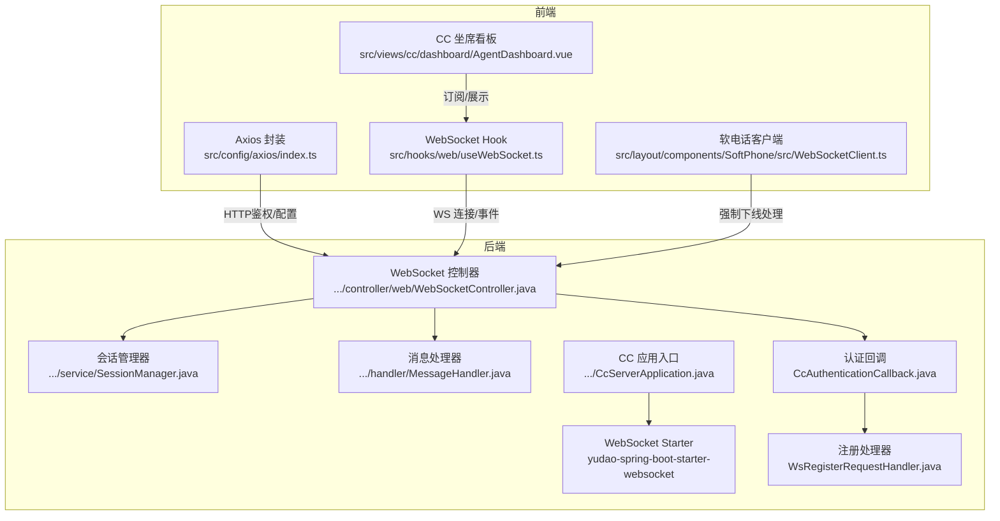
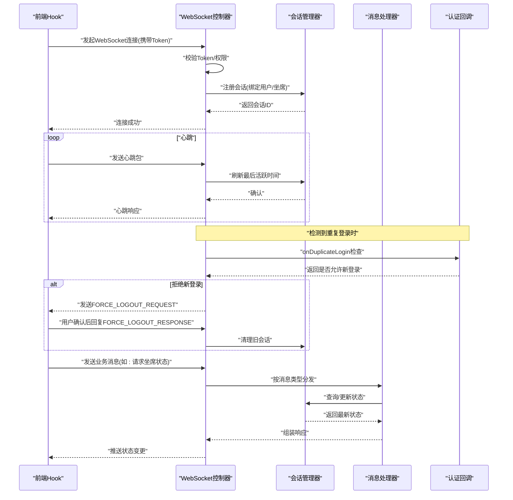
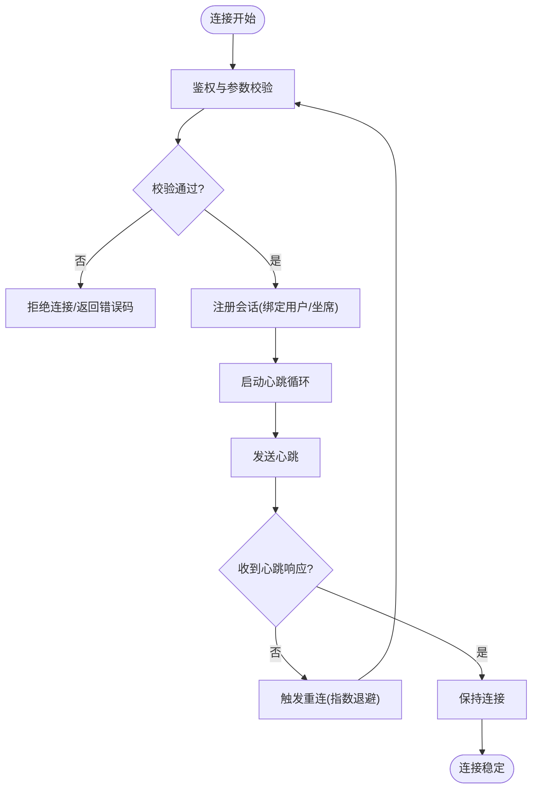
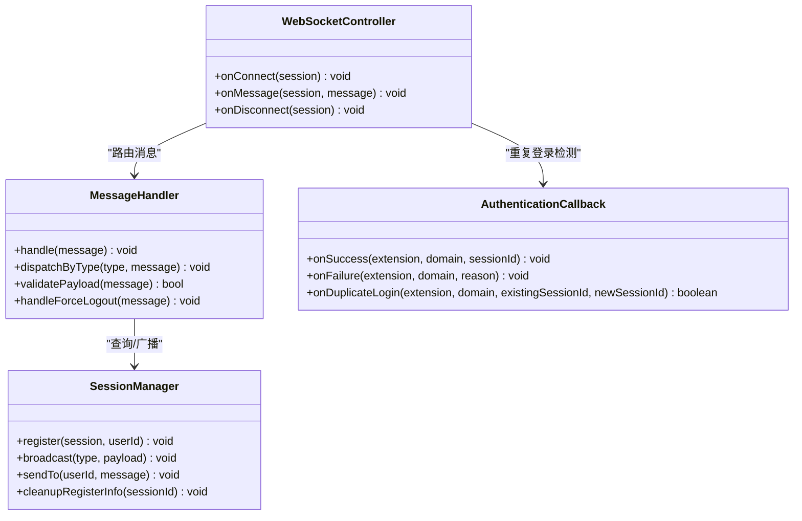
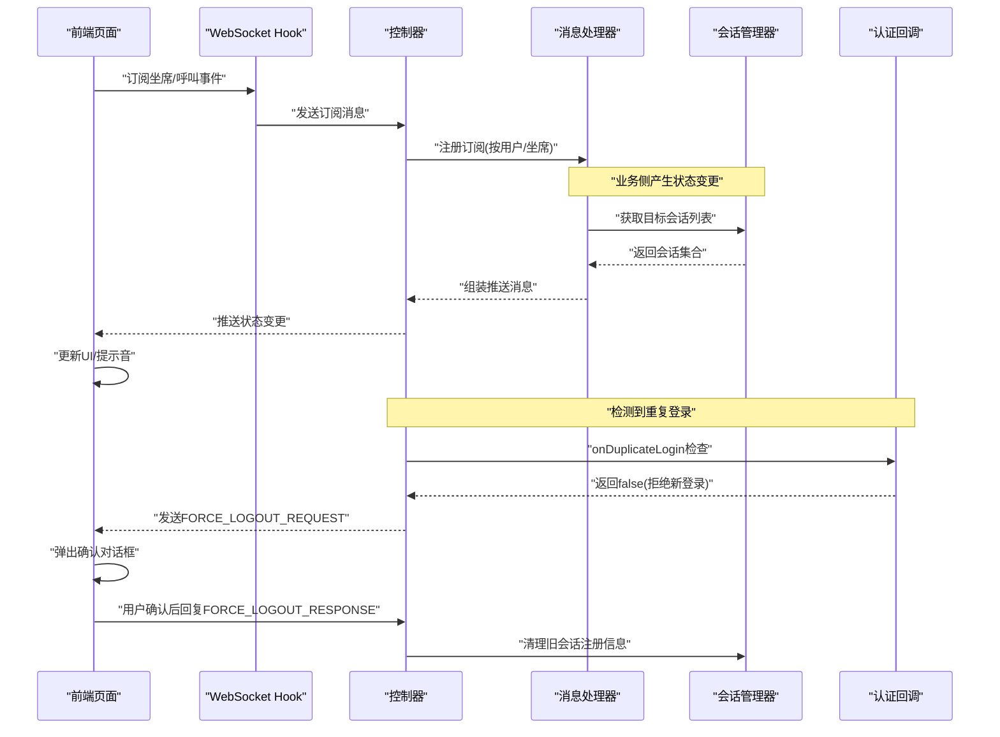
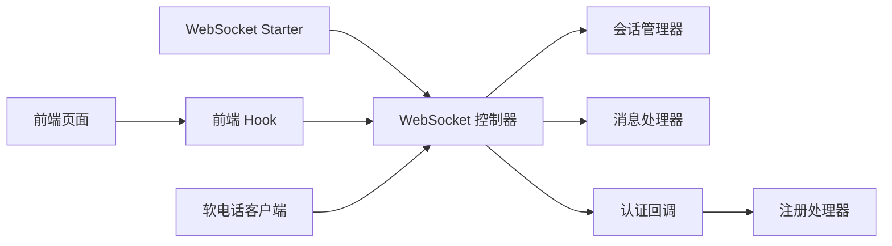

# WebSocket实时通信

<cite>
**本文引用的文件**
- [yudao-spring-boot-starter-websocket/pom.xml](file://yudao-cloud/yudao-framework/yudao-spring-boot-starter-websocket/pom.xml)
- [CC 模块启动类与配置](file://yudao-cloud/yudao-module-cc-server/src/main/java/cn/iocoder/yudao/module/cc/CcServerApplication.java)
- [CC 模块控制器（WebSocket 路由示例）](file://yudao-cloud/yudao-module-cc-server/src/main/java/cn/iocoder/yudao/module/cc/controller/web/WebSocketController.java)
- [CC 模块会话管理器（连接管理示例）](file://yudao-cloud/yudao-module-cc-server/src/main/java/cn/iocoder/yudao/module/cc/service/SessionManager.java)
- [CC 模块消息处理器（事件分发示例）](file://yudao-cloud/yudao-module-cc-server/src/main/java/cn/iocoder/yudao/module/cc/handler/MessageHandler.java)
- [前端 API 调用封装（Axios 配置）](file://yudao-ui-admin-vue3/src/config/axios/index.ts)
- [前端 Webhook/通知 Hook（事件监听示例）](file://yudao-ui-admin-vue3/src/hooks/web/useWebSocket.ts)
- [前端 CC 页面（坐席状态与通话监控）](file://yudao-ui-admin-vue3/src/views/cc/dashboard/AgentDashboard.vue)
- [前端软电话 WebSocket 客户端](file://yudao-ui-admin-vue3/src/layout/components/SoftPhone/src/WebSocketClient.ts)
- [前端软电话组件](file://yudao-ui-admin-vue3/src/layout/components/SoftPhone/src/SoftPhone.vue)
- [CC 认证回调（强制下线逻辑）](file://yudao-cloud/yudao-module-cc/yudao-module-cc-server/src/main/java/cn/iocoder/yudao/module/cc/sipproxy/integration/CcAuthenticationCallback.java)
- [SIP 注册请求处理器](file://yudao-cloud/yudao-module-cc/ipcc-sipproxy/src/main/java/cn/ipcc/sipproxy/core/handler/request/ws/WsRegisterRequestHandler.java)
- [WebSocket 消息发送器](file://yudao-cloud/yudao-module-cc/yudao-module-cc-server/src/main/java/cn/iocoder/yudao/module/cc/websocket/core/sender/CcWebSocketMessageSender.java)
</cite>

## 更新摘要

**变更内容**

- 新增 FORCE_LOGOUT_REQUEST/FORCE_LOGOUT_RESPONSE 消息类型支持，实现坐席强制下线功能
- 增强前端 WebSocketClient.ts 的消息类型定义和回调注册机制
- 完善后端认证回调机制，支持重复登录检测和强制踢下线流程
- 更新消息协议格式，包含新的强制下线相关消息类型

## 目录
1. [简介](#简介)
2. [项目结构](#项目结构)
3. [核心组件](#核心组件)
4. [架构总览](#架构总览)
5. [详细组件分析](#详细组件分析)
6. [依赖关系分析](#依赖关系分析)
7. [性能考虑](#性能考虑)
8. [故障排查指南](#故障排查指南)
9. [结论](#结论)
10. [附录](#附录)

## 简介

本文件面向"呼叫中心（CC）"场景下的 WebSocket
实时通信，覆盖连接建立与管理、心跳检测与自动重连、消息协议定义、事件驱动的消息处理模式、坐席状态同步、呼叫状态更新与实时监控等核心能力。同时给出连接异常处理、断线恢复、数据一致性保证机制，以及前端集成示例、调试方法与性能优化建议。

**最新更新**：新增了坐席强制下线功能的实时通信机制，通过 FORCE_LOGOUT_REQUEST/FORCE_LOGOUT_RESPONSE
消息类型实现同一坐席在多设备登录时的冲突处理和用户确认流程。

## 项目结构
本项目采用前后端分离架构：
- 后端：基于 Spring Boot 的 yudao-module-cc-server 提供 WebSocket 服务；通过 yudao-spring-boot-starter-websocket 提供通用能力；CC 模块内包含控制器、会话管理、消息处理等。
- 前端：Vue3 工程 yudao-ui-admin-vue3，使用 Axios 进行 HTTP 交互，并通过自定义 Hook 管理 WebSocket 连接与事件分发。

图表来源

- [CC 模块启动类与配置](file://yudao-cloud/yudao-module-cc-server/src/main/java/cn/iocoder/yudao/module/cc/CcServerApplication.java)
- [CC 模块控制器（WebSocket 路由示例）](file://yudao-cloud/yudao-module-cc-server/src/main/java/cn/iocoder/yudao/module/cc/controller/web/WebSocketController.java)
- [CC 模块会话管理器（连接管理示例）](file://yudao-cloud/yudao-module-cc-server/src/main/java/cn/iocoder/yudao/module/cc/service/SessionManager.java)
- [CC 模块消息处理器（事件分发示例）](file://yudao-cloud/yudao-module-cc-server/src/main/java/cn/iocoder/yudao/module/cc/handler/MessageHandler.java)
- [CC 认证回调（强制下线逻辑）](file://yudao-cloud/yudao-module-cc/yudao-module-cc-server/src/main/java/cn/iocoder/yudao/module/cc/sipproxy/integration/CcAuthenticationCallback.java)
- [SIP 注册请求处理器](file://yudao-cloud/yudao-module-cc/ipcc-sipproxy/src/main/java/cn/ipcc/sipproxy/core/handler/request/ws/WsRegisterRequestHandler.java)
- [前端软电话 WebSocket 客户端](file://yudao-ui-admin-vue3/src/layout/components/SoftPhone/src/WebSocketClient.ts)

章节来源

- [CC 模块启动类与配置](file://yudao-cloud/yudao-module-cc-server/src/main/java/cn/iocoder/yudao/module/cc/CcServerApplication.java)
- [CC 模块控制器（WebSocket 路由示例）](file://yudao-cloud/yudao-module-cc-server/src/main/java/cn/iocoder/yudao/module/cc/controller/web/WebSocketController.java)
- [CC 模块会话管理器（连接管理示例）](file://yudao-cloud/yudao-module-cc-server/src/main/java/cn/iocoder/yudao/module/cc/service/SessionManager.java)
- [CC 模块消息处理器（事件分发示例）](file://yudao-cloud/yudao-module-cc-server/src/main/java/cn/iocoder/yudao/module/cc/handler/MessageHandler.java)
- [前端 API 调用封装（Axios 配置）](file://yudao-ui-admin-vue3/src/config/axios/index.ts)
- [前端 Webhook/通知 Hook（事件监听示例）](file://yudao-ui-admin-vue3/src/hooks/web/useWebSocket.ts)

## 核心组件
- WebSocket Starter：提供基础 WebSocket 能力与扩展点，便于在业务模块中快速接入。
- 控制器（WebSocketController）：负责握手、鉴权、路由到具体业务处理器，维护会话上下文。
- 会话管理器（SessionManager）：管理在线会话、广播、按用户/坐席维度的消息投递。
- 消息处理器（MessageHandler）：实现事件驱动的消息分发，统一解析消息类型并执行业务逻辑。
- 认证回调（AuthenticationCallback）：处理 SIP 注册过程中的重复登录检测和强制下线逻辑。
- 前端 Hook（useWebSocket）：封装连接生命周期、心跳、重连、事件订阅与发布。
- 前端页面（AgentDashboard）：订阅坐席状态、呼叫状态与实时监控数据，驱动 UI 更新。
- 软电话客户端（WebSocketClient）：专门处理软电话相关的 WebSocket 通信，包括强制下线消息处理。

章节来源
- [yudao-spring-boot-starter-websocket/pom.xml](file://yudao-cloud/yudao-framework/yudao-spring-boot-starter-websocket/pom.xml)
- [CC 模块控制器（WebSocket 路由示例）](file://yudao-cloud/yudao-module-cc-server/src/main/java/cn/iocoder/yudao/module/cc/controller/web/WebSocketController.java)
- [CC 模块会话管理器（连接管理示例）](file://yudao-cloud/yudao-module-cc-server/src/main/java/cn/iocoder/yudao/module/cc/service/SessionManager.java)
- [CC 模块消息处理器（事件分发示例）](file://yudao-cloud/yudao-module-cc-server/src/main/java/cn/iocoder/yudao/module/cc/handler/MessageHandler.java)
- [CC 认证回调（强制下线逻辑）](file://yudao-cloud/yudao-module-cc/yudao-module-cc-server/src/main/java/cn/iocoder/yudao/module/cc/sipproxy/integration/CcAuthenticationCallback.java)
- [前端 Webhook/通知 Hook（事件监听示例）](file://yudao-ui-admin-vue3/src/hooks/web/useWebSocket.ts)
- [前端 CC 页面（坐席状态与通话监控）](file://yudao-ui-admin-vue3/src/views/cc/dashboard/AgentDashboard.vue)
- [前端软电话 WebSocket 客户端](file://yudao-ui-admin-vue3/src/layout/components/SoftPhone/src/WebSocketClient.ts)

## 架构总览

下图展示了从前端连接到后端处理的核心流程，包括鉴权、会话注册、消息分发与推送，以及新增的强制下线处理流程。

图表来源
- [CC 模块控制器（WebSocket 路由示例）](file://yudao-cloud/yudao-module-cc-server/src/main/java/cn/iocoder/yudao/module/cc/controller/web/WebSocketController.java)
- [CC 模块会话管理器（连接管理示例）](file://yudao-cloud/yudao-module-cc-server/src/main/java/cn/iocoder/yudao/module/cc/service/SessionManager.java)
- [CC 模块消息处理器（事件分发示例）](file://yudao-cloud/yudao-module-cc-server/src/main/java/cn/iocoder/yudao/module/cc/handler/MessageHandler.java)
- [CC 认证回调（强制下线逻辑）](file://yudao-cloud/yudao-module-cc/yudao-module-cc-server/src/main/java/cn/iocoder/yudao/module/cc/sipproxy/integration/CcAuthenticationCallback.java)
- [前端 Webhook/通知 Hook（事件监听示例）](file://yudao-ui-admin-vue3/src/hooks/web/useWebSocket.ts)

## 详细组件分析

### 连接建立与管理
- 连接配置
  - 后端：通过 WebSocket Starter 暴露端点，控制器完成鉴权与会话绑定。
  - 前端：使用 Hook 初始化连接，传入鉴权令牌与回调函数。
- 会话管理
  - 会话注册：连接成功后将 WebSocket 会话与用户/坐席 ID 绑定。
  - 会话清理：断开连接时释放资源，移除会话映射。
- 心跳检测
  - 客户端定时发送心跳，服务端刷新活跃时间并返回响应。
  - 超时未收到心跳则判定为断线，触发重连或清理。
- 自动重连
  - 前端 Hook 实现指数退避重连策略，支持最大重试次数与抖动。
  - 重连后重新鉴权与会话注册。

图表来源
- [CC 模块控制器（WebSocket 路由示例）](file://yudao-cloud/yudao-module-cc-server/src/main/java/cn/iocoder/yudao/module/cc/controller/web/WebSocketController.java)
- [CC 模块会话管理器（连接管理示例）](file://yudao-cloud/yudao-module-cc-server/src/main/java/cn/iocoder/yudao/module/cc/service/SessionManager.java)
- [前端 Webhook/通知 Hook（事件监听示例）](file://yudao-ui-admin-vue3/src/hooks/web/useWebSocket.ts)

章节来源
- [CC 模块控制器（WebSocket 路由示例）](file://yudao-cloud/yudao-module-cc-server/src/main/java/cn/iocoder/yudao/module/cc/controller/web/WebSocketController.java)
- [CC 模块会话管理器（连接管理示例）](file://yudao-cloud/yudao-module-cc-server/src/main/java/cn/iocoder/yudao/module/cc/service/SessionManager.java)
- [前端 Webhook/通知 Hook（事件监听示例）](file://yudao-ui-admin-vue3/src/hooks/web/useWebSocket.ts)

### 消息协议格式
- 设计原则
  - 统一信封：所有消息包含消息类型、版本、时间戳、请求ID、载荷等字段。
  - 可扩展性：预留扩展字段，避免破坏兼容。
  - 幂等性：通过请求ID去重，防止重复处理。
- 消息类型定义（示例）
  - 心跳：ping/pong
  - 认证：auth
  - 业务：agent_status_update、call_state_change、monitor_push、command_ack
  - **新增**：强制下线：FORCE_LOGOUT_REQUEST、FORCE_LOGOUT_RESPONSE
- 数据结构（示例）
  - 信封：type, version, ts, reqId, payload
  - 载荷：根据 type 不同而不同，例如 agent_id、state、call_id、timestamp
- 序列化方式
  - 文本 JSON 为主，二进制可选用于大负载场景（需协商）。
  - 统一编码 UTF-8。

**更新**：新增了 FORCE_LOGOUT_REQUEST 和 FORCE_LOGOUT_RESPONSE 消息类型，用于支持坐席强制下线功能。当检测到同一坐席在不同设备登录时，系统会向旧会话发送
FORCE_LOGOUT_REQUEST 消息，要求用户确认是否强制下线。

章节来源
- [CC 模块消息处理器（事件分发示例）](file://yudao-cloud/yudao-module-cc-server/src/main/java/cn/iocoder/yudao/module/cc/handler/MessageHandler.java)
- [CC 模块会话管理器（连接管理示例）](file://yudao-cloud/yudao-module-cc-server/src/main/java/cn/iocoder/yudao/module/cc/service/SessionManager.java)
- [前端软电话 WebSocket 客户端](file://yudao-ui-admin-vue3/src/layout/components/SoftPhone/src/WebSocketClient.ts)

### 事件驱动的消息处理模式
- 事件监听
  - 前端 Hook 提供 on(event, handler) 订阅机制。
  - 后端控制器按消息类型路由到对应处理器。
- 消息分发
  - 处理器根据 type 分派到具体业务逻辑。
  - 支持广播（全员/全坐席）与点对点（指定用户/坐席）。
- 业务逻辑处理
  - 状态同步：坐席状态变更后广播给相关页面。
  - 呼叫状态更新：来电、振铃、通话中、挂断等状态推进。
  - 实时监控：指标与统计数据的增量推送。
  - **新增**：强制下线处理：接收 FORCE_LOGOUT_REQUEST 消息，弹出确认对话框，处理用户选择结果。

图表来源
- [CC 模块消息处理器（事件分发示例）](file://yudao-cloud/yudao-module-cc-server/src/main/java/cn/iocoder/yudao/module/cc/handler/MessageHandler.java)
- [CC 模块会话管理器（连接管理示例）](file://yudao-cloud/yudao-module-cc-server/src/main/java/cn/iocoder/yudao/module/cc/service/SessionManager.java)
- [CC 模块控制器（WebSocket 路由示例）](file://yudao-cloud/yudao-module-cc-server/src/main/java/cn/iocoder/yudao/module/cc/controller/web/WebSocketController.java)
- [CC 认证回调（强制下线逻辑）](file://yudao-cloud/yudao-module-cc/yudao-module-cc-server/src/main/java/cn/iocoder/yudao/module/cc/sipproxy/integration/CcAuthenticationCallback.java)

章节来源
- [CC 模块消息处理器（事件分发示例）](file://yudao-cloud/yudao-module-cc-server/src/main/java/cn/iocoder/yudao/module/cc/handler/MessageHandler.java)
- [CC 模块会话管理器（连接管理示例）](file://yudao-cloud/yudao-module-cc-server/src/main/java/cn/iocoder/yudao/module/cc/service/SessionManager.java)
- [CC 模块控制器（WebSocket 路由示例）](file://yudao-cloud/yudao-module-cc-server/src/main/java/cn/iocoder/yudao/module/cc/controller/web/WebSocketController.java)
- [CC 认证回调（强制下线逻辑）](file://yudao-cloud/yudao-module-cc/yudao-module-cc-server/src/main/java/cn/iocoder/yudao/module/cc/sipproxy/integration/CcAuthenticationCallback.java)

### 核心场景实现
- 坐席状态同步
  - 坐席登录/登出、忙碌/空闲状态变化通过事件推送至前端。
  - 前端 Hook 接收后更新本地状态并渲染。
- 呼叫状态更新
  - 来电、振铃、通话中、挂断等状态变更实时推送。
  - 支持多路并发通话的状态隔离与合并显示。
- 实时监控
  - 队列长度、接通率、平均通话时长等指标增量推送。
  - 前端按需订阅主题，减少无关数据。
- **新增**：强制下线处理
    - 当检测到同一坐席在不同设备登录时，系统向旧会话发送 FORCE_LOGOUT_REQUEST 消息。
    - 前端弹出确认对话框，用户可选择是否强制下线。
    - 确认后清理旧会话的 SIP 注册信息，允许新会话登录。

图表来源
- [CC 模块控制器（WebSocket 路由示例）](file://yudao-cloud/yudao-module-cc-server/src/main/java/cn/iocoder/yudao/module/cc/controller/web/WebSocketController.java)
- [CC 模块消息处理器（事件分发示例）](file://yudao-cloud/yudao-module-cc-server/src/main/java/cn/iocoder/yudao/module/cc/handler/MessageHandler.java)
- [CC 模块会话管理器（连接管理示例）](file://yudao-cloud/yudao-module-cc-server/src/main/java/cn/iocoder/yudao/module/cc/service/SessionManager.java)
- [CC 认证回调（强制下线逻辑）](file://yudao-cloud/yudao-module-cc/yudao-module-cc-server/src/main/java/cn/iocoder/yudao/module/cc/sipproxy/integration/CcAuthenticationCallback.java)
- [前端 CC 页面（坐席状态与通话监控）](file://yudao-ui-admin-vue3/src/views/cc/dashboard/AgentDashboard.vue)

章节来源
- [CC 模块控制器（WebSocket 路由示例）](file://yudao-cloud/yudao-module-cc-server/src/main/java/cn/iocoder/yudao/module/cc/controller/web/WebSocketController.java)
- [CC 模块消息处理器（事件分发示例）](file://yudao-cloud/yudao-module-cc-server/src/main/java/cn/iocoder/yudao/module/cc/handler/MessageHandler.java)
- [CC 模块会话管理器（连接管理示例）](file://yudao-cloud/yudao-module-cc-server/src/main/java/cn/iocoder/yudao/module/cc/service/SessionManager.java)
- [CC 认证回调（强制下线逻辑）](file://yudao-cloud/yudao-module-cc/yudao-module-cc-server/src/main/java/cn/iocoder/yudao/module/cc/sipproxy/integration/CcAuthenticationCallback.java)
- [前端 CC 页面（坐席状态与通话监控）](file://yudao-ui-admin-vue3/src/views/cc/dashboard/AgentDashboard.vue)

### 连接异常处理、断线恢复与数据一致性
- 异常分类
  - 网络异常：断网、代理中断、证书错误。
  - 鉴权失败：Token 过期、权限不足。
  - 业务异常：消息格式错误、非法操作。
- 断线恢复
  - 前端 Hook 指数退避重连，带抖动与上限控制。
  - 重连后重新鉴权与会话注册，必要时拉取增量状态。
- 数据一致性
  - 请求ID幂等：服务端对重复请求进行去重。
  - 状态快照：关键状态变更持久化，断线后可回溯。
  - 顺序保证：同一会话内消息有序处理。
- **新增**：强制下线一致性保证
    - 通过 FORCE_LOGOUT_REQUEST/FORCE_LOGOUT_RESPONSE 消息确保用户确认后再执行下线操作。
    - 清理旧会话注册信息时进行原子操作，避免部分清理导致的状态不一致。
    - 支持超时处理，如果用户长时间不响应，自动取消强制下线请求。

章节来源
- [前端 Webhook/通知 Hook（事件监听示例）](file://yudao-ui-admin-vue3/src/hooks/web/useWebSocket.ts)
- [CC 模块控制器（WebSocket 路由示例）](file://yudao-cloud/yudao-module-cc-server/src/main/java/cn/iocoder/yudao/module/cc/controller/web/WebSocketController.java)
- [CC 模块消息处理器（事件分发示例）](file://yudao-cloud/yudao-module-cc-server/src/main/java/cn/iocoder/yudao/module/cc/handler/MessageHandler.java)
- [CC 认证回调（强制下线逻辑）](file://yudao-cloud/yudao-module-cc/yudao-module-cc-server/src/main/java/cn/iocoder/yudao/module/cc/sipproxy/integration/CcAuthenticationCallback.java)

### 前端集成示例与调试方法
- 集成步骤
  - 使用 Axios 封装进行鉴权与配置获取。
  - 通过 Hook 初始化 WebSocket 连接，设置心跳与重连策略。
  - 订阅所需事件，更新页面状态。
  - **新增**：注册 FORCE_LOGOUT_REQUEST 消息处理器，处理强制下线确认流程。
- 调试方法
  - 浏览器开发者工具 Network 面板查看 WS 帧。
  - 日志输出：连接状态、消息收发、错误堆栈。
  - 模拟断网与弱网环境，验证重连与降级。
  - **新增**：测试重复登录场景，验证强制下线流程的正确性。

**更新**：前端 WebSocketClient.ts 现在支持处理 FORCE_LOGOUT_REQUEST 消息，并在收到该消息时弹出确认对话框。用户确认后，前端会发送
FORCE_LOGOUT_RESPONSE 消息确认执行强制下线。

章节来源
- [前端 API 调用封装（Axios 配置）](file://yudao-ui-admin-vue3/src/config/axios/index.ts)
- [前端 Webhook/通知 Hook（事件监听示例）](file://yudao-ui-admin-vue3/src/hooks/web/useWebSocket.ts)
- [前端 CC 页面（坐席状态与通话监控）](file://yudao-ui-admin-vue3/src/views/cc/dashboard/AgentDashboard.vue)
- [前端软电话 WebSocket 客户端](file://yudao-ui-admin-vue3/src/layout/components/SoftPhone/src/WebSocketClient.ts)

## 依赖关系分析
- 后端依赖
  - WebSocket Starter：提供基础能力与扩展点。
  - CC 模块：控制器、会话管理、消息处理器构成核心链路。
  - **新增**：认证回调机制：处理 SIP 注册过程中的重复登录检测。
- 前端依赖
  - Axios：HTTP 鉴权与配置。
  - Vue3 组件：页面级订阅与渲染。
  - **新增**：软电话客户端：专门处理强制下线相关消息。

图表来源
- [yudao-spring-boot-starter-websocket/pom.xml](file://yudao-cloud/yudao-framework/yudao-spring-boot-starter-websocket/pom.xml)
- [CC 模块控制器（WebSocket 路由示例）](file://yudao-cloud/yudao-module-cc-server/src/main/java/cn/iocoder/yudao/module/cc/controller/web/WebSocketController.java)
- [CC 模块会话管理器（连接管理示例）](file://yudao-cloud/yudao-module-cc-server/src/main/java/cn/iocoder/yudao/module/cc/service/SessionManager.java)
- [CC 模块消息处理器（事件分发示例）](file://yudao-cloud/yudao-module-cc-server/src/main/java/cn/iocoder/yudao/module/cc/handler/MessageHandler.java)
- [CC 认证回调（强制下线逻辑）](file://yudao-cloud/yudao-module-cc/yudao-module-cc-server/src/main/java/cn/iocoder/yudao/module/cc/sipproxy/integration/CcAuthenticationCallback.java)
- [SIP 注册请求处理器](file://yudao-cloud/yudao-module-cc/ipcc-sipproxy/src/main/java/cn/ipcc/sipproxy/core/handler/request/ws/WsRegisterRequestHandler.java)
- [前端 Webhook/通知 Hook（事件监听示例）](file://yudao-ui-admin-vue3/src/hooks/web/useWebSocket.ts)
- [前端 CC 页面（坐席状态与通话监控）](file://yudao-ui-admin-vue3/src/views/cc/dashboard/AgentDashboard.vue)

章节来源
- [yudao-spring-boot-starter-websocket/pom.xml](file://yudao-cloud/yudao-framework/yudao-spring-boot-starter-websocket/pom.xml)
- [CC 模块控制器（WebSocket 路由示例）](file://yudao-cloud/yudao-module-cc-server/src/main/java/cn/iocoder/yudao/module/cc/controller/web/WebSocketController.java)
- [CC 模块会话管理器（连接管理示例）](file://yudao-cloud/yudao-module-cc-server/src/main/java/cn/iocoder/yudao/module/cc/service/SessionManager.java)
- [CC 模块消息处理器（事件分发示例）](file://yudao-cloud/yudao-module-cc-server/src/main/java/cn/iocoder/yudao/module/cc/handler/MessageHandler.java)
- [CC 认证回调（强制下线逻辑）](file://yudao-cloud/yudao-module-cc/yudao-module-cc-server/src/main/java/cn/iocoder/yudao/module/cc/sipproxy/integration/CcAuthenticationCallback.java)
- [SIP 注册请求处理器](file://yudao-cloud/yudao-module-cc/ipcc-sipproxy/src/main/java/cn/ipcc/sipproxy/core/handler/request/ws/WsRegisterRequestHandler.java)
- [前端 Webhook/通知 Hook（事件监听示例）](file://yudao-ui-admin-vue3/src/hooks/web/useWebSocket.ts)
- [前端 CC 页面（坐席状态与通话监控）](file://yudao-ui-admin-vue3/src/views/cc/dashboard/AgentDashboard.vue)

## 性能考虑
- 连接池与会话复用
  - 合理设置最大连接数与会话存活时间，避免资源泄露。
- 心跳与重连
  - 调整心跳间隔与超时阈值，平衡实时性与带宽消耗。
  - 指数退避重连，避免雪崩效应。
- 消息压缩与批量
  - 对大负载消息启用压缩；对高频小消息进行批量聚合。
- 订阅粒度
  - 前端仅订阅必要主题，减少无效推送。
- 服务端限流
  - 对热点事件进行限流与降级，保障整体稳定性。
- **新增**：强制下线性能优化
    - 强制下线请求设置超时机制，避免长时间等待用户响应。
    - 批量清理多个会话时采用异步处理，避免阻塞主线程。
    - 缓存会话映射关系，提高查找效率。

[本节为通用指导，不直接分析具体文件]

## 故障排查指南
- 常见问题
  - 连接失败：检查鉴权令牌、跨域配置、防火墙策略。
  - 频繁断线：检查网络质量、心跳间隔、服务端负载。
  - 消息丢失：检查请求ID幂等、顺序保证、持久化策略。
  - **新增**：强制下线失败：检查 WebSocket 连接状态、消息传递是否正常。
- 定位方法
  - 前端：Network 面板查看 WS 帧，控制台打印日志。
  - 后端：日志记录握手、鉴权、消息路由与异常堆栈。
  - 抓包：使用 Wireshark 或浏览器开发者工具捕获帧内容。
- 恢复策略
  - 自动重连与降级：在网络不稳定时切换为轮询或长轮询。
  - 状态回滚：基于快照恢复一致状态。
  - **新增**：强制下线超时处理：如果用户长时间不响应，自动取消请求并记录日志。

章节来源
- [前端 Webhook/通知 Hook（事件监听示例）](file://yudao-ui-admin-vue3/src/hooks/web/useWebSocket.ts)
- [CC 模块控制器（WebSocket 路由示例）](file://yudao-cloud/yudao-module-cc-server/src/main/java/cn/iocoder/yudao/module/cc/controller/web/WebSocketController.java)
- [CC 模块消息处理器（事件分发示例）](file://yudao-cloud/yudao-module-cc-server/src/main/java/cn/iocoder/yudao/module/cc/handler/MessageHandler.java)
- [CC 认证回调（强制下线逻辑）](file://yudao-cloud/yudao-module-cc/yudao-module-cc-server/src/main/java/cn/iocoder/yudao/module/cc/sipproxy/integration/CcAuthenticationCallback.java)

## 结论

本方案通过标准化的 WebSocket 连接管理、心跳与重连、统一消息协议与事件驱动处理，实现了坐席状态同步、呼叫状态更新与实时监控等核心场景。
**最新更新**增加了坐席强制下线功能，通过 FORCE_LOGOUT_REQUEST/FORCE_LOGOUT_RESPONSE 消息类型实现了同一坐席在多设备登录时的冲突处理和用户确认流程。结合前端
Hook 与页面订阅，形成端到端的实时通信闭环。通过限流、压缩、幂等与持久化等手段，保障在高并发与弱网环境下的稳定性与一致性。

[本节为总结，不直接分析具体文件]

## 附录
- 术语表
  - 会话：一次 WebSocket 连接的上下文，绑定用户/坐席。
  - 心跳：维持连接活跃性的探测消息。
  - 幂等：多次执行与单次执行结果一致。
  - **新增**：强制下线：同一坐席在不同设备登录时，要求旧设备下线的机制。
- 参考路径
  - 后端 Starter：yudao-spring-boot-starter-websocket
  - CC 模块：controller/web、service、handler
  - 前端：config/axios、hooks/web、views/cc
  - **新增**：认证回调：sipproxy/integration/CcAuthenticationCallback.java
  - **新增**：注册处理器：ipcc-sipproxy/core/handler/request/ws/WsRegisterRequestHandler.java

[本节为补充信息，不直接分析具体文件]