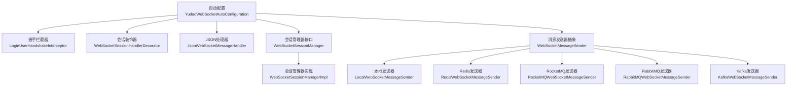
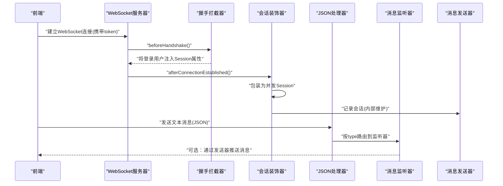
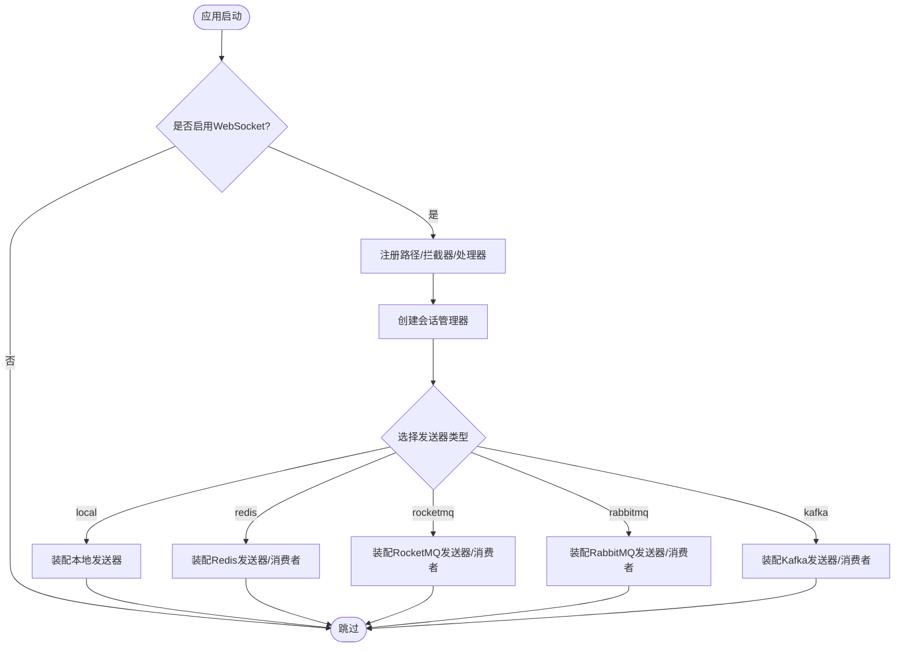
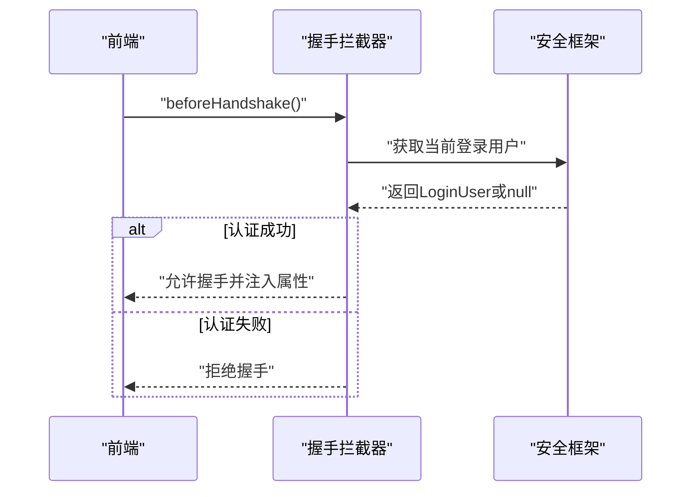
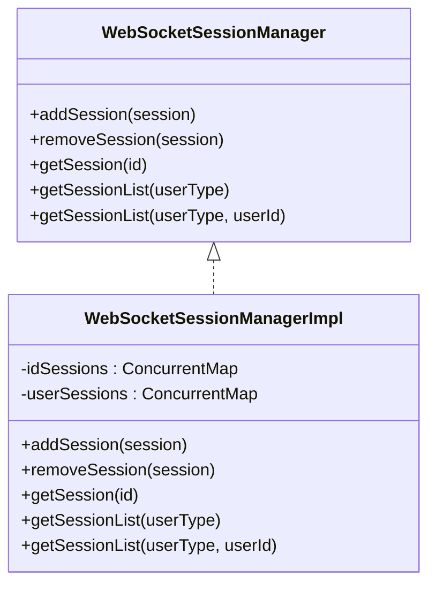
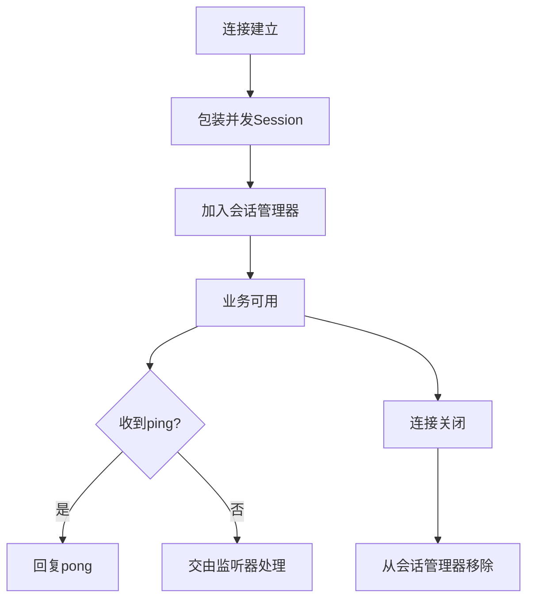
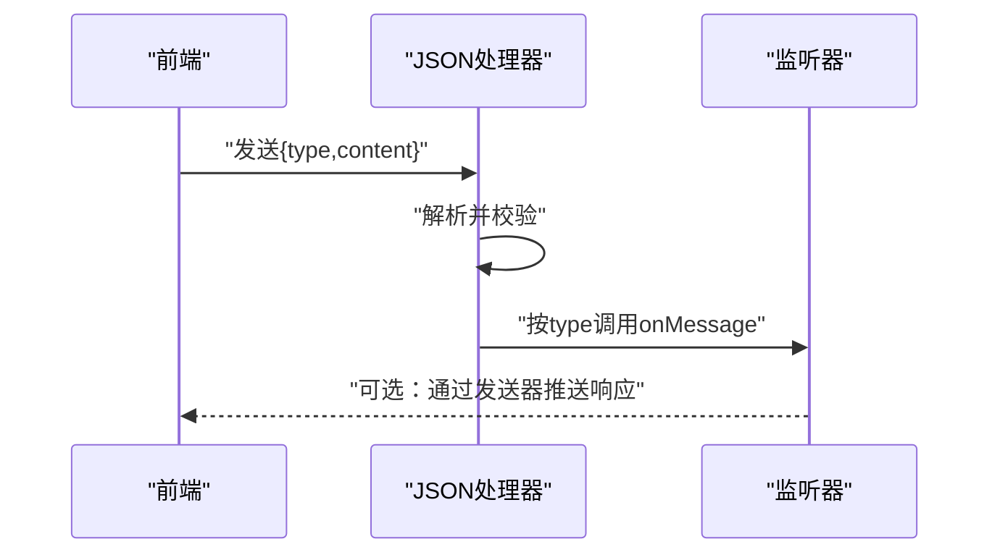
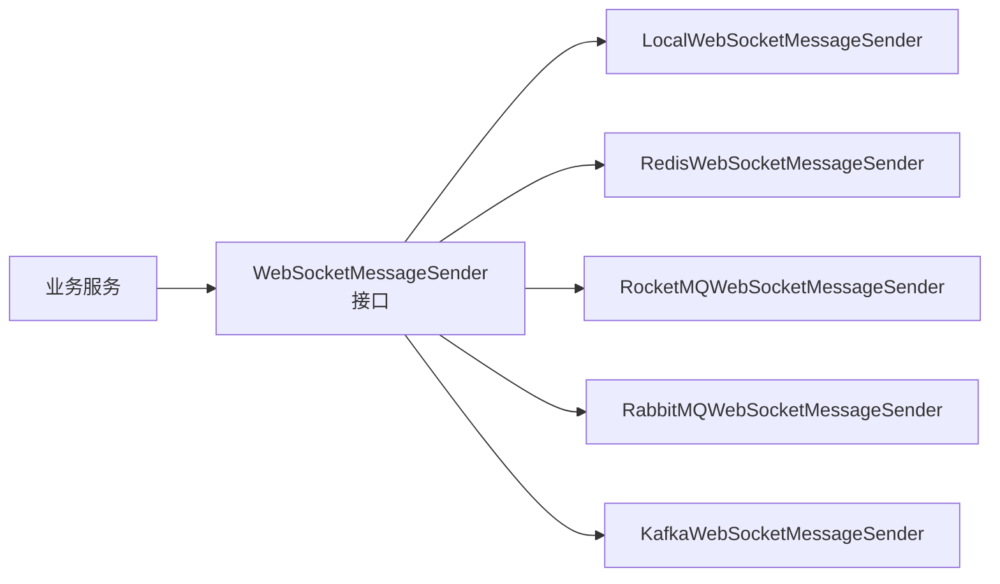
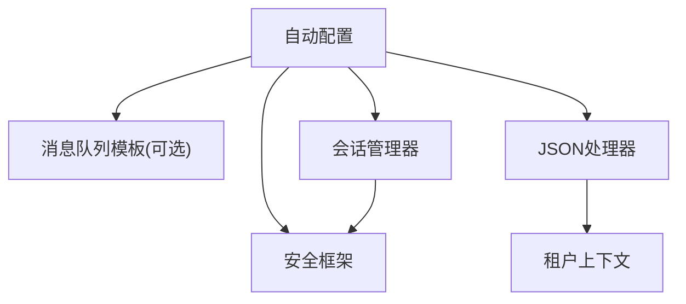

# WebSocket连接管理

<cite>
**本文引用的文件**
- [YudaoWebSocketAutoConfiguration.java](file://yudao-cloud/yudao-framework/yudao-spring-boot-starter-websocket/src/main/java/cn/iocoder/yudao/framework/websocket/config/YudaoWebSocketAutoConfiguration.java)
- [WebSocketProperties.java](file://yudao-cloud/yudao-framework/yudao-spring-boot-starter-websocket/src/main/java/cn/iocoder/yudao/framework/websocket/config/WebSocketProperties.java)
- [LoginUserHandshakeInterceptor.java](file://yudao-cloud/yudao-framework/yudao-spring-boot-starter-websocket/src/main/java/cn/iocoder/yudao/framework/websocket/core/security/LoginUserHandshakeInterceptor.java)
- [WebSocketSessionHandlerDecorator.java](file://yudao-cloud/yudao-framework/yudao-spring-boot-starter-websocket/src/main/java/cn/iocoder/yudao/framework/websocket/core/session/WebSocketSessionHandlerDecorator.java)
- [WebSocketSessionManager.java](file://yudao-cloud/yudao-framework/yudao-spring-boot-starter-websocket/src/main/java/cn/iocoder/yudao/framework/websocket/core/session/WebSocketSessionManager.java)
- [WebSocketSessionManagerImpl.java](file://yudao-cloud/yudao-framework/yudao-spring-boot-starter-websocket/src/main/java/cn/iocoder/yudao/framework/websocket/core/session/WebSocketSessionManagerImpl.java)
- [JsonWebSocketMessageHandler.java](file://yudao-cloud/yudao-framework/yudao-spring-boot-starter-websocket/src/main/java/cn/iocoder/yudao/framework/websocket/core/handler/JsonWebSocketMessageHandler.java)
- [JsonWebSocketMessage.java](file://yudao-cloud/yudao-framework/yudao-spring-boot-starter-websocket/src/main/java/cn/iocoder/yudao/framework/websocket/core/message/JsonWebSocketMessage.java)
- [WebSocketMessageListener.java](file://yudao-cloud/yudao-framework/yudao-spring-boot-starter-websocket/src/main/java/cn/iocoder/yudao/framework/websocket/core/listener/WebSocketMessageListener.java)
- [WebSocketMessageSender.java](file://yudao-cloud/yudao-framework/yudao-spring-boot-starter-websocket/src/main/java/cn/iocoder/yudao/framework/websocket/core/sender/WebSocketMessageSender.java)
- [LocalWebSocketMessageSender.java](file://yudao-cloud/yudao-framework/yudao-spring-boot-starter-websocket/src/main/java/cn/iocoder/yudao/framework/websocket/core/sender/local/LocalWebSocketMessageSender.java)
- [RedisWebSocketMessageSender.java](file://yudao-cloud/yudao-framework/yudao-spring-boot-starter-websocket/src/main/java/cn/iocoder/yudao/framework/websocket/core/sender/redis/RedisWebSocketMessageSender.java)
- [RocketMQWebSocketMessageSender.java](file://yudao-cloud/yudao-framework/yudao-spring-boot-starter-websocket/src/main/java/cn/iocoder/yudao/framework/websocket/core/sender/rocketmq/RocketMQWebSocketMessageSender.java)
- [RabbitMQWebSocketMessageSender.java](file://yudao-cloud/yudao-framework/yudao-spring-boot-starter-websocket/src/main/java/cn/iocoder/yudao/framework/websocket/core/sender/rabbitmq/RabbitMQWebSocketMessageSender.java)
- [KafkaWebSocketMessageSender.java](file://yudao-cloud/yudao-framework/yudao-spring-boot-starter-websocket/src/main/java/cn/iocoder/yudao/framework/websocket/core/sender/kafka/KafkaWebSocketMessageSender.java)
</cite>

## 目录
1. [简介](#简介)
2. [项目结构](#项目结构)
3. [核心组件](#核心组件)
4. [架构总览](#架构总览)
5. [详细组件分析](#详细组件分析)
6. [依赖关系分析](#依赖关系分析)
7. [性能考虑](#性能考虑)
8. [故障排查指南](#故障排查指南)
9. [结论](#结论)
10. [附录：前端连接与调试](#附录前端连接与调试)

## 简介
本文件面向WebSocket连接管理的后端实现，系统性说明自动配置与初始化、连接池与会话生命周期管理、连接状态监控、拦截器机制（认证、鉴权、预处理）、会话管理器（存储、并发控制、内存优化）、异常处理与恢复策略、配置参数与性能调优建议，以及前端连接建立示例与调试方法。

## 项目结构
WebSocket能力以Spring Boot Starter形式提供，核心位于yudao-spring-boot-starter-websocket模块，包含自动配置、安全拦截、会话管理、消息处理器、消息监听器、消息发送器（本地/Redis/RocketMQ/RabbitMQ/Kafka）等。

图表来源
- [YudaoWebSocketAutoConfiguration.java:49-83](file://yudao-cloud/yudao-framework/yudao-spring-boot-starter-websocket/src/main/java/cn/iocoder/yudao/framework/websocket/config/YudaoWebSocketAutoConfiguration.java#L49-L83)
- [WebSocketSessionManager.java:12-52](file://yudao-cloud/yudao-framework/yudao-spring-boot-starter-websocket/src/main/java/cn/iocoder/yudao/framework/websocket/core/session/WebSocketSessionManager.java#L12-L52)
- [WebSocketSessionManagerImpl.java:22-126](file://yudao-cloud/yudao-framework/yudao-spring-boot-starter-websocket/src/main/java/cn/iocoder/yudao/framework/websocket/core/session/WebSocketSessionManagerImpl.java#L22-L126)
- [WebSocketMessageSender.java:10-52](file://yudao-cloud/yudao-framework/yudao-spring-boot-starter-websocket/src/main/java/cn/iocoder/yudao/framework/websocket/core/sender/WebSocketMessageSender.java#L10-L52)

章节来源
- [YudaoWebSocketAutoConfiguration.java:43-83](file://yudao-cloud/yudao-framework/yudao-spring-boot-starter-websocket/src/main/java/cn/iocoder/yudao/framework/websocket/config/YudaoWebSocketAutoConfiguration.java#L43-L83)
- [WebSocketProperties.java:15-33](file://yudao-cloud/yudao-framework/yudao-spring-boot-starter-websocket/src/main/java/cn/iocoder/yudao/framework/websocket/config/WebSocketProperties.java#L15-L33)

## 核心组件
- 自动配置与注册：启用WebSocket、注册路径、跨域、拦截器、处理器、会话管理器、授权定制器；按sender-type条件装配不同消息发送器及消费者。
- 握手拦截器：在握手前完成用户认证并将登录用户信息注入到Session属性中。
- 会话装饰器：将原生Session包装为支持并发写入的装饰对象，并在连接建立/关闭时维护会话集合。
- 会话管理器：基于ConcurrentMap+CopyOnWriteArrayList维护id->session与userType->userId->sessions的多级映射，支持租户过滤查询。
- JSON消息处理器：解析统一消息帧，按type路由到对应监听器，并设置租户上下文执行。
- 消息监听器：业务侧通过实现接口定义消息类型与处理逻辑。
- 消息发送器：统一对外发送接口，支持按sessionId、用户或用户类型广播；底层可切换本地或多种MQ实现。

章节来源
- [YudaoWebSocketAutoConfiguration.java:49-181](file://yudao-cloud/yudao-framework/yudao-spring-boot-starter-websocket/src/main/java/cn/iocoder/yudao/framework/websocket/config/YudaoWebSocketAutoConfiguration.java#L49-L181)
- [LoginUserHandshakeInterceptor.java:24-41](file://yudao-cloud/yudao-framework/yudao-spring-boot-starter-websocket/src/main/java/cn/iocoder/yudao/framework/websocket/core/security/LoginUserHandshakeInterceptor.java#L24-L41)
- [WebSocketSessionHandlerDecorator.java:17-47](file://yudao-cloud/yudao-framework/yudao-spring-boot-starter-websocket/src/main/java/cn/iocoder/yudao/framework/websocket/core/session/WebSocketSessionHandlerDecorator.java#L17-L47)
- [WebSocketSessionManagerImpl.java:22-126](file://yudao-cloud/yudao-framework/yudao-spring-boot-starter-websocket/src/main/java/cn/iocoder/yudao/framework/websocket/core/session/WebSocketSessionManagerImpl.java#L22-L126)
- [JsonWebSocketMessageHandler.java:31-81](file://yudao-cloud/yudao-framework/yudao-spring-boot-starter-websocket/src/main/java/cn/iocoder/yudao/framework/websocket/core/handler/JsonWebSocketMessageHandler.java#L31-L81)
- [WebSocketMessageListener.java:13-29](file://yudao-cloud/yudao-framework/yudao-spring-boot-starter-websocket/src/main/java/cn/iocoder/yudao/framework/websocket/core/listener/WebSocketMessageListener.java#L13-L29)
- [WebSocketMessageSender.java:10-52](file://yudao-cloud/yudao-framework/yudao-spring-boot-starter-websocket/src/main/java/cn/iocoder/yudao/framework/websocket/core/sender/WebSocketMessageSender.java#L10-L52)

## 架构总览
下图展示了从客户端连接到消息处理的完整链路，包括握手认证、会话管理、消息分发与发送器选择。

图表来源
- [YudaoWebSocketAutoConfiguration.java:49-73](file://yudao-cloud/yudao-framework/yudao-spring-boot-starter-websocket/src/main/java/cn/iocoder/yudao/framework/websocket/config/YudaoWebSocketAutoConfiguration.java#L49-L73)
- [LoginUserHandshakeInterceptor.java:26-35](file://yudao-cloud/yudao-framework/yudao-spring-boot-starter-websocket/src/main/java/cn/iocoder/yudao/framework/websocket/core/security/LoginUserHandshakeInterceptor.java#L26-L35)
- [WebSocketSessionHandlerDecorator.java:36-47](file://yudao-cloud/yudao-framework/yudao-spring-boot-starter-websocket/src/main/java/cn/iocoder/yudao/framework/websocket/core/session/WebSocketSessionHandlerDecorator.java#L36-L47)
- [JsonWebSocketMessageHandler.java:44-81](file://yudao-cloud/yudao-framework/yudao-spring-boot-starter-websocket/src/main/java/cn/iocoder/yudao/framework/websocket/core/handler/JsonWebSocketMessageHandler.java#L44-L81)

## 详细组件分析

### 自动配置与初始化
- 启用WebSocket并注册路径与跨域策略。
- 注册握手拦截器与消息处理器。
- 创建会话管理器与授权定制器。
- 根据sender-type条件装配本地或MQ发送器及其消费者。

图表来源
- [YudaoWebSocketAutoConfiguration.java:43-181](file://yudao-cloud/yudao-framework/yudao-spring-boot-starter-websocket/src/main/java/cn/iocoder/yudao/framework/websocket/config/YudaoWebSocketAutoConfiguration.java#L43-L181)

章节来源
- [YudaoWebSocketAutoConfiguration.java:49-181](file://yudao-cloud/yudao-framework/yudao-spring-boot-starter-websocket/src/main/java/cn/iocoder/yudao/framework/websocket/config/YudaoWebSocketAutoConfiguration.java#L49-L181)
- [WebSocketProperties.java:15-33](file://yudao-cloud/yudao-framework/yudao-spring-boot-starter-websocket/src/main/java/cn/iocoder/yudao/framework/websocket/config/WebSocketProperties.java#L15-L33)

### 连接拦截器机制（认证、鉴权、预处理）
- 握手前通过安全框架获取当前登录用户，若为空则拒绝握手。
- 将登录用户写入握手属性，供后续处理器使用。
- 授权定制器结合配置对请求进行访问控制（由配置类负责）。

图表来源
- [LoginUserHandshakeInterceptor.java:26-35](file://yudao-cloud/yudao-framework/yudao-spring-boot-starter-websocket/src/main/java/cn/iocoder/yudao/framework/websocket/core/security/LoginUserHandshakeInterceptor.java#L26-L35)

章节来源
- [LoginUserHandshakeInterceptor.java:24-41](file://yudao-cloud/yudao-framework/yudao-spring-boot-starter-websocket/src/main/java/cn/iocoder/yudao/framework/websocket/core/security/LoginUserHandshakeInterceptor.java#L24-L41)
- [YudaoWebSocketAutoConfiguration.java:61-64](file://yudao-cloud/yudao-framework/yudao-spring-boot-starter-websocket/src/main/java/cn/iocoder/yudao/framework/websocket/config/YudaoWebSocketAutoConfiguration.java#L61-L64)

### 会话管理器（存储、并发控制、内存优化）
- 数据结构：
  - idSessions：ConcurrentMap<sessionId, session>，O(1)查找。
  - userSessions：ConcurrentMap<userType, ConcurrentMap<userId, CopyOnWriteArrayList<session>>>，支持按用户类型和用户ID批量获取。
- 并发控制：
  - 读写均使用并发容器，避免锁竞争。
  - 列表采用CopyOnWriteArrayList，读多写少场景下遍历安全且开销低。
- 内存优化：
  - 空集合及时清理（removeSession后若列表为空则移除键）。
  - 查询结果按需构造LinkedList减少扩容。
- 租户隔离：
  - 按租户上下文过滤会话列表，避免跨租户误发。

图表来源
- [WebSocketSessionManager.java:12-52](file://yudao-cloud/yudao-framework/yudao-spring-boot-starter-websocket/src/main/java/cn/iocoder/yudao/framework/websocket/core/session/WebSocketSessionManager.java#L12-L52)
- [WebSocketSessionManagerImpl.java:22-126](file://yudao-cloud/yudao-framework/yudao-spring-boot-starter-websocket/src/main/java/cn/iocoder/yudao/framework/websocket/core/session/WebSocketSessionManagerImpl.java#L22-L126)

章节来源
- [WebSocketSessionManagerImpl.java:40-123](file://yudao-cloud/yudao-framework/yudao-spring-boot-starter-websocket/src/main/java/cn/iocoder/yudao/framework/websocket/core/session/WebSocketSessionManagerImpl.java#L40-L123)

### 连接状态监控与生命周期
- 连接建立：装饰器将Session包装为并发支持，并加入会话管理器。
- 连接关闭：装饰器在关闭回调中从会话管理器移除。
- 心跳检测：处理器识别“ping”消息并回“pong”，可用于前端保活与断线检测。

图表来源
- [WebSocketSessionHandlerDecorator.java:36-47](file://yudao-cloud/yudao-framework/yudao-spring-boot-starter-websocket/src/main/java/cn/iocoder/yudao/framework/websocket/core/session/WebSocketSessionHandlerDecorator.java#L36-L47)
- [JsonWebSocketMessageHandler.java:44-54](file://yudao-cloud/yudao-framework/yudao-spring-boot-starter-websocket/src/main/java/cn/iocoder/yudao/framework/websocket/core/handler/JsonWebSocketMessageHandler.java#L44-L54)

章节来源
- [WebSocketSessionHandlerDecorator.java:17-47](file://yudao-cloud/yudao-framework/yudao-spring-boot-starter-websocket/src/main/java/cn/iocoder/yudao/framework/websocket/core/session/WebSocketSessionHandlerDecorator.java#L17-L47)
- [JsonWebSocketMessageHandler.java:44-54](file://yudao-cloud/yudao-framework/yudao-spring-boot-starter-websocket/src/main/java/cn/iocoder/yudao/framework/websocket/core/handler/JsonWebSocketMessageHandler.java#L44-L54)

### 消息路由与监听器
- 统一消息帧：包含type与content字段。
- 路由机制：处理器根据type查找对应监听器，反序列化content为具体对象，并在租户上下文中执行onMessage。
- 扩展方式：新增监听器只需实现接口并声明唯一type。

图表来源
- [JsonWebSocketMessage.java:13-27](file://yudao-cloud/yudao-framework/yudao-spring-boot-starter-websocket/src/main/java/cn/iocoder/yudao/framework/websocket/core/message/JsonWebSocketMessage.java#L13-L27)
- [JsonWebSocketMessageHandler.java:44-81](file://yudao-cloud/yudao-framework/yudao-spring-boot-starter-websocket/src/main/java/cn/iocoder/yudao/framework/websocket/core/handler/JsonWebSocketMessageHandler.java#L44-L81)
- [WebSocketMessageListener.java:13-29](file://yudao-cloud/yudao-framework/yudao-spring-boot-starter-websocket/src/main/java/cn/iocoder/yudao/framework/websocket/core/listener/WebSocketMessageListener.java#L13-L29)

章节来源
- [JsonWebSocketMessageHandler.java:44-81](file://yudao-cloud/yudao-framework/yudao-spring-boot-starter-websocket/src/main/java/cn/iocoder/yudao/framework/websocket/core/handler/JsonWebSocketMessageHandler.java#L44-L81)
- [WebSocketMessageListener.java:13-29](file://yudao-cloud/yudao-framework/yudao-spring-boot-starter-websocket/src/main/java/cn/iocoder/yudao/framework/websocket/core/listener/WebSocketMessageListener.java#L13-L29)

### 消息发送器与集群广播
- 统一接口：支持按sessionId、用户或用户类型发送；提供对象重载简化序列化。
- 多实现：
  - 本地：进程内直接投递，适合单机或无共享状态场景。
  - Redis/RocketMQ/RabbitMQ/Kafka：通过MQ解耦，支持多实例广播与水平扩展。
- 条件装配：根据配置项sender-type选择具体实现。

图表来源
- [WebSocketMessageSender.java:10-52](file://yudao-cloud/yudao-framework/yudao-spring-boot-starter-websocket/src/main/java/cn/iocoder/yudao/framework/websocket/core/sender/WebSocketMessageSender.java#L10-L52)
- [YudaoWebSocketAutoConfiguration.java:87-181](file://yudao-cloud/yudao-framework/yudao-spring-boot-starter-websocket/src/main/java/cn/iocoder/yudao/framework/websocket/config/YudaoWebSocketAutoConfiguration.java#L87-L181)

章节来源
- [WebSocketMessageSender.java:10-52](file://yudao-cloud/yudao-framework/yudao-spring-boot-starter-websocket/src/main/java/cn/iocoder/yudao/framework/websocket/core/sender/WebSocketMessageSender.java#L10-L52)
- [YudaoWebSocketAutoConfiguration.java:87-181](file://yudao-cloud/yudao-framework/yudao-spring-boot-starter-websocket/src/main/java/cn/iocoder/yudao/framework/websocket/config/YudaoWebSocketAutoConfiguration.java#L87-L181)

## 依赖关系分析
- 自动配置依赖安全框架、租户上下文、消息队列模板（可选），并通过条件注解装配不同发送器。
- 会话管理器依赖安全工具获取登录用户与租户信息。
- 消息处理器依赖JSON工具与租户工具，确保消息在正确租户上下文中处理。

图表来源
- [YudaoWebSocketAutoConfiguration.java:43-181](file://yudao-cloud/yudao-framework/yudao-spring-boot-starter-websocket/src/main/java/cn/iocoder/yudao/framework/websocket/config/YudaoWebSocketAutoConfiguration.java#L43-L181)
- [WebSocketSessionManagerImpl.java:22-126](file://yudao-cloud/yudao-framework/yudao-spring-boot-starter-websocket/src/main/java/cn/iocoder/yudao/framework/websocket/core/session/WebSocketSessionManagerImpl.java#L22-L126)
- [JsonWebSocketMessageHandler.java:44-81](file://yudao-cloud/yudao-framework/yudao-spring-boot-starter-websocket/src/main/java/cn/iocoder/yudao/framework/websocket/core/handler/JsonWebSocketMessageHandler.java#L44-L81)

章节来源
- [YudaoWebSocketAutoConfiguration.java:43-181](file://yudao-cloud/yudao-framework/yudao-spring-boot-starter-websocket/src/main/java/cn/iocoder/yudao/framework/websocket/config/YudaoWebSocketAutoConfiguration.java#L43-L181)

## 性能考虑
- 并发写入限制：装饰器设置了发送超时与缓冲大小上限，防止背压导致内存膨胀。
- 会话存储：
  - 使用ConcurrentMap保证高并发下的读写性能。
  - CopyOnWriteArrayList适用于读多写少的会话列表遍历。
- 消息处理：
  - 心跳“ping/pong”用于快速检测空闲连接。
  - 空消息与非法消息快速丢弃，降低无效处理开销。
- 发送器选择：
  - 单机部署优先local发送器，避免额外网络开销。
  - 多实例部署选择MQ发送器，利用中间件实现可靠广播与削峰填谷。
- 租户过滤：
  - 查询会话列表时按租户上下文过滤，避免不必要的数据扫描。

[本节为通用性能指导，不直接分析具体文件]

## 故障排查指南
- 握手失败：检查token是否正确传递，拦截器是否成功获取登录用户。
- 连接断开：确认前端心跳是否正常；服务端是否触发关闭回调并清理会话。
- 消息未到达：
  - 检查type是否匹配监听器。
  - 检查发送器类型配置与实际环境一致。
  - 检查MQ消费者是否启动并订阅正确主题/交换。
- 异常日志：处理器捕获异常并记录日志，定位具体session与payload。

章节来源
- [LoginUserHandshakeInterceptor.java:26-35](file://yudao-cloud/yudao-framework/yudao-spring-boot-starter-websocket/src/main/java/cn/iocoder/yudao/framework/websocket/core/security/LoginUserHandshakeInterceptor.java#L26-L35)
- [WebSocketSessionHandlerDecorator.java:44-47](file://yudao-cloud/yudao-framework/yudao-spring-boot-starter-websocket/src/main/java/cn/iocoder/yudao/framework/websocket/core/session/WebSocketSessionHandlerDecorator.java#L44-L47)
- [JsonWebSocketMessageHandler.java:44-81](file://yudao-cloud/yudao-framework/yudao-spring-boot-starter-websocket/src/main/java/cn/iocoder/yudao/framework/websocket/core/handler/JsonWebSocketMessageHandler.java#L44-L81)

## 结论
该WebSocket Starter提供了开箱即用的连接管理、会话生命周期、消息路由与多后端发送能力。通过拦截器与安全框架集成，实现了握手阶段的用户认证；通过会话管理器实现了高效、可扩展的会话存储；通过统一发送器接口屏蔽了底层差异，便于横向扩展与容错。合理配置sender-type与心跳策略，可在不同部署规模下获得稳定与高性能的连接体验。

[本节为总结性内容，不直接分析具体文件]

## 附录：前端连接与调试
- 连接建立：
  - 使用ws协议连接后端路径，拼接token参数以便握手认证。
  - 连接成功后，可定期发送“ping”维持活跃，接收“pong”作为心跳响应。
- 消息格式：
  - 发送JSON帧，包含type与content字段；type需与后端监听器声明一致。
- 调试建议：
  - 浏览器开发者工具的Network面板查看WebSocket帧。
  - 观察服务端日志中的错误与异常堆栈，定位解析或路由问题。
  - 如使用MQ发送器，检查消费者消费情况与消息落库/转发链路。

[本节为概念性指导，不直接分析具体文件]