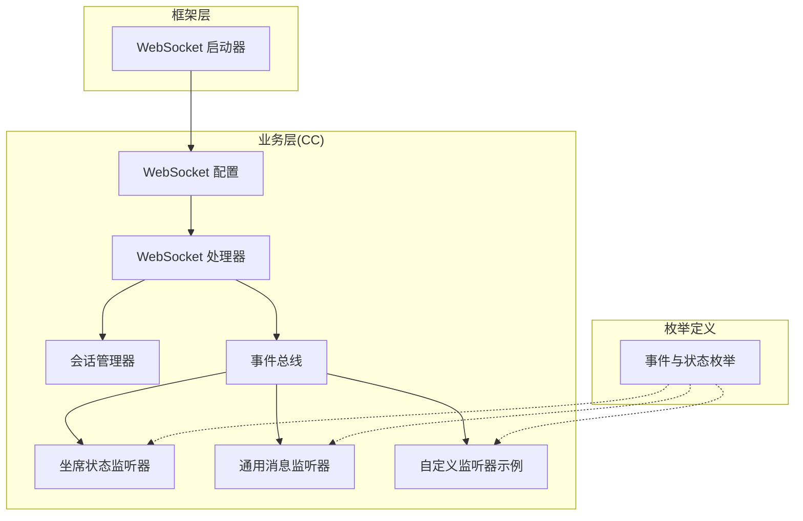
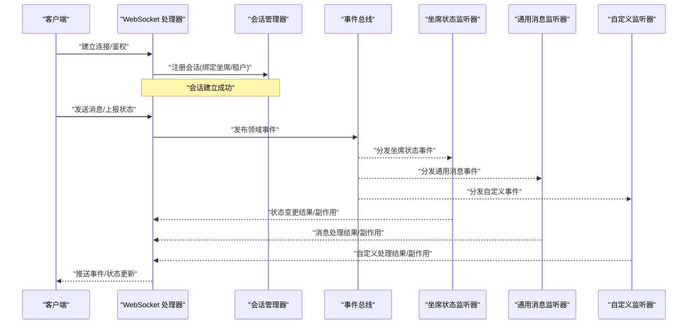
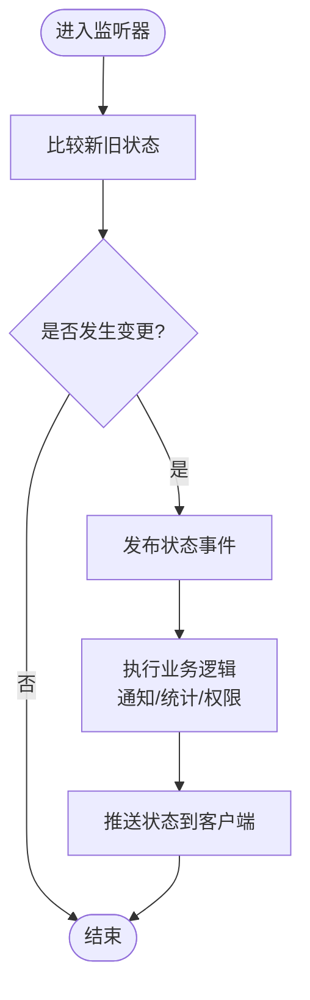
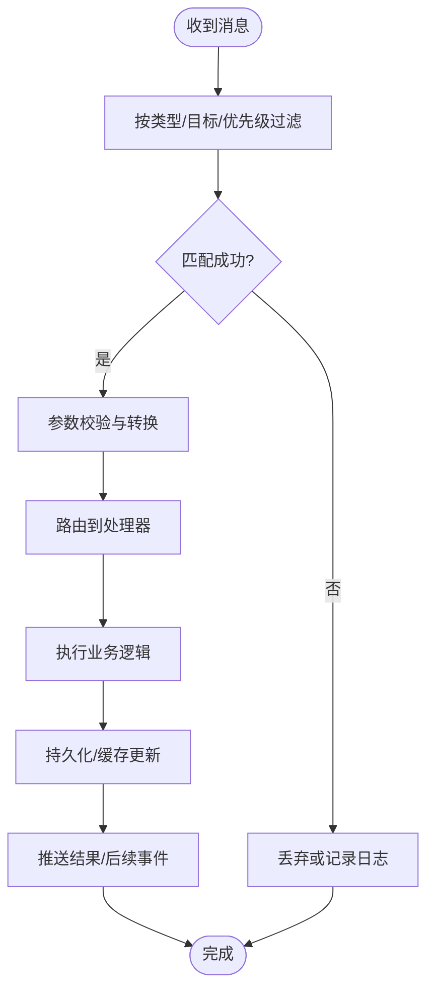
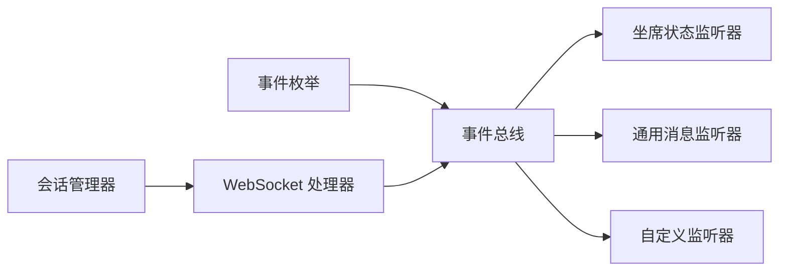

# 事件监听系统

<cite>
**本文引用的文件**
- [WebSocket 启动器 POM](file://yudao-cloud/yudao-framework/yudao-spring-boot-starter-websocket/pom.xml)
- [CC 模块 API 枚举（坐席状态）](file://yudao-cloud/yudao-module-cc-api/src/main/java/cn/iocoder/yudao/module/cc/enums/AgentStatusEnum.java)
- [CC 模块 API 枚举（通话事件）](file://yudao-cloud/yudao-module-cc-api/src/main/java/cn/iocoder/yudao/module/cc/enums/CcEventEnum.java)
- [CC 模块 API 枚举（消息类型）](file://yudao-cloud/yudao-module-cc-api/src/main/java/cn/iocoder/yudao/module/cc/enums/MessageTypeEnum.java)
- [CC 模块 API 枚举（路由事件）](file://yudao-cloud/yudao-module-cc-api/src/main/java/cn/iocoder/yudao/module/cc/enums/RouteEventEnum.java)
- [CC 模块 API 枚举（队列事件）](file://yudao-cloud/yudao-module-cc-api/src/main/java/cn/iocoder/yudao/module/cc/enums/QueueEventEnum.java)
- [CC 模块 API 枚举（技能组事件）](file://yudao-cloud/yudao-module-cc-api/src/main/java/cn/iocoder/yudao/module/cc/enums/SkillGroupEventEnum.java)
- [CC 模块服务器 WebSocket 配置类](file://yudao-cloud/yudao-module-cc-server/src/main/java/cn/iocoder/yudao/module/cc/config/WebSocketConfig.java)
- [CC 模块服务器 WebSocket 处理器](file://yudao-cloud/yudao-module-cc-server/src/main/java/cn/iocoder/yudao/module/cc/handler/WebSocketHandler.java)
- [CC 模块服务器 会话管理器](file://yudao-cloud/yudao-module-cc-server/src/main/java/cn/iocoder/yudao/module/cc/session/SessionManager.java)
- [CC 模块服务器 事件总线](file://yudao-cloud/yudao-module-cc-server/src/main/java/cn/iocoder/yudao/module/cc/event/EventBus.java)
- [CC 模块服务器 坐席状态监听器](file://yudao-cloud/yudao-module-cc-server/src/main/java/cn/iocoder/yudao/module/cc/listener/AgentStateListener.java)
- [CC 模块服务器 通用消息监听器](file://yudao-cloud/yudao-module-cc-server/src/main/java/cn/iocoder/yudao/module/cc/listener/CommonMessageListener.java)
- [CC 模块服务器 自定义监听器示例](file://yudao-cloud/yudao-module-cc-server/src/main/java/cn/iocoder/yudao/module/cc/listener/CustomEventListener.java)
</cite>

## 目录
1. [简介](#简介)
2. [项目结构](#项目结构)
3. [核心组件](#核心组件)
4. [架构总览](#架构总览)
5. [详细组件分析](#详细组件分析)
6. [依赖关系分析](#依赖关系分析)
7. [性能考虑](#性能考虑)
8. [故障排查指南](#故障排查指南)
9. [结论](#结论)
10. [附录](#附录)

## 简介
本文件面向“WebSocket 事件监听系统”，聚焦于 CC（呼叫中心）模块中的事件驱动架构。文档涵盖：
- 监听器接口与注册机制
- 事件枚举定义与语义
- 坐席状态监听器的实现要点（状态变化检测、事件触发、业务处理）
- 通用消息监听器的工作原理（消息过滤、条件匹配、处理流程）
- 自定义监听器开发指南（编写规范、订阅模式、注解使用）
- 事件驱动最佳实践与性能优化建议
- 事件调试与监控方法

## 项目结构
本项目采用模块化分层设计，WebSocket 能力由框架层 starter 提供，业务事件在 CC 模块中实现：
- 框架层：WebSocket Starter 提供基础能力与自动装配
- 业务层：CC 模块负责事件定义、监听器实现、会话管理与事件分发
- 前端层：通过 WebSocket 连接接收实时事件并更新 UI

图表来源
- [WebSocket 启动器 POM](file://yudao-cloud/yudao-framework/yudao-spring-boot-starter-websocket/pom.xml)
- [CC 模块服务器 WebSocket 配置类](file://yudao-cloud/yudao-module-cc-server/src/main/java/cn/iocoder/yudao/module/cc/config/WebSocketConfig.java)
- [CC 模块服务器 WebSocket 处理器](file://yudao-cloud/yudao-module-cc-server/src/main/java/cn/iocoder/yudao/module/cc/handler/WebSocketHandler.java)
- [CC 模块服务器 会话管理器](file://yudao-cloud/yudao-module-cc-server/src/main/java/cn/iocoder/yudao/module/cc/session/SessionManager.java)
- [CC 模块服务器 事件总线](file://yudao-cloud/yudao-module-cc-server/src/main/java/cn/iocoder/yudao/module/cc/event/EventBus.java)
- [CC 模块 API 枚举（坐席状态）](file://yudao-cloud/yudao-module-cc-api/src/main/java/cn/iocoder/yudao/module/cc/enums/AgentStatusEnum.java)
- [CC 模块 API 枚举（通话事件）](file://yudao-cloud/yudao-module-cc-api/src/main/java/cn/iocoder/yudao/module/cc/enums/CcEventEnum.java)
- [CC 模块 API 枚举（消息类型）](file://yudao-cloud/yudao-module-cc-api/src/main/java/cn/iocoder/yudao/module/cc/enums/MessageTypeEnum.java)
- [CC 模块 API 枚举（路由事件）](file://yudao-cloud/yudao-module-cc-api/src/main/java/cn/iocoder/yudao/module/cc/enums/RouteEventEnum.java)
- [CC 模块 API 枚举（队列事件）](file://yudao-cloud/yudao-module-cc-api/src/main/java/cn/iocoder/yudao/module/cc/enums/QueueEventEnum.java)
- [CC 模块 API 枚举（技能组事件）](file://yudao-cloud/yudao-module-cc-api/src/main/java/cn/iocoder/yudao/module/cc/enums/SkillGroupEventEnum.java)

章节来源
- [WebSocket 启动器 POM](file://yudao-cloud/yudao-framework/yudao-spring-boot-starter-websocket/pom.xml)
- [CC 模块服务器 WebSocket 配置类](file://yudao-cloud/yudao-module-cc-server/src/main/java/cn/iocoder/yudao/module/cc/config/WebSocketConfig.java)
- [CC 模块服务器 WebSocket 处理器](file://yudao-cloud/yudao-module-cc-server/src/main/java/cn/iocoder/yudao/module/cc/handler/WebSocketHandler.java)
- [CC 模块服务器 会话管理器](file://yudao-cloud/yudao-module-cc-server/src/main/java/cn/iocoder/yudao/module/cc/session/SessionManager.java)
- [CC 模块服务器 事件总线](file://yudao-cloud/yudao-module-cc-server/src/main/java/cn/iocoder/yudao/module/cc/event/EventBus.java)
- [CC 模块 API 枚举（坐席状态）](file://yudao-cloud/yudao-module-cc-api/src/main/java/cn/iocoder/yudao/module/cc/enums/AgentStatusEnum.java)
- [CC 模块 API 枚举（通话事件）](file://yudao-cloud/yudao-module-cc-api/src/main/java/cn/iocoder/yudao/module/cc/enums/CcEventEnum.java)
- [CC 模块 API 枚举（消息类型）](file://yudao-cloud/yudao-module-cc-api/src/main/java/cn/iocoder/yudao/module/cc/enums/MessageTypeEnum.java)
- [CC 模块 API 枚举（路由事件）](file://yudao-cloud/yudao-module-cc-api/src/main/java/cn/iocoder/yudao/module/cc/enums/RouteEventEnum.java)
- [CC 模块 API 枚举（队列事件）](file://yudao-cloud/yudao-module-cc-api/src/main/java/cn/iocoder/yudao/module/cc/enums/QueueEventEnum.java)
- [CC 模块 API 枚举（技能组事件）](file://yudao-cloud/yudao-module-cc-api/src/main/java/cn/iocoder/yudao/module/cc/enums/SkillGroupEventEnum.java)

## 核心组件
- 事件枚举：集中定义坐席状态、通话事件、消息类型、路由事件、队列事件、技能组事件等，作为事件契约的单一事实源。
- WebSocket 配置与处理器：负责建立连接、鉴权、会话绑定、消息编解码与转发。
- 会话管理器：维护客户端会话集合，支持按坐席/租户维度广播与定向推送。
- 事件总线：统一的事件分发中心，解耦事件生产者与消费者，支持异步与顺序策略。
- 监听器：
  - 坐席状态监听器：监听坐席状态变更，触发状态同步与业务联动。
  - 通用消息监听器：基于消息类型与条件进行过滤与路由，执行通用处理逻辑。
  - 自定义监听器：扩展特定业务场景的事件处理。

章节来源
- [CC 模块 API 枚举（坐席状态）](file://yudao-cloud/yudao-module-cc-api/src/main/java/cn/iocoder/yudao/module/cc/enums/AgentStatusEnum.java)
- [CC 模块 API 枚举（通话事件）](file://yudao-cloud/yudao-module-cc-api/src/main/java/cn/iocoder/yudao/module/cc/enums/CcEventEnum.java)
- [CC 模块 API 枚举（消息类型）](file://yudao-cloud/yudao-module-cc-api/src/main/java/cn/iocoder/yudao/module/cc/enums/MessageTypeEnum.java)
- [CC 模块 API 枚举（路由事件）](file://yudao-cloud/yudao-module-cc-api/src/main/java/cn/iocoder/yudao/module/cc/enums/RouteEventEnum.java)
- [CC 模块 API 枚举（队列事件）](file://yudao-cloud/yudao-module-cc-api/src/main/java/cn/iocoder/yudao/module/cc/enums/QueueEventEnum.java)
- [CC 模块 API 枚举（技能组事件）](file://yudao-cloud/yudao-module-cc-api/src/main/java/cn/iocoder/yudao/module/cc/enums/SkillGroupEventEnum.java)
- [CC 模块服务器 WebSocket 配置类](file://yudao-cloud/yudao-module-cc-server/src/main/java/cn/iocoder/yudao/module/cc/config/WebSocketConfig.java)
- [CC 模块服务器 WebSocket 处理器](file://yudao-cloud/yudao-module-cc-server/src/main/java/cn/iocoder/yudao/module/cc/handler/WebSocketHandler.java)
- [CC 模块服务器 会话管理器](file://yudao-cloud/yudao-module-cc-server/src/main/java/cn/iocoder/yudao/module/cc/session/SessionManager.java)
- [CC 模块服务器 事件总线](file://yudao-cloud/yudao-module-cc-server/src/main/java/cn/iocoder/yudao/module/cc/event/EventBus.java)
- [CC 模块服务器 坐席状态监听器](file://yudao-cloud/yudao-module-cc-server/src/main/java/cn/iocoder/yudao/module/cc/listener/AgentStateListener.java)
- [CC 模块服务器 通用消息监听器](file://yudao-cloud/yudao-module-cc-server/src/main/java/cn/iocoder/yudao/module/cc/listener/CommonMessageListener.java)
- [CC 模块服务器 自定义监听器示例](file://yudao-cloud/yudao-module-cc-server/src/main/java/cn/iocoder/yudao/module/cc/listener/CustomEventListener.java)

## 架构总览
下图展示了从 WebSocket 接入到事件分发的端到端流程，以及监听器如何消费事件并回推至客户端。

图表来源
- [CC 模块服务器 WebSocket 处理器](file://yudao-cloud/yudao-module-cc-server/src/main/java/cn/iocoder/yudao/module/cc/handler/WebSocketHandler.java)
- [CC 模块服务器 会话管理器](file://yudao-cloud/yudao-module-cc-server/src/main/java/cn/iocoder/yudao/module/cc/session/SessionManager.java)
- [CC 模块服务器 事件总线](file://yudao-cloud/yudao-module-cc-server/src/main/java/cn/iocoder/yudao/module/cc/event/EventBus.java)
- [CC 模块服务器 坐席状态监听器](file://yudao-cloud/yudao-module-cc-server/src/main/java/cn/iocoder/yudao/module/cc/listener/AgentStateListener.java)
- [CC 模块服务器 通用消息监听器](file://yudao-cloud/yudao-module-cc-server/src/main/java/cn/iocoder/yudao/module/cc/listener/CommonMessageListener.java)
- [CC 模块服务器 自定义监听器示例](file://yudao-cloud/yudao-module-cc-server/src/main/java/cn/iocoder/yudao/module/cc/listener/CustomEventListener.java)

## 详细组件分析

### 事件枚举与监听器接口
- 事件枚举：将坐席状态、通话事件、消息类型、路由事件、队列事件、技能组事件等收敛为强类型常量，避免字符串硬编码，提升可维护性与可读性。
- 监听器接口：定义统一的回调入口与生命周期钩子，便于事件总线以一致的方式调度不同监听器。

章节来源
- [CC 模块 API 枚举（坐席状态）](file://yudao-cloud/yudao-module-cc-api/src/main/java/cn/iocoder/yudao/module/cc/enums/AgentStatusEnum.java)
- [CC 模块 API 枚举（通话事件）](file://yudao-cloud/yudao-module-cc-api/src/main/java/cn/iocoder/yudao/module/cc/enums/CcEventEnum.java)
- [CC 模块 API 枚举（消息类型）](file://yudao-cloud/yudao-module-cc-api/src/main/java/cn/iocoder/yudao/module/cc/enums/MessageTypeEnum.java)
- [CC 模块 API 枚举（路由事件）](file://yudao-cloud/yudao-module-cc-api/src/main/java/cn/iocoder/yudao/module/cc/enums/RouteEventEnum.java)
- [CC 模块 API 枚举（队列事件）](file://yudao-cloud/yudao-module-cc-api/src/main/java/cn/iocoder/yudao/module/cc/enums/QueueEventEnum.java)
- [CC 模块 API 枚举（技能组事件）](file://yudao-cloud/yudao-module-cc-api/src/main/java/cn/iocoder/yudao/module/cc/enums/SkillGroupEventEnum.java)

### 坐席状态监听器
职责与流程：
- 状态变化检测：对比新旧状态，识别有效变更。
- 事件触发：将状态变更封装为领域事件并发布。
- 业务处理：根据状态执行相应动作（如通知、统计、权限刷新）。
- 客户端推送：通过会话管理器向相关坐席或群组推送最新状态。

图表来源
- [CC 模块服务器 坐席状态监听器](file://yudao-cloud/yudao-module-cc-server/src/main/java/cn/iocoder/yudao/module/cc/listener/AgentStateListener.java)
- [CC 模块服务器 会话管理器](file://yudao-cloud/yudao-module-cc-server/src/main/java/cn/iocoder/yudao/module/cc/session/SessionManager.java)
- [CC 模块 API 枚举（坐席状态）](file://yudao-cloud/yudao-module-cc-api/src/main/java/cn/iocoder/yudao/module/cc/enums/AgentStatusEnum.java)

章节来源
- [CC 模块服务器 坐席状态监听器](file://yudao-cloud/yudao-module-cc-server/src/main/java/cn/iocoder/yudao/module/cc/listener/AgentStateListener.java)
- [CC 模块 API 枚举（坐席状态）](file://yudao-cloud/yudao-module-cc-api/src/main/java/cn/iocoder/yudao/module/cc/enums/AgentStatusEnum.java)

### 通用消息监听器
工作原理：
- 消息过滤：基于消息类型、目标坐席/租户、优先级等条件进行筛选。
- 条件匹配：对消息体字段进行规则校验与转换。
- 处理流程：路由到具体处理器，执行幂等、重试、落库、缓存更新等操作。
- 结果回推：将处理结果或后续事件推送给相关客户端。

图表来源
- [CC 模块服务器 通用消息监听器](file://yudao-cloud/yudao-module-cc-server/src/main/java/cn/iocoder/yudao/module/cc/listener/CommonMessageListener.java)
- [CC 模块 API 枚举（消息类型）](file://yudao-cloud/yudao-module-cc-api/src/main/java/cn/iocoder/yudao/module/cc/enums/MessageTypeEnum.java)
- [CC 模块服务器 会话管理器](file://yudao-cloud/yudao-module-cc-server/src/main/java/cn/iocoder/yudao/module/cc/session/SessionManager.java)

章节来源
- [CC 模块服务器 通用消息监听器](file://yudao-cloud/yudao-module-cc-server/src/main/java/cn/iocoder/yudao/module/cc/listener/CommonMessageListener.java)
- [CC 模块 API 枚举（消息类型）](file://yudao-cloud/yudao-module-cc-api/src/main/java/cn/iocoder/yudao/module/cc/enums/MessageTypeEnum.java)

### 自定义监听器开发指南
- 编写规范：
  - 遵循监听器接口约定，确保方法签名与生命周期一致。
  - 保持处理逻辑幂等，避免重复消费导致数据不一致。
  - 合理拆分职责，复杂逻辑下沉到服务层。
- 事件订阅模式：
  - 通过事件总线订阅指定事件类型，支持按租户/坐席维度过滤。
  - 可使用注解声明订阅关系，减少样板代码。
- 方法注解使用：
  - 使用注解标注监听方法，声明事件类型、优先级、线程模型等元信息。
  - 结合事务与异常处理注解，保证一致性。

章节来源
- [CC 模块服务器 自定义监听器示例](file://yudao-cloud/yudao-module-cc-server/src/main/java/cn/iocoder/yudao/module/cc/listener/CustomEventListener.java)
- [CC 模块服务器 事件总线](file://yudao-cloud/yudao-module-cc-server/src/main/java/cn/iocoder/yudao/module/cc/event/EventBus.java)

### WebSocket 接入与会话管理
- 连接建立：握手、鉴权、绑定坐席/租户上下文。
- 消息收发：序列化/反序列化、协议版本兼容、心跳保活。
- 会话管理：在线会话集合、离线重连、断线恢复、广播与定向推送。

章节来源
- [CC 模块服务器 WebSocket 配置类](file://yudao-cloud/yudao-module-cc-server/src/main/java/cn/iocoder/yudao/module/cc/config/WebSocketConfig.java)
- [CC 模块服务器 WebSocket 处理器](file://yudao-cloud/yudao-module-cc-server/src/main/java/cn/iocoder/yudao/module/cc/handler/WebSocketHandler.java)
- [CC 模块服务器 会话管理器](file://yudao-cloud/yudao-module-cc-server/src/main/java/cn/iocoder/yudao/module/cc/session/SessionManager.java)

## 依赖关系分析
- 低耦合：事件总线将生产者与监听器解耦；枚举集中管理事件语义。
- 高内聚：每个监听器专注单一职责，业务逻辑下沉到服务层。
- 可扩展：新增事件只需增加枚举与监听器，无需修改现有流程。

图表来源
- [CC 模块服务器 事件总线](file://yudao-cloud/yudao-module-cc-server/src/main/java/cn/iocoder/yudao/module/cc/event/EventBus.java)
- [CC 模块服务器 WebSocket 处理器](file://yudao-cloud/yudao-module-cc-server/src/main/java/cn/iocoder/yudao/module/cc/handler/WebSocketHandler.java)
- [CC 模块服务器 会话管理器](file://yudao-cloud/yudao-module-cc-server/src/main/java/cn/iocoder/yudao/module/cc/session/SessionManager.java)
- [CC 模块 API 枚举（坐席状态）](file://yudao-cloud/yudao-module-cc-api/src/main/java/cn/iocoder/yudao/module/cc/enums/AgentStatusEnum.java)
- [CC 模块 API 枚举（消息类型）](file://yudao-cloud/yudao-module-cc-api/src/main/java/cn/iocoder/yudao/module/cc/enums/MessageTypeEnum.java)

章节来源
- [CC 模块服务器 事件总线](file://yudao-cloud/yudao-module-cc-server/src/main/java/cn/iocoder/yudao/module/cc/event/EventBus.java)
- [CC 模块服务器 WebSocket 处理器](file://yudao-cloud/yudao-module-cc-server/src/main/java/cn/iocoder/yudao/module/cc/handler/WebSocketHandler.java)
- [CC 模块服务器 会话管理器](file://yudao-cloud/yudao-module-cc-server/src/main/java/cn/iocoder/yudao/module/cc/session/SessionManager.java)
- [CC 模块 API 枚举（坐席状态）](file://yudao-cloud/yudao-module-cc-api/src/main/java/cn/iocoder/yudao/module/cc/enums/AgentStatusEnum.java)
- [CC 模块 API 枚举（消息类型）](file://yudao-cloud/yudao-module-cc-api/src/main/java/cn/iocoder/yudao/module/cc/enums/MessageTypeEnum.java)

## 性能考虑
- 事件去重与合并：对高频状态变更进行合并，降低网络与处理开销。
- 异步与批处理：非关键路径异步化，批量推送减少往返次数。
- 背压与限流：在高并发下限制事件速率，防止雪崩。
- 连接复用与心跳：长连接复用，心跳保活，快速失败与重连。
- 缓存热点数据：减少数据库压力，提高响应速度。

## 故障排查指南
- 常见问题定位：
  - 连接失败：检查握手、鉴权、跨域与证书配置。
  - 消息丢失：核对事件总线投递策略、监听器订阅与过滤条件。
  - 状态不同步：比对新旧状态计算逻辑与推送范围。
- 调试手段：
  - 启用详细日志，记录事件ID、坐席ID、消息类型与处理耗时。
  - 使用链路追踪关联请求与事件。
  - 回放事件序列，复现问题。
- 监控指标：
  - 连接数、断开率、消息吞吐、延迟分布、错误率。
  - 监听器执行时间与异常占比。

## 结论
本事件监听系统通过枚举契约、事件总线与监听器模式实现了高内聚、低耦合的实时通信架构。坐席状态监听器与通用消息监听器覆盖了典型业务场景，同时提供扩展点以支撑定制化需求。配合合理的性能优化与监控手段，可在大规模并发下保持稳定与高效。

## 附录
- 事件枚举清单：坐席状态、通话事件、消息类型、路由事件、队列事件、技能组事件。
- 监听器清单：坐席状态监听器、通用消息监听器、自定义监听器示例。
- 接入清单：WebSocket 配置、处理器、会话管理器。