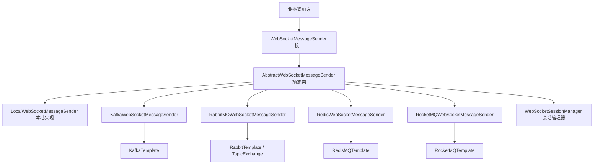
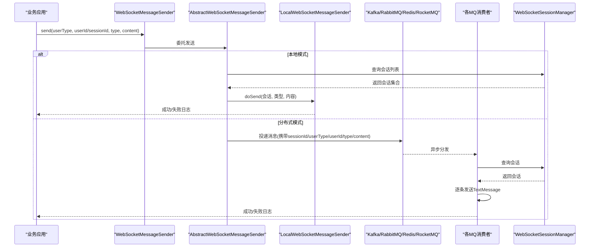
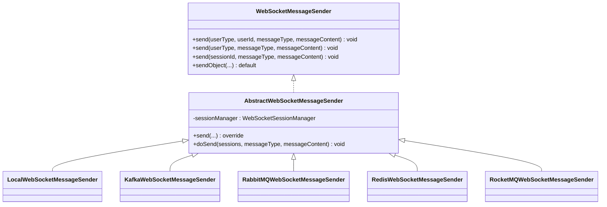
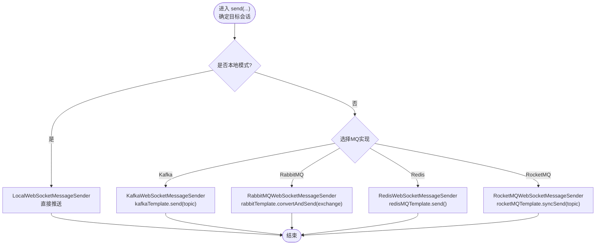
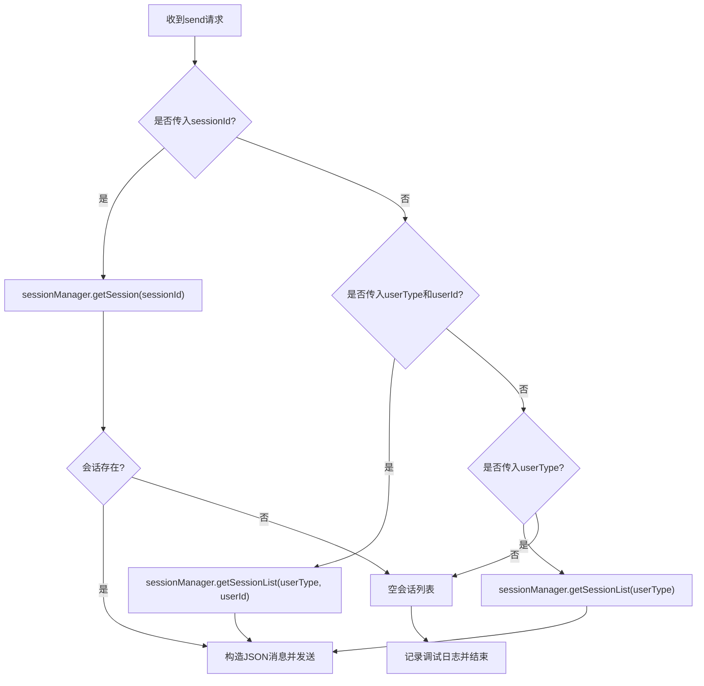
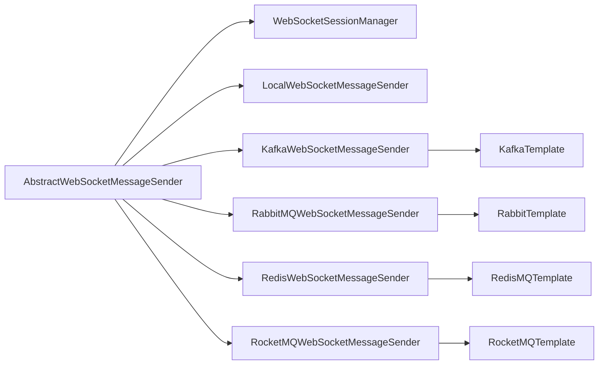

# 消息发送机制

<cite>
**本文引用的文件**
- [WebSocketMessageSender.java](file://yudao-cloud/yudao-framework/yudao-spring-boot-starter-websocket/src/main/java/cn/iocoder/yudao/framework/websocket/core/sender/WebSocketMessageSender.java)
- [AbstractWebSocketMessageSender.java](file://yudao-cloud/yudao-framework/yudao-spring-boot-starter-websocket/src/main/java/cn/iocoder/yudao/framework/websocket/core/sender/AbstractWebSocketMessageSender.java)
- [LocalWebSocketMessageSender.java](file://yudao-cloud/yudao-framework/yudao-spring-boot-starter-websocket/src/main/java/cn/iocoder/yudao/framework/websocket/core/sender/local/LocalWebSocketMessageSender.java)
- [KafkaWebSocketMessageSender.java](file://yudao-cloud/yudao-framework/yudao-spring-boot-starter-websocket/src/main/java/cn/iocoder/yudao/framework/websocket/core/sender/kafka/KafkaWebSocketMessageSender.java)
- [RabbitMQWebSocketMessageSender.java](file://yudao-cloud/yudao-framework/yudao-spring-boot-starter-websocket/src/main/java/cn/iocoder/yudao/framework/websocket/core/sender/rabbitmq/RabbitMQWebSocketMessageSender.java)
- [RedisWebSocketMessageSender.java](file://yudao-cloud/yudao-framework/yudao-spring-boot-starter-websocket/src/main/java/cn/iocoder/yudao/framework/websocket/core/sender/redis/RedisWebSocketMessageSender.java)
- [RocketMQWebSocketMessageSender.java](file://yudao-cloud/yudao-framework/yudao-spring-boot-starter-websocket/src/main/java/cn/iocoder/yudao/framework/websocket/core/sender/rocketmq/RocketMQWebSocketMessageSender.java)
- [WebSocketProperties.java](file://yudao-cloud/yudao-framework/yudao-spring-boot-starter-websocket/src/main/java/cn/iocoder/yudao/framework/websocket/config/WebSocketProperties.java)
- [JsonWebSocketMessage.java](file://yudao-cloud/yudao-framework/yudao-spring-boot-starter-websocket/src/main/java/cn/iocoder/yudao/framework/websocket/core/message/JsonWebSocketMessage.java)
- [WebSocketSessionManager.java](file://yudao-cloud/yudao-framework/yudao-spring-boot-starter-websocket/src/main/java/cn/iocoder/yudao/framework/websocket/core/session/WebSocketSessionManager.java)
- [WebSocketSessionManagerImpl.java](file://yudao-cloud/yudao-framework/yudao-spring-boot-starter-websocket/src/main/java/cn/iocoder/yudao/framework/websocket/core/session/WebSocketSessionManagerImpl.java)
- [RedisMQTemplate.java](file://yudao-cloud/yudao-framework/yudao-spring-boot-starter-mq/src/main/java/cn/iocoder/yudao/framework/mq/redis/core/RedisMQTemplate.java)
</cite>

## 目录
1. [简介](#简介)
2. [项目结构](#项目结构)
3. [核心组件](#核心组件)
4. [架构总览](#架构总览)
5. [详细组件分析](#详细组件分析)
6. [依赖关系分析](#依赖关系分析)
7. [性能与可靠性](#性能与可靠性)
8. [配置指南](#配置指南)
9. [监控与故障排查](#监控与故障排查)
10. [结论](#结论)

## 简介
本文件面向 WebSocket 消息发送机制，系统化说明抽象设计与多实现策略（本地与分布式），覆盖 Kafka、RabbitMQ、Redis、RocketMQ 的集成差异与适用场景；阐述可靠性保障（持久化、重试、失败处理）、广播与点对点模式（目标选择、路由策略、性能优化）；并提供配置扩展方法与监控排障建议。

## 项目结构
WebSocket 模块采用“接口 + 抽象基类 + 多实现”的分层设计：
- 接口层：统一发送能力定义
- 抽象层：封装通用流程（会话查找、序列化、错误日志）
- 实现层：本地直发与多种 MQ 适配
- 会话管理：按用户类型/用户ID/会话ID维护在线会话集合
- 配置：通过配置项切换发送器类型

图表来源
- [WebSocketMessageSender.java:1-53](file://yudao-cloud/yudao-framework/yudao-spring-boot-starter-websocket/src/main/java/cn/iocoder/yudao/framework/websocket/core/sender/WebSocketMessageSender.java#L1-L53)
- [AbstractWebSocketMessageSender.java:1-107](file://yudao-cloud/yudao-framework/yudao-spring-boot-starter-websocket/src/main/java/cn/iocoder/yudao/framework/websocket/core/sender/AbstractWebSocketMessageSender.java#L1-L107)
- [LocalWebSocketMessageSender.java:1-21](file://yudao-cloud/yudao-framework/yudao-spring-boot-starter-websocket/src/main/java/cn/iocoder/yudao/framework/websocket/core/sender/local/LocalWebSocketMessageSender.java#L1-L21)
- [KafkaWebSocketMessageSender.java:1-68](file://yudao-cloud/yudao-framework/yudao-spring-boot-starter-websocket/src/main/java/cn/iocoder/yudao/framework/websocket/core/sender/kafka/KafkaWebSocketMessageSender.java#L1-L68)
- [RabbitMQWebSocketMessageSender.java:1-63](file://yudao-cloud/yudao-framework/yudao-spring-boot-starter-websocket/src/main/java/cn/iocoder/yudao/framework/websocket/core/sender/rabbitmq/RabbitMQWebSocketMessageSender.java#L1-L63)
- [RedisWebSocketMessageSender.java:1-58](file://yudao-cloud/yudao-framework/yudao-spring-boot-starter-websocket/src/main/java/cn/iocoder/yudao/framework/websocket/core/sender/redis/RedisWebSocketMessageSender.java#L1-L58)
- [RocketMQWebSocketMessageSender.java:1-62](file://yudao-cloud/yudao-framework/yudao-spring-boot-starter-websocket/src/main/java/cn/iocoder/yudao/framework/websocket/core/sender/rocketmq/RocketMQWebSocketMessageSender.java#L1-L62)

章节来源
- [WebSocketMessageSender.java:1-53](file://yudao-cloud/yudao-framework/yudao-spring-boot-starter-websocket/src/main/java/cn/iocoder/yudao/framework/websocket/core/sender/WebSocketMessageSender.java#L1-L53)
- [AbstractWebSocketMessageSender.java:1-107](file://yudao-cloud/yudao-framework/yudao-spring-boot-starter-websocket/src/main/java/cn/iocoder/yudao/framework/websocket/core/sender/AbstractWebSocketMessageSender.java#L1-L107)
- [WebSocketProperties.java:1-35](file://yudao-cloud/yudao-framework/yudao-spring-boot-starter-websocket/src/main/java/cn/iocoder/yudao/framework/websocket/config/WebSocketProperties.java#L1-L35)

## 核心组件
- 发送器接口：提供按用户类型、用户ID、会话ID三种粒度的发送能力，并支持对象自动序列化。
- 抽象发送器：统一完成会话查找、消息包装为 JSON、逐条发送与异常日志记录。
- 本地发送器：直接基于内存中的会话进行推送，适用于单机或同进程部署。
- 分布式发送器：将消息投递到 MQ，由对应消费者在各自节点查找会话并推送。
- 会话管理器：维护 userType/userId/sessionId 到 WebSocketSession 的映射，支撑广播与点对点。
- 消息载体：统一的 JSON 消息体，包含消息类型与内容。

章节来源
- [WebSocketMessageSender.java:1-53](file://yudao-cloud/yudao-framework/yudao-spring-boot-starter-websocket/src/main/java/cn/iocoder/yudao/framework/websocket/core/sender/WebSocketMessageSender.java#L1-L53)
- [AbstractWebSocketMessageSender.java:1-107](file://yudao-cloud/yudao-framework/yudao-spring-boot-starter-websocket/src/main/java/cn/iocoder/yudao/framework/websocket/core/sender/AbstractWebSocketMessageSender.java#L1-L107)
- [JsonWebSocketMessage.java](file://yudao-cloud/yudao-framework/yudao-spring-boot-starter-websocket/src/main/java/cn/iocoder/yudao/framework/websocket/core/message/JsonWebSocketMessage.java)
- [WebSocketSessionManager.java](file://yudao-cloud/yudao-framework/yudao-spring-boot-starter-websocket/src/main/java/cn/iocoder/yudao/framework/websocket/core/session/WebSocketSessionManager.java)
- [WebSocketSessionManagerImpl.java](file://yudao-cloud/yudao-framework/yudao-spring-boot-starter-websocket/src/main/java/cn/iocoder/yudao/framework/websocket/core/session/WebSocketSessionManagerImpl.java)

## 架构总览
整体数据流：
- 调用方通过 WebSocketMessageSender 发送消息
- 抽象层根据参数定位目标会话集合
- 本地实现直接写入 Session；分布式实现将消息投递至 MQ
- 各 MQ 消费者在各自节点查找会话并推送

图表来源
- [AbstractWebSocketMessageSender.java:29-104](file://yudao-cloud/yudao-framework/yudao-spring-boot-starter-websocket/src/main/java/cn/iocoder/yudao/framework/websocket/core/sender/AbstractWebSocketMessageSender.java#L29-L104)
- [KafkaWebSocketMessageSender.java:31-65](file://yudao-cloud/yudao-framework/yudao-spring-boot-starter-websocket/src/main/java/cn/iocoder/yudao/framework/websocket/core/sender/kafka/KafkaWebSocketMessageSender.java#L31-L65)
- [RabbitMQWebSocketMessageSender.java:30-60](file://yudao-cloud/yudao-framework/yudao-spring-boot-starter-websocket/src/main/java/cn/iocoder/yudao/framework/websocket/core/sender/rabbitmq/RabbitMQWebSocketMessageSender.java#L30-L60)
- [RedisWebSocketMessageSender.java:25-55](file://yudao-cloud/yudao-framework/yudao-spring-boot-starter-websocket/src/main/java/cn/iocoder/yudao/framework/websocket/core/sender/redis/RedisWebSocketMessageSender.java#L25-L55)
- [RocketMQWebSocketMessageSender.java:29-59](file://yudao-cloud/yudao-framework/yudao-spring-boot-starter-websocket/src/main/java/cn/iocoder/yudao/framework/websocket/core/sender/rocketmq/RocketMQWebSocketMessageSender.java#L29-L59)

## 详细组件分析

### 抽象与接口设计
- 接口提供三类发送入口：按用户类型+用户ID、按用户类型、按会话ID；同时提供对象重载以简化调用。
- 抽象类统一处理：
  - 会话查找优先级：sessionId > (userType, userId) > userType
  - 消息包装为 JSON 文本
  - 逐条发送前校验会话状态
  - 捕获 IO 异常并记录日志

图表来源
- [WebSocketMessageSender.java:1-53](file://yudao-cloud/yudao-framework/yudao-spring-boot-starter-websocket/src/main/java/cn/iocoder/yudao/framework/websocket/core/sender/WebSocketMessageSender.java#L1-L53)
- [AbstractWebSocketMessageSender.java:1-107](file://yudao-cloud/yudao-framework/yudao-spring-boot-starter-websocket/src/main/java/cn/iocoder/yudao/framework/websocket/core/sender/AbstractWebSocketMessageSender.java#L1-L107)
- [LocalWebSocketMessageSender.java:1-21](file://yudao-cloud/yudao-framework/yudao-spring-boot-starter-websocket/src/main/java/cn/iocoder/yudao/framework/websocket/core/sender/local/LocalWebSocketMessageSender.java#L1-L21)
- [KafkaWebSocketMessageSender.java:1-68](file://yudao-cloud/yudao-framework/yudao-spring-boot-starter-websocket/src/main/java/cn/iocoder/yudao/framework/websocket/core/sender/kafka/KafkaWebSocketMessageSender.java#L1-L68)
- [RabbitMQWebSocketMessageSender.java:1-63](file://yudao-cloud/yudao-framework/yudao-spring-boot-starter-websocket/src/main/java/cn/iocoder/yudao/framework/websocket/core/sender/rabbitmq/RabbitMQWebSocketMessageSender.java#L1-L63)
- [RedisWebSocketMessageSender.java:1-58](file://yudao-cloud/yudao-framework/yudao-spring-boot-starter-websocket/src/main/java/cn/iocoder/yudao/framework/websocket/core/sender/redis/RedisWebSocketMessageSender.java#L1-L58)
- [RocketMQWebSocketMessageSender.java:1-62](file://yudao-cloud/yudao-framework/yudao-spring-boot-starter-websocket/src/main/java/cn/iocoder/yudao/framework/websocket/core/sender/rocketmq/RocketMQWebSocketMessageSender.java#L1-L62)

章节来源
- [WebSocketMessageSender.java:1-53](file://yudao-cloud/yudao-framework/yudao-spring-boot-starter-websocket/src/main/java/cn/iocoder/yudao/framework/websocket/core/sender/WebSocketMessageSender.java#L1-L53)
- [AbstractWebSocketMessageSender.java:29-104](file://yudao-cloud/yudao-framework/yudao-spring-boot-starter-websocket/src/main/java/cn/iocoder/yudao/framework/websocket/core/sender/AbstractWebSocketMessageSender.java#L29-L104)

### 本地发送器（单机）
- 特点：零网络开销、低延迟、无外部依赖
- 限制：仅对当前 JVM 进程内的会话有效，不适合跨实例广播
- 典型场景：开发调试、单实例部署

章节来源
- [LocalWebSocketMessageSender.java:1-21](file://yudao-cloud/yudao-framework/yudao-spring-boot-starter-websocket/src/main/java/cn/iocoder/yudao/framework/websocket/core/sender/local/LocalWebSocketMessageSender.java#L1-L21)
- [AbstractWebSocketMessageSender.java:53-74](file://yudao-cloud/yudao-framework/yudao-spring-boot-starter-websocket/src/main/java/cn/iocoder/yudao/framework/websocket/core/sender/AbstractWebSocketMessageSender.java#L53-L74)

### 分布式发送器（MQ 方案对比）
- Kafka
  - 使用 KafkaTemplate 同步发送并等待结果
  - 适合高吞吐、顺序性要求不强的广播场景
  - 可靠性依赖 Kafka 自身持久化与生产者确认
- RabbitMQ
  - 通过 RabbitTemplate 发送到 TopicExchange
  - 灵活的路由与订阅模型，适合复杂路由与多消费组
  - 可靠性依赖队列持久化与发布者确认
- Redis
  - 通过 RedisMQTemplate 发送，利用 Redis 的发布/订阅或 Stream
  - 轻量、易部署，适合中小规模或已有 Redis 基础设施
  - 可靠性取决于 Redis 持久化与消费者重放能力
- RocketMQ
  - 使用 RocketMQTemplate 同步发送
  - 事务消息与高可靠特性完善，适合金融级场景
  - 可靠性依赖 Broker 持久化与生产者同步确认

图表来源
- [AbstractWebSocketMessageSender.java:53-74](file://yudao-cloud/yudao-framework/yudao-spring-boot-starter-websocket/src/main/java/cn/iocoder/yudao/framework/websocket/core/sender/AbstractWebSocketMessageSender.java#L53-L74)
- [KafkaWebSocketMessageSender.java:31-65](file://yudao-cloud/yudao-framework/yudao-spring-boot-starter-websocket/src/main/java/cn/iocoder/yudao/framework/websocket/core/sender/kafka/KafkaWebSocketMessageSender.java#L31-L65)
- [RabbitMQWebSocketMessageSender.java:30-60](file://yudao-cloud/yudao-framework/yudao-spring-boot-starter-websocket/src/main/java/cn/iocoder/yudao/framework/websocket/core/sender/rabbitmq/RabbitMQWebSocketMessageSender.java#L30-L60)
- [RedisWebSocketMessageSender.java:25-55](file://yudao-cloud/yudao-framework/yudao-spring-boot-starter-websocket/src/main/java/cn/iocoder/yudao/framework/websocket/core/sender/redis/RedisWebSocketMessageSender.java#L25-L55)
- [RocketMQWebSocketMessageSender.java:29-59](file://yudao-cloud/yudao-framework/yudao-spring-boot-starter-websocket/src/main/java/cn/iocoder/yudao/framework/websocket/core/sender/rocketmq/RocketMQWebSocketMessageSender.java#L29-L59)

章节来源
- [KafkaWebSocketMessageSender.java:1-68](file://yudao-cloud/yudao-framework/yudao-spring-boot-starter-websocket/src/main/java/cn/iocoder/yudao/framework/websocket/core/sender/kafka/KafkaWebSocketMessageSender.java#L1-L68)
- [RabbitMQWebSocketMessageSender.java:1-63](file://yudao-cloud/yudao-framework/yudao-spring-boot-starter-websocket/src/main/java/cn/iocoder/yudao/framework/websocket/core/sender/rabbitmq/RabbitMQWebSocketMessageSender.java#L1-L63)
- [RedisWebSocketMessageSender.java:1-58](file://yudao-cloud/yudao-framework/yudao-spring-boot-starter-websocket/src/main/java/cn/iocoder/yudao/framework/websocket/core/sender/redis/RedisWebSocketMessageSender.java#L1-L58)
- [RocketMQWebSocketMessageSender.java:1-62](file://yudao-cloud/yudao-framework/yudao-spring-boot-starter-websocket/src/main/java/cn/iocoder/yudao/framework/websocket/core/sender/rocketmq/RocketMQWebSocketMessageSender.java#L1-L62)

### 会话管理与目标选择
- 目标选择优先级：指定 sessionId 精确推送；否则按 userType+userId 批量推送；最后退化为按 userType 广播
- 会话获取：通过 WebSocketSessionManager 提供的 get/set/list 方法
- 会话有效性：发送前检查 isOpen()，关闭则跳过并记录错误

图表来源
- [AbstractWebSocketMessageSender.java:53-74](file://yudao-cloud/yudao-framework/yudao-spring-boot-starter-websocket/src/main/java/cn/iocoder/yudao/framework/websocket/core/sender/AbstractWebSocketMessageSender.java#L53-L74)
- [WebSocketSessionManager.java](file://yudao-cloud/yudao-framework/yudao-spring-boot-starter-websocket/src/main/java/cn/iocoder/yudao/framework/websocket/core/session/WebSocketSessionManager.java)
- [WebSocketSessionManagerImpl.java](file://yudao-cloud/yudao-framework/yudao-spring-boot-starter-websocket/src/main/java/cn/iocoder/yudao/framework/websocket/core/session/WebSocketSessionManagerImpl.java)

章节来源
- [AbstractWebSocketMessageSender.java:53-74](file://yudao-cloud/yudao-framework/yudao-spring-boot-starter-websocket/src/main/java/cn/iocoder/yudao/framework/websocket/core/sender/AbstractWebSocketMessageSender.java#L53-L74)

## 依赖关系分析
- 耦合点
  - 抽象发送器依赖会话管理器，解耦具体推送细节
  - 分布式发送器分别依赖对应 MQ 模板，便于替换与测试
- 外部依赖
  - Kafka：KafkaTemplate
  - RabbitMQ：RabbitTemplate + TopicExchange
  - Redis：RedisMQTemplate（来自 mq 模块）
  - RocketMQ：RocketMQTemplate

图表来源
- [AbstractWebSocketMessageSender.java:1-107](file://yudao-cloud/yudao-framework/yudao-spring-boot-starter-websocket/src/main/java/cn/iocoder/yudao/framework/websocket/core/sender/AbstractWebSocketMessageSender.java#L1-L107)
- [KafkaWebSocketMessageSender.java:1-68](file://yudao-cloud/yudao-framework/yudao-spring-boot-starter-websocket/src/main/java/cn/iocoder/yudao/framework/websocket/core/sender/kafka/KafkaWebSocketMessageSender.java#L1-L68)
- [RabbitMQWebSocketMessageSender.java:1-63](file://yudao-cloud/yudao-framework/yudao-spring-boot-starter-websocket/src/main/java/cn/iocoder/yudao/framework/websocket/core/sender/rabbitmq/RabbitMQWebSocketMessageSender.java#L1-L63)
- [RedisWebSocketMessageSender.java:1-58](file://yudao-cloud/yudao-framework/yudao-spring-boot-starter-websocket/src/main/java/cn/iocoder/yudao/framework/websocket/core/sender/redis/RedisWebSocketMessageSender.java#L1-L58)
- [RocketMQWebSocketMessageSender.java:1-62](file://yudao-cloud/yudao-framework/yudao-spring-boot-starter-websocket/src/main/java/cn/iocoder/yudao/framework/websocket/core/sender/rocketmq/RocketMQWebSocketMessageSender.java#L1-L62)
- [RedisMQTemplate.java](file://yudao-cloud/yudao-framework/yudao-spring-boot-starter-mq/src/main/java/cn/iocoder/yudao/framework/mq/redis/core/RedisMQTemplate.java)

章节来源
- [WebSocketMessageSender.java:1-53](file://yudao-cloud/yudao-framework/yudao-spring-boot-starter-websocket/src/main/java/cn/iocoder/yudao/framework/websocket/core/sender/WebSocketMessageSender.java#L1-L53)
- [AbstractWebSocketMessageSender.java:1-107](file://yudao-cloud/yudao-framework/yudao-spring-boot-starter-websocket/src/main/java/cn/iocoder/yudao/framework/websocket/core/sender/AbstractWebSocketMessageSender.java#L1-L107)

## 性能与可靠性
- 性能特征
  - 本地模式：极低延迟，无网络开销，适合单机
  - 分布式模式：引入 MQ 转发，增加吞吐与水平扩展能力；不同 MQ 有各自吞吐与延迟特性
  - 广播粒度：按 userType 广播时注意会话数量，避免瞬时风暴
- 可靠性保障
  - 持久化：依赖各 MQ 自身的持久化能力（Broker/队列/Stream）
  - 重试策略：
    - Kafka：可通过生产者 acks/retries 配置提升可靠性（由框架外配置决定）
    - RabbitMQ：可启用发布者确认与消费者手动 ACK
    - Redis：结合 Stream 的重试与死信机制（由 mq 模块作业与监听器配合）
    - RocketMQ：同步发送与重试机制
  - 失败处理：
    - 抽象层对 IO 异常进行捕获与日志记录
    - 分布式发送器对 MQ 发送异常进行捕获与日志记录
    - 建议在消费者侧实现幂等与补偿逻辑

章节来源
- [AbstractWebSocketMessageSender.java:83-104](file://yudao-cloud/yudao-framework/yudao-spring-boot-starter-websocket/src/main/java/cn/iocoder/yudao/framework/websocket/core/sender/AbstractWebSocketMessageSender.java#L83-L104)
- [KafkaWebSocketMessageSender.java:55-65](file://yudao-cloud/yudao-framework/yudao-spring-boot-starter-websocket/src/main/java/cn/iocoder/yudao/framework/websocket/core/sender/kafka/KafkaWebSocketMessageSender.java#L55-L65)
- [RabbitMQWebSocketMessageSender.java:54-60](file://yudao-cloud/yudao-framework/yudao-spring-boot-starter-websocket/src/main/java/cn/iocoder/yudao/framework/websocket/core/sender/rabbitmq/RabbitMQWebSocketMessageSender.java#L54-L60)
- [RedisWebSocketMessageSender.java:49-55](file://yudao-cloud/yudao-framework/yudao-spring-boot-starter-websocket/src/main/java/cn/iocoder/yudao/framework/websocket/core/sender/redis/RedisWebSocketMessageSender.java#L49-L55)
- [RocketMQWebSocketMessageSender.java:53-59](file://yudao-cloud/yudao-framework/yudao-spring-boot-starter-websocket/src/main/java/cn/iocoder/yudao/framework/websocket/core/sender/rocketmq/RocketMQWebSocketMessageSender.java#L53-L59)

## 配置指南
- 配置项
  - yudao.websocket.path：WebSocket 连接路径
  - yudao.websocket.senderType：消息发送器类型，可选 local、redis、rocketmq、kafka、rabbitmq
- 扩展方法
  - 新增自定义发送器：实现 WebSocketMessageSender 接口，继承 AbstractWebSocketMessageSender 或直接实现；在启动装配中注册 Bean 并通过配置切换
  - 针对特定 MQ 的额外配置：如 topic/exchange、连接信息等，由各 MQ 模板的配置中心负责

章节来源
- [WebSocketProperties.java:1-35](file://yudao-cloud/yudao-framework/yudao-spring-boot-starter-websocket/src/main/java/cn/iocoder/yudao/framework/websocket/config/WebSocketProperties.java#L1-L35)

## 监控与故障排查
- 关键日志
  - 未匹配到会话：调试级别日志，用于排查目标选择问题
  - 会话为空或已关闭：错误级别日志，用于定位客户端断开或会话清理问题
  - 发送失败：IO 异常或 MQ 发送异常，记录消息内容与堆栈
- 常见问题
  - 收不到消息：检查 senderType 是否正确；检查 MQ 消费者是否运行；检查会话是否存在
  - 重复消息：确保消费者幂等；结合 MQ 去重或业务唯一键
  - 性能瓶颈：降低广播粒度；合理设置 MQ 分区/队列；关注下游会话数量
- 建议工具
  - 接入链路追踪与指标采集（如 Spring Boot Actuator、SkyWalking 等）
  - 对 MQ 端增加生产/消费速率、堆积量、失败率等监控

章节来源
- [AbstractWebSocketMessageSender.java:66-102](file://yudao-cloud/yudao-framework/yudao-spring-boot-starter-websocket/src/main/java/cn/iocoder/yudao/framework/websocket/core/sender/AbstractWebSocketMessageSender.java#L66-L102)
- [KafkaWebSocketMessageSender.java:60-65](file://yudao-cloud/yudao-framework/yudao-spring-boot-starter-websocket/src/main/java/cn/iocoder/yudao/framework/websocket/core/sender/kafka/KafkaWebSocketMessageSender.java#L60-L65)
- [RabbitMQWebSocketMessageSender.java:54-60](file://yudao-cloud/yudao-framework/yudao-spring-boot-starter-websocket/src/main/java/cn/iocoder/yudao/framework/websocket/core/sender/rabbitmq/RabbitMQWebSocketMessageSender.java#L54-L60)
- [RedisWebSocketMessageSender.java:49-55](file://yudao-cloud/yudao-framework/yudao-spring-boot-starter-websocket/src/main/java/cn/iocoder/yudao/framework/websocket/core/sender/redis/RedisWebSocketMessageSender.java#L49-L55)
- [RocketMQWebSocketMessageSender.java:53-59](file://yudao-cloud/yudao-framework/yudao-spring-boot-starter-websocket/src/main/java/cn/iocoder/yudao/framework/websocket/core/sender/rocketmq/RocketMQWebSocketMessageSender.java#L53-L59)

## 结论
该 WebSocket 消息发送机制通过清晰的抽象与多实现策略，兼顾了单机与分布式场景的发送需求。本地实现简单高效，分布式实现借助多种 MQ 满足不同的可靠性、吞吐与路由需求。通过统一的会话管理与 JSON 消息体，降低了业务接入成本。建议在生产环境结合 MQ 的持久化与重试能力、完善的监控与告警，以及幂等与补偿策略，构建高可靠的实时消息通道。