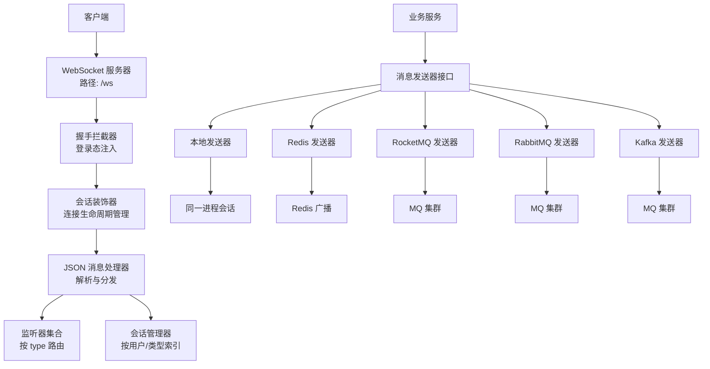
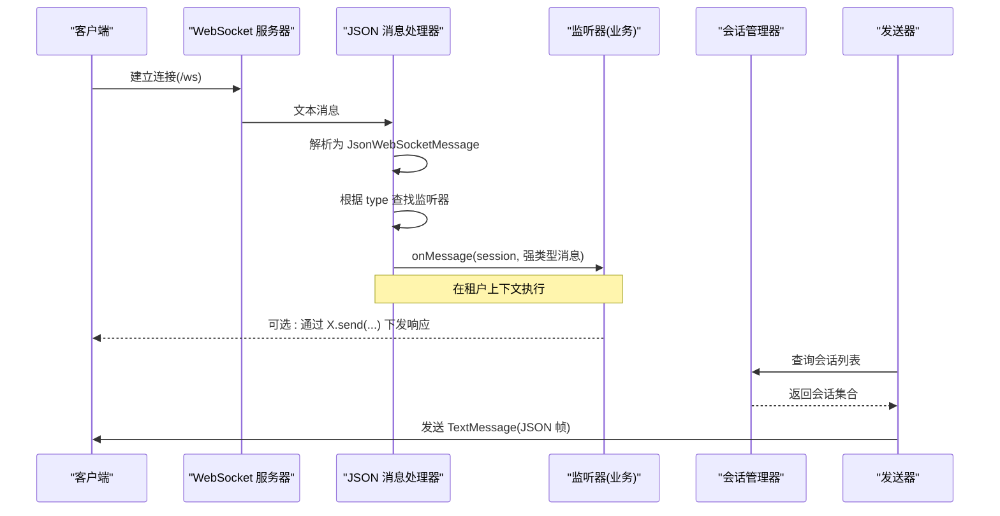
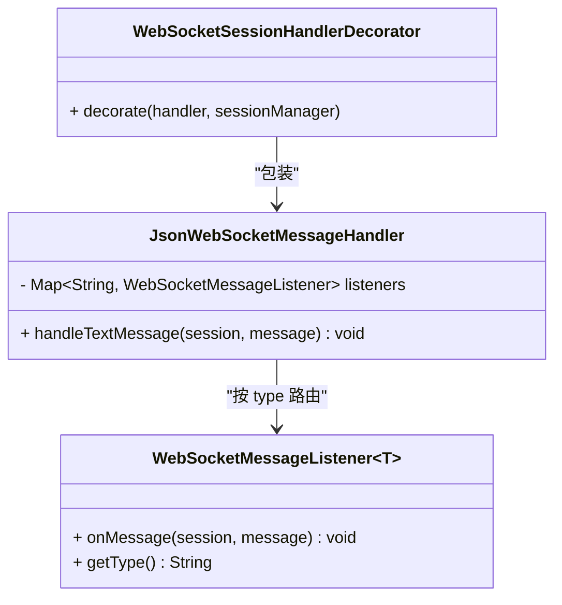
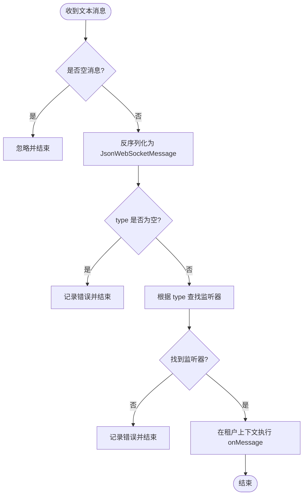
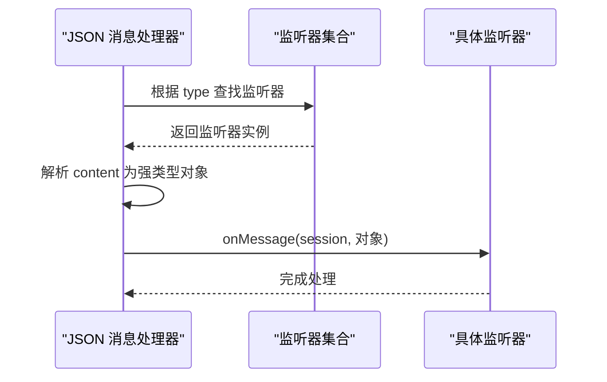
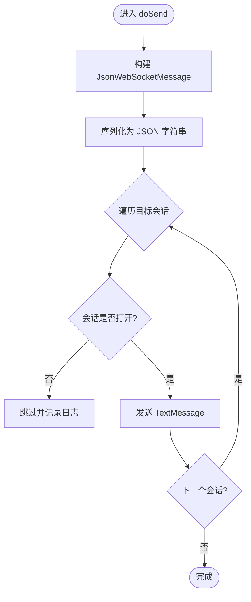
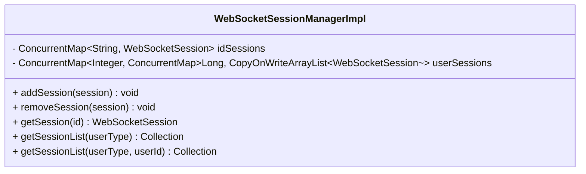
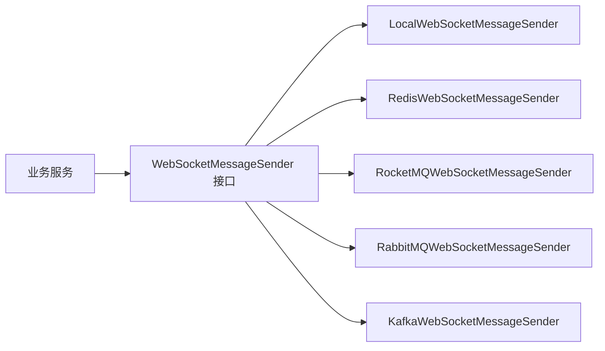
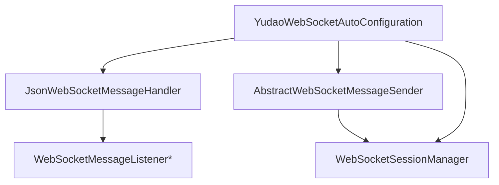

# 消息处理机制

<cite>
**本文引用的文件**
- [JsonWebSocketMessageHandler.java](file://yudao-cloud/yudao-framework/yudao-spring-boot-starter-websocket/src/main/java/cn/iocoder/yudao/framework/websocket/core/handler/JsonWebSocketMessageHandler.java)
- [JsonWebSocketMessage.java](file://yudao-cloud/yudao-framework/yudao-spring-boot-starter-websocket/src/main/java/cn/iocoder/yudao/framework/websocket/core/message/JsonWebSocketMessage.java)
- [WebSocketMessageListener.java](file://yudao-cloud/yudao-framework/yudao-spring-boot-starter-websocket/src/main/java/cn/iocoder/yudao/framework/websocket/core/listener/WebSocketMessageListener.java)
- [YudaoWebSocketAutoConfiguration.java](file://yudao-cloud/yudao-framework/yudao-spring-boot-starter-websocket/src/main/java/cn/iocoder/yudao/framework/websocket/config/YudaoWebSocketAutoConfiguration.java)
- [WebSocketProperties.java](file://yudao-cloud/yudao-framework/yudao-spring-boot-starter-websocket/src/main/java/cn/iocoder/yudao/framework/websocket/config/WebSocketProperties.java)
- [WebSocketMessageSender.java](file://yudao-cloud/yudao-framework/yudao-spring-boot-starter-websocket/src/main/java/cn/iocoder/yudao/framework/websocket/core/sender/WebSocketMessageSender.java)
- [AbstractWebSocketMessageSender.java](file://yudao-cloud/yudao-framework/yudao-spring-boot-starter-websocket/src/main/java/cn/iocoder/yudao/framework/websocket/core/sender/AbstractWebSocketMessageSender.java)
- [LocalWebSocketMessageSender.java](file://yudao-cloud/yudao-framework/yudao-spring-boot-starter-websocket/src/main/java/cn/iocoder/yudao/framework/websocket/core/sender/local/LocalWebSocketMessageSender.java)
- [RedisWebSocketMessageSender.java](file://yudao-cloud/yudao-framework/yudao-spring-boot-starter-websocket/src/main/java/cn/iocoder/yudao/framework/websocket/core/sender/redis/RedisWebSocketMessageSender.java)
- [WebSocketSessionManager.java](file://yudao-cloud/yudao-framework/yudao-spring-boot-starter-websocket/src/main/java/cn/iocoder/yudao/framework/websocket/core/session/WebSocketSessionManager.java)
- [WebSocketSessionManagerImpl.java](file://yudao-cloud/yudao-framework/yudao-spring-boot-starter-websocket/src/main/java/cn/iocoder/yudao/framework/websocket/core/session/WebSocketSessionManagerImpl.java)
</cite>

## 目录
1. [简介](#简介)
2. [项目结构](#项目结构)
3. [核心组件](#核心组件)
4. [架构总览](#架构总览)
5. [详细组件分析](#详细组件分析)
6. [依赖关系分析](#依赖关系分析)
7. [性能考虑](#性能考虑)
8. [故障排查指南](#故障排查指南)
9. [结论](#结论)
10. [附录](#附录)

## 简介
本文件面向 WebSocket 消息处理机制，系统性说明以下方面：
- 处理器架构设计：复合处理器模式与具体处理器实现
- 消息格式规范：JSON 消息结构、字段定义与数据校验规则
- 消息路由机制：消息分发、类型识别与处理链执行
- 序列化与反序列化：数据转换、类型映射与错误处理
- 扩展点与自定义处理器开发指南
- 性能优化建议与故障排查方法

## 项目结构
WebSocket 能力以 Spring Boot Starter 形式提供，核心位于 yudao-spring-boot-starter-websocket 模块。主要职责划分如下：
- 配置层：自动装配、路径注册、拦截器、跨域、发送器策略选择
- 接入层：文本消息处理器，负责解析、鉴权上下文注入、类型分发
- 模型层：统一 JSON 消息帧，承载 type 与 content
- 监听层：业务处理器接口，按消息类型订阅并处理
- 会话层：在线会话管理（按用户类型/用户编号索引）
- 发送层：本地或基于 MQ（Redis/RocketMQ/RabbitMQ/Kafka）的广播/定向推送

图表来源
- [YudaoWebSocketAutoConfiguration.java:49-83](file://yudao-cloud/yudao-framework/yudao-spring-boot-starter-websocket/src/main/java/cn/iocoder/yudao/framework/websocket/config/YudaoWebSocketAutoConfiguration.java#L49-L83)
- [JsonWebSocketMessageHandler.java:31-81](file://yudao-cloud/yudao-framework/yudao-spring-boot-starter-websocket/src/main/java/cn/iocoder/yudao/framework/websocket/core/handler/JsonWebSocketMessageHandler.java#L31-L81)
- [WebSocketMessageSender.java:10-50](file://yudao-cloud/yudao-framework/yudao-spring-boot-starter-websocket/src/main/java/cn/iocoder/yudao/framework/websocket/core/sender/WebSocketMessageSender.java#L10-L50)
- [AbstractWebSocketMessageSender.java:25-104](file://yudao-cloud/yudao-framework/yudao-spring-boot-starter-websocket/src/main/java/cn/iocoder/yudao/framework/websocket/core/sender/AbstractWebSocketMessageSender.java#L25-L104)

章节来源
- [YudaoWebSocketAutoConfiguration.java:49-83](file://yudao-cloud/yudao-framework/yudao-spring-boot-starter-websocket/src/main/java/cn/iocoder/yudao/framework/websocket/config/YudaoWebSocketAutoConfiguration.java#L49-L83)
- [WebSocketProperties.java:15-33](file://yudao-cloud/yudao-framework/yudao-spring-boot-starter-websocket/src/main/java/cn/iocoder/yudao/framework/websocket/config/WebSocketProperties.java#L15-L33)

## 核心组件
- JSON 消息处理器：接收文本消息，处理心跳 ping/pong，解析 JSON 消息帧，按 type 路由到对应监听器，并在租户上下文中执行业务逻辑
- 统一消息帧：包含 type（字符串）和 content（JSON 字符串），用于前后端约定
- 监听器接口：定义 onMessage(session, message) 与 getType()，由业务方实现
- 会话管理器：维护 id->session 以及 userType->userId->sessions 的多维索引，支持按租户过滤
- 发送器抽象：封装多目标发送（单会话、单用户、用户类型），统一序列化为 JSON 帧并安全发送
- 自动配置：注册 WebSocket 路径、拦截器、跨域；根据配置选择本地或 MQ 发送器

章节来源
- [JsonWebSocketMessageHandler.java:31-81](file://yudao-cloud/yudao-framework/yudao-spring-boot-starter-websocket/src/main/java/cn/iocoder/yudao/framework/websocket/core/handler/JsonWebSocketMessageHandler.java#L31-L81)
- [JsonWebSocketMessage.java:13-28](file://yudao-cloud/yudao-framework/yudao-spring-boot-starter-websocket/src/main/java/cn/iocoder/yudao/framework/websocket/core/message/JsonWebSocketMessage.java#L13-L28)
- [WebSocketMessageListener.java:13-30](file://yudao-cloud/yudao-framework/yudao-spring-boot-starter-websocket/src/main/java/cn/iocoder/yudao/framework/websocket/core/listener/WebSocketMessageListener.java#L13-L30)
- [WebSocketSessionManager.java:12-52](file://yudao-cloud/yudao-framework/yudao-spring-boot-starter-websocket/src/main/java/cn/iocoder/yudao/framework/websocket/core/session/WebSocketSessionManager.java#L12-L52)
- [AbstractWebSocketMessageSender.java:25-104](file://yudao-cloud/yudao-framework/yudao-spring-boot-starter-websocket/src/main/java/cn/iocoder/yudao/framework/websocket/core/sender/AbstractWebSocketMessageSender.java#L25-L104)
- [YudaoWebSocketAutoConfiguration.java:49-183](file://yudao-cloud/yudao-framework/yudao-spring-boot-starter-websocket/src/main/java/cn/iocoder/yudao/framework/websocket/config/YudaoWebSocketAutoConfiguration.java#L49-L183)

## 架构总览
整体采用“复合处理器 + 监听器”的分发模式：
- 入口：Spring WebSocket 将文本消息交给 JsonWebSocketMessageHandler
- 预处理：空消息丢弃；ping 直接回 pong
- 解析：将 payload 反序列化为 JsonWebSocketMessage
- 路由：根据 type 查找已注册的 WebSocketMessageListener
- 执行：在租户上下文内调用监听器的 onMessage，传入强类型消息对象
- 上行：业务侧通过 WebSocketMessageSender 向指定会话或用户群发

图表来源
- [JsonWebSocketMessageHandler.java:44-81](file://yudao-cloud/yudao-framework/yudao-spring-boot-starter-websocket/src/main/java/cn/iocoder/yudao/framework/websocket/core/handler/JsonWebSocketMessageHandler.java#L44-L81)
- [AbstractWebSocketMessageSender.java:53-104](file://yudao-cloud/yudao-framework/yudao-spring-boot-starter-websocket/src/main/java/cn/iocoder/yudao/framework/websocket/core/sender/AbstractWebSocketMessageSender.java#L53-L104)
- [WebSocketSessionManagerImpl.java:40-123](file://yudao-cloud/yudao-framework/yudao-spring-boot-starter-websocket/src/main/java/cn/iocoder/yudao/framework/websocket/core/session/WebSocketSessionManagerImpl.java#L40-L123)

## 详细组件分析

### 复合处理器模式与具体处理器
- 复合处理器：JsonWebSocketMessageHandler 作为统一入口，内部维护 type -> listener 的映射表，实现“按类型分发”的复合处理
- 具体处理器：各业务实现 WebSocketMessageListener<T>，通过 getType() 声明自身处理的类型，onMessage 中处理强类型消息体
- 连接生命周期：WebSocketSessionHandlerDecorator 包装实际处理器，负责添加/移除会话等

图表来源
- [JsonWebSocketMessageHandler.java:31-81](file://yudao-cloud/yudao-framework/yudao-spring-boot-starter-websocket/src/main/java/cn/iocoder/yudao/framework/websocket/core/handler/JsonWebSocketMessageHandler.java#L31-L81)
- [WebSocketMessageListener.java:13-30](file://yudao-cloud/yudao-framework/yudao-spring-boot-starter-websocket/src/main/java/cn/iocoder/yudao/framework/websocket/core/listener/WebSocketMessageListener.java#L13-L30)

章节来源
- [JsonWebSocketMessageHandler.java:31-81](file://yudao-cloud/yudao-framework/yudao-spring-boot-starter-websocket/src/main/java/cn/iocoder/yudao/framework/websocket/core/handler/JsonWebSocketMessageHandler.java#L31-L81)
- [WebSocketMessageListener.java:13-30](file://yudao-cloud/yudao-framework/yudao-spring-boot-starter-websocket/src/main/java/cn/iocoder/yudao/framework/websocket/core/listener/WebSocketMessageListener.java#L13-L30)

### 消息格式规范
- 统一帧：JsonWebSocketMessage
  - type: 字符串，用于路由到对应监听器
  - content: 字符串，内容为 JSON 对象，由业务自行定义
- 前端需确保：
  - type 非空且与后端监听器一致
  - content 为合法 JSON 对象
- 服务端校验：
  - 空消息直接忽略
  - 解析失败或 type 为空时记录错误日志并终止处理

图表来源
- [JsonWebSocketMessageHandler.java:44-81](file://yudao-cloud/yudao-framework/yudao-spring-boot-starter-websocket/src/main/java/cn/iocoder/yudao/framework/websocket/core/handler/JsonWebSocketMessageHandler.java#L44-L81)
- [JsonWebSocketMessage.java:13-28](file://yudao-cloud/yudao-framework/yudao-spring-boot-starter-websocket/src/main/java/cn/iocoder/yudao/framework/websocket/core/message/JsonWebSocketMessage.java#L13-L28)

章节来源
- [JsonWebSocketMessage.java:13-28](file://yudao-cloud/yudao-framework/yudao-spring-boot-starter-websocket/src/main/java/cn/iocoder/yudao/framework/websocket/core/message/JsonWebSocketMessage.java#L13-L28)
- [JsonWebSocketMessageHandler.java:44-81](file://yudao-cloud/yudao-framework/yudao-spring-boot-starter-websocket/src/main/java/cn/iocoder/yudao/framework/websocket/core/handler/JsonWebSocketMessageHandler.java#L44-L81)

### 消息路由机制
- 类型识别：从 JsonWebSocketMessage.type 提取
- 分发策略：处理器构造时收集所有 WebSocketMessageListener，构建 type->listener 映射
- 执行链：找到监听器后，使用反射获取泛型 T，将 content 反序列化为 T，再在租户上下文内调用 onMessage
- 扩展方式：新增监听器即新增一个 type 分支，无需修改处理器代码

图表来源
- [JsonWebSocketMessageHandler.java:38-78](file://yudao-cloud/yudao-framework/yudao-spring-boot-starter-websocket/src/main/java/cn/iocoder/yudao/framework/websocket/core/handler/JsonWebSocketMessageHandler.java#L38-L78)
- [WebSocketMessageListener.java:13-30](file://yudao-cloud/yudao-framework/yudao-spring-boot-starter-websocket/src/main/java/cn/iocoder/yudao/framework/websocket/core/listener/WebSocketMessageListener.java#L13-L30)

章节来源
- [JsonWebSocketMessageHandler.java:38-78](file://yudao-cloud/yudao-framework/yudao-spring-boot-starter-websocket/src/main/java/cn/iocoder/yudao/framework/websocket/core/handler/JsonWebSocketMessageHandler.java#L38-L78)

### 序列化与反序列化
- 下行（服务端->客户端）：
  - AbstractWebSocketMessageSender 将 messageType 与 messageContent 封装为 JsonWebSocketMessage，并使用 JSON 工具序列化为字符串
  - 对每个目标会话进行 isOpen 校验后发送 TextMessage
- 上行（客户端->服务端）：
  - JsonWebSocketMessageHandler 将原始 payload 反序列化为 JsonWebSocketMessage
  - 再根据监听器泛型 T 将 content 反序列化为具体对象
- 错误处理：
  - 解析失败、type 为空、监听器缺失均记录错误日志并中断处理
  - 发送阶段捕获 IO 异常并记录日志

图表来源
- [AbstractWebSocketMessageSender.java:83-104](file://yudao-cloud/yudao-framework/yudao-spring-boot-starter-websocket/src/main/java/cn/iocoder/yudao/framework/websocket/core/sender/AbstractWebSocketMessageSender.java#L83-L104)

章节来源
- [AbstractWebSocketMessageSender.java:53-104](file://yudao-cloud/yudao-framework/yudao-spring-boot-starter-websocket/src/main/java/cn/iocoder/yudao/framework/websocket/core/sender/AbstractWebSocketMessageSender.java#L53-L104)
- [JsonWebSocketMessageHandler.java:56-80](file://yudao-cloud/yudao-framework/yudao-spring-boot-starter-websocket/src/main/java/cn/iocoder/yudao/framework/websocket/core/handler/JsonWebSocketMessageHandler.java#L56-L80)

### 会话管理与多租户
- 会话索引：
  - idSessions：sessionId -> session
  - userSessions：userType -> userId -> sessions（并发安全）
- 查询过滤：
  - 按用户类型或用户编号获取会话集合
  - 若当前租户上下文存在，则排除不匹配租户的会话
- 生命周期：
  - 连接建立时加入索引，断开时移除

图表来源
- [WebSocketSessionManagerImpl.java:22-123](file://yudao-cloud/yudao-framework/yudao-spring-boot-starter-websocket/src/main/java/cn/iocoder/yudao/framework/websocket/core/session/WebSocketSessionManagerImpl.java#L22-L123)

章节来源
- [WebSocketSessionManagerImpl.java:40-123](file://yudao-cloud/yudao-framework/yudao-spring-boot-starter-websocket/src/main/java/cn/iocoder/yudao/framework/websocket/core/session/WebSocketSessionManagerImpl.java#L40-L123)

### 发送器策略与扩展点
- 策略选择：通过配置项 sender-type 选择 local、redis、rocketmq、rabbitmq、kafka
- 本地发送：适用于单机场景，直接通过会话管理器定位会话并发送
- MQ 发送：将消息投递至 MQ，由消费者在同一节点或不同节点消费并转发给会话
- 扩展点：
  - 新增监听器：实现 WebSocketMessageListener<T>，注册为 Bean 即可被处理器发现
  - 新增发送器：继承 AbstractWebSocketMessageSender 或实现 WebSocketMessageSender，并通过自动配置启用

图表来源
- [WebSocketMessageSender.java:10-50](file://yudao-cloud/yudao-framework/yudao-spring-boot-starter-websocket/src/main/java/cn/iocoder/yudao/framework/websocket/core/sender/WebSocketMessageSender.java#L10-L50)
- [LocalWebSocketMessageSender.java:14-20](file://yudao-cloud/yudao-framework/yudao-spring-boot-starter-websocket/src/main/java/cn/iocoder/yudao/framework/websocket/core/sender/local/LocalWebSocketMessageSender.java#L14-L20)
- [RedisWebSocketMessageSender.java:14-55](file://yudao-cloud/yudao-framework/yudao-spring-boot-starter-websocket/src/main/java/cn/iocoder/yudao/framework/websocket/core/sender/redis/RedisWebSocketMessageSender.java#L14-L55)
- [YudaoWebSocketAutoConfiguration.java:87-183](file://yudao-cloud/yudao-framework/yudao-spring-boot-starter-websocket/src/main/java/cn/iocoder/yudao/framework/websocket/config/YudaoWebSocketAutoConfiguration.java#L87-L183)

章节来源
- [WebSocketProperties.java:20-33](file://yudao-cloud/yudao-framework/yudao-spring-boot-starter-websocket/src/main/java/cn/iocoder/yudao/framework/websocket/config/WebSocketProperties.java#L20-L33)
- [YudaoWebSocketAutoConfiguration.java:87-183](file://yudao-cloud/yudao-framework/yudao-spring-boot-starter-websocket/src/main/java/cn/iocoder/yudao/framework/websocket/config/YudaoWebSocketAutoConfiguration.java#L87-L183)

## 依赖关系分析
- 处理器依赖监听器集合，在构造期完成 type->listener 的注册
- 发送器依赖会话管理器，按会话维度进行发送
- 自动配置负责装配处理器、拦截器、会话管理器及发送器策略
- 会话管理器依赖安全与租户上下文，用于关联登录用户与租户过滤

图表来源
- [JsonWebSocketMessageHandler.java:38-42](file://yudao-cloud/yudao-framework/yudao-spring-boot-starter-websocket/src/main/java/cn/iocoder/yudao/framework/websocket/core/handler/JsonWebSocketMessageHandler.java#L38-L42)
- [AbstractWebSocketMessageSender.java:25-27](file://yudao-cloud/yudao-framework/yudao-spring-boot-starter-websocket/src/main/java/cn/iocoder/yudao/framework/websocket/core/sender/AbstractWebSocketMessageSender.java#L25-L27)
- [YudaoWebSocketAutoConfiguration.java:66-78](file://yudao-cloud/yudao-framework/yudao-spring-boot-starter-websocket/src/main/java/cn/iocoder/yudao/framework/websocket/config/YudaoWebSocketAutoConfiguration.java#L66-L78)

章节来源
- [YudaoWebSocketAutoConfiguration.java:49-83](file://yudao-cloud/yudao-framework/yudao-spring-boot-starter-websocket/src/main/java/cn/iocoder/yudao/framework/websocket/config/YudaoWebSocketAutoConfiguration.java#L49-L83)

## 性能考虑
- 避免大对象频繁序列化：content 尽量保持轻量，必要时分片或异步落盘
- 批量发送：对同一批会话复用序列化结果，减少重复计算
- 会话有效性检查：发送前判断 isOpen，降低无效 IO 开销
- 合理选择发送器：
  - 单机优先 local，减少网络往返
  - 分布式场景选择 MQ，利用其可靠投递与水平扩展
- 租户过滤：在多租户环境下，尽量缩小查询范围，减少无关会话遍历
- 监控与限流：对高频消息类型增加限流与背压，防止雪崩

[本节为通用指导，不直接分析具体文件]

## 故障排查指南
- 无法路由到监听器
  - 检查前端 type 是否与后端监听器 getType() 返回值一致
  - 确认监听器已作为 Bean 注册并被处理器收集
- 消息解析失败
  - 检查 content 是否为合法 JSON 对象
  - 关注处理器的错误日志输出
- 发送失败
  - 检查会话是否已关闭（isOpen）
  - 检查 MQ 配置与连通性（如 Redis/RocketMQ/RabbitMQ/Kafka）
- 多租户问题
  - 确认当前租户上下文是否正确设置
  - 检查会话管理器是否按租户过滤导致未命中目标会话

章节来源
- [JsonWebSocketMessageHandler.java:56-80](file://yudao-cloud/yudao-framework/yudao-spring-boot-starter-websocket/src/main/java/cn/iocoder/yudao/framework/websocket/core/handler/JsonWebSocketMessageHandler.java#L56-L80)
- [AbstractWebSocketMessageSender.java:83-104](file://yudao-cloud/yudao-framework/yudao-spring-boot-starter-websocket/src/main/java/cn/iocoder/yudao/framework/websocket/core/sender/AbstractWebSocketMessageSender.java#L83-L104)
- [WebSocketSessionManagerImpl.java:91-123](file://yudao-cloud/yudao-framework/yudao-spring-boot-starter-websocket/src/main/java/cn/iocoder/yudao/framework/websocket/core/session/WebSocketSessionManagerImpl.java#L91-L123)

## 结论
该 WebSocket 消息处理机制通过统一的 JSON 消息帧与监听器分发模式，实现了高内聚、低耦合的消息路由与处理。结合灵活的发送器策略与会话管理，既能满足单机快速迭代，也能支撑分布式高可用场景。遵循本文的格式规范与最佳实践，可高效扩展新的消息类型与处理能力。

## 附录
- 配置项参考
  - 路径：yudao.websocket.path（默认 /ws）
  - 发送器类型：yudao.websocket.sender-type（local/redis/rocketmq/rabbitmq/kafka）
- 扩展清单
  - 新增监听器：实现 WebSocketMessageListener<T>，声明 getType()，实现 onMessage()
  - 新增发送器：实现 WebSocketMessageSender 或继承 AbstractWebSocketMessageSender，并在自动配置中启用

章节来源
- [WebSocketProperties.java:20-33](file://yudao-cloud/yudao-framework/yudao-spring-boot-starter-websocket/src/main/java/cn/iocoder/yudao/framework/websocket/config/WebSocketProperties.java#L20-L33)
- [WebSocketMessageListener.java:13-30](file://yudao-cloud/yudao-framework/yudao-spring-boot-starter-websocket/src/main/java/cn/iocoder/yudao/framework/websocket/core/listener/WebSocketMessageListener.java#L13-L30)
- [WebSocketMessageSender.java:10-50](file://yudao-cloud/yudao-framework/yudao-spring-boot-starter-websocket/src/main/java/cn/iocoder/yudao/framework/websocket/core/sender/WebSocketMessageSender.java#L10-L50)