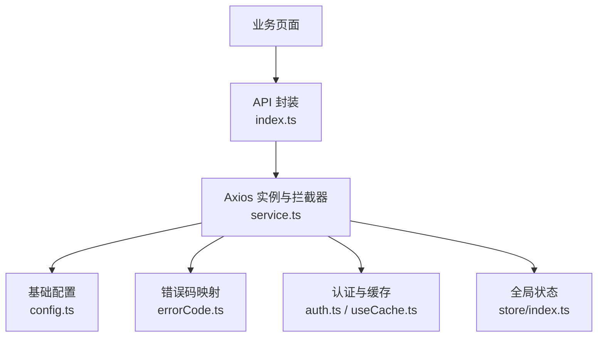
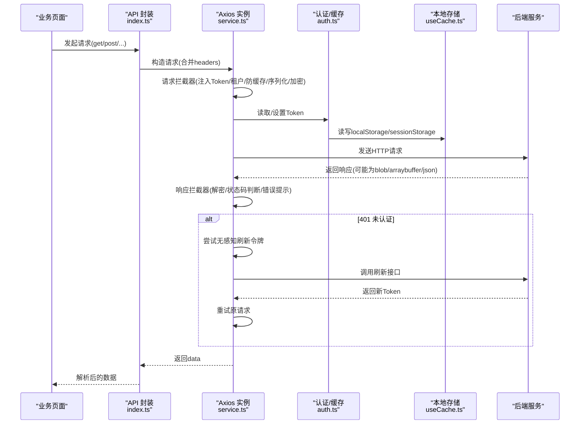
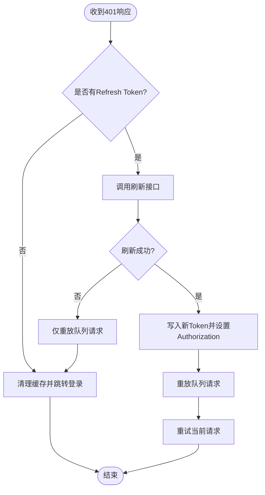
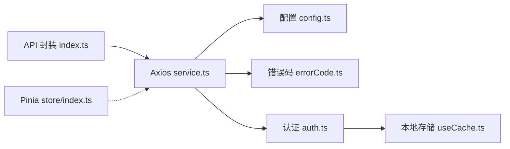

# 数据交互

<cite>
**本文引用的文件**
- [config.ts](file://yudao-ui-admin-vue3/src/config/axios/config.ts)
- [service.ts](file://yudao-ui-admin-vue3/src/config/axios/service.ts)
- [index.ts](file://yudao-ui-admin-vue3/src/config/axios/index.ts)
- [errorCode.ts](file://yudao-ui-admin-vue3/src/config/axios/errorCode.ts)
- [useCache.ts](file://yudao-ui-admin-vue3/src/hooks/web/useCache.ts)
- [auth.ts](file://yudao-ui-admin-vue3/src/utils/auth.ts)
- [formRules.ts](file://yudao-ui-admin-vue3/src/utils/formRules.ts)
- [store/index.ts](file://yudao-ui-admin-vue3/src/store/index.ts)
</cite>

## 目录
1. [简介](#简介)
2. [项目结构](#项目结构)
3. [核心组件](#核心组件)
4. [架构总览](#架构总览)
5. [详细组件分析](#详细组件分析)
6. [依赖关系分析](#依赖关系分析)
7. [性能考虑](#性能考虑)
8. [故障排查指南](#故障排查指南)
9. [结论](#结论)
10. [附录](#附录)

## 简介
本章节面向数据交互层，系统化说明前端与后端的数据通信机制。内容覆盖：
- Axios 配置、请求拦截器与响应处理
- 无感知刷新令牌（Access Token）流程
- 可选的 API 加解密
- 错误处理、网络异常与用户反馈
- 本地缓存策略、状态同步方案
- 表单验证规则与异步操作管理
- API 接口规范与前后端协作最佳实践

## 项目结构
数据交互相关代码集中在以下模块：
- Axios 封装与拦截器：src/config/axios
- 认证与缓存工具：src/utils/auth.ts、src/hooks/web/useCache.ts
- 全局状态初始化：src/store/index.ts
- 表单校验规则：src/utils/formRules.ts

图表来源
- [index.ts:7-46](file://yudao-ui-admin-vue3/src/config/axios/index.ts#L7-L46)
- [service.ts:39-106](file://yudao-ui-admin-vue3/src/config/axios/service.ts#L39-L106)
- [config.ts:1-29](file://yudao-ui-admin-vue3/src/config/axios/config.ts#L1-L29)
- [errorCode.ts:1-7](file://yudao-ui-admin-vue3/src/config/axios/errorCode.ts#L1-L7)
- [auth.ts:1-87](file://yudao-ui-admin-vue3/src/utils/auth.ts#L1-L87)
- [useCache.ts:1-42](file://yudao-ui-admin-vue3/src/hooks/web/useCache.ts#L1-L42)
- [store/index.ts:1-13](file://yudao-ui-admin-vue3/src/store/index.ts#L1-L13)

章节来源
- [config.ts:1-29](file://yudao-ui-admin-vue3/src/config/axios/config.ts#L1-L29)
- [service.ts:1-272](file://yudao-ui-admin-vue3/src/config/axios/service.ts#L1-L272)
- [index.ts:1-48](file://yudao-ui-admin-vue3/src/config/axios/index.ts#L1-L48)
- [errorCode.ts:1-7](file://yudao-ui-admin-vue3/src/config/axios/errorCode.ts#L1-L7)
- [useCache.ts:1-42](file://yudao-ui-admin-vue3/src/hooks/web/useCache.ts#L1-L42)
- [auth.ts:1-87](file://yudao-ui-admin-vue3/src/utils/auth.ts#L1-L87)
- [store/index.ts:1-13](file://yudao-ui-admin-vue3/src/store/index.ts#L1-L13)

## 核心组件
- Axios 实例与拦截器：统一 baseURL、超时、参数序列化、请求头注入、租户隔离、GET 防缓存、POST 表单序列化、可选加密、响应解密、统一错误处理与无感知刷新令牌。
- API 封装：提供 get/post/delete/put/download/upload 等便捷方法，自动解包 data。
- 认证与缓存：基于 WebStorageCache 的 localStorage/sessionStorage 存取 Access/Refresh Token、登录表单、租户信息；提供 set/get/remove 等方法。
- 全局状态：Pinia 初始化并启用持久化插件，便于跨组件共享状态。
- 表单规则：统一的必填校验规则，支持国际化提示。

章节来源
- [service.ts:39-239](file://yudao-ui-admin-vue3/src/config/axios/service.ts#L39-L239)
- [index.ts:7-46](file://yudao-ui-admin-vue3/src/config/axios/index.ts#L7-L46)
- [auth.ts:10-87](file://yudao-ui-admin-vue3/src/utils/auth.ts#L10-L87)
- [useCache.ts:5-42](file://yudao-ui-admin-vue3/src/hooks/web/useCache.ts#L5-L42)
- [store/index.ts:1-13](file://yudao-ui-admin-vue3/src/store/index.ts#L1-L13)
- [formRules.ts:1-8](file://yudao-ui-admin-vue3/src/utils/formRules.ts#L1-L8)

## 架构总览
下图展示一次典型 API 调用从页面到后端的完整链路，包括请求拦截、鉴权、租户注入、可选加密、响应解密、错误处理与无感知刷新令牌。

图表来源
- [index.ts:7-46](file://yudao-ui-admin-vue3/src/config/axios/index.ts#L7-L46)
- [service.ts:39-239](file://yudao-ui-admin-vue3/src/config/axios/service.ts#L39-L239)
- [auth.ts:10-87](file://yudao-ui-admin-vue3/src/utils/auth.ts#L10-L87)
- [useCache.ts:5-42](file://yudao-ui-admin-vue3/src/hooks/web/useCache.ts#L5-L42)

## 详细组件分析

### Axios 配置与封装
- 基础配置：baseURL 由环境变量拼接，默认 Content-Type 为 application/json，请求超时时间可配置，GET 请求强制添加 no-cache 头避免浏览器缓存。
- 参数序列化：query 使用 qs 序列化；POST 若为 application/x-www-form-urlencoded 则自动序列化对象。
- 便捷方法：get/post/delete/put/download/upload，download 以 blob 方式下载，upload 自动设置 multipart/form-data。

章节来源
- [config.ts:1-29](file://yudao-ui-admin-vue3/src/config/axios/config.ts#L1-L29)
- [index.ts:7-46](file://yudao-ui-admin-vue3/src/config/axios/index.ts#L7-L46)

### 请求拦截器
- 鉴权注入：非白名单接口自动附加 Authorization: Bearer <token>。
- 多租户支持：开启时注入 tenant-id，登录态下可注入 visit-tenant-id。
- 防缓存：GET 请求强制 Cache-Control/Pragma 为 no-cache。
- 表单序列化：POST + form-urlencoded 自动序列化。
- 可选加密：当 headers.isEncrypt 为真且未标记已加密时，对请求体进行加密并设置加密标识头。

章节来源
- [service.ts:49-106](file://yudao-ui-admin-vue3/src/config/axios/service.ts#L49-L106)
- [auth.ts:10-37](file://yudao-ui-admin-vue3/src/utils/auth.ts#L10-L37)
- [useCache.ts:5-23](file://yudao-ui-admin-vue3/src/hooks/web/useCache.ts#L5-L23)

### 响应拦截器与错误处理
- 二进制响应：blob/arraybuffer 直接返回，若实际为 JSON 则转为错误提示。
- 响应解密：根据响应头决定是否解密响应体。
- 状态码处理：
  - 成功：返回 data
  - 401：触发无感知刷新令牌流程
  - 500/901：统一错误提示
  - 其他错误：通过通知组件提示并 reject
- 网络异常：Network Error/timeout/HTTP 状态码错误统一转换为国际化提示并 reject。

章节来源
- [service.ts:108-239](file://yudao-ui-admin-vue3/src/config/axios/service.ts#L108-L239)
- [errorCode.ts:1-7](file://yudao-ui-admin-vue3/src/config/axios/errorCode.ts#L1-L7)

### 无感知刷新令牌流程
- 触发条件：响应码 401 且尚未在刷新中。
- 刷新逻辑：
  - 若无 Refresh Token，直接引导重新登录
  - 否则调用刷新接口获取新 Token，更新本地缓存并重放队列中的请求及当前请求
  - 刷新失败：重放队列请求，不重放当前请求，进入重新登录流程
- 队列机制：刷新期间将并发请求挂起，成功后统一回调执行。

图表来源
- [service.ts:152-194](file://yudao-ui-admin-vue3/src/config/axios/service.ts#L152-L194)
- [service.ts:241-270](file://yudao-ui-admin-vue3/src/config/axios/service.ts#L241-L270)
- [auth.ts:22-32](file://yudao-ui-admin-vue3/src/utils/auth.ts#L22-L32)

### 数据缓存策略、本地存储与状态同步
- 本地存储：基于 web-storage-cache 封装，支持 localStorage/sessionStorage，统一管理键名与过期策略。
- 关键键名：用户信息、角色路由、访问租户、主题/语言/布局、字典缓存、登录表单、租户ID等。
- 登出清理：删除用户、路由、访问租户等敏感缓存，保留登录表单以便“记住我”体验。
- 状态同步：Pinia 初始化并启用持久化插件，用于跨组件共享状态（如权限、标签页、锁屏等）。

章节来源
- [useCache.ts:5-42](file://yudao-ui-admin-vue3/src/hooks/web/useCache.ts#L5-L42)
- [auth.ts:10-87](file://yudao-ui-admin-vue3/src/utils/auth.ts#L10-L87)
- [store/index.ts:1-13](file://yudao-ui-admin-vue3/src/store/index.ts#L1-L13)

### 数据验证规则与表单处理
- 统一必填规则：required 规则配合国际化消息，保证一致性。
- 建议实践：
  - 在表单提交前进行客户端校验，减少无效请求
  - 结合后端返回的错误信息进行字段级提示
  - 对于复杂场景，可在组件内组合多个规则

章节来源
- [formRules.ts:1-8](file://yudao-ui-admin-vue3/src/utils/formRules.ts#L1-L8)

### WebSocket 实时通信
- 现状：在当前仓库的前端代码中未发现 WebSocket 实现。
- 建议方案（概念性）：
  - 连接管理：单例连接、心跳保活、断线检测
  - 消息格式：约定 type/payload/timestamp/id 等字段
  - 重连机制：指数退避重试、最大重试次数、失败降级
  - 安全：鉴权握手、消息签名或加密
- 注意：该部分为通用设计建议，非当前代码实现。

[本节为概念性说明，不涉及具体源码]

## 依赖关系分析
- 模块耦合：
  - API 封装依赖 Axios 实例与基础配置
  - 拦截器依赖认证与缓存工具
  - 错误处理依赖错误码映射与国际化
- 外部依赖：
  - axios、qs、element-plus、web-storage-cache、pinia、pinia-plugin-persistedstate

图表来源
- [index.ts:1-48](file://yudao-ui-admin-vue3/src/config/axios/index.ts#L1-L48)
- [service.ts:1-272](file://yudao-ui-admin-vue3/src/config/axios/service.ts#L1-L272)
- [config.ts:1-29](file://yudao-ui-admin-vue3/src/config/axios/config.ts#L1-L29)
- [errorCode.ts:1-7](file://yudao-ui-admin-vue3/src/config/axios/errorCode.ts#L1-L7)
- [auth.ts:1-87](file://yudao-ui-admin-vue3/src/utils/auth.ts#L1-L87)
- [useCache.ts:1-42](file://yudao-ui-admin-vue3/src/hooks/web/useCache.ts#L1-L42)
- [store/index.ts:1-13](file://yudao-ui-admin-vue3/src/store/index.ts#L1-L13)

章节来源
- [index.ts:1-48](file://yudao-ui-admin-vue3/src/config/axios/index.ts#L1-L48)
- [service.ts:1-272](file://yudao-ui-admin-vue3/src/config/axios/service.ts#L1-L272)
- [config.ts:1-29](file://yudao-ui-admin-vue3/src/config/axios/config.ts#L1-L29)
- [errorCode.ts:1-7](file://yudao-ui-admin-vue3/src/config/axios/errorCode.ts#L1-L7)
- [auth.ts:1-87](file://yudao-ui-admin-vue3/src/utils/auth.ts#L1-L87)
- [useCache.ts:1-42](file://yudao-ui-admin-vue3/src/hooks/web/useCache.ts#L1-L42)
- [store/index.ts:1-13](file://yudao-ui-admin-vue3/src/store/index.ts#L1-L13)

## 性能考虑
- 请求去重与节流：对高频重复请求可做内存缓存或节流，降低服务端压力。
- 批量请求：列表类数据尽量分页加载，避免一次性拉取过多数据。
- 资源类型优化：下载大文件使用流式处理，避免阻塞主线程。
- 缓存策略：合理设置 GET 请求缓存控制，结合后端 ETag/Last-Modified 提升命中率。
- 错误快速失败：网络异常与超时及时提示，避免长时间等待。

[本节提供通用指导，不涉及具体源码]

## 故障排查指南
- 常见问题定位：
  - 401 频繁出现：检查是否缺少 Refresh Token 或刷新接口不可用
  - 下载失败：确认后端返回是否为二进制而非 JSON 错误
  - 表单提交报错：核对 Content-Type 与序列化方式
  - 加密/解密失败：检查 isEncrypt/isEncrypted 标志与加解密算法一致
- 调试建议：
  - 打开浏览器 Network 面板查看请求头与响应体
  - 关注控制台错误信息与国际化提示
  - 使用断点跟踪拦截器与刷新流程

章节来源
- [service.ts:108-239](file://yudao-ui-admin-vue3/src/config/axios/service.ts#L108-L239)
- [errorCode.ts:1-7](file://yudao-ui-admin-vue3/src/config/axios/errorCode.ts#L1-L7)

## 结论
本项目的前端数据交互层以 Axios 为核心，通过拦截器实现了统一的鉴权、租户隔离、序列化、加解密、错误处理与无感知刷新令牌能力；配合本地缓存与 Pinia 状态管理，形成了稳定可靠的数据通道。建议在后续迭代中补充 WebSocket 实时通信与更完善的请求级缓存策略，以提升用户体验与系统性能。

[本节总结性内容，不涉及具体源码]

## 附录

### API 接口规范（建议）
- 统一响应结构：code/msg/data
- 鉴权：Authorization: Bearer <token>
- 多租户：tenant-id、visit-tenant-id（按需）
- 加密：isEncrypt/isEncrypted 头控制请求/响应加密
- 分页：pageNo/pageSize 或 offset/limit（按后端约定）

[本节为通用规范建议，不涉及具体源码]

### 数据模型定义（示例字段）
- 用户信息：id、username、roles、permissions
- 会话令牌：accessToken、refreshToken、expireTime
- 租户信息：tenantId、visitTenantId

[本节为通用模型建议，不涉及具体源码]

### 前后端协作最佳实践
- 接口契约：使用 OpenAPI/Swagger 描述接口，保持前后端一致
- 错误语义：明确 code/msg 含义，前端统一处理
- 版本兼容：接口版本化，避免破坏性变更
- 安全：敏感数据加密传输，最小权限原则

[本节为通用实践建议，不涉及具体源码]