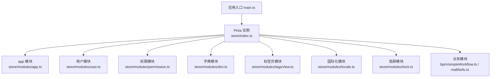
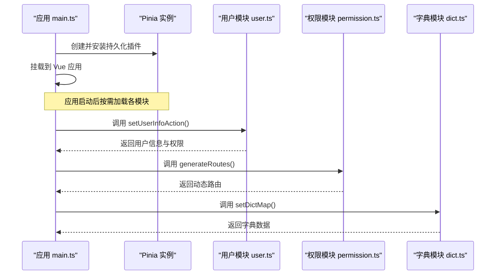
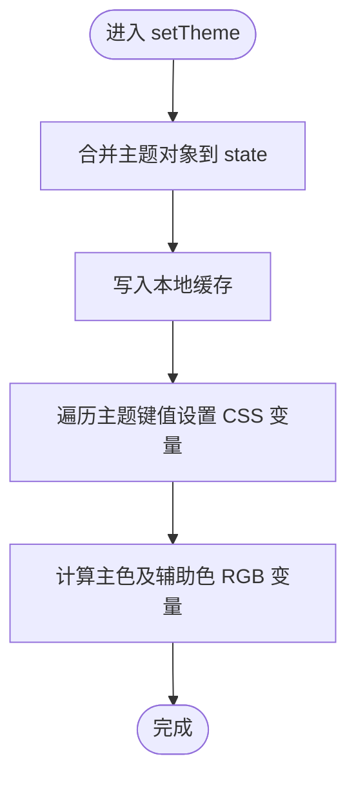
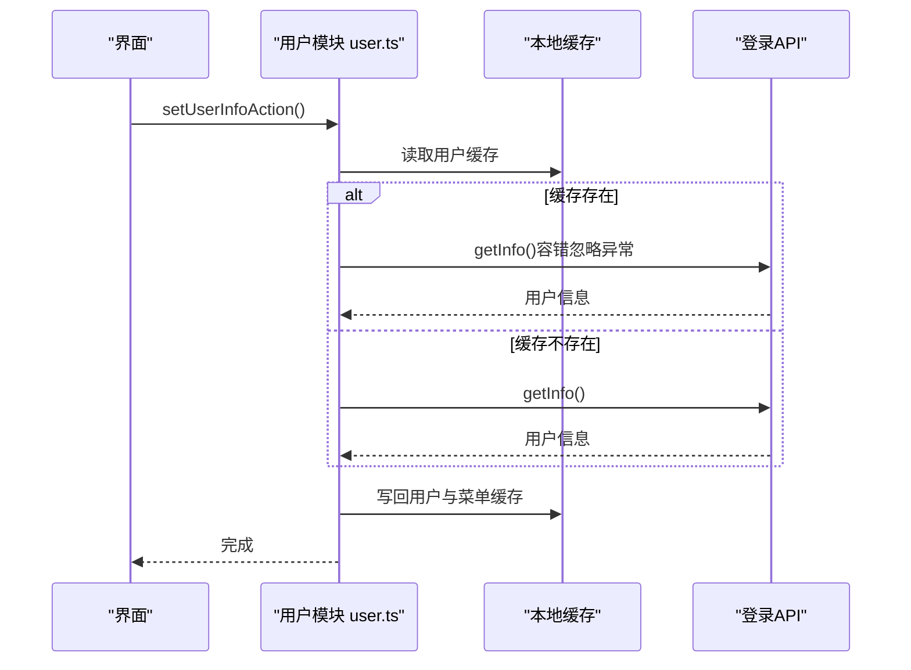
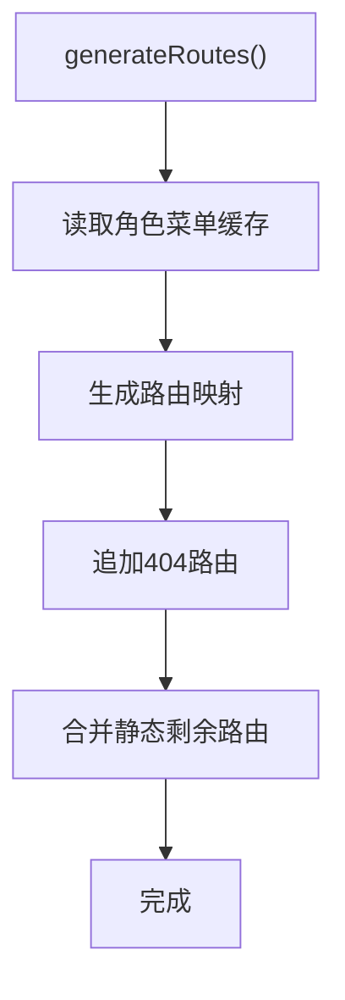
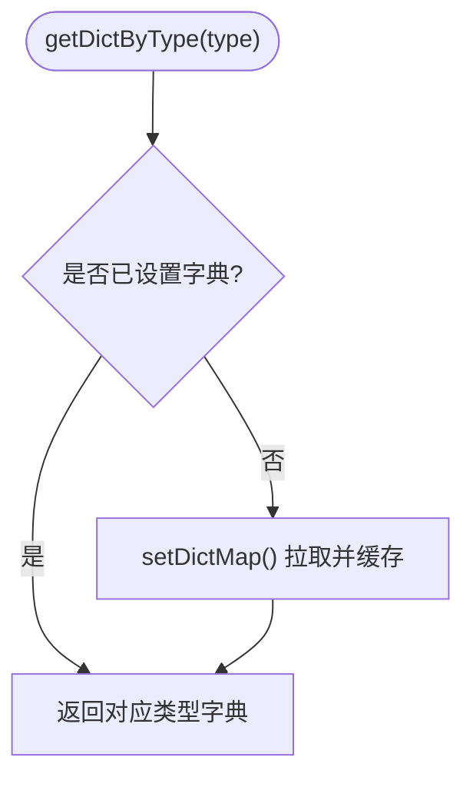
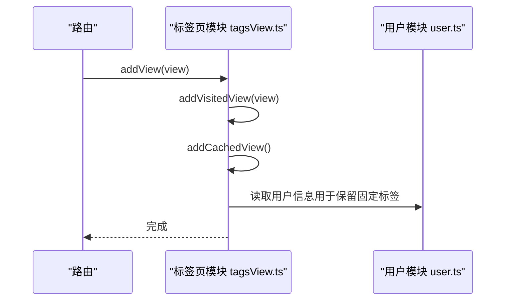
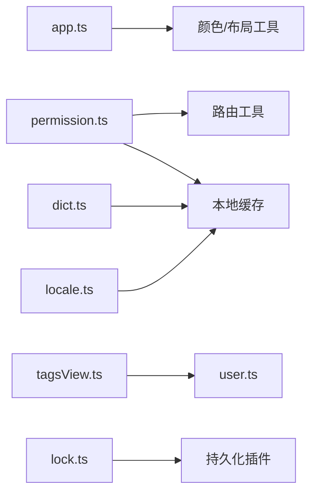

# Store架构设计

<cite>
**本文引用的文件**
- [store/index.ts](file://yudao-ui-admin-vue3/src/store/index.ts)
- [store/modules/app.ts](file://yudao-ui-admin-vue3/src/store/modules/app.ts)
- [store/modules/user.ts](file://yudao-ui-admin-vue3/src/store/modules/user.ts)
- [store/modules/permission.ts](file://yudao-ui-admin-vue3/src/store/modules/permission.ts)
- [store/modules/dict.ts](file://yudao-ui-admin-vue3/src/store/modules/dict.ts)
- [store/modules/tagsView.ts](file://yudao-ui-admin-vue3/src/store/modules/tagsView.ts)
- [store/modules/locale.ts](file://yudao-ui-admin-vue3/src/store/modules/locale.ts)
- [store/modules/lock.ts](file://yudao-ui-admin-vue3/src/store/modules/lock.ts)
- [store/modules/bpm/simpleWorkflow.ts](file://yudao-ui-admin-vue3/src/store/modules/bpm/simpleWorkflow.ts)
- [store/modules/mall/kefu.ts](file://yudao-ui-admin-vue3/src/store/modules/mall/kefu.ts)
- [main.ts](file://yudao-ui-admin-vue3/src/main.ts)
</cite>

## 目录
1. [简介](#简介)
2. [项目结构](#项目结构)
3. [核心组件](#核心组件)
4. [架构总览](#架构总览)
5. [详细组件分析](#详细组件分析)
6. [依赖关系分析](#依赖关系分析)
7. [性能考虑](#性能考虑)
8. [故障排查指南](#故障排查指南)
9. [结论](#结论)
10. [附录：扩展与自定义开发指南](#附录：扩展与自定义开发指南)

## 简介
本仓库前端采用 Vue 3 + Pinia 作为状态管理方案，Store 以模块化方式组织在 src/store/modules 下，并通过统一的入口进行初始化与插件集成。整体设计遵循“全局应用级状态”和“业务域状态”分离的原则：全局状态负责主题、布局、国际化、权限路由、标签页等跨模块共享能力；业务状态按领域划分（如客服、工作流），通过 API 获取并缓存数据，提供 getters 与 actions 完成读写与副作用处理。

## 项目结构
- 入口初始化：在应用启动时创建 Pinia 实例并注册持久化插件，随后挂载到 Vue 应用。
- 模块划分：每个业务或系统能力一个独立 store 模块，职责单一、边界清晰。
- 数据持久化：结合本地缓存工具（sessionStorage）与 Pinia 持久化插件，实现关键配置与字典的持久化。
- 模块通信：通过 Pinia 的跨模块访问能力，模块间可安全读取其他模块的状态与方法。

**图表来源**
- [main.ts:57-63](file://yudao-ui-admin-vue3/src/main.ts#L57-L63)
- [store/index.ts:1-13](file://yudao-ui-admin-vue3/src/store/index.ts#L1-L13)

**章节来源**
- [main.ts:57-63](file://yudao-ui-admin-vue3/src/main.ts#L57-L63)
- [store/index.ts:1-13](file://yudao-ui-admin-vue3/src/store/index.ts#L1-L13)

## 核心组件
- 应用设置（app）：管理布局、主题、暗黑模式、尺寸、标题、软电话开关等全局 UI 配置，并提供 CSS 变量更新方法。
- 用户信息（user）：维护登录态、用户基本信息、角色与权限集合，支持退出清理与头像昵称更新。
- 权限路由（permission）：基于缓存的角色菜单生成动态路由，注入 404 兜底路由，并维护菜单根路径与标签路由。
- 字典（dict）：加载并缓存字典数据，提供按类型查询与重置能力，使用短过期时间提升一致性。
- 标签页（tagsView）：维护已访问页面与缓存视图集合，支持增删改查、左右删除、清空等操作。
- 国际化（locale）：维护当前语言与 Element Plus 语言包映射，支持切换并持久化。
- 锁屏（lock）：可选的锁屏状态与密码校验。
- 业务模块：
  - 简单工作流（simpleWorkflow）：流程表单相关临时状态。
  - 客服（mall/kefu）：会话列表与消息缓存，支持排序与增量更新。

**章节来源**
- [store/modules/app.ts:14-110](file://yudao-ui-admin-vue3/src/store/modules/app.ts#L14-L110)
- [store/modules/user.ts:9-35](file://yudao-ui-admin-vue3/src/store/modules/user.ts#L9-L35)
- [store/modules/permission.ts:10-23](file://yudao-ui-admin-vue3/src/store/modules/permission.ts#L10-L23)
- [store/modules/dict.ts:9-28](file://yudao-ui-admin-vue3/src/store/modules/dict.ts#L9-L28)
- [store/modules/tagsView.ts:9-20](file://yudao-ui-admin-vue3/src/store/modules/tagsView.ts#L9-L20)
- [store/modules/locale.ts:14-37](file://yudao-ui-admin-vue3/src/store/modules/locale.ts#L14-L37)
- [store/modules/lock.ts:4-21](file://yudao-ui-admin-vue3/src/store/modules/lock.ts#L4-L21)
- [store/modules/bpm/simpleWorkflow.ts:4-18](file://yudao-ui-admin-vue3/src/store/modules/bpm/simpleWorkflow.ts#L4-L18)
- [store/modules/mall/kefu.ts:7-16](file://yudao-ui-admin-vue3/src/store/modules/mall/kefu.ts#L7-L16)

## 架构总览
- 技术栈：Vue 3 + Pinia，配合 pinia-plugin-persistedstate 实现部分状态持久化。
- 初始化流程：应用启动时创建 Pinia 实例，注册持久化插件，再挂载到 Vue 应用。
- 模块通信：模块之间通过 Pinia 提供的跨模块访问能力进行状态读取与方法调用，避免直接耦合。
- 数据流：UI 触发 action -> 可能调用 API -> 更新 state -> 通过 getter 暴露给组件。

**图表来源**
- [main.ts:57-63](file://yudao-ui-admin-vue3/src/main.ts#L57-L63)
- [store/index.ts:1-13](file://yudao-ui-admin-vue3/src/store/index.ts#L1-L13)
- [store/modules/user.ts:51-71](file://yudao-ui-admin-vue3/src/store/modules/user.ts#L51-L71)
- [store/modules/permission.ts:39-65](file://yudao-ui-admin-vue3/src/store/modules/permission.ts#L39-L65)
- [store/modules/dict.ts:42-72](file://yudao-ui-admin-vue3/src/store/modules/dict.ts#L42-L72)

## 详细组件分析

### 应用设置模块（app）
- 职责：集中管理全局 UI 配置（布局、主题、暗黑模式、尺寸、标题、软电话等），并在变更时同步到 CSS 变量与本地缓存。
- 关键点：
  - 主题色与辅助色的 RGB 变量自动计算与更新。
  - 移动端布局限制与提示。
  - 暗黑模式切换时同步 DOM class 与主题变量。
- 复杂度：状态字段较多但彼此解耦，getter/setter 明确，便于维护。

**图表来源**
- [store/modules/app.ts:318-327](file://yudao-ui-admin-vue3/src/store/modules/app.ts#L318-L327)
- [store/modules/app.ts:198-231](file://yudao-ui-admin-vue3/src/store/modules/app.ts#L198-L231)

**章节来源**
- [store/modules/app.ts:14-110](file://yudao-ui-admin-vue3/src/store/modules/app.ts#L14-L110)
- [store/modules/app.ts:198-333](file://yudao-ui-admin-vue3/src/store/modules/app.ts#L198-L333)

### 用户模块（user）
- 职责：维护登录态、用户信息、角色与权限集合，支持退出清理与头像昵称更新。
- 关键点：
  - 优先从缓存加载用户信息，失败不影响后续流程。
  - 将权限转换为 Set，便于快速判断。
  - 退出时清除 token、用户缓存并重置状态。

**图表来源**
- [store/modules/user.ts:51-71](file://yudao-ui-admin-vue3/src/store/modules/user.ts#L51-L71)

**章节来源**
- [store/modules/user.ts:9-109](file://yudao-ui-admin-vue3/src/store/modules/user.ts#L9-L109)

### 权限模块（permission）
- 职责：根据角色菜单生成动态路由，追加 404 兜底路由，维护菜单根路径与标签路由。
- 关键点：
  - 从缓存中读取角色菜单，转换为目标路由结构。
  - 扁平化多级路由，确保渲染正确。
  - 静态剩余路由与动态路由组合为最终菜单路由。

**图表来源**
- [store/modules/permission.ts:39-65](file://yudao-ui-admin-vue3/src/store/modules/permission.ts#L39-L65)

**章节来源**
- [store/modules/permission.ts:10-80](file://yudao-ui-admin-vue3/src/store/modules/permission.ts#L10-L80)

### 字典模块（dict）
- 职责：加载并缓存字典数据，提供按类型查询与重置能力。
- 关键点：
  - 首次加载或重置时拉取后端字典数据，构建 Map 结构。
  - 使用短过期时间的缓存策略，保证数据时效性。
  - 提供 getDictByType 懒加载接口。

**图表来源**
- [store/modules/dict.ts:42-72](file://yudao-ui-admin-vue3/src/store/modules/dict.ts#L42-L72)
- [store/modules/dict.ts:73-78](file://yudao-ui-admin-vue3/src/store/modules/dict.ts#L73-L78)

**章节来源**
- [store/modules/dict.ts:9-111](file://yudao-ui-admin-vue3/src/store/modules/dict.ts#L9-L111)

### 标签页模块（tagsView）
- 职责：维护已访问页面与缓存视图集合，支持增删改查、左右删除、清空等操作。
- 关键点：
  - 去重与 noTagsView 控制。
  - 根据 meta.noCache 决定是否加入 keep-alive 缓存。
  - 与用户模块联动保留固定标签。

**图表来源**
- [store/modules/tagsView.ts:33-77](file://yudao-ui-admin-vue3/src/store/modules/tagsView.ts#L33-L77)
- [store/modules/tagsView.ts:112-118](file://yudao-ui-admin-vue3/src/store/modules/tagsView.ts#L112-L118)

**章节来源**
- [store/modules/tagsView.ts:9-184](file://yudao-ui-admin-vue3/src/store/modules/tagsView.ts#L9-L184)

### 国际化模块（locale）
- 职责：维护当前语言与 Element Plus 语言包映射，支持切换并持久化。
- 关键点：
  - 初始值来自本地缓存。
  - 切换时更新 currentLocale 与 elLocale，并写入缓存。

**章节来源**
- [store/modules/locale.ts:14-55](file://yudao-ui-admin-vue3/src/store/modules/locale.ts#L14-L55)

### 锁屏模块（lock）
- 职责：可选的锁屏状态与密码校验。
- 关键点：
  - 提供设置、重置与解锁方法。
  - 默认开启持久化。

**章节来源**
- [store/modules/lock.ts:4-49](file://yudao-ui-admin-vue3/src/store/modules/lock.ts#L4-L49)

### 业务模块
- 简单工作流（simpleWorkflow）：存储流程表单相关的临时状态（如抽屉显隐、配置项）。
- 客服（mall/kefu）：维护会话列表与消息缓存，支持排序与增量更新。

**章节来源**
- [store/modules/bpm/simpleWorkflow.ts:4-56](file://yudao-ui-admin-vue3/src/store/modules/bpm/simpleWorkflow.ts#L4-L56)
- [store/modules/mall/kefu.ts:7-82](file://yudao-ui-admin-vue3/src/store/modules/mall/kefu.ts#L7-L82)

## 依赖关系分析
- 模块内聚：每个模块聚焦单一职责，状态、getter、actions 清晰分离。
- 模块耦合：
  - tagsView 依赖 user 模块以保留固定标签。
  - permission 依赖路由工具与缓存。
  - app 依赖颜色与布局工具。
- 外部依赖：
  - Pinia 与持久化插件。
  - 本地缓存工具（sessionStorage）。
  - Element Plus 国际化与主题。

**图表来源**
- [store/modules/app.ts:1-12](file://yudao-ui-admin-vue3/src/store/modules/app.ts#L1-L12)
- [store/modules/permission.ts:1-8](file://yudao-ui-admin-vue3/src/store/modules/permission.ts#L1-L8)
- [store/modules/tagsView.ts:1-8](file://yudao-ui-admin-vue3/src/store/modules/tagsView.ts#L1-L8)
- [store/modules/dict.ts:1-8](file://yudao-ui-admin-vue3/src/store/modules/dict.ts#L1-L8)
- [store/modules/locale.ts:1-8](file://yudao-ui-admin-vue3/src/store/modules/locale.ts#L1-L8)
- [store/modules/lock.ts:1-3](file://yudao-ui-admin-vue3/src/store/modules/lock.ts#L1-L3)

**章节来源**
- [store/modules/app.ts:1-12](file://yudao-ui-admin-vue3/src/store/modules/app.ts#L1-L12)
- [store/modules/permission.ts:1-8](file://yudao-ui-admin-vue3/src/store/modules/permission.ts#L1-L8)
- [store/modules/tagsView.ts:1-8](file://yudao-ui-admin-vue3/src/store/modules/tagsView.ts#L1-L8)
- [store/modules/dict.ts:1-8](file://yudao-ui-admin-vue3/src/store/modules/dict.ts#L1-L8)
- [store/modules/locale.ts:1-8](file://yudao-ui-admin-vue3/src/store/modules/locale.ts#L1-L8)
- [store/modules/lock.ts:1-3](file://yudao-ui-admin-vue3/src/store/modules/lock.ts#L1-L3)

## 性能考虑
- 字典缓存：使用短过期时间的本地缓存，减少频繁请求，同时保持数据相对新鲜。
- 路由生成：一次性生成动态路由并缓存，避免重复计算。
- 主题更新：批量设置 CSS 变量，减少多次 DOM 操作。
- 标签页缓存：基于 meta.noCache 精确控制 keep-alive，避免不必要的组件重建。

[本节为通用性能建议，不直接分析具体文件]

## 故障排查指南
- 用户信息未加载：检查是否有访问令牌，确认 getInfo 调用是否成功，查看缓存是否被正确写入。
- 动态路由为空：确认角色菜单缓存是否存在，检查 generateRoute 是否正确转换。
- 字典显示异常：检查字典缓存是否过期或被清空，必要时调用 resetDict 刷新。
- 标签页异常：检查路由 meta 配置（noTagsView、noCache、affix），确认 addView/delView 调用时机。
- 主题不生效：确认 setCssVarTheme 是否执行，检查 CSS 变量名是否与主题键一致。

**章节来源**
- [store/modules/user.ts:51-71](file://yudao-ui-admin-vue3/src/store/modules/user.ts#L51-L71)
- [store/modules/permission.ts:39-65](file://yudao-ui-admin-vue3/src/store/modules/permission.ts#L39-L65)
- [store/modules/dict.ts:42-104](file://yudao-ui-admin-vue3/src/store/modules/dict.ts#L42-L104)
- [store/modules/tagsView.ts:33-177](file://yudao-ui-admin-vue3/src/store/modules/tagsView.ts#L33-L177)
- [store/modules/app.ts:318-327](file://yudao-ui-admin-vue3/src/store/modules/app.ts#L318-L327)

## 结论
该项目的 Store 架构以 Pinia 为核心，采用清晰的模块化设计，将全局应用状态与业务域状态有效分离。通过统一的初始化与插件集成，实现了良好的可扩展性与可维护性。各模块职责明确、边界清晰，借助本地缓存与持久化插件提升了用户体验与性能。

[本节为总结性内容，不直接分析具体文件]

## 附录：扩展与自定义开发指南

### 新增状态模块的步骤
- 新建模块文件：在 src/store/modules 下创建新模块，定义 state、getters、actions。
- 导出 withOut 版本：提供 useXxxStoreWithOut 以便在需要时脱离组件上下文访问。
- 如需持久化：在模块定义中添加 persist 配置或使用本地缓存工具。
- 模块间通信：通过 import { useOtherStore } from './other' 访问其他模块状态与方法。
- 示例参考：
  - 简单工作流模块：展示最小化的状态与 actions 设计。
  - 客服模块：展示复杂数据结构（Map）与异步更新逻辑。

**章节来源**
- [store/modules/bpm/simpleWorkflow.ts:4-56](file://yudao-ui-admin-vue3/src/store/modules/bpm/simpleWorkflow.ts#L4-L56)
- [store/modules/mall/kefu.ts:7-82](file://yudao-ui-admin-vue3/src/store/modules/mall/kefu.ts#L7-L82)

### 添加新的状态模块示例（步骤说明）
- 定义状态结构：明确 state 的类型与默认值。
- 编写 getters：对外暴露只读视图，避免直接修改 state。
- 编写 actions：封装副作用（如 API 调用、缓存写入），保证状态变更的可追踪性。
- 集成到应用：若需全局可用，无需额外注册；直接在组件或模块中引入即可。
- 测试与调试：通过浏览器开发者工具查看 Pinia Devtools，验证状态变化与副作用。

[本节为实践指导，不直接分析具体文件]