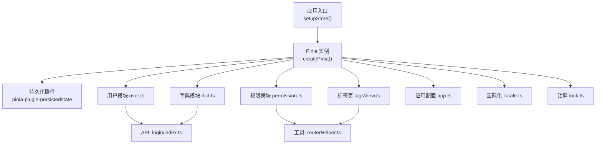
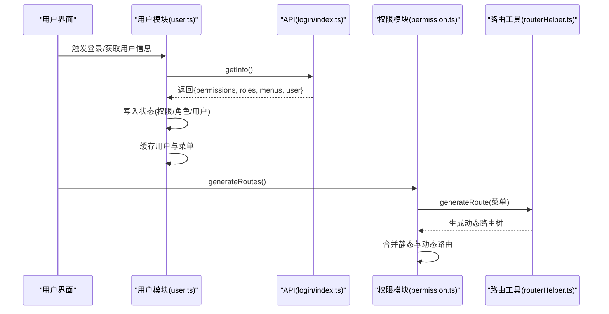
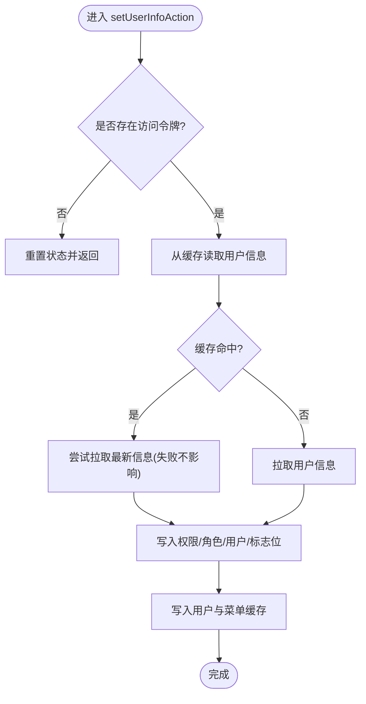
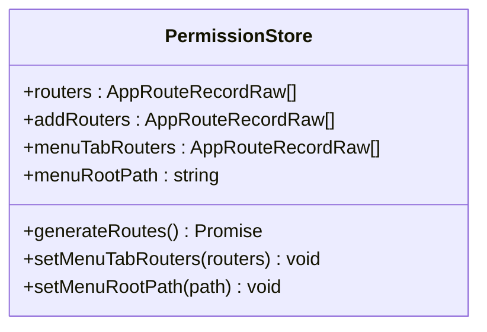
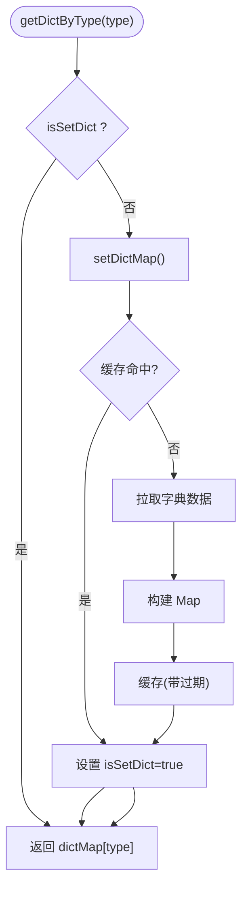
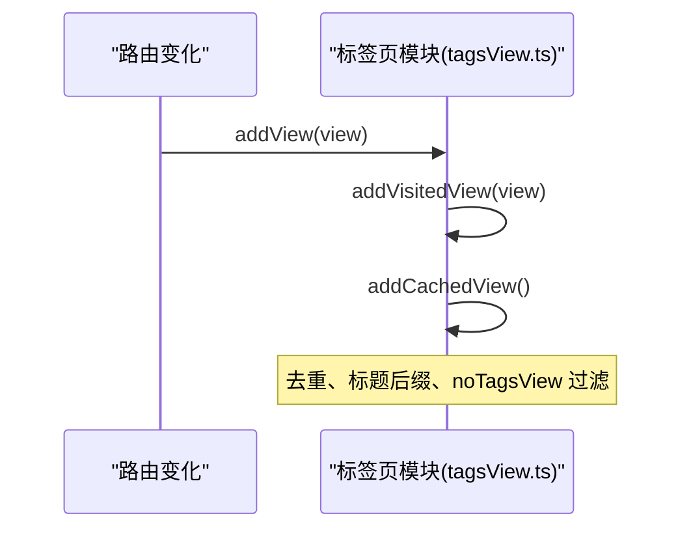
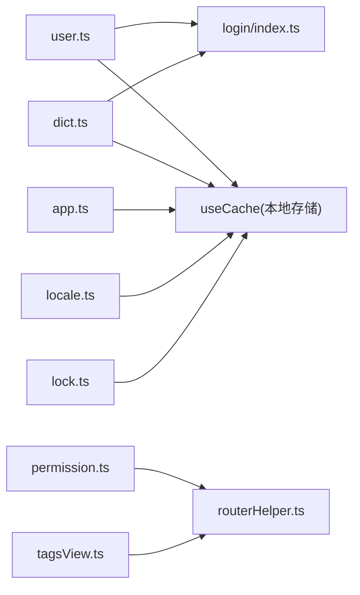

# Vuex状态管理

<cite>
**本文引用的文件**
- [store/index.ts](file://yudao-ui-admin-vue3/src/store/index.ts)
- [store/modules/user.ts](file://yudao-ui-admin-vue3/src/store/modules/user.ts)
- [store/modules/permission.ts](file://yudao-ui-admin-vue3/src/store/modules/permission.ts)
- [store/modules/dict.ts](file://yudao-ui-admin-vue3/src/store/modules/dict.ts)
- [store/modules/tagsView.ts](file://yudao-ui-admin-vue3/src/store/modules/tagsView.ts)
- [store/modules/app.ts](file://yudao-ui-admin-vue3/src/store/modules/app.ts)
- [store/modules/locale.ts](file://yudao-ui-admin-vue3/src/store/modules/locale.ts)
- [store/modules/lock.ts](file://yudao-ui-admin-vue3/src/store/modules/lock.ts)
- [api/login/index.ts](file://yudao-ui-admin-vue3/src/api/login/index.ts)
- [utils/routerHelper.ts](file://yudao-ui-admin-vue3/src/utils/routerHelper.ts)
</cite>

## 目录
1. [简介](#简介)
2. [项目结构](#项目结构)
3. [核心组件](#核心组件)
4. [架构总览](#架构总览)
5. [详细组件分析](#详细组件分析)
6. [依赖关系分析](#依赖关系分析)
7. [性能考虑](#性能考虑)
8. [故障排查指南](#故障排查指南)
9. [结论](#结论)
10. [附录](#附录)

## 简介
本仓库前端采用 Pinia（Vue 官方推荐的状态管理库）进行全局状态管理，并通过持久化插件将关键状态同步到本地存储。尽管文档标题为“Vuex状态管理”，实际实现基于 Pinia，其概念与用法与 Vuex 类似，但 API 更简洁、类型友好。本文档围绕 store 模块划分、业务状态设计、持久化机制、异步处理模式、调试监控与性能优化等方面进行全面说明，并提供可操作的实践建议与示例路径。

## 项目结构
- 入口：store/index.ts 创建 Pinia 实例并启用持久化插件，统一挂载到应用。
- 模块：store/modules 下按业务域拆分模块，包括用户、权限、字典、标签页、应用配置、国际化、锁屏等。
- 数据源：各模块通过 API 层获取数据，结合 useCache 工具读写本地缓存（sessionStorage/localStorage）。
- 路由联动：权限模块负责动态路由生成，标签页模块维护访问历史与缓存视图集合。

图表来源
- [store/index.ts:1-13](file://yudao-ui-admin-vue3/src/store/index.ts#L1-L13)
- [store/modules/user.ts:1-109](file://yudao-ui-admin-vue3/src/store/modules/user.ts#L1-L109)
- [store/modules/permission.ts:1-80](file://yudao-ui-admin-vue3/src/store/modules/permission.ts#L1-L80)
- [store/modules/dict.ts:1-111](file://yudao-ui-admin-vue3/src/store/modules/dict.ts#L1-L111)
- [store/modules/tagsView.ts:1-184](file://yudao-ui-admin-vue3/src/store/modules/tagsView.ts#L1-L184)
- [store/modules/app.ts:1-341](file://yudao-ui-admin-vue3/src/store/modules/app.ts#L1-L341)
- [store/modules/locale.ts:1-60](file://yudao-ui-admin-vue3/src/store/modules/locale.ts#L1-L60)
- [store/modules/lock.ts:1-49](file://yudao-ui-admin-vue3/src/store/modules/lock.ts#L1-L49)
- [api/login/index.ts:1-92](file://yudao-ui-admin-vue3/src/api/login/index.ts#L1-L92)
- [utils/routerHelper.ts:1-373](file://yudao-ui-admin-vue3/src/utils/routerHelper.ts#L1-L373)

章节来源
- [store/index.ts:1-13](file://yudao-ui-admin-vue3/src/store/index.ts#L1-L13)

## 核心组件
- 用户模块（user.ts）：管理登录态、用户信息、权限集合、角色列表；提供设置用户信息、更新头像昵称、登出与重置状态等动作。
- 权限模块（permission.ts）：根据后端返回的菜单数据生成动态路由，维护静态与动态路由集合、标签页路由与根路径。
- 字典模块（dict.ts）：加载并缓存字典数据，支持按类型查询与强制刷新。
- 标签页模块（tagsView.ts）：维护已访问页面、缓存视图集合、当前选中标签，提供增删改查等操作。
- 应用配置模块（app.ts）：管理主题、布局、尺寸、暗黑模式、移动端适配、软电话开关等全局配置。
- 国际化模块（locale.ts）：管理当前语言与 Element Plus 语言包映射。
- 锁屏模块（lock.ts）：管理锁屏状态与密码校验（默认未启用）。

章节来源
- [store/modules/user.ts:1-109](file://yudao-ui-admin-vue3/src/store/modules/user.ts#L1-L109)
- [store/modules/permission.ts:1-80](file://yudao-ui-admin-vue3/src/store/modules/permission.ts#L1-L80)
- [store/modules/dict.ts:1-111](file://yudao-ui-admin-vue3/src/store/modules/dict.ts#L1-L111)
- [store/modules/tagsView.ts:1-184](file://yudao-ui-admin-vue3/src/store/modules/tagsView.ts#L1-L184)
- [store/modules/app.ts:1-341](file://yudao-ui-admin-vue3/src/store/modules/app.ts#L1-L341)
- [store/modules/locale.ts:1-60](file://yudao-ui-admin-vue3/src/store/modules/locale.ts#L1-L60)
- [store/modules/lock.ts:1-49](file://yudao-ui-admin-vue3/src/store/modules/lock.ts#L1-L49)

## 架构总览
整体采用模块化 Store + 本地缓存 + API 请求的组合模式：
- 初始化：应用启动时创建 Pinia 实例并安装持久化插件。
- 登录流程：用户模块调用 API 获取用户信息与权限，写入状态并缓存；权限模块据此生成动态路由。
- 字典数据：字典模块优先从缓存读取，缺失则拉取并缓存，供全系统复用。
- 标签页：随路由变化维护 visitedViews 与 cachedViews，配合 keepAlive 提升性能。
- 应用配置：主题、布局、语言等配置读写本地缓存，保证刷新后一致。

图表来源
- [store/modules/user.ts:50-71](file://yudao-ui-admin-vue3/src/store/modules/user.ts#L50-L71)
- [api/login/index.ts:45-48](file://yudao-ui-admin-vue3/src/api/login/index.ts#L45-L48)
- [store/modules/permission.ts:38-65](file://yudao-ui-admin-vue3/src/store/modules/permission.ts#L38-L65)
- [utils/routerHelper.ts:73-220](file://yudao-ui-admin-vue3/src/utils/routerHelper.ts#L73-L220)

## 详细组件分析

### 用户模块（user.ts）
- 状态设计
  - permissions：Set<string>，用于权限控制。
  - roles：string[]，角色列表。
  - isSetUser：boolean，标记是否已设置用户信息。
  - user：用户基本信息对象。
- 关键动作
  - setUserInfoAction：无 token 则重置状态；否则优先从缓存读取，失败也继续执行以保证进入系统；最终写入状态并缓存用户与菜单。
  - setUserAvatarAction / setUserNicknameAction：更新头像或昵称并同步缓存。
  - loginOut：调用后端登出接口，清理本地 token 与用户缓存，重置状态。
  - resetState：清空用户相关状态。
- 错误处理
  - 在缓存存在的情况下，仍尝试拉取最新信息，即使失败也不中断后续流程，确保可用性。

图表来源
- [store/modules/user.ts:50-71](file://yudao-ui-admin-vue3/src/store/modules/user.ts#L50-L71)

章节来源
- [store/modules/user.ts:1-109](file://yudao-ui-admin-vue3/src/store/modules/user.ts#L1-L109)
- [api/login/index.ts:45-48](file://yudao-ui-admin-vue3/src/api/login/index.ts#L45-L48)

### 权限模块（permission.ts）
- 状态设计
  - routers：静态路由与动态路由合并后的完整路由表。
  - addRouters：仅动态路由部分（含 404）。
  - menuTabRouters：用于标签页展示的路由子集。
  - menuRootPath：菜单根路径。
- 关键动作
  - generateRoutes：从缓存读取菜单，调用路由工具生成动态路由，追加 404 路由，合并静态路由形成最终路由表。
  - setMenuTabRouters / setMenuRootPath：设置标签页路由与根路径。
- 注意
  - 该模块明确关闭持久化（persist: false），避免路由状态跨会话污染。

图表来源
- [store/modules/permission.ts:10-75](file://yudao-ui-admin-vue3/src/store/modules/permission.ts#L10-L75)

章节来源
- [store/modules/permission.ts:1-80](file://yudao-ui-admin-vue3/src/store/modules/permission.ts#L1-L80)
- [utils/routerHelper.ts:73-220](file://yudao-ui-admin-vue3/src/utils/routerHelper.ts#L73-L220)

### 字典模块（dict.ts）
- 状态设计
  - dictMap：Map<string, any>，以字典类型为键的值集合。
  - isSetDict：是否已初始化字典。
- 关键动作
  - setDictMap：优先从缓存读取；若为空则拉取并构建 Map，设置标志位并缓存（带过期时间）。
  - getDictByType：按需懒加载字典。
  - resetDict：清除缓存并重新拉取。
- 性能策略
  - 使用 Map 提升查找效率；缓存带过期时间减少重复请求。

图表来源
- [store/modules/dict.ts:24-105](file://yudao-ui-admin-vue3/src/store/modules/dict.ts#L24-L105)

章节来源
- [store/modules/dict.ts:1-111](file://yudao-ui-admin-vue3/src/store/modules/dict.ts#L1-L111)

### 标签页模块（tagsView.ts）
- 状态设计
  - visitedViews：已访问路由记录数组。
  - cachedViews：需要 keepAlive 的组件名称集合。
  - selectedTag：当前选中的标签。
- 关键动作
  - addView：同时添加 visited 与缓存。
  - addVisitedView：去重、处理标题后缀、忽略 noTagsView。
  - addCachedView：根据 visitedViews 计算需缓存的组件名集合。
  - delView / delVisitedView / delAllViews / delOthersViews / delLeftViews / delRightViews：多种删除策略。
  - updateVisitedView / setSelectedTag / setTitle：更新与选择。
- 注意
  - 删除逻辑会联动更新 cachedViews，保持缓存一致性。

图表来源
- [store/modules/tagsView.ts:32-77](file://yudao-ui-admin-vue3/src/store/modules/tagsView.ts#L32-L77)

章节来源
- [store/modules/tagsView.ts:1-184](file://yudao-ui-admin-vue3/src/store/modules/tagsView.ts#L1-L184)

### 应用配置模块（app.ts）
- 状态设计
  - 包含面包屑、折叠、全屏、搜索、尺寸、多语言、消息、IM、标签页、Logo、固定头部、页脚、灰度模式、页面加载、布局、标题、用户信息字段、暗黑模式、组件尺寸、移动端、主题、固定菜单、软电话等大量 UI 配置项。
- 关键动作
  - setLayout：移动端限制布局切换；写入缓存。
  - setIsDark：切换暗黑模式并更新 CSS 变量；写入缓存。
  - setCurrentSize / setTheme / setCssVarTheme：更新尺寸与主题并应用 CSS 变量。
  - setFixedMenu：写入缓存。
- 注意
  - 多数配置项读写本地缓存，保证刷新后一致。

章节来源
- [store/modules/app.ts:1-341](file://yudao-ui-admin-vue3/src/store/modules/app.ts#L1-L341)

### 国际化模块（locale.ts）
- 状态设计
  - currentLocale：当前语言与对应 Element Plus 语言包。
  - localeMap：可选语言列表。
- 关键动作
  - setCurrentLocale：更新当前语言并写入缓存。

章节来源
- [store/modules/locale.ts:1-60](file://yudao-ui-admin-vue3/src/store/modules/locale.ts#L1-L60)

### 锁屏模块（lock.ts）
- 状态设计
  - lockInfo：包含是否锁定与密码（默认未启用）。
- 关键动作
  - setLockInfo / resetLockInfo / unLock：设置、重置与解锁校验。
- 注意
  - 开启持久化（persist: true），默认注释掉功能字段。

章节来源
- [store/modules/lock.ts:1-49](file://yudao-ui-admin-vue3/src/store/modules/lock.ts#L1-L49)

## 依赖关系分析
- 用户模块依赖 API 层获取用户信息与菜单，并依赖缓存工具写入本地存储。
- 权限模块依赖路由工具生成动态路由，并与静态路由合并。
- 字典模块依赖 API 层获取字典数据，并使用缓存工具进行读写。
- 标签页模块依赖路由工具提取原始路由信息，并联动用户模块判断保留固定标签。
- 应用配置模块依赖缓存工具与颜色工具更新主题与布局。

图表来源
- [store/modules/user.ts:1-109](file://yudao-ui-admin-vue3/src/store/modules/user.ts#L1-L109)
- [store/modules/permission.ts:1-80](file://yudao-ui-admin-vue3/src/store/modules/permission.ts#L1-L80)
- [store/modules/dict.ts:1-111](file://yudao-ui-admin-vue3/src/store/modules/dict.ts#L1-L111)
- [store/modules/tagsView.ts:1-184](file://yudao-ui-admin-vue3/src/store/modules/tagsView.ts#L1-L184)
- [store/modules/app.ts:1-341](file://yudao-ui-admin-vue3/src/store/modules/app.ts#L1-L341)
- [store/modules/locale.ts:1-60](file://yudao-ui-admin-vue3/src/store/modules/locale.ts#L1-L60)
- [store/modules/lock.ts:1-49](file://yudao-ui-admin-vue3/src/store/modules/lock.ts#L1-L49)
- [api/login/index.ts:1-92](file://yudao-ui-admin-vue3/src/api/login/index.ts#L1-L92)
- [utils/routerHelper.ts:1-373](file://yudao-ui-admin-vue3/src/utils/routerHelper.ts#L1-L373)

章节来源
- [store/index.ts:1-13](file://yudao-ui-admin-vue3/src/store/index.ts#L1-L13)

## 性能考虑
- 字典数据缓存：字典模块对字典数据进行缓存并设置过期时间，减少频繁请求。
- 路由懒加载：权限模块生成的动态路由使用异步组件，降低首屏体积。
- 标签页缓存：标签页模块维护 cachedViews，配合 keepAlive 减少重复渲染。
- 主题与布局：应用配置模块通过 CSS 变量批量更新主题，避免多次 DOM 操作。
- 本地存储：关键配置与用户信息通过缓存工具读写，避免重复网络请求。

[本节为通用性能建议，不直接分析具体代码文件]

## 故障排查指南
- 登录后无法进入系统
  - 检查用户模块是否在无 token 时正确重置状态；确认 getInfo 调用是否成功；查看缓存中用户与菜单是否正确写入。
  - 参考路径：[store/modules/user.ts:50-71](file://yudao-ui-admin-vue3/src/store/modules/user.ts#L50-L71)、[api/login/index.ts:45-48](file://yudao-ui-admin-vue3/src/api/login/index.ts#L45-L48)
- 动态路由未生效
  - 检查权限模块 generateRoutes 是否被调用；确认菜单数据是否正确；查看路由工具生成结果。
  - 参考路径：[store/modules/permission.ts:38-65](file://yudao-ui-admin-vue3/src/store/modules/permission.ts#L38-L65)、[utils/routerHelper.ts:73-220](file://yudao-ui-admin-vue3/src/utils/routerHelper.ts#L73-L220)
- 字典显示异常
  - 检查字典模块是否已初始化；确认缓存是否命中；必要时调用 resetDict 强制刷新。
  - 参考路径：[store/modules/dict.ts:41-72](file://yudao-ui-admin-vue3/src/store/modules/dict.ts#L41-L72)、[store/modules/dict.ts:79-104](file://yudao-ui-admin-vue3/src/store/modules/dict.ts#L79-L104)
- 标签页状态错乱
  - 检查 addVisitedView 的去重逻辑与 noTagsView 过滤；确认 del* 系列方法是否正确联动 cachedViews。
  - 参考路径：[store/modules/tagsView.ts:38-77](file://yudao-ui-admin-vue3/src/store/modules/tagsView.ts#L38-L77)、[store/modules/tagsView.ts:78-156](file://yudao-ui-admin-vue3/src/store/modules/tagsView.ts#L78-L156)
- 主题或布局刷新不一致
  - 检查应用配置模块是否写入缓存；确认 CSS 变量是否正确设置。
  - 参考路径：[store/modules/app.ts:287-327](file://yudao-ui-admin-vue3/src/store/modules/app.ts#L287-L327)

章节来源
- [store/modules/user.ts:50-71](file://yudao-ui-admin-vue3/src/store/modules/user.ts#L50-L71)
- [store/modules/permission.ts:38-65](file://yudao-ui-admin-vue3/src/store/modules/permission.ts#L38-L65)
- [store/modules/dict.ts:41-72](file://yudao-ui-admin-vue3/src/store/modules/dict.ts#L41-L72)
- [store/modules/tagsView.ts:38-77](file://yudao-ui-admin-vue3/src/store/modules/tagsView.ts#L38-L77)
- [store/modules/app.ts:287-327](file://yudao-ui-admin-vue3/src/store/modules/app.ts#L287-L327)

## 结论
本项目采用 Pinia 作为状态管理方案，通过模块化组织与本地缓存策略，实现了用户、权限、字典、标签页与应用配置的高效管理。异步操作集中在各模块 actions 中，结合错误处理与缓存机制保障用户体验。建议在新增业务模块时遵循现有模式：明确状态边界、合理使用 getters/actions、谨慎使用持久化、充分利用缓存与懒加载以提升性能。

[本节为总结性内容，不直接分析具体代码文件]

## 附录
- 最佳实践示例（以路径引用代替代码片段）
  - 用户登录与信息设置：[store/modules/user.ts:50-71](file://yudao-ui-admin-vue3/src/store/modules/user.ts#L50-L71)
  - 动态路由生成：[store/modules/permission.ts:38-65](file://yudao-ui-admin-vue3/src/store/modules/permission.ts#L38-L65)
  - 字典数据加载与缓存：[store/modules/dict.ts:41-72](file://yudao-ui-admin-vue3/src/store/modules/dict.ts#L41-L72)
  - 标签页增删与缓存同步：[store/modules/tagsView.ts:32-77](file://yudao-ui-admin-vue3/src/store/modules/tagsView.ts#L32-L77)
  - 主题与布局持久化：[store/modules/app.ts:287-327](file://yudao-ui-admin-vue3/src/store/modules/app.ts#L287-L327)
  - 国际化切换：[store/modules/locale.ts:47-53](file://yudao-ui-admin-vue3/src/store/modules/locale.ts#L47-L53)
  - 锁屏解锁校验：[store/modules/lock.ts:27-41](file://yudao-ui-admin-vue3/src/store/modules/lock.ts#L27-L41)

[本节为附录，不直接分析具体代码文件]