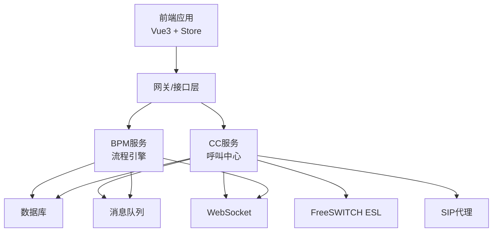
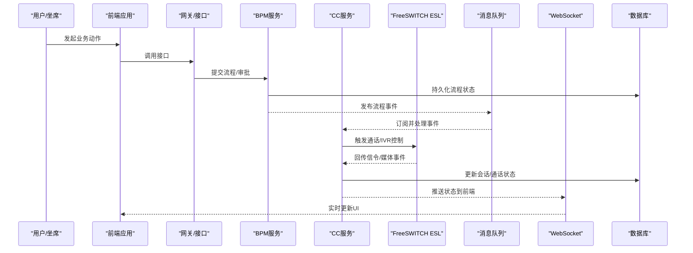
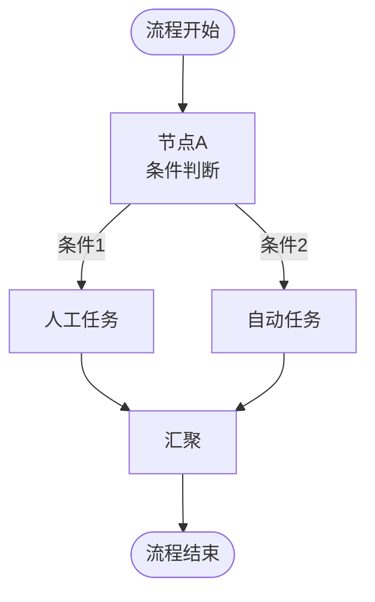
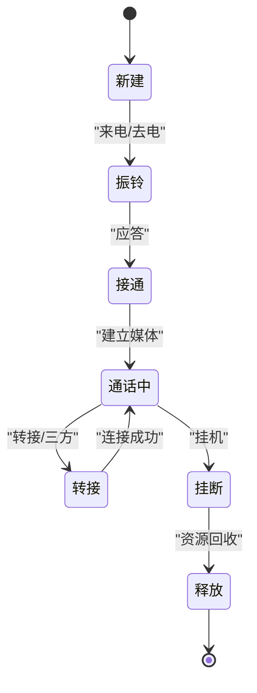
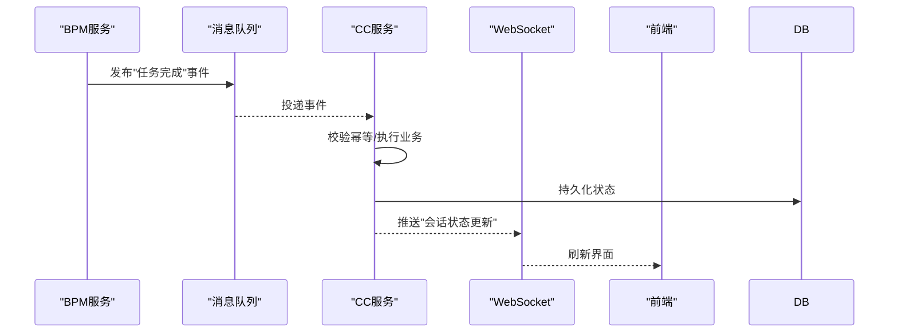
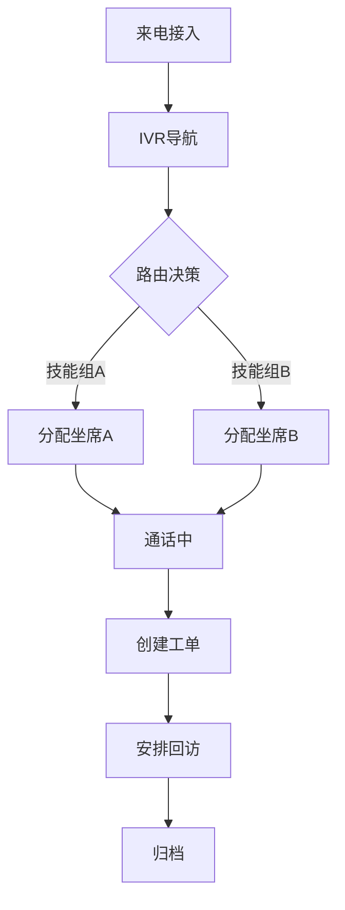
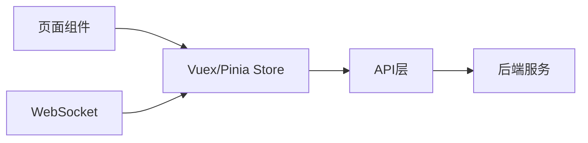
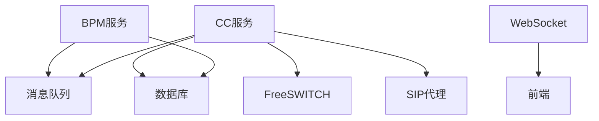

# 业务模块状态

<cite>
**本文引用的文件**
- [yudao-module-bpm-server:流程引擎集成](file://yudao-cloud/yudao-module-bpm/yudao-module-bpm-server/src/main/java/cn/iocoder/yudao/module/bpm)
- [yudao-module-bpm-api:流程API定义](file://yudao-cloud/yudao-module-bpm/yudao-module-bpm-api/src/main/java/cn/iocoder/yudao/module/bpm)
- [yudao-module-cc-server:呼叫中心服务](file://yudao-cloud/yudao-module-cc/yudao-module-cc-server/src/main/java/cn/iocoder/yudao/module/cc)
- [yudao-module-cc-api:呼叫中心API](file://yudao-cloud/yudao-module-cc/yudao-module-cc-api/src/main/java/cn/iocoder/yudao/module/cc)
- [ipcc-fs-esl:FreeSWITCH ESL客户端](file://yudao-cloud/yudao-module-cc/ipcc-fs-esl/src/main/java)
- [ipcc-sipproxy:SIP代理组件](file://yudao-cloud/yudao-module-cc/ipcc-sipproxy/src/main/java)
- [yudao-framework-mq:消息队列启动器](file://yudao-cloud/yudao-framework/yudao-spring-boot-starter-mq/src/main/java)
- [yudao-framework-websocket:WebSocket启动器](file://yudao-cloud/yudao-framework/yudao-spring-boot-starter-websocket/src/main/java)
- [yudao-ui-admin-vue3:前端store与路由](file://yudao-ui-admin-vue3/src/store/modules)
- [yudao-ui-admin-vue3:前端API层](file://yudao-ui-admin-vue3/src/api/cc)
</cite>

## 目录
1. [简介](#简介)
2. [项目结构](#项目结构)
3. [核心组件](#核心组件)
4. [架构总览](#架构总览)
5. [详细组件分析](#详细组件分析)
6. [依赖关系分析](#依赖关系分析)
7. [性能考量](#性能考量)
8. [故障排查指南](#故障排查指南)
9. [结论](#结论)
10. [附录](#附录)

## 简介
本文件面向“业务模块状态管理”，聚焦于工作流状态与客户服务的特定业务逻辑，系统梳理各模块的状态设计模式、跨模块数据共享与状态同步机制、复杂业务流程的状态流转（含状态机与事件驱动更新）、最佳实践（状态解耦与模块化），以及调试与测试方法。文档以代码仓库为依据，结合BPM流程引擎、呼叫中心（CC）与IM/通信能力，给出可落地的架构与实现建议。

## 项目结构
本项目采用多模块微服务架构：
- yudao-module-bpm：流程编排与状态机载体，负责业务流程的建模、执行与状态持久化。
- yudao-module-cc：呼叫中心业务域，包含坐席、通话、IVR、外呼等子域，状态涉及会话、通话、任务、设备与渠道。
- ipcc-fs-esl / ipcc-sipproxy：底层通信与媒体控制，提供SIP/ESL事件到业务状态的映射。
- yudao-framework-*：通用能力（MQ、WebSocket、Web、Redis等），用于事件总线、实时推送与缓存。
- yudao-ui-admin-vue3：前端状态管理与页面交互，通过API与后端协同维护视图状态。

图表来源
- [yudao-module-bpm-server:流程引擎集成](file://yudao-cloud/yudao-module-bpm/yudao-module-bpm-server/src/main/java/cn/iocoder/yudao/module/bpm)
- [yudao-module-cc-server:呼叫中心服务](file://yudao-cloud/yudao-module-cc/yudao-module-cc-server/src/main/java/cn/iocoder/yudao/module/cc)
- [ipcc-fs-esl:FreeSWITCH ESL客户端](file://yudao-cloud/yudao-module-cc/ipcc-fs-esl/src/main/java)
- [ipcc-sipproxy:SIP代理组件](file://yudao-cloud/yudao-module-cc/ipcc-sipproxy/src/main/java)
- [yudao-framework-mq:消息队列启动器](file://yudao-cloud/yudao-framework/yudao-spring-boot-starter-mq/src/main/java)
- [yudao-framework-websocket:WebSocket启动器](file://yudao-cloud/yudao-framework/yudao-spring-boot-starter-websocket/src/main/java)

章节来源
- [yudao-module-bpm-server:流程引擎集成](file://yudao-cloud/yudao-module-bpm/yudao-module-bpm-server/src/main/java/cn/iocoder/yudao/module/bpm)
- [yudao-module-cc-server:呼叫中心服务](file://yudao-cloud/yudao-module-cc/yudao-module-cc-server/src/main/java/cn/iocoder/yudao/module/cc)

## 核心组件
- 流程引擎（BPM）：作为状态机载体，将业务过程抽象为节点与流转规则，状态变更通过流程实例推进并持久化。
- 呼叫中心（CC）：承载通话、坐席、IVR、外呼等业务对象的状态，接收来自FS/SIP的事件，驱动会话生命周期。
- 通信适配层（FS ESL / SIP Proxy）：将底层信令与媒体事件转换为领域事件，供CC消费。
- 事件总线（MQ）：跨服务发布/订阅状态变更事件，实现异步解耦与最终一致性。
- 实时通道（WebSocket）：向端侧推送状态变化，支撑坐席工作台与监控大屏的实时性。
- 前端Store：维护页面级与全局状态，通过API与WS/MQ事件保持与服务端一致。

章节来源
- [yudao-module-bpm-api:流程API定义](file://yudao-cloud/yudao-module-bpm/yudao-module-bpm-api/src/main/java/cn/iocoder/yudao/module/bpm)
- [yudao-module-cc-api:呼叫中心API](file://yudao-cloud/yudao-module-cc/yudao-module-cc-api/src/main/java/cn/iocoder/yudao/module/cc)
- [yudao-framework-mq:消息队列启动器](file://yudao-cloud/yudao-framework/yudao-spring-boot-starter-mq/src/main/java)
- [yudao-framework-websocket:WebSocket启动器](file://yudao-cloud/yudao-framework/yudao-spring-boot-starter-websocket/src/main/java)

## 架构总览
下图展示从用户操作到状态落库与实时推送的整体链路，涵盖BPM流程推进与CC通话会话的生命周期。

图表来源
- [yudao-module-bpm-server:流程引擎集成](file://yudao-cloud/yudao-module-bpm/yudao-module-bpm-server/src/main/java/cn/iocoder/yudao/module/bpm)
- [yudao-module-cc-server:呼叫中心服务](file://yudao-cloud/yudao-module-cc/yudao-module-cc-server/src/main/java/cn/iocoder/yudao/module/cc)
- [ipcc-fs-esl:FreeSWITCH ESL客户端](file://yudao-cloud/yudao-module-cc/ipcc-fs-esl/src/main/java)
- [yudao-framework-mq:消息队列启动器](file://yudao-cloud/yudao-framework/yudao-spring-boot-starter-mq/src/main/java)
- [yudao-framework-websocket:WebSocket启动器](file://yudao-cloud/yudao-framework/yudao-spring-boot-starter-websocket/src/main/java)

## 详细组件分析

### 工作流状态（BPM）
- 状态模型：以流程实例、任务、节点为核心，状态由流程引擎驱动，关键节点包括开始、条件分支、并行汇聚、人工任务、自动任务、结束。
- 状态机实现：通过BPMN/自定义流程定义表达状态转移；每次流转产生不可变事件，写入审计日志与状态表。
- 事件驱动：流程推进后发布领域事件（如“任务完成”“流程进入某节点”），下游模块（CC、CRM等）订阅并更新自身状态。
- 数据共享：通过统一事件契约与版本化管理，确保跨模块状态一致性；必要时使用补偿事务或重试策略。

图表来源
- [yudao-module-bpm-server:流程引擎集成](file://yudao-cloud/yudao-module-bpm/yudao-module-bpm-server/src/main/java/cn/iocoder/yudao/module/bpm)
- [yudao-module-bpm-api:流程API定义](file://yudao-cloud/yudao-module-bpm/yudao-module-bpm-api/src/main/java/cn/iocoder/yudao/module/bpm)

章节来源
- [yudao-module-bpm-server:流程引擎集成](file://yudao-cloud/yudao-module-bpm/yudao-module-bpm-server/src/main/java/cn/iocoder/yudao/module/bpm)
- [yudao-module-bpm-api:流程API定义](file://yudao-cloud/yudao-module-bpm/yudao-module-bpm-api/src/main/java/cn/iocoder/yudao/module/bpm)

### 客户服务状态（CC）
- 会话状态：新建、振铃、接通、通话中、转接、挂断、释放。状态由FS事件驱动，CC内部维护会话上下文（主被叫、IVR路径、坐席、录音等）。
- 坐席状态：离线、空闲、忙碌、小休、通话中、会议中。状态受CC调度与FS事件共同影响。
- IVR/外呼：IVR流程与外呼任务有独立状态机，与通话状态组合形成复合状态。
- 事件映射：FS事件（如CHANNEL_ANSWER、CHANNEL_HANGUP）经适配层转为领域事件，CC消费后更新状态并广播。

图表来源
- [ipcc-fs-esl:FreeSWITCH ESL客户端](file://yudao-cloud/yudao-module-cc/ipcc-fs-esl/src/main/java)
- [yudao-module-cc-server:呼叫中心服务](file://yudao-cloud/yudao-module-cc/yudao-module-cc-server/src/main/java/cn/iocoder/yudao/module/cc)

章节来源
- [ipcc-fs-esl:FreeSWITCH ESL客户端](file://yudao-cloud/yudao-module-cc/ipcc-fs-esl/src/main/java)
- [yudao-module-cc-server:呼叫中心服务](file://yudao-cloud/yudao-module-cc/yudao-module-cc-server/src/main/java/cn/iocoder/yudao/module/cc)

### 跨模块数据共享与状态同步
- 事件契约：定义统一的领域事件（如CallStart、CallEnd、TaskComplete），包含必要字段与版本信息，保证演进兼容。
- 发布/订阅：BPM与CC通过MQ进行事件交换；CC也可订阅外部系统事件（如CRM客户变更）以调整路由策略。
- 幂等与重试：消费者基于事件ID去重，失败重试与死信队列保障可靠性。
- 实时同步：WebSocket将关键状态变更推送到前端，减少轮询开销。

图表来源
- [yudao-framework-mq:消息队列启动器](file://yudao-cloud/yudao-framework/yudao-spring-boot-starter-mq/src/main/java)
- [yudao-framework-websocket:WebSocket启动器](file://yudao-cloud/yudao-framework/yudao-spring-boot-starter-websocket/src/main/java)
- [yudao-module-bpm-server:流程引擎集成](file://yudao-cloud/yudao-module-bpm/yudao-module-bpm-server/src/main/java/cn/iocoder/yudao/module/bpm)
- [yudao-module-cc-server:呼叫中心服务](file://yudao-cloud/yudao-module-cc/yudao-module-cc-server/src/main/java/cn/iocoder/yudao/module/cc)

章节来源
- [yudao-framework-mq:消息队列启动器](file://yudao-cloud/yudao-framework/yudao-spring-boot-starter-mq/src/main/java)
- [yudao-framework-websocket:WebSocket启动器](file://yudao-cloud/yudao-framework/yudao-spring-boot-starter-websocket/src/main/java)

### 复杂业务流程的状态流转
- 端到端场景：来电接入→IVR导航→技能组路由→坐席接听→工单创建→回访任务→归档。每个阶段对应状态与事件，跨BPM与CC协作。
- 状态机组合：BPM负责长流程编排，CC负责短会话状态；两者通过事件对齐，避免重复状态源。
- 异常与补偿：超时未接听、路由失败、媒体中断等异常触发补偿流程（如回拨、升级主管、记录告警）。

图表来源
- [yudao-module-bpm-server:流程引擎集成](file://yudao-cloud/yudao-module-bpm/yudao-module-bpm-server/src/main/java/cn/iocoder/yudao/module/bpm)
- [yudao-module-cc-server:呼叫中心服务](file://yudao-cloud/yudao-module-cc/yudao-module-cc-server/src/main/java/cn/iocoder/yudao/module/cc)

章节来源
- [yudao-module-bpm-server:流程引擎集成](file://yudao-cloud/yudao-module-bpm/yudao-module-bpm-server/src/main/java/cn/iocoder/yudao/module/bpm)
- [yudao-module-cc-server:呼叫中心服务](file://yudao-cloud/yudao-module-cc/yudao-module-cc-server/src/main/java/cn/iocoder/yudao/module/cc)

### 前端状态管理（Vue3）
- Store组织：按业务域划分模块（如cc、bpm），集中管理会话、任务、通知等状态。
- 数据获取：通过API层调用后端接口，结合WebSocket事件增量更新，避免全量刷新。
- 状态一致性：服务端为权威状态源，前端仅做视图态与缓存优化；冲突时以服务端为准。

图表来源
- [yudao-ui-admin-vue3:前端store与路由](file://yudao-ui-admin-vue3/src/store/modules)
- [yudao-ui-admin-vue3:前端API层](file://yudao-ui-admin-vue3/src/api/cc)

章节来源
- [yudao-ui-admin-vue3:前端store与路由](file://yudao-ui-admin-vue3/src/store/modules)
- [yudao-ui-admin-vue3:前端API层](file://yudao-ui-admin-vue3/src/api/cc)

## 依赖关系分析
- 松耦合：BPM与CC通过MQ解耦，降低直接依赖；FS事件经适配层收敛，屏蔽底层差异。
- 内聚性：CC内部按会话、坐席、IVR、外呼等子域划分，职责清晰；BPM聚焦流程编排。
- 外部依赖：数据库、消息队列、WebSocket、FreeSWITCH/SIP均为关键外部依赖，需考虑容错与降级。

图表来源
- [yudao-module-bpm-server:流程引擎集成](file://yudao-cloud/yudao-module-bpm/yudao-module-bpm-server/src/main/java/cn/iocoder/yudao/module/bpm)
- [yudao-module-cc-server:呼叫中心服务](file://yudao-cloud/yudao-module-cc/yudao-module-cc-server/src/main/java/cn/iocoder/yudao/module/cc)
- [ipcc-fs-esl:FreeSWITCH ESL客户端](file://yudao-cloud/yudao-module-cc/ipcc-fs-esl/src/main/java)
- [ipcc-sipproxy:SIP代理组件](file://yudao-cloud/yudao-module-cc/ipcc-sipproxy/src/main/java)
- [yudao-framework-websocket:WebSocket启动器](file://yudao-cloud/yudao-framework/yudao-spring-boot-starter-websocket/src/main/java)

章节来源
- [yudao-module-bpm-server:流程引擎集成](file://yudao-cloud/yudao-module-bpm/yudao-module-bpm-server/src/main/java/cn/iocoder/yudao/module/bpm)
- [yudao-module-cc-server:呼叫中心服务](file://yudao-cloud/yudao-module-cc/yudao-module-cc-server/src/main/java/cn/iocoder/yudao/module/cc)

## 性能考量
- 事件批处理：对高频FS事件进行聚合与节流，降低数据库写入压力。
- 读写分离：查询走只读副本，写操作走主库，提升吞吐。
- 缓存策略：热点状态（如坐席在线状态）使用缓存，配合失效策略与一致性校验。
- 背压与限流：在MQ消费者与WebSocket发送端实施限流，防止雪崩。
- 连接池与超时：合理配置数据库、MQ、FS客户端的连接池与超时参数。

## 故障排查指南
- 事件丢失或重复：检查MQ消费者幂等键与重试策略；核对事件ID与去重逻辑。
- 状态不一致：比对服务端状态源与前端缓存；通过WebSocket事件追踪定位。
- 通话状态异常：查看FS事件日志与CC适配层转换；确认SIP代理与媒体通道状态。
- 流程卡住：检查BPM任务是否超时、是否有异常分支；查看流程审计日志与补偿任务。
- 前端不更新：验证WebSocket连接与订阅主题；检查API返回与Store更新逻辑。

章节来源
- [yudao-module-cc-server:呼叫中心服务](file://yudao-cloud/yudao-module-cc/yudao-module-cc-server/src/main/java/cn/iocoder/yudao/module/cc)
- [yudao-module-bpm-server:流程引擎集成](file://yudao-cloud/yudao-module-bpm/yudao-module-bpm-server/src/main/java/cn/iocoder/yudao/module/bpm)
- [yudao-framework-mq:消息队列启动器](file://yudao-cloud/yudao-framework/yudao-spring-boot-starter-mq/src/main/java)
- [yudao-framework-websocket:WebSocket启动器](file://yudao-cloud/yudao-framework/yudao-spring-boot-starter-websocket/src/main/java)

## 结论
通过将BPM作为流程状态机、CC作为会话状态机，并以MQ与WebSocket构建事件驱动的跨模块状态同步体系，可实现高内聚、低耦合的业务状态管理。遵循事件契约、幂等与重试、缓存与限流等最佳实践，可有效提升系统的可维护性与稳定性。前端以服务端为权威状态源，结合实时推送，提供一致的体验。

## 附录
- 状态命名规范：建议使用动词+名词描述状态（如“通话中”“任务完成”），避免歧义。
- 事件版本化：事件结构演进需保留向后兼容，新增字段默认可选。
- 监控与告警：对关键状态转换埋点，设置阈值告警（如长时间未接听、队列积压）。
- 测试策略：
  - 单元测试：覆盖状态机转换与边界条件。
  - 集成测试：模拟FS事件与MQ消息，验证端到端状态流转。
  - 端到端测试：使用真实或仿真环境，验证前后端状态一致性。
  - 混沌工程：注入网络抖动、消息丢失等异常，验证恢复能力。