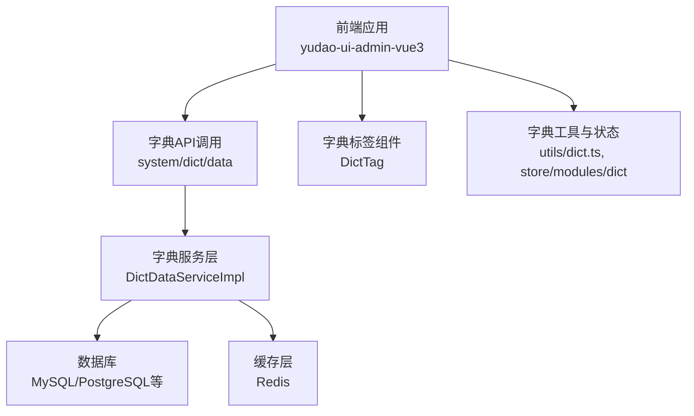
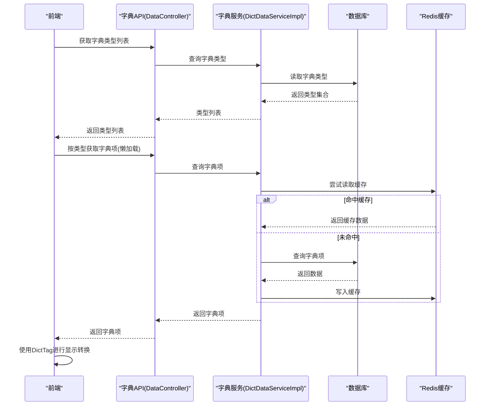
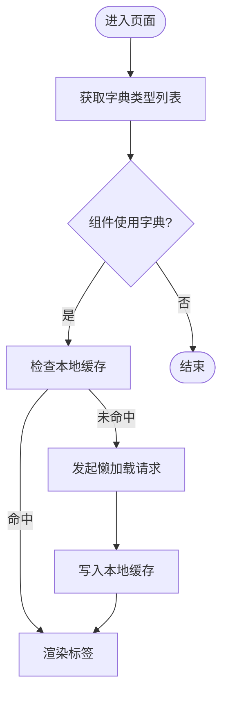
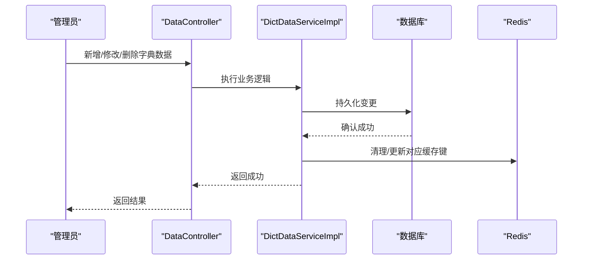
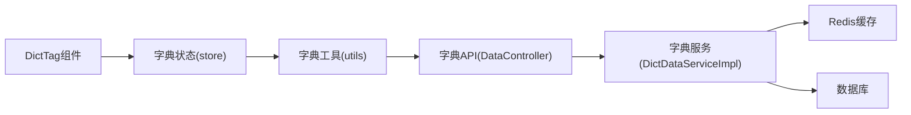

# 字典数据管理

<cite>
**本文引用的文件**
- [DictTag.vue](file://yudao-ui-admin-vue3/src/components/DictTag/DictTag.vue)
- [dict.ts](file://yudao-ui-admin-vue3/src/utils/dict.ts)
- [index.ts](file://yudao-ui-admin-vue3/src/store/modules/dict/index.ts)
- [system_dict_api.ts](file://yudao-ui-admin-vue3/src/api/system/dict/data/index.ts)
- [SystemDictDataApi.java](file://yudao-cloud/yudao-module-system/yudao-module-system-server/src/main/java/cn/iocoder/yudao/module/system/controller/admin/dict/DataController.java)
- [SystemDictServiceImpl.java](file://yudao-cloud/yudao-module-system/yudao-module-system-server/src/main/java/cn/iocoder/yudao/module/system/service/dict/DictDataServiceImpl.java)
- [RedisUtil.java](file://yudao-framework/yudao-spring-boot-starter-redis/src/main/java/cn/iocoder/yudao/framework/redis/util/RedisUtils.java)
- [application.yaml](file://yudao-cloud/yudao-server/src/main/resources/application.yaml)
</cite>

## 目录
1. [简介](#简介)
2. [项目结构](#项目结构)
3. [核心组件](#核心组件)
4. [架构总览](#架构总览)
5. [详细组件分析](#详细组件分析)
6. [依赖关系分析](#依赖关系分析)
7. [性能考虑](#性能考虑)
8. [故障排查指南](#故障排查指南)
9. [结论](#结论)
10. [附录](#附录)

## 简介
本文件面向“字典数据管理”能力，系统性说明后端存储结构与缓存策略、加载机制（懒加载、预加载、增量更新）、前后端使用方式（前端显示转换与后端数据映射），以及维护接口（新增、修改、删除）的实现要点。同时给出性能优化建议（缓存策略、批量加载等），帮助读者快速掌握并高效使用该能力。

## 项目结构
本项目采用前后端分离的模块化架构：
- 前端（Vue3）通过统一的字典工具与组件完成字典数据的获取、缓存与展示转换。
- 后端（Spring Boot）提供字典数据的查询与维护接口，结合 Redis 进行缓存以提升读取性能。
- 系统模块负责字典数据的持久化与业务逻辑封装。



图表来源
- [SystemDictDataApi.java:1-200](file://yudao-cloud/yudao-module-system/yudao-module-system-server/src/main/java/cn/iocoder/yudao/module/system/controller/admin/dict/DataController.java#L1-L200)
- [SystemDictServiceImpl.java:1-300](file://yudao-cloud/yudao-module-system/yudao-module-system-server/src/main/java/cn/iocoder/yudao/module/system/service/dict/DictDataServiceImpl.java#L1-L300)
- [dict.ts:1-200](file://yudao-ui-admin-vue3/src/utils/dict.ts#L1-L200)
- [index.ts:1-200](file://yudao-ui-admin-vue3/src/store/modules/dict/index.ts#L1-L200)
- [DictTag.vue:1-200](file://yudao-ui-admin-vue3/src/components/DictTag/DictTag.vue#L1-L200)

章节来源
- [SystemDictDataApi.java:1-200](file://yudao-cloud/yudao-module-system/yudao-module-system-server/src/main/java/cn/iocoder/yudao/module/system/controller/admin/dict/DataController.java#L1-L200)
- [SystemDictServiceImpl.java:1-300](file://yudao-cloud/yudao-module-system/yudao-module-system-server/src/main/java/cn/iocoder/yudao/module/system/service/dict/DictDataServiceImpl.java#L1-L300)
- [dict.ts:1-200](file://yudao-ui-admin-vue3/src/utils/dict.ts#L1-L200)
- [index.ts:1-200](file://yudao-ui-admin-vue3/src/store/modules/dict/index.ts#L1-L200)
- [DictTag.vue:1-200](file://yudao-ui-admin-vue3/src/components/DictTag/DictTag.vue#L1-L200)

## 核心组件
- 前端字典工具与状态管理
  - utils/dict.ts：提供字典类型列表获取、按类型取值、本地缓存、懒加载等能力。
  - store/modules/dict/index.ts：集中管理字典类型的缓存状态，支持全局刷新与按需更新。
  - components/DictTag/DictTag.vue：通用字典标签组件，根据 value 自动匹配 label 并渲染。
- 后端字典服务与控制器
  - DataController：暴露字典数据查询与维护接口（分页查询、按类型查询、新增、修改、删除）。
  - DictDataServiceImpl：实现字典数据的服务逻辑，包含缓存读写、数据转换、权限校验等。
- 缓存基础设施
  - RedisUtils：统一 Redis 操作封装，用于字典数据的缓存存取。
  - application.yaml：配置 Redis 连接与相关参数。

章节来源
- [dict.ts:1-200](file://yudao-ui-admin-vue3/src/utils/dict.ts#L1-L200)
- [index.ts:1-200](file://yudao-ui-admin-vue3/src/store/modules/dict/index.ts#L1-L200)
- [DictTag.vue:1-200](file://yudao-ui-admin-vue3/src/components/DictTag/DictTag.vue#L1-L200)
- [SystemDictDataApi.java:1-200](file://yudao-cloud/yudao-module-system/yudao-module-system-server/src/main/java/cn/iocoder/yudao/module/system/controller/admin/dict/DataController.java#L1-L200)
- [SystemDictServiceImpl.java:1-300](file://yudao-cloud/yudao-module-system/yudao-module-system-server/src/main/java/cn/iocoder/yudao/module/system/service/dict/DictDataServiceImpl.java#L1-L300)
- [RedisUtil.java:1-200](file://yudao-framework/yudao-spring-boot-starter-redis/src/main/java/cn/iocoder/yudao/framework/redis/util/RedisUtils.java#L1-L200)
- [application.yaml:1-200](file://yudao-cloud/yudao-server/src/main/resources/application.yaml#L1-L200)

## 架构总览
字典数据在系统中的流转路径如下：
- 前端首次访问页面时，按需发起字典类型列表请求；随后对具体字典项进行懒加载。
- 后端从数据库读取字典数据，写入 Redis 缓存，返回给前端。
- 前端将字典数据缓存到内存（Vuex/Pinia），并在组件中通过 DictTag 进行显示转换。
- 当字典数据发生变更（新增、修改、删除）时，后端清理或更新对应缓存键，确保一致性。



图表来源
- [SystemDictDataApi.java:1-200](file://yudao-cloud/yudao-module-system/yudao-module-system-server/src/main/java/cn/iocoder/yudao/module/system/controller/admin/dict/DataController.java#L1-L200)
- [SystemDictServiceImpl.java:1-300](file://yudao-cloud/yudao-module-system/yudao-module-system-server/src/main/java/cn/iocoder/yudao/module/system/service/dict/DictDataServiceImpl.java#L1-L300)
- [dict.ts:1-200](file://yudao-ui-admin-vue3/src/utils/dict.ts#L1-L200)
- [RedisUtil.java:1-200](file://yudao-framework/yudao-spring-boot-starter-redis/src/main/java/cn/iocoder/yudao/framework/redis/util/RedisUtils.java#L1-L200)

## 详细组件分析

### 前端字典工具与状态管理（utils/dict.ts, store/modules/dict/index.ts）
- 职责
  - 统一管理字典类型列表与字典项缓存。
  - 提供懒加载：仅在需要时请求具体字典项。
  - 提供全局刷新：当字典数据变更时，主动失效本地缓存并重新拉取。
- 关键流程
  - 初始化时获取字典类型列表。
  - 组件首次使用某类型时，检查本地缓存是否命中；未命中则发起请求并缓存。
  - 字典项变更时，触发 store 中的刷新动作，清空对应类型缓存。



图表来源
- [dict.ts:1-200](file://yudao-ui-admin-vue3/src/utils/dict.ts#L1-L200)
- [index.ts:1-200](file://yudao-ui-admin-vue3/src/store/modules/dict/index.ts#L1-L200)

章节来源
- [dict.ts:1-200](file://yudao-ui-admin-vue3/src/utils/dict.ts#L1-L200)
- [index.ts:1-200](file://yudao-ui-admin-vue3/src/store/modules/dict/index.ts#L1-L200)

### 字典标签组件（components/DictTag/DictTag.vue）
- 职责
  - 接收 value 与 dictType，自动查找对应 label 并渲染。
  - 支持多值场景（逗号分隔）与默认回退文本。
- 使用方式
  - 在表格或表单中直接引用，传入字段值与字典类型即可。
  - 组件内部依赖前端字典缓存，若未命中则触发懒加载。

```mermaid
classDiagram
class DictTag {
+props : value, dictType, multiple
+computed : label()
+methods : fetchIfNeeded()
}
DictTag --> Store["字典状态(store/modules/dict)"] : "读取/刷新"
DictTag --> Utils["字典工具(utils/dict)"] : "懒加载"
```

图表来源
- [DictTag.vue:1-200](file://yudao-ui-admin-vue3/src/components/DictTag/DictTag.vue#L1-L200)
- [index.ts:1-200](file://yudao-ui-admin-vue3/src/store/modules/dict/index.ts#L1-L200)
- [dict.ts:1-200](file://yudao-ui-admin-vue3/src/utils/dict.ts#L1-L200)

章节来源
- [DictTag.vue:1-200](file://yudao-ui-admin-vue3/src/components/DictTag/DictTag.vue#L1-L200)

### 后端字典服务与控制器（DataController, DictDataServiceImpl）
- 职责
  - 提供字典类型与字典项的查询接口。
  - 实现新增、修改、删除字典数据的管理接口。
  - 负责缓存策略：读优先走缓存，写后清理或更新缓存。
- 关键流程
  - 查询：先查缓存，未命中再查库，并将结果写入缓存。
  - 维护：执行变更后，清理对应字典类型的缓存键，保证后续读取为最新数据。



图表来源
- [SystemDictDataApi.java:1-200](file://yudao-cloud/yudao-module-system/yudao-module-system-server/src/main/java/cn/iocoder/yudao/module/system/controller/admin/dict/DataController.java#L1-L200)
- [SystemDictServiceImpl.java:1-300](file://yudao-cloud/yudao-module-system/yudao-module-system-server/src/main/java/cn/iocoder/yudao/module/system/service/dict/DictDataServiceImpl.java#L1-L300)
- [RedisUtil.java:1-200](file://yudao-framework/yudao-spring-boot-starter-redis/src/main/java/cn/iocoder/yudao/framework/redis/util/RedisUtils.java#L1-L200)

章节来源
- [SystemDictDataApi.java:1-200](file://yudao-cloud/yudao-module-system/yudao-module-system-server/src/main/java/cn/iocoder/yudao/module/system/controller/admin/dict/DataController.java#L1-L200)
- [SystemDictServiceImpl.java:1-300](file://yudao-cloud/yudao-module-system/yudao-module-system-server/src/main/java/cn/iocoder/yudao/module/system/service/dict/DictDataServiceImpl.java#L1-L300)

### 缓存基础设施（RedisUtils, application.yaml）
- 职责
  - 提供统一的 Redis 操作封装，简化字典缓存的存取。
  - 通过配置文件管理连接信息与超时等参数。
- 关键点
  - 字典缓存键设计：通常以字典类型为维度，便于批量清理。
  - 过期策略：可设置合理 TTL，避免脏数据长期驻留。

章节来源
- [RedisUtil.java:1-200](file://yudao-framework/yudao-spring-boot-starter-redis/src/main/java/cn/iocoder/yudao/framework/redis/util/RedisUtils.java#L1-L200)
- [application.yaml:1-200](file://yudao-cloud/yudao-server/src/main/resources/application.yaml#L1-L200)

## 依赖关系分析
- 前端依赖
  - DictTag 依赖字典工具与状态管理，用于显示转换。
  - 字典工具依赖 store 进行全局缓存与刷新。
- 后端依赖
  - DataController 依赖 DictDataServiceImpl 实现业务逻辑。
  - DictDataServiceImpl 依赖 RedisUtils 进行缓存操作，依赖数据库进行持久化。
- 外部依赖
  - Redis 作为分布式缓存，提升读取性能。
  - 数据库作为权威数据源，保证数据一致性。



图表来源
- [DictTag.vue:1-200](file://yudao-ui-admin-vue3/src/components/DictTag/DictTag.vue#L1-L200)
- [index.ts:1-200](file://yudao-ui-admin-vue3/src/store/modules/dict/index.ts#L1-L200)
- [dict.ts:1-200](file://yudao-ui-admin-vue3/src/utils/dict.ts#L1-L200)
- [SystemDictDataApi.java:1-200](file://yudao-cloud/yudao-module-system/yudao-module-system-server/src/main/java/cn/iocoder/yudao/module/system/controller/admin/dict/DataController.java#L1-L200)
- [SystemDictServiceImpl.java:1-300](file://yudao-cloud/yudao-module-system/yudao-module-system-server/src/main/java/cn/iocoder/yudao/module/system/service/dict/DictDataServiceImpl.java#L1-L300)
- [RedisUtil.java:1-200](file://yudao-framework/yudao-spring-boot-starter-redis/src/main/java/cn/iocoder/yudao/framework/redis/util/RedisUtils.java#L1-L200)

章节来源
- [DictTag.vue:1-200](file://yudao-ui-admin-vue3/src/components/DictTag/DictTag.vue#L1-L200)
- [index.ts:1-200](file://yudao-ui-admin-vue3/src/store/modules/dict/index.ts#L1-L200)
- [dict.ts:1-200](file://yudao-ui-admin-vue3/src/utils/dict.ts#L1-L200)
- [SystemDictDataApi.java:1-200](file://yudao-cloud/yudao-module-system/yudao-module-system-server/src/main/java/cn/iocoder/yudao/module/system/controller/admin/dict/DataController.java#L1-L200)
- [SystemDictServiceImpl.java:1-300](file://yudao-cloud/yudao-module-system/yudao-module-system-server/src/main/java/cn/iocoder/yudao/module/system/service/dict/DictDataServiceImpl.java#L1-L300)
- [RedisUtil.java:1-200](file://yudao-framework/yudao-spring-boot-starter-redis/src/main/java/cn/iocoder/yudao/framework/redis/util/RedisUtils.java#L1-L200)

## 性能考虑
- 缓存策略
  - 读路径：优先从 Redis 读取，未命中再查库并回填缓存，降低数据库压力。
  - 写路径：变更后立即清理或更新对应字典类型的缓存键，保证一致性。
  - 前端缓存：字典项缓存在内存中，减少重复请求；支持全局刷新以应对变更。
- 懒加载与预加载
  - 懒加载：仅在组件首次使用时请求具体字典项，降低初始负载。
  - 预加载：可在页面初始化时批量拉取常用字典类型，提升首屏体验。
- 批量加载
  - 后端支持按类型批量查询字典项，减少网络往返次数。
  - 前端可对多个字典类型进行并发请求，缩短整体等待时间。
- 缓存键与过期
  - 以字典类型为维度组织缓存键，便于批量清理。
  - 合理设置 TTL，平衡一致性与性能。

[本节为通用性能指导，不直接分析具体文件]

## 故障排查指南
- 前端问题
  - 现象：字典标签显示为空或错误。
  - 排查：检查字典类型是否正确、本地缓存是否命中、懒加载是否被触发。
  - 处理：必要时触发全局刷新，清除本地缓存并重新拉取。
- 后端问题
  - 现象：字典数据未生效或显示旧值。
  - 排查：检查写操作后是否清理了缓存键；确认 Redis 连接与键命名规范。
  - 处理：修正缓存清理逻辑，验证缓存键与过期策略。
- 缓存问题
  - 现象：频繁缓存穿透或热点键抖动。
  - 排查：检查是否存在空结果缓存、TTL 是否过短、是否存在并发写冲突。
  - 处理：引入空值缓存、调整 TTL、增加分布式锁或幂等写保护。

章节来源
- [dict.ts:1-200](file://yudao-ui-admin-vue3/src/utils/dict.ts#L1-L200)
- [index.ts:1-200](file://yudao-ui-admin-vue3/src/store/modules/dict/index.ts#L1-L200)
- [SystemDictDataApi.java:1-200](file://yudao-cloud/yudao-module-system/yudao-module-system-server/src/main/java/cn/iocoder/yudao/module/system/controller/admin/dict/DataController.java#L1-L200)
- [SystemDictServiceImpl.java:1-300](file://yudao-cloud/yudao-module-system/yudao-module-system-server/src/main/java/cn/iocoder/yudao/module/system/service/dict/DictDataServiceImpl.java#L1-L300)
- [RedisUtil.java:1-200](file://yudao-framework/yudao-spring-boot-starter-redis/src/main/java/cn/iocoder/yudao/framework/redis/util/RedisUtils.java#L1-L200)

## 结论
本方案通过前后端协同的字典管理机制，实现了高效的字典数据加载与展示转换。借助 Redis 缓存与前端内存缓存，显著降低了数据库压力并提升了用户体验。通过懒加载、预加载与批量加载策略，进一步优化了性能。维护接口提供了完整的增删改能力，配合合理的缓存清理策略，保证了数据的一致性与实时性。

[本节为总结性内容，不直接分析具体文件]

## 附录
- 字典类型分类与管理
  - 字典类型用于区分不同业务维度的字典数据，如状态、性别、优先级等。
  - 建议在数据库中为字典类型建立索引，便于快速检索。
- 使用示例
  - 前端：在表格列中使用 DictTag，传入字段值与字典类型。
  - 后端：通过 DataController 提供的接口进行字典数据的查询与维护。
- 最佳实践
  - 字典类型命名规范：使用小写字母与下划线，体现业务语义。
  - 缓存键设计：以字典类型为维度，避免细粒度键导致的管理复杂度。
  - 变更通知：在字典数据变更后，主动清理缓存并通知前端刷新。

[本节为补充信息，不直接分析具体文件]